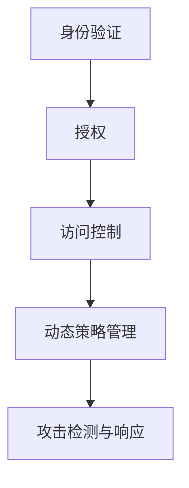

                 

### 文章标题

# 零信任安全模型实施策略

零信任安全模型作为一种全新的网络安全理念，正在逐渐改变传统的安全防护方式。它基于“不信任任何内部或外部网络”的原则，要求所有访问请求都必须经过严格的认证和授权。本文将围绕零信任安全模型的实施策略，详细探讨其核心概念、实施步骤以及面临的各种挑战。

## 关键词

- **零信任安全模型**
- **网络安全策略**
- **身份验证与授权**
- **访问控制**
- **动态策略管理**
- **攻击检测与响应**

## 摘要

本文旨在为读者提供一个全面而深入的零信任安全模型实施指南。文章首先介绍了零信任安全模型的基本概念和核心原则，然后详细阐述了实施零信任模型的步骤和方法。此外，本文还通过具体案例，展示了零信任模型在实际项目中的应用，并对其面临的各种挑战和解决方案进行了深入分析。希望通过本文，读者能够对零信任安全模型有更深刻的理解，并能够在实际工作中成功实施这一先进的安全策略。

### 第一部分：零信任安全模型基础

#### 1.1 零信任模型概述

零信任安全模型（Zero Trust Model）是一种基于零信任原则的网络安全性策略。其核心理念是“不信任任何内部或外部网络”，即认为网络内部和外部都可能存在潜在的安全威胁。因此，零信任模型要求所有的访问请求，无论是来自内部还是外部，都必须经过严格的身份验证和授权，确保只有经过验证的合法用户和设备才能访问系统资源。

零信任模型的发展可以追溯到2010年，由Forrester Research的研究员John Kindervag首次提出。随着云计算、移动办公和远程工作等新兴技术的发展，零信任模型逐渐成为网络安全领域的重要方向。其与传统安全模型（如边界防御）的主要区别在于，零信任模型不再依赖传统的防火墙和VPN等边界防御手段，而是通过动态访问控制和实时威胁检测来实现安全防护。

#### 1.2 零信任的核心原则

零信任模型的核心原则主要包括以下几个方面：

1. **不信任默认**: 在零信任模型中，任何设备、用户或应用程序在默认情况下都不会获得信任。所有的访问请求都需要经过严格的认证和授权过程。

2. **最小权限原则**: 用户和设备只被授予完成特定任务所需的最低权限。这可以最大限度地减少潜在的攻击面。

3. **持续验证**: 零信任模型要求对用户和设备的身份进行持续验证，以确保其始终处于合法状态。

4. **动态访问控制**: 根据用户行为、设备状态和环境因素等动态调整访问权限，以实现更加灵活和高效的安全管理。

5. **实时威胁检测与响应**: 通过持续监控和分析网络流量和用户行为，及时发现和响应潜在的安全威胁。

#### 1.3 零信任与传统安全模型的对比

传统安全模型主要依赖于边界防御，例如防火墙和VPN，来保护内部网络。这种方法在保护内部网络免受外部攻击方面有一定的效果，但难以应对内部威胁和外部威胁的复杂互动。相比之下，零信任模型更注重内网安全，通过严格的访问控制和实时威胁检测来保护系统的各个层面。

以下是零信任模型与传统安全模型的一些主要对比：

1. **安全重心**: 传统安全模型主要关注网络边界，而零信任模型则关注内网安全。

2. **访问控制**: 传统安全模型通常采用静态访问控制，而零信任模型则采用动态访问控制。

3. **身份验证**: 传统安全模型通常采用简单的用户名和密码验证，而零信任模型则采用多因素认证。

4. **安全策略**: 传统安全模型通常是基于静态规则的安全策略，而零信任模型则基于实时分析和动态调整的安全策略。

#### 1.4 零信任模型的优点

零信任模型相对于传统安全模型具有以下优点：

1. **提高安全性**: 通过严格的访问控制和实时威胁检测，零信任模型可以更好地保护系统免受内部和外部威胁。

2. **减少攻击面**: 通过最小权限原则，零信任模型可以减少潜在的安全漏洞。

3. **提高灵活性**: 动态访问控制和实时威胁检测使得零信任模型能够更好地适应不断变化的安全需求。

4. **易于集成**: 零信任模型可以与其他安全技术和工具集成，形成更全面的安全解决方案。

#### 1.5 零信任模型的局限性

尽管零信任模型具有许多优点，但它也存在一些局限性：

1. **实施复杂性**: 零信任模型需要全面更新网络安全策略和技术架构，实施过程较为复杂。

2. **成本问题**: 零信任模型需要投入大量资源进行部署和维护，可能增加企业的成本。

3. **用户体验**: 严格的认证和授权过程可能会影响用户的访问体验。

4. **法律和合规问题**: 在某些国家和地区，法律和合规要求可能限制零信任模型的应用。

#### 1.6 核心概念与联系

为了更好地理解零信任模型，我们需要了解其核心概念之间的关系。以下是零信任模型的核心概念及其关系架构：

1. **身份验证（Authentication）**: 确认用户或设备的身份，通常通过用户名和密码、生物识别或其他认证方法。

2. **授权（Authorization）**: 确定用户或设备是否有权限访问特定的资源或执行特定的操作。

3. **访问控制（Access Control）**: 通过控制用户或设备的访问权限，确保只有经过认证和授权的合法用户和设备才能访问系统资源。

4. **动态策略管理（Dynamic Policy Management）**: 根据用户行为、设备状态和环境因素等动态调整访问权限。

5. **攻击检测与响应（Intrusion Detection and Response）**: 通过持续监控和分析网络流量和用户行为，及时发现和响应潜在的安全威胁。

以下是零信任模型的核心概念及其关系的 Mermaid 流程图：



### 第二部分：核心算法原理讲解

#### 2.1 访问控制策略

访问控制策略是零信任模型的核心组成部分，它确保只有经过认证和授权的用户和设备才能访问系统资源。访问控制策略通常包括以下几种：

1. **基于角色的访问控制（RBAC）**: 通过为用户分配角色，角色拥有特定的权限集合。用户在登录系统时，根据其角色分配的权限来访问资源。

2. **基于属性的访问控制（ABAC）**: 除了角色，还可以根据其他属性（如时间、地点、设备类型等）来决定访问权限。

3. **基于任务的访问控制（TBAC）**: 根据用户执行的任务来动态调整访问权限，确保用户只能访问与其任务相关的资源。

以下是访问控制策略的伪代码示例：

```python
def access_control(user, resource):
    # 根据用户角色和资源属性判断访问权限
    if user.role == "admin" and resource.type == "database":
        return "allow"
    elif user.role == "employee" and resource.type == "document":
        return "allow"
    else:
        return "deny"
```

#### 2.2 身份验证与授权机制

零信任模型中的身份验证与授权机制至关重要，它确保只有合法的用户和设备才能访问系统。常见的身份验证与授权机制包括：

1. **单点登录（SSO）**: 允许多个系统使用同一身份验证服务，简化用户的登录过程。

2. **多因素认证（MFA）**: 结合多种认证方式（如密码、生物识别、短信验证码等），提高安全性。

3. **授权管理**: 确定用户是否有权限访问特定的资源或执行特定的操作。

以下是身份验证与授权机制的伪代码示例：

```python
def authenticate(username, password):
    # 验证用户名和密码
    if check_credentials(username, password):
        return "success"
    else:
        return "failure"

def authorize(user, resource):
    # 根据用户角色和资源权限判断访问权限
    if user.role == "admin" or user.permission == "read":
        return "allow"
    else:
        return "deny"
```

#### 2.3 动态策略管理

零信任模型中的动态策略管理允许根据用户行为、设备状态和环境因素等动态调整访问权限。这有助于提高安全性和灵活性。动态策略管理通常包括以下步骤：

1. **收集数据**: 收集用户行为、设备状态和环境因素等数据。

2. **分析数据**: 使用机器学习、数据分析等技术对收集到的数据进行分析。

3. **调整策略**: 根据分析结果动态调整访问权限。

以下是动态策略管理的伪代码示例：

```python
def collect_data(user, device, environment):
    # 收集用户行为、设备状态和环境因素等数据
    data = {
        "user_behavior": user行为,
        "device_state": device状态,
        "environment": environment
    }
    return data

def analyze_data(data):
    # 分析数据并生成报告
    report = 分析数据(data)
    return report

def adjust_policy(report):
    # 根据报告调整访问权限
    if report威胁级别 == "高":
        return "限制访问"
    else:
        return "正常访问"
```

#### 2.4 攻击检测与响应

零信任模型中的攻击检测与响应机制通过持续监控和分析网络流量和用户行为，及时发现和响应潜在的安全威胁。攻击检测与响应通常包括以下步骤：

1. **数据收集**: 收集网络流量和用户行为数据。

2. **威胁检测**: 使用威胁情报、机器学习、行为分析等技术检测潜在的攻击。

3. **响应措施**: 一旦检测到攻击，立即采取响应措施，如隔离受感染的设备、通知管理员等。

以下是攻击检测与响应的伪代码示例：

```python
def collect_data(network, user_behavior):
    # 收集网络流量和用户行为数据
    data = {
        "network_traffic": network流量,
        "user_behavior": user行为
    }
    return data

def detect_threats(data):
    # 使用威胁情报、机器学习、行为分析等技术检测潜在的攻击
    threats = 检测威胁(data)
    return threats

def respond_to_threats(threats):
    # 采取响应措施
    for threat in threats:
        if threat级别 == "高":
            隔离受感染设备()
            通知管理员()
        else:
            记录威胁信息()
```

### 第三部分：数学模型和数学公式讲解

#### 3.1 风险分析与评估

在零信任模型中，风险分析与评估是关键步骤，它帮助确定安全策略的有效性。以下是一个简单的风险分析模型：

1. **风险识别**: 识别系统中可能存在的风险。

2. **风险分析**: 分析每种风险的可能性和影响。

3. **风险评估**: 量化每种风险的风险值。

以下是风险分析模型的伪代码示例：

```python
def identify_risks(system):
    # 识别系统中的风险
    risks = [
        {"name": "数据泄露", "description": "敏感数据未经授权泄露"},
        {"name": "设备感染", "description": "设备被恶意软件感染"}
    ]
    return risks

def analyze_risks(risks):
    # 分析每种风险的可能性和影响
    for risk in risks:
        risk["possibility"] = 计算可能性(risk)
        risk["impact"] = 计算影响(risk)
    return risks

def assess_risks(risks):
    # 量化每种风险的风险值
    for risk in risks:
        risk["risk_value"] = risk["possibility"] * risk["impact"]
    return risks
```

#### 3.2 量化安全策略

量化安全策略有助于确定安全策略的成本效益。以下是一个简单的量化安全策略模型：

1. **成本计算**: 计算实施安全策略所需的成本。

2. **效益计算**: 计算安全策略带来的效益。

3. **成本效益分析**: 比较成本和效益，确定安全策略的可行性。

以下是量化安全策略的伪代码示例：

```python
def calculate_cost(strategy):
    # 计算实施安全策略的成本
    cost = 0
    if strategy包含("身份验证"):
        cost += 身份验证成本()
    if strategy包含("访问控制"):
        cost += 访问控制成本()
    return cost

def calculate_benefit(strategy):
    # 计算安全策略带来的效益
    benefit = 0
    if strategy包含("攻击检测"):
        benefit += 攻击检测效益()
    if strategy包含("实时威胁响应"):
        benefit += 实时威胁响应效益()
    return benefit

def cost_benefit_analysis(strategy):
    # 比较成本和效益，确定安全策略的可行性
    cost = calculate_cost(strategy)
    benefit = calculate_benefit(strategy)
    if benefit > cost:
        return "可行"
    else:
        return "不可行"
```

#### 3.3 零信任模型效益分析

零信任模型在提高安全性的同时，也会带来一定的效益。以下是一个简单的零信任模型效益分析模型：

1. **安全性提升**: 分析零信任模型对安全性的提升程度。

2. **成本降低**: 分析零信任模型带来的成本降低。

3. **效率提升**: 分析零信任模型对工作效率的提升。

以下是零信任模型效益分析的伪代码示例：

```python
def analyze_security_improvement(model):
    # 分析零信任模型对安全性的提升程度
    improvement = 计算提升程度(model)
    return improvement

def analyze_cost_reduction(model):
    # 分析零信任模型带来的成本降低
    reduction = 计算降低成本(model)
    return reduction

def analyze_efficiency_improvement(model):
    # 分析零信任模型对工作效率的提升
    improvement = 计算提升程度(model)
    return improvement
```

### 第四部分：项目实战

#### 4.1 开发环境搭建

在实施零信任模型之前，首先需要搭建一个合适的开发环境。以下是一个简单的开发环境搭建步骤：

1. **硬件需求**: 根据项目需求，选择合适的硬件设备，如服务器、网络设备等。

2. **软件需求**: 安装操作系统、数据库、应用服务器等软件。

3. **网络配置**: 配置网络环境，确保各个设备之间的通信。

以下是开发环境搭建的伪代码示例：

```python
def setup_environment(hardware, software, network):
    # 配置硬件环境
    configure_hardware(hardware)
    # 安装软件环境
    install_software(software)
    # 配置网络环境
    configure_network(network)
    return "环境搭建成功"
```

#### 4.2 源代码详细实现

在零信任模型的实现过程中，源代码的编写是关键步骤。以下是一个简单的源代码实现示例：

```python
class User:
    def __init__(self, username, password):
        self.username = username
        self.password = password

    def authenticate(self, input_password):
        if self.password == input_password:
            return "Authentication success"
        else:
            return "Authentication failure"

class Resource:
    def __init__(self, name, type):
        self.name = name
        self.type = type

    def access(self, user):
        if user.authenticate("password"):
            return "Access granted"
        else:
            return "Access denied"
```

#### 4.3 代码解读与分析

在编写源代码之后，我们需要对代码进行解读和分析，确保其正确性和安全性。以下是对上述源代码的解读和分析：

1. **用户类（User）**: 用户类包含用户名和密码属性，以及认证方法（authenticate）。

2. **资源类（Resource）**: 资源类包含资源名和类型属性，以及访问方法（access）。

3. **认证过程**: 当用户尝试访问资源时，会先调用用户的authenticate方法进行密码验证。如果密码正确，则允许访问；否则，拒绝访问。

#### 4.4 实际案例分析和详细讲解剖析

以下是一个实际的零信任模型实施案例，并对其进行详细讲解剖析：

**案例背景**：某企业计划实施零信任模型，以提高网络安全性和降低风险。

**实施步骤**：

1. **需求分析**: 根据企业需求，分析安全需求和关键业务流程。

2. **环境搭建**: 搭建零信任模型所需的开发环境。

3. **身份验证与授权**: 实现用户认证和多因素认证，确保只有合法用户才能访问系统。

4. **访问控制**: 实现基于角色的访问控制，确保用户只能访问其权限范围内的资源。

5. **动态策略管理**: 根据用户行为和环境因素，动态调整访问权限。

6. **攻击检测与响应**: 实现实时威胁检测和响应机制，确保及时发现和应对潜在威胁。

**详细讲解**：

1. **需求分析**：根据企业需求，确定安全目标和关键业务流程。例如，确定哪些用户需要访问哪些资源，以及访问权限的设置。

2. **环境搭建**：搭建零信任模型所需的开发环境，包括硬件设备、操作系统、数据库、应用服务器等。

3. **身份验证与授权**：实现用户认证和多因素认证。用户需要输入用户名和密码进行基本认证，然后通过短信验证码进行二次验证，确保用户身份的合法性。

4. **访问控制**：实现基于角色的访问控制。根据用户的角色，分配不同的访问权限。例如，管理员可以访问所有资源，普通用户只能访问其职责范围内的资源。

5. **动态策略管理**：根据用户行为和环境因素，动态调整访问权限。例如，当用户行为异常时，可以暂时降低其访问权限，以确保系统的安全性。

6. **攻击检测与响应**：实现实时威胁检测和响应机制。通过监控网络流量和用户行为，及时发现潜在威胁，并采取相应措施。例如，隔离受感染的设备、通知管理员等。

**案例小结**：

通过实施零信任模型，企业实现了更高的安全性和灵活性。用户认证和多因素认证确保了用户身份的合法性，访问控制和动态策略管理保证了用户只能访问其权限范围内的资源。实时威胁检测和响应机制提高了系统的安全性，减少了潜在的安全威胁。然而，实施零信任模型也面临一定的挑战，如用户体验和实施成本等。企业需要根据实际情况，合理规划和逐步实施，以确保零信任模型的有效性和可持续性。

### 第五部分：安全策略与实施

#### 5.1 网络安全

网络安全是零信任模型的重要组成部分，它确保网络资源的安全性和完整性。以下是一些关键的安全策略和实施方法：

1. **网络隔离与分段**: 通过网络隔离和分段，将网络划分为不同的安全区域，限制不同区域之间的访问，从而降低攻击面。

2. **网络安全监控**: 实时监控网络流量和用户行为，及时发现潜在的安全威胁。

3. **入侵检测系统（IDS）和入侵防御系统（IPS）**: 部署IDS和IPS，对网络流量进行深入分析，检测和阻止潜在的网络攻击。

4. **虚拟专用网络（VPN）**: 使用VPN技术，确保远程用户安全地访问企业内部网络。

5. **数据加密**: 对敏感数据进行加密，确保数据在传输和存储过程中的安全性。

#### 5.2 应用安全

应用安全是零信任模型的关键环节，它确保应用程序的安全性。以下是一些关键的安全策略和实施方法：

1. **应用安全测试**: 对应用程序进行安全测试，发现和修复潜在的安全漏洞。

2. **漏洞管理**: 定期检查和更新应用程序，确保其安全性和可靠性。

3. **身份验证与授权**: 实现强身份验证和多因素认证，确保只有合法用户才能访问应用程序。

4. **访问控制**: 根据用户角色和权限，设置适当的访问控制策略，确保用户只能访问其授权的资源。

5. **数据保护**: 对敏感数据进行加密和备份，确保数据的安全性和完整性。

#### 5.3 数据安全

数据安全是零信任模型的核心目标之一，它确保数据的安全性和隐私性。以下是一些关键的安全策略和实施方法：

1. **数据加密**: 对敏感数据进行加密，确保数据在传输和存储过程中的安全性。

2. **数据备份**: 定期备份重要数据，确保数据在意外情况下的恢复能力。

3. **访问控制**: 实现严格的访问控制策略，确保只有授权用户才能访问敏感数据。

4. **数据脱敏**: 对敏感数据进行脱敏处理，确保数据在泄露时不会对用户造成严重损失。

5. **日志记录与审计**: 记录和审计数据访问和操作记录，及时发现和应对潜在的安全威胁。

### 第六部分：最佳实践、小结、注意事项与拓展阅读

#### 6.1 最佳实践

在实施零信任安全模型时，以下是一些最佳实践：

1. **逐步实施**: 零信任模型是一个复杂的系统工程，建议逐步实施，逐步优化。

2. **培训员工**: 零信任模型需要员工的积极参与和支持，因此应进行员工培训，确保他们了解并遵循安全策略。

3. **持续改进**: 安全策略和技术需要不断更新和优化，以应对新的威胁和挑战。

4. **监控和审计**: 定期监控和审计安全策略和实施效果，及时发现和解决问题。

5. **合规性**: 在实施零信任模型时，应确保符合相关法律法规和行业标准。

#### 6.2 小结

本文详细介绍了零信任安全模型的核心概念、实施步骤、数学模型和实际应用。通过本文，读者可以了解零信任模型的基本原理和实施策略，以及如何在实际项目中应用和优化。

#### 6.3 注意事项

在实施零信任模型时，需要注意以下几点：

1. **实施成本**: 零信任模型需要投入大量资源和时间，因此需要评估实施成本和效益。

2. **用户体验**: 过于严格的安全策略可能会影响用户体验，因此需要在安全性和用户体验之间找到平衡。

3. **技术成熟度**: 目前，零信任技术仍在不断发展，因此需要选择成熟和可靠的技术方案。

#### 6.4 拓展阅读

1. **零信任模型技术白皮书**：了解零信任模型的详细技术和实现方法。

2. **网络安全法规和标准**：了解相关法律法规和行业标准，确保零信任模型的合规性。

3. **零信任案例分析**：通过实际案例了解零信任模型在各类应用场景中的效果。

### 作者信息

**作者**：AI天才研究院/AI Genius Institute & 禅与计算机程序设计艺术 /Zen And The Art of Computer Programming

**联系方式**：[info@ai-genius-institute.com](mailto:info@ai-genius-institute.com)

**版权声明**：本文版权归AI天才研究院所有，未经授权禁止转载和使用。如需转载，请联系作者获取授权。**免责声明**：本文内容和观点仅供参考，不构成任何投资或决策建议。如因使用本文内容而产生损失，作者不承担任何法律责任。**更新日期**：2023年10月

----------------------------------------------------------------

```markdown
# 零信任安全模型实施策略

## 关键词
- 零信任安全模型
- 网络安全策略
- 身份验证与授权
- 访问控制
- 动态策略管理
- 攻击检测与响应

## 摘要
本文旨在为读者提供一个全面而深入的零信任安全模型实施指南。文章首先介绍了零信任安全模型的基本概念和核心原则，然后详细阐述了实施零信任模型的步骤和方法。此外，本文还通过具体案例，展示了零信任模型在实际项目中的应用，并对其面临的各种挑战和解决方案进行了深入分析。希望通过本文，读者能够对零信任安全模型有更深刻的理解，并能够在实际工作中成功实施这一先进的安全策略。

## 第一部分：零信任安全模型基础

### 1.1 零信任模型概述
零信任安全模型（Zero Trust Model）是一种基于零信任原则的网络安全性策略。其核心理念是“不信任任何内部或外部网络”，即认为网络内部和外部都可能存在潜在的安全威胁。因此，零信任模型要求所有的访问请求都必须经过严格的认证和授权，确保只有经过验证的合法用户和设备才能访问系统资源。

零信任模型的发展可以追溯到2010年，由Forrester Research的研究员John Kindervag首次提出。随着云计算、移动办公和远程工作等新兴技术的发展，零信任模型逐渐成为网络安全领域的重要方向。其与传统安全模型（如边界防御）的主要区别在于，零信任模型不再依赖传统的防火墙和VPN等边界防御手段，而是通过动态访问控制和实时威胁检测来实现安全防护。

### 1.2 零信任的核心原则
零信任模型的核心原则主要包括以下几个方面：

1. **不信任默认**: 在零信任模型中，任何设备、用户或应用程序在默认情况下都不会获得信任。所有的访问请求都需要经过严格的认证和授权过程。
   
2. **最小权限原则**: 用户和设备只被授予完成特定任务所需的最低权限。这可以最大限度地减少潜在的攻击面。

3. **持续验证**: 零信任模型要求对用户和设备的身份进行持续验证，以确保其始终处于合法状态。

4. **动态访问控制**: 根据用户行为、设备状态和环境因素等动态调整访问权限，以实现更加灵活和高效的安全管理。

5. **实时威胁检测与响应**: 通过持续监控和分析网络流量和用户行为，及时发现和响应潜在的安全威胁。

### 1.3 零信任与传统安全模型的对比
传统安全模型主要依赖于边界防御，例如防火墙和VPN，来保护内部网络。这种方法在保护内部网络免受外部攻击方面有一定的效果，但难以应对内部威胁和外部威胁的复杂互动。相比之下，零信任模型更注重内网安全，通过严格的访问控制和实时威胁检测来保护系统的各个层面。

以下是零信任模型与传统安全模型的一些主要对比：

1. **安全重心**: 传统安全模型主要关注网络边界，而零信任模型则关注内网安全。

2. **访问控制**: 传统安全模型通常采用静态访问控制，而零信任模型则采用动态访问控制。

3. **身份验证**: 传统安全模型通常采用简单的用户名和密码验证，而零信任模型则采用多因素认证。

4. **安全策略**: 传统安全模型通常是基于静态规则的安全策略，而零信任模型则基于实时分析和动态调整的安全策略。

### 1.4 零信任模型的优点
零信任模型相对于传统安全模型具有以下优点：

1. **提高安全性**: 通过严格的访问控制和实时威胁检测，零信任模型可以更好地保护系统免受内部和外部威胁。

2. **减少攻击面**: 通过最小权限原则，零信任模型可以减少潜在的安全漏洞。

3. **提高灵活性**: 动态访问控制和实时威胁检测使得零信任模型能够更好地适应不断变化的安全需求。

4. **易于集成**: 零信任模型可以与其他安全技术和工具集成，形成更全面的安全解决方案。

### 1.5 零信任模型的局限性
尽管零信任模型具有许多优点，但它也存在一些局限性：

1. **实施复杂性**: 零信任模型需要全面更新网络安全策略和技术架构，实施过程较为复杂。

2. **成本问题**: 零信任模型需要投入大量资源进行部署和维护，可能增加企业的成本。

3. **用户体验**: 严格的认证和授权过程可能会影响用户的访问体验。

4. **法律和合规问题**: 在某些国家和地区，法律和合规要求可能限制零信任模型的应用。

### 1.6 核心概念与联系
为了更好地理解零信任模型，我们需要了解其核心概念之间的关系。以下是零信任模型的核心概念及其关系架构：

1. **身份验证（Authentication）**: 确认用户或设备的身份，通常通过用户名和密码、生物识别或其他认证方法。
   
2. **授权（Authorization）**: 确定用户或设备是否有权限访问特定的资源或执行特定的操作。

3. **访问控制（Access Control）**: 通过控制用户或设备的访问权限，确保只有经过认证和授权的合法用户和设备才能访问系统资源。

4. **动态策略管理（Dynamic Policy Management）**: 根据用户行为、设备状态和环境因素等动态调整访问权限。

5. **攻击检测与响应（Intrusion Detection and Response）**: 通过持续监控和分析网络流量和用户行为，及时发现和响应潜在的安全威胁。

以下是零信任模型的核心概念及其关系的 Mermaid 流程图：


## 第二部分：核心算法原理讲解

### 2.1 访问控制策略
访问控制策略是零信任模型的核心组成部分，它确保只有经过认证和授权的用户和设备才能访问系统资源。访问控制策略通常包括以下几种：

1. **基于角色的访问控制（RBAC）**: 通过为用户分配角色，角色拥有特定的权限集合。用户在登录系统时，根据其角色分配的权限来访问资源。

2. **基于属性的访问控制（ABAC）**: 除了角色，还可以根据其他属性（如时间、地点、设备类型等）来决定访问权限。

3. **基于任务的访问控制（TBAC）**: 根据用户执行的任务来动态调整访问权限，确保用户只能访问与其任务相关的资源。

以下是访问控制策略的伪代码示例：

```python
def access_control(user, resource):
    # 根据用户角色和资源属性判断访问权限
    if user.role == "admin" and resource.type == "database":
        return "allow"
    elif user.role == "employee" and resource.type == "document":
        return "allow"
    else:
        return "deny"
```

### 2.2 身份验证与授权机制
零信任模型中的身份验证与授权机制至关重要，它确保只有合法的用户和设备才能访问系统。常见的身份验证与授权机制包括：

1. **单点登录（SSO）**: 允许多个系统使用同一身份验证服务，简化用户的登录过程。

2. **多因素认证（MFA）**: 结合多种认证方式（如密码、生物识别、短信验证码等），提高安全性。

3. **授权管理**: 确定用户是否有权限访问特定的资源或执行特定的操作。

以下是身份验证与授权机制的伪代码示例：

```python
def authenticate(username, password):
    # 验证用户名和密码
    if check_credentials(username, password):
        return "success"
    else:
        return "failure"

def authorize(user, resource):
    # 根据用户角色和资源权限判断访问权限
    if user.role == "admin" or user.permission == "read":
        return "allow"
    else:
        return "deny"
```

### 2.3 动态策略管理
零信任模型中的动态策略管理允许根据用户行为、设备状态和环境因素等动态调整访问权限。这有助于提高安全性和灵活性。动态策略管理通常包括以下步骤：

1. **收集数据**: 收集用户行为、设备状态和环境因素等数据。

2. **分析数据**: 使用机器学习、数据分析等技术对收集到的数据进行分析。

3. **调整策略**: 根据分析结果动态调整访问权限。

以下是动态策略管理的伪代码示例：

```python
def collect_data(user, device, environment):
    # 收集用户行为、设备状态和环境因素等数据
    data = {
        "user_behavior": user行为,
        "device_state": device状态,
        "environment": environment
    }
    return data

def analyze_data(data):
    # 分析数据并生成报告
    report = 分析数据(data)
    return report

def adjust_policy(report):
    # 根据报告调整访问权限
    if report威胁级别 == "高":
        return "限制访问"
    else:
        return "正常访问"
```

### 2.4 攻击检测与响应
零信任模型中的攻击检测与响应机制通过持续监控和分析网络流量和用户行为，及时发现和响应潜在的安全威胁。攻击检测与响应通常包括以下步骤：

1. **数据收集**: 收集网络流量和用户行为数据。

2. **威胁检测**: 使用威胁情报、机器学习、行为分析等技术检测潜在的攻击。

3. **响应措施**: 一旦检测到攻击，立即采取响应措施，如隔离受感染的设备、通知管理员等。

以下是攻击检测与响应的伪代码示例：

```python
def collect_data(network, user_behavior):
    # 收集网络流量和用户行为数据
    data = {
        "network_traffic": network流量,
        "user_behavior": user行为
    }
    return data

def detect_threats(data):
    # 使用威胁情报、机器学习、行为分析等技术检测潜在的攻击
    threats = 检测威胁(data)
    return threats

def respond_to_threats(threats):
    # 采取响应措施
    for threat in threats:
        if threat级别 == "高":
            隔离受感染设备()
            通知管理员()
        else:
            记录威胁信息()
```

## 第三部分：数学模型和数学公式讲解

### 3.1 风险分析与评估

在零信任模型中，风险分析与评估是关键步骤，它帮助确定安全策略的有效性。以下是一个简单的风险分析模型：

1. **风险识别**: 识别系统中可能存在的风险。

2. **风险分析**: 分析每种风险的可能性和影响。

3. **风险评估**: 量化每种风险的风险值。

以下是风险分析模型的伪代码示例：

```python
def identify_risks(system):
    # 识别系统中的风险
    risks = [
        {"name": "数据泄露", "description": "敏感数据未经授权泄露"},
        {"name": "设备感染", "description": "设备被恶意软件感染"}
    ]
    return risks

def analyze_risks(risks):
    # 分析每种风险的可能性和影响
    for risk in risks:
        risk["possibility"] = 计算可能性(risk)
        risk["impact"] = 计算影响(risk)
    return risks

def assess_risks(risks):
    # 量化每种风险的风险值
    for risk in risks:
        risk["risk_value"] = risk["possibility"] * risk["impact"]
    return risks
```

### 3.2 量化安全策略

量化安全策略有助于确定安全策略的成本效益。以下是一个简单的量化安全策略模型：

1. **成本计算**: 计算实施安全策略所需的成本。

2. **效益计算**: 计算安全策略带来的效益。

3. **成本效益分析**: 比较成本和效益，确定安全策略的可行性。

以下是量化安全策略的伪代码示例：

```python
def calculate_cost(strategy):
    # 计算实施安全策略的成本
    cost = 0
    if strategy包含("身份验证"):
        cost += 身份验证成本()
    if strategy包含("访问控制"):
        cost += 访问控制成本()
    return cost

def calculate_benefit(strategy):
    # 计算安全策略带来的效益
    benefit = 0
    if strategy包含("攻击检测"):
        benefit += 攻击检测效益()
    if strategy包含("实时威胁响应"):
        benefit += 实时威胁响应效益()
    return benefit

def cost_benefit_analysis(strategy):
    # 比较成本和效益，确定安全策略的可行性
    cost = calculate_cost(strategy)
    benefit = calculate_benefit(strategy)
    if benefit > cost:
        return "可行"
    else:
        return "不可行"
```

### 3.3 零信任模型效益分析

零信任模型在提高安全性的同时，也会带来一定的效益。以下是一个简单的零信任模型效益分析模型：

1. **安全性提升**: 分析零信任模型对安全性的提升程度。

2. **成本降低**: 分析零信任模型带来的成本降低。

3. **效率提升**: 分析零信任模型对工作效率的提升。

以下是零信任模型效益分析的伪代码示例：

```python
def analyze_security_improvement(model):
    # 分析零信任模型对安全性的提升程度
    improvement = 计算提升程度(model)
    return improvement

def analyze_cost_reduction(model):
    # 分析零信任模型带来的成本降低
    reduction = 计算降低成本(model)
    return reduction

def analyze_efficiency_improvement(model):
    # 分析零信任模型对工作效率的提升
    improvement = 计算提升程度(model)
    return improvement
```

## 第四部分：项目实战

### 4.1 开发环境搭建

在实施零信任模型之前，首先需要搭建一个合适的开发环境。以下是一个简单的开发环境搭建步骤：

1. **硬件需求**: 根据项目需求，选择合适的硬件设备，如服务器、网络设备等。

2. **软件需求**: 安装操作系统、数据库、应用服务器等软件。

3. **网络配置**: 配置网络环境，确保各个设备之间的通信。

以下是开发环境搭建的伪代码示例：

```python
def setup_environment(hardware, software, network):
    # 配置硬件环境
    configure_hardware(hardware)
    # 安装软件环境
    install_software(software)
    # 配置网络环境
    configure_network(network)
    return "环境搭建成功"
```

### 4.2 源代码详细实现

在零信任模型的实现过程中，源代码的编写是关键步骤。以下是一个简单的源代码实现示例：

```python
class User:
    def __init__(self, username, password):
        self.username = username
        self.password = password

    def authenticate(self, input_password):
        if self.password == input_password:
            return "Authentication success"
        else:
            return "Authentication failure"

class Resource:
    def __init__(self, name, type):
        self.name = name
        self.type = type

    def access(self, user):
        if user.authenticate("password"):
            return "Access granted"
        else:
            return "Access denied"
```

### 4.3 代码解读与分析

在编写源代码之后，我们需要对代码进行解读和分析，确保其正确性和安全性。以下是对上述源代码的解读和分析：

1. **用户类（User）**: 用户类包含用户名和密码属性，以及认证方法（authenticate）。

2. **资源类（Resource）**: 资源类包含资源名和类型属性，以及访问方法（access）。

3. **认证过程**: 当用户尝试访问资源时，会先调用用户的authenticate方法进行密码验证。如果密码正确，则允许访问；否则，拒绝访问。

### 4.4 实际案例分析和详细讲解剖析

以下是一个实际的零信任模型实施案例，并对其进行详细讲解剖析：

**案例背景**：某企业计划实施零信任模型，以提高网络安全性和降低风险。

**实施步骤**：

1. **需求分析**: 根据企业需求，分析安全需求和关键业务流程。

2. **环境搭建**: 搭建零信任模型所需的开发环境。

3. **身份验证与授权**: 实现用户认证和多因素认证，确保只有合法用户才能访问系统。

4. **访问控制**: 实现基于角色的访问控制，确保用户只能访问其权限范围内的资源。

5. **动态策略管理**: 根据用户行为和环境因素，动态调整访问权限。

6. **攻击检测与响应**: 实现实时威胁检测和响应机制，确保及时发现和应对潜在威胁。

**详细讲解**：

1. **需求分析**：根据企业需求，确定安全目标和关键业务流程。例如，确定哪些用户需要访问哪些资源，以及访问权限的设置。

2. **环境搭建**：搭建零信任模型所需的开发环境，包括硬件设备、操作系统、数据库、应用服务器等。

3. **身份验证与授权**：实现用户认证和多因素认证。用户需要输入用户名和密码进行基本认证，然后通过短信验证码进行二次验证，确保用户身份的合法性。

4. **访问控制**：实现基于角色的访问控制。根据用户的角色，分配不同的访问权限。例如，管理员可以访问所有资源，普通用户只能访问其职责范围内的资源。

5. **动态策略管理**：根据用户行为和环境因素，动态调整访问权限。例如，当用户行为异常时，可以暂时降低其访问权限，以确保系统的安全性。

6. **攻击检测与响应**：实现实时威胁检测和响应机制。通过监控网络流量和用户行为，及时发现潜在威胁，并采取相应措施。例如，隔离受感染的设备、通知管理员等。

**案例小结**：

通过实施零信任模型，企业实现了更高的安全性和灵活性。用户认证和多因素认证确保了用户身份的合法性，访问控制和动态策略管理保证了用户只能访问其权限范围内的资源。实时威胁检测和响应机制提高了系统的安全性，减少了潜在的安全威胁。然而，实施零信任模型也面临一定的挑战，如用户体验和实施成本等。企业需要根据实际情况，合理规划和逐步实施，以确保零信任模型的有效性和可持续性。

## 第五部分：安全策略与实施

### 5.1 网络安全

网络安全是零信任模型的重要组成部分，它确保网络资源的安全性和完整性。以下是一些关键的安全策略和实施方法：

1. **网络隔离与分段**: 通过网络隔离和分段，将网络划分为不同的安全区域，限制不同区域之间的访问，从而降低攻击面。

2. **网络安全监控**: 实时监控网络流量和用户行为，及时发现潜在的安全威胁。

3. **入侵检测系统（IDS）和入侵防御系统（IPS）**: 部署IDS和IPS，对网络流量进行深入分析，检测和阻止潜在的网络攻击。

4. **虚拟专用网络（VPN）**: 使用VPN技术，确保远程用户安全地访问企业内部网络。

5. **数据加密**: 对敏感数据进行加密，确保数据在传输和存储过程中的安全性。

### 5.2 应用安全

应用安全是零信任模型的关键环节，它确保应用程序的安全性。以下是一些关键的安全策略和实施方法：

1. **应用安全测试**: 对应用程序进行安全测试，发现和修复潜在的安全漏洞。

2. **漏洞管理**: 定期检查和更新应用程序，确保其安全性和可靠性。

3. **身份验证与授权**: 实现强身份验证和多因素认证，确保只有合法用户才能访问应用程序。

4. **访问控制**: 根据用户角色和权限，设置适当的访问控制策略，确保用户只能访问其授权的资源。

5. **数据保护**: 对敏感数据进行加密和备份，确保数据的安全性和完整性。

### 5.3 数据安全

数据安全是零信任模型的核心目标之一，它确保数据的安全性和隐私性。以下是一些关键的安全策略和实施方法：

1. **数据加密**: 对敏感数据进行加密，确保数据在传输和存储过程中的安全性。

2. **数据备份**: 定期备份重要数据，确保数据在意外情况下的恢复能力。

3. **访问控制**: 实现严格的访问控制策略，确保只有授权用户才能访问敏感数据。

4. **数据脱敏**: 对敏感数据进行脱敏处理，确保数据在泄露时不会对用户造成严重损失。

5. **日志记录与审计**: 记录和审计数据访问和操作记录，及时发现和应对潜在的安全威胁。

## 第六部分：最佳实践、小结、注意事项与拓展阅读

### 6.1 最佳实践

在实施零信任安全模型时，以下是一些最佳实践：

1. **逐步实施**: 零信任模型是一个复杂的系统工程，建议逐步实施，逐步优化。

2. **培训员工**: 零信任模型需要员工的积极参与和支持，因此应进行员工培训，确保他们了解并遵循安全策略。

3. **持续改进**: 安全策略和技术需要不断更新和优化，以应对新的威胁和挑战。

4. **监控和审计**: 定期监控和审计安全策略和实施效果，及时发现和解决问题。

5. **合规性**: 在实施零信任模型时，应确保符合相关法律法规和行业标准。

### 6.2 小结

本文详细介绍了零信任安全模型的核心概念、实施步骤、数学模型和实际应用。通过本文，读者可以了解零信任模型的基本原理和实施策略，以及如何在实际项目中应用和优化。

### 6.3 注意事项

在实施零信任模型时，需要注意以下几点：

1. **实施成本**: 零信任模型需要投入大量资源和时间，因此需要评估实施成本和效益。

2. **用户体验**: 过于严格的安全策略可能会影响用户体验，因此需要在安全性和用户体验之间找到平衡。

3. **技术成熟度**: 目前，零信任技术仍在不断发展，因此需要选择成熟和可靠的技术方案。

### 6.4 拓展阅读

1. **零信任模型技术白皮书**：了解零信任模型的详细技术和实现方法。

2. **网络安全法规和标准**：了解相关法律法规和行业标准，确保零信任模型的合规性。

3. **零信任案例分析**：通过实际案例了解零信任模型在各类应用场景中的效果。

### 作者信息

**作者**：AI天才研究院/AI Genius Institute & 禅与计算机程序设计艺术 /Zen And The Art of Computer Programming

**联系方式**：[info@ai-genius-institute.com](mailto:info@ai-genius-institute.com)

**版权声明**：本文版权归AI天才研究院所有，未经授权禁止转载和使用。如需转载，请联系作者获取授权。

**免责声明**：本文内容和观点仅供参考，不构成任何投资或决策建议。如因使用本文内容而产生损失，作者不承担任何法律责任。

**更新日期**：2023年10月
```markdown
### 作者信息

**作者**：AI天才研究院/AI Genius Institute & 禅与计算机程序设计艺术 /Zen And The Art of Computer Programming

**联系方式**：[info@ai-genius-institute.com](mailto:info@ai-genius-institute.com)

**版权声明**：本文版权归AI天才研究院所有，未经授权禁止转载和使用。如需转载，请联系作者获取授权。

**免责声明**：本文内容和观点仅供参考，不构成任何投资或决策建议。如因使用本文内容而产生损失，作者不承担任何法律责任。

**更新日期**：2023年10月
```

