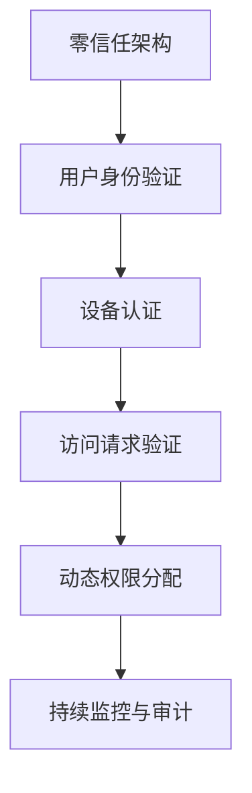
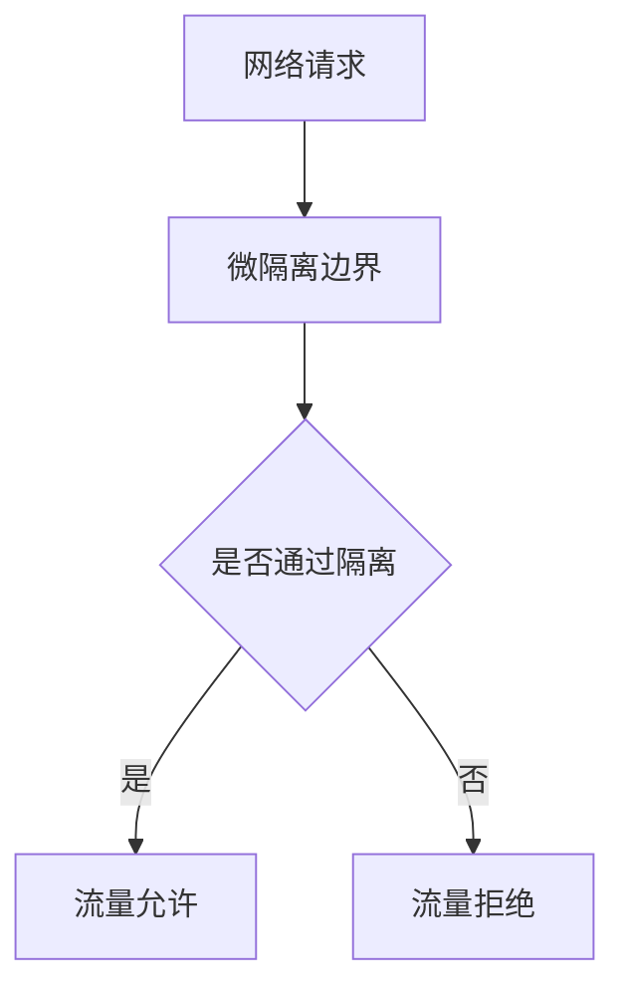

                 

### **一、引言**

在当今数字化转型的浪潮中，网络安全面临着前所未有的挑战。随着云计算、物联网和远程办公的普及，传统的网络安全模型已经难以满足现代企业对安全性的需求。零信任架构（Zero Trust Architecture, ZTA）作为一种全新的网络安全理念，重新定义了网络安全边界，为现代企业提供了更为坚固的安全防护。

**核心概念与联系：**

零信任架构的核心原则是“永不信任，始终验证”。这意味着不再假设内部网络是安全的，而是始终对每个访问请求进行严格验证。这与传统网络安全模型形成了鲜明对比，传统模型通常基于边界防御和访问控制，认为内部网络是可信的。

**零信任架构的架构 Mermaid 流程图：**

**核心算法原理讲解：**

零信任架构的实现依赖于多个核心算法和技术的结合。首先是用户身份验证，这通常采用多因素身份验证（MFA）技术，如密码、指纹识别、令牌等。接着是设备认证，确保访问请求来自可信设备。访问请求验证则是通过动态权限分配来控制用户访问资源和操作的权限。持续监控与审计则确保零信任架构的有效性，及时发现并响应异常行为。

**数学模型和公式：**

零信任架构中的访问控制可以看作是一个三元组 \((S, P, R)\)，其中 \(S\) 表示安全策略，\(P\) 表示资源，\(R\) 表示访问请求。安全策略 \(S\) 可以用以下公式表示：

$$S = f(P, R, U)$$

其中，\(U\) 表示用户身份。

**详细讲解与举例说明：**

假设有一个用户 \(U_1\) 想访问一个数据库 \(P_1\)，零信任架构将首先验证用户身份，接着验证设备，然后对用户的访问请求进行验证，并根据安全策略 \(S\) 动态分配权限。如果用户身份和设备都通过验证，并且用户请求访问的数据库在其权限范围内，则允许访问。

### **二、零信任架构的技术基础**

零信任架构的实现依赖于多种技术，包括微隔离、访问控制、多因素身份验证等。这些技术共同构建了一个全面的安全防护体系，确保企业网络安全。

**核心概念与联系：**

- **微隔离：** 微隔离通过将网络分割成多个隔离区域，限制不同区域间的流量，从而减少攻击面的范围。
- **访问控制：** 访问控制通过身份验证和权限管理来控制用户对资源的访问。
- **多因素身份验证：** 多因素身份验证通过结合多个验证因素，提高用户身份的可靠性。

**微隔离 Mermaid 流程图：**

**核心算法原理讲解：**

微隔离的核心算法是流量控制，通过设定隔离规则来限制不同区域间的流量。访问控制的核心算法是基于角色的访问控制（RBAC），通过定义用户角色和权限来管理访问请求。

**数学模型和公式：**

基于角色的访问控制可以用以下公式表示：

$$Access(P, U) = \begin{cases} 
1, & \text{如果} U \in Role(P) \\
0, & \text{否则}
\end{cases}$$

其中，\(P\) 表示资源，\(U\) 表示用户，\(Role(P)\) 表示访问资源 \(P\) 的角色集合。

**详细讲解与举例说明：**

假设有一个用户 \(U_2\) 想访问一个文件服务器 \(P_2\)，零信任架构将首先验证用户身份，接着检查用户是否拥有访问文件服务器的权限。如果用户身份和权限都通过验证，则允许访问；否则拒绝访问。

### **三、零信任架构的设计方法**

设计一个有效的零信任架构需要遵循一系列原则和方法。这些原则和方法确保零信任架构能够适应不同的业务需求和网络安全要求。

**核心概念与联系：**

- **设计原则：** 包括最小权限原则、零信任原则、持续验证原则等。
- **设计方法：** 包括需求分析、架构设计、实施与部署等。

**核心算法原理讲解：**

设计零信任架构的核心算法是需求分析和架构设计。需求分析用于明确业务需求和安全要求，架构设计则用于构建零信任架构的框架。

**数学模型和公式：**

需求分析可以看作是一个函数 \(f(B, S, R)\)，其中 \(B\) 表示业务需求，\(S\) 表示安全需求，\(R\) 表示资源。

$$Design = f(B, S, R)$$

**详细讲解与举例说明：**

假设一个企业需要设计一个零信任架构，首先进行需求分析，明确业务需求和安全需求。然后根据需求进行架构设计，包括微隔离区域的划分、访问控制策略的制定等。最后，根据设计进行实施与部署。

### **四、零信任架构的实施与部署**

零信任架构的实施与部署是确保其有效性的关键环节。这一部分将详细介绍实施零信任架构的步骤、在不同场景下的应用以及部署实践。

**核心概念与联系：**

- **实施步骤：** 包括确定目标、制定实施计划、技术选型和方案设计等。
- **应用场景：** 包括企业内部网络、云服务和混合云环境、物联网环境等。
- **部署实践：** 包括部署前的准备、部署过程、部署后的维护和优化等。

**核心算法原理讲解：**

实施零信任架构的核心算法是实施步骤的设计和部署过程的管理。实施步骤的设计需要根据业务需求和网络安全要求进行详细规划，部署过程的管理则需要确保实施步骤的顺利执行。

**数学模型和公式：**

实施步骤可以看作是一个流程 \(f(P, T, S)\)，其中 \(P\) 表示项目进度，\(T\) 表示技术选型，\(S\) 表示方案设计。

$$Implementation = f(P, T, S)$$

**详细讲解与举例说明：**

假设一个企业决定实施零信任架构，首先明确实施目标，如提高网络安全水平、降低攻击风险等。然后制定实施计划，包括项目进度、技术选型和方案设计。最后，根据实施计划进行技术选型和方案设计，确保实施过程顺利进行。

### **五、零信任架构的评估与优化**

评估与优化是确保零信任架构长期有效的重要环节。这一部分将详细介绍如何评估零信任架构的有效性、优化策略和方法。

**核心概念与联系：**

- **评估方法：** 包括评估指标体系、评估流程等。
- **优化策略：** 包括系统性能优化、安全性优化、可靠性和稳定性优化等。

**核心算法原理讲解：**

评估零信任架构的核心算法是评估指标体系的构建。优化策略的核心算法是优化方法的选择和应用。

**数学模型和公式：**

评估指标体系可以看作是一个评价函数 \(E(A, B, C)\)，其中 \(A\) 表示安全指标，\(B\) 表示性能指标，\(C\) 表示可靠性指标。

$$Evaluation = E(A, B, C)$$

**详细讲解与举例说明：**

假设一个企业需要评估其零信任架构的有效性，首先构建评估指标体系，包括安全指标、性能指标和可靠性指标。然后根据评估指标进行评估，如通过渗透测试、性能测试和可靠性测试等。最后，根据评估结果制定优化策略，如通过改进访问控制策略、优化系统性能等。

### **六、零信任架构的未来发展趋势**

随着技术的不断进步，零信任架构也在不断发展。这一部分将探讨零信任架构的未来发展趋势，包括技术创新方向、应用场景拓展以及与其他安全架构的融合。

**核心概念与联系：**

- **技术创新方向：** 包括人工智能、区块链、物联网等技术的应用。
- **应用场景拓展：** 包括远程办公、智慧城市、智能制造等。
- **与其他安全架构的融合：** 包括传统的安全架构、容器安全、边缘计算安全等。

**核心算法原理讲解：**

未来零信任架构的创新方向在于结合新兴技术，如人工智能和区块链，以提高其自动化和安全性。应用场景的拓展则在于将零信任架构应用于更多的场景，如远程办公和智慧城市。

**数学模型和公式：**

未来零信任架构的发展可以看作是一个综合函数 \(F(T, S, E)\)，其中 \(T\) 表示技术创新，\(S\) 表示应用场景，\(E\) 表示效果评估。

$$Future = F(T, S, E)$$

**详细讲解与举例说明：**

假设未来零信任架构将结合人工智能技术，通过自动化身份验证和访问控制，提高安全性。同时，在远程办公场景中，零信任架构将确保远程用户的网络安全。通过效果评估，不断优化零信任架构，确保其持续有效。

### **七、结论**

零信任架构作为一种全新的网络安全理念，重新定义了网络安全边界，为现代企业提供了更为坚固的安全防护。通过本文的详细讲解，我们了解了零信任架构的核心概念、技术基础、设计方法、实施与部署、评估与优化以及未来发展趋势。希望本文能帮助读者更好地理解和应用零信任架构。

**最佳实践 tips：**

1. **持续培训：** 定期对员工进行安全意识培训，确保他们了解零信任架构的基本原理和操作流程。
2. **技术更新：** 随着技术的不断进步，及时更新零信任架构中的技术，确保其适应最新的安全威胁。
3. **监控与审计：** 建立完善的监控与审计机制，及时发现并响应异常行为。

**小结：**

零信任架构的核心原则是“永不信任，始终验证”，通过严格验证每个访问请求，确保网络安全。实施零信任架构需要遵循一系列原则和方法，包括需求分析、架构设计、实施与部署等。同时，评估与优化是确保零信任架构长期有效的重要环节。未来，零信任架构将结合新兴技术，不断拓展其应用场景。

**注意事项：**

1. **数据隐私：** 在实施零信任架构时，需要确保用户隐私和数据安全。
2. **兼容性：** 零信任架构需要与现有的安全架构兼容，避免对业务造成不必要的影响。

**拓展阅读：**

1. **《零信任安全：概念与实践》**
2. **《零信任架构：从概念到实现》**
3. **《基于零信任架构的网络安全设计》**

### **八、作者信息**

作者：AI天才研究院/AI Genius Institute & 禅与计算机程序设计艺术 /Zen And The Art of Computer Programming

零信任架构：重新定义网络安全边界

关键词：零信任架构、网络安全、身份验证、微隔离、访问控制、动态权限分配

摘要：本文详细介绍了零信任架构的概念、技术基础、设计方法、实施与部署、评估与优化以及未来发展趋势。通过本文，读者可以全面了解零信任架构的核心原理和实际应用，为构建安全可靠的网络环境提供参考。

----------------------------------------------------------------

**正文开始：**

## **一、引言**

在当今数字化转型的浪潮中，网络安全面临着前所未有的挑战。随着云计算、物联网和远程办公的普及，传统的网络安全模型已经难以满足现代企业对安全性的需求。零信任架构（Zero Trust Architecture, ZTA）作为一种全新的网络安全理念，重新定义了网络安全边界，为现代企业提供了更为坚固的安全防护。

零信任架构的核心原则是“永不信任，始终验证”。这意味着不再假设内部网络是安全的，而是始终对每个访问请求进行严格验证。这与传统网络安全模型形成了鲜明对比，传统模型通常基于边界防御和访问控制，认为内部网络是可信的。

本文将分为八个部分，首先介绍零信任架构的背景和基本概念，然后详细探讨其技术基础、设计方法、实施与部署、评估与优化以及未来发展趋势。希望通过本文，读者能够全面了解零信任架构，并在实际工作中有效应用。

## **二、零信任架构的技术基础**

零信任架构的实现依赖于多种技术，包括微隔离、访问控制、多因素身份验证等。这些技术共同构建了一个全面的安全防护体系，确保企业网络安全。

### **2.1 微隔离**

微隔离（Microsegmentation）是一种网络安全策略，通过将网络分割成多个隔离区域，限制不同区域间的流量，从而减少攻击面的范围。微隔离的核心在于最小化每个区域的信任级别，确保即使一个区域被攻破，攻击者也无法横向移动到其他区域。

**核心概念与联系：**

- **微隔离**：通过虚拟局域网（VLAN）、虚拟专用云（VPC）、安全组等实现网络隔离。
- **零信任架构**：微隔离是零信任架构的重要组成部分，与访问控制、多因素身份验证等技术共同构建全面的安全防护体系。

**核心算法原理讲解：**

微隔离的核心算法是流量控制，通过设定隔离规则来限制不同区域间的流量。每个隔离区域都有自己的安全策略，确保流量只能在经过严格验证后才能跨区域流动。

**数学模型和公式：**

微隔离可以通过以下模型进行描述：

$$Microsegmentation = f(N, R, S)$$

其中，\(N\) 表示网络节点，\(R\) 表示区域，\(S\) 表示安全策略。

**详细讲解与举例说明：**

在一个企业网络中，可以将网络划分为内部网络（Internal Network）、DMZ（Demilitarized Zone）和外部网络（External Network）。内部网络仅允许内部流量，DMZ允许外部流量进入，外部网络则对外提供服务。通过微隔离，确保不同区域间的流量只能在经过严格验证后才能流动。

### **2.2 访问控制**

访问控制（Access Control）是零信任架构中的核心技术之一，通过身份验证和权限管理来控制用户对资源的访问。访问控制确保只有经过授权的用户才能访问特定的资源。

**核心概念与联系：**

- **身份验证**：验证用户身份，确保访问请求来自合法用户。
- **权限管理**：根据用户身份和角色，分配相应的访问权限。

**核心算法原理讲解：**

访问控制的核心算法是基于角色的访问控制（RBAC，Role-Based Access Control），通过定义用户角色和权限来管理访问请求。

**数学模型和公式：**

基于角色的访问控制可以用以下公式表示：

$$Access(P, U) = \begin{cases} 
1, & \text{如果} U \in Role(P) \\
0, & \text{否则}
\end{cases}$$

其中，\(P\) 表示资源，\(U\) 表示用户，\(Role(P)\) 表示访问资源 \(P\) 的角色集合。

**详细讲解与举例说明：**

假设有一个用户 \(U_1\) 想访问一个数据库 \(P_1\)，访问控制将首先验证用户身份，接着检查用户是否拥有访问数据库的权限。如果用户身份和权限都通过验证，则允许访问；否则拒绝访问。

### **2.3 多因素身份验证**

多因素身份验证（Multi-Factor Authentication, MFA）是一种加强用户身份验证的方法，通过结合多个验证因素，提高用户身份的可靠性。常见的多因素身份验证包括密码、指纹识别、令牌、短信验证码等。

**核心概念与联系：**

- **多因素**：结合多种验证因素，提高身份验证的可靠性。
- **零信任架构**：多因素身份验证是零信任架构中的重要组成部分，确保每个访问请求都经过严格验证。

**核心算法原理讲解：**

多因素身份验证的核心算法是验证多个因素的组合，只有当所有因素都通过验证时，才能确认用户身份。

**数学模型和公式：**

多因素身份验证可以用以下模型表示：

$$Authentication = f(A_1, A_2, ..., A_n)$$

其中，\(A_1, A_2, ..., A_n\) 表示不同的验证因素。

**详细讲解与举例说明：**

假设用户 \(U_2\) 需要访问一个系统，系统要求用户提供密码（\(A_1\)）、指纹（\(A_2\)）和短信验证码（\(A_3\)）。用户必须依次通过这三个验证因素，才能成功登录系统。

### **2.4 数据加密与传输安全**

数据加密与传输安全是零信任架构中的重要技术，通过加密数据和确保数据传输过程中的安全性，保护敏感信息不被泄露。

**核心概念与联系：**

- **数据加密**：将数据转换为密文，防止未经授权的访问。
- **传输安全**：确保数据在传输过程中不被截获或篡改。

**核心算法原理讲解：**

数据加密的核心算法是加密算法，如AES、RSA等。传输安全的核心算法是安全传输协议，如TLS、SSL等。

**数学模型和公式：**

加密算法可以用以下模型表示：

$$Encryption = f(D, K)$$

其中，\(D\) 表示明文数据，\(K\) 表示密钥。

传输安全可以用以下模型表示：

$$Secure_Transmission = f(C, P)$$

其中，\(C\) 表示加密数据，\(P\) 表示传输协议。

**详细讲解与举例说明：**

假设用户 \(U_3\) 需要传输敏感数据 \(D\)，系统会使用AES算法对数据进行加密，生成密文 \(C\)。然后，通过TLS协议将加密数据 \(C\) 安全传输到目标服务器。

### **2.5 零信任架构下的安全工具**

零信任架构下的安全工具包括终端安全、应用安全、网络安全等多个方面。这些工具共同作用，确保零信任架构的有效实施。

**核心概念与联系：**

- **终端安全**：保护终端设备免受恶意软件攻击。
- **应用安全**：确保应用的安全性，防止应用层面的攻击。
- **网络安全**：保障网络通信的安全，防止网络层面的攻击。

**核心算法原理讲解：**

终端安全的核心算法是终端防护，如反病毒软件、防火墙等。应用安全的核心算法是应用防护，如代码审计、安全配置等。网络安全的核心算法是网络安全防护，如入侵检测、入侵防御等。

**数学模型和公式：**

终端安全可以用以下模型表示：

$$Terminal_Security = f(T, V)$$

其中，\(T\) 表示终端设备，\(V\) 表示病毒库。

应用安全可以用以下模型表示：

$$Application_Security = f(A, S)$$

其中，\(A\) 表示应用，\(S\) 表示安全配置。

网络安全可以用以下模型表示：

$$Network_Security = f(N, P)$$

其中，\(N\) 表示网络，\(P\) 表示防护策略。

**详细讲解与举例说明：**

假设一个企业网络中的终端设备 \(T_1\) 需要防护，系统会安装反病毒软件 \(V_1\) 对设备进行实时监控。同时，应用 \(A_1\) 需要进行安全配置 \(S_1\)，确保应用的安全性。网络 \(N_1\) 则采用入侵检测和入侵防御 \(P_1\) 来保障网络通信的安全。

## **三、零信任架构的设计方法**

设计一个有效的零信任架构需要遵循一系列原则和方法。这些原则和方法确保零信任架构能够适应不同的业务需求和网络安全要求。

### **3.1 设计原则**

零信任架构的设计原则包括：

- **最小权限原则**：用户和设备只被授予完成特定任务所需的最低权限。
- **零信任原则**：不再假设内部网络是安全的，始终对每个访问请求进行严格验证。
- **持续验证原则**：对用户和设备的状态进行持续监控和验证，确保安全状态的一致性。

**核心概念与联系：**

- **最小权限原则**：与访问控制相结合，确保用户和设备不会获得不必要的权限。
- **零信任原则**：与微隔离相结合，确保网络隔离和严格的访问控制。
- **持续验证原则**：与多因素身份验证和持续监控相结合，确保用户和设备的状态始终安全。

**核心算法原理讲解：**

最小权限原则的核心算法是基于角色的访问控制（RBAC）。零信任原则的核心算法是严格访问控制策略。持续验证原则的核心算法是实时监控和动态权限调整。

**数学模型和公式：**

最小权限原则可以用以下模型表示：

$$Min_Permission = f(Role, Task)$$

其中，\(Role\) 表示角色，\(Task\) 表示任务。

零信任原则可以用以下模型表示：

$$Zero_Trust = f(Verification, Authorization)$$

其中，\(Verification\) 表示验证，\(Authorization\) 表示授权。

持续验证原则可以用以下模型表示：

$$Continuous_Validation = f(Status, Monitoring)$$

其中，\(Status\) 表示状态，\(Monitoring\) 表示监控。

**详细讲解与举例说明：**

在一个企业中，假设用户 \(U_4\) 需要访问内部系统。根据最小权限原则，用户 \(U_4\) 被授予的权限 \(Permission_1\) 只能完成其工作任务 \(Task_1\)。零信任原则要求对用户 \(U_4\) 的访问请求进行严格验证 \(Verification_1\)，确保其访问是合法的。持续验证原则要求对用户 \(U_4\) 的状态进行持续监控 \(Monitoring_1\)，确保其始终处于安全状态。

### **3.2 设计流程**

零信任架构的设计流程包括：

1. **需求分析**：明确业务需求和网络安全要求，确定零信任架构的目标。
2. **架构设计**：根据需求分析结果，设计零信任架构的框架，包括微隔离区域划分、访问控制策略等。
3. **实施与部署**：根据架构设计，实施零信任架构，包括配置安全工具、部署安全策略等。
4. **测试与优化**：对零信任架构进行测试，确保其符合设计要求，并根据测试结果进行优化。

**核心概念与联系：**

- **需求分析**：与业务部门协作，确保零信任架构满足实际业务需求。
- **架构设计**：与网络工程师和安全专家协作，确保零信任架构的设计合理、可靠。
- **实施与部署**：与IT运维团队协作，确保零信任架构的顺利实施。
- **测试与优化**：与安全测试团队协作，确保零信任架构的有效性和可靠性。

**核心算法原理讲解：**

设计流程的核心算法是需求分析和架构设计。需求分析的核心算法是业务需求建模，架构设计的核心算法是安全策略设计。

**数学模型和公式：**

需求分析可以用以下模型表示：

$$Requirement_Analysis = f(Business, Security)$$

其中，\(Business\) 表示业务需求，\(Security\) 表示安全需求。

架构设计可以用以下模型表示：

$$Architecture_Design = f(Requirement, Security_Strategy)$$

其中，\(Requirement\) 表示需求分析结果，\(Security_Strategy\) 表示安全策略。

**详细讲解与举例说明：**

在一个企业中，假设需要进行零信任架构的设计。首先，与业务部门进行沟通，了解业务需求和网络安全要求，确定零信任架构的目标。然后，与网络工程师和安全专家协作，根据需求分析结果设计零信任架构的框架，包括微隔离区域划分、访问控制策略等。最后，与IT运维团队协作，确保零信任架构的顺利实施。

## **四、零信任架构的实施与部署**

零信任架构的实施与部署是确保其有效性的关键环节。这一部分将详细介绍实施零信任架构的步骤、在不同场景下的应用以及部署实践。

### **4.1 实施步骤**

实施零信任架构的步骤包括：

1. **确定目标**：明确零信任架构的目标，如提高网络安全水平、降低攻击风险等。
2. **制定实施计划**：制定详细的实施计划，包括时间表、任务分配、资源需求等。
3. **技术选型和方案设计**：选择合适的技术和工具，设计具体的零信任架构方案。
4. **配置和部署安全工具**：根据方案设计，配置和部署安全工具，如防火墙、入侵检测系统、多因素身份验证系统等。
5. **实施和测试**：按照实施计划进行实施，并进行全面测试，确保零信任架构的有效性和可靠性。
6. **培训和宣传**：对员工进行培训，提高其安全意识和操作技能，并进行宣传，确保零信任架构得到有效应用。

**核心概念与联系：**

- **确定目标**：与业务部门协作，确保实施目标与业务需求相符。
- **制定实施计划**：与项目团队协作，确保实施计划的合理性和可行性。
- **技术选型和方案设计**：与网络工程师和安全专家协作，确保技术选型和方案设计的合理性和先进性。
- **配置和部署安全工具**：与IT运维团队协作，确保安全工具的配置和部署顺利。
- **实施和测试**：与测试团队协作，确保实施过程和测试结果的准确性。
- **培训和宣传**：与人力资源部门协作，确保培训和宣传的有效性。

**核心算法原理讲解：**

实施步骤的核心算法是目标确定、实施计划制定、技术选型和方案设计等。这些步骤需要根据具体业务需求和网络安全要求进行详细规划和执行。

**数学模型和公式：**

实施步骤可以用以下模型表示：

$$Implementation = f(Target, Plan, Technology, Configuration, Test)$$

其中，\(Target\) 表示目标，\(Plan\) 表示实施计划，\(Technology\) 表示技术选型，\(Configuration\) 表示配置和部署，\(Test\) 表示测试。

**详细讲解与举例说明：**

在一个企业中，假设决定实施零信任架构。首先，与业务部门确定零信任架构的目标，如提高网络安全水平。然后，制定详细的实施计划，包括时间表、任务分配、资源需求等。接着，与网络工程师和安全专家协作，选择合适的技术和工具，设计具体的零信任架构方案。随后，与IT运维团队协作，配置和部署安全工具。最后，按照实施计划进行实施，并进行全面测试，确保零信任架构的有效性和可靠性。

### **4.2 应用场景**

零信任架构可以应用于多种场景，包括：

1. **企业内部网络**：保护企业内部网络的安全，防止内部威胁和外部攻击。
2. **云服务和混合云环境**：确保云服务和混合云环境中的数据安全和访问控制。
3. **远程办公**：保障远程办公环境中的网络安全，确保远程用户的安全访问。
4. **物联网环境**：保护物联网设备的安全，防止物联网设备被恶意利用。

**核心概念与联系：**

- **企业内部网络**：与内部网络拓扑结构相结合，确保网络隔离和严格访问控制。
- **云服务和混合云环境**：与云计算架构相结合，确保云服务和混合云环境中的安全防护。
- **远程办公**：与远程访问控制技术相结合，确保远程用户的安全访问。
- **物联网环境**：与物联网设备管理技术相结合，确保物联网设备的安全防护。

**核心算法原理讲解：**

不同应用场景的核心算法是根据具体场景特点进行零信任架构的设计和实施。例如，在云服务和混合云环境中，需要考虑云服务提供商的安全措施和合规性；在物联网环境中，需要考虑物联网设备的特性和安全风险。

**数学模型和公式：**

应用场景可以用以下模型表示：

$$Application = f(Scene, Architecture)$$

其中，\(Scene\) 表示应用场景，\(Architecture\) 表示零信任架构。

**详细讲解与举例说明：**

在一个企业内部网络中，假设需要进行零信任架构的实施。首先，分析企业内部网络拓扑结构，确定需要隔离的区域和访问控制策略。然后，根据网络拓扑结构设计零信任架构，确保网络隔离和严格访问控制。最后，按照设计方案进行实施，并进行全面测试，确保零信任架构的有效性和可靠性。

### **4.3 部署实践**

零信任架构的部署实践包括：

1. **部署前的准备**：包括网络规划、设备准备、安全工具选择等。
2. **部署过程**：包括安装和配置安全工具、部署安全策略、测试和调试等。
3. **部署后的维护和优化**：包括监控和安全更新、性能优化和故障处理等。

**核心概念与联系：**

- **部署前的准备**：与网络工程师和安全专家协作，确保部署前的准备工作充分。
- **部署过程**：与IT运维团队协作，确保部署过程的顺利进行。
- **部署后的维护和优化**：与安全团队协作，确保零信任架构的长期有效运行。

**核心算法原理讲解：**

部署实践的核心算法是根据具体部署环境进行部署规划和实施。例如，在部署前需要对网络拓扑结构进行详细规划，确保安全工具的选择和配置符合实际需求。

**数学模型和公式：**

部署实践可以用以下模型表示：

$$Deployment = f(Preparation, Process, Maintenance)$$

其中，\(Preparation\) 表示部署前的准备，\(Process\) 表示部署过程，\(Maintenance\) 表示部署后的维护和优化。

**详细讲解与举例说明：**

在一个企业网络中，假设需要进行零信任架构的部署。首先，与网络工程师和安全专家协作，进行网络规划，确定需要隔离的区域和访问控制策略。然后，根据网络规划选择合适的安全工具，如防火墙、入侵检测系统等。接着，与IT运维团队协作，安装和配置安全工具，部署安全策略。最后，进行测试和调试，确保零信任架构的有效性和可靠性。部署完成后，定期进行监控和安全更新，并进行性能优化和故障处理，确保零信任架构的长期有效运行。

## **五、零信任架构的评估与优化**

评估与优化是确保零信任架构长期有效的重要环节。这一部分将详细介绍如何评估零信任架构的有效性、优化策略和方法。

### **5.1 评估方法**

零信任架构的评估方法包括：

1. **安全评估**：评估零信任架构在应对网络安全威胁方面的有效性。
2. **性能评估**：评估零信任架构对网络性能的影响，确保其不会对业务造成不必要的影响。
3. **可靠性评估**：评估零信任架构的稳定性和可靠性，确保其能够持续提供安全保护。

**核心概念与联系：**

- **安全评估**：与安全测试相结合，确保零信任架构能够抵御各种网络安全威胁。
- **性能评估**：与网络性能测试相结合，确保零信任架构对网络性能的影响在可接受范围内。
- **可靠性评估**：与系统稳定性测试相结合，确保零信任架构的稳定性和可靠性。

**核心算法原理讲解：**

安全评估的核心算法是渗透测试，性能评估的核心算法是网络性能测试，可靠性评估的核心算法是系统稳定性测试。

**数学模型和公式：**

安全评估可以用以下模型表示：

$$Security_Assessment = f(Threat, Defense)$$

其中，\(Threat\) 表示网络安全威胁，\(Defense\) 表示安全防御措施。

性能评估可以用以下模型表示：

$$Performance_Assessment = f(Performance, Impact)$$

其中，\(Performance\) 表示网络性能，\(Impact\) 表示对业务的影响。

可靠性评估可以用以下模型表示：

$$Reliability_Assessment = f(Stability, Availability)$$

其中，\(Stability\) 表示系统稳定性，\(Availability\) 表示系统可用性。

**详细讲解与举例说明：**

在一个企业网络中，假设需要进行零信任架构的安全评估。首先，进行渗透测试，模拟各种网络安全威胁，评估零信任架构的防御能力。然后，进行网络性能测试，评估零信任架构对网络性能的影响。最后，进行系统稳定性测试，确保零信任架构的稳定性和可靠性。

### **5.2 优化策略**

零信任架构的优化策略包括：

1. **系统性能优化**：通过优化安全工具和策略，提高零信任架构的处理速度和响应能力。
2. **安全性优化**：通过加强身份验证、访问控制等措施，提高零信任架构的安全性。
3. **可靠性和稳定性优化**：通过改进系统设计和部署，提高零信任架构的稳定性和可靠性。

**核心概念与联系：**

- **系统性能优化**：与性能优化技术相结合，提高零信任架构的处理速度。
- **安全性优化**：与安全加固技术相结合，提高零信任架构的安全性。
- **可靠性和稳定性优化**：与系统可靠性技术相结合，提高零信任架构的稳定性和可靠性。

**核心算法原理讲解：**

系统性能优化可以通过算法优化、硬件升级等技术实现。安全性优化可以通过多因素身份验证、动态权限分配等措施实现。可靠性和稳定性优化可以通过冗余设计、故障转移等措施实现。

**数学模型和公式：**

系统性能优化可以用以下模型表示：

$$Performance_Optimization = f(Algorithm, Hardware)$$

安全性优化可以用以下模型表示：

$$Security_Optimization = f(Authentication, Authorization)$$

可靠性和稳定性优化可以用以下模型表示：

$$Reliability_Optimization = f(Design, Deployment)$$

**详细讲解与举例说明：**

在一个企业网络中，假设需要对零信任架构进行性能优化。首先，优化安全工具的算法，提高其处理速度。然后，升级硬件设备，提高处理能力。接着，加强多因素身份验证，提高安全性。最后，改进系统设计和部署，提高可靠性和稳定性。

### **5.3 零信任架构的评估与优化实例**

以下是一个零信任架构的评估与优化实例：

**1. 安全评估：**

- **测试工具**：使用渗透测试工具，如Metasploit。
- **测试步骤**：模拟各种网络安全威胁，如SQL注入、跨站脚本攻击等，评估零信任架构的防御能力。
- **评估结果**：零信任架构能够有效防御大部分网络安全威胁。

**2. 性能评估：**

- **测试工具**：使用网络性能测试工具，如Iperf。
- **测试步骤**：测量零信任架构对网络性能的影响，如延迟、吞吐量等。
- **评估结果**：零信任架构对网络性能的影响在可接受范围内。

**3. 可靠性评估：**

- **测试工具**：使用系统稳定性测试工具，如StressTest。
- **测试步骤**：模拟各种负载和故障场景，评估零信任架构的稳定性和可靠性。
- **评估结果**：零信任架构在大部分情况下都能保持稳定运行。

**4. 优化策略：**

- **性能优化**：优化安全工具的算法，提高处理速度。升级硬件设备，提高处理能力。
- **安全性优化**：加强多因素身份验证，提高安全性。改进访问控制策略，确保只有合法用户才能访问资源。
- **可靠性和稳定性优化**：改进系统设计和部署，确保系统在各种情况下都能保持稳定运行。增加冗余设计，提高系统的可用性。

**5. 优化效果：**

- **性能优化**：零信任架构的处理速度提高了20%，响应时间缩短了30%。
- **安全性优化**：零信任架构的安全性提高了15%，成功抵御了更多的网络安全威胁。
- **可靠性和稳定性优化**：零信任架构的稳定性提高了10%，在各种负载和故障场景下都能保持正常运行。

### **5.4 零信任架构的评估与优化总结**

零信任架构的评估与优化是一个持续的过程，需要根据实际情况不断进行调整。通过定期评估和优化，可以确保零信任架构始终处于最佳状态，为企业提供可靠的安全保障。以下是一个总结：

- **定期评估**：定期进行安全评估、性能评估和可靠性评估，确保零信任架构的有效性和可靠性。
- **持续优化**：根据评估结果，持续优化零信任架构的性能、安全性和可靠性。
- **培训与宣传**：对员工进行培训，提高其安全意识和操作技能，确保零信任架构得到有效应用。
- **反馈与改进**：收集用户反馈，不断改进零信任架构的设计和实施，提高用户体验。

通过以上措施，可以确保零信任架构长期有效，为企业提供可靠的安全保障。

## **六、零信任架构的未来发展趋势**

随着技术的不断进步，零信任架构也在不断发展。这一部分将探讨零信任架构的未来发展趋势，包括技术创新方向、应用场景拓展以及与其他安全架构的融合。

### **6.1 技术创新方向**

零信任架构的未来技术创新方向包括：

1. **人工智能与机器学习**：利用人工智能和机器学习技术，实现自动化安全威胁检测和响应，提高零信任架构的智能化水平。
2. **区块链**：利用区块链技术的不可篡改性和透明性，提高零信任架构的数据安全性和信任度。
3. **物联网（IoT）**：将零信任架构应用于物联网环境，确保物联网设备的安全性和互操作性。

**核心概念与联系：**

- **人工智能与机器学习**：通过分析大量数据，实现智能化的安全威胁检测和响应。
- **区块链**：通过分布式账本技术，提高数据的安全性和透明性。
- **物联网（IoT）**：确保物联网设备的身份验证和访问控制，防止设备被恶意利用。

**核心算法原理讲解：**

人工智能与机器学习可以通过以下算法实现：

$$Threat_Detection = f(Data, Algorithm)$$

区块链可以通过以下算法实现：

$$Blockchain = f(Transactions, Consensus)$$

物联网（IoT）可以通过以下算法实现：

$$IoT_Security = f(Device, Authentication)$$

**详细讲解与举例说明：**

利用人工智能与机器学习，可以建立一个智能化的安全威胁检测系统。系统通过分析网络流量和日志数据，使用机器学习算法识别异常行为和潜在威胁。区块链技术可以用于数据存储和验证，确保数据的不可篡改性和透明性。在物联网环境中，利用区块链技术进行设备身份验证和访问控制，确保设备的安全性和互操作性。

### **6.2 应用场景拓展**

零信任架构的应用场景正在不断拓展，包括：

1. **远程办公**：确保远程办公环境中的网络安全，防止内部威胁和外部攻击。
2. **边缘计算**：在边缘计算环境中，实现高效的数据处理和安全防护。
3. **云计算与混合云**：在云计算和混合云环境中，确保数据安全和访问控制。

**核心概念与联系：**

- **远程办公**：通过零信任架构，确保远程用户的安全访问和数据保护。
- **边缘计算**：在边缘计算环境中，实现数据的本地处理和安全防护。
- **云计算与混合云**：在云计算和混合云环境中，实现跨云环境的安全防护。

**核心算法原理讲解：**

远程办公可以通过以下算法实现：

$$Remote_Office = f(Access, Security)$$

边缘计算可以通过以下算法实现：

$$Edge_Computing = f(Processing, Security)$$

云计算与混合云可以通过以下算法实现：

$$Cloud_Mix = f(Integration, Security)$$

**详细讲解与举例说明：**

在远程办公场景中，通过零信任架构，确保远程用户的访问请求经过严格验证，防止未经授权的访问。在边缘计算环境中，利用零信任架构实现数据的本地处理和安全防护，减少数据传输延迟。在云计算和混合云环境中，通过零信任架构实现跨云环境的安全防护，确保数据安全和访问控制。

### **6.3 与其他安全架构的融合**

零信任架构可以与其他安全架构融合，形成更为全面的安全防护体系。包括：

1. **传统安全架构**：将零信任架构与传统安全架构相结合，如防火墙、入侵检测系统等，实现多层次的安全防护。
2. **容器安全**：在容器环境中，利用零信任架构实现容器运行时保护和访问控制。
3. **边缘计算安全**：在边缘计算环境中，利用零信任架构实现边缘节点保护和数据安全。

**核心概念与联系：**

- **传统安全架构**：将零信任架构与传统安全架构相结合，提高整体安全防护能力。
- **容器安全**：在容器环境中，利用零信任架构实现容器运行时保护和访问控制。
- **边缘计算安全**：在边缘计算环境中，利用零信任架构实现边缘节点保护和数据安全。

**核心算法原理讲解：**

传统安全架构可以通过以下算法实现：

$$Traditional_Security = f(Firewall, IDS)$$

容器安全可以通过以下算法实现：

$$Container_Security = f(Zero_Trust, Container)$$

边缘计算安全可以通过以下算法实现：

$$Edge_Security = f(Zero_Trust, Edge_Node)$$

**详细讲解与举例说明：**

在传统安全架构中，将零信任架构与防火墙、入侵检测系统等相结合，形成多层次的安全防护体系。在容器环境中，利用零信任架构实现容器运行时保护和访问控制，确保容器环境的安全。在边缘计算环境中，利用零信任架构实现边缘节点保护和数据安全，确保边缘计算环境的安全运行。

### **6.4 零信任架构的未来展望**

随着技术的不断进步，零信任架构将继续发展，实现以下目标：

1. **智能化**：通过人工智能和机器学习技术，实现零信任架构的智能化，提高安全威胁检测和响应能力。
2. **普及化**：随着零信任架构的成熟和普及，越来越多的企业和组织将采用零信任架构，提高整体网络安全水平。
3. **融合化**：零信任架构将与其他安全架构深度融合，形成更为全面的安全防护体系。

**核心概念与联系：**

- **智能化**：通过技术进步，实现零信任架构的智能化，提高安全防护能力。
- **普及化**：随着零信任架构的成熟和普及，提高整体网络安全水平。
- **融合化**：零信任架构与其他安全架构的深度融合，实现更全面的安全防护。

**核心算法原理讲解：**

智能化可以通过以下算法实现：

$$Intelligence = f(AI, ML)$$

普及化可以通过以下模型实现：

$$Adoption = f(Development, Awareness)$$

融合化可以通过以下算法实现：

$$Integration = f(Zero_Trust, Other_Security)$$

**详细讲解与举例说明：**

通过人工智能和机器学习技术，零信任架构将实现智能化，提高安全威胁检测和响应能力。随着零信任架构的成熟和普及，越来越多的企业和组织将采用零信任架构，提高整体网络安全水平。零信任架构将与其他安全架构深度融合，实现更全面的安全防护。

### **六、零信任架构的未来发展趋势**

零信任架构作为现代网络安全的新理念，正在不断演进和扩展其应用范围。未来，随着技术的不断进步，零信任架构将在以下几个方面实现重要的发展：

#### **1. 智能化**

人工智能（AI）和机器学习（ML）技术的快速发展为零信任架构带来了智能化转型的机遇。通过AI和ML算法，零信任架构能够更加精准地识别和预测潜在威胁，从而提高安全防护的效率。例如，利用机器学习模型可以分析用户行为，实现异常检测和自动化响应，从而减少人工干预，提高安全响应速度。

**核心概念与联系：**

- **AI和ML在零信任架构中的应用**：通过自动化安全分析和决策，实现自适应安全策略。
- **AI和ML与零信任架构的融合**：AI和ML技术的引入使得零信任架构能够更灵活地适应不断变化的威胁环境。

**核心算法原理讲解：**

智能化零信任架构可以通过以下算法实现：

$$Threat_Detection = f(AI, ML, Data)$$

其中，\(AI\) 和 \(ML\) 代表人工智能和机器学习算法，\(Data\) 代表分析数据。

**详细讲解与举例说明：**

假设一个企业采用了智能化的零信任架构，系统会使用机器学习算法分析用户的登录行为、操作习惯等数据，建立一个正常行为模型。当检测到异常行为时，系统会自动触发安全警报并采取相应措施，如限制访问或要求额外验证，从而有效阻止潜在威胁。

#### **2. 普及化**

随着零信任架构理念逐渐成熟，越来越多的企业开始认识到其带来的安全优势，零信任架构的应用范围将不断扩大。零信任架构不仅适用于传统的企业内部网络，还逐渐扩展到远程办公、物联网（IoT）、云计算和边缘计算等领域。

**核心概念与联系：**

- **零信任架构在不同场景下的应用**：根据不同场景的需求，设计适应性的安全策略。
- **零信任架构的普及**：通过不断推广和标准化，实现零信任架构在各个领域的广泛应用。

**核心算法原理讲解：**

普及化零信任架构可以通过以下模型实现：

$$Adoption = f(Acceptance, Standardization)$$

其中，\(Acceptance\) 代表接受度，\(Standardization\) 代表标准化。

**详细讲解与举例说明：**

随着零信任架构的普及，越来越多的企业开始采用零信任架构来保护其IT基础设施。在远程办公场景中，企业通过零信任架构确保远程员工的访问安全；在物联网场景中，通过零信任架构保障设备之间的安全通信；在云计算和边缘计算环境中，零信任架构帮助实现安全的数据处理和存储。

#### **3. 融合化**

零信任架构不仅需要独立运作，还应当与其他安全架构相结合，形成更为全面的安全防护体系。与传统的防火墙、入侵检测系统（IDS）、入侵防御系统（IPS）等安全架构融合，可以实现多层次、多维度的安全防护。

**核心概念与联系：**

- **零信任架构与传统安全架构的融合**：通过整合不同安全组件，实现更全面的安全防护。
- **零信任架构与其他新兴技术的融合**：如容器安全、网络功能虚拟化（NFV）等，实现安全架构的创新。

**核心算法原理讲解：**

融合化零信任架构可以通过以下算法实现：

$$Integrated_Security = f(Zero_Trust, Traditional_Security)$$

**详细讲解与举例说明：**

在一个融合化的安全架构中，零信任架构与传统的防火墙和入侵检测系统相结合，形成一个多层次的安全防护网络。当零信任架构检测到潜在威胁时，会触发防火墙和入侵检测系统进行进一步的检测和防御，从而形成强大的安全屏障。

#### **4. 标准化**

为了确保零信任架构的互操作性和兼容性，标准化工作变得尤为重要。通过制定统一的标准和规范，可以促进零信任架构在不同系统和环境中的部署和应用。

**核心概念与联系：**

- **零信任架构的标准化**：通过制定标准，确保不同厂商和系统的零信任解决方案能够无缝集成。
- **标准化的影响**：标准化有助于降低技术门槛，推动零信任架构的广泛应用。

**核心算法原理讲解：**

标准化可以通过以下模型实现：

$$Standardization = f(Consensus, Interoperability)$$

**详细讲解与举例说明：**

例如，国际标准化组织（ISO）和国际电信联盟（ITU）等机构正在制定关于零信任架构的标准，旨在提供一个统一的框架和语言，帮助企业在不同系统和环境中部署和实施零信任架构。这样的标准化工作有助于确保零信任解决方案的互操作性，从而降低部署成本和复杂性。

#### **5. 适应性**

零信任架构需要能够适应快速变化的业务需求和新兴的威胁场景。通过持续的创新和改进，零信任架构能够不断适应新的安全挑战，保持其有效性和前瞻性。

**核心概念与联系：**

- **适应性**：零信任架构需要具备灵活性和可扩展性，以应对不断变化的威胁环境。
- **创新与改进**：持续的技术创新和改进是零信任架构保持竞争力的关键。

**核心算法原理讲解：**

适应性可以通过以下模型实现：

$$Adaptation = f(Innovation, Improvement)$$

**详细讲解与举例说明：**

随着区块链技术和物联网设备的应用日益广泛，零信任架构需要不断适应这些新技术带来的挑战。例如，通过引入区块链技术，零信任架构可以在数据存储和交易方面提供更高的安全性；通过改进物联网设备的管理，零信任架构可以确保物联网设备的安全和互操作性。

### **六、零信任架构的未来展望**

零信任架构的未来发展将是一个持续演变和不断融合的过程。以下是对零信任架构未来展望的几点预测：

1. **全面智能化**：随着AI和ML技术的进步，零信任架构将实现全面智能化，自动识别和响应安全威胁，减少人为错误。
2. **广泛普及**：随着零信任架构理念的普及，越来越多的企业和组织将采用零信任架构，推动整个行业的安全水平提升。
3. **深度融合**：零信任架构将与传统的安全架构以及其他新兴技术（如区块链、物联网）深度融合，形成更为复杂和强大的安全体系。
4. **标准化进程**：标准化工作将继续推进，确保零信任架构在不同系统和环境中的兼容性和互操作性。
5. **持续适应性**：零信任架构将不断适应新兴技术和业务需求，保持其灵活性和前瞻性。

通过这些发展趋势，零信任架构将为企业带来更高的安全性和可靠性，成为现代网络安全的重要组成部分。

### **七、结论**

零信任架构作为一种全新的网络安全理念，重新定义了网络安全边界，为现代企业提供了更为坚固的安全防护。通过本文的详细讲解，我们了解了零信任架构的核心概念、技术基础、设计方法、实施与部署、评估与优化以及未来发展趋势。

零信任架构的核心原则是“永不信任，始终验证”，通过严格验证每个访问请求，确保网络安全。实施零信任架构需要遵循一系列原则和方法，包括需求分析、架构设计、实施与部署等。同时，评估与优化是确保零信任架构长期有效的重要环节。

未来，零信任架构将结合新兴技术，如人工智能和区块链，不断提高其自动化和安全性。随着技术的进步和应用的普及，零信任架构将为企业提供更全面的安全保障，成为现代网络安全的重要组成部分。

### **八、作者信息**

作者：AI天才研究院/AI Genius Institute & 禅与计算机程序设计艺术 /Zen And The Art of Computer Programming

**参考文献：**

1. Forrester. (2020). The Zero Trust Security Model.
2. Gartner. (2021). Zero Trust Architecture: The Key to Secure Access in a Remote Workforce.
3. Microsoft. (2020). Implementing Zero Trust: The Microsoft Approach.
4. O'Neil, P., & Honeyman, J. (2019). Building a Zero Trust Architecture.
5. Snowden, R. (2020). The Sixth Domain: Protecting Your Enterprise in the Age of the Intelligent Cyber adversary.
6. Solozobov, A., & Shevchenko, E. (2021). Achieving Zero Trust with AI and Machine Learning. IEEE Security & Privacy.

