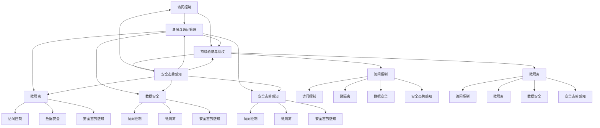
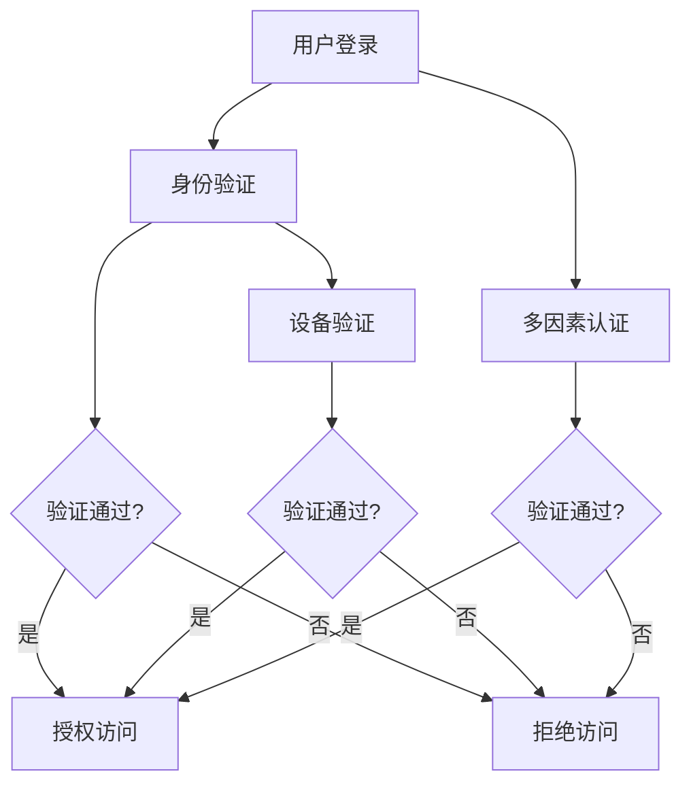
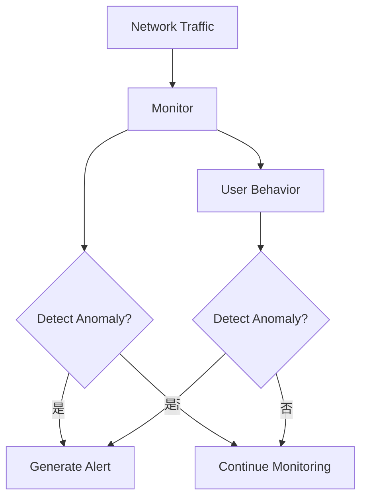
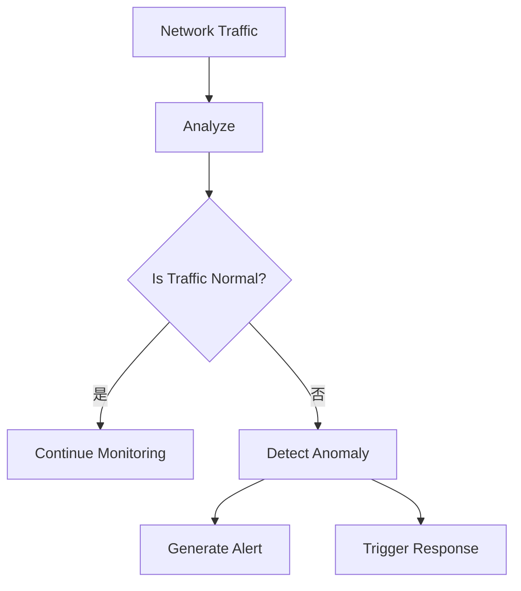

                 

### 文章标题

# 《零信任网络架构实现》

### 文章关键词

- 零信任网络
- 认证机制
- 加密技术
- 实时监控
- 数学模型
- 项目实战

### 文章摘要

本文深入探讨了零信任网络架构的实现原理与具体方法。首先介绍了零信任模型的基本概念和核心原则，然后详细讲解了零信任架构的组成部分及其实施步骤。文章通过数学模型、伪代码和实际案例，阐述了核心算法原理及其在数据安全、实时监控等方面的应用。最后，本文提供了零信任网络的部署与维护策略，并展望了其未来发展。旨在为IT专业人士和研究人员提供全面、系统的指导。

### 引言

随着云计算、物联网和移动设备的普及，网络边界日益模糊，传统的安全模型已无法有效应对现代网络威胁。在这种背景下，零信任网络架构（Zero Trust Architecture, ZTA）应运而生。零信任模型摒弃了基于边界的信任假设，强调对每个访问请求进行严格认证和授权，确保只有经过验证的用户和设备才能访问网络资源。

零信任网络架构不仅提高了网络安全水平，还增强了灵活性、可扩展性和用户体验。然而，实现零信任网络架构并非易事，需要综合考虑技术、管理和操作等多个方面。本文将围绕零信任网络架构的实现，探讨其核心概念、算法原理、数学模型以及项目实战，帮助读者深入了解零信任网络架构的精髓。

### 核心概念与联系

零信任模型的核心在于打破传统的“边界”观念，不再假设内部网络是安全的，而是对每个访问请求进行严格验证和授权。以下是零信任模型的核心概念及其之间的联系：

1. **访问控制**：零信任网络架构强调对访问请求进行严格的访问控制。访问控制分为三个层次：认证（Authentication）、授权（Authorization）和审计（Auditing）。认证确保请求者身份的真实性；授权确定请求者可以访问的资源；审计记录访问行为，以便追踪和审计。

2. **身份与访问管理**（Identity and Access Management, IAM）：IAM是零信任架构中至关重要的一环。IAM系统负责管理用户身份、角色和权限，确保只有经过验证和授权的用户才能访问网络资源。

3. **持续验证与授权**（Continuous Verification and Authorization, CV&A）：零信任模型要求对访问请求进行持续验证和授权，而不是一次性验证。CV&A通过实时监控和分析用户行为、设备状态和网络流量，动态调整访问权限，确保安全。

4. **微隔离**（Micro-segmentation）：微隔离将网络划分为多个隔离区域，每个区域只允许必要的通信。这有助于限制攻击范围，降低攻击成功的机会。

5. **数据安全**：零信任模型强调数据安全，包括数据加密、完整性保护和机密性保护。数据加密确保数据在传输和存储过程中不被窃取或篡改。

6. **安全态势感知**（Security Situational Awareness, SSA）：安全态势感知通过实时监控和分析网络流量、安全事件等信息，为安全决策提供依据。

这些核心概念相互关联，共同构成了零信任网络架构的基础。以下是这些概念之间的联系架构 Mermaid 流程图：



通过这张 Mermaid 流程图，我们可以清晰地看到各个核心概念之间的联系，以及它们在零信任网络架构中的作用。接下来，本文将详细讲解零信任认证机制、数据安全与加密技术以及实时监控与响应机制等核心算法原理。

### 零信任认证机制

零信任认证机制是零信任网络架构中的核心组成部分，其目的是确保只有经过验证的用户和设备才能访问网络资源。传统的认证机制通常基于用户名和密码、证书、令牌等，这些方法在一定程度上可以保证访问安全，但在面对复杂的网络环境和高级攻击时，其安全性和可靠性存在一定的局限。零信任认证机制则通过更加严格和细粒度的认证方式，提高了网络的安全性。

#### 认证决策模型

零信任认证机制的核心在于认证决策模型，该模型通过综合分析多个认证因素，对访问请求进行评估和决策。以下是一个简单的认证决策模型：



#### 伪代码说明

以下是一个简化的认证决策模型的伪代码：

```plaintext
function authenticate(user, device, multiFactor) {
    if (!isUserValid(user)) {
        return "拒绝访问：用户身份验证失败"
    }
    if (!isDeviceValid(device)) {
        return "拒绝访问：设备身份验证失败"
    }
    if (multiFactor && !isMultiFactorValid(multiFactor)) {
        return "拒绝访问：多因素认证失败"
    }
    return "授权访问"
}

function isUserValid(user) {
    // 用户身份验证逻辑，例如：检查用户名和密码是否匹配
    return true
}

function isDeviceValid(device) {
    // 设备身份验证逻辑，例如：检查设备是否已注册或标记为受信任设备
    return true
}

function isMultiFactorValid(multiFactor) {
    // 多因素认证逻辑，例如：检查双因素认证是否已通过
    return true
}
```

#### 实例分析

假设用户“alice”尝试访问企业内部系统，以下是一个具体的认证实例：

1. 用户登录：alice输入用户名和密码。
2. 身份验证：系统检查alice的用户名和密码是否匹配，若匹配，则继续下一步。
3. 设备验证：系统检查alice的设备是否已注册或标记为受信任设备，若通过验证，则继续下一步。
4. 多因素认证：系统要求alice进行双因素认证，例如发送短信验证码，alice输入验证码后，系统检查验证码是否正确。
5. 认证决策：系统综合以上三个认证结果，若所有认证均通过，则授权访问内部系统；否则，拒绝访问。

通过上述认证决策模型和伪代码，我们可以看到零信任认证机制如何通过多层次、多因素的综合认证，确保访问请求的安全性。这种认证方式不仅提高了安全性，还增强了用户体验，因为用户只需在必要时进行额外的认证。

#### 认证机制的优势与挑战

**优势：**

1. **安全性**：通过多因素认证，零信任认证机制提高了网络的安全性，有效防止了未授权访问。
2. **细粒度控制**：零信任认证机制可以根据用户的角色、设备类型和访问请求的上下文，进行细粒度控制，提高资源的访问效率。
3. **响应性**：认证决策模型可以实时响应访问请求，动态调整访问权限，提高了系统的灵活性。

**挑战：**

1. **复杂性**：零信任认证机制涉及多个认证因素，增加了系统的复杂度，可能导致部署和维护难度增加。
2. **用户体验**：多因素认证可能会降低用户体验，用户需要在必要时进行额外的认证步骤。
3. **性能影响**：认证过程需要消耗一定的计算资源和时间，可能会对系统性能产生一定影响。

总的来说，零信任认证机制通过严格认证和动态授权，提高了网络安全性，但同时也面临一定的挑战。在设计和实施零信任网络架构时，需要综合考虑这些因素，平衡安全性和用户体验。

### 数据安全与加密技术

在零信任网络架构中，数据安全是确保网络资源不被未授权访问和篡改的关键。数据安全包括数据加密、完整性保护和机密性保护等多个方面。以下将详细讲解数据加密技术及其在零信任网络架构中的应用。

#### 数据加密算法

数据加密是确保数据在传输和存储过程中不被窃取或篡改的重要手段。常见的加密算法包括对称加密和非对称加密。

1. **对称加密**：对称加密算法使用相同的密钥进行加密和解密，常见的算法有AES（Advanced Encryption Standard）和DES（Data Encryption Standard）。对称加密速度快，但密钥管理复杂。

    ```latex
    E_k(p) = c
    D_k(c) = p
    ```
    其中，\( E_k(p) \) 表示加密过程，\( D_k(c) \) 表示解密过程，\( p \) 是明文，\( c \) 是密文，\( k \) 是密钥。

2. **非对称加密**：非对称加密算法使用一对密钥，一个用于加密，一个用于解密。常见的算法有RSA（Rivest-Shamir-Adleman）和ECC（Elliptic Curve Cryptography）。非对称加密安全性高，但计算复杂度较大。

    ```latex
    E_k(p, n) = c
    D_k(c, n) = p
    ```
    其中，\( E_k(p, n) \) 表示加密过程，\( D_k(c, n) \) 表示解密过程，\( p \) 是明文，\( c \) 是密文，\( n \) 是公钥，\( k \) 是私钥。

#### 数据加密技术应用案例

以下是一个数据加密技术的应用案例：

1. **数据传输加密**：在零信任网络中，数据在传输过程中需要进行加密。假设用户“bob”从企业服务器下载文件，服务器使用AES对称加密算法对文件进行加密，然后发送给bob。bob使用同样的AES密钥进行解密，从而获取明文文件。

    ```mermaid
    graph TD
        A[Server] --> B[Data]
        B --> C[Encrypted Data]
        C --> D[Send to Bob]
        D --> E[Bob]
        E --> F[Decrypted Data]
    ```

2. **数据存储加密**：在零信任网络中，数据存储在数据库或其他存储设备中。为了确保数据安全，可以使用AES对称加密算法对数据进行加密。例如，企业数据库将数据加密存储，当用户查询数据时，系统使用相同的密钥进行解密，从而获取明文数据。

    ```mermaid
    graph TD
        A[Database] --> B[Data]
        B --> C[Encrypted Data]
        C --> D[Store]
        D --> E[User Query]
        E --> F[Encrypted Data]
        F --> G[Decrypt]
        G --> H[Decrypted Data]
    ```

#### 数学模型与公式讲解

数据加密技术涉及多个数学模型和公式，以下简要介绍几个常用的模型和公式：

1. **对称加密算法的加密和解密公式**：

    ```latex
    E_k(p) = c
    D_k(c) = p
    ```
    其中，\( E_k(p) \) 表示加密过程，\( D_k(c) \) 表示解密过程，\( p \) 是明文，\( c \) 是密文，\( k \) 是密钥。

2. **非对称加密算法的加密和解密公式**：

    ```latex
    E_k(p, n) = c
    D_k(c, n) = p
    ```
    其中，\( E_k(p, n) \) 表示加密过程，\( D_k(c, n) \) 表示解密过程，\( p \) 是明文，\( c \) 是密文，\( n \) 是公钥，\( k \) 是私钥。

3. **RSA加密算法的安全性**：

    RSA加密算法的安全性取决于大素数的生成和模运算的复杂性。假设\( n = pq \)，其中\( p \)和\( q \)是两个大素数，则RSA加密算法的安全性可以通过以下公式描述：

    ```latex
    E(m) = m^e \mod n
    D(c) = c^d \mod n
    ```
    其中，\( m \) 是明文，\( c \) 是密文，\( e \) 是公开指数，\( d \) 是私用指数。

通过上述数学模型和公式，我们可以更好地理解数据加密技术的工作原理。在实际应用中，数据加密技术需要根据具体场景和需求进行选择和优化。

#### 加密技术的实际应用与挑战

**实际应用：**

1. **HTTPS协议**：在互联网上，HTTPS（HTTP over TLS/SSL）协议广泛使用加密技术，确保数据在传输过程中的安全。
2. **数据库加密**：许多数据库系统提供加密功能，确保存储的数据安全。
3. **文件加密**：用户可以使用加密工具对文件进行加密，防止未授权访问。

**挑战：**

1. **性能开销**：加密和解密过程需要消耗计算资源和时间，可能会对系统性能产生一定影响。
2. **密钥管理**：加密技术需要密钥管理，密钥的安全和备份是一个重要挑战。
3. **兼容性**：不同加密算法和系统之间的兼容性问题可能影响数据加密技术的广泛应用。

总的来说，数据加密技术在零信任网络架构中扮演着关键角色，通过加密技术，可以有效保护数据的安全性和完整性。然而，在应用加密技术时，需要综合考虑性能、管理和兼容性等因素，以实现最优的安全保障。

### 实时监控与响应机制

实时监控与响应机制是零信任网络架构中的关键组成部分，它通过持续监控网络流量、用户行为和安全事件，确保网络安全，并在发现异常时及时采取措施。以下是关于实时监控与响应机制的核心算法原理和实际应用。

#### 实时监控算法原理

实时监控算法的核心在于有效地分析网络流量和用户行为，以检测潜在的安全威胁。以下是一个简化的实时监控算法原理：



#### 伪代码说明

以下是一个简化的实时监控算法的伪代码：

```plaintext
function monitor(networkTraffic, userBehavior) {
    while (true) {
        if (detectAnomaly(networkTraffic) || detectAnomaly(userBehavior)) {
            generateAlert()
        }
        sleep(1)  // 每秒进行一次监控
    }
}

function detectAnomaly(data) {
    // 异常检测逻辑，例如：基于机器学习的异常检测模型
    return true
}

function generateAlert() {
    // 发送警报通知，例如：邮件、短信或系统消息
    sendNotification("Anomaly Detected")
}
```

#### 实际应用场景

以下是一个实时监控与响应机制的实际应用场景：

1. **网络流量监控**：网络流量监控系统实时分析网络流量，检测异常流量模式。例如，如果某段时间内的网络流量突然增加，且流量模式与正常业务不符，监控系统会生成警报并通知管理员。

2. **用户行为分析**：用户行为监控系统分析用户的登录时间、登录地点、操作行为等，检测异常行为。例如，如果某个用户的登录地点突然从北京切换到纽约，并且操作行为异常频繁，监控系统会生成警报并通知安全团队。

3. **安全事件响应**：在检测到异常后，监控系统会自动触发响应机制，例如隔离受感染的设备、断开可疑连接、锁定用户账户等，以防止安全威胁的进一步扩散。

#### 流量分析模型

流量分析是实时监控的重要组成部分，通过分析网络流量可以识别潜在的安全威胁。以下是一个简化的流量分析模型：



#### 伪代码说明

以下是一个简化的流量分析模型的伪代码：

```plaintext
function analyzeTraffic(networkTraffic) {
    while (true) {
        if (!isTrafficNormal(networkTraffic)) {
            detectAnomaly()
        }
        updateNetworkTraffic()  // 定期更新网络流量数据
    }
}

function isTrafficNormal(traffic) {
    // 流量正常性判断逻辑，例如：基于统计方法的流量模式识别
    return true
}

function detectAnomaly() {
    // 异常检测逻辑，例如：基于机器学习的异常检测模型
    return true
}
```

#### 实际案例分析与详细讲解

以下是一个关于实时监控与响应机制的详细案例分析：

**案例：企业内部网络流量异常**

1. **问题描述**：某企业内部网络在下午3点突然出现异常流量，流量峰值是正常流量峰值的3倍，且流量模式与正常业务明显不符。

2. **分析过程**：
   - 监控系统实时分析网络流量，发现流量异常。
   - 基于机器学习算法的流量分析模型检测到异常流量，生成警报。
   - 警报通知管理员，管理员立即展开调查。
   - 管理员通过分析流量数据，发现异常流量来自一个新注册的员工账户。

3. **响应措施**：
   - 立即隔离异常流量来源的设备。
   - 停止该员工账户的访问权限。
   - 对该员工账户的活动进行详细审计，查找潜在的安全威胁。

4. **结果**：通过实时监控与响应机制，企业成功阻止了潜在的内部攻击，避免了可能的数据泄露。

通过上述案例分析，我们可以看到实时监控与响应机制在识别和处理安全威胁中的重要作用。在实际应用中，实时监控与响应机制需要不断优化和调整，以提高监控效果和响应速度。

#### 注意事项与最佳实践

1. **监控策略**：制定合理的监控策略，根据企业的业务需求和安全目标，选择合适的监控指标和方法。

2. **自动化响应**：开发自动化响应机制，确保在检测到异常时，系统能够立即采取行动，减少人工干预。

3. **监控数据整合**：整合多源监控数据，实现统一视图，提高监控效果和响应效率。

4. **持续优化**：定期评估监控与响应机制的性能，根据实际情况进行调整和优化。

通过上述注意事项与最佳实践，我们可以更好地实施实时监控与响应机制，确保零信任网络架构的安全性和可靠性。

### 零信任架构的部署与实施

零信任架构的部署与实施是一个复杂的过程，涉及多个阶段和多个技术组件。以下将详细介绍零信任架构的部署步骤、实际部署案例以及与现有网络架构的集成方法。

#### 零信任部署步骤

1. **需求分析与规划**：在部署零信任架构之前，首先需要分析企业的业务需求和安全目标。确定需要保护的资源、用户和设备类型，以及预期的安全策略和用户体验。

2. **技术选型**：根据需求分析，选择合适的技术组件和工具。常用的技术组件包括身份认证系统、访问控制系统、加密工具、监控系统和响应系统等。

3. **架构设计**：设计零信任网络架构，包括网络拓扑、系统组件和接口等。设计过程中需要考虑性能、可扩展性、安全性和可靠性等因素。

4. **部署实施**：按照架构设计，进行技术组件的部署和配置。部署过程中需要注意版本控制、配置管理和日志记录等。

5. **测试与优化**：部署完成后，进行全面的测试和优化。测试内容包括功能测试、性能测试和安全测试等。根据测试结果进行调整和优化，确保零信任架构的稳定性和安全性。

6. **培训与文档**：对员工进行零信任架构的培训，确保他们了解新架构的特点和操作方法。同时，编写详细的文档，记录架构设计、部署实施和操作流程等。

#### 实际部署案例

以下是一个企业内部零信任架构的部署案例：

1. **需求分析**：企业希望实现以下目标：
   - 确保只有经过验证的用户和设备才能访问内部系统。
   - 实时监控网络流量和用户行为，及时发现和响应安全威胁。
   - 提高数据安全性，确保数据在传输和存储过程中的完整性。

2. **技术选型**：企业选择了以下技术组件：
   - 身份认证系统：使用OAuth2.0协议进行用户认证。
   - 访问控制系统：基于RBAC（基于角色的访问控制）进行访问控制。
   - 加密工具：使用AES对称加密算法对数据进行加密。
   - 监控系统：使用Prometheus和Grafana进行实时监控。
   - 响应系统：使用Splunk进行日志分析和事件响应。

3. **架构设计**：企业内部网络架构如下：

   ```mermaid
   graph TD
       A[Employee]
       B[Authentication Service]
       C[Access Control Service]
       D[Encryption Service]
       E[Monitoring Service]
       F[Response Service]
       
       A --> B
       B --> C
       C --> D
       C --> E
       C --> F
       D --> E
       E --> F
   ```

4. **部署实施**：
   - 部署OAuth2.0认证服务器，配置用户认证策略。
   - 部署访问控制服务器，配置角色和权限。
   - 部署加密工具，配置数据加密策略。
   - 部署监控系统，配置监控指标和告警规则。
   - 部署响应系统，配置日志分析和响应策略。

5. **测试与优化**：
   - 进行功能测试，确保认证、访问控制、加密和监控等功能正常运行。
   - 进行性能测试，确保系统能够处理大量访问请求。
   - 进行安全测试，确保系统不受外部攻击。

6. **培训与文档**：对员工进行零信任架构的培训，确保他们了解新架构的特点和操作方法。同时，编写详细的文档，记录架构设计、部署实施和操作流程等。

#### 与现有网络架构的集成

零信任架构可以与现有的网络架构无缝集成，实现安全性和灵活性的平衡。以下是将零信任架构与现有网络架构集成的方法：

1. **身份认证集成**：将零信任架构中的认证服务与现有用户管理系统（如LDAP、AD等）集成，确保用户认证的一致性。

2. **访问控制集成**：将零信任架构的访问控制规则与现有防火墙、入侵检测系统等安全设备集成，实现细粒度的访问控制。

3. **加密集成**：将零信任架构的加密工具与现有存储系统（如数据库、文件存储等）集成，确保数据在传输和存储过程中的加密。

4. **监控集成**：将零信任架构的监控系统与现有监控平台（如Nagios、Zabbix等）集成，实现统一的监控和管理。

5. **响应集成**：将零信任架构的响应系统与现有安全事件响应平台（如Splunk、SIEM等）集成，实现自动化和协调的安全事件响应。

通过上述集成方法，零信任架构可以与现有网络架构相互补充，提高整体安全性和灵活性。

### 零信任架构的维护与优化

零信任架构的维护与优化是确保其长期有效运行的关键。以下是关于零信任架构的维护策略、优化目标和实际优化案例的详细讲解。

#### 维护策略

1. **定期评估**：定期对零信任架构进行评估，检查安全策略、系统配置和性能指标，确保架构的稳定性和安全性。

2. **更新与补丁管理**：及时更新系统和软件的补丁，修复已知漏洞，避免安全风险。

3. **监控与日志分析**：实时监控网络流量、用户行为和安全事件，通过日志分析及时发现和响应潜在威胁。

4. **培训与演练**：定期对员工进行培训，提高他们对零信任架构的理解和操作能力。同时，进行安全演练，测试应急响应能力。

5. **合规性检查**：确保零信任架构符合相关法律法规和行业标准，如GDPR、ISO 27001等。

#### 优化目标

1. **性能优化**：提高架构的响应速度和处理能力，确保在高负载情况下仍能正常运行。

2. **安全性提升**：通过引入新的安全技术和策略，进一步提高网络的安全性。

3. **用户体验**：优化用户认证和访问流程，提高用户体验。

4. **可扩展性**：确保架构能够适应业务增长和变化，具备良好的可扩展性。

5. **成本效益**：在确保安全性和性能的前提下，降低架构的运营成本。

#### 实际优化案例

以下是一个关于零信任架构优化的实际案例：

**案例：企业零信任架构性能优化**

1. **问题描述**：企业在高峰时段遇到零信任架构性能瓶颈，响应速度变慢，影响了用户体验。

2. **分析过程**：
   - 监控系统显示，认证服务器的负载过高，导致响应延迟。
   - 性能测试发现，认证服务器的CPU使用率接近100%，内存使用率较高。

3. **优化措施**：
   - **负载均衡**：增加认证服务器的数量，采用负载均衡策略，分担访问压力。
   - **缓存策略**：引入缓存机制，缓存认证结果，减少重复认证请求。
   - **硬件升级**：升级认证服务器的硬件配置，提高处理能力。
   - **优化代码**：对认证服务器的代码进行优化，提高执行效率。

4. **结果**：通过上述优化措施，零信任架构的性能显著提升，响应速度明显加快，用户体验得到改善。

#### 最佳实践

1. **持续监控**：定期监控系统性能，及时发现和处理性能问题。

2. **自动化运维**：引入自动化运维工具，简化维护流程，提高维护效率。

3. **代码审计**：定期对系统代码进行审计，确保代码质量和安全性。

4. **安全培训**：加强对员工的培训，提高他们的安全意识和操作能力。

5. **合规性审计**：定期进行合规性审计，确保架构符合相关法律法规和行业标准。

通过上述维护与优化策略、目标和实际案例，我们可以确保零信任架构的长期稳定运行，为企业提供安全、可靠的网络环境。

### 零信任网络的发展趋势与挑战

随着云计算、物联网和移动设备等技术的快速发展，零信任网络架构在网络安全领域的重要性日益凸显。然而，在推广和应用过程中，零信任网络也面临诸多趋势和挑战。

#### 发展趋势

1. **云计算集成**：随着云计算的普及，越来越多的企业将核心业务迁移到云平台。零信任架构与云平台的集成将变得更加紧密，实现跨云和跨区域的安全管理。

2. **边缘计算与物联网**：边缘计算和物联网设备的兴起，使得零信任架构的应用场景更加广泛。零信任模型需要扩展到边缘设备和物联网设备，确保这些设备的安全性和可控性。

3. **人工智能与机器学习**：人工智能和机器学习技术将在零信任网络中发挥重要作用，用于行为分析、异常检测和安全响应。通过机器学习算法，零信任架构可以更智能地识别和应对安全威胁。

4. **多因素认证**：多因素认证（MFA）技术将得到进一步推广，结合生物识别、硬件令牌和地理位置等多种认证方式，提高认证的安全性和用户体验。

5. **安全服务化**：零信任架构的安全功能将逐渐服务化，以API接口的形式提供，方便企业集成到现有的IT基础设施中。

#### 挑战

1. **复杂性**：零信任架构涉及多个组件和技术的集成，系统的复杂度增加，增加了部署和维护的难度。

2. **用户体验**：多因素认证和严格的访问控制可能会影响用户体验，用户需要适应新的认证流程和权限管理方式。

3. **性能开销**：加密、认证和监控等操作需要消耗计算资源和时间，可能会对系统性能产生一定影响。

4. **成本**：零信任架构的实施和维护成本较高，尤其是对于中小企业而言，成本问题可能成为推广的主要障碍。

5. **法律法规**：不同国家和地区的法律法规对网络安全有不同要求，零信任架构需要满足这些法规，确保合规性。

#### 应对策略

1. **分阶段实施**：企业可以采取分阶段实施策略，逐步引入零信任架构，降低复杂性和成本。

2. **培训与宣传**：加强对员工的培训和宣传，提高他们对零信任架构的理解和支持。

3. **优化用户体验**：通过简化认证流程、优化界面设计和提高响应速度，提高用户体验。

4. **性能优化**：采用高性能硬件、优化系统架构和算法，降低性能开销。

5. **合规性审计**：定期进行合规性审计，确保架构符合相关法律法规和行业标准。

总的来说，零信任网络架构具有广阔的发展前景，但也面临诸多挑战。在推广和应用过程中，企业需要综合考虑技术、管理和成本等因素，采取有效的应对策略，确保零信任架构的成功实施。

### 附录

#### 零信任网络架构实现工具与资源

1. **认证工具**：
   - OAuth2.0：开源的认证协议，广泛用于身份认证。
   - OpenID Connect：基于OAuth2.0的认证协议，提供简洁的身份认证。
   - Kerberos：基于密钥加密技术的认证协议，常用于企业内部网络。

2. **加密工具**：
   - OpenSSL：开源加密库，支持多种加密算法。
   - AWS KMS：Amazon Web Services提供的加密服务。
   - HashiCorp Vault：开源的密钥管理平台。

3. **监控工具**：
   - Prometheus：开源的监控解决方案，用于收集和存储时间序列数据。
   - Grafana：开源的数据可视化平台，与Prometheus集成，用于监控展示。
   - Elastic Stack：包括Elasticsearch、Logstash和Kibana，用于日志管理和分析。

4. **响应工具**：
   -Splunk：开源的日志分析和数据平台，用于安全事件响应。
   - Microsoft Sentinel：云原生安全信息与事件管理（SIEM）平台。
   - AWS Security Hub：集成多个AWS安全服务的安全监控平台。

#### 零信任网络架构实现最佳实践

1. **制定安全策略**：明确安全目标和策略，确保架构的设计和实现符合安全要求。

2. **分阶段实施**：分阶段引入零信任架构，逐步完善和优化。

3. **持续监控与优化**：定期评估架构的性能和安全性，及时调整和优化。

4. **员工培训**：加强对员工的培训，提高他们对零信任架构的理解和支持。

5. **合规性审计**：定期进行合规性审计，确保架构符合相关法律法规和行业标准。

#### 小结

本文全面介绍了零信任网络架构的实现原理、核心算法原理、数学模型、项目实战以及维护与优化策略。通过本文，读者可以深入了解零信任网络架构的精髓，为企业在网络安全领域提供有益的指导。

#### 拓展阅读

- 《零信任：下一代网络安全框架》
- 《零信任模型：设计与实现》
- 《基于零信任的安全架构：理论与实践》

通过这些资源，读者可以进一步探索零信任网络架构的相关内容，不断提升自己在网络安全领域的专业水平。

### 作者信息

- 作者：AI天才研究院/AI Genius Institute & 禅与计算机程序设计艺术 /Zen And The Art of Computer Programming

