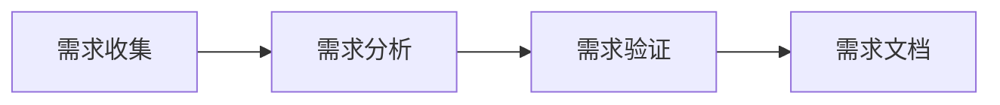
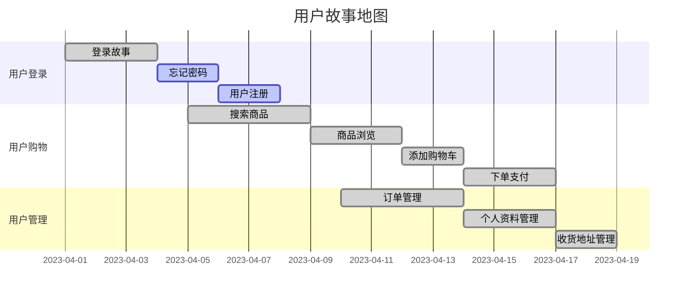

                 

### 文章标题：需求分析与产品设计思维

#### 关键词：需求分析、产品设计、用户中心设计、可用性设计、创新性设计、流程与方法、工具与技术、项目管理

> 摘要：本文深入探讨了需求分析与产品设计的核心概念、方法、结合点及其在项目管理中的应用。通过详细的案例分析、算法原理讲解和项目实战，帮助读者掌握现代软件开发中需求分析与产品设计的思维和方法，提高软件项目的成功率。

---

# 《需求分析与产品设计思维》

## 第一部分：需求分析基础

### 1.1 需求分析的定义与重要性

需求分析是软件工程中至关重要的环节，它是软件项目开发的基础。需求分析（Requirement Analysis）是指对软件系统的所有需求进行收集、分析和验证的过程。这一过程包括理解用户需求、确定系统功能、性能、界面和其他约束条件。

**核心概念与联系**

在需求分析中，有几个核心概念需要理解：

1. **用户需求**：用户期望从软件系统中获得的功能和特性。
2. **功能需求**：系统必须实现的具体功能。
3. **性能需求**：系统性能的指标，如响应时间、吞吐量、资源消耗等。
4. **界面需求**：系统的用户界面和用户体验要求。
5. **约束条件**：系统开发过程中必须遵守的限制，如技术限制、预算限制、时间限制等。

**需求分析的基本流程**

需求分析通常遵循以下基本流程：

1. **需求收集**：与用户、利益相关者进行沟通，收集用户需求和系统约束条件。
2. **需求分析**：对收集到的需求进行整理、分类和分析，确定系统的功能需求、性能需求和界面需求。
3. **需求验证**：通过文档、原型或模拟等方式验证需求是否满足用户和系统的需求。

**Mermaid 流程图**



**伪代码**

```python
def 需求分析(用户需求):
    功能需求 = []
    性能需求 = []
    界面需求 = []
    约束条件 = []
    
    for 需求 in 用户需求:
        if 需求类型 == "功能":
            功能需求.append(需求)
        elif 需求类型 == "性能":
            性能需求.append(需求)
        elif 需求类型 == "界面":
            界面需求.append(需求)
        else:
            约束条件.append(需求)
    
    return 功能需求, 性能需求, 界面需求, 约束条件
```

**数学模型和公式**

在需求分析中，常用的数学模型和公式包括：

- **需求优先级排序公式**：\(P_i = w_i \times C_i\)，其中 \(P_i\) 为需求 \(i\) 的优先级，\(w_i\) 为权重，\(C_i\) 为成本。
- **需求验证公式**：\(V = \sum_{i=1}^{n} P_i \times T_i\)，其中 \(V\) 为需求验证度，\(T_i\) 为需求 \(i\) 的验证时间。

**详细讲解与举例说明**

假设我们正在开发一个在线购物平台，以下是需求分析的过程：

1. **需求收集**：与产品经理、设计师和用户进行多次会议，收集用户需求和系统约束条件。
2. **需求分析**：
   - **功能需求**：用户注册、登录、浏览商品、添加商品到购物车、下单、支付、订单管理。
   - **性能需求**：系统响应时间不超过2秒，每秒处理5000个用户请求。
   - **界面需求**：简洁明了的界面，清晰的导航，良好的用户体验。
   - **约束条件**：使用现有的技术栈，预算有限。
3. **需求验证**：通过编写需求文档、创建原型和进行用户测试来验证需求是否满足。

### 1.2 需求分析的流程与方法

**需求收集**

需求收集是需求分析的第一步，其目的是从用户和利益相关者那里获取系统的需求。以下是一些常用的需求收集方法：

- **访谈**：与用户、利益相关者进行一对一的深入访谈。
- **问卷调查**：通过在线或纸质问卷收集用户反馈。
- **观察**：直接观察用户如何使用现有系统。
- **小组讨论**：与用户和利益相关者进行小组讨论。
- **文档分析**：分析现有的文档，如用户手册、产品规格书等。

**需求分析**

需求分析是对收集到的需求进行整理、分类和分析的过程。以下是一些常用的需求分析方法：

- **SWOT分析**：对需求进行优势、劣势、机会和威胁分析。
- **用例建模**：通过用例图描述系统的功能和用户行为。
- **功能分解**：将大需求分解为更小的子需求。
- **数据流图**：描述系统中的数据流动和处理过程。
- **状态图**：描述系统的状态转换和事件响应。

**需求验证**

需求验证是确保需求完整、一致和可实现的步骤。以下是一些常用的需求验证方法：

- **原型验证**：通过创建原型进行用户测试，验证需求是否符合用户期望。
- **评审**：通过专家评审来发现需求中的错误和不足。
- **模拟**：通过模拟系统运行来验证需求的正确性。

**详细讲解与举例说明**

假设我们正在开发一个在线教育平台，以下是需求分析的流程：

1. **需求收集**：与教师、学生和行政人员进行多次访谈和问卷调查，收集他们的需求和反馈。
2. **需求分析**：
   - **功能需求**：课程发布、学生选课、作业提交、成绩管理、在线测试、课程讨论。
   - **性能需求**：系统响应时间不超过3秒，每秒处理1000个用户请求。
   - **界面需求**：友好的用户界面，清晰的功能导航，良好的用户体验。
   - **约束条件**：使用现有的云计算平台，预算有限。
3. **需求验证**：通过创建原型，进行用户测试和专家评审，验证需求是否满足。

### 2.1 产品设计的基本原则

产品设计（Product Design）是软件开发中不可或缺的环节，它决定了软件产品的外观、功能、用户体验和可用性。优秀的产品设计可以提升用户满意度，增加产品的市场竞争力。

**用户中心设计原则**

用户中心设计原则（User-Centered Design，简称UCD）强调设计过程中始终关注用户的需求和体验。以下是一些用户中心设计原则：

- **用户调研**：了解目标用户的需求、偏好和行为习惯。
- **用户画像**：创建用户画像，明确目标用户群体的特征。
- **用户参与**：在产品设计过程中，积极邀请用户参与，获取他们的反馈和建议。
- **用户测试**：通过用户测试，验证设计是否符合用户的期望和需求。

**可用性设计原则**

可用性设计原则（Usability Design）关注产品的易用性、用户体验和用户满意度。以下是一些可用性设计原则：

- **清晰性**：界面设计要简洁明了，避免复杂和冗长的操作流程。
- **一致性**：界面元素和功能要保持一致，避免用户产生困惑。
- **可控性**：用户在操作过程中要有清晰的反馈，能够控制操作结果。
- **易学性**：产品应该易于学习，降低用户的学习成本。

**创新性设计原则**

创新性设计原则（Innovative Design）鼓励在设计过程中寻求创新，开发出具有竞争力的产品。以下是一些创新性设计原则：

- **探索性研究**：通过探索性研究，寻找新的设计方向和解决方案。
- **原型设计**：快速构建原型，通过迭代优化产品设计。
- **技术驱动**：结合最新的技术趋势，创新产品功能和用户体验。
- **用户参与**：鼓励用户参与创新过程，提供反馈和建议。

**详细讲解与举例说明**

假设我们正在设计一个移动购物应用，以下是产品设计的基本原则：

1. **用户中心设计原则**：
   - **用户调研**：通过访谈和问卷调查，了解用户在购物过程中的痛点和需求。
   - **用户画像**：创建用户画像，明确目标用户群体的特征，如年龄、性别、购物习惯等。
   - **用户参与**：在产品设计过程中，邀请用户参与，获取他们的反馈和建议。
   - **用户测试**：通过用户测试，验证设计是否符合用户的期望和需求。

2. **可用性设计原则**：
   - **清晰性**：界面设计简洁明了，避免复杂和冗长的操作流程。
   - **一致性**：界面元素和功能保持一致，避免用户产生困惑。
   - **可控性**：用户在操作过程中有清晰的反馈，能够控制操作结果。
   - **易学性**：产品易于学习，降低用户的学习成本。

3. **创新性设计原则**：
   - **探索性研究**：通过探索性研究，寻找新的设计方向和解决方案。
   - **原型设计**：快速构建原型，通过迭代优化产品设计。
   - **技术驱动**：结合最新的技术趋势，创新产品功能和用户体验。
   - **用户参与**：鼓励用户参与创新过程，提供反馈和建议。

### 2.2 产品设计的方法与工具

产品设计的方法和工具对于设计出优秀的软件产品至关重要。以下介绍几种常用的产品设计方法和工具：

**用户故事地图**

用户故事地图（User Story Map）是一种用于描述用户行为和需求的可视化工具。它通过一系列用户故事，将用户的整个使用过程串联起来，帮助设计团队理解用户需求和使用场景。



**原型设计工具**

原型设计工具（Prototype Tools）可以帮助设计团队快速构建软件产品的原型，以便进行用户测试和反馈。常用的原型设计工具有：

- **Axure RP**：一款专业的原型设计工具，支持多种原型设计方法。
- **Sketch**：一款流行的矢量绘图工具，适用于移动应用和网页设计。
- **Figma**：一款基于网页的协同设计工具，支持实时协作。

**设计评审工具**

设计评审工具（Design Review Tools）用于设计团队内部或与利益相关者之间的设计评审和反馈。常用的设计评审工具有：

- **InVision**：一款交互式原型设计工具，支持设计评审和用户测试。
- **Zeplin**：一款设计协作工具，用于设计师和开发人员之间的沟通和协作。
- **JIRA**：一款项目管理工具，支持设计任务的跟踪和管理。

### 3.1 需求分析与产品设计的结合点

需求分析与产品设计是软件开发过程中的两个关键环节，它们之间存在紧密的联系。以下探讨需求分析与产品设计的结合点：

**需求驱动的设计方法**

需求驱动的设计方法（Requirement-Driven Design，简称RDD）是一种将需求分析贯穿于整个设计过程的设计方法。该方法的核心思想是：设计过程始终围绕需求进行，确保设计结果满足用户需求。

**需求与设计的平衡**

在软件开发过程中，需求与设计之间需要保持平衡。一方面，需求分析要充分理解用户需求，确保设计结果满足用户需求；另一方面，产品设计要考虑系统的可实现性、性能和用户体验。

**需求收集与分析**

在需求收集与分析阶段，产品设计师需要深入了解用户需求，通过访谈、问卷调查、用户故事地图等方法收集用户需求。产品设计师还要分析需求之间的优先级和依赖关系，为后续的设计工作做好准备。

**设计原型与验证**

在产品设计阶段，产品设计师需要根据需求分析的结果构建设计原型，并通过用户测试、专家评审等方法验证设计是否符合用户需求和期望。设计原型可以帮助产品设计师发现潜在的问题和改进空间，提高设计质量。

**迭代与优化**

在软件开发过程中，需求分析与产品设计需要不断迭代和优化。通过持续的需求分析和设计反馈，设计团队可以不断完善产品功能和用户体验，提高产品的市场竞争力。

### 3.2 需求驱动的设计方法

需求驱动的设计方法是一种以需求为核心的设计方法，其目标是确保设计结果满足用户需求。以下详细介绍需求驱动的设计方法：

**需求收集与分析**

在需求驱动的设计方法中，第一步是需求收集与分析。设计团队需要通过与用户、利益相关者进行沟通，了解用户的需求、期望和痛点。常用的需求收集方法包括：

- **访谈**：与用户进行一对一的深入访谈，了解用户的具体需求。
- **问卷调查**：通过在线或纸质问卷收集大量用户的反馈和意见。
- **用户故事地图**：通过用户故事地图描述用户的使用过程和需求。

在需求分析阶段，设计团队需要对收集到的需求进行整理、分类和分析，确定系统的功能需求、性能需求和界面需求。

**设计原型与验证**

在需求驱动的设计方法中，设计原型是验证需求的重要手段。设计团队需要根据需求分析的结果构建设计原型，并通过用户测试、专家评审等方法验证设计是否符合用户需求和期望。

设计原型可以帮助设计团队发现潜在的问题和改进空间，提高设计质量。常见的原型设计工具包括Axure RP、Sketch、Figma等。

**迭代与优化**

在需求驱动的设计方法中，迭代与优化是关键。设计团队需要不断收集用户反馈，对设计原型进行改进和优化。通过多次迭代，设计团队可以不断完善产品功能和用户体验，提高产品的市场竞争力。

### 4.1 需求分析工具

在需求分析过程中，使用适当的工具可以大大提高效率和质量。以下介绍几种常用的需求分析工具：

**需求管理工具**

需求管理工具（Requirement Management Tools）用于记录、管理和跟踪需求。常用的需求管理工具有：

- **JIRA**：一款功能强大的需求管理工具，支持需求创建、分配、跟踪和报告。
- **Confluence**：一款知识库和协作工具，可以用于编写需求文档和知识共享。
- **ALM**：一款综合性的需求管理工具，支持需求规划、跟踪、分析和管理。

**文档工具**

文档工具（Documentation Tools）用于编写和整理需求文档。常用的文档工具有：

- **Microsoft Word**：一款广泛使用的文档编辑工具，适用于编写详细的需求文档。
- **Google Docs**：一款基于网页的文档编辑工具，支持多人实时协作。
- **Confluence**：一款知识库和协作工具，可以用于编写和共享需求文档。

**原型设计工具**

原型设计工具（Prototype Tools）用于创建软件产品的原型，以便进行用户测试和验证。常用的原型设计工具有：

- **Axure RP**：一款专业的原型设计工具，支持交互式原型设计。
- **Sketch**：一款流行的矢量绘图工具，适用于移动应用和网页设计。
- **Figma**：一款基于网页的协同设计工具，支持实时协作。

### 4.2 产品设计工具

在产品设计过程中，使用适当的工具可以大大提高效率和质量。以下介绍几种常用的产品设计工具：

**用户体验（UX）设计工具**

用户体验（UX）设计工具用于创建软件产品的用户体验原型，以便进行用户测试和验证。常用的用户体验设计工具有：

- **Axure RP**：一款专业的原型设计工具，支持交互式原型设计。
- **Sketch**：一款流行的矢量绘图工具，适用于移动应用和网页设计。
- **Figma**：一款基于网页的协同设计工具，支持实时协作。
- **InVision**：一款交互式原型设计工具，支持设计评审和用户测试。

**前端开发工具**

前端开发工具用于开发软件产品的前端界面和功能。常用的前端开发工具有：

- **HTML**：一种用于创建网页的标准标记语言。
- **CSS**：一种用于描述网页样式的样式表语言。
- **JavaScript**：一种用于网页交互和动态效果的脚本语言。

**代码托管平台**

代码托管平台（Code Repository）用于存储和管理软件项目的源代码。常用的代码托管平台有：

- **GitHub**：一款广泛使用的代码托管平台，支持版本控制和协作开发。
- **GitLab**：一款功能强大的代码托管平台，支持私有仓库和企业级功能。
- **Bitbucket**：一款适用于团队协作的代码托管平台，支持Git和Mercurial。

### 5.1 需求分析与产品设计的项目管理

在软件开发项目中，需求分析与产品设计是两个关键环节，其成功与否直接影响到项目的整体质量和进度。以下介绍需求分析与产品设计的项目管理方法和技巧：

**项目计划**

项目计划是项目管理的重要环节，它明确了项目目标、任务、资源和时间表。在需求分析与产品设计阶段，项目计划应包括以下内容：

- **项目目标**：明确项目的目标，如满足用户需求、实现特定功能等。
- **任务分配**：明确项目任务，如需求分析、原型设计、设计评审等，并分配给相应团队成员。
- **资源需求**：列出项目所需的资源，如人力、设备、软件等。
- **时间表**：制定项目的时间表，包括关键里程碑和任务截止日期。

**需求管理**

需求管理是确保项目按照需求进行的关键环节。以下是一些需求管理的方法：

- **需求收集**：通过访谈、问卷调查、用户故事地图等方法收集用户需求。
- **需求分析**：对收集到的需求进行整理、分类和分析，确定系统的功能需求、性能需求和界面需求。
- **需求文档**：编写详细的需求文档，包括需求描述、需求分析、原型设计等。
- **需求变更管理**：对需求变更进行管理，确保需求变更得到及时处理和记录。

**设计管理**

设计管理是确保项目设计质量的关键环节。以下是一些设计管理的方法：

- **设计评审**：组织设计评审会议，邀请利益相关者对设计进行评审，确保设计符合用户需求和预期。
- **原型设计**：创建原型，通过用户测试和反馈，验证设计是否符合用户需求和期望。
- **设计迭代**：根据用户测试和反馈，对设计进行多次迭代和优化，提高设计质量。

**沟通与协作**

在需求分析与产品设计阶段，沟通与协作是确保项目顺利进行的重要保障。以下是一些沟通与协作的方法：

- **定期会议**：定期召开项目会议，汇报项目进度、讨论问题和解决方案。
- **即时沟通**：通过即时通讯工具，如Slack、Telegram等，进行实时沟通和协作。
- **文档共享**：使用文档共享工具，如Google Docs、Confluence等，方便团队成员查看和编辑文档。
- **项目管理工具**：使用项目管理工具，如JIRA、Trello等，跟踪项目进度、任务分配和协作。

### 5.2 需求变更管理

在软件开发项目中，需求变更（Requirement Change）是常见的现象。需求变更可能是由于用户需求的变化、市场环境的变化或其他外部因素导致的。以下介绍需求变更管理的方法和技巧：

**需求变更的原因**

需求变更的原因多种多样，包括：

- **用户需求的变化**：用户在使用过程中提出新的需求或对原有需求进行调整。
- **市场环境的变化**：市场需求、竞争态势、法律法规等因素的变化，导致项目需求发生变更。
- **技术限制**：新技术的发展或现有技术的局限性，导致项目需求发生变化。
- **项目进度的影响**：项目进度推迟或提前，可能需要调整项目需求以适应新的时间表。

**需求变更管理的方法**

以下是一些需求变更管理的方法：

- **变更请求**：当出现需求变更时，提出变更请求，并详细描述变更的内容、原因和影响。
- **评估与审批**：对需求变更进行评估，分析变更对项目进度、成本和质量的影响，并提交给项目管理层审批。
- **变更记录**：将批准的需求变更记录在需求变更管理系统中，确保变更得到有效跟踪和管理。
- **变更实施**：根据批准的需求变更，调整项目计划、设计文档和代码，确保变更得到有效实施。
- **变更验证**：在需求变更实施后，通过用户测试、评审等方式验证变更是否符合用户需求和预期。

**需求变更管理的技巧**

以下是一些需求变更管理的技巧：

- **提前沟通**：在项目初期，与用户和利益相关者充分沟通，明确需求变更的流程和规则，降低变更风险。
- **需求优先级**：对需求进行优先级排序，确保项目重点任务的完成，减少变更对项目进度的影响。
- **变更控制**：建立完善的变更控制机制，确保需求变更得到有效管理，降低变更对项目质量和进度的影响。
- **文档更新**：在需求变更实施后，及时更新相关文档，如需求文档、设计文档、代码注释等，确保项目文档的完整性和一致性。

### 总结

本文详细介绍了需求分析与产品设计思维的核心概念、方法、工具和项目管理。通过理解用户需求、掌握需求分析和产品设计的方法，设计团队可以设计出满足用户需求的优秀软件产品。在实际项目中，需求分析与产品设计需要不断迭代和优化，以适应不断变化的市场环境和用户需求。通过有效的项目管理，设计团队可以确保项目按时、按质量完成，提高项目的成功率。

**最佳实践 tips**：

- **充分理解用户需求**：需求分析是产品设计的起点，必须深入了解用户需求，确保设计结果满足用户期望。
- **迭代与优化**：在产品设计过程中，不断收集用户反馈，进行迭代和优化，提高设计质量。
- **团队合作**：需求分析与产品设计需要跨部门、跨团队的协作，确保项目顺利进行。

**注意事项**：

- **避免需求变更频繁**：需求变更可能会影响项目进度和质量，应尽量避免频繁的需求变更。
- **需求文档的重要性**：详细的需求文档是项目的基础，应确保需求文档的完整性和准确性。

**拓展阅读**：

- 《用户体验要素》作者：杰夫·高波
- 《敏捷软件开发》作者：迈克尔·史威曼联
- 《软件需求Specification by Example》作者：Gojko Adzic

---

作者：AI天才研究院/AI Genius Institute & 禅与计算机程序设计艺术 /Zen And The Art of Computer Programming

---

本文基于对需求分析与产品设计的深入研究和实践经验，旨在为设计团队提供有价值的指导和建议。在实际项目中，设计团队应根据具体情况进行灵活调整和应用。希望本文能对您在需求分析与产品设计中有所帮助！

