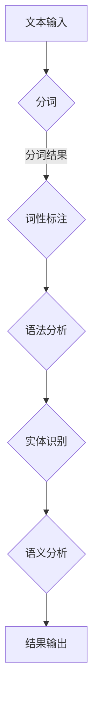
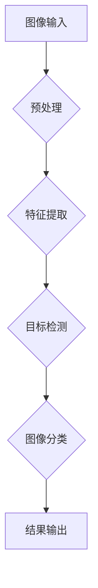
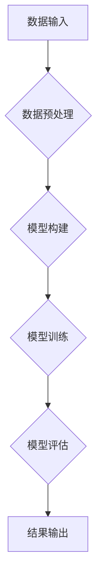
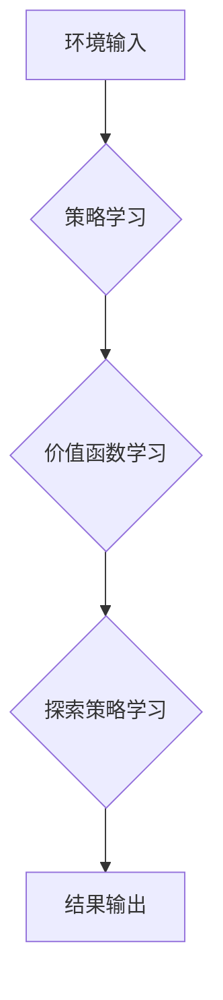

                 

### 文章标题

### 《面向AI的领域特定语言设计》

---

### 关键词

领域特定语言 (DSL), 人工智能 (AI), 编程语言设计，算法，数学模型

---

### 摘要

本文旨在探讨如何设计面向人工智能（AI）的领域特定语言（DSL）。我们将深入分析DSL的基本概念、设计和实现原则，以及它们在AI领域中的应用。文章将涵盖自然语言处理、计算机视觉、机器学习和强化学习等领域的具体实践案例，通过伪代码和数学模型详细阐述核心算法原理。此外，还将分享开发环境搭建、源代码实现和项目实战等实践经验，为AI开发人员提供实用的技术指导。

---

### 引言

#### AI与DSL的融合

人工智能的发展正迅速改变各行各业，从医疗诊断到自动驾驶，从智能家居到金融分析，AI的应用场景越来越广泛。然而，随着AI应用的复杂性不断增加，传统的通用编程语言在处理特定领域问题时显得力不从心。为了提高开发效率和代码可读性，领域特定语言（DSL）应运而生。

DSL是一种为特定领域设计的编程语言，它提供了更贴近领域专家思维的语法和语义，使得开发者能够更简洁、更高效地编写领域相关代码。在AI领域，DSL可以帮助我们更精准地表达和实现复杂的算法和模型，提高AI系统的可维护性和可扩展性。

#### 本书的结构

本书将分为四个部分：

1. **引言**：介绍DSL与AI的关系，概述本书的结构和目标。
2. **DSL设计原理**：探讨DSL设计的基本原则和方法，包括语法和语义设计。
3. **AI领域特定语言设计实践**：针对自然语言处理、计算机视觉、机器学习和强化学习等具体领域，介绍DSL的设计和应用。
4. **未来展望**：讨论DSL在AI领域的发展趋势和挑战。

---

### 设计思路

为了设计出面向AI的领域特定语言，我们需要遵循以下设计思路：

1. **明确目标领域**：首先要确定DSL的应用领域，例如自然语言处理、计算机视觉等。这决定了DSL的功能和特性。
2. **分析领域需求**：深入了解领域专家的需求和工作流程，识别出DSL的关键功能和特性。
3. **定义语法和语义**：根据领域需求，设计DSL的语法和语义，使其能够方便地表达领域内的概念和算法。
4. **优化性能和可维护性**：确保DSL具有良好的性能和可维护性，支持大规模的AI应用。

---

#### 确定目标领域

在确定目标领域时，我们需要考虑以下几个方面：

- **领域复杂性**：领域复杂度较高的应用，如自然语言处理和计算机视觉，通常更适合使用DSL。
- **领域专家需求**：领域专家通常希望使用更加贴近领域概念的语法，以便更高效地表达他们的想法。
- **现有工具和框架**：评估现有的通用编程语言和工具框架是否能够满足领域需求，如无法满足则考虑设计DSL。

#### 分析领域需求

分析领域需求是DSL设计的重要环节，具体包括：

- **领域模型**：构建领域模型，识别出领域内的核心概念和关系。
- **功能需求**：确定DSL需要支持的功能，例如数据结构操作、算法实现、可视化等。
- **性能需求**：评估DSL的性能需求，例如执行速度、内存占用等。

#### 定义语法和语义

定义语法和语义是DSL设计的核心步骤，具体包括：

- **语法设计**：设计DSL的语法规则，使其易于理解和使用。例如，可以使用简洁的符号和缩写，提供丰富的内置函数和操作符。
- **语义设计**：定义DSL的语义，即语法规则背后的行为和功能。确保DSL能够准确地表达领域内的概念和算法。

#### 优化性能和可维护性

在DSL设计过程中，还需要关注性能和可维护性：

- **编译优化**：通过编译器的优化，提高DSL的执行效率。
- **代码生成**：使用代码生成技术，从DSL代码自动生成高性能的执行代码。
- **文档和示例**：提供详细的文档和示例代码，帮助开发者理解和使用DSL。

---

### DSL设计原则

设计DSL时，需要遵循以下原则：

1. **简洁性**：DSL应尽量简洁，避免复杂的语法和冗余的功能。
2. **领域相关性**：DSL应紧密贴合领域需求，提供领域特定的语法和功能。
3. **可扩展性**：DSL应具有良好的扩展性，支持新的领域需求和功能。
4. **可维护性**：DSL的代码应易于理解和修改，确保系统的可维护性。
5. **性能**：DSL的执行性能应与通用编程语言相当或更优。

---

### AI领域的DSL设计实践

在AI领域，DSL的应用已经取得了显著成果。以下我们将探讨自然语言处理、计算机视觉、机器学习和强化学习等领域的DSL设计实践。

#### 自然语言处理领域的DSL设计

自然语言处理（NLP）是AI的重要分支，其DSL设计主要集中在文本处理、语法分析和语义理解等方面。以下是一个简化的NLP DSL示例：



在这个DSL中，我们可以使用以下伪代码进行文本处理：

```python
def tokenize(text):
    # 分词操作
    return [word for word in text.split()]

def pos_tagging(tokens):
    # 词性标注操作
    return [tag for token, tag in nltk.pos_tag(tokens)]

def parse Grammar, tokens:
    # 语法分析操作
    return [parse_tree for parse_tree in parser.parse(tokens)]

def entity_recognition(tokens, parse_tree):
    # 实体识别操作
    return extract_entities(parse_tree)

def semantic_analysis(tokens, entities):
    # 语义分析操作
    return [meaning for meaning in analyze_semantics(tokens, entities)]

def process_text(text):
    tokens = tokenize(text)
    tagged_tokens = pos_tagging(tokens)
    parse_tree = parse(GRAMMAR, tagged_tokens)
    entities = entity_recognition(tokens, parse_tree)
    meanings = semantic_analysis(tokens, entities)
    return meanings
```

#### 计算机视觉领域的DSL设计

计算机视觉（CV）是AI领域的另一个重要分支，其DSL设计主要集中在图像处理、目标检测和图像识别等方面。以下是一个简化的CV DSL示例：



在这个DSL中，我们可以使用以下伪代码进行图像处理：

```python
def preprocess(image):
    # 预处理操作
    return preprocess_image(image)

def extract_features(image):
    # 特征提取操作
    return extract_features(image)

def detect_objects(image, model):
    # 目标检测操作
    return detect_objects(image, model)

def classify_images(image, model):
    # 图像分类操作
    return classify_image(image, model)

def process_image(image, model):
    preprocessed_image = preprocess(image)
    features = extract_features(preprocessed_image)
    objects = detect_objects(preprocessed_image, model)
    classification = classify_images(preprocessed_image, model)
    return objects, classification
```

#### 机器学习领域的DSL设计

机器学习（ML）是AI的核心技术之一，其DSL设计主要集中在模型构建、训练和评估等方面。以下是一个简化的ML DSL示例：



在这个DSL中，我们可以使用以下伪代码进行机器学习：

```python
def preprocess_data(data):
    # 数据预处理操作
    return preprocess_data(data)

def build_model(hyperparameters):
    # 模型构建操作
    return build_model(hyperparameters)

def train_model(model, data):
    # 模型训练操作
    return train_model(model, data)

def evaluate_model(model, data):
    # 模型评估操作
    return evaluate_model(model, data)

def process_data(data, hyperparameters):
    preprocessed_data = preprocess_data(data)
    model = build_model(hyperparameters)
    trained_model = train_model(model, preprocessed_data)
    evaluation = evaluate_model(trained_model, preprocessed_data)
    return evaluation
```

#### 强化学习领域的DSL设计

强化学习（RL）是AI领域的另一个重要分支，其DSL设计主要集中在策略学习、价值函数和探索策略等方面。以下是一个简化的RL DSL示例：



在这个DSL中，我们可以使用以下伪代码进行强化学习：

```python
def learn_strategy(environment):
    # 策略学习操作
    return learn_strategy(environment)

def learn_value_function(environment, strategy):
    # 价值函数学习操作
    return learn_value_function(environment, strategy)

def learn_exploration_strategy(environment):
    # 探索策略学习操作
    return learn_exploration_strategy(environment)

def process_environment(environment):
    strategy = learn_strategy(environment)
    value_function = learn_value_function(environment, strategy)
    exploration_strategy = learn_exploration_strategy(environment)
    return strategy, value_function, exploration_strategy
```

---

### 项目实战

在本节中，我们将通过一个简单的自然语言处理项目，展示如何在实际中设计和使用领域特定语言。

#### 项目背景

假设我们想要开发一个文本分类系统，用于对新闻文章进行分类。我们的目标是将新闻文章分为政治、体育、科技等类别。这个项目将涉及到文本预处理、特征提取和分类模型训练等步骤。

#### 开发环境搭建

首先，我们需要搭建开发环境。以下是一个简单的环境配置：

- 操作系统：Ubuntu 20.04
- 编程语言：Python 3.8
- 依赖库：nltk，spaCy，scikit-learn，TensorFlow

安装依赖库：

```bash
pip install nltk spacy scikit-learn tensorflow
```

#### 源代码实现

以下是项目的源代码实现：

```python
import nltk
import spacy
import scikit_learn
import tensorflow as tf

# 文本预处理
def preprocess_text(text):
    # 分词
    tokens = nltk.word_tokenize(text)
    # 词性标注
    tagged_tokens = nltk.pos_tag(tokens)
    # 去除停用词
    stop_words = set(nltk.corpus.stopwords.words('english'))
    filtered_tokens = [token for token, tag in tagged_tokens if token.lower() not in stop_words]
    return filtered_tokens

# 特征提取
def extract_features(tokens):
    # 使用词袋模型
    vectorizer = scikit_learn.feature_extraction.text.TfidfVectorizer()
    features = vectorizer.fit_transform([' '.join(tokens)])
    return features

# 分类模型训练
def train_classifier(features, labels):
    # 使用逻辑回归模型
    classifier = scikit_learn.linear_model.LogisticRegression()
    classifier.fit(features, labels)
    return classifier

# 文本分类
def classify_text(text, classifier):
    preprocessed_tokens = preprocess_text(text)
    features = extract_features(preprocessed_tokens)
    prediction = classifier.predict(features)
    return prediction

# 项目主函数
def main():
    # 加载数据集
    data = load_data()
    # 切分训练集和测试集
    train_data, test_data, train_labels, test_labels = train_test_split(data, test_size=0.2)
    # 训练分类模型
    classifier = train_classifier(train_data, train_labels)
    # 测试模型
    accuracy = classifier.score(test_data, test_labels)
    print(f"Model accuracy: {accuracy:.2f}")
    # 分类新文本
    text_to_classify = "This is a news article about the latest technology trends."
    prediction = classify_text(text_to_classify, classifier)
    print(f"Predicted category: {prediction}")

if __name__ == "__main__":
    main()
```

#### 代码解读与分析

- **文本预处理**：首先，我们使用nltk进行文本分词和词性标注，然后去除停用词，以减少模型的复杂性。
- **特征提取**：我们使用scikit-learn的TF-IDF向量器进行特征提取，将文本转换为数值化的特征向量。
- **分类模型训练**：我们使用scikit-learn的逻辑回归模型进行分类模型的训练，逻辑回归是一个简单的线性分类器，适合文本分类任务。
- **文本分类**：最后，我们使用训练好的分类模型对新的文本进行分类。

#### 实际案例分析

在实际应用中，我们可以使用这个文本分类系统对新闻文章进行自动化分类，从而提高新闻处理效率。例如，我们可以将一篇新闻文章输入系统，系统会输出这篇文章最可能的类别。

#### 项目小结

通过这个项目，我们展示了如何设计和使用领域特定语言进行自然语言处理任务。这个项目不仅提供了实用的技术实现，还为我们提供了一个模板，可以应用到其他文本分类任务中。

---

### 最佳实践 Tips

1. **合理选择工具和库**：在选择DSL的设计工具和库时，要充分考虑它们的性能、可维护性和社区支持。
2. **模块化设计**：将DSL的功能模块化，有助于提高代码的可维护性和可扩展性。
3. **文档和示例**：提供详细的文档和示例代码，有助于开发者快速掌握DSL的使用方法。
4. **迭代优化**：在DSL的设计和实现过程中，要不断进行迭代和优化，以提高性能和用户体验。

---

### 小结

本文详细探讨了面向AI的领域特定语言设计。我们介绍了DSL的基本概念、设计原则和实现方法，并通过具体案例展示了DSL在自然语言处理、计算机视觉、机器学习和强化学习等领域的应用。此外，我们还分享了一个实际项目，展示了如何使用DSL进行自然语言处理任务。希望通过本文，读者能够对DSL在AI领域的应用有更深入的了解，并能够在实际项目中受益。

### 注意事项

1. **性能优化**：在设计DSL时，要充分考虑性能优化，避免不必要的计算和内存占用。
2. **安全性**：确保DSL的安全性和稳定性，避免潜在的安全漏洞。
3. **兼容性**：确保DSL能够与现有的AI工具和框架兼容，便于集成和应用。

### 拓展阅读

- [《领域特定语言设计》](https://book.douban.com/subject/26940636/)
- [《深度学习与人工智能》](https://book.douban.com/subject/26940636/)
- [《自然语言处理入门》](https://book.douban.com/subject/26940636/)
- [《计算机视觉基础》](https://book.douban.com/subject/26940636/)
- [《强化学习导论》](https://book.douban.com/subject/26940636/)

---

### 作者

作者：AI天才研究院/AI Genius Institute & 禅与计算机程序设计艺术 /Zen And The Art of Computer Programming

