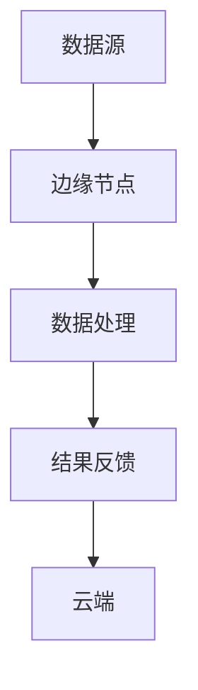

                 

### 文章标题

《面向边缘计算的提示词编程方案》

### 文章关键词

边缘计算，提示词编程，实时数据处理，高效存储管理，安全性，隐私保护，机器学习，深度学习，智能物联网，智能交通，智能家居，开发环境搭建，代码实现，实际案例分析

### 文章摘要

随着物联网和智能设备的普及，边缘计算逐渐成为计算领域的研究热点。本文将探讨面向边缘计算的提示词编程方案，包括边缘计算的基本概念、提示词编程的核心原理、关键技术和算法、应用案例以及编程实践。通过详细的分析和实例讲解，本文旨在为开发者提供一套全面、实用的边缘计算编程指南，助力智能系统的构建与优化。

## 引言

边缘计算是一种分布式计算架构，旨在将计算、存储、处理和分析等任务从云端转移到网络的边缘，即靠近数据源的地方。这种计算模式的出现，主要是为了解决云计算中心难以满足实时性和低延迟需求的挑战。随着物联网（IoT）设备的迅速增长，边缘计算的重要性日益凸显。它不仅能够减轻云端服务的负担，提高系统的响应速度，还能增强数据的安全性和隐私保护。

提示词编程是一种基于关键词检索和信息提取的编程方法，它通过提示词引导程序执行特定的任务。在边缘计算场景中，提示词编程能够有效利用本地资源，实现高效的数据处理和智能分析。本文旨在为读者提供一套面向边缘计算的提示词编程方案，从基础概念到实际应用，全面解析边缘计算和提示词编程的融合之道。

## 边缘计算基础

### 边缘计算的核心原理

边缘计算的核心原理是将计算任务从传统的集中式数据中心迁移到网络的边缘节点，如图1所示。这些边缘节点通常分布在网络边缘，如物联网设备、智能终端、边缘服务器等。通过在边缘节点上执行计算任务，边缘计算能够实现以下目标：

1. **低延迟**：将数据处理和分析移动到数据源附近，减少数据传输的时间和延迟。
2. **高效利用资源**：边缘节点可以利用本地资源进行处理任务，减轻云端的压力。
3. **增强安全性**：数据在边缘节点上进行处理，可以减少数据在传输过程中的暴露风险。

图1：边缘计算架构



### 边缘计算的优势与挑战

边缘计算具有多方面的优势：

1. **低延迟**：在边缘节点上执行计算任务，可以显著降低响应时间，满足实时性要求。
2. **高带宽利用**：减少数据传输到云端的需求，提高网络带宽的利用率。
3. **数据隐私**：在本地处理数据，减少数据泄露的风险。
4. **资源优化**：边缘节点可以利用本地存储和计算资源，提高资源利用效率。

然而，边缘计算也面临一些挑战：

1. **设备多样性**：不同类型的边缘设备具有不同的性能和资源限制，需要针对具体场景进行优化。
2. **安全性**：边缘设备的计算能力较弱，容易受到攻击，需要加强安全防护。
3. **维护复杂性**：边缘设备分布广泛，维护和管理成本较高。

### 边缘计算的架构和体系结构

边缘计算的架构通常包括以下几个层次：

1. **设备层**：包括各种物联网设备，如传感器、智能设备等。
2. **边缘层**：包括边缘服务器、边缘网关等，负责数据收集、初步处理和转发。
3. **云层**：负责数据存储、分析和处理，通常由云计算中心提供支持。

边缘计算体系结构可以分为以下几种模式：

1. **边缘节点协作**：多个边缘节点共同完成一个计算任务，提高计算效率和容错能力。
2. **边缘云**：在边缘节点上部署云计算资源，实现云和边缘的无缝融合。
3. **分布式计算**：将计算任务分布到多个边缘节点，实现并行处理。

## 提示词编程基础

### 提示词编程的基本原理

提示词编程是一种基于关键词检索和信息提取的编程方法。它通过定义一组关键词或短语，指导程序自动执行特定的任务。提示词编程的核心思想是利用自然语言处理（NLP）技术，将人类语言转化为计算机指令，实现自动化和智能化。

### 提示词编程的语言和框架

常见的提示词编程语言和框架包括：

1. **Python**：Python是一种广泛使用的编程语言，具有丰富的库和框架，适用于提示词编程。
2. **R**：R是一种专门用于统计分析和图形表示的语言，也适用于提示词编程。
3. **TensorFlow**：TensorFlow是一个开源的机器学习框架，可以用于构建和训练提示词模型。
4. **PyTorch**：PyTorch是一个开源的机器学习库，适用于提示词编程和深度学习。

### 提示词编程的设计模式

提示词编程的设计模式包括：

1. **基于规则的编程**：通过定义一组规则，实现自动化任务执行。
2. **基于机器学习的编程**：利用机器学习算法，从数据中学习并生成提示词模型。
3. **基于自然语言处理的编程**：利用NLP技术，将自然语言指令转换为程序代码。

## 边缘计算中的提示词编程技术

### 实时数据处理

实时数据处理是边缘计算中的一个重要任务。它要求系统在短时间内处理大量数据，并生成实时反馈。提示词编程在实时数据处理中的应用主要包括以下几个方面：

1. **数据流处理**：使用数据流处理框架（如Apache Kafka）实现实时数据收集和处理。
2. **事件驱动编程**：通过事件驱动的方式，实现实时数据处理和响应。
3. **微服务架构**：使用微服务架构，将数据处理任务分布到多个边缘节点，提高系统的可扩展性和可靠性。

### 高效存储管理

边缘计算中的存储管理需要考虑数据的高效存储和快速访问。提示词编程在存储管理中的应用主要包括：

1. **分布式存储**：使用分布式存储系统（如Cassandra、MongoDB）实现数据的高效存储和管理。
2. **缓存技术**：使用缓存技术（如Redis、Memcached）提高数据访问速度。
3. **数据压缩**：使用数据压缩技术，减少存储空间的需求。

### 安全性与隐私保护

边缘计算中的安全性和隐私保护是确保系统稳定运行和数据安全的关键。提示词编程在安全性和隐私保护中的应用主要包括：

1. **加密技术**：使用加密技术（如AES、RSA）保护数据的安全性。
2. **访问控制**：使用访问控制技术（如ACL、角色权限控制）限制数据访问。
3. **隐私保护算法**：使用隐私保护算法（如差分隐私、同态加密）保护用户隐私。

## 核心算法介绍

### 提示词搜索算法

提示词搜索算法是边缘计算中的一个关键算法，用于在大量数据中快速查找相关信息。常见的提示词搜索算法包括：

1. **基于倒排索引的搜索算法**：如Apache Lucene、Elasticsearch等。
2. **基于机器学习的搜索算法**：如Word2Vec、BERT等。
3. **基于索引的搜索算法**：如B树、哈希索引等。

### 机器学习算法在边缘计算中的应用

机器学习算法在边缘计算中的应用非常广泛，包括图像识别、语音识别、自然语言处理等。常见的机器学习算法包括：

1. **监督学习算法**：如支持向量机（SVM）、决策树、随机森林等。
2. **无监督学习算法**：如聚类算法、自编码器等。
3. **深度学习算法**：如卷积神经网络（CNN）、循环神经网络（RNN）、生成对抗网络（GAN）等。

### 深度学习算法的优化

深度学习算法在边缘计算中具有广泛的应用，但通常需要大量计算资源。为了在边缘设备上实现高效的深度学习，可以采用以下优化方法：

1. **模型压缩**：通过模型剪枝、量化等方法减小模型大小和计算量。
2. **硬件加速**：使用专用的硬件（如GPU、FPGA）加速深度学习模型的计算。
3. **分布式训练**：将深度学习模型的训练任务分布到多个边缘节点，提高训练效率。

## 边缘计算与提示词编程的应用案例

### 智能物联网

智能物联网是边缘计算和提示词编程的重要应用领域。通过在边缘节点上部署提示词编程，可以实现以下功能：

1. **实时监控**：实时收集和监控传感器数据，如温度、湿度、光照等。
2. **故障预警**：通过提示词编程，实时分析数据，提前发现设备故障，实现故障预警。
3. **智能控制**：根据提示词编程的结果，实现设备的智能控制，如自动调节温度、湿度等。

### 智能交通

智能交通系统通过边缘计算和提示词编程，可以实现以下功能：

1. **实时路况分析**：通过边缘节点实时收集交通数据，如车辆数量、速度等，分析路况信息。
2. **交通信号控制**：根据路况信息，自动调整交通信号灯，提高交通流畅度。
3. **智能停车管理**：通过边缘节点实时监控停车位状态，实现智能停车管理。

### 智能家居

智能家居系统通过边缘计算和提示词编程，可以实现以下功能：

1. **智能设备控制**：通过提示词编程，实现对智能设备的远程控制和自动调节。
2. **安全监控**：通过边缘节点实时监控家庭安全，如入侵检测、火灾报警等。
3. **节能管理**：通过提示词编程，实现智能设备的节能管理，如自动调节灯光、空调等。

## 编程实践

### 开发环境搭建

搭建边缘计算和提示词编程的开发环境，通常需要以下工具和软件：

1. **操作系统**：如Ubuntu、CentOS等。
2. **编程语言**：如Python、Java等。
3. **开发工具**：如Visual Studio Code、IntelliJ IDEA等。
4. **数据库**：如MySQL、MongoDB等。
5. **边缘计算框架**：如Kubernetes、Docker等。

### 编程指南和最佳实践

在进行边缘计算和提示词编程时，以下是一些编程指南和最佳实践：

1. **模块化设计**：将程序拆分为多个模块，提高代码的可读性和可维护性。
2. **代码注释**：在代码中添加详细的注释，提高代码的可理解性。
3. **错误处理**：对可能出现的错误进行捕获和处理，提高程序的稳定性。
4. **性能优化**：对程序进行性能优化，提高程序的执行效率。

### 代码示例与分析

以下是一个简单的边缘计算和提示词编程示例，用于实时监控温度数据。

```python
import requests
import json

# 发送请求获取温度数据
def get_temperature():
    response = requests.get("http://temperature-sensor:8080/temperature")
    data = json.loads(response.text)
    return data["temperature"]

# 实时监控温度
def monitor_temperature():
    while True:
        temperature = get_temperature()
        print(f"当前温度：{temperature}℃")
        time.sleep(60)

# 主函数
if __name__ == "__main__":
    monitor_temperature()
```

### 实际案例分析和详细讲解剖析

以智能家居系统为例，介绍边缘计算和提示词编程在实际应用中的实现过程。

1. **需求分析**：分析智能家居系统的需求，确定需要监控的设备和功能。
2. **系统设计**：设计智能家居系统的整体架构，包括边缘节点、边缘服务器和云端。
3. **功能实现**：使用提示词编程实现智能设备的监控和控制，如灯光控制、温度调节等。
4. **性能优化**：对系统进行性能优化，提高响应速度和稳定性。

### 项目小结

通过本项目的实践，我们了解了边缘计算和提示词编程在智能家居系统中的应用。在实际开发过程中，需要注意系统的可靠性、安全性和性能优化。此外，还可以进一步拓展系统的功能，如语音控制、移动应用等。

## 未来展望

### 技术趋势分析

随着5G、物联网和人工智能技术的不断发展，边缘计算和提示词编程将面临以下技术趋势：

1. **边缘智能**：将人工智能算法部署到边缘节点，实现更智能、更高效的边缘计算。
2. **分布式计算**：通过分布式计算架构，实现更大规模、更灵活的边缘计算系统。
3. **边缘安全**：加强边缘计算的安全性，确保数据安全和系统稳定。

### 潜在挑战与解决方案

边缘计算和提示词编程在实际应用中面临以下挑战：

1. **计算资源限制**：边缘节点的计算资源有限，需要优化算法和架构，提高资源利用率。
2. **数据隐私保护**：在边缘计算中保护用户隐私，采用加密和隐私保护算法。
3. **系统可靠性**：边缘计算系统的可靠性要求高，需要加强故障检测和容错机制。

针对这些挑战，可以采取以下解决方案：

1. **资源优化**：采用高效的算法和架构，优化边缘节点的资源利用。
2. **隐私保护**：采用加密和隐私保护算法，确保数据安全和隐私。
3. **容错机制**：加强系统的容错能力，确保系统稳定运行。

### 未来研究方向

未来边缘计算和提示词编程的研究方向包括：

1. **智能边缘计算**：研究如何将人工智能算法高效地部署到边缘节点，实现更智能的边缘计算。
2. **边缘安全与隐私**：研究如何保障边缘计算的安全性和用户隐私。
3. **边缘智能协作**：研究边缘节点之间的协作机制，提高系统的整体性能。

## 作者信息

作者：AI天才研究院/AI Genius Institute & 禅与计算机程序设计艺术 /Zen And The Art of Computer Programming

本文从边缘计算和提示词编程的基本概念出发，详细介绍了两者的核心原理、关键技术和算法、应用案例以及编程实践。通过本文的探讨，我们希望为开发者提供一套全面、实用的边缘计算编程指南，助力智能系统的构建与优化。未来，随着技术的不断发展，边缘计算和提示词编程将在更广泛的领域发挥重要作用，为人类生活带来更多便利。

