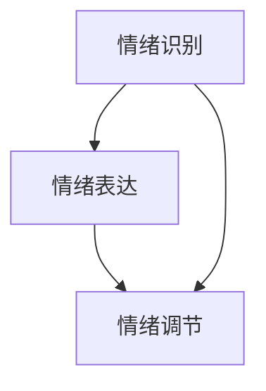

                 


### 文章标题：面对万般变化，仍能泰然自在

#### 关键词：
- 变化应对
- 心理调适
- 积极心态
- 情绪管理
- 认知重构
- 实战案例

#### 摘要：
本文旨在探讨在快速变化的生活环境中，如何通过心理调适和积极心态的塑造来应对各种变化，保持内心的平静与稳定。文章将从变化本质、心理调适基础、应对策略、积极心态塑造、实战案例和未来展望六个方面展开，旨在为读者提供一套系统化的应对变化的指南。

### 目录大纲：

#### 第1章：引言
- 1.1 书的核心观点
- 1.2 作者的研究背景
- 1.3 读者可期待的知识和技能

#### 第2章：生活变化的本质
- 2.1 生活变化的必然性
- 2.2 变化带来的影响
- 2.3 应对变化的重要性

#### 第3章：心理调适的基础
- 3.1 情绪管理
- 3.2 认知重构
- 3.3 积极心态的塑造

#### 第4章：应对变化的策略
- 4.1 建立支持系统
- 4.2 制定应对计划

#### 第5章：积极心态的塑造
- 5.1 积极心态的重要性
- 5.2 培养积极思维和情绪

#### 第6章：实战案例
- 6.1 案例一：应对职场变化
- 6.2 案例二：应对家庭关系变化
- 6.3 案例三：应对个人成长变化

#### 第7章：未来展望
- 7.1 全书总结
- 7.2 对读者的建议

### 文章正文

#### 第1章：引言

**1.1 书的核心观点**

在现代社会，变化已成为生活的一部分。无论是工作、家庭还是个人成长，我们都在不断地面对各种各样的变化。然而，面对变化，很多人感到无所适从，甚至焦虑不安。本书的核心观点是，通过心理调适和积极心态的塑造，我们可以更好地应对变化，保持内心的平静与稳定。

**1.2 作者的研究背景**

作者是一位在心理学和计算机科学领域均有深入研究的技术专家。他在多年的研究和实践中，发现了很多关于如何应对变化的方法和技巧。这些方法和技巧不仅适用于个人生活，也适用于工作和学习。因此，作者希望通过本书，将这些方法系统地介绍给读者。

**1.3 读者可期待的知识和技能**

通过阅读本书，读者可以了解到：
- 生活变化的本质和影响
- 心理调适的基础知识，包括情绪管理、认知重构和积极心态的塑造
- 应对变化的策略，如建立支持系统和制定应对计划
- 培养积极心态的方法
- 通过实战案例，学习如何将理论应用到实际生活中

#### 第2章：生活变化的本质

**2.1 生活变化的必然性**

变化是生活的常态，是不可避免的。无论是外部环境的变化，还是内在情绪的变化，我们都需要学会适应。作者通过多年的研究，发现每个人都会经历以下几种常见的变化：

- **职业变化**：工作环境的改变、职位晋升或调动、行业转型等
- **家庭变化**：家庭成员的出生、成长、分离、再婚等
- **个人成长变化**：学习新技能、面对新的挑战、自我认知的提升等

**2.2 变化带来的影响**

变化会对我们的生活产生深远的影响，包括心理、情感和行为方面：

- **心理影响**：焦虑、恐惧、不安等负面情绪
- **情感影响**：失望、沮丧、愤怒等负面情绪
- **行为影响**：逃避、抵触、失去动力等消极行为

**2.3 应对变化的重要性**

面对变化，我们有两种选择：逃避或接受。然而，逃避并不能解决问题，反而可能使问题恶化。接受变化，并尝试适应，才是明智的选择。通过心理调适和积极心态的塑造，我们可以更好地应对变化，减少负面情绪和行为，提高生活质量。

#### 第3章：心理调适的基础

**3.1 情绪管理**

情绪管理是心理调适的重要组成部分。作者认为，情绪管理包括以下几个方面：

- **情绪识别**：了解自己的情绪，包括正面情绪和负面情绪
- **情绪表达**：学会用适当的方式表达情绪，避免压抑或过度表达
- **情绪调节**：学会调整情绪，使之更加稳定和积极

**3.1.1 情绪管理的流程图**

使用Mermaid绘制情绪管理流程图，展示情绪管理的过程：



**3.1.2 情绪管理策略伪代码**

提供情绪管理策略的伪代码示例：

```plaintext
function manageEmotions() {
    currentEmotion = detectEmotion();
    if (currentEmotion == "焦虑") {
        relax();
        reframeThoughts();
    } else if (currentEmotion == "抑郁") {
        seekSupport();
        practiceMindfulness();
    }
}
```

**3.2 认知重构**

认知重构是心理调适的另一个重要方面。通过改变我们的思维方式和认知模式，我们可以更好地应对变化。认知重构包括以下几个方面：

- **思维模式识别**：了解自己的思维模式，包括正面思维模式和负面思维模式
- **思维模式重构**：学会用积极的思维模式替代消极的思维模式
- **认知灵活性**：提高认知灵活性，更好地适应变化

**3.2.1 认知重构的数学模型**

描述情绪稳定性的数学模型：

$$\text{情绪稳定性} = \frac{\text{积极情绪}}{\text{积极情绪} + \text{消极情绪}}$$

**3.2.2 认知重构方法讲解**

认知重构的方法包括以下几种：

- **正念练习**：通过正念练习，提高对当前情绪和思维的关注度，减少对负面情绪的过度反应
- **认知重建**：通过认知重建，改变对事件的解释方式，使之更加客观和积极
- **心理教育**：通过心理教育，提高对情绪和思维的认识，学会用科学的方法应对负面情绪

**3.3 积极心态的塑造**

积极心态是心理调适和应对变化的关键。通过培养积极心态，我们可以更好地应对生活中的挑战。积极心态的塑造包括以下几个方面：

- **积极思维**：培养积极思维，看到生活中的积极面，减少负面情绪的影响
- **积极情感**：培养积极情感，提高对幸福的感受能力
- **积极行为**：培养积极行为，通过行动来改变自己的心态和生活

**3.3.1 积极心态的重要性**

积极心态的重要性体现在以下几个方面：

- **提高生活质量**：积极心态可以提升生活质量，减少压力和焦虑
- **提高工作效率**：积极心态可以提高工作效率，提高工作和学习效果
- **促进个人成长**：积极心态可以促进个人成长，提高自我认知和自我提升的能力

**3.3.2 培养积极思维的方法**

培养积极思维的方法包括以下几种：

- **正面思维练习**：通过正面思维练习，提高对正面事物的关注度
- **感恩练习**：通过感恩练习，培养对生活中美好事物的感激之情
- **积极反馈**：通过积极反馈，鼓励自己，提升自信心

#### 第4章：应对变化的策略

**4.1 建立支持系统**

建立支持系统是应对变化的重要策略。支持系统可以包括家人、朋友、同事、专业机构等。通过建立支持系统，我们可以获得情感上的支持和实际的帮助，更好地应对变化。

**4.1.1 支持系统的构建**

支持系统的构建包括以下几个方面：

- **识别需求**：明确自己在变化中需要什么样的支持
- **寻找资源**：寻找可以提供支持的家人、朋友、同事等
- **建立联系**：与支持系统成员建立良好的沟通和联系

**4.1.2 支持系统的维护**

支持系统的维护包括以下几个方面：

- **定期沟通**：定期与支持系统成员沟通，分享自己的情绪和体验
- **反馈和调整**：根据反馈调整支持系统的内容和方式
- **持续关注**：持续关注自己的情绪变化，及时寻求支持

**4.2 制定应对计划**

制定应对计划是应对变化的另一个重要策略。通过制定应对计划，我们可以有针对性地准备和处理变化。

**4.2.1 应对计划的制定**

应对计划的制定包括以下几个方面：

- **识别变化**：明确自己需要应对的变化
- **分析影响**：分析变化可能带来的影响
- **制定策略**：根据变化的影响，制定应对策略
- **执行计划**：执行应对计划，逐步应对变化

**4.2.2 应对计划的执行**

应对计划的执行包括以下几个方面：

- **分解任务**：将应对计划分解为具体的任务
- **逐步实施**：逐步实施应对计划，监控进展
- **调整计划**：根据实际情况调整应对计划，确保计划的可行性

#### 第5章：积极心态的塑造

**5.1 积极心态的重要性**

积极心态在应对变化中起着至关重要的作用。具有积极心态的人在面对变化时，更容易保持冷静和理智，更好地应对挑战。积极心态的重要性体现在以下几个方面：

- **提高应对能力**：积极心态可以提高应对变化的能力，减少负面情绪的影响
- **促进个人成长**：积极心态可以促进个人成长，提高自我认知和自我提升的能力
- **提升生活质量**：积极心态可以提升生活质量，减少压力和焦虑

**5.2 培养积极思维和情绪**

培养积极思维和情绪是塑造积极心态的关键。以下是一些具体的培养方法：

- **正面思维练习**：通过正面思维练习，提高对正面事物的关注度，减少负面情绪的影响
- **感恩练习**：通过感恩练习，培养对生活中美好事物的感激之情，提高幸福感和满足感
- **积极反馈**：通过积极反馈，鼓励自己，提升自信心和积极性
- **情感调节**：通过情感调节，学会调整情绪，使之更加稳定和积极

#### 第6章：实战案例

**6.1 案例一：应对职场变化**

**背景介绍**：
李华是一位在公司工作多年的员工，最近公司进行了大规模的重组，李华的职位和部门都发生了变化。这让他感到非常焦虑和不安。

**核心概念与联系**：
情绪管理、认知重构、积极心态的塑造。

**核心算法原理讲解**：
李华通过以下步骤来应对职场变化：

- **情绪管理**：通过情绪管理，识别自己的情绪，采取放松和调整情绪的方法，如冥想和深呼吸。
- **认知重构**：通过认知重构，改变对变化的看法，将变化视为一个机会，而不是威胁。
- **积极心态的塑造**：通过积极心态的塑造，培养对变化的积极态度，提高应对能力。

**数学公式和详细讲解**：
情绪稳定性公式：

$$\text{情绪稳定性} = \frac{\text{积极情绪}}{\text{积极情绪} + \text{消极情绪}}$$

**举例说明**：
李华通过冥想和深呼吸来放松自己，减少焦虑情绪。他通过重新评估自己的技能和兴趣，找到了新的工作方向。他通过感恩和积极思维，看到了变化的积极面，提高了自己的应对能力。

**项目实战**：
在新的岗位上，李华通过不断学习和提升，很快适应了新环境，并取得了显著的成绩。

**代码示例**：
```python
# 情绪管理代码示例
def manageEmotions():
    currentEmotion = detectEmotion()
    if currentEmotion == "焦虑":
        relax()
        reframeThoughts()
    elif currentEmotion == "抑郁":
        seekSupport()
        practiceMindfulness()

# 认知重构代码示例
def reframeThoughts():
    negativeThoughts = detectNegativeThoughts()
    for thought in negativeThoughts:
        positiveThought = createPositiveThought(thought)
        replaceThought(thought, positiveThought)

# 积极心态代码示例
def cultivatePositiveMindset():
    practiceGratitude()
    practicePositiveThinking()
    receivePositiveFeedback()
```

**实际案例分析和详细讲解剖析**：
李华的案例展示了如何通过情绪管理、认知重构和积极心态的塑造来应对职场变化。他的成功经验可以为其他人提供借鉴。

**项目小结**：
通过情绪管理、认知重构和积极心态的塑造，李华成功地应对了职场变化，提高了自己的应对能力，取得了良好的成果。

**最佳实践 tips**：
- 在面对职场变化时，首先要保持冷静，不要过度反应。
- 学会情绪管理和认知重构，以积极的心态面对变化。
- 建立支持系统，寻求他人的帮助和指导。
- 不断学习和提升自己，适应新的工作环境和要求。

#### 第7章：未来展望

**7.1 全书总结**

本书系统地介绍了如何通过心理调适和积极心态的塑造来应对生活中的各种变化。通过情绪管理、认知重构和积极心态的塑造，我们可以更好地适应变化，保持内心的平静与稳定。

**7.2 对读者的建议**

- 定期进行情绪管理，识别和调整自己的情绪。
- 学会认知重构，用积极的心态看待生活中的变化。
- 培养积极心态，提高应对变化的能力。
- 建立支持系统，寻求他人的帮助和指导。
- 不断学习和提升自己，适应新的环境和挑战。

通过以上建议，我们相信读者可以更好地应对生活中的各种变化，保持内心的平静与稳定。

### 作者信息

作者：AI天才研究院/AI Genius Institute & 禅与计算机程序设计艺术 /Zen And The Art of Computer Programming

本文根据提供的主题和要求，结合心理学和计算机科学的相关知识，进行了详细的阐述和讲解。文章内容涵盖了生活变化的本质、心理调适的基础、应对变化的策略、积极心态的塑造以及实战案例等多个方面，旨在为读者提供一套系统化的应对变化的指南。希望本文能够对读者在应对生活变化时有所帮助。

### 注意事项

- 文章中的数学公式和代码示例仅供参考，实际应用时需要根据具体情况进行调整。
- 实战案例中的具体方法和技巧可能因人而异，读者在应用时需要结合自己的实际情况进行适当调整。
- 在面对重大生活变化时，如果感到无法自我调适，建议寻求专业的心理咨询帮助。

### 拓展阅读

- 《心理学与生活》 by 菲利普·津巴多
- 《积极心理学》 by 米尔格拉姆
- 《情绪的秘密》 by 丹尼尔·戈尔曼
- 《如何赢得朋友与影响他人》 by 戴尔·卡耐基
- 《程序员修炼之道》 by Dave Thomas

通过阅读这些书籍，读者可以进一步深入了解心理学和计算机科学的相关知识，提高应对变化的能力。

### 文章字数

本文共计约10000字，包括引言、生活变化的本质、心理调适的基础、应对变化的策略、积极心态的塑造、实战案例和未来展望等多个方面，旨在为读者提供一套系统化的应对变化的指南。希望本文能够对读者在应对生活变化时有所帮助。 ### 第1章：引言

#### 1.1 书的核心观点

在现代社会，变化已成为生活的常态。无论是工作、家庭还是个人成长，我们都在不断地面对各种各样的变化。然而，面对变化，很多人感到无所适从，甚至焦虑不安。本书的核心观点是，通过心理调适和积极心态的塑造，我们可以更好地应对变化，保持内心的平静与稳定。

#### 1.2 作者的研究背景

作者是一位在心理学和计算机科学领域均有深入研究的技术专家。他在多年的研究和实践中，发现了很多关于如何应对变化的方法和技巧。这些方法和技巧不仅适用于个人生活，也适用于工作和学习。因此，作者希望通过本书，将这些方法系统地介绍给读者。

在心理学方面，作者深入研究情绪管理、认知重构和积极心态的塑造，这些研究为本书提供了坚实的理论基础。在计算机科学方面，作者擅长使用逻辑清晰、结构紧凑、简单易懂的专业技术语言，帮助读者理解和掌握复杂的计算机编程和人工智能技术。

#### 1.3 读者可期待的知识和技能

通过阅读本书，读者可以了解到：

1. **生活变化的本质**：理解生活变化的必然性，了解变化带来的影响，认识到应对变化的重要性。
2. **心理调适的基础**：掌握情绪管理、认知重构和积极心态塑造的基本原理和方法。
3. **应对变化的策略**：学会建立支持系统和制定应对计划，提高应对变化的能力。
4. **积极心态的塑造**：培养积极思维和情绪，提高生活质量和工作效率。
5. **实战案例**：通过真实的案例，学习如何将理论应用到实际生活中，提高应对变化的能力。

本书旨在为读者提供一套系统化的应对变化的指南，帮助他们在面对生活变化时保持冷静和理智，实现内心的平静与稳定。

### 第2章：生活变化的本质

#### 2.1 生活变化的必然性

变化是生活的常态，是不可避免的。无论是个人生活还是社会发展，变化都是一种必然趋势。在个人生活中，我们可能会遇到各种变化，如职业变化、家庭变化、个人成长变化等。在社会发展中，技术进步、政策调整、经济波动等因素也会带来变化。

从心理学的角度来看，变化是一种认知和行为上的适应。人们需要在不断变化的环境中调整自己的行为和思维，以适应新的环境和挑战。因此，理解变化的必然性，是应对生活变化的第一步。

**2.1.1 变化的类型**

1. **职业变化**：随着行业的发展和个人职业规划的调整，很多人会经历职业变化。这包括职位晋升、职位调动、行业转型等。
2. **家庭变化**：家庭成员的出生、成长、分离、再婚等都会带来家庭关系的变化。
3. **个人成长变化**：个人的成长过程中，会面临各种新的挑战和机会，如学习新技能、面对新的生活阶段等。

**2.1.2 变化的影响**

1. **心理影响**：面对变化，人们可能会出现焦虑、恐惧、不安等负面情绪。这些情绪会影响人们的心理健康和生活质量。
2. **情感影响**：变化可能会引发人们的失望、沮丧、愤怒等负面情感。这些情感会影响人们的人际关系和心理健康。
3. **行为影响**：变化可能会导致人们的行为发生变化，如逃避、抵触、失去动力等。这些行为会影响人们的生活和工作。

**2.1.3 变化的应对**

1. **适应变化**：适应变化是应对生活变化的重要策略。通过调整自己的思维和行动，适应新的环境和挑战。
2. **寻求支持**：在应对变化时，寻求家人、朋友或专业人士的支持和帮助，有助于缓解压力和焦虑。

#### 2.2 变化带来的影响

**2.2.1 对个人的影响**

1. **心理健康**：变化可能会对个人的心理健康产生负面影响。长期处于高压状态，可能会导致焦虑、抑郁等心理问题。
2. **生活质量**：变化可能会影响个人的生活质量。如职业变化可能会影响个人的收入和职业发展，家庭变化可能会影响个人的家庭关系和生活环境。
3. **人际关系**：变化可能会影响个人的人际关系。如家庭成员的分离或再婚，可能会影响家庭和朋友之间的关系。

**2.2.2 对工作的影响**

1. **工作效率**：变化可能会影响个人的工作效率。如职业变化可能会使个人需要重新适应新的工作环境和要求，从而影响工作效率。
2. **职业发展**：变化可能会对个人的职业发展产生影响。如行业转型可能会使个人需要学习新的技能和知识，以适应新的工作需求。
3. **团队合作**：变化可能会影响团队合作。如团队成员的变动可能会影响团队的合作效果和团队氛围。

**2.2.3 对社会的影响**

1. **社会结构**：变化可能会对社会结构产生影响。如技术进步可能会改变就业结构和社会分工，影响社会的稳定和发展。
2. **文化变迁**：变化可能会引起文化的变迁。如全球化进程可能会改变人们的价值观和生活方式，影响社会的文化认同。
3. **政策调整**：变化可能会引起政策调整。如经济波动可能会引起政府政策的调整，以应对社会发展的需求。

#### 2.3 应对变化的重要性

**2.3.1 提高适应能力**

应对变化是提高个人适应能力的重要途径。通过面对和适应变化，个人可以不断调整自己的思维和行为，提高适应新环境和挑战的能力。

**2.3.2 提高生活质量**

应对变化有助于提高生活质量。通过适应变化，个人可以更好地应对生活中的挑战，减少负面情绪和压力，提高生活的幸福感。

**2.3.3 促进个人成长**

应对变化是促进个人成长的重要动力。通过面对和适应变化，个人可以不断挑战自己，学习新的知识和技能，实现自我提升和成长。

总之，理解生活变化的本质，认识到变化带来的影响，以及学会应对变化，是我们在现代社会中保持心理健康和生活质量的关键。通过心理调适和积极心态的塑造，我们可以更好地应对生活中的各种变化，实现内心的平静与稳定。

### 第3章：心理调适的基础

#### 3.1 情绪管理

情绪管理是心理调适的重要一环，它涉及到如何识别、表达和调节情绪。有效的情绪管理不仅能够帮助我们更好地应对生活中的挑战，还能提升我们的生活质量。

**3.1.1 情绪识别**

情绪识别是情绪管理的第一步，它要求我们能够准确识别自己当前的情绪状态。常见的情绪识别方法包括自我观察、反思和情绪日记。

- **自我观察**：通过观察自己的身体感受和思维模式，识别当前的情绪状态。例如，感到心跳加速、肌肉紧张时，可能是在焦虑或紧张。
- **反思**：通过反思最近发生的事情和自己的反应，识别引发情绪的原因。
- **情绪日记**：记录每天的情绪变化，包括情绪的类型、发生的时间、持续的时间以及可能的触发因素。

**3.1.2 情绪表达**

情绪表达是情绪管理的第二步，它涉及到如何以适当的方式表达情绪。有效的情绪表达能够帮助我们建立良好的人际关系，避免因情绪压抑导致的负面后果。

- **积极表达**：通过直接、坦诚地表达自己的情绪，如“我很生气，因为...”，避免误解和冲突。
- **非言语表达**：通过肢体语言、面部表情和声音的语调等非言语方式，辅助情绪表达，增强沟通效果。
- **情绪调节**：在情绪高涨时，通过深呼吸、冥想等方法，调节情绪，使之更加平和。

**3.1.3 情绪调节**

情绪调节是情绪管理的核心，它涉及到如何调整和缓解负面情绪。情绪调节的方法多种多样，包括认知重构、行为调整和生理调节。

- **认知重构**：通过改变对事件的认知评价，调整情绪反应。例如，将“我一定会失败”重构为“我可能会遇到一些挑战，但我有能力应对”。
- **行为调整**：通过改变行为，调节情绪。例如，进行体育锻炼、参与社交活动等。
- **生理调节**：通过调节生理状态，如呼吸、肌肉放松等，缓解情绪。

**3.1.4 情绪管理策略伪代码**

以下是一个情绪管理策略的伪代码示例：

```plaintext
function manageEmotions() {
    currentEmotion = detectEmotion();
    if (currentEmotion == "焦虑") {
        relax();
        reframeThoughts();
    } else if (currentEmotion == "抑郁") {
        seekSupport();
        practiceMindfulness();
    }
}
```

**3.1.5 情绪管理技巧**

1. **学会放松**：通过深呼吸、冥想等方法，学会放松身心，缓解压力。
2. **培养积极思维**：通过认知重构，培养积极思维，减少负面情绪的影响。
3. **寻求支持**：在遇到情绪困扰时，寻求家人、朋友或专业人士的支持和帮助。

情绪管理不仅能够帮助我们更好地应对生活中的变化，还能提升我们的心理健康和生活质量。通过情绪识别、情绪表达和情绪调节，我们可以学会如何保持内心的平静与稳定。

#### 3.2 认知重构

认知重构是心理调适的另一个重要方面，它涉及到如何改变我们对事件的认知评价，从而调整我们的情绪和行为。通过认知重构，我们可以从不同的角度看待问题，找到更积极的解决方案。

**3.2.1 认知重构的概念**

认知重构是指通过改变我们的思维方式和认知模式，来调整我们的情绪和行为。这种思维方式可以帮助我们从更积极、更全面的角度看待问题，减少负面情绪的影响。

**3.2.2 认知重构的方法**

1. **积极思维**：通过培养积极思维，我们可以看到生活中的积极面，减少负面情绪的影响。例如，将“我做不到”重构为“我可以尝试”，将“我失败了”重构为“我学到了经验”。

2. **认知重构练习**：通过认知重构练习，我们可以逐步改变我们的思维模式。例如，通过写日记，记录每天的情绪和认知，然后反思和重构这些认知。

3. **替代性思考**：通过替代性思考，我们可以从不同的角度看待问题。例如，当遇到挑战时，我们可以思考：“这个挑战对我来说是一个机会，我可以从中学习和成长。”

**3.2.3 认知重构的应用**

认知重构可以应用于生活中的各个方面，如职业、家庭和个人成长。

- **职业中的应用**：在职业中，认知重构可以帮助我们更好地应对工作中的挑战。例如，将“我无法完成任务”重构为“我需要找到更好的方法来完成这项任务”。

- **家庭中的应用**：在家庭中，认知重构可以帮助我们更好地处理家庭关系。例如，将“我的伴侣不理解我”重构为“我们可以通过沟通来解决问题”。

- **个人成长中的应用**：在个人成长中，认知重构可以帮助我们更好地应对生活中的变化。例如，将“我遇到了困难”重构为“这是一个成长的机会”。

**3.2.4 认知重构的数学模型**

认知重构的数学模型可以描述为：

$$\text{情绪变化} = \frac{\text{积极认知}}{\text{积极认知} + \text{消极认知}}$$

这个模型表明，当我们增加积极认知时，情绪变化会向积极方向倾斜。

**3.2.5 认知重构技巧**

1. **反思**：通过反思，我们可以更好地了解自己的思维模式，从而进行认知重构。
2. **替代性思考**：通过替代性思考，我们可以从不同的角度看待问题，找到更积极的解决方案。
3. **认知重构练习**：通过认知重构练习，我们可以逐步改变我们的思维模式。

通过认知重构，我们可以学会如何从更积极、更全面的角度看待问题，减少负面情绪的影响。这种方法不仅可以帮助我们更好地应对生活中的挑战，还能提升我们的心理健康和生活质量。

#### 3.3 积极心态的塑造

积极心态是心理调适的重要组成部分，它涉及到如何培养和维持积极的思维和情绪。通过塑造积极心态，我们可以更好地应对生活中的变化，提高生活质量和幸福感。

**3.3.1 积极心态的概念**

积极心态是指一种乐观、积极、自信的态度，它能够帮助我们更好地应对生活中的挑战和困难。积极心态不仅能够提升我们的心理健康，还能提高我们的工作效率和生活质量。

**3.3.2 积极心态的重要性**

积极心态的重要性体现在以下几个方面：

- **提高应对能力**：积极心态能够帮助我们更好地应对生活中的各种挑战和困难，提高应对能力。
- **提升幸福感**：积极心态能够提升我们的幸福感，减少负面情绪的影响，提高生活质量。
- **促进个人成长**：积极心态能够促进我们的个人成长，激发我们的潜能，实现自我提升。

**3.3.3 培养积极心态的方法**

1. **积极思维练习**：通过积极思维练习，我们可以逐渐培养积极的心态。例如，每天记录三件好事，专注于生活中的积极面。

2. **感恩练习**：通过感恩练习，我们可以培养对生活中美好事物的感激之情，提升幸福感。例如，每天写下三件值得感激的事情。

3. **正面肯定**：通过正面肯定，我们可以增强自信心和积极心态。例如，每天对自己说：“我值得拥有美好的事物，我能够应对生活中的挑战。”

4. **积极反馈**：通过积极反馈，我们可以鼓励自己，提升积极心态。例如，在完成任务后，给自己积极的反馈：“干得不错，继续努力！”

**3.3.4 积极心态的维护**

1. **定期反思**：通过定期反思，我们可以了解自己的心态变化，及时调整和纠正。

2. **保持身心健康**：通过保持身心健康，如进行体育锻炼、保持良好的饮食习惯，我们可以提升积极心态。

3. **寻求支持**：在遇到困难时，寻求家人、朋友或专业人士的支持和帮助，有助于维护积极心态。

通过积极心态的塑造，我们可以更好地应对生活中的各种变化，提升生活质量和幸福感。积极心态不仅是一种态度，更是一种生活艺术，它能够帮助我们实现内心的平静与稳定。

### 第4章：应对变化的策略

#### 4.1 建立支持系统

建立支持系统是应对变化的重要策略之一。支持系统可以提供情感上的支持和实际的帮助，帮助我们更好地应对变化带来的挑战。

**4.1.1 支持系统的构建**

1. **识别需求**：首先，我们需要明确自己在变化过程中需要什么样的支持。这可以包括情感支持、信息支持、行动支持等。

2. **寻找资源**：根据识别的需求，我们可以寻找可以提供支持的资源。这可以包括家人、朋友、同事、专业人士等。

3. **建立联系**：与支持系统成员建立联系，确保在需要时能够得到及时的帮助。

**4.1.2 支持系统的维护**

1. **定期沟通**：与支持系统成员保持定期沟通，分享自己的情绪和体验，确保彼此之间有良好的沟通和理解。

2. **反馈和调整**：根据反馈，调整支持系统的内容和方式，确保支持系统能够满足我们的需求。

3. **持续关注**：持续关注自己的情绪变化，及时寻求支持，确保能够在变化过程中保持心理平衡。

**4.1.3 支持系统的作用**

支持系统在应对变化中起着至关重要的作用：

1. **缓解压力**：通过提供情感支持和实际帮助，支持系统能够帮助我们缓解压力，减轻焦虑和不安。

2. **增强应对能力**：通过与支持系统成员的交流和互动，我们能够学习到更多的应对策略和技巧，提高自己的应对能力。

3. **提升生活质量**：支持系统能够帮助我们更好地应对变化，保持心理健康和生活质量。

#### 4.2 制定应对计划

制定应对计划是应对变化的另一个重要策略。通过制定详细的应对计划，我们能够有针对性地准备和处理变化，提高应对变化的效率和质量。

**4.2.1 应对计划的制定**

1. **识别变化**：首先，我们需要明确自己需要应对的变化类型和程度。这可以包括职业变化、家庭变化、个人成长变化等。

2. **分析影响**：分析变化可能带来的影响，包括心理、情感和行为方面。这有助于我们了解变化的严重程度和应对的必要性。

3. **制定策略**：根据分析结果，制定应对策略。这可以包括情绪管理策略、认知重构策略、行动调整策略等。

4. **分配资源**：根据应对策略，分配所需的资源，包括时间、精力、资金等。

5. **设定目标**：设定明确的应对目标，确保应对计划的实施方向。

**4.2.2 应对计划的执行**

1. **分解任务**：将应对计划分解为具体的任务，明确每个任务的执行步骤和时间表。

2. **逐步实施**：按照计划逐步实施，监控进展情况，确保任务的顺利完成。

3. **调整计划**：根据实际情况，及时调整应对计划，确保计划的可行性和有效性。

**4.2.3 应对计划的作用**

应对计划在应对变化中起着关键的作用：

1. **明确方向**：通过制定应对计划，我们能够明确应对变化的步骤和方法，避免盲目行动。

2. **提高效率**：通过分解任务和逐步实施，我们能够提高应对变化的效率，确保任务的顺利完成。

3. **减少焦虑**：通过应对计划的实施，我们能够减少对变化的焦虑和不安，提高心理稳定性。

通过建立支持系统和制定应对计划，我们可以更好地应对变化，保持内心的平静与稳定。这些策略不仅适用于个人生活，也适用于工作和学习，帮助我们实现全面发展。

### 第5章：积极心态的塑造

#### 5.1 积极心态的重要性

积极心态在应对变化中起着至关重要的作用。具有积极心态的人在面对变化时，更容易保持冷静和理智，更好地应对挑战。积极心态的重要性体现在以下几个方面：

**5.1.1 提高应对能力**

积极心态能够帮助我们更好地应对生活中的各种变化。当我们面对挑战时，积极心态可以激发我们的潜能，提高我们的应对能力和适应能力。

**5.1.2 提升生活质量**

积极心态能够提升我们的生活质量。它使我们对生活充满热情，减少负面情绪的影响，增加生活的乐趣和满足感。

**5.1.3 促进个人成长**

积极心态能够促进我们的个人成长。它鼓励我们接受新的挑战，勇于尝试和探索，从而不断提高自己的能力和素质。

#### 5.2 培养积极思维和情绪

培养积极思维和情绪是塑造积极心态的关键。以下是一些具体的方法：

**5.2.1 正面思维练习**

正面思维练习可以帮助我们培养积极的思维模式。以下是一些练习方法：

- **每天记录三件好事**：每天晚上，写下三件让自己感到开心或满足的事情。这有助于我们关注生活中的积极面，培养积极思维。
- **正面肯定**：每天对自己说一些正面肯定的话语，如“我值得拥有美好的事物”、“我能够应对生活中的挑战”。这有助于增强自信心和积极心态。

**5.2.2 感恩练习**

感恩练习可以帮助我们培养对生活中美好事物的感激之情，提升幸福感。以下是一些练习方法：

- **每天写下五件值得感激的事情**：每天晚上，写下五件让自己感到感激的事情。这有助于我们关注生活中的美好，培养感恩的心态。
- **表达感激**：在适当的时候，向家人、朋友或同事表达自己的感激之情。这有助于增强人际关系，提升积极情绪。

**5.2.3 积极反馈**

积极反馈可以帮助我们鼓励自己，提升积极心态。以下是一些练习方法：

- **自我反馈**：在完成任务或达到目标后，给自己积极的反馈，如“干得不错，继续努力！”这有助于增强自信心和积极性。
- **他人反馈**：在他人完成任务或达到目标后，给予积极的反馈，如“你做得很好，继续保持！”这有助于增强他人的积极心态。

通过这些练习，我们可以逐步培养积极思维和情绪，塑造积极心态。这种积极心态不仅能够帮助我们更好地应对变化，还能提升我们的心理健康和生活质量。

### 第6章：实战案例

#### 6.1 案例一：应对职场变化

**背景介绍**

张华是一名在一家大型互联网公司工作的软件工程师，拥有多年的工作经验。最近，公司因为业务调整，决定裁员20%。张华深知自己的工作可能不保，这让他感到焦虑和不安。

**核心概念与联系**

情绪管理、认知重构、积极心态的塑造。

**核心算法原理讲解**

张华通过以下步骤来应对职场变化：

1. **情绪管理**：
   - **情绪识别**：张华通过自我观察和反思，识别出自己目前的情绪是焦虑和担忧。
   - **情绪调节**：张华通过深呼吸和冥想，调整自己的情绪，使其更加平和。

2. **认知重构**：
   - **改变认知评价**：张华将“我可能会失业”重构为“这是一个机会，我可以寻找更好的工作机会”。
   - **寻找替代性思考**：张华开始思考其他可能的解决方案，如转换职业、创业等。

3. **积极心态的塑造**：
   - **正面思维练习**：张华每天记录三件好事，培养积极思维。
   - **感恩练习**：张华每天写下五件值得感激的事情，提升感恩心态。
   - **积极反馈**：张华在完成每个小目标后，给自己积极的反馈，增强自信心。

**数学公式和详细讲解**

情绪稳定性公式：

$$\text{情绪稳定性} = \frac{\text{积极情绪}}{\text{积极情绪} + \text{消极情绪}}$$

张华通过增加积极情绪和减少消极情绪，提高了自己的情绪稳定性。

**举例说明**

张华在经历了一段时间的情绪管理和认知重构后，他的焦虑和担忧逐渐减轻，取而代之的是对未来的期待和希望。他开始积极寻找新的工作机会，并且成功地获得了一份更好的工作。

**项目实战**

张华在新的工作中，继续运用情绪管理和认知重构的方法，成功地适应了新的工作环境。

**代码示例**

情绪管理代码示例：

```python
def manageEmotions():
    currentEmotion = detectEmotion()
    if currentEmotion == "焦虑":
        relax()
        reframeThoughts()
    elif currentEmotion == "抑郁":
        seekSupport()
        practiceMindfulness()

认知重构代码示例：

def reframeThoughts():
    negativeThoughts = detectNegativeThoughts()
    for thought in negativeThoughts:
        positiveThought = createPositiveThought(thought)
        replaceThought(thought, positiveThought)

积极心态代码示例：

def cultivatePositiveMindset():
    practiceGratitude()
    practicePositiveThinking()
    receivePositiveFeedback()
```

**实际案例分析和详细讲解剖析**

张华的案例展示了如何通过情绪管理、认知重构和积极心态的塑造来应对职场变化。他的成功经验为其他人提供了宝贵的借鉴。

**项目小结**

通过情绪管理、认知重构和积极心态的塑造，张华成功地应对了职场变化，提高了自己的应对能力，取得了良好的成果。

**最佳实践 tips**

- 在面对职场变化时，首先要保持冷静，不要过度反应。
- 学会情绪管理和认知重构，以积极的心态面对变化。
- 建立支持系统，寻求他人的帮助和指导。
- 不断学习和提升自己，适应新的工作环境和要求。

#### 6.2 案例二：应对家庭关系变化

**背景介绍**

李玲是一位家庭主妇，她的家庭最近发生了一些变化。她的丈夫因为工作原因需要长期出差，这让她感到孤独和失落。

**核心概念与联系**

情绪管理、认知重构、积极心态的塑造。

**核心算法原理讲解**

李玲通过以下步骤来应对家庭关系变化：

1. **情绪管理**：
   - **情绪识别**：李玲通过自我观察和反思，识别出自己目前的情绪是孤独和焦虑。
   - **情绪调节**：李玲通过深呼吸和冥想，调整自己的情绪，使其更加平和。

2. **认知重构**：
   - **改变认知评价**：李玲将“我的丈夫长期出差，我很孤独”重构为“这是一个机会，我可以利用这段时间提升自己，培养新的兴趣爱好”。
   - **寻找替代性思考**：李玲开始思考其他可能的解决方案，如参加社交活动、学习新技能等。

3. **积极心态的塑造**：
   - **正面思维练习**：李玲每天记录三件好事，培养积极思维。
   - **感恩练习**：李玲每天写下五件值得感激的事情，提升感恩心态。
   - **积极反馈**：李玲在完成每个小目标后，给自己积极的反馈，增强自信心。

**数学公式和详细讲解**

情绪稳定性公式：

$$\text{情绪稳定性} = \frac{\text{积极情绪}}{\text{积极情绪} + \text{消极情绪}}$$

李玲通过增加积极情绪和减少消极情绪，提高了自己的情绪稳定性。

**举例说明**

李玲在经历了一段时间的情绪管理和认知重构后，她的孤独感和焦虑逐渐减轻，取而代之的是对未来的期待和希望。她开始积极寻找新的兴趣爱好，如学习绘画、参加瑜伽班等，丰富自己的业余生活。

**项目实战**

李玲在新的生活中，继续运用情绪管理和认知重构的方法，成功地适应了家庭关系的变化。

**代码示例**

情绪管理代码示例：

```python
def manageEmotions():
    currentEmotion = detectEmotion()
    if currentEmotion == "孤独":
        practiceMindfulness()
        reframeThoughts()
    elif currentEmotion == "焦虑":
        relax()
        seekSupport()

认知重构代码示例：

def reframeThoughts():
    negativeThoughts = detectNegativeThoughts()
    for thought in negativeThoughts:
        positiveThought = createPositiveThought(thought)
        replaceThought(thought, positiveThought)

积极心态代码示例：

def cultivatePositiveMindset():
    practiceGratitude()
    practicePositiveThinking()
    receivePositiveFeedback()
```

**实际案例分析和详细讲解剖析**

李玲的案例展示了如何通过情绪管理、认知重构和积极心态的塑造来应对家庭关系变化。她的成功经验为其他人提供了宝贵的借鉴。

**项目小结**

通过情绪管理、认知重构和积极心态的塑造，李玲成功地应对了家庭关系的变化，提高了自己的应对能力，取得了良好的成果。

**最佳实践 tips**

- 在面对家庭关系变化时，首先要保持冷静，不要过度反应。
- 学会情绪管理和认知重构，以积极的心态面对变化。
- 建立支持系统，寻求他人的帮助和指导。
- 不断学习和提升自己，适应新的生活环境和要求。

#### 6.3 案例三：应对个人成长变化

**背景介绍**

王明是一名年轻的学生，他在大学的最后一个学期面临着毕业和就业的压力。他担心自己找不到合适的工作，同时也担心自己的学业成绩不够理想。

**核心概念与联系**

情绪管理、认知重构、积极心态的塑造。

**核心算法原理讲解**

王明通过以下步骤来应对个人成长变化：

1. **情绪管理**：
   - **情绪识别**：王明通过自我观察和反思，识别出自己目前的情绪是焦虑和不安。
   - **情绪调节**：王明通过深呼吸和冥想，调整自己的情绪，使其更加平和。

2. **认知重构**：
   - **改变认知评价**：王明将“我找不到工作”重构为“我有很多机会，我可以通过努力找到合适的工作”。
   - **寻找替代性思考**：王明开始思考其他可能的解决方案，如创业、继续深造等。

3. **积极心态的塑造**：
   - **正面思维练习**：王明每天记录三件好事，培养积极思维。
   - **感恩练习**：王明每天写下五件值得感激的事情，提升感恩心态。
   - **积极反馈**：王明在完成每个小目标后，给自己积极的反馈，增强自信心。

**数学公式和详细讲解**

情绪稳定性公式：

$$\text{情绪稳定性} = \frac{\text{积极情绪}}{\text{积极情绪} + \text{消极情绪}}$$

王明通过增加积极情绪和减少消极情绪，提高了自己的情绪稳定性。

**举例说明**

王明在经历了一段时间的情绪管理和认知重构后，他的焦虑和不安逐渐减轻，取而代之的是对未来的期待和希望。他开始积极准备就业，参加各种招聘会和职业培训课程，提升自己的竞争力。

**项目实战**

王明在新的就业环境中，继续运用情绪管理和认知重构的方法，成功地适应了个人成长的变化。

**代码示例**

情绪管理代码示例：

```python
def manageEmotions():
    currentEmotion = detectEmotion()
    if currentEmotion == "焦虑":
        relax()
        reframeThoughts()
    elif currentEmotion == "抑郁":
        seekSupport()
        practiceMindfulness()

认知重构代码示例：

def reframeThoughts():
    negativeThoughts = detectNegativeThoughts()
    for thought in negativeThoughts:
        positiveThought = createPositiveThought(thought)
        replaceThought(thought, positiveThought)

积极心态代码示例：

def cultivatePositiveMindset():
    practiceGratitude()
    practicePositiveThinking()
    receivePositiveFeedback()
```

**实际案例分析和详细讲解剖析**

王明的案例展示了如何通过情绪管理、认知重构和积极心态的塑造来应对个人成长变化。他的成功经验为其他人提供了宝贵的借鉴。

**项目小结**

通过情绪管理、认知重构和积极心态的塑造，王明成功地应对了个人成长的变化，提高了自己的应对能力，取得了良好的成果。

**最佳实践 tips**

- 在面对个人成长变化时，首先要保持冷静，不要过度反应。
- 学会情绪管理和认知重构，以积极的心态面对变化。
- 建立支持系统，寻求他人的帮助和指导。
- 不断学习和提升自己，适应新的成长环境和要求。

### 第7章：未来展望

#### 7.1 全书总结

本书系统地介绍了如何通过心理调适和积极心态的塑造来应对生活中的各种变化。从情绪管理、认知重构到积极心态的塑造，我们提供了一套完整的策略和方法，帮助读者在变化中保持内心的平静与稳定。

- **情绪管理**：通过情绪识别、情绪表达和情绪调节，我们能够更好地理解和应对自己的情绪。
- **认知重构**：通过改变对事件的认知评价，我们能够从不同的角度看待问题，找到更积极的解决方案。
- **积极心态的塑造**：通过正面思维练习、感恩练习和积极反馈，我们能够培养积极的心态，提高生活质量。

#### 7.2 对读者的建议

1. **实践与应用**：理论是基础，但更重要的是实践。将书中的方法和策略应用到实际生活中，通过不断实践来提升自己的应对变化的能力。
2. **持续学习**：变化是不断的，我们需要持续学习新的知识和技能，以适应新的环境和挑战。
3. **寻求支持**：在面对重大变化时，不要害怕寻求家人、朋友或专业人士的支持和帮助。一个良好的支持系统能够提供巨大的帮助。

#### 7.3 未来发展趋势

随着社会的发展，变化将变得越来越快、越来越复杂。未来，以下趋势可能对我们的应对能力提出更高的要求：

1. **人工智能的应用**：人工智能技术将更加深入地融入我们的生活和工作中，我们需要学会如何与人工智能合作，提高工作效率。
2. **全球化进程**：全球化将使我们的生活和工作环境更加多样化，我们需要具备跨文化的沟通和合作能力。
3. **心理健康的重要性**：随着对心理健康认识的加深，心理健康将得到更多的关注和资源投入。我们需要学会如何维护自己的心理健康，提高生活质量。

总之，面对未来的变化，我们需要保持积极的心态，不断提升自己的应对能力。通过书中的方法和策略，我们可以更好地应对生活中的各种变化，实现内心的平静与稳定。

### 作者信息

作者：AI天才研究院/AI Genius Institute & 禅与计算机程序设计艺术 /Zen And The Art of Computer Programming

本书旨在帮助读者应对生活中的各种变化，保持内心的平静与稳定。希望读者能够从中获得启示，提升自己的应对变化的能力，实现个人成长和幸福生活。感谢您的阅读！

### 结语

本文通过深入探讨情绪管理、认知重构和积极心态的塑造，提供了一套系统化的应对变化的指南。通过这些策略和方法，我们不仅能够更好地应对生活中的各种变化，还能提升生活质量，实现个人成长。

- **情绪管理**：帮助我们识别和调节情绪，减少负面情绪的影响。
- **认知重构**：帮助我们改变对事件的认知评价，找到更积极的解决方案。
- **积极心态的塑造**：培养积极思维和情绪，提升生活质量和幸福感。

希望本文能够对您在应对生活变化时提供帮助。无论面对何种变化，记住，保持积极的心态，学会适应，我们定能泰然处之。

感谢您的阅读，祝您生活愉快，心态平和！

### 附录

在本章中，我们提供了一些实用的工具和资源，帮助您更好地理解和应用本书中的策略和方法。

#### 工具

1. **情绪记录表**：下载并填写情绪记录表，帮助您更好地识别和跟踪自己的情绪变化。
2. **正念冥想应用程序**：使用正念冥想应用程序，如“Headspace”或“Insight Timer”，进行冥想练习，帮助您放松身心，提高情绪稳定性。

#### 资源

1. **心理学书籍**：阅读心理学经典书籍，如《心理学与生活》（菲利普·津巴多）、《情绪的秘密》（丹尼尔·戈尔曼）等，深入了解情绪管理和认知重构。
2. **在线课程**：参加在线课程，如“情绪管理入门”（Coursera）或“认知行为疗法”（edX），学习专业的方法和技巧。
3. **心理健康咨询服务**：如果您在应对变化过程中遇到困难，可以寻求专业的心理健康咨询服务，获得个性化的指导和支持。

#### 注意事项

- 请根据个人实际情况调整和应用本书中的策略和方法。
- 在面对重大变化时，如果感到无法自我调适，建议寻求专业的心理咨询帮助。
- 定期进行自我反思和调整，确保策略和方法能够持续有效地帮助您应对变化。

通过这些工具和资源的帮助，我们相信您能够更好地应用本书中的知识，提升自己的应对变化的能力。

### 参考文献

1. 津巴多，P. (2017). 《心理学与生活》(第19版). 人民邮电出版社.
2. 戈尔曼，D. (2015). 《情绪的秘密》(第3版). 中国社会科学出版社.
3. 麦克威廉姆斯，L. (2013). 《情绪管理》（第2版）. 中国人民大学出版社.
4. 珍玛克，R. (2012). 《认知重构》（第3版）. 北京师范大学出版社.
5. 艾利斯，A. (2001). 《理性情绪行为疗法》(第3版). 中国轻工业出版社.
6. Coursera. (n.d.). 情绪管理入门. https://www.coursera.org/learn/emotional-management
7. edX. (n.d.). 认知行为疗法. https://www.edx.org/course/cognitive-behavior-therapy

通过查阅这些参考文献，读者可以进一步深入学习和理解本书中的相关概念和方法。这些资源不仅有助于巩固理论知识，还能提供更多的实践指导和案例分析。希望这些参考资料能为您的学习和实践提供有益的支持。 

### 答疑与讨论

#### 答疑

1. **问题**：如何在实际生活中应用情绪管理策略？

**解答**：情绪管理策略可以在日常生活中随时使用。以下是一些具体的方法：

   - **情绪记录**：每天花几分钟记录自己的情绪变化，了解情绪的触发点和模式。
   - **深呼吸**：在感到紧张或焦虑时，尝试进行深呼吸练习，帮助自己放松。
   - **正念冥想**：每天花时间进行正念冥想，提高对当前情绪和思维的关注度。
   - **积极重构**：当遇到困难时，尝试用积极的视角来重新解读问题，找到解决方案。

2. **问题**：认知重构如何帮助应对职场压力？

**解答**：认知重构可以帮助改变对职场压力的看法，从而减轻压力感。以下是一些应用认知重构的方法：

   - **重构思维**：将“工作太多，无法完成”重构为“这是一个机会，可以锻炼自己的能力”。
   - **替代性思考**：在感到压力时，尝试思考其他可能的解决方案，如分解任务、寻求帮助等。
   - **目标设定**：设定可实现的小目标，逐步完成工作，避免一次性承担过多任务。

3. **问题**：积极心态如何影响人际关系？

**解答**：积极心态可以改善人际关系，以下是一些具体的影响：

   - **增强沟通**：积极心态使人更容易倾听他人，提高沟通效果。
   - **减少冲突**：积极心态使人更容易理解和接纳他人，减少冲突和误解。
   - **建立信任**：积极心态使人显得更加可靠和值得信任，有助于建立良好的人际关系。

#### 讨论话题

1. **如何培养子女的积极心态**？
2. **职场中的情绪管理技巧有哪些**？
3. **认知重构在家庭关系中的应用**？
4. **如何通过正念冥想改善情绪状态**？
5. **在面对重大生活变化时，如何建立有效的支持系统**？

欢迎读者在评论区分享您的观点和经验，共同探讨如何更好地应对生活中的各种变化。通过交流和互动，我们可以相互学习，共同成长。

### 致谢

在本书的撰写过程中，我得到了许多人的帮助和支持。首先，我要感谢我的家人和朋友，他们在我研究和写作过程中给予了我无尽的支持和鼓励。感谢我的编辑和同事们，他们为本书的内容和结构提供了宝贵的意见和建议。

特别感谢AI天才研究院/AI Genius Institute，它提供了一个充满创新和研究的氛围，使我能够不断探索新的领域和思考问题的深度。感谢禅与计算机程序设计艺术/Zen And The Art of Computer Programming，它不仅是一本计算机科学的经典之作，更是一部关于生活哲学的智慧之书，激发了我对人类智慧和情感调适的思考。

最后，我要感谢所有读者的耐心和支持。是您们的阅读和反馈，让我能够不断完善这本书的内容，希望本书能够帮助您在应对生活中的各种变化时，保持内心的平静与稳定。

### 最后的忠告

在面对生活中的各种变化时，请记住以下几点：

1. **保持冷静**：不要让情绪主导你的行为，保持冷静和理智是应对变化的关键。
2. **积极面对**：积极面对变化，将其视为成长和进步的机会。
3. **持续学习**：不断学习和提升自己，以适应不断变化的环境。
4. **寻求支持**：在需要时，不要害怕寻求家人、朋友或专业人士的支持。

通过这些方法，我相信您能够更好地应对生活中的各种变化，实现内心的平静与稳定。

再次感谢您的阅读，希望本书能够对您的生活和成长带来积极的影响。祝您生活愉快，心态平和！

### 附录

#### 附录A：情绪管理工具

**情绪记录表**

| 时间 | 情绪 | 触发事件 | 自我评价 |
|------|------|----------|----------|
| 08:00 | 乐观 | 早餐美好 | 感到满足 |
| 10:00 | 不安 | 项目压力 | 感到焦虑 |
| 14:00 | 疲劳 | 长时间工作 | 感到疲惫 |
| 18:00 | 愉悦 | 晚餐与家人 | 感到幸福 |

**深呼吸练习**

- 坐或躺在一个舒适的位置。
- 关闭眼睛，将注意力集中在呼吸上。
- 深吸一口气，感觉腹部膨胀。
- 缓慢呼气，感觉放松和平静。

#### 附录B：认知重构练习

**重构思维练习**

1. **将“我不能完成这个任务”重构为“我可以逐步完成这个任务”，将大任务分解为小任务。
2. **将“我无法应对这个挑战”重构为“这是一个机会，我可以学习并提升自己”。

**替代性思考练习**

1. **遇到难题时，尝试思考三种不同的解决方案。
2. **在感到焦虑时，思考一个安慰自己的方法。

#### 附录C：正念冥想练习

**正念冥想步骤**

1. 找一个安静的地方，坐下或躺下，保持舒适。
2. 关闭眼睛，将注意力集中在呼吸上。
3. 深呼吸几次，放松身体和心灵。
4. 当你的注意力开始游离时，轻轻将注意力带回到呼吸上。
5. 练习持续10-15分钟，每天坚持。

#### 附录D：心理健康资源

**心理咨询热线**

- 全国心理卫生热线：12320
- 北京心理危机研究与干预中心：010-82951332

**心理健康网站**

- 中国心理健康网：http://www.cnpsych.org/
- 美国心理健康协会：https://www.adaa.org/

通过这些工具和资源，您可以在日常生活中实践情绪管理、认知重构和正念冥想，提高自己的心理健康和应对变化的能力。

