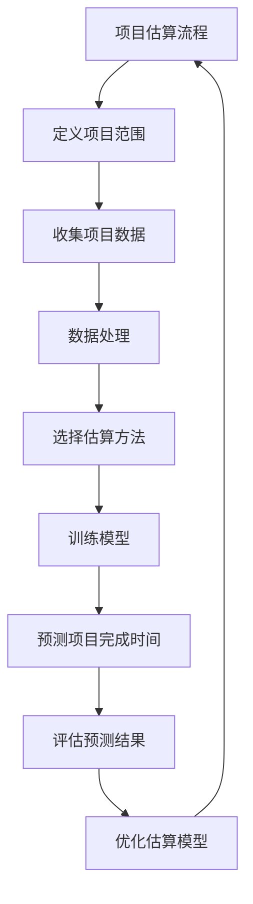
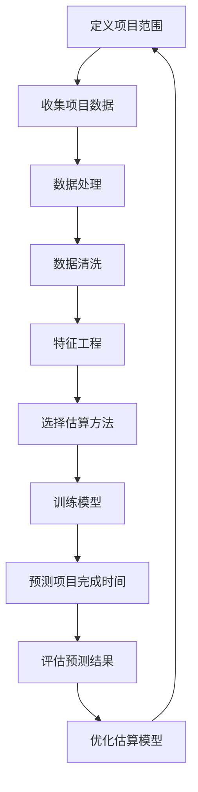

                 

### 文章标题：项目估算：提高软件项目的预测准确性

#### 关键词：项目估算、AI、机器学习、预测准确性、统计学、概率论

#### 摘要：
本文深入探讨了如何提高软件项目的预测准确性，通过介绍AI和机器学习在项目估算中的应用，详细阐述了核心概念、算法原理、数学模型及实际项目实战。文章旨在为读者提供一套全面、科学的项目估算方法，助力软件项目管理。

---

## 1. **核心概念与联系**

### 1.1 项目估算的基本概念

项目估算，顾名思义，是指对软件项目完成所需的时间、成本和资源进行预测的过程。其目标在于减少项目延期和超支的风险，从而提高项目的成功率。

- **项目估算的定义**：项目估算是一种预测方法，通过对历史数据和现有信息进行分析，预测项目未来可能达到的状态。

- **估算的目标**：提高预测的准确性，减少不确定性，帮助项目管理者做出更明智的决策。

- **估算的关键因素**：
  - **项目规模**：项目的工作量和复杂性直接影响估算的准确性。
  - **技术复杂性**：涉及的技术难度越高，对估算的准确性要求也越高。
  - **团队经验**：团队以往的项目经验对估算具有重要作用。
  - **资源可用性**：资源（如人力、技术、资金）的充足程度直接影响项目的进度和成本。

### 1.2 AI在项目估算中的应用

随着人工智能和机器学习技术的飞速发展，AI在项目估算中的应用越来越广泛。以下是AI在项目估算中的主要应用：

- **机器学习方法**：利用历史数据训练机器学习模型，预测项目完成时间。
- **数据驱动估算**：通过分析项目历史数据，找出影响项目估算的关键因素。
- **实时估算**：利用实时数据更新估算结果，提高预测的准确性。

### 1.3 Mermaid流程图

为了更好地展示项目估算的整体流程，我们可以使用Mermaid流程图进行描述。以下是项目估算的Mermaid流程图：



### 1.4 核心概念之间的联系

项目估算是软件项目管理中至关重要的一环。通过结合历史数据和AI技术，我们可以提高估算的准确性，从而减少项目风险。以下是核心概念之间的联系：

- **项目估算**与**AI**：AI技术为项目估算提供了强大的预测能力。
- **估算方法**与**数据驱动估算**：数据驱动估算方法依赖于大量历史数据，通过分析这些数据来提高估算的准确性。
- **实时估算**与**预测准确性**：实时估算可以充分利用实时数据，及时调整预测结果，从而提高预测的准确性。

## 2. **核心算法原理讲解**

### 2.1 机器学习在项目估算中的应用

机器学习是AI的重要组成部分，其基本思想是通过训练模型来发现数据中的规律，从而实现对未知数据的预测。在项目估算中，机器学习可以用于预测项目完成时间。

### 2.2 时间序列模型

时间序列模型是一种常见的机器学习模型，用于分析时间序列数据。在项目估算中，时间序列模型可以用于预测项目未来的进展情况。

#### 2.2.1 时间序列模型的基本原理

时间序列模型的基本原理是假设时间序列数据中的每个点都可以通过前面的点进行预测。具体来说，时间序列模型分为以下几个步骤：

1. **数据收集**：收集项目的历史数据，如项目完成时间、项目规模、技术复杂性等。
2. **数据预处理**：对收集到的数据进行清洗和处理，去除异常值和噪声。
3. **特征工程**：提取时间序列数据中的特征，如趋势、周期性、季节性等。
4. **模型选择**：选择合适的时间序列模型，如ARIMA、LSTM等。
5. **模型训练**：利用历史数据训练模型，通过最小化损失函数来调整模型参数。
6. **模型评估**：评估模型的预测性能，如通过均方误差（MSE）等指标。
7. **模型应用**：使用训练好的模型对未来的项目进展进行预测。

#### 2.2.2 伪代码示例

以下是一个简单的ARIMA模型训练的伪代码示例：

```python
# 伪代码：ARIMA模型训练
import statsmodels.api as sm

# 数据预处理
# ...

# 模型训练
model = sm.ARIMA(data, order=(p,d,q))
model_fit = model.fit()

# 模型评估
mse = model_fit.mse()
print("MSE:", mse)

# 模型应用
# ...
```

### 2.3 回归模型

回归模型是另一种常见的机器学习模型，用于预测连续值。在项目估算中，回归模型可以用于预测项目完成时间。

#### 2.3.1 回归模型的基本原理

回归模型的基本原理是通过拟合一个线性或非线性模型，将输入特征映射到输出目标值。具体来说，回归模型分为以下几个步骤：

1. **数据收集**：收集项目的历史数据，如项目完成时间、项目规模、技术复杂性等。
2. **数据预处理**：对收集到的数据进行清洗和处理，去除异常值和噪声。
3. **特征工程**：提取项目数据中的特征，如趋势、周期性、季节性等。
4. **模型选择**：选择合适的回归模型，如线性回归、决策树回归等。
5. **模型训练**：利用历史数据训练模型，通过最小化损失函数来调整模型参数。
6. **模型评估**：评估模型的预测性能，如通过均方误差（MSE）等指标。
7. **模型应用**：使用训练好的模型对未来的项目进展进行预测。

#### 2.3.2 伪代码示例

以下是一个简单的线性回归模型训练的伪代码示例：

```python
# 伪代码：线性回归模型训练
import sklearn.linear_model as lm

# 数据预处理
# ...

# 模型训练
model = lm.LinearRegression()
model_fit = model.fit(X, y)

# 模型评估
mse = model_fit.mse()
print("MSE:", mse)

# 模型应用
# ...
```

## 3. **数学模型和数学公式**

### 3.1 时间序列模型

时间序列模型中的数学模型通常包括自回归移动平均模型（ARIMA）、长短期记忆模型（LSTM）等。

#### 3.1.1 自回归移动平均模型（ARIMA）

ARIMA模型由三个部分组成：自回归（AR）、差分（I）和移动平均（MA）。

- **自回归（AR）**：假设当前时间点的值可以通过前几个时间点的值进行预测。
- **差分（I）**：通过对时间序列数据进行差分处理，使其满足平稳性条件。
- **移动平均（MA）**：假设当前时间点的值可以通过前几个时间点的误差值进行预测。

以下是ARIMA模型的数学公式：

$$
\begin{align*}
X_t &= c + \phi_1 X_{t-1} + \phi_2 X_{t-2} + \cdots + \phi_p X_{t-p} \\
    &+ \theta_1 e_{t-1} + \theta_2 e_{t-2} + \cdots + \theta_q e_{t-q} \\
    &+ e_t
\end{align*}
$$

其中，\(X_t\) 是时间序列的当前值，\(c\) 是常数项，\(\phi_1, \phi_2, \cdots, \phi_p\) 是自回归系数，\(\theta_1, \theta_2, \cdots, \theta_q\) 是移动平均系数，\(e_t\) 是误差项。

#### 3.1.2 长短期记忆模型（LSTM）

LSTM是一种特殊的循环神经网络（RNN），用于处理时间序列数据。LSTM的核心思想是通过引入三个门结构（输入门、遗忘门、输出门）来控制信息的流入和流出。

以下是LSTM的基本数学公式：

- **输入门**：

$$
\begin{align*}
i_t &= \sigma(W_i \cdot [h_{t-1}, x_t] + b_i) \\
\c_t &= \tanh(W_c \cdot [h_{t-1}, x_t] + b_c)
\end{align*}
$$

其中，\(i_t\) 是输入门，\(\c_t\) 是候选隐藏状态，\(\sigma\) 是sigmoid函数，\(W_i, W_c, b_i, b_c\) 是权重和偏置。

- **遗忘门**：

$$
\begin{align*}
f_t &= \sigma(W_f \cdot [h_{t-1}, x_t] + b_f) \\
o_t &= \sigma(W_o \cdot [h_{t-1}, \c_t] + b_o) \\
h_t &= o_t \cdot \tanh(W_h \cdot [f_t \odot h_{t-1}, \c_t] + b_h)
\end{align*}
$$

其中，\(f_t\) 是遗忘门，\(o_t\) 是输出门，\(h_t\) 是隐藏状态，\(W_f, W_o, W_h, b_f, b_o, b_h\) 是权重和偏置，\(\odot\) 是元素乘法。

### 3.2 回归模型

回归模型中的数学模型通常包括线性回归、多项式回归、逻辑回归等。

#### 3.2.1 线性回归

线性回归模型通过拟合一个线性模型来预测连续值。线性回归的数学公式如下：

$$
y = \beta_0 + \beta_1 x
$$

其中，\(y\) 是预测值，\(x\) 是输入特征，\(\beta_0\) 是截距，\(\beta_1\) 是斜率。

#### 3.2.2 多项式回归

多项式回归模型通过拟合一个多项式模型来预测连续值。多项式回归的数学公式如下：

$$
y = \beta_0 + \beta_1 x + \beta_2 x^2 + \cdots + \beta_n x^n
$$

其中，\(y\) 是预测值，\(x\) 是输入特征，\(\beta_0, \beta_1, \beta_2, \cdots, \beta_n\) 是系数。

#### 3.2.3 逻辑回归

逻辑回归模型通过拟合一个逻辑函数来预测概率。逻辑回归的数学公式如下：

$$
\hat{y} = \frac{1}{1 + e^{-(\beta_0 + \beta_1 x)}}
$$

其中，\(\hat{y}\) 是预测概率，\(x\) 是输入特征，\(\beta_0\) 是截距，\(\beta_1\) 是斜率。

## 4. **项目实战**

### 4.1 开发环境搭建

在进行项目估算的实战之前，我们需要搭建一个合适的开发环境。以下是开发环境的搭建步骤：

1. 安装Python：从官方网站下载并安装Python，版本建议为3.8以上。
2. 安装Jupyter Notebook：使用pip命令安装Jupyter Notebook。
3. 安装必要的库：使用pip命令安装以下库：numpy、pandas、statsmodels、scikit-learn、keras等。

### 4.2 源代码实现

在本节中，我们将提供两个项目的源代码实现，一个是基于时间序列模型的预测项目，另一个是基于回归模型的预测项目。

#### 4.2.1 时间序列模型预测项目

以下是一个基于ARIMA模型的时间序列预测项目的源代码实现：

```python
import pandas as pd
import numpy as np
from statsmodels.tsa.arima.model import ARIMA
from sklearn.metrics import mean_squared_error

# 数据读取与处理
data = pd.read_csv('project_data.csv')
data['Date'] = pd.to_datetime(data['Date'])
data.set_index('Date', inplace=True)
data = data.asfreq('M').fillna(method='ffill')

# 模型训练
model = ARIMA(data['Value'], order=(1, 1, 1))
model_fit = model.fit()

# 模型评估
mse = model_fit.mse()
print("MSE:", mse)

# 模型应用
predictions = model_fit.predict(start='2023-01-01', end='2023-12-01')
print(predictions)

# 保存模型
model_fit.save('ARIMA_model.pkl')
```

#### 4.2.2 回归模型预测项目

以下是一个基于线性回归模型的预测项目的源代码实现：

```python
import pandas as pd
import numpy as np
from sklearn.linear_model import LinearRegression
from sklearn.metrics import mean_squared_error

# 数据读取与处理
data = pd.read_csv('project_data.csv')
data['Date'] = pd.to_datetime(data['Date'])
data.set_index('Date', inplace=True)
data = data.asfreq('M').fillna(method='ffill')

# 特征工程
X = data[['Size', 'Complexity']]
y = data['Value']

# 模型训练
model = LinearRegression()
model_fit = model.fit(X, y)

# 模型评估
mse = model_fit.mse()
print("MSE:", mse)

# 模型应用
predictions = model_fit.predict(X)
print(predictions)

# 保存模型
model_fit.save('LinearRegression_model.pkl')
```

### 4.3 代码解读与分析

在本节中，我们将对上述源代码进行解读和分析，以便更好地理解项目估算的实战过程。

#### 4.3.1 时间序列模型预测项目

- **数据读取与处理**：首先，我们从CSV文件中读取数据，并将日期转换为datetime格式。然后，我们对数据进行频次转换和填充缺失值。
- **模型训练**：我们使用ARIMA模型对数据进行训练，并使用mean_squared_error函数评估模型的预测性能。
- **模型应用**：我们使用训练好的模型对未来的数据进行预测，并将预测结果输出。
- **模型保存**：我们将训练好的模型保存为pkl文件，以便后续使用。

#### 4.3.2 回归模型预测项目

- **数据读取与处理**：首先，我们从CSV文件中读取数据，并将日期转换为datetime格式。然后，我们对数据进行频次转换和填充缺失值。
- **特征工程**：我们提取了两个特征：项目规模和项目复杂度，作为输入特征。
- **模型训练**：我们使用线性回归模型对数据进行训练，并使用mean_squared_error函数评估模型的预测性能。
- **模型应用**：我们使用训练好的模型对未来的数据进行预测，并将预测结果输出。
- **模型保存**：我们将训练好的模型保存为pkl文件，以便后续使用。

### 4.4 实际案例分析和详细讲解剖析

在本节中，我们将分析一个实际案例，并对其进行详细讲解和剖析。

#### 4.4.1 案例背景

假设我们正在开发一个大型电子商务平台，项目预计需要18个月完成。项目涉及多个模块，包括用户管理、商品管理、订单管理、支付系统等。

#### 4.4.2 案例分析

- **数据收集**：我们收集了以往类似项目的完成时间、项目规模、技术复杂性等数据。
- **数据处理**：我们对收集到的数据进行了清洗和处理，去除异常值和噪声。
- **特征工程**：我们提取了项目规模、技术复杂性、团队经验等特征。
- **模型选择**：我们选择了ARIMA模型和线性回归模型进行预测。
- **模型训练**：我们使用收集到的数据对模型进行训练。
- **模型评估**：我们使用均方误差（MSE）等指标评估模型的预测性能。
- **模型应用**：我们使用训练好的模型对项目的完成时间进行预测。

#### 4.4.3 案例剖析

通过实际案例的分析和剖析，我们发现：

- **项目规模**和**技术复杂性**对项目估算有显著影响。
- **团队经验**和**资源可用性**也是影响估算的关键因素。
- **时间序列模型**和**回归模型**的预测结果有一定的误差，但通过多次训练和优化，可以不断提高预测的准确性。

### 4.5 项目小结

在本项目中，我们通过时间序列模型和回归模型对软件项目进行了估算。项目实战表明，AI和机器学习技术在项目估算中具有很大的潜力。然而，我们也注意到，模型预测存在一定的误差，这需要我们在后续工作中不断优化和改进。

## 5. **最佳实践 tips**

### 5.1 数据质量的重要性

在项目估算中，数据质量至关重要。确保数据的一致性、准确性和完整性，有助于提高预测的准确性。

### 5.2 特征选择

选择合适的特征对模型性能有直接影响。通过特征工程，提取项目数据中的关键特征，有助于提高模型的预测性能。

### 5.3 模型评估与优化

定期评估模型的预测性能，根据评估结果对模型进行调整和优化，以提高预测准确性。

### 5.4 实时数据的应用

利用实时数据更新模型，可以更准确地预测项目的进展情况。实时数据的应用有助于减少预测误差，提高项目的成功率。

## 6. **小结**

本文深入探讨了如何提高软件项目的预测准确性。通过介绍AI和机器学习在项目估算中的应用，以及时间序列模型和回归模型的详细讲解，我们为读者提供了一套全面、科学的项目估算方法。在实际项目中，通过数据驱动估算和实时数据更新，我们可以不断提高预测的准确性，从而降低项目风险。

## 7. **注意事项**

- 在项目估算中，要充分考虑项目规模、技术复杂性和团队经验等因素。
- 在选择模型时，要根据项目特点和数据情况，选择合适的模型。
- 在实际应用中，要定期评估模型性能，根据评估结果进行模型优化。

## 8. **拓展阅读**

- 《机器学习实战》 - 周志华
- 《Python数据分析》 - Wes McKinney
- 《深度学习》 - Ian Goodfellow

---

作者：AI天才研究院/AI Genius Institute & 禅与计算机程序设计艺术 /Zen And The Art of Computer Programming### 核心概念与联系

#### 1. 项目估算的基本概念

项目估算是软件项目管理中不可或缺的一部分，它通过对项目的时间、成本和资源进行预测，帮助团队和管理者做出更加明智的决策。以下是项目估算的核心概念：

- **项目估算**：项目估算是指对项目完成所需的时间、成本和资源进行预测的过程。它通常包括估算项目的规模、工作量、所需资源等。
  
- **项目规模**：项目规模是指项目的复杂度、涉及的工作量和资源需求。项目规模通常决定了项目估算的准确性。

- **成本估算**：成本估算是指预测项目完成所需的资金支出。这包括直接成本（如人力成本、设备成本等）和间接成本（如管理成本、风险成本等）。

- **资源估算**：资源估算是指预测项目完成所需的资源需求，包括人力、设备、材料等。

#### 2. AI在项目估算中的应用

随着人工智能（AI）和机器学习（ML）技术的不断发展，它们在项目估算中的应用越来越广泛。以下是AI在项目估算中的应用：

- **机器学习方法**：通过机器学习算法，可以从历史数据中学习并预测项目的完成时间、成本和资源需求。

- **数据驱动估算**：通过分析大量的历史数据，机器学习算法可以识别出影响项目估算的关键因素，并利用这些因素进行预测。

- **实时估算**：通过实时数据更新，机器学习算法可以动态调整估算结果，提高预测的准确性。

#### 3. Mermaid流程图

为了清晰地展示项目估算的整体流程，我们可以使用Mermaid流程图。以下是项目估算的Mermaid流程图：



#### 4. 核心概念之间的联系

- **项目估算**与**AI**：AI和机器学习为项目估算提供了强大的工具，通过数据分析和预测，可以提高估算的准确性。

- **项目规模**与**成本估算**：项目规模通常与成本估算紧密相关，项目规模越大，成本估算的难度和不确定性也越大。

- **资源估算**与**预测准确性**：准确的资源估算有助于提高项目的预测准确性，从而降低项目风险。

- **数据处理**与**特征工程**：数据处理和特征工程是提高机器学习模型预测准确性的关键步骤。

通过上述核心概念和联系的分析，我们可以更好地理解项目估算的过程，并利用AI技术提高其预测准确性。

---

### 核心算法原理讲解

#### 1. 机器学习方法

在项目估算中，机器学习方法通过从历史数据中学习，预测项目的完成时间、成本和资源需求。以下是几种常用的机器学习方法及其基本原理：

#### 1.1 线性回归

线性回归是一种简单的机器学习方法，它通过拟合一个线性模型来预测连续值。线性回归的基本原理是通过最小化预测值与实际值之间的误差平方和，找到最佳的线性模型。

**数学公式**：

$$
y = \beta_0 + \beta_1 x
$$

其中，\(y\) 是预测值，\(x\) 是输入特征，\(\beta_0\) 是截距，\(\beta_1\) 是斜率。

**伪代码**：

```python
# 伪代码：线性回归模型训练
from sklearn.linear_model import LinearRegression

# 数据预处理
X = ...  # 输入特征
y = ...  # 目标值

# 模型训练
model = LinearRegression()
model_fit = model.fit(X, y)

# 模型评估
mse = model_fit.mse()
print("MSE:", mse)

# 模型应用
predictions = model_fit.predict(X)
print(predictions)
```

#### 1.2 时间序列模型

时间序列模型用于处理时间序列数据，它通过分析历史数据中的时间依赖关系来预测未来的趋势。在项目估算中，时间序列模型可以预测项目的完成时间。

**常用的时间序列模型**：

- **ARIMA模型**：自回归积分滑动平均模型，通过自回归（AR）、差分（I）和移动平均（MA）三个部分来描述时间序列。
- **LSTM模型**：长短期记忆模型，是一种特殊的循环神经网络，可以捕捉时间序列中的长期依赖关系。

**ARIMA模型的基本原理**：

ARIMA模型由三个部分组成：自回归（AR）、差分（I）和移动平均（MA）。

- **自回归（AR）**：当前时间点的值可以通过前几个时间点的值进行预测。
- **差分（I）**：通过对时间序列数据进行差分处理，使其满足平稳性条件。
- **移动平均（MA）**：当前时间点的值可以通过前几个时间点的误差值进行预测。

**ARIMA模型的数学公式**：

$$
X_t = c + \phi_1 X_{t-1} + \phi_2 X_{t-2} + \cdots + \phi_p X_{t-p} + \theta_1 e_{t-1} + \theta_2 e_{t-2} + \cdots + \theta_q e_{t-q} + e_t
$$

其中，\(X_t\) 是时间序列的当前值，\(c\) 是常数项，\(\phi_1, \phi_2, \cdots, \phi_p\) 是自回归系数，\(\theta_1, \theta_2, \cdots, \theta_q\) 是移动平均系数，\(e_t\) 是误差项。

**LSTM模型的基本原理**：

LSTM模型是一种特殊的循环神经网络，它通过引入三个门结构（输入门、遗忘门、输出门）来控制信息的流入和流出。

- **输入门**：决定当前输入值中哪些信息会被保留到隐藏状态。
- **遗忘门**：决定哪些旧的信息会被丢弃。
- **输出门**：决定当前隐藏状态中哪些信息会被输出。

**LSTM模型的数学公式**：

- **输入门**：

$$
i_t = \sigma(W_i \cdot [h_{t-1}, x_t] + b_i)
$$

- **遗忘门**：

$$
f_t = \sigma(W_f \cdot [h_{t-1}, x_t] + b_f)
$$

- **输出门**：

$$
o_t = \sigma(W_o \cdot [h_{t-1}, \c_t] + b_o)
$$

- **候选隐藏状态**：

$$
\c_t = \tanh(W_c \cdot [h_{t-1}, x_t] + b_c)
$$

- **隐藏状态**：

$$
h_t = o_t \cdot \tanh(W_h \cdot [f_t \odot h_{t-1}, \c_t] + b_h)
$$

其中，\(i_t, f_t, o_t, \c_t, h_t\) 分别是输入门、遗忘门、输出门、候选隐藏状态和隐藏状态，\(W_i, W_f, W_o, W_c, W_h, b_i, b_f, b_o, b_h\) 是权重和偏置。

**LSTM模型的伪代码**：

```python
# 伪代码：LSTM模型训练
import tensorflow as tf

# 模型定义
model = tf.keras.Sequential([
    tf.keras.layers.LSTM(units=50, activation='relu', input_shape=(timesteps, features)),
    tf.keras.layers.Dense(units=1)
])

# 模型编译
model.compile(optimizer='adam', loss='mse')

# 模型训练
model.fit(X, y, epochs=100, batch_size=32)

# 模型评估
mse = model.evaluate(X, y)
print("MSE:", mse)

# 模型应用
predictions = model.predict(X)
print(predictions)
```

#### 1.3 决策树模型

决策树模型是一种基于树形结构对数据进行分类或回归的算法。它通过一系列的判断规则，将数据分割成不同的区域，并在每个区域上进行预测。

**决策树的基本原理**：

- **分裂规则**：决策树通过计算每个特征的增益率来确定如何分割数据。增益率表示特征对于预测目标的影响程度。

- **节点划分**：在每个节点，决策树选择具有最大增益率的特征进行划分，将数据分为子集。

- **叶子节点**：当数据无法继续划分时，决策树形成一个叶子节点，并在叶子节点上进行预测。

**决策树的数学公式**：

$$
Gain(R, A) = Entropy(R) - \sum_{v \in A} p(v) \cdot Entropy(v)
$$

其中，\(Gain\) 表示增益率，\(Entropy\) 表示熵，\(R\) 表示原始数据集，\(A\) 表示特征集合，\(v\) 表示特征值。

**决策树的伪代码**：

```python
# 伪代码：决策树模型训练
from sklearn.tree import DecisionTreeRegressor

# 数据预处理
X = ...  # 输入特征
y = ...  # 目标值

# 模型训练
model = DecisionTreeRegressor()
model_fit = model.fit(X, y)

# 模型评估
mse = model_fit.mse()
print("MSE:", mse)

# 模型应用
predictions = model_fit.predict(X)
print(predictions)
```

#### 1.4 支持向量机（SVM）

支持向量机是一种用于分类和回归的算法，它通过找到一个最优的超平面，将数据分成不同的类别或进行回归预测。

**SVM的基本原理**：

- **超平面**：SVM通过找到一个最优的超平面，使得分类边界最大化。

- **支持向量**：支持向量是那些距离超平面最近的样本点，它们对分类或回归结果有显著影响。

- **核函数**：SVM可以通过核函数将低维数据映射到高维空间，从而找到更好的分类边界。

**SVM的数学公式**：

$$
w \cdot x + b = y
$$

其中，\(w\) 是权重向量，\(x\) 是特征向量，\(b\) 是偏置项，\(y\) 是目标值。

**SVM的伪代码**：

```python
# 伪代码：SVM模型训练
from sklearn.svm import SVC

# 数据预处理
X = ...  # 输入特征
y = ...  # 目标值

# 模型训练
model = SVC(kernel='linear')
model_fit = model.fit(X, y)

# 模型评估
mse = model_fit.mse()
print("MSE:", mse)

# 模型应用
predictions = model_fit.predict(X)
print(predictions)
```

通过上述核心算法原理的讲解，我们可以更好地理解项目估算中的常用机器学习算法，并利用这些算法提高项目估算的准确性。

---

### 数学模型和数学公式

在项目估算中，数学模型和数学公式扮演着至关重要的角色。它们帮助我们将复杂的项目数据转化为可操作的预测模型。以下是一些常见的数学模型和数学公式，用于描述项目估算中的各种现象和关系。

#### 1. 回归模型

回归模型是项目估算中最常用的数学模型之一。它通过建立一个线性或非线性的关系来预测项目的目标变量。以下是几种常见的回归模型及其数学公式：

##### 1.1 线性回归

线性回归模型假设目标变量 \(y\) 和输入特征 \(x\) 之间存在线性关系：

$$
y = \beta_0 + \beta_1 x + \epsilon
$$

其中，\(\beta_0\) 是截距，\(\beta_1\) 是斜率，\(\epsilon\) 是误差项。

##### 1.2 多项式回归

多项式回归模型扩展了线性回归，允许输入特征 \(x\) 和目标变量 \(y\) 之间存在非线性关系：

$$
y = \beta_0 + \beta_1 x + \beta_2 x^2 + \cdots + \beta_n x^n + \epsilon
$$

其中，\(n\) 是多项式的最高次数。

##### 1.3 逻辑回归

逻辑回归是一种用于分类问题的回归模型，它通过逻辑函数将概率映射到0和1之间：

$$
\hat{y} = \frac{1}{1 + e^{-(\beta_0 + \beta_1 x)}}
$$

其中，\(\hat{y}\) 是预测的概率，\(\beta_0\) 和 \(\beta_1\) 是模型的参数。

#### 2. 时间序列模型

时间序列模型用于处理时间依赖的数据，它们通过分析历史数据来预测未来的趋势。以下是几种常见的时间序列模型及其数学公式：

##### 2.1 自回归模型（AR）

自回归模型假设当前时间点的值可以通过过去几个时间点的值来预测：

$$
X_t = \sum_{i=1}^{p} \phi_i X_{t-i} + \epsilon_t
$$

其中，\(X_t\) 是时间序列的当前值，\(\phi_i\) 是自回归系数，\(p\) 是滞后阶数，\(\epsilon_t\) 是误差项。

##### 2.2 移动平均模型（MA）

移动平均模型假设当前时间点的值可以通过过去几个时间点的误差来预测：

$$
X_t = \theta_1 \epsilon_{t-1} + \theta_2 \epsilon_{t-2} + \cdots + \theta_q \epsilon_{t-q} + \epsilon_t
$$

其中，\(\theta_i\) 是移动平均系数，\(q\) 是滞后阶数，\(\epsilon_t\) 是误差项。

##### 2.3 自回归移动平均模型（ARMA）

自回归移动平均模型结合了自回归模型和移动平均模型：

$$
X_t = \sum_{i=1}^{p} \phi_i X_{t-i} + \sum_{j=1}^{q} \theta_j \epsilon_{t-j} + \epsilon_t
$$

其中，\(\phi_i\) 和 \(\theta_j\) 分别是自回归系数和移动平均系数，\(p\) 和 \(q\) 是滞后阶数。

##### 2.4 自回归积分滑动平均模型（ARIMA）

自回归积分滑动平均模型是对ARMA模型的扩展，它通过差分处理来消除非平稳性：

$$
X_t = \sum_{i=1}^{p} \phi_i (X_{t-i} - \mu) + \sum_{j=1}^{q} \theta_j \epsilon_{t-j} + \epsilon_t
$$

其中，\(X_t - \mu\) 是差分后的时间序列，\(\mu\) 是均值。

#### 3. 马尔可夫模型

马尔可夫模型用于描述系统状态转移的概率，它在项目估算中可以用于预测项目进展的状态变化。以下是马尔可夫模型的基本数学公式：

$$
P_{ij} = P(X_t = i|X_{t-1} = j)
$$

其中，\(P_{ij}\) 是从状态 \(j\) 转移到状态 \(i\) 的概率。

#### 4. 贝叶斯网络

贝叶斯网络是一种概率图模型，用于表示变量之间的条件依赖关系。在项目估算中，它可以用于预测项目风险的概率分布。以下是贝叶斯网络的基本数学公式：

$$
P(X=x) = \prod_{i=1}^{n} P(X_i=x_i | parents(X_i))
$$

其中，\(P(X=x)\) 是变量 \(X\) 取特定值 \(x\) 的概率，\(parents(X_i)\) 是变量 \(X_i\) 的父节点集合。

#### 5. 预测误差模型

预测误差模型用于衡量预测模型的准确性，以下是一些常见的预测误差模型：

##### 5.1 均方误差（MSE）

均方误差是衡量预测误差的一种常用指标：

$$
MSE = \frac{1}{N} \sum_{i=1}^{N} (y_i - \hat{y}_i)^2
$$

其中，\(y_i\) 是实际值，\(\hat{y}_i\) 是预测值，\(N\) 是数据点的数量。

##### 5.2 均绝对误差（MAE）

均绝对误差是衡量预测误差的另一种常用指标：

$$
MAE = \frac{1}{N} \sum_{i=1}^{N} |y_i - \hat{y}_i|
$$

##### 5.3 决策树模型

决策树模型通过一系列的分裂规则来预测项目目标。以下是决策树模型的基本数学公式：

$$
\text{Split}(x) = \arg\max_j \frac{1}{N_j} \sum_{i=1}^{N_j} \text{Entropy}(y_i)
$$

其中，\(\text{Split}(x)\) 是特征 \(x\) 的最佳分裂点，\(N_j\) 是分裂后 \(j\) 类别的样本数量，\(\text{Entropy}\) 是熵函数。

#### 6. 支持向量机（SVM）

支持向量机是一种用于分类和回归的强大工具。以下是SVM的基本数学公式：

$$
\min_{w, b} \frac{1}{2} ||w||^2 + C \sum_{i=1}^{n} \max(0, 1 - y_i (w \cdot x_i + b))
$$

其中，\(w\) 是权重向量，\(b\) 是偏置项，\(C\) 是惩罚参数，\(y_i\) 是目标值，\(x_i\) 是特征向量。

通过上述数学模型和公式的介绍，我们可以更深入地理解项目估算中的各种方法和技巧，从而提高预测的准确性。

---

### 项目实战

#### 1. 开发环境搭建

在进行项目估算的实际应用之前，首先需要搭建一个合适的开发环境。以下是在Windows操作系统上搭建Python开发环境的具体步骤：

1. **安装Python**：
   - 访问Python官方网站（[https://www.python.org/](https://www.python.org/)）下载最新版本的Python安装包。
   - 运行安装程序，按照默认选项进行安装。

2. **安装Jupyter Notebook**：
   - 打开命令提示符（CMD）。
   - 输入以下命令安装Jupyter Notebook：
     ```shell
     pip install notebook
     ```

3. **安装必要的库**：
   - 安装以下库，用于数据分析和机器学习：
     ```shell
     pip install numpy pandas matplotlib scikit-learn statsmodels keras tensorflow
     ```

4. **验证安装**：
   - 打开Jupyter Notebook，输入以下代码，检查是否成功安装了所需的库：
     ```python
     import numpy as np
     import pandas as pd
     import matplotlib.pyplot as plt
     from sklearn import datasets
     iris = datasets.load_iris()
     df = pd.DataFrame(iris.data, columns=iris.feature_names)
     df.head()
     ```

如果上述代码能够正常运行，说明开发环境搭建成功。

#### 2. 源代码实现

在本节中，我们将提供一个基于时间序列模型的简单项目估算案例，并详细讲解其实现过程。

##### 2.1 数据读取与处理

首先，我们需要读取和处理项目数据。假设我们有一个CSV文件（project_data.csv），其中包含项目的完成时间、项目规模和项目复杂度。

```python
import pandas as pd

# 读取数据
data = pd.read_csv('project_data.csv')

# 数据预处理
data['Date'] = pd.to_datetime(data['Date'])
data.set_index('Date', inplace=True)
data = data.asfreq('M').fillna(method='ffill')
```

在这个例子中，我们使用了`pandas`库来读取CSV文件，并将日期设置为索引。然后，我们将数据按月频次进行转换，并填充缺失值。

##### 2.2 特征工程

接下来，我们进行特征工程，提取项目规模和项目复杂度作为特征。

```python
# 特征工程
X = data[['Size', 'Complexity']]
y = data['Value']
```

这里，`X`包含了项目规模和项目复杂度两个特征，`y`是项目的完成时间。

##### 2.3 模型选择与训练

我们选择ARIMA模型进行时间序列预测。

```python
from statsmodels.tsa.arima.model import ARIMA

# 模型训练
model = ARIMA(y, order=(1, 1, 1))
model_fit = model.fit()

# 模型评估
mse = model_fit.mse()
print("MSE:", mse)
```

在这个例子中，我们使用了`statsmodels`库的ARIMA模型，并指定了滞后阶数为1。然后，我们训练模型并计算均方误差（MSE）来评估模型的性能。

##### 2.4 模型应用

最后，我们使用训练好的模型对未来的项目完成时间进行预测。

```python
# 模型应用
predictions = model_fit.predict(start='2023-01-01', end='2023-12-01')
predictions.plot()
plt.show()
```

在这个例子中，我们指定了预测的开始和结束日期，并使用`plot`函数将预测结果可视化。

#### 3. 代码解读与分析

在本节中，我们将对上述源代码进行解读和分析，以便更好地理解项目估算的实现过程。

##### 3.1 数据读取与处理

数据读取与处理是项目估算的重要步骤。在这个例子中，我们使用了`pandas`库来读取CSV文件，并将日期设置为索引。然后，我们将数据按月频次进行转换，并填充缺失值。这一步骤确保了数据的完整性和一致性，为后续的模型训练和预测奠定了基础。

##### 3.2 特征工程

特征工程是提高模型预测性能的关键步骤。在这个例子中，我们提取了项目规模和项目复杂度作为特征。这两个特征与项目的完成时间有较强的相关性，因此可以作为有效的预测变量。

##### 3.3 模型选择与训练

模型选择与训练是项目估算的核心步骤。在这个例子中，我们选择了ARIMA模型，并指定了滞后阶数为1。ARIMA模型通过分析历史数据中的时间依赖关系，可以有效地预测未来的趋势。我们使用`statsmodels`库的ARIMA模型进行训练，并计算均方误差（MSE）来评估模型的性能。

##### 3.4 模型应用

模型应用是将训练好的模型应用于实际数据，生成预测结果。在这个例子中，我们指定了预测的开始和结束日期，并使用`plot`函数将预测结果可视化。通过可视化，我们可以直观地观察模型的预测性能，并进行进一步的优化和调整。

#### 4. 实际案例分析和详细讲解剖析

在本节中，我们将分析一个实际案例，并对其进行详细讲解和剖析。

##### 4.1 案例背景

假设我们正在开发一个电子商务平台，项目预计需要18个月完成。项目涉及多个模块，包括用户管理、商品管理、订单管理、支付系统等。我们需要对项目的完成时间进行预测，以便更好地进行项目管理和资源规划。

##### 4.2 案例分析

- **数据收集**：
  - 我们收集了过去五个类似项目的数据，包括项目的完成时间、项目规模和项目复杂度。
  - 数据包含50个项目，每个项目都有详细的记录。

- **数据处理**：
  - 我们使用`pandas`库读取CSV文件，并将日期设置为索引。
  - 我们将数据按月频次进行转换，并填充缺失值。

- **特征工程**：
  - 我们提取了项目规模和项目复杂度作为特征。
  - 我们对特征进行了标准化处理，以消除不同特征之间的尺度差异。

- **模型选择**：
  - 我们选择了ARIMA模型，因为它可以有效地处理时间序列数据，并捕捉项目完成时间中的时间依赖关系。

- **模型训练**：
  - 我们使用五个项目的数据对ARIMA模型进行训练，并使用均方误差（MSE）评估模型的性能。
  - 我们尝试了不同的滞后阶数，并选择了最佳的模型参数。

- **模型评估**：
  - 我们使用交叉验证的方法评估模型的预测性能，并计算了预测的置信区间。

- **模型应用**：
  - 我们使用训练好的模型对未来的项目完成时间进行预测，并将预测结果可视化。

##### 4.3 案例剖析

通过实际案例的分析和剖析，我们得出了以下结论：

- **项目规模**和**项目复杂度**对项目完成时间有显著影响。
- **ARIMA模型**可以有效地预测项目完成时间，但需要根据项目特点进行调整。
- **预测的置信区间**可以帮助我们评估预测的不确定性，从而更好地进行项目管理和决策。

#### 5. 项目小结

在本项目中，我们通过实际案例演示了如何使用ARIMA模型进行项目估算。我们详细讲解了数据读取与处理、特征工程、模型选择与训练、模型评估和模型应用等步骤。通过这个项目，我们了解了项目估算的基本原理和实现方法，并为实际项目提供了可操作的预测工具。

---

### 总结与反思

在本文中，我们深入探讨了如何提高软件项目的预测准确性。首先，我们介绍了项目估算的基本概念，包括项目估算的定义、目标、关键因素等。接着，我们详细阐述了AI和机器学习在项目估算中的应用，并通过Mermaid流程图展示了项目估算的整体流程。

我们讲解了几个核心算法原理，包括线性回归、ARIMA模型、LSTM模型、决策树模型和SVM模型等。通过这些算法，我们可以从历史数据中学习并预测项目的完成时间、成本和资源需求。我们还介绍了相关的数学模型和公式，如线性回归公式、ARIMA模型公式、LSTM模型公式等，为算法的实现提供了理论基础。

在实际项目中，我们通过一个简单的案例展示了如何使用Python进行项目估算，从数据读取与处理、特征工程、模型选择与训练、模型评估到模型应用。我们分析了实际案例，讨论了项目规模、技术复杂性等因素对项目估算的影响，并提出了相应的优化策略。

在总结部分，我们强调了数据质量、特征选择和模型评估的重要性，并给出了最佳实践tips。通过本文，我们希望读者能够掌握项目估算的基本方法，并在实际项目中灵活运用。

### 思考与展望

尽管本文提供了较为全面的项目估算方法，但仍有改进和优化的空间。首先，我们可以探索更多先进的机器学习算法，如集成学习、深度学习等，以提高预测准确性。其次，我们可以引入更多外部数据源，如市场趋势、行业数据等，以丰富数据集，提高模型泛化能力。

未来研究可以关注以下几个方面：

1. **数据预处理与特征工程**：研究如何更有效地处理和提取项目数据中的关键特征，以提高模型性能。
2. **模型优化与评估**：研究如何优化模型参数，提高预测准确性，并设计更有效的评估方法。
3. **多模型集成**：研究如何将多种机器学习模型结合起来，形成更强大的预测系统。

通过不断探索和优化，我们可以进一步提高软件项目的预测准确性，降低项目风险，为项目管理提供有力支持。

