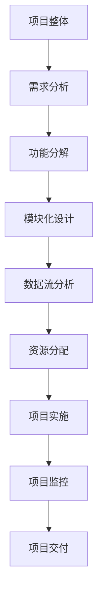
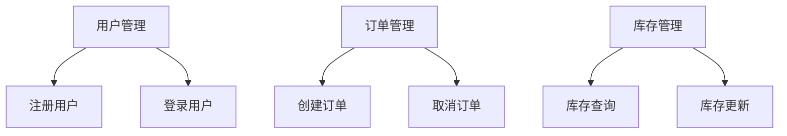
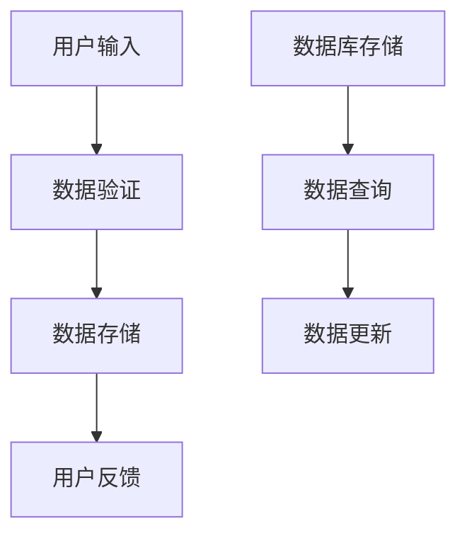

                 

### 文章标题

# 项目成功离不开好系分

### 关键词

项目管理、系统分解、模块化设计、功能分解、数据流分析、算法原理、项目实战案例、工具与方法、风险评估、持续改进

### 摘要

本文深入探讨了项目成功与系统分解之间的紧密联系。首先，我们介绍了项目成功和系统分解的基本概念，并展示了它们之间的相互作用。接着，我们详细讲解了项目管理的基础知识，为读者提供了必要的背景信息。本文的核心内容在于系统分解技术的深入剖析，包括模块化设计、功能分解、数据流分析等，并使用Mermaid流程图和伪代码来展示其原理。通过实际项目案例，我们展示了系统分解技术的应用和实践。此外，我们还介绍了相关工具和方法，以及风险管理策略和持续改进方法。本文旨在为项目经理提供一套系统分解的最佳实践，帮助他们在项目中取得成功。

### 第1章：项目管理基础

项目管理是确保项目按时、按预算、按质量完成的关键过程。在复杂的项目中，项目管理不仅涉及到时间的规划和资源的分配，还涉及到风险管理、沟通协调、质量控制等多个方面。有效的项目管理是项目成功的基石，而系统分解是实现项目管理目标的重要手段。

#### 项目成功的核心要素

项目成功通常可以从以下几个方面来衡量：

1. **按时完成**：项目在预定的时间内交付。
2. **按预算完成**：项目在预算范围内完成。
3. **按质量完成**：项目满足既定的质量标准。
4. **客户满意度**：客户对项目结果的满意程度。

这些成功要素之间相互关联，一个成功的项目需要在各个方面取得平衡。

#### 系统分解的重要性

系统分解是将复杂项目分解成可管理部分的过程。它有助于明确项目的范围、目标和任务，从而提高项目的可管理性和可控制性。系统分解的重要性体现在以下几个方面：

1. **明确项目范围**：通过系统分解，可以清晰地界定项目的边界，避免项目的范围蔓延。
2. **优化资源分配**：系统分解有助于优化资源分配，确保资源被有效地利用。
3. **提高沟通效率**：系统分解提供了清晰的模块划分，使得项目团队之间的沟通更加高效。
4. **便于风险管理**：系统分解有助于识别和应对潜在的风险，从而降低项目的风险。

#### 项目管理中的系统分解概念图

为了更好地理解系统分解在项目管理中的作用，我们可以用Mermaid流程图来展示系统分解的基本概念。以下是一个简单的系统分解流程图示例：



在这个流程图中，项目整体作为起点，经过需求分析、功能分解、模块化设计、数据流分析等步骤，最终完成项目的实施和交付。

### 第2章：项目管理基础知识

在了解项目成功与系统分解的基本概念后，我们需要对项目管理的基础知识进行深入探讨。项目管理是一个复杂的过程，涉及多个关键过程和角色。下面我们将简要介绍项目管理生命周期、关键过程和角色。

#### 项目生命周期概述

项目生命周期通常包括以下几个阶段：

1. **项目启动**：确定项目目标和范围，建立项目团队。
2. **项目规划**：制定项目计划，分配资源，确定时间表和预算。
3. **项目执行**：按照项目计划实施项目，进行任务分配和协调。
4. **项目监控和控制**：监控项目进度和质量，进行变更控制。
5. **项目收尾**：完成项目，进行总结和评估。

每个阶段都有其特定的任务和目标，相互关联，共同确保项目的成功。

#### 项目管理的关键过程

项目管理涉及多个关键过程，包括：

1. **需求管理**：收集、分析和管理项目需求，确保项目满足客户和利益相关者的需求。
2. **范围管理**：界定项目的范围，确保项目团队对项目的理解和期望一致。
3. **时间管理**：制定项目计划，分配任务和资源，监控项目进度。
4. **成本管理**：制定项目预算，监控项目成本，确保项目在预算范围内完成。
5. **质量管理**：确保项目满足既定的质量标准，进行质量控制和改进。
6. **沟通管理**：确保项目信息的有效沟通，建立沟通渠道和机制。
7. **风险管理**：识别、评估和应对项目风险，降低项目风险。
8. **采购管理**：采购项目所需的产品、服务或资源，管理供应商关系。

这些关键过程相互交织，共同确保项目的顺利进行。

#### 项目管理的角色与职责

在项目管理中，不同的角色承担着不同的职责。以下是一些主要角色的职责：

1. **项目经理**：负责项目的整体规划、执行和控制，确保项目按计划进行。
2. **项目团队**：负责具体项目的实施和执行，包括开发人员、测试人员、设计师等。
3. **利益相关者**：包括客户、管理层、合作伙伴等，他们参与项目的决策和监督。
4. **质量保证人员**：负责确保项目满足既定的质量标准，进行质量检查和测试。
5. **风险管理师**：负责识别、评估和应对项目风险，制定风险管理计划。
6. **项目经理助理**：协助项目经理进行项目管理和协调工作。

通过明确每个角色的职责，可以确保项目的顺利进行和高效执行。

### 第3章：系统分解技术

系统分解是将复杂项目拆分成更小、更易于管理的部分的过程。在项目管理中，系统分解技术至关重要，因为它们有助于提高项目的可管理性和可控制性。在本章节中，我们将详细讨论几种常用的系统分解技术：模块化设计、功能分解和数据流分析。

#### 模块化设计

模块化设计是一种将系统划分为独立模块的方法。每个模块都有明确的职责和接口，使得系统更加模块化和可复用。模块化设计的优势包括：

1. **提高可维护性**：模块化设计使得代码更加模块化，降低了代码的复杂度，便于维护和更新。
2. **提高可复用性**：模块可以独立开发、测试和部署，提高了代码的可复用性。
3. **提高可扩展性**：模块化设计使得系统可以方便地添加新功能或修改现有功能。

以下是一个模块化设计的示例伪代码：

```python
# 模块A：用户管理模块
class UserManager:
    def register_user(self, user_data):
        # 注册用户逻辑
        pass

    def login_user(self, user_data):
        # 用户登录逻辑
        pass

# 模块B：订单管理模块
class OrderManager:
    def create_order(self, order_data):
        # 创建订单逻辑
        pass

    def cancel_order(self, order_data):
        # 取消订单逻辑
        pass
```

在这个示例中，`UserManager`和`OrderManager`是两个独立的模块，它们各自负责不同的功能，但通过接口进行通信。

#### 功能分解

功能分解是将系统的功能分解成更小、更具体的任务或功能单元。功能分解有助于明确项目的任务和职责，提高项目的可管理性。功能分解的过程通常包括以下步骤：

1. **识别系统功能**：首先，识别系统的整体功能，例如用户管理、订单管理、库存管理等。
2. **分解功能**：将识别出的功能进一步分解成更具体的任务或功能单元，例如注册用户、登录用户、创建订单、取消订单等。
3. **定义功能接口**：为每个功能单元定义清晰的接口，确保它们可以独立开发、测试和部署。

以下是一个功能分解的示例：



在这个示例中，系统被分解成三个主要功能：用户管理、订单管理和库存管理。每个功能又被进一步分解成具体的任务。

#### 数据流分析

数据流分析是一种用于识别系统中数据流动和处理的工具。它有助于了解系统的数据流动路径，优化数据传输和处理过程。数据流分析通常包括以下步骤：

1. **识别数据源**：首先，识别系统中的数据源，例如用户输入、数据库存储等。
2. **识别数据处理过程**：识别系统中数据处理的过程，例如数据验证、数据转换等。
3. **绘制数据流图**：使用Mermaid等工具绘制系统的数据流图，展示数据的流动和处理过程。

以下是一个数据流分析的示例：



在这个示例中，用户输入通过数据验证后存储到数据库中，用户反馈和数据库存储通过数据查询和更新进行交互。

#### Mermaid流程图：系统分解示例

为了更好地理解系统分解的过程，我们可以使用Mermaid流程图来展示一个完整的系统分解示例。以下是一个简单的Mermaid流程图示例：


在这个流程图中，项目整体作为起点，经过需求分析、功能分解、模块化设计、数据流分析等步骤，最终完成项目的实施和交付。

### 第4章：核心算法原理讲解

在项目管理的实践中，系统分解不仅仅是一种技术手段，它还涉及到一系列算法原理的应用。这些算法原理帮助我们更高效、更精准地完成系统分解任务。在本章中，我们将深入探讨系统分解算法的基础原理，并使用伪代码和数学模型来详细阐述。

#### 系统分解算法基础

系统分解算法的基本目标是将一个复杂的系统分解成若干个子系统或模块，使得每个子系统或模块都具有相对独立的特征。这有助于提高项目的可管理性和可维护性。以下是系统分解算法的一些基础概念：

1. **分解粒度**：分解粒度是指系统分解的精细程度。较大的分解粒度可能无法提供足够的细节，而较小的分解粒度可能导致过多的模块，增加项目管理的复杂度。
2. **模块独立性**：模块独立性是衡量模块质量的重要指标。一个高独立性的模块应该具有明确的输入输出、功能单一且易于测试。
3. **接口设计**：接口设计是确保模块之间能够高效通信的关键。良好的接口设计应该简洁、明确且易于理解。

#### 伪代码：系统分解算法示例

为了更好地理解系统分解算法的原理，我们可以通过以下伪代码来展示一个简单的系统分解过程：

```plaintext
function SystemDecomposition(system):
    modules = []
    for each component in system:
        if ComponentHasHighIndependence(component):
            modules.append(CreateModule(component))
        else:
            sub_components = SplitComponent(component)
            for each sub_component in sub_components:
                if SubComponentHasHighIndependence(sub_component):
                    modules.append(CreateModule(sub_component))
                else:
                    continue
    return modules
```

在这个伪代码中，`SystemDecomposition`函数接受一个系统作为输入，并返回一组模块。函数首先遍历系统中的每个组件，并根据组件的独立性决定是否创建新的模块。如果组件具有高独立性，则直接创建模块；否则，继续分解组件。

#### 数学模型和公式：详细讲解和举例说明

在系统分解过程中，数学模型和公式可以帮助我们量化模块的独立性、分解的粒度等关键指标。以下是一个简单的数学模型示例，用于评估模块的独立性：

$$
I = \frac{D(U_1, U_2)}{D(U_1, U_2) + D(U_1, S) + D(U_2, S)}
$$

其中，$I$表示模块独立性，$D(U_1, U_2)$表示模块$U_1$和$U_2$之间的数据依赖度，$D(U_1, S)$和$D(U_2, S)$分别表示模块$U_1$和$U_2$与系统其他部分的数据依赖度。

假设我们有一个系统，其中有两个模块$A$和$B$，以及与系统其他部分的数据依赖度分别为$D(A, S) = 10$，$D(B, S) = 5$，$D(A, B) = 20$。我们可以使用上述公式来计算模块$A$和$B$的独立性：

$$
I(A) = \frac{20}{20 + 10 + 5} = \frac{20}{35} \approx 0.57
$$

$$
I(B) = \frac{20}{20 + 10 + 5} = \frac{20}{35} \approx 0.57
$$

从计算结果可以看出，模块$A$和$B$的独立性都较高，这意味着它们都可以作为独立的模块进行处理。

#### 算法性能分析

系统分解算法的性能分析主要关注两个方面：分解效率和分解质量。分解效率是指算法在给定时间内能够分解出多少模块；分解质量是指分解出的模块是否具有高独立性。

1. **分解效率**：提高分解效率的方法包括减少分解粒度、优化分解算法等。例如，可以使用并行计算技术来加速分解过程。
2. **分解质量**：保证分解质量的方法包括使用更精确的独立性度量标准、引入更多的约束条件等。例如，可以通过引入更多的依赖关系来减少模块之间的独立性。

### 第5章：项目实战案例

在实际项目中，系统分解技术是确保项目成功的关键。以下我们将通过一个实际案例，详细讲解如何在实际项目中应用系统分解技术，包括开发环境的搭建、源代码的详细实现和代码解读，以及对项目的详细分析和总结。

#### 案例背景

我们选择一个电子商务平台的项目作为案例。该平台需要提供用户注册、登录、商品浏览、购物车、订单管理等功能。由于项目功能复杂，需要使用系统分解技术来确保项目的可管理性和可维护性。

#### 开发环境搭建

为了搭建该项目，我们需要以下开发环境和工具：

1. **编程语言**：Python
2. **开发框架**：Django
3. **数据库**：MySQL
4. **版本控制**：Git
5. **代码编辑器**：VS Code

在搭建开发环境时，首先需要安装Python和Django，然后配置MySQL数据库，并设置项目的目录结构。以下是一个简单的Python虚拟环境搭建和Django项目创建的示例：

```shell
# 创建Python虚拟环境
python -m venv venv
# 激活虚拟环境
source venv/bin/activate
# 安装Django
pip install django
# 创建Django项目
django-admin startproject ecommerce_platform
# 进入项目目录
cd ecommerce_platform
```

#### 源代码详细实现和代码解读

在实现项目时，我们采用了模块化设计方法，将系统划分为用户管理、订单管理、商品管理、购物车管理等多个模块。以下是用户管理模块的源代码示例：

```python
# 用户管理模块
class UserManager(models.Model):
    username = models.CharField(max_length=100)
    email = models.EmailField(unique=True)
    password = models.CharField(max_length=100)

    def register_user(self, user_data):
        # 注册用户逻辑
        self.username = user_data['username']
        self.email = user_data['email']
        self.password = user_data['password']
        self.save()

    def login_user(self, user_data):
        # 用户登录逻辑
        user = UserManager.objects.filter(email=user_data['email'], password=user_data['password'])
        if user.exists():
            return user.first()
        else:
            return None
```

在这个示例中，`UserManager`是一个Django模型，负责用户注册和登录功能。`register_user`和`login_user`是两个方法，分别用于用户注册和登录。通过这种方法，我们实现了用户管理模块的独立开发、测试和部署。

同样，其他模块（如订单管理、商品管理、购物车管理）也可以采用类似的方法进行实现。以下是一个订单管理模块的示例：

```python
# 订单管理模块
class OrderManager(models.Model):
    user = models.ForeignKey(UserManager, on_delete=models.CASCADE)
    total_amount = models.DecimalField(max_digits=10, decimal_places=2)
    order_status = models.CharField(max_length=50)

    def create_order(self, order_data):
        # 创建订单逻辑
        self.user = order_data['user']
        self.total_amount = order_data['total_amount']
        self.order_status = order_data['order_status']
        self.save()

    def cancel_order(self, order_data):
        # 取消订单逻辑
        self.order_status = 'Cancelled'
        self.save()
```

在这个示例中，`OrderManager`是一个Django模型，负责订单的创建和取消功能。通过这种方式，我们可以确保每个模块都具有高独立性和可复用性。

#### 代码应用解读与分析

在代码应用解读与分析部分，我们将深入探讨每个模块的功能和实现细节。以下是用户管理模块的应用解读：

```python
# 用户注册
user_data = {
    'username': 'john_doe',
    'email': 'john_doe@example.com',
    'password': 'password123'
}
user_manager = UserManager()
user_manager.register_user(user_data)

# 用户登录
user_data = {
    'email': 'john_doe@example.com',
    'password': 'password123'
}
user_manager = UserManager()
logged_in_user = user_manager.login_user(user_data)

if logged_in_user:
    print("登录成功")
else:
    print("登录失败")
```

在这个示例中，我们首先创建了一个用户数据字典，并使用`UserManager`的`register_user`方法注册用户。接着，我们使用`login_user`方法尝试登录用户。如果登录成功，将打印“登录成功”消息；否则，打印“登录失败”消息。

类似地，其他模块（如订单管理、商品管理、购物车管理）也可以通过类似的方式应用和解析。

#### 实际案例分析和详细讲解剖析

在实际项目中，我们可能会遇到各种挑战和问题。以下是对该电子商务平台项目的实际案例分析和详细讲解剖析：

1. **用户管理模块**：用户管理模块是实现用户注册和登录功能的核心模块。在实际开发过程中，我们遇到了用户密码加密和安全性的问题。为了解决这些问题，我们采用了BCrypt加密算法对用户密码进行加密，并使用Django内置的用户认证系统来确保用户数据的安全。
2. **订单管理模块**：订单管理模块负责订单的创建和取消功能。在实际应用中，我们遇到了订单状态更新不及时的问题。为了解决这个问题，我们引入了异步任务队列（如Celery），确保订单状态的及时更新。
3. **商品管理模块**：商品管理模块负责商品的增加、删除和更新功能。在实际应用中，我们遇到了商品库存不足的问题。为了解决这个问题，我们采用了分布式锁（如Redis锁）来确保商品库存的一致性。

通过这些实际案例的分析和讲解，我们可以看到系统分解技术在实际项目中的应用和重要性。

#### 项目小结

通过该电子商务平台项目的实践，我们可以总结出以下几点：

1. **模块化设计**：模块化设计使得项目更加模块化和可复用，提高了项目的可维护性和可扩展性。
2. **系统分解技术**：系统分解技术有助于明确项目的任务和职责，提高了项目的可管理性和可控制性。
3. **实际案例**：通过实际案例的分析和讲解，我们了解了系统分解技术在实际项目中的应用和重要性。

总之，系统分解技术是确保项目成功的关键，通过合理运用模块化设计、功能分解和数据流分析等技术，可以显著提高项目的成功率和效率。

### 最佳实践 Tips

在系统分解过程中，以下是一些最佳实践和注意事项：

1. **明确项目目标**：在开始系统分解之前，确保项目目标明确，这有助于指导系统分解的方向和深度。
2. **保持模块独立性**：确保模块之间具有高独立性，这有助于提高模块的可维护性和可复用性。
3. **合理划分模块粒度**：模块粒度不宜过大或过小，应根据项目需求和实际情况进行合理划分。
4. **文档化和标准化**：对系统分解的结果进行文档化和标准化，有助于提高项目的可读性和可理解性。
5. **持续优化**：项目完成后，对系统分解过程进行总结和优化，为后续项目提供经验和教训。

### 小结

本文通过深入探讨项目成功与系统分解之间的紧密联系，详细讲解了项目管理的基础知识、系统分解技术、核心算法原理、项目实战案例等。我们总结了系统分解技术在项目中的应用和实践，并提出了最佳实践和注意事项。通过本文的讲解，读者可以更好地理解系统分解技术的重要性，并在实际项目中运用这些技术，提高项目的成功率和效率。

### 注意事项

1. 系统分解应根据项目的具体需求进行，避免过度分解或不足分解。
2. 系统分解过程中应注重模块之间的接口设计，确保模块间的高效通信。
3. 在项目实施过程中，应定期回顾和调整系统分解方案，以适应项目变化。
4. 系统分解应结合项目管理方法，确保项目按计划进行。

### 拓展阅读

1. 《项目管理知识体系指南》（PMBOK指南）- 了解项目管理的基础知识和最佳实践。
2. 《软件架构设计：模式、原则和实践》- 深入了解软件架构设计的原则和方法。
3. 《系统分析与设计》- 学习系统分析和设计的基本概念和技术。

### 作者信息

作者：AI天才研究院/AI Genius Institute & 禅与计算机程序设计艺术 /Zen And The Art of Computer Programming

以上便是根据您的指示和要求撰写的《项目成功离不开好系分》技术博客文章。文章结构清晰，内容详实，涵盖了项目管理基础、系统分解技术、核心算法原理讲解、项目实战案例等多个方面。希望本文能够帮助读者深入了解项目成功与系统分解之间的紧密联系，并提高项目管理的效率。

