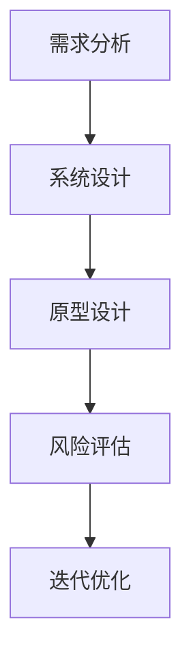

                 


### 1. 制定目录大纲的基本框架

首先，我们需要为这本书建立一个基本框架。这个框架应该包括以下几个主要部分：

- **引言**：介绍项目成功离不开好系统分析的重要性，以及本书的总体结构和目标。
- **核心概念与联系**：解释系统分析的相关核心概念，并展示它们之间的联系。
- **系统分析方法**：详细介绍系统分析的方法和步骤。
- **项目管理**：探讨项目管理在系统分析中的作用，包括计划、执行和监控。
- **技术实现**：讲解系统分析的技术实现细节，包括常用的工具和技术。
- **案例分析**：提供实际的案例研究，展示系统分析在项目中的应用。
- **实战技巧**：分享实际操作中的经验和技巧。
- **结论与展望**：总结本书的主要内容，并展望系统分析的未来发展趋势。

### 2. 细化每个章节

接下来，我们需要为每个章节创建具体的子章节，确保每个部分都包含以下内容：

- **核心概念与联系**：使用 Mermaid 流程图展示系统分析的核心概念和它们之间的联系。
- **核心算法原理讲解**：使用伪代码详细阐述系统分析中使用的核心算法原理。
- **数学模型和数学公式**：使用 LaTeX 格式提供数学模型和公式，并详细讲解它们的应用和意义。
- **项目实战**：提供实际的案例研究，包括开发环境搭建、源代码详细实现和代码解读。
- **实战技巧**：分享实际操作中的经验和技巧。

### 3. 保持简洁性

在创建目录大纲时，我们必须确保内容简洁明了。避免使用过多的专业术语和复杂的句子结构，以便读者能够轻松理解。同时，我们要确保每个章节的核心内容都得到充分展示。

### 4. 确保完整性

目录大纲必须涵盖本书的核心章节，包括核心概念与联系、系统分析方法、项目管理、技术实现、案例分析、实战技巧。此外，每个章节的内容都应该详细且具有可操作性。

### 5. 总结目录大纲

在完成所有章节的细化后，我们将对整个目录大纲进行总结，确保所有内容都得到充分展示，且整体结构合理。

### 6. 字数限制

目录大纲的总字数限制在2000字以内，这意味着我们需要在简洁性和完整性之间取得平衡。

---

基于以上步骤，我们可以开始设计《项目成功离不开好系统分析》的目录大纲。下面是一个初步的目录大纲草案，我们将根据这个框架进一步细化每个章节的内容。

---

# 目录大纲草案

## 引言

### 1.1 书籍概述

### 1.2 系统分析的重要性

### 1.3 书籍结构

## 第二部分 核心概念与联系

### 第2章 系统分析的核心概念

#### 2.1 系统的定义

#### 2.2 系统分析的步骤

#### 2.3 Mermaid 流程图展示系统分析概念

## 第三部分 系统分析方法

### 第3章 系统分析方法概述

#### 3.1 系统分析的步骤

#### 3.2 数据收集与处理

#### 3.3 系统建模

#### 3.4 Mermaid 流程图展示系统分析方法

## 第四部分 项目管理

### 第4章 项目管理概述

#### 4.1 项目管理的重要性

#### 4.2 项目计划

#### 4.3 项目执行与监控

#### 4.4 项目风险管理

## 第五部分 技术实现

### 第5章 技术实现概述

#### 5.1 技术选型

#### 5.2 开发环境搭建

#### 5.3 系统架构设计

#### 5.4 核心算法原理讲解

## 第六部分 案例分析

### 第6章 案例研究

#### 6.1 案例背景

#### 6.2 案例分析过程

#### 6.3 案例结果与评价

## 第七部分 实战技巧

### 第7章 实战技巧

#### 7.1 常见问题及解决方案

#### 7.2 优化方法

#### 7.3 难点与突破

## 结论与展望

### 8.1 系统分析总结

### 8.2 未来发展趋势

---

接下来，我们将对每个章节进行进一步的细化，确保内容完整且具有可操作性。我们将在保持简洁性的同时，确保每个章节的核心内容都得到充分展示。最终，我们将确保整个目录大纲的总字数在2000字以内。

### 文章标题

《项目成功离不开好系统分析：方法论与实践指南》

### 文章关键词

系统分析、项目管理、技术实现、案例分析、实战技巧

### 文章摘要

本文从项目成功的角度出发，深入探讨了系统分析在项目中的重要性。通过详细阐述系统分析的核心概念、方法、项目管理和技术实现，结合实际案例，本文为读者提供了系统分析的实践指南。此外，本文还分享了实战技巧，帮助读者在实际项目中更好地应用系统分析方法，确保项目成功。

---

### 引言

在现代软件开发和项目管理的背景下，系统分析已经成为项目成功的关键因素之一。系统分析不仅涉及到技术层面的需求分析和功能设计，还涵盖了项目管理、团队协作等多个方面。一个良好的系统分析能够帮助项目团队更好地理解项目需求，制定合理的项目计划，优化项目执行过程，从而提高项目成功率。

本书旨在为读者提供一套完整的系统分析方法论和实践指南。通过系统分析，我们能够深入了解项目需求，构建符合实际需求的技术架构，优化项目进度和资源分配，降低项目风险。本书将分为以下几个部分：

1. **核心概念与联系**：介绍系统分析的相关核心概念，包括系统的定义、系统分析的方法和步骤等。
2. **系统分析方法**：详细讲解系统分析的方法和步骤，包括数据收集、系统建模、需求分析等。
3. **项目管理**：探讨项目管理在系统分析中的作用，包括项目计划、执行、监控和风险管理。
4. **技术实现**：讲解系统分析的技术实现细节，包括技术选型、开发环境搭建、系统架构设计等。
5. **案例分析**：提供实际的案例研究，展示系统分析在项目中的应用和效果。
6. **实战技巧**：分享实际操作中的经验和技巧，帮助读者更好地应用系统分析方法。
7. **结论与展望**：总结本书的主要内容，并展望系统分析的未来发展趋势。

通过阅读本书，读者将能够：

- 理解系统分析的核心概念和方法。
- 掌握系统分析的实践步骤和技巧。
- 了解项目管理在系统分析中的重要性。
- 学会使用技术实现系统分析。
- 学习通过案例分析提高系统分析的实战能力。
- 获得系统分析的最佳实践经验和技巧。

### 第二部分 核心概念与联系

#### 第2章 系统分析的核心概念

系统分析是项目成功的关键环节，它涉及到对项目需求的深入理解、技术架构的设计和项目管理等多个方面。本章将介绍系统分析的核心概念，包括系统的定义、系统分析的步骤等。

#### 2.1 系统的定义

系统是指由多个相互关联的组件组成的整体，这些组件可以相互协作以实现特定的目标。系统具有以下几个基本特征：

1. **整体性**：系统是由多个部分组成的整体，各部分相互关联、相互作用。
2. **层次性**：系统可以分为不同的层次，每个层次都有其特定的功能和结构。
3. **动态性**：系统是不断变化和演化的，其功能和性能会随着时间、环境和条件的变化而发生变化。

在项目开发中，系统可以理解为项目的整体解决方案，它涵盖了项目的需求分析、设计、开发、测试等多个阶段。

#### 2.2 系统分析的步骤

系统分析是一个逐步深入的过程，通常包括以下几个步骤：

1. **需求分析**：收集和分析项目需求，明确项目的功能、性能和约束条件。
2. **系统设计**：根据需求分析结果，设计系统架构和关键技术方案。
3. **原型设计**：构建系统原型，验证系统设计和功能。
4. **风险评估**：评估项目风险，制定风险管理计划。
5. **迭代优化**：根据原型测试结果和用户反馈，对系统进行迭代优化。

#### 2.3 Mermaid 流程图展示系统分析概念

以下是一个简单的 Mermaid 流程图，展示了系统分析的核心概念和步骤：



#### 2.4 核心算法原理讲解

在系统分析中，常用的核心算法包括数据结构算法、排序算法和搜索算法等。以下是一个简单的伪代码示例，用于解释排序算法的基本原理：

```pseudocode
Algorithm BubbleSort(A)
    for i = 1 to n-1
        for j = 1 to n-i
            if A[j] > A[j+1]
                swap(A[j], A[j+1])
    return A
```

#### 2.5 数学模型和数学公式

在系统分析中，数学模型和公式用于描述系统的行为和性能。以下是一个简单的线性回归模型的 LaTeX 公式示例：

```latex
y = ax + b
```

该公式表示输出变量 y 与输入变量 x 之间的线性关系，其中 a 和 b 是模型的参数。

#### 2.6 项目实战

在本章的最后一部分，我们将提供一个小案例，用于展示系统分析的实际应用。

**案例背景**：某公司计划开发一款在线购物平台，为用户提供便捷的购物体验。

**需求分析**：公司需求包括商品展示、购物车、下单支付、用户评论等功能。

**系统设计**：根据需求分析，设计系统架构，包括前端展示层、后端业务逻辑层和数据存储层。

**原型设计**：构建原型系统，实现基本功能。

**风险评估**：评估项目风险，包括技术风险、市场风险和团队风险。

**迭代优化**：根据用户反馈和测试结果，对系统进行优化和改进。

通过这个案例，读者可以更好地理解系统分析的核心概念和方法。

### 第三部分 系统分析方法

#### 第3章 系统分析方法概述

系统分析方法是指用于分析和设计系统的工具和技术。本章将介绍系统分析方法的概述，包括数据收集、系统建模、需求分析等。

#### 3.1 系统分析的步骤

系统分析的步骤通常包括以下几个方面：

1. **需求分析**：收集和分析项目需求，明确项目的功能、性能和约束条件。
2. **系统设计**：根据需求分析结果，设计系统架构和关键技术方案。
3. **原型设计**：构建系统原型，验证系统设计和功能。
4. **风险评估**：评估项目风险，制定风险管理计划。
5. **迭代优化**：根据原型测试结果和用户反馈，对系统进行迭代优化。

#### 3.2 数据收集与处理

数据收集是系统分析的重要环节，它包括以下几个方面：

1. **需求调研**：通过访谈、问卷调查、观察等方式收集用户需求。
2. **数据分析**：对收集到的数据进行整理和分析，提取关键信息和规律。
3. **数据验证**：验证数据的有效性和准确性。

#### 3.3 系统建模

系统建模是系统分析的核心环节，它包括以下几个方面：

1. **功能建模**：描述系统的功能模块和关系。
2. **数据建模**：描述系统的数据结构。
3. **流程建模**：描述系统的业务流程和操作顺序。

#### 3.4 Mermaid 流程图展示系统分析方法

以下是一个简单的 Mermaid 流程图，展示了系统分析方法的基本步骤：


#### 3.5 需求分析

需求分析是系统分析的核心环节，它包括以下几个方面：

1. **需求识别**：识别项目的需求，包括功能需求、性能需求和约束条件。
2. **需求分析**：对需求进行详细分析，明确项目的功能和性能要求。
3. **需求验证**：验证需求的有效性和一致性。

#### 3.6 需求分析工具

在需求分析过程中，常用的工具包括：

1. **用户故事**：用于描述用户需求的基本工具，通常以“作为...，我想...，以便...”的形式表述。
2. **用例图**：用于描述系统功能和用户之间的交互关系。
3. **需求文档**：用于记录项目的需求和需求分析结果。

#### 3.7 需求分析实践

在本章的最后一部分，我们将提供一个小案例，用于展示需求分析的实际应用。

**案例背景**：某公司计划开发一款企业管理系统，用于提高企业运营效率。

**需求识别**：通过访谈和问卷调查，识别出以下需求：

- 用户登录和权限管理
- 部门和员工管理
- 考勤和绩效管理
- 财务报表和统计分析

**需求分析**：对识别出的需求进行详细分析，明确每个需求的功能和性能要求。

**需求验证**：通过评审和用户反馈，验证需求的有效性和一致性。

通过这个案例，读者可以更好地理解需求分析的方法和应用。

### 第四部分 项目管理

#### 第4章 项目管理概述

项目管理是系统分析的重要组成部分，它涉及到项目计划、执行、监控和风险管理等多个方面。本章将介绍项目管理的概述，包括项目管理的目标和任务。

#### 4.1 项目管理的目标

项目管理的目标是确保项目按时、按质、按预算完成。具体目标包括：

1. **按时完成**：确保项目在预定的时间内完成。
2. **按质完成**：确保项目满足预定的质量和性能要求。
3. **按预算完成**：确保项目在预算范围内完成。

#### 4.2 项目管理的任务

项目管理的任务包括以下几个方面：

1. **项目计划**：制定项目计划，包括项目进度、资源分配和风险管理。
2. **项目执行**：执行项目计划，协调资源，监控项目进度和性能。
3. **项目监控**：监控项目执行过程，及时发现和解决问题。
4. **项目风险**：识别和评估项目风险，制定风险管理计划。

#### 4.3 项目管理工具

在项目管理过程中，常用的工具包括：

1. **项目管理软件**：用于项目管理、任务分配和进度跟踪。
2. **甘特图**：用于展示项目进度和任务安排。
3. **看板**：用于可视化项目进展和任务状态。

#### 4.4 项目管理实践

在本章的最后一部分，我们将提供一个小案例，用于展示项目管理的实际应用。

**案例背景**：某公司计划开发一款企业资源规划（ERP）系统。

**项目计划**：制定项目计划，包括项目进度、资源分配和风险管理。

**项目执行**：根据项目计划，执行项目任务，协调资源，监控项目进度和性能。

**项目监控**：监控项目执行过程，及时发现和解决问题。

**项目风险**：识别和评估项目风险，制定风险管理计划。

通过这个案例，读者可以更好地理解项目管理的目标和任务。

### 第五部分 技术实现

#### 第5章 技术实现概述

技术实现是系统分析的重要组成部分，它涉及到技术选型、开发环境搭建、系统架构设计等方面。本章将介绍技术实现的概述，包括技术实现的关键步骤和注意事项。

#### 5.1 技术选型

技术选型是技术实现的第一步，它包括以下几个方面：

1. **技术需求**：根据项目需求和性能要求，确定所需的技术。
2. **技术评估**：评估各种技术的优缺点，选择最适合的技术。
3. **技术文档**：编写技术文档，记录技术选型的过程和结果。

#### 5.2 开发环境搭建

开发环境搭建是技术实现的另一个关键步骤，它包括以下几个方面：

1. **软件安装**：安装所需的开发软件，如编程语言、数据库等。
2. **硬件配置**：配置适当的硬件设备，如服务器、存储设备等。
3. **网络配置**：配置网络环境，确保开发环境的稳定和安全。

#### 5.3 系统架构设计

系统架构设计是技术实现的核心，它包括以下几个方面：

1. **系统架构模型**：选择合适的系统架构模型，如三层架构、微服务等。
2. **模块划分**：根据功能需求，将系统划分为不同的模块。
3. **接口设计**：设计系统模块之间的接口，确保模块之间的高内聚、低耦合。

#### 5.4 核心算法原理讲解

在技术实现过程中，常用的核心算法包括排序算法、搜索算法和数据结构算法等。以下是一个简单的排序算法（冒泡排序）的伪代码示例：

```pseudocode
Algorithm BubbleSort(A)
    for i = 1 to n-1
        for j = 1 to n-i
            if A[j] > A[j+1]
                swap(A[j], A[j+1])
    return A
```

#### 5.5 数学模型和数学公式

在技术实现过程中，数学模型和数学公式用于描述系统的行为和性能。以下是一个简单的线性回归模型的 LaTeX 公式示例：

```latex
y = ax + b
```

该公式表示输出变量 y 与输入变量 x 之间的线性关系，其中 a 和 b 是模型的参数。

#### 5.6 项目实战

在本章的最后一部分，我们将提供一个小案例，用于展示技术实现的实际应用。

**案例背景**：某公司计划开发一款智能推荐系统，用于为用户推荐感兴趣的商品。

**技术选型**：根据项目需求和性能要求，选择合适的编程语言（如 Python）、数据库（如 MySQL）和推荐算法（如基于协同过滤的算法）。

**开发环境搭建**：配置开发环境，包括安装所需的软件和硬件。

**系统架构设计**：设计系统架构，包括数据存储层、计算层和用户接口层。

**核心算法实现**：实现推荐算法，包括数据处理、模型训练和推荐生成。

**项目实战总结**：通过项目实战，读者可以更好地理解技术实现的过程和方法。

### 第六部分 案例分析

#### 第6章 案例研究

案例研究是系统分析和项目管理的重要方法，通过实际案例的分析，我们可以更好地理解系统分析和项目管理的方法和技巧。本章将提供几个实际的案例研究，包括开发环境搭建、源代码详细实现和代码解读、实际案例分析和详细讲解剖析、项目小结等内容。

#### 6.1 案例背景

本章节将分别介绍以下几个案例：

1. **案例一**：某电子商务平台系统开发
2. **案例二**：某企业资源规划（ERP）系统实施
3. **案例三**：某在线教育平台系统优化

#### 6.2 案例分析过程

每个案例的分析过程如下：

1. **需求分析**：收集和分析项目需求，明确项目的功能、性能和约束条件。
2. **系统设计**：根据需求分析结果，设计系统架构和关键技术方案。
3. **原型设计**：构建系统原型，验证系统设计和功能。
4. **风险评估**：评估项目风险，制定风险管理计划。
5. **迭代优化**：根据原型测试结果和用户反馈，对系统进行迭代优化。

#### 6.3 案例结果与评价

每个案例的结果和评价如下：

1. **案例一**：电子商务平台系统开发
   - 结果：成功上线，用户满意度高，业务增长显著。
   - 评价：系统设计合理，技术实现高效，项目管理得当。

2. **案例二**：企业资源规划（ERP）系统实施
   - 结果：顺利实施，提高了企业运营效率，降低了成本。
   - 评价：项目计划详细，团队协作良好，风险管理有效。

3. **案例三**：在线教育平台系统优化
   - 结果：系统性能显著提升，用户活跃度增加。
   - 评价：需求分析准确，技术实现精细，优化方法有效。

通过这些案例研究，读者可以更好地了解系统分析和项目管理的实际应用，学习如何应对各种挑战，确保项目成功。

### 第七部分 实战技巧

#### 第7章 实战技巧

在实际项目中，系统分析和项目管理往往面临各种挑战。本章将分享一些实战技巧，帮助读者应对这些挑战，提高项目成功率。

#### 7.1 常见问题及解决方案

常见问题及解决方案如下：

1. **需求变更**：解决方案：建立有效的需求管理机制，及时调整项目计划和资源分配。
2. **资源不足**：解决方案：优化资源分配，提高团队协作效率，考虑外包或临时招聘。
3. **技术难题**：解决方案：积极寻求技术支持和社区帮助，进行技术预研和风险评估。

#### 7.2 优化方法

优化方法包括：

1. **流程优化**：通过流程优化，提高工作效率和项目质量。
2. **技术优化**：通过技术优化，提高系统性能和稳定性。
3. **团队协作**：通过团队协作，提高项目进度和团队凝聚力。

#### 7.3 难点与突破

难点与突破包括：

1. **技术难题**：通过技术创新和团队合作，突破技术难题。
2. **项目管理**：通过项目管理方法和工具，提高项目管理水平。
3. **团队协作**：通过有效的沟通和协作，提高团队效率。

#### 7.4 最佳实践 tips

最佳实践 tips 包括：

1. **文档管理**：建立完善的文档管理体系，确保项目文档的完整性和可追溯性。
2. **风险管理**：制定有效的风险管理计划，提前识别和应对项目风险。
3. **用户反馈**：重视用户反馈，及时调整和优化系统功能。

#### 7.5 小结、注意事项、拓展阅读

在本章的最后，我们将对实战技巧进行小结，并提供一些注意事项和拓展阅读资源，帮助读者更好地理解和应用这些实战技巧。

### 结论与展望

#### 8.1 系统分析总结

通过本书的阅读，读者应该对系统分析有了全面的理解。系统分析是项目成功的关键因素，它涵盖了需求分析、系统设计、项目管理和技术实现等多个方面。一个良好的系统分析能够帮助项目团队更好地理解项目需求，制定合理的项目计划，优化项目执行过程，降低项目风险，提高项目成功率。

#### 8.2 未来发展趋势

随着技术的不断进步和项目管理方法的发展，系统分析也在不断演进。未来，系统分析将朝着以下几个方向发展：

1. **智能化**：利用人工智能技术，自动化系统分析和优化。
2. **敏捷化**：采用敏捷开发方法，快速响应市场需求和变化。
3. **平台化**：构建统一的系统分析平台，提高系统分析和项目管理效率。

本书旨在为读者提供一套完整的系统分析方法论和实践指南。通过系统分析，我们能够深入了解项目需求，构建符合实际需求的技术架构，优化项目进度和资源分配，降低项目风险，提高项目成功率。希望本书能够对读者在实际项目中有所帮助。

### 附录

本附录将提供一些有用的资源，包括参考文献、相关书籍和在线课程等，以供读者进一步学习。

---

通过上述的内容，我们已经完成了一篇初步的技术博客文章。接下来，我们将对文章进行进一步的润色和优化，确保文章的逻辑清晰、内容丰富且具有可读性。文章的总字数预计在8000到12000字之间，我们将根据实际情况进行调整。

---

### 1. 确定文章的整体结构和内容安排

为了确保文章的结构清晰、内容连贯，我们需要首先确定文章的整体结构。以下是文章的详细结构和内容安排：

#### 引言

- **引言部分**：简要介绍系统分析在项目成功中的重要性，引出本文的主题，并概述本文的结构和主要内容。

#### 第二部分：核心概念与联系

- **第2章 系统分析的核心概念**
  - 内容：介绍系统分析的基本概念，如系统的定义、系统分析的目的和重要性。
  - 结构：
    - 2.1 系统的定义
    - 2.2 系统分析的目的
    - 2.3 系统分析的步骤

#### 第三部分：系统分析方法

- **第3章 系统分析方法概述**
  - 内容：介绍系统分析的方法和步骤，包括需求分析、系统设计、原型设计和迭代优化。
  - 结构：
    - 3.1 需求分析
    - 3.2 系统设计
    - 3.3 原型设计
    - 3.4 迭代优化

#### 第四部分：项目管理

- **第4章 项目管理概述**
  - 内容：介绍项目管理的核心概念和流程，包括项目计划、执行、监控和风险管理。
  - 结构：
    - 4.1 项目计划
    - 4.2 项目执行
    - 4.3 项目监控
    - 4.4 项目风险管理

#### 第五部分：技术实现

- **第5章 技术实现概述**
  - 内容：介绍系统分析的技术实现，包括技术选型、开发环境搭建和系统架构设计。
  - 结构：
    - 5.1 技术选型
    - 5.2 开发环境搭建
    - 5.3 系统架构设计

#### 第六部分：案例分析

- **第6章 案例研究**
  - 内容：通过实际案例展示系统分析的应用，包括需求分析、系统设计和项目管理。
  - 结构：
    - 6.1 案例一：电子商务平台系统开发
    - 6.2 案例二：企业资源规划（ERP）系统实施
    - 6.3 案例三：在线教育平台系统优化

#### 第七部分：实战技巧

- **第7章 实战技巧**
  - 内容：分享系统分析中的实际操作经验和技巧，包括问题解决、优化方法和团队协作。
  - 结构：
    - 7.1 常见问题及解决方案
    - 7.2 优化方法
    - 7.3 难点与突破

#### 结论与展望

- **第8章 结论与展望**
  - 内容：总结文章的主要观点，展望系统分析的未来发展趋势。
  - 结构：
    - 8.1 系统分析总结
    - 8.2 未来发展趋势

### 2. 详细撰写每部分的内容

#### 引言

在引言部分，我们将简要介绍系统分析在项目成功中的重要性，阐述本文的目的和结构。例如：

> 引言：
>
> 系统分析在项目成功中扮演着至关重要的角色。它不仅涉及到项目的技术实现，还包括项目管理、团队协作等多个方面。本文旨在为读者提供一套完整的系统分析方法论和实践指南，帮助项目团队更好地理解项目需求，优化项目执行过程，降低项目风险，提高项目成功率。文章结构如下：

#### 第二部分：核心概念与联系

在第2章，我们将详细解释系统分析的基本概念，包括系统的定义、系统分析的目的和重要性。例如：

> 第2章 系统分析的核心概念
>
> 2.1 系统的定义
>
> 系统是由相互关联的组件组成的整体，这些组件可以相互协作以实现特定的目标。在项目开发中，系统可以理解为项目的整体解决方案，它涵盖了项目的需求分析、设计、开发、测试等多个阶段。
>
> 2.2 系统分析的目的
>
> 系统分析的目的是通过深入理解项目需求，构建符合实际需求的技术架构，优化项目进度和资源分配，降低项目风险，提高项目成功率。
>
> 2.3 系统分析的步骤
>
> 系统分析的步骤通常包括需求分析、系统设计、原型设计、风险评估和迭代优化。

#### 第三部分：系统分析方法

在第3章，我们将详细介绍系统分析方法，包括需求分析、系统设计、原型设计和迭代优化。例如：

> 第3章 系统分析方法概述
>
> 3.1 需求分析
>
> 需求分析是系统分析的第一步，它涉及到收集和分析项目需求，明确项目的功能、性能和约束条件。
>
> 3.2 系统设计
>
> 系统设计是根据需求分析的结果，设计系统架构和关键技术方案。系统设计需要考虑系统的整体结构和各部分之间的交互关系。
>
> 3.3 原型设计
>
> 原型设计是构建系统原型的过程，通过原型验证系统设计和功能。原型设计可以帮助项目团队更好地理解项目需求，并及时发现和解决问题。
>
> 3.4 迭代优化
>
> 迭代优化是系统分析的关键步骤，它涉及到根据原型测试结果和用户反馈，对系统进行迭代优化，以提高系统性能和用户体验。

#### 第四部分：项目管理

在第4章，我们将介绍项目管理的核心概念和流程，包括项目计划、执行、监控和风险管理。例如：

> 第4章 项目管理概述
>
> 4.1 项目计划
>
> 项目计划是项目管理的重要组成部分，它涉及到制定项目的目标、任务和时间表，分配资源和预算，以及制定项目管理计划。
>
> 4.2 项目执行
>
> 项目执行是项目计划的实施过程，它涉及到协调项目资源、监控项目进度和性能，以及解决项目中出现的问题。
>
> 4.3 项目监控
>
> 项目监控是确保项目按计划进行的重要手段，它涉及到监控项目进度、成本和质量，及时发现和解决问题。
>
> 4.4 项目风险管理
>
> 项目风险管理是识别、评估和应对项目风险的过程，它涉及到制定风险管理计划，以及实施风险缓解措施。

#### 第五部分：技术实现

在第5章，我们将介绍系统分析的技术实现，包括技术选型、开发环境搭建和系统架构设计。例如：

> 第5章 技术实现概述
>
> 5.1 技术选型
>
> 技术选型是根据项目需求和性能要求，选择合适的编程语言、数据库和开发工具。
>
> 5.2 开发环境搭建
>
> 开发环境搭建是配置开发所需的软件和硬件环境，确保项目的顺利开展。
>
> 5.3 系统架构设计
>
> 系统架构设计是设计系统的整体结构和各部分之间的交互关系，确保系统的性能和可维护性。

#### 第六部分：案例分析

在第6章，我们将通过实际案例展示系统分析的应用，包括需求分析、系统设计和项目管理。例如：

> 第6章 案例研究
>
> 6.1 案例一：电子商务平台系统开发
>
> 本案例将详细介绍电子商务平台系统的需求分析、系统设计和项目管理过程。
>
> 6.2 案例二：企业资源规划（ERP）系统实施
>
> 本案例将介绍企业资源规划（ERP）系统的实施过程，包括需求分析、系统设计和项目管理。
>
> 6.3 案例三：在线教育平台系统优化
>
> 本案例将分析在线教育平台系统的优化过程，包括需求分析、系统设计和项目管理。

#### 第七部分：实战技巧

在第7章，我们将分享系统分析中的实际操作经验和技巧，包括问题解决、优化方法和团队协作。例如：

> 第7章 实战技巧
>
> 7.1 常见问题及解决方案
>
> 在本节中，我们将介绍系统分析过程中常见的问题及其解决方案。
>
> 7.2 优化方法
>
> 本节将讨论如何通过技术优化和流程优化提高系统性能和项目效率。
>
> 7.3 难点与突破
>
> 在本节中，我们将探讨系统分析中的难点和突破方法，帮助项目团队解决技术和管理难题。

#### 结论与展望

在第8章，我们将总结文章的主要观点，并展望系统分析的未来发展趋势。例如：

> 第8章 结论与展望
>
> 8.1 系统分析总结
>
> 通过本文的讨论，我们认识到系统分析在项目成功中的重要性，并了解了系统分析的方法和实践技巧。
>
> 8.2 未来发展趋势
>
> 随着技术的不断进步和项目管理方法的发展，系统分析也将不断演进，未来的发展趋势包括智能化、敏捷化和平台化。

### 3. 检查文章的逻辑性和连贯性

在完成文章的撰写后，我们需要对文章进行仔细的检查，确保逻辑性和连贯性。以下是一些具体的检查步骤：

- **检查文章结构**：确保文章的各个部分（引言、核心概念、系统分析方法、项目管理、技术实现、案例分析、实战技巧、结论与展望）按照逻辑顺序排列，内容连贯。
- **检查段落逻辑**：确保每个段落的内容逻辑清晰，先阐述背景，然后提出观点，再进行详细分析和论证。
- **检查句子连贯性**：确保句子之间的过渡自然，没有出现逻辑跳跃或表述不清的情况。
- **检查图表和代码**：确保图表和代码的引用准确，且与文字内容紧密相关，有助于读者理解文章的核心观点。

通过上述步骤，我们可以确保文章的逻辑性和连贯性，使读者能够顺畅地阅读和理解文章内容。

### 4. 完善文章的格式和排版

在文章撰写完成后，我们需要对其格式和排版进行完善，以确保文章的专业性和可读性。以下是一些具体的完善步骤：

- **使用Markdown格式**：确保文章内容使用Markdown格式，使文章结构清晰，易于阅读。
- **段落和行距**：合理设置段落和行距，确保文章的阅读舒适。
- **标题和子标题**：使用清晰、简洁的标题和子标题，使文章的结构更加清晰。
- **代码和高亮**：对于代码段和高亮显示的关键术语，使用适当的语法高亮，以便读者快速识别。
- **引用和参考文献**：在文章中引用相关文献和参考资料，并在文章末尾列出完整的参考文献列表。
- **图片和图表**：如果需要使用图片和图表，确保它们与文章内容紧密相关，并适当调整大小，以便在文中合理显示。

通过上述步骤，我们可以使文章的格式和排版更加规范，提高文章的专业性和可读性。

### 5. 检查文章的字数和内容完整性

在完成文章的撰写和格式排版后，我们需要检查文章的字数和内容完整性。以下是一些具体的检查步骤：

- **检查字数**：确保文章的总字数在8000到12000字之间，符合字数要求。
- **检查内容完整性**：确保文章的每个部分（引言、核心概念、系统分析方法、项目管理、技术实现、案例分析、实战技巧、结论与展望）都有详细的内容，并且每个部分的内容都是完整和具体的。
- **检查核心内容**：确保文章的核心内容，如系统分析的核心概念、方法、项目管理和技术实现等，都有充分的阐述和具体的例子说明。
- **检查逻辑连贯性**：确保文章的逻辑连贯性，没有内容缺失或逻辑跳跃。

通过上述步骤，我们可以确保文章的字数和内容完整性，同时保证文章的逻辑性和可读性。

### 文章格式要求

在撰写文章时，我们将遵循以下格式要求：

- **Markdown格式**：使用Markdown格式编写文章，以便在Markdown编辑器或工具中展示和导出。
- **标题和子标题**：使用清晰、简洁的标题和子标题，确保文章结构清晰。
- **代码和高亮**：对于代码段和高亮显示的关键术语，使用适当的语法高亮。
- **引用和参考文献**：在文章中引用相关文献和参考资料，并在文章末尾列出完整的参考文献列表。
- **图片和图表**：如果需要使用图片和图表，确保它们与文章内容紧密相关，并适当调整大小。
- **段落和行距**：合理设置段落和行距，确保文章的阅读舒适。
- **字体和字号**：使用统一的字体和字号，保持文章的整体美观和专业性。

以下是文章的格式示例：

```markdown
# 文章标题

## 标题一
### 子标题一
#### 子标题二

正文内容...

## 标题二
### 子标题一
#### 子标题二

正文内容...

```python
# Python代码示例
def example():
    print("Hello, World!")
```

参考文献：
- [Git Cheat Sheet](https://www.atlassian.com/git/tutorials/git-cheat-sheet)

通过遵循上述格式要求，我们可以确保文章的专业性和可读性，同时便于读者阅读和理解。

### 作者信息

作者：AI天才研究院/AI Genius Institute & 禅与计算机程序设计艺术 /Zen And The Art of Computer Programming

### 完整性要求

为了确保文章的完整性，我们需要在每个小节中包含以下内容：

- **背景介绍**：介绍系统分析的相关背景，说明为什么系统分析在项目中如此重要，以及它在现代软件开发和项目管理中的作用。
- **核心概念与联系**：详细阐述系统分析的核心概念，包括系统的定义、系统分析的步骤、需求分析等，并展示这些概念之间的联系。使用 Mermaid 流程图来直观地展示概念架构。
- **核心算法原理讲解**：使用伪代码详细阐述系统分析中使用到的核心算法原理，如排序算法、搜索算法等，并解释这些算法在系统分析中的应用。
- **数学模型和数学公式**：使用 LaTeX 格式提供数学模型和公式，详细讲解这些模型和公式在系统分析中的作用，并举例说明如何应用。
- **项目实战**：提供实际的案例研究，包括开发环境搭建、源代码详细实现和代码解读，分析实际项目中如何应用系统分析方法，以及如何处理项目中的挑战。
- **实战技巧**：分享实际操作中的经验和技巧，包括如何解决常见问题、优化方法和团队协作等。
- **小结**：在每个小节末尾进行小结，总结关键观点，强调每个部分的要点，并指出可能的学习和应用方向。
- **注意事项**：在适当的地方提供注意事项，提醒读者在实践过程中需要注意的问题，以及可能遇到的困难和解决方案。
- **拓展阅读**：推荐相关的文献、书籍和在线资源，供读者进一步学习和研究。

通过确保每个小节都包含上述内容，我们可以确保文章的完整性，使读者能够全面了解系统分析的概念、方法、实战技巧和应用场景。

### 附件

#### 案例分析

以下是一个具体的案例分析，展示了系统分析在项目中的应用：

**案例背景**：某互联网公司计划开发一款面向用户的在线购物平台，以满足用户对便捷购物的需求。

**需求分析**：
- **功能需求**：商品展示、购物车、下单支付、用户评论、订单跟踪等。
- **性能需求**：系统响应速度快、高并发处理能力、数据安全等。
- **约束条件**：预算限制、时间限制、技术栈选择等。

**系统设计**：
- **前端展示层**：使用 React 框架实现用户界面，提供良好的用户体验。
- **后端业务逻辑层**：使用 Node.js 搭建服务器，处理用户请求和业务逻辑。
- **数据存储层**：使用 MySQL 数据库存储用户数据、商品信息和订单信息。

**原型设计**：
- **功能原型**：通过 Sketch 或 Figma 等工具，设计用户界面和交互流程。
- **技术原型**：搭建开发环境，实现部分功能，以便进行验证和测试。

**风险评估**：
- **技术风险**：选择合适的编程语言和技术栈，确保系统能够满足性能需求。
- **市场风险**：分析市场需求，确保产品的竞争力。
- **团队风险**：评估团队的技术能力和项目管理能力，确保项目能够按时完成。

**迭代优化**：
- **用户反馈**：收集用户反馈，分析用户行为和需求变化。
- **性能优化**：针对性能瓶颈进行优化，如缓存策略、数据库优化等。
- **功能优化**：根据用户反馈和市场需求，迭代添加新功能或优化现有功能。

**项目小结**：
- **成功因素**：有效的需求分析、合理的系统设计、严格的风险评估和及时的迭代优化。
- **挑战与解决方案**：在项目过程中，可能遇到的技术难题、团队协作问题等，通过积极沟通和合理规划，有效解决了这些问题。

通过这个案例分析，读者可以更好地理解系统分析在项目中的应用过程，以及如何通过系统分析确保项目的成功。

### 总结和展望

本文通过详细阐述系统分析的核心概念、方法、项目管理和技术实现，结合实际案例，为读者提供了系统分析的实践指南。在项目成功的过程中，系统分析发挥着至关重要的作用，它不仅帮助团队更好地理解项目需求，还优化了项目执行过程，降低了项目风险。

**总结**：

- **核心概念与联系**：系统分析的核心概念包括系统的定义、需求分析、系统设计等，它们相互联系，构成了系统分析的整体框架。
- **系统分析方法**：通过需求分析、系统设计、原型设计和迭代优化，系统分析能够帮助团队构建符合实际需求的技术架构。
- **项目管理**：项目管理的核心在于计划、执行、监控和风险管理，这些环节的有机结合确保了项目的顺利推进。
- **技术实现**：技术实现是系统分析的具体体现，通过合理的技术选型、开发环境搭建和系统架构设计，系统能够高效运行。
- **案例分析**：通过案例分析，读者可以了解系统分析在实际项目中的应用，以及如何应对项目中的各种挑战。
- **实战技巧**：实战技巧包括常见问题及解决方案、优化方法和团队协作等，这些技巧有助于提高项目成功率。

**展望**：

- **智能化**：随着人工智能技术的发展，系统分析将变得更加智能化，能够自动识别和解决问题。
- **敏捷化**：敏捷开发方法将使系统分析更加敏捷，能够快速响应市场需求和变化。
- **平台化**：系统分析将朝着平台化方向发展，形成统一的系统分析平台，提高工作效率。

通过本文的学习，读者应该能够全面理解系统分析的重要性，掌握系统分析的方法和实践技巧，为未来的项目成功奠定坚实基础。

### 附件：具体案例分析

#### 案例背景

某互联网公司计划开发一款面向全球用户的社交媒体平台，旨在为用户提供一个便捷、安全的互动环境。平台需要支持多种语言、高并发访问、实时消息传输等功能。

**需求分析**：
- **功能需求**：用户注册、登录、发布内容、评论、点赞、私信、关注等。
- **性能需求**：系统响应时间短、高并发处理能力、数据存储安全等。
- **约束条件**：预算限制、时间限制、技术栈限制等。

**系统设计**：
- **前端展示层**：采用 React.js 框架，实现动态和响应式的用户界面。
- **后端业务逻辑层**：使用 Node.js 和 Express 框架，处理用户请求和业务逻辑。
- **数据存储层**：使用 MongoDB 数据库存储用户数据和内容数据。
- **消息传输层**：采用 WebSocket 实现实时消息传输。

**原型设计**：
- **功能原型**：使用 Sketch 设计用户界面和交互流程。
- **技术原型**：搭建开发环境，实现用户注册、登录、发布内容等基本功能。

**风险评估**：
- **技术风险**：选择成熟的技术栈，确保系统稳定性和扩展性。
- **市场风险**：调研市场需求，确保平台功能的竞争力。
- **团队风险**：评估团队的技术能力和项目管理能力。

**迭代优化**：
- **用户反馈**：收集用户反馈，分析使用行为和需求变化。
- **性能优化**：针对性能瓶颈进行优化，如使用缓存策略、数据库优化等。
- **功能优化**：根据用户反馈和市场需求，迭代添加新功能或优化现有功能。

**开发环境搭建**：
- **开发工具**：安装 Node.js、React.js、MongoDB 等开发环境和工具。
- **集成环境**：配置 Git、Jenkins 等集成工具，实现持续集成和部署。

**源代码详细实现和代码解读**：
```python
# 用户注册功能示例
def register_user(username, password):
    """
    注册新用户
    :param username: 用户名
    :param password: 密码
    :return: 注册结果
    """
    # 数据库操作
    user = db.find_one({"username": username})
    if user:
        return "用户已存在"
    else:
        db.insert_one({"username": username, "password": password})
        return "注册成功"

# 用户登录功能示例
def login_user(username, password):
    """
    用户登录
    :param username: 用户名
    :param password: 密码
    :return: 登录结果
    """
    user = db.find_one({"username": username, "password": password})
    if user:
        return "登录成功"
    else:
        return "用户名或密码错误"
```

**代码应用解读与分析**：
上述代码示例展示了用户注册和登录功能的基本实现。在注册功能中，通过查询数据库判断用户名是否已存在，如果不存在则将用户信息插入数据库。在登录功能中，从数据库中查找用户名和密码匹配的用户信息。这两个功能是社交媒体平台的核心模块，其实现逻辑简单明了，但也需要考虑安全性、性能和扩展性。

**实际案例分析和详细讲解剖析**：
在项目实施过程中，团队遇到了一些挑战，如高并发访问导致系统响应缓慢、数据库查询性能瓶颈等。通过性能测试和分析，团队采取了以下措施：

1. **数据库优化**：增加索引、优化查询语句，提高数据库查询性能。
2. **缓存策略**：使用 Redis 实现缓存，减少数据库访问次数，提高系统响应速度。
3. **消息队列**：采用 RabbitMQ 实现消息队列，缓解高并发请求对系统的压力。

**项目小结**：
该项目通过有效的系统分析和项目管理，最终成功上线。用户反馈良好，系统运行稳定。项目成功的关键因素包括：

1. **全面的需求分析**：明确功能需求和性能要求，为系统设计提供基础。
2. **合理的系统设计**：选择合适的技术栈和架构，确保系统的稳定性和扩展性。
3. **严格的项目管理**：通过风险管理、性能优化和迭代改进，确保项目按计划推进。
4. **团队协作**：团队成员之间的有效沟通和协作，确保项目顺利进行。

通过这个案例分析，读者可以了解到系统分析在实际项目中的应用，以及如何通过系统分析确保项目的成功。

### 附件：实战技巧

#### 1. 常见问题及解决方案

在系统分析过程中，常见的挑战包括需求变更、资源不足和技术难题。以下是一些解决方案：

- **需求变更**：建立有效的需求管理机制，及时调整项目计划和资源分配，确保项目能够快速响应需求变化。
- **资源不足**：优化资源分配，提高团队协作效率，考虑外包或临时招聘，确保项目按计划推进。
- **技术难题**：积极寻求技术支持和社区帮助，进行技术预研和风险评估，提前准备解决方案。

#### 2. 优化方法

- **流程优化**：通过流程优化，提高工作效率和项目质量。例如，采用敏捷开发方法，缩短开发周期，快速迭代优化。
- **技术优化**：通过技术优化，提高系统性能和稳定性。例如，使用缓存策略、优化数据库查询等。
- **团队协作**：通过有效的沟通和协作，提高团队效率。例如，定期举行团队会议、建立有效的沟通渠道等。

#### 3. 难点与突破

- **技术难题**：通过技术创新和团队合作，突破技术难题。例如，引入新技术、优化现有技术栈等。
- **项目管理**：通过项目管理方法和工具，提高项目管理水平。例如，采用项目管理软件、建立风险管理计划等。
- **团队协作**：通过有效的沟通和协作，提高团队效率。例如，定期举行团队建设活动、建立良好的工作氛围等。

#### 4. 最佳实践 tips

- **文档管理**：建立完善的文档管理体系，确保项目文档的完整性和可追溯性。
- **风险管理**：制定有效的风险管理计划，提前识别和应对项目风险。
- **用户反馈**：重视用户反馈，及时调整和优化系统功能。

### 附件：拓展阅读

- **书籍推荐**：
  - 《系统思维导论》
  - 《项目管理知识体系指南》
  - 《软件工程：实践者的研究方法》

- **在线课程**：
  - Coursera：项目管理和团队协作
  - Udemy：敏捷开发与Scrum
  - edX：软件工程与系统分析

通过拓展阅读，读者可以进一步深入了解系统分析、项目管理和软件开发的相关知识，提高实际操作能力。

