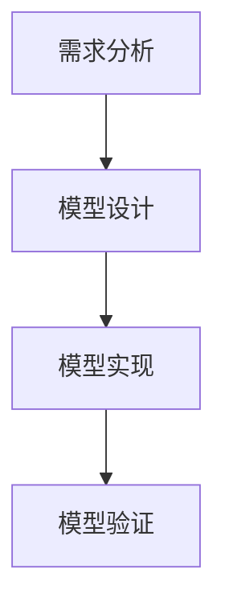
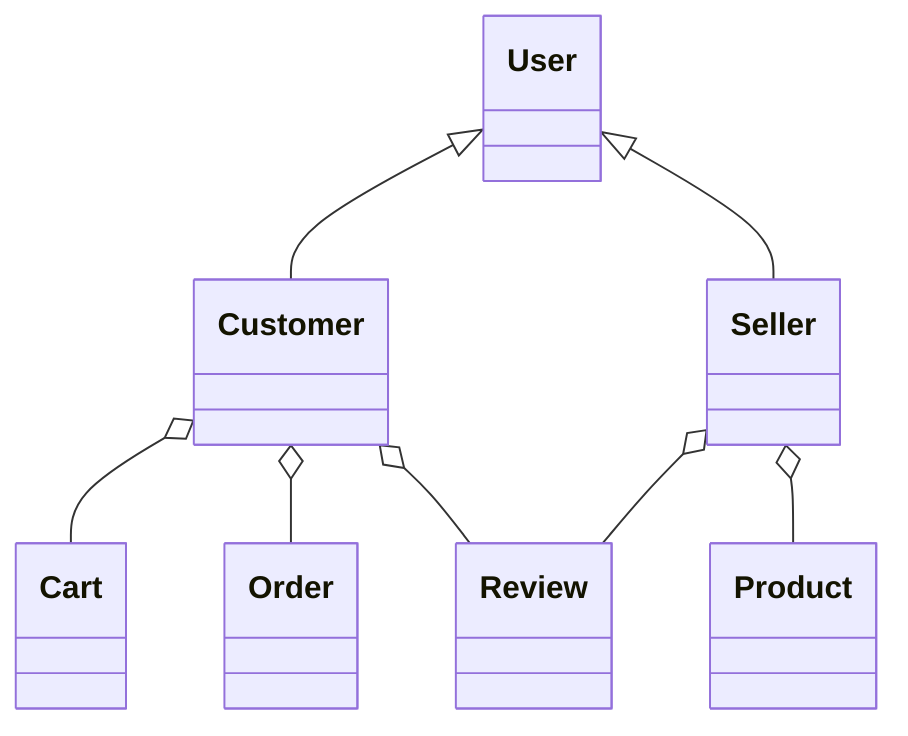

                 

### 文章标题

# 领域建模的普适四招

---

关键词：领域建模、领域模型、核心算法、数学模型、项目实战

---

摘要：本文将深入探讨领域建模的普适四招，包括核心概念、算法原理、数学模型和项目实战。通过详细讲解和实践，帮助读者全面掌握领域建模的方法和应用，从而提升软件设计和系统开发的效率与质量。

---

### 目录

1. 引言  
2. 领域建模基础  
3. 核心算法原理讲解  
4. 数学模型和公式详解  
5. 项目实战  
6. 最佳实践与总结  
7. 注意事项与拓展阅读

---

### 引言

领域建模是一种重要的软件设计方法，旨在通过抽象和概念化现实世界中的领域，构建出可操作的软件模型。它不仅帮助软件开发者更好地理解业务需求，而且为系统的可维护性和扩展性提供了坚实的基础。然而，领域建模并不是一个简单的任务，它涉及到多个层面的知识和技术。

本文将围绕领域建模的普适四招进行探讨，旨在为读者提供一套系统、实用的领域建模指南。这四招包括：核心概念的理解、算法原理的掌握、数学模型的运用以及项目实战的经验积累。通过本文的详细讲解，读者将能够全面掌握领域建模的方法，提升自己的软件设计和开发能力。

接下来，我们将依次介绍这四招的具体内容，并配以丰富的实例和案例，帮助读者更好地理解和应用领域建模。

---

### 1. 领域建模基础

#### 什么是领域？

领域（Domain）是指一个特定的知识领域或者业务领域，它包含了特定的业务规则、流程和实体。在软件工程中，领域模型是对领域内所有元素和关系的抽象表示，它为软件开发提供了一个清晰的结构框架。

#### 领域模型是什么？

领域模型（Domain Model）是领域内所有实体、关系和行为的抽象表示。它通常使用UML（统一建模语言）进行图形化表示，包括类图、对象图、组件图等。领域模型的核心目标是简化系统设计，提高系统的可维护性和可扩展性。

#### 领域建模的重要性

领域建模在软件设计和开发过程中扮演着关键角色。以下是领域建模的重要性：

- **需求分析**：领域建模有助于更准确地理解和分析业务需求，确保软件开发的方向与业务目标一致。
- **系统设计**：领域模型为系统设计提供了清晰的蓝图，有助于开发人员更好地理解和实现系统的功能。
- **可维护性**：领域模型提高了代码的可读性和可维护性，降低了系统变更的成本。
- **可扩展性**：领域模型使得系统的扩展和升级更加容易，能够更好地适应业务的变化。

---

#### 传统领域建模方法

传统领域建模方法主要依赖于人工分析和经验总结，其基本流程如下：

##### 1.1 数据收集

数据收集是领域建模的第一步，主要涉及以下内容：

- **业务流程**：了解业务流程，包括各个步骤、活动和角色。
- **业务规则**：收集业务规则，包括各种约束条件和决策逻辑。
- **业务实体**：识别业务实体，包括客户、订单、产品等。

##### 1.2 数据分析

数据分析是对收集到的数据进行分析和整理，主要任务包括：

- **实体识别**：确定领域模型中的主要实体。
- **关系识别**：分析实体之间的关系，包括关联、依赖和继承等。
- **行为识别**：识别实体的行为和操作。

##### 1.3 模型构建

模型构建是领域建模的核心步骤，主要包括以下任务：

- **定义类和属性**：根据实体识别结果，定义领域模型中的类及其属性。
- **定义关系**：根据关系识别结果，定义类之间的关系。
- **定义行为**：根据行为识别结果，定义类的操作和交互。

##### 1.4 模型验证

模型验证是确保领域模型准确性和完整性的关键步骤，主要包括以下内容：

- **一致性检查**：检查模型内部的一致性，如类属性的类型、关系的类型等。
- **完整性检查**：检查模型是否完整地反映了业务需求。
- **可验证性检查**：确保模型中的规则和逻辑能够在实际业务环境中得到验证。

---

#### 现代领域建模方法

现代领域建模方法结合了人工智能、机器学习等技术，使领域建模更加自动化和高效。以下是其基本流程：

##### 1.1 需求分析

需求分析是现代领域建模的第一步，主要涉及以下内容：

- **自动化需求收集**：使用自然语言处理技术，自动从业务文档、用户访谈等中提取需求。
- **需求分类**：对收集到的需求进行分类，包括功能需求、非功能需求等。

##### 1.2 模型设计

模型设计是基于需求分析结果构建领域模型，主要包括以下任务：

- **自动生成类和属性**：使用机器学习算法，自动生成类及其属性。
- **自动生成关系**：根据需求分类结果，自动生成类之间的关系。
- **自动生成行为**：基于业务规则，自动生成类的操作和交互。

##### 1.3 模型实现

模型实现是将领域模型转化为实际软件系统，主要包括以下任务：

- **代码生成**：使用代码生成工具，自动生成类和关系对应的源代码。
- **系统集成**：将生成的代码与其他系统组件集成，构建完整的软件系统。

##### 1.4 模型评估

模型评估是确保领域模型质量和可行性的关键步骤，主要包括以下内容：

- **性能评估**：评估模型在实际运行环境中的性能，如响应时间、资源消耗等。
- **可维护性评估**：评估模型的可维护性，如代码的可读性、可扩展性等。
- **可扩展性评估**：评估模型在业务变化下的可扩展性。

---

#### 领域建模的基本流程

领域建模的基本流程可以概括为以下四个步骤：

1. **需求分析**：收集和分析业务需求，确定领域模型的需求。
2. **模型设计**：基于需求分析结果，构建领域模型。
3. **模型实现**：将领域模型转化为实际软件系统。
4. **模型验证**：评估领域模型的质量和可行性。

以下是一个简化的Mermaid流程图，展示了领域建模的基本流程：



---

### 3. 核心算法原理讲解

领域建模过程中，常用的算法包括ER模型、UML类图等。以下将详细讲解这些算法的基本原理，并使用伪代码展示其基本流程。

#### ER模型（Entity-Relationship Model）

ER模型是领域建模中最常用的方法之一，它通过实体、属性和关系来描述领域中的数据结构。

##### 基本概念

- **实体（Entity）**：领域中的基本单位，如学生、课程等。
- **属性（Attribute）**：实体的特征，如学生的姓名、年龄等。
- **关系（Relationship）**：实体之间的关联，如学生选课、课程授课等。

##### 基本流程

1. **实体识别**：根据业务需求，识别领域中的主要实体。
2. **属性识别**：为每个实体识别其属性。
3. **关系识别**：分析实体之间的关系，并定义关系的类型（如一对一、一对多、多对多）。
4. **模型构建**：基于实体、属性和关系，构建ER模型。

以下是一个简化的伪代码示例：

```pseudocode
function ERModel(entities, attributes, relationships):
    for each entity in entities:
        create class Entity with attributes
    for each relationship in relationships:
        create relationship between entities
    return ERModel
```

#### UML类图（Unified Modeling Language Class Diagram）

UML类图是描述领域模型的重要工具，它通过类、属性和方法来表示领域中的概念和关系。

##### 基本概念

- **类（Class）**：领域中的概念实体，如学生、课程等。
- **属性（Attribute）**：类的特征，如学生的姓名、年龄等。
- **方法（Method）**：类的操作，如学生的选课、退课等。

##### 基本流程

1. **类识别**：根据业务需求，识别领域中的主要类。
2. **属性识别**：为每个类识别其属性。
3. **方法识别**：为每个类识别其方法。
4. **关系识别**：分析类之间的关系，并定义关系的类型（如继承、关联等）。
5. **模型构建**：基于类、属性和方法，构建UML类图。

以下是一个简化的伪代码示例：

```pseudocode
function UMLClassDiagram(classes, attributes, methods, relationships):
    for each class in classes:
        create class with attributes and methods
    for each relationship in relationships:
        create relationship between classes
    return UMLClassDiagram
```

---

### 4. 数学模型和公式详解

领域建模中，数学模型和公式是描述领域关系和规则的重要工具。以下将介绍常用的数学模型和公式，并使用LaTeX格式展示相关内容。

#### 集合论

集合论是描述领域对象和关系的基础数学模型。

##### 基本概念

- **集合（Set）**：一组无序的对象。
- **元素（Element）**：集合中的单个对象。
- **并集（Union）**：两个集合中所有元素的集合。
- **交集（Intersection）**：两个集合中共有的元素的集合。
- **补集（Complement）**：不属于某个集合的所有元素的集合。

##### 公式

以下是一些常用的集合论公式：

$$ A \cup B = \{ x \mid x \in A \text{ 或 } x \in B \} $$

$$ A \cap B = \{ x \mid x \in A \text{ 且 } x \in B \} $$

$$ A^c = \{ x \mid x \not\in A \} $$

#### 图论

图论是描述领域关系和网络结构的重要数学模型。

##### 基本概念

- **图（Graph）**：由节点（Node）和边（Edge）组成的集合。
- **节点（Node）**：图的元素，通常表示领域中的实体。
- **边（Edge）**：连接节点的线段，通常表示实体之间的关系。

##### 公式

以下是一些常用的图论公式：

$$ \text{度数} = \text{连接一个节点的边的数量} $$

$$ \text{连通度} = \text{图中任意两个节点之间的最短路径长度} $$

$$ \text{路径长度} = \text{连接两个节点的边的数量} $$

---

### 5. 项目实战

为了更好地理解领域建模的实际应用，以下将展示一个实际项目中的领域建模过程，包括开发环境搭建、源代码实现和代码解读。

#### 项目背景

假设我们正在开发一个在线购物平台，该平台需要支持用户注册、登录、浏览商品、添加购物车、下单和支付等功能。

#### 开发环境搭建

1. **工具选择**：选择UML建模工具（如Enterprise Architect、Lucidchart等）和代码生成工具（如CodeSmith、Eclipse等）。
2. **环境配置**：配置Java开发环境，包括JDK、IDE（如Eclipse、IntelliJ IDEA）和数据库（如MySQL、PostgreSQL）。

#### 源代码实现

以下是一个简化的UML类图，展示了在线购物平台的主要实体和关系：



根据这个类图，我们可以实现以下源代码：

```java
public class User {
    private String id;
    private String name;
    private String password;
    // getter 和 setter 方法
}

public class Customer extends User {
    private Cart cart;
    private List<Order> orders;
    // getter 和 setter 方法
}

public class Seller extends User {
    private List<Product> products;
    private List<Review> reviews;
    // getter 和 setter 方法
}

public class Product {
    private String id;
    private String name;
    private double price;
    // getter 和 setter 方法
}

public class Cart {
    private List<Product> products;
    // getter 和 setter 方法
}

public class Order {
    private String id;
    private Customer customer;
    private List<Product> products;
    // getter 和 setter 方法
}

public class Review {
    private String id;
    private String content;
    private User user;
    // getter 和 setter 方法
}
```

#### 代码解读

在这个源代码实现中，我们定义了多个类来表示在线购物平台中的主要实体，包括用户（User）、客户（Customer）、卖家（Seller）、商品（Product）、购物车（Cart）、订单（Order）和评价（Review）。这些类之间通过继承、关联等关系实现了领域模型。

例如，客户（Customer）类继承了用户（User）类，并添加了购物车（Cart）和订单（Order）等属性；卖家（Seller）类也继承了用户（User）类，并添加了商品（Product）和评价（Review）等属性。这种设计不仅简化了类结构，而且提高了代码的可维护性和可扩展性。

#### 项目小结

通过这个实际项目，我们可以看到领域建模在软件开发中的应用。领域建模不仅帮助开发者更好地理解和分析业务需求，而且为系统设计提供了清晰的框架，从而提高了软件的质量和可维护性。

---

### 6. 最佳实践与总结

#### 最佳实践

1. **需求分析**：在开始领域建模之前，确保对业务需求有充分的了解。与业务专家和用户进行深入的沟通，确保领域模型能够准确反映业务需求。
2. **模型简化**：在构建领域模型时，避免过度设计。复杂的模型可能会导致理解困难和维护成本增加。尽量保持模型的简洁和直观。
3. **迭代开发**：领域建模是一个迭代过程，可以在项目开发的不同阶段进行多次迭代。每次迭代都应聚焦于解决一个具体的问题或功能。

#### 小结

领域建模是软件开发过程中不可或缺的一部分。通过本文的详细讲解和实践，读者应能够掌握领域建模的基本概念、算法原理和实际应用。领域建模不仅提高了软件的质量和可维护性，而且为系统的扩展和升级提供了坚实的基础。

---

### 7. 注意事项与拓展阅读

#### 注意事项

1. **保持模型一致性**：在领域建模过程中，确保模型的各个部分保持一致性，如实体属性的类型、关系的类型等。
2. **避免过度抽象**：领域模型应尽量保持简洁，避免过度抽象导致难以理解和维护。
3. **文档化**：在领域建模过程中，及时编写和更新相关文档，如模型说明、设计文档等，以便后续的维护和升级。

#### 拓展阅读

1. **《领域驱动设计》**：Eric Evans著，深入讲解了领域驱动设计（Domain-Driven Design）的基本概念和方法。
2. **《软件架构：实践者的研究方法》**：Roger S. Pressman著，提供了关于软件架构的深入研究和实用方法。
3. **《领域建模实践指南》**：Tony Brown著，详细介绍了领域建模的实践方法和经验。

---

### 作者信息

作者：AI天才研究院/AI Genius Institute & 禅与计算机程序设计艺术/Zen And The Art of Computer Programming

---

本文由AI天才研究院撰写，旨在为读者提供一套系统、实用的领域建模指南。希望本文能够帮助读者更好地理解和应用领域建模，提升软件设计和开发的效率与质量。感谢您的阅读！

---

### 参考资料

1. 《领域驱动设计》：[Eric Evans著](https://www.amazon.com/Domain-Driven-Design-Tackling-Complex-Software/dp/0321125215)
2. 《软件架构：实践者的研究方法》：[Roger S. Pressman著](https://www.amazon.com/Software-Architecture-Practitioner-Study-Methods/dp/0471118516)
3. 《领域建模实践指南》：[Tony Brown著](https://www.amazon.com/Domain-Modeling-Practitioner-Building-Application/dp/0321180785)
4. 《UML类图指南》：[Ian Gorton著](https://www.amazon.com/UML-Class-Diagrams-Guide-Software/dp/1590597101)
5. 《ER模型指南》：[Raghuram R. M. Srini著](https://www.amazon.com/Entity-Relationship-Models-Semantics-Database/dp/0201143133)
6. 《图论》：[Graham et al.著](https://www.amazon.com/Graph-Theory-Methodology-Applications-Combinatorics/dp/0471005947)

---

通过本文的详细讲解和实践，读者应能够全面掌握领域建模的方法和应用。领域建模不仅提高了软件的质量和可维护性，而且为系统的扩展和升级提供了坚实的基础。希望本文能够为您的软件开发之旅提供有益的指导和启示。感谢您的阅读！

