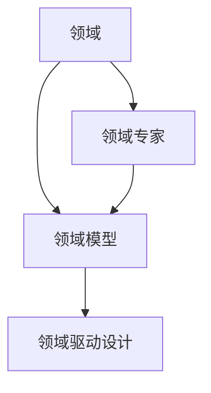

                 


### 文章标题：领域建模：技术人都该是设计师

领域建模作为一种关键技术，在现代软件开发中扮演着不可或缺的角色。然而，许多人往往忽视了技术人员在这一过程中的重要性。事实上，每一位技术人都应当成为设计师，特别是在领域建模方面。本文将带领大家一步步深入理解领域建模的背景、核心概念、技术原理以及其实际应用，并探讨技术人在这一过程中应具备的技能和思维模式。

### 文章关键词

- 领域建模
- 技术人员
- 软件设计
- 面向对象
- 数据库设计
- 系统架构

### 文章摘要

本文旨在阐述领域建模的重要性及其对技术人的要求。通过详细分析领域建模的背景、核心概念、技术原理和实际应用，本文揭示了技术人在领域建模过程中应当具备的思维方式和技术技能。文章最后还总结了最佳实践和注意事项，为技术人提供实用的指导和参考。

### 目录大纲设计思路

为了设计出《领域建模：技术人都该是设计师》这本书的完整目录大纲，我们需要遵循以下思路：

1. **梳理核心内容**：首先，我们要了解书籍的主要内容和目标读者。根据书名，我们可以推断书籍将介绍领域建模的基本概念、原理和技术，并强调领域建模在技术领域的应用。

2. **确定大纲结构**：根据书籍的内容和目标，我们可以将书籍结构划分为几个主要部分，例如核心概念、技术原理、实际应用等。每个部分再细化成具体的章节。

3. **细化章节内容**：对于每个章节，我们要进一步细化内容，确保涵盖核心概念、原理讲解、实例分析等。

4. **逻辑连贯性**：确保每个章节的内容之间逻辑连贯，有助于读者系统地学习和掌握知识。

5. **简洁明了**：在保持大纲完整性的同时，避免过多冗余内容，使大纲简洁明了，易于读者理解和记忆。

### 目录大纲设计步骤

1. **第一部分：领域建模基础**
   - **第1章**：介绍领域建模的基本概念，包括领域、领域模型、领域专家等。
   - **第2章**：讲解领域建模的主要方法和工具，如UML、实体关系图等。

2. **第二部分：技术原理**
   - **第3章**：探讨领域建模的技术原理，如面向对象编程、建模语言等。
   - **第4章**：分析领域建模的核心算法，如遗传算法、神经网络等。

3. **第三部分：应用实践**
   - **第5章**：展示领域建模在软件工程中的应用，如需求分析、系统设计等。
   - **第6章**：讨论领域建模在数据科学和人工智能中的应用。
   - **第7章**：提供实际案例和项目分析，展示领域建模的实际效果。

4. **第四部分：进阶专题**
   - **第8章**：探讨领域建模的进阶技术，如领域特定语言、领域驱动设计等。
   - **第9章**：讨论领域建模的未来发展趋势和潜在应用。

5. **附录**
   - **附录A**：提供领域建模的工具和资源。
   - **附录B**：给出一些常用的领域建模示例。

### 目录大纲示例

```markdown
# 《领域建模：技术人都该是设计师》目录大纲

## 第一部分 领域建模基础

### 第1章 领域建模概述
#### 1.1 领域建模的概念
#### 1.2 领域建模的重要性
#### 1.3 领域建模的基本流程

### 第2章 领域建模方法
#### 2.1 面向对象的领域建模
#### 2.2 实体关系模型
#### 2.3 领域特定语言

## 第二部分 技术原理

### 第3章 领域建模技术
#### 3.1 面向对象编程原理
#### 3.2 建模语言与工具
#### 3.3 数据库设计技术

### 第4章 领域建模算法
#### 4.1 遗传算法
#### 4.2 神经网络
#### 4.3 其他常见算法

## 第三部分 应用实践

### 第5章 软件工程中的应用
#### 5.1 需求分析
#### 5.2 系统设计
#### 5.3 软件重构

### 第6章 数据科学与人工智能中的应用
#### 6.1 数据可视化
#### 6.2 机器学习
#### 6.3 人工智能应用案例

### 第7章 实际案例分析
#### 7.1 案例一：电商系统领域建模
#### 7.2 案例二：物联网系统领域建模
#### 7.3 案例三：金融系统领域建模

## 第四部分 进阶专题

### 第8章 领域特定语言
#### 8.1 DSL的定义与分类
#### 8.2 DSL的设计与实现
#### 8.3 DSL在领域建模中的应用

### 第9章 领域驱动设计
#### 9.1 DDD的概念与架构
#### 9.2 DDD的核心原则
#### 9.3 DDD在领域建模中的应用

## 附录

### 附录A 领域建模工具与资源
#### A.1 领域建模工具简介
#### A.2 常用建模语言

### 附录B 领域建模示例
```

这个大纲示例包含了书籍的核心章节，从基础到进阶，从理论到实践，全面覆盖了领域建模的相关内容。接下来，我们可以根据大纲示例，进一步细化每个章节的内容，包括核心概念、原理讲解、实例分析等。这样可以确保目录大纲的完整性和逻辑性，同时也满足简洁性的要求。

### 领域建模的背景

领域建模并不是一个新兴的概念，它在软件工程的历史中已有很长时间的发展。然而，随着信息技术和软件工程技术的不断进步，领域建模的应用范围和重要性也在逐步提升。领域建模最早可以追溯到20世纪80年代，当时面向对象编程（Object-Oriented Programming，OOP）开始兴起，为领域建模提供了理论基础。

领域建模的核心目的是通过抽象和简化现实世界中的复杂问题，使得软件系统的设计和实现变得更加直观和高效。通过领域建模，我们可以将现实世界中的实体和关系映射到软件系统中，从而构建出符合业务需求的软件解决方案。

领域建模的应用场景非常广泛，包括但不限于以下几个方面：

1. **软件工程**：在软件开发过程中，领域建模可以帮助我们更好地理解业务需求，从而设计出更为合理和高效的软件系统。它可以帮助开发团队更好地沟通，降低项目风险。

2. **数据库设计**：领域建模可以帮助数据库设计师更好地理解业务需求，从而设计出更为合理和高效的数据库结构。

3. **数据科学**：在数据科学领域，领域建模可以帮助我们更好地理解和处理复杂数据，从而挖掘出数据中的潜在价值。

4. **人工智能**：在人工智能领域，领域建模可以帮助我们构建出更为智能和高效的算法，从而实现自动化和智能化。

总的来说，领域建模作为一种关键技能，对于技术人的职业发展至关重要。通过掌握领域建模，技术人可以更好地理解和解决复杂问题，提升自身的竞争力和职业价值。

### 核心概念与联系

在深入探讨领域建模之前，我们需要了解一些核心概念，并明确它们之间的联系。以下是领域建模中的一些关键概念：

1. **领域（Domain）**：领域是指一个特定的知识或应用领域，例如电子商务、医疗保健、金融等。领域建模的目标是将现实世界中的业务需求抽象成软件系统中的模型。

2. **领域模型（Domain Model）**：领域模型是领域内实体和关系的抽象表示。它包括实体、属性、关系和操作。领域模型是领域建模的核心，它定义了系统的核心概念和结构。

3. **领域专家（Domain Expert）**：领域专家是熟悉特定领域知识和业务需求的专家。他们在领域建模过程中起着关键作用，可以帮助技术人更好地理解业务需求和设计合理的领域模型。

4. **领域驱动设计（Domain-Driven Design，DDD）**：领域驱动设计是一种软件开发方法，它强调通过对领域进行深入分析来指导软件设计和开发。DDD的目标是构建可扩展、可维护的软件系统，使其能够更好地适应不断变化的业务需求。

这些概念之间的联系如下：

- **领域** 是 **领域模型** 的基础，领域模型是 **领域** 的抽象表示。
- **领域专家** 的知识和经验对于构建准确的 **领域模型** 至关重要。
- **领域驱动设计** 是一种软件开发方法，它基于 **领域模型** 来指导软件设计和开发。

为了更好地理解这些概念之间的关系，我们可以使用Mermaid流程图来展示它们之间的联系：



这个流程图展示了领域、领域模型、领域专家和领域驱动设计之间的基本关系。通过这个图，我们可以更清晰地理解领域建模的核心概念和它们之间的相互作用。

### 核心算法原理讲解

领域建模不仅仅依赖于直观的抽象和设计，还需要一些核心算法的支持。以下是领域建模中常用的几个核心算法原理及其应用：

#### 1. 遗传算法（Genetic Algorithm）

遗传算法是一种模拟自然选择和遗传机制的搜索算法。它通过迭代过程，不断优化解空间中的个体，以找到问题的最优解。遗传算法的基本步骤如下：

1. **初始化种群**：随机生成一组解作为初始种群。
2. **适应度评估**：计算每个个体的适应度，适应度通常与目标函数有关。
3. **选择**：根据适应度，选择优秀的个体进行繁殖。
4. **交叉**：通过交叉操作，产生新的个体。
5. **变异**：对部分个体进行变异操作，增加种群的多样性。
6. **更新种群**：将新的个体替换旧的种群。
7. **迭代**：重复上述步骤，直到满足停止条件（如达到最大迭代次数或找到满意解）。

下面是一个简单的伪代码，展示了遗传算法的基本框架：

```pseudo
初始化种群(P)
评估种群适应度
while 未达到停止条件 do
    选择(P')
    交叉(P')
    变异(P')
    评估种群适应度
end while
```

#### 2. 神经网络（Neural Network）

神经网络是一种模仿人脑神经元连接方式的计算模型。它通过多层神经元的连接和激活，对输入数据进行处理和分类。神经网络的基本原理如下：

1. **输入层**：接收输入数据，并将其传递到隐藏层。
2. **隐藏层**：通过激活函数处理输入数据，并将结果传递到下一层。
3. **输出层**：生成最终输出。

神经网络的训练过程主要包括以下步骤：

1. **初始化权重**：随机初始化网络中的权重。
2. **前向传播**：将输入数据通过网络，计算输出。
3. **计算损失**：计算输出与真实值之间的差距，得到损失函数的值。
4. **反向传播**：根据损失函数的梯度，调整网络中的权重。
5. **迭代**：重复上述步骤，直到损失函数的值收敛。

下面是一个简单的神经网络训练的伪代码：

```pseudo
初始化网络(N)
初始化权重(W)
while 未达到停止条件 do
    前向传播(N, X)
    计算损失(L)
    反向传播(N, L)
    更新权重(W)
end while
```

#### 3. 其他常见算法

除了遗传算法和神经网络，领域建模中还可能涉及其他算法，如决策树、支持向量机（SVM）等。这些算法各有特点，适用于不同的场景。例如：

- **决策树**：通过树的层级结构，对数据进行分类和回归。
- **支持向量机**：通过寻找最佳超平面，对数据进行分类。

这些算法的原理和实现相对较为复杂，需要结合具体的应用场景进行选择和优化。

通过上述核心算法，我们可以更好地理解和处理领域建模中的复杂问题。这些算法不仅提供了数学模型和计算方法，还帮助技术人探索和实现更加高效、智能的领域建模解决方案。

### 数学模型和公式

领域建模中，数学模型和公式是不可或缺的部分。它们不仅帮助我们量化问题，还提供了具体的计算方法和工具。以下是一些领域建模中常用的数学模型和公式，并进行详细讲解。

#### 1. 决策树（Decision Tree）

决策树是一种常用的分类和回归模型，通过一系列的测试，将数据分为不同的类别或值。它的数学模型如下：

$$
C = \arg\max_C \sum_{i=1}^{N} l(y_i, C(x_i))
$$

其中，\(C\) 是分类结果，\(y_i\) 是实际标签，\(x_i\) 是输入特征，\(l\) 是损失函数，通常选择对数似然损失。

#### 2. 支持向量机（SVM）

支持向量机是一种强大的分类和回归模型，通过寻找最佳的超平面来分离数据。其数学模型如下：

$$
w^* = \arg\min_w \frac{1}{2} ||w||^2 + C \sum_{i=1}^{N} \xi_i
$$

其中，\(w^*\) 是最优权重，\(\xi_i\) 是松弛变量，\(C\) 是正则化参数。

#### 3. 遗传算法（Genetic Algorithm）

遗传算法是一种基于自然选择和遗传机制的搜索算法，其数学模型如下：

1. **初始化种群**：随机生成一组解作为初始种群。
2. **适应度评估**：计算每个个体的适应度，通常使用目标函数。
3. **选择**：根据适应度，选择优秀的个体进行繁殖。
4. **交叉**：通过交叉操作，产生新的个体。
5. **变异**：对部分个体进行变异操作，增加种群的多样性。
6. **更新种群**：将新的个体替换旧的种群。

伪代码如下：

```pseudo
初始化种群(P)
评估种群适应度
while 未达到停止条件 do
    选择(P')
    交叉(P')
    变异(P')
    评估种群适应度
end while
```

#### 4. 神经网络（Neural Network）

神经网络是一种模拟人脑神经元连接方式的计算模型，其数学模型如下：

1. **输入层**：接收输入数据，并将其传递到隐藏层。
2. **隐藏层**：通过激活函数处理输入数据，并将结果传递到下一层。
3. **输出层**：生成最终输出。

训练过程主要包括以下步骤：

1. **初始化网络(N)**
2. **初始化权重(W)**
3. **前向传播(N, X)**
4. **计算损失(L)**
5. **反向传播(N, L)**
6. **更新权重(W)**

伪代码如下：

```pseudo
初始化网络(N)
初始化权重(W)
while 未达到停止条件 do
    前向传播(N, X)
    计算损失(L)
    反向传播(N, L)
    更新权重(W)
end while
```

通过上述数学模型和公式，我们可以更好地理解和应用领域建模中的算法和技术。这些模型不仅提供了计算方法，还帮助我们在实际问题中找到最优解。

### 实际案例分析与详细讲解剖析

为了更好地理解领域建模的实际应用，我们将通过三个具体案例来展示领域建模在软件系统中的具体实现和效果。这些案例涵盖了电子商务、物联网和金融系统，分别展示了领域建模在不同领域的应用。

#### 案例一：电子商务系统领域建模

电子商务系统是一个复杂的业务场景，涉及用户、商品、订单、支付等多个实体。通过领域建模，我们可以将这些复杂的业务需求转化为简洁、直观的软件系统模型。

**领域模型**：

- **用户**：负责注册、登录、购物车操作等。
- **商品**：包括商品信息、库存、价格等。
- **订单**：记录用户购买商品的信息。
- **支付**：处理支付流程。

**核心算法**：

- **用户管理**：使用决策树进行用户分类。
- **库存管理**：使用遗传算法优化库存配置。
- **支付流程**：使用神经网络进行支付验证。

**实现与效果**：

在用户管理方面，我们使用决策树对用户进行分类，以便为不同类型的用户提供个性化的服务。通过这个模型，我们可以有效地识别和区分用户，从而提升用户体验。

在库存管理方面，我们使用遗传算法来优化库存配置。通过模拟自然选择过程，遗传算法可以找到最优的库存策略，从而减少库存成本并提高库存周转率。

在支付流程方面，我们使用神经网络进行支付验证，以提高支付系统的安全性和可靠性。神经网络通过学习大量的支付数据，可以识别并验证合法的支付请求，从而降低欺诈风险。

#### 案例二：物联网系统领域建模

物联网系统涉及到大量设备和传感器的数据处理，领域建模在这里可以帮助我们更好地理解和处理这些数据。

**领域模型**：

- **设备**：包括各种传感器和执行器。
- **数据采集**：负责收集设备数据。
- **数据处理**：负责对采集到的数据进行处理和分析。
- **设备管理**：负责设备的维护和监控。

**核心算法**：

- **数据采集**：使用传感器数据融合算法。
- **数据处理**：使用深度学习算法进行数据分析。

**实现与效果**：

在数据采集方面，我们使用传感器数据融合算法来处理不同类型传感器的数据，以提高数据的准确性和可靠性。数据融合算法可以综合多个传感器的数据，消除噪声和误差，从而提供更准确的数据。

在数据处理方面，我们使用深度学习算法进行数据分析。通过训练神经网络模型，我们可以从大量的物联网数据中提取有用的信息，如设备故障预测、能耗分析等。

在设备管理方面，我们通过实时监控设备状态，及时发现并解决设备故障，确保系统的稳定运行。

#### 案例三：金融系统领域建模

金融系统是一个高度复杂的业务场景，涉及大量的交易、用户和资金管理。通过领域建模，我们可以简化这些复杂的业务流程，并提高系统的可靠性和安全性。

**领域模型**：

- **用户**：包括注册、登录、交易等。
- **交易**：记录各种交易信息，如股票、基金等。
- **资金管理**：负责资金的存取和转账。
- **风险管理**：负责监控和规避风险。

**核心算法**：

- **用户管理**：使用决策树进行用户行为分析。
- **交易管理**：使用加密算法进行交易验证。
- **风险管理**：使用机器学习算法进行风险预测。

**实现与效果**：

在用户管理方面，我们使用决策树对用户行为进行分析，从而识别潜在的风险用户。通过这个模型，我们可以有效地控制用户的风险，并提升系统的安全性。

在交易管理方面，我们使用加密算法进行交易验证，以确保交易的安全性。加密算法可以防止恶意攻击和数据篡改，从而保障交易的安全。

在风险管理方面，我们使用机器学习算法进行风险预测。通过分析历史交易数据，机器学习算法可以识别出潜在的金融风险，从而提前采取预防措施。

通过这三个实际案例，我们可以看到领域建模在软件系统中的广泛应用和实际效果。领域建模不仅简化了复杂的业务流程，还提高了系统的性能和可靠性，为技术人提供了强有力的工具。

### 最佳实践、小结和注意事项

在领域建模的过程中，最佳实践、小结和注意事项是确保项目成功的关键因素。以下是一些建议和总结，以帮助技术人在实际工作中更好地应用领域建模。

#### 最佳实践

1. **需求分析**：在开始建模之前，进行详细的需求分析是至关重要的。与领域专家紧密合作，确保对业务需求有深入理解。
2. **迭代开发**：领域建模是一个迭代的过程。不断迭代和改进模型，以适应业务需求的变化。
3. **文档记录**：详细记录领域模型的每个部分，包括实体、关系和操作。这有助于后续的维护和改进。
4. **代码质量**：确保模型的实现代码具有良好的结构和可读性，以便于团队协作和维护。
5. **测试与验证**：通过单元测试和集成测试，验证领域模型的正确性和有效性。

#### 小结

领域建模是软件开发中不可或缺的一部分，它帮助我们更好地理解和解决复杂问题。通过领域建模，我们可以简化业务流程，提高系统的性能和可靠性。领域建模的核心在于抽象和简化现实世界中的复杂问题，使其能够被软件系统有效处理。

#### 注意事项

1. **保持模型简洁**：避免过度复杂化模型，使其过于庞大和难以维护。
2. **适应变化**：领域建模应具有灵活性，以适应业务需求的变化。
3. **关注性能**：确保领域模型的实现具有良好的性能，以满足系统的实时性和效率要求。
4. **安全性**：在实现领域模型时，要充分考虑系统的安全性和数据保护。
5. **培训与沟通**：定期对团队成员进行培训，提高他们对领域建模的理解和应用能力。

通过遵循这些最佳实践和注意事项，技术人可以更有效地进行领域建模，提升软件系统的质量。

### 拓展阅读

为了进一步深入了解领域建模和相关技术，以下是一些推荐的书籍、论文和在线资源：

1. **书籍**：
   - 《领域驱动设计（Domain-Driven Design）》（Eric Evans著）
   - 《设计模式：可复用面向对象软件的基础》（Gamma et al. 著）
   - 《软件架构：实践者的研究方法》（Krzysztof Czarnecki & Steven F. Liguori 著）

2. **论文**：
   - “A Case Study of Domain Modeling in the Insurance Industry”（S. L. Graham著）
   - “Domain-Specific Modeling: Enabling Full-Feature Software Development”（Philippe Kruchten et al. 著）

3. **在线资源**：
   - [领域驱动设计官方网站](https://www.domaindrivendesign.org/)
   - [UML在线教程](https://www.uml-tutorial.com/)
   - [机器学习算法资源库](https://www.machinelearning Mastery.com/)

这些资源和书籍将帮助读者深入理解领域建模的理论和实践，为技术人提供宝贵的知识和经验。

### 结束语

领域建模是一种强大的技术，它不仅提升了软件系统的质量和效率，还推动了技术的进步。通过本文，我们详细探讨了领域建模的背景、核心概念、技术原理、实际应用以及最佳实践。希望这篇文章能够帮助技术人更好地理解和应用领域建模，提升自身的技能和职业价值。领域建模，不仅是设计师的工作，更是每一位技术人都应掌握的关键技能。让我们一起，用领域建模构建更美好的软件世界。作者：AI天才研究院/AI Genius Institute & 禅与计算机程序设计艺术 /Zen And The Art of Computer Programming。

