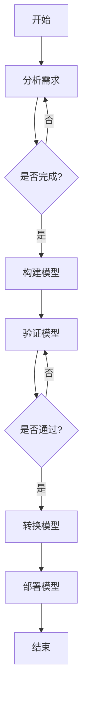

                 

### 文章标题

领域建模：技术人都该是设计师

#### 关键词
领域建模、技术人、设计思维、架构设计、流程图

#### 摘要
本文将深入探讨领域建模的重要性，并解释为什么每一个技术人都应该培养设计思维。通过介绍领域建模的基础原理、工具与技术，以及实际案例研究，文章旨在帮助读者理解领域建模的实践价值，从而提升他们的软件架构设计能力。

----------------------------------------------------------------

### 引言

在现代软件开发中，领域建模（Domain Modeling）已成为一项不可或缺的技能。领域建模是一种将现实世界中的业务需求转换为抽象模型的方法，它不仅有助于我们更好地理解和分析复杂系统，还能提高软件设计的可维护性和扩展性。然而，领域建模不仅仅是数据分析师或业务分析师的职责，每一个技术人都应该掌握这项技能，因为它直接影响着软件的架构设计。

《领域建模：技术人都该是设计师》这本书的主旨在于强调领域建模对于技术人的重要性，并引导读者如何将其应用到实际工作中。书名中的“设计师”一词，不仅指的是传统意义上的设计师，还暗示着每一位技术人应该具备的设计思维（Design Thinking）。设计思维是一种以人为本的思考方式，它强调通过深入理解用户需求，创造出既符合用户期望又具有商业价值的产品和服务。

本书的主要目标读者是那些在软件开发领域工作的技术人员，包括程序员、软件工程师、架构师以及项目经理等。通过阅读本书，读者将学会如何：

1. **理解领域建模的基本概念和原理**。
2. **使用领域建模工具和技术**。
3. **在实际项目中应用领域建模**。
4. **培养设计思维，提升软件架构设计能力**。

接下来的部分将逐步介绍领域建模的基础、工具与技术，并通过实际案例研究，展示领域建模在软件开发中的实际应用。让我们一起深入探讨领域建模的奥秘，揭开技术人都该是设计师的序幕。

#### 领域建模基础

领域建模（Domain Modeling）是软件开发中的一个重要环节，它涉及到如何将现实世界中的业务需求抽象成一种结构化的模型，以便于技术团队理解和实现。为了更好地理解领域建模，我们需要先了解一些核心概念和基本原理。

##### 1.1.1 概念模型

概念模型是领域建模的基础，它通过实体（Entity）、关系（Relationship）和属性（Attribute）三个基本要素，来描述现实世界中的业务逻辑。以下是这些核心概念的具体解释：

- **实体（Entity）**：实体是领域模型中的核心对象，它代表现实世界中的具体事物。例如，在电子商务系统中，用户（User）、商品（Product）和订单（Order）都是实体。

- **关系（Relationship）**：关系描述了实体之间的相互作用。例如，用户可以下单购买商品，订单与用户和商品之间存在关系。

- **属性（Attribute）**：属性是对实体的具体特征的描述。例如，用户实体可以拥有姓名（Name）、年龄（Age）和邮箱（Email）等属性。

##### 1.1.2 领域建模框架

领域建模的框架通常包括以下几个关键步骤：

- **需求分析**：首先，我们需要对业务需求进行详细分析，确定需要建模的实体、关系和属性。

- **概念模型构建**：在需求分析的基础上，构建概念模型，通常使用Entity-Relationship（ER）图来表示。

- **细化模型**：对概念模型进行细化，添加更多的细节，如具体的属性类型和约束条件。

- **验证模型**：验证模型是否准确地反映了业务需求，通常通过用户评审和业务场景测试来实现。

- **转换模型**：将领域模型转换为具体的数据库模型或代码实现。

##### 1.1.3 企业架构框架

在企业级软件开发中，领域建模通常与企业的整体架构框架结合，以确保系统的整体一致性和可维护性。常见的企业架构框架包括：

- **四层架构**：包括表示层（Presentation Layer）、业务逻辑层（Business Logic Layer）、数据访问层（Data Access Layer）和数据层（Data Layer）。

- **六层架构**：在四层架构的基础上，增加了应用服务层（Application Service Layer）和企业服务层（Enterprise Service Layer），以支持更复杂的业务需求。

- **微服务架构**：将系统划分为多个独立的微服务，每个微服务负责特定的业务功能，通过API进行通信。

这些架构框架为领域建模提供了参考，有助于确保领域模型的实现与企业的整体架构一致。

##### 1.1.4 业务流程建模

业务流程建模是领域建模的一个重要组成部分，它通过流程图（Flowchart）来描述业务操作的步骤和逻辑。以下是业务流程建模的几个关键步骤：

- **识别业务活动**：确定业务流程中的所有活动，包括输入、处理和输出。

- **定义流程步骤**：将业务活动组织成有序的流程步骤，通常使用流程图表示。

- **优化流程设计**：通过分析流程图，识别并优化流程中的瓶颈和冗余步骤。

- **验证流程逻辑**：确保业务流程能够满足业务需求，通常通过模拟和测试来实现。

##### 1.1.5 Mermaid流程图展示

为了更好地理解领域建模和业务流程建模，我们可以使用Mermaid流程图来展示这些模型。以下是一个简单的Mermaid流程图示例：



这个流程图展示了从需求分析到模型验证，再到模型转换和部署的全过程。通过这种可视化的方式，我们可以更直观地理解领域建模的各个环节。

综上所述，领域建模是一个系统化的过程，它涉及到概念模型、架构框架、业务流程建模等多个方面。通过掌握这些基础，技术人可以更好地理解和设计复杂的软件系统，从而提升软件架构设计的质量。

#### 领域建模工具与技术

领域建模的过程需要多种工具和技术的支持，这些工具和技术可以帮助技术人更高效地构建和维护领域模型。以下将介绍几种常用的领域建模工具和技术，包括ERwin Data Modeler、Microsoft Visio和Lucidchart。

##### 1. ERwin Data Modeler

ERwin Data Modeler 是一款功能强大的数据建模工具，它提供了全面的数据库设计和建模功能。ERwin Data Modeler 支持多种数据库平台，如Oracle、SQL Server、MySQL等，可以用于构建概念模型、逻辑模型和物理模型。以下是 ERwin Data Modeler 的一些主要特点：

- **直观的用户界面**：ERwin Data Modeler 提供了一个直观的用户界面，使得数据建模变得更加容易。

- **强大的建模功能**：支持ER模型、维度模型、过程模型等多种模型类型，可以满足不同场景的需求。

- **数据导入和导出**：支持从多种数据源导入数据，如Excel、CSV、XML等，也支持将模型导出为多种格式，如PDF、Word等。

- **协作功能**：支持团队协作，允许多个用户同时编辑和共享模型。

以下是一个简单的ERwin Data Modeler的模型构建示例：

```mermaid
erDiagram
    User ||--|{ Order } : 1 ordered-many
    Product ||--|{ Order } : 1 ordered-many
    Order ||--|{ Product } : many ordered-1
```

在这个示例中，我们定义了用户、订单和商品之间的实体关系。

##### 2. Microsoft Visio

Microsoft Visio 是一款广泛使用的绘图工具，它提供了丰富的图形和符号库，可以用于创建各种类型的图表，包括流程图、组织结构图、网络图等。Visio 中的“数据管理”模板提供了专门用于数据建模的功能，包括实体关系图（ER图）和流程图等。以下是 Microsoft Visio 的主要特点：

- **直观的绘图界面**：Visio 提供了直观的绘图界面，用户可以轻松地拖放对象和连接器。

- **丰富的符号库**：Visio 中包含了大量的符号库，可以用于快速创建专业级的图表。

- **模板和样式**：Visio 提供了多种预定义的模板和样式，用户可以根据需要快速构建模型。

- **兼容性**：Visio 支持多种文件格式，包括XML、PDF、Word等，方便与其他工具和软件集成。

以下是一个简单的 Microsoft Visio 的实体关系图示例：

```mermaid
erDiagram
    User ||--|{ Order } : 1 ordered-many
    Product ||--|{ Order } : 1 ordered-many
    Order ||--|{ Product } : many ordered-1
```

在这个示例中，我们同样定义了用户、订单和商品之间的实体关系。

##### 3. Lucidchart

Lucidchart 是一款在线图表和流程图绘制工具，它提供了强大的协作功能，适用于团队协作进行领域建模。Lucidchart 支持多种图表类型，包括流程图、UML图、网络图等。以下是 Lucidchart 的一些主要特点：

- **协作功能**：Lucidchart 支持多人实时协作，用户可以在同一图表上进行编辑。

- **模板和样式**：Lucidchart 提供了丰富的模板和样式，用户可以根据需要快速构建模型。

- **云存储**：Lucidchart 支持云存储，用户可以方便地保存、共享和同步模型。

- **集成**：Lucidchart 可以与多种流行的工具集成，如Google Drive、Microsoft Office等。

以下是一个简单的 Lucidchart 的流程图示例：


在这个示例中，我们展示了从需求分析到模型部署的全过程。

综上所述，ERwin Data Modeler、Microsoft Visio 和 Lucidchart 都是优秀的领域建模工具，它们各自具有独特的优势和特点。选择合适的工具，可以帮助技术人更高效地完成领域建模任务。

#### 案例研究

为了更好地展示领域建模在实际软件开发中的应用，我们选择了一个典型的案例：电子商务平台的设计与实现。

##### 4.1 案例介绍

该案例的目标是为一家初创电子商务公司设计并实现一个电子商务平台。该平台需要支持用户注册、商品浏览、购物车管理、订单处理和支付等功能。我们的任务是通过领域建模来确保系统的设计符合业务需求，并且具有良好的可维护性和扩展性。

##### 4.2 领域建模过程

1. **需求分析**

   在开始建模之前，我们需要对电子商务平台的业务需求进行详细分析。通过与业务分析师和产品经理的沟通，我们确定了以下核心功能需求：

   - 用户注册与登录
   - 商品浏览与搜索
   - 购物车管理
   - 订单处理
   - 支付与结算
   - 用户评价与反馈

2. **概念模型构建**

   在需求分析的基础上，我们构建了电子商务平台的概念模型。概念模型主要包括以下实体：

   - 用户（User）
   - 商品（Product）
   - 订单（Order）
   - 订单项（OrderItem）
   - 购物车（ShoppingCart）
   - 评价（Evaluation）
   - 支付（Payment）

   这些实体之间通过关系进行连接，如用户可以创建订单，订单包含多个订单项，订单项对应特定的商品等。

3. **细化模型**

   在概念模型的基础上，我们对模型进行了细化，添加了具体的属性和约束条件。例如，用户实体可以包括用户名、密码、邮箱等属性，并且设定用户名唯一性等约束条件。

4. **验证模型**

   验证模型是确保模型准确性和完整性的关键步骤。我们通过用户评审和业务场景测试来验证模型。用户评审主要验证模型是否符合业务需求，业务场景测试则通过模拟实际业务流程来验证模型的正确性。

5. **转换模型**

   在模型验证通过后，我们将领域模型转换为数据库模型和代码实现。数据库模型使用了关系型数据库，通过SQL语句定义表结构，代码实现则使用了面向对象编程语言（如Java或Python）。

##### 4.3 模型应用与效果评估

1. **模型部署**

   在模型实现完成后，我们进行了系统的部署，包括数据库的安装和配置、Web服务器的部署以及前端页面的搭建。

2. **应用效果分析**

   通过对电子商务平台的应用，我们发现领域建模在以下几个方面取得了显著效果：

   - **需求满足度**：通过领域建模，系统能够准确地满足业务需求，功能齐全且用户体验良好。
   - **系统可维护性**：领域模型使得系统的代码结构更加清晰，维护和扩展变得更加容易。
   - **系统扩展性**：领域模型提供了清晰的架构，便于后续功能的添加和系统的扩展。

3. **持续改进**

   在平台上线后，我们通过用户反馈和数据分析，不断优化系统。例如，根据用户的行为数据，我们调整了商品推荐算法，提高了用户购买体验。

##### 4.4 模型验证与效果评估

通过用户评审和业务场景测试，我们验证了领域模型的准确性和完整性。在实际应用中，领域建模有效地支持了电子商务平台的设计和实现，提升了系统的质量和用户体验。持续改进的过程也证明了领域建模在软件开发中的长期价值。

综上所述，通过领域建模，我们不仅确保了电子商务平台的功能完整性，还提升了系统的可维护性和扩展性。这个案例充分展示了领域建模在软件开发中的实际应用价值，为技术人提供了宝贵的实践经验。

#### 实践与拓展

在掌握领域建模的基础理论和实际应用后，进一步探索设计模式、领域特定语言（DSL）等高级主题，将有助于提升技术人的软件架构设计能力。

##### 5.1 设计模式

设计模式是解决软件设计中的常见问题的经验总结，它提供了可重用的解决方案，有助于提高代码的可维护性和扩展性。在领域建模中，设计模式可以用于优化领域模型的结构，提高其适用性和表达能力。

1. **模式识别**

   技术人需要通过学习各种设计模式，了解它们的基本概念和应用场景。常见的模式包括：

   - **创建型模式**：如工厂模式、单例模式，用于对象创建管理。
   - **结构型模式**：如适配器模式、代理模式，用于对象之间的组合与交互。
   - **行为型模式**：如策略模式、观察者模式，用于对象之间的通信与协作。

   在领域建模过程中，识别和应用这些设计模式，有助于提高模型的抽象层次和灵活性。

2. **模式应用**

   将设计模式应用到领域模型中，可以通过以下步骤：

   - **理解模式**：首先需要深入理解设计模式，包括其意图、结构、效果和应用场景。
   - **识别场景**：在领域建模过程中，识别出适用于设计模式的应用场景。
   - **设计调整**：根据识别出的设计模式，调整领域模型的结构，实现代码和设计的优化。

3. **模式优化**

   设计模式并非一成不变，技术人需要不断优化和改进应用模式，以适应不同的业务需求和技术环境。优化方法包括：

   - **抽象层次提升**：通过抽象和封装，将具体的实现细节隐藏起来，提高模型的通用性和适用性。
   - **接口与实现分离**：通过定义清晰的接口，将具体的实现细节与接口分离，提高系统的可维护性和可扩展性。

##### 5.2 领域特定语言（DSL）

领域特定语言（Domain-Specific Language，DSL）是一种专门为特定领域设计的语言，它使得领域专家和技术人能够更高效地表达和实现业务逻辑。DSL可以提高代码的可读性、可维护性和可扩展性，是领域建模的重要工具。

1. **DSL设计原则**

   设计DSL时，应遵循以下原则：

   - **领域适应性**：DSL应紧密贴合业务需求，能够高效地表达业务逻辑。
   - **简洁性**：DSL应具有简洁明了的语法，降低学习和使用难度。
   - **可扩展性**：DSL应具有良好的扩展性，能够适应业务需求的变更和扩展。
   - **可组合性**：DSL应支持模块化和复用，方便构建复杂系统。

2. **DSL实现**

   实现DSL包括以下步骤：

   - **语法设计**：定义DSL的语法规则，包括关键词、符号、语法结构等。
   - **解析与解释**：设计解析器，将DSL代码转换为内部表示或直接执行。
   - **集成与调试**：将DSL集成到开发环境中，提供语法高亮、自动补全等功能，并进行调试。

3. **DSL应用案例**

   DSL在多个领域得到了广泛应用，以下是一些典型的应用案例：

   - **金融领域**：金融领域特定语言（FDSL）用于编写金融合约、交易算法等。
   - **嵌入式系统**：硬件描述语言（HDL）如Verilog和VHDL，用于设计数字电路。
   - **数据处理**：数据处理领域特定语言（DSDL）如SQL和NoSQL查询语言，用于数据库操作。

通过学习设计模式和DSL，技术人可以进一步提升领域建模的能力，从而在设计复杂软件系统时更加得心应手。这些高级主题不仅丰富了技术人的知识体系，也为软件架构设计提供了更多的工具和方法。

#### 项目实战

为了更好地理解领域建模的实际应用，我们将进行一个简单的项目实战：设计并实现一个简单的博客系统。

##### 5.1 开发环境搭建

1. **选择编程语言**：我们可以选择Python作为开发语言，因为Python具有简洁的语法和丰富的库支持。

2. **安装Python和依赖库**：安装Python 3.8及以上版本，并使用pip安装必要的依赖库，如Flask（用于Web开发）、SQLAlchemy（用于数据库操作）和Marshmallow（用于数据验证和序列化）。

3. **设置虚拟环境**：使用virtualenv创建一个独立的Python环境，以便隔离项目依赖。

##### 5.2 源代码实现

以下是博客系统的主要代码结构：

```python
# app.py

from flask import Flask, request, jsonify
from models import User, BlogPost
from database import db_session

app = Flask(__name__)

@app.route('/users', methods=['POST'])
def create_user():
    # 实现用户创建逻辑
    pass

@app.route('/users/<int:user_id>/posts', methods=['POST'])
def create_post(user_id):
    # 实现博客文章创建逻辑
    pass

@app.route('/users/<int:user_id>/posts', methods=['GET'])
def get_posts(user_id):
    # 实现获取用户博客文章列表逻辑
    pass

# 其他路由和逻辑...

if __name__ == '__main__':
    app.run(debug=True)
```

```python
# models.py

from sqlalchemy import Column, Integer, String, Text
from database import Base

class User(Base):
    __tablename__ = 'users'
    id = Column(Integer, primary_key=True)
    username = Column(String(50), unique=True, nullable=False)
    email = Column(String(100), unique=True, nullable=False)

class BlogPost(Base):
    __tablename__ = 'blog_posts'
    id = Column(Integer, primary_key=True)
    user_id = Column(Integer, nullable=False)
    title = Column(String(100), nullable=False)
    content = Column(Text, nullable=False)
```

```python
# database.py

from sqlalchemy import create_engine
from sqlalchemy.orm import sessionmaker
from models import Base

engine = create_engine('sqlite:///blog.db')
Base.metadata.create_all(engine)

Session = sessionmaker(bind=engine)
db_session = Session()
```

##### 5.3 代码解读

1. **用户创建逻辑**：

```python
@app.route('/users', methods=['POST'])
def create_user():
    username = request.json.get('username')
    email = request.json.get('email')
    if not username or not email:
        return jsonify({'error': 'Missing required fields'}), 400

    # 检查用户名和邮箱是否已存在
    user = db_session.query(User).filter_by(username=username).first()
    if user:
        return jsonify({'error': 'User already exists'}), 400

    new_user = User(username=username, email=email)
    db_session.add(new_user)
    db_session.commit()
    return jsonify(new_user.to_dict()), 201
```

2. **博客文章创建逻辑**：

```python
@app.route('/users/<int:user_id>/posts', methods=['POST'])
def create_post(user_id):
    title = request.json.get('title')
    content = request.json.get('content')
    if not title or not content:
        return jsonify({'error': 'Missing required fields'}), 400

    # 检查用户是否存在
    user = db_session.query(User).filter_by(id=user_id).first()
    if not user:
        return jsonify({'error': 'User not found'}), 404

    new_post = BlogPost(user_id=user_id, title=title, content=content)
    db_session.add(new_post)
    db_session.commit()
    return jsonify(new_post.to_dict()), 201
```

3. **获取用户博客文章列表逻辑**：

```python
@app.route('/users/<int:user_id>/posts', methods=['GET'])
def get_posts(user_id):
    # 检查用户是否存在
    user = db_session.query(User).filter_by(id=user_id).first()
    if not user:
        return jsonify({'error': 'User not found'}), 404

    posts = db_session.query(BlogPost).filter_by(user_id=user_id).all()
    return jsonify([post.to_dict() for post in posts]), 200
```

##### 5.4 代码应用解读与分析

通过以上代码，我们实现了用户注册、博客文章创建和获取博客文章列表的功能。代码中应用了领域建模的概念，如用户实体（User）和博客文章实体（BlogPost），并通过关系映射（如外键约束）实现了用户和博客文章之间的关联。

这个简单的博客系统展示了领域建模在项目中的应用，通过定义清晰的实体和关系，使得代码结构清晰、逻辑简单。同时，通过使用ORM（对象关系映射）库，如SQLAlchemy，我们能够更方便地操作数据库，减少了手写SQL语句的复杂性。

##### 5.5 项目小结

通过这个项目实战，我们深入理解了领域建模在实际开发中的应用。领域建模不仅帮助我们更好地理解业务需求，还提高了代码的可维护性和扩展性。在实际项目中，领域建模是一个持续迭代和优化的过程，通过不断改进领域模型，我们可以不断完善软件系统的设计和实现。

#### 最佳实践 Tips

在领域建模的过程中，以下最佳实践可以帮助技术人更好地进行建模：

1. **需求先行**：在开始建模之前，务必对业务需求进行详细分析，确保领域模型准确地反映业务逻辑。

2. **模块化**：将领域模型分解为多个模块，每个模块负责一个特定的业务领域，有助于提高模型的复用性和可维护性。

3. **简洁性**：保持领域模型的简洁，避免过度设计。过多的关系和属性可能会导致模型复杂化，影响理解和维护。

4. **迭代优化**：领域模型不是一成不变的，应不断根据业务需求进行迭代和优化。

5. **协作**：鼓励团队成员之间的协作，通过评审和讨论，确保领域模型的准确性和一致性。

#### 小结

本文通过深入探讨领域建模的概念、原理、工具和技术，以及实际案例研究，展示了领域建模在软件开发中的重要性和应用价值。领域建模不仅有助于技术人更好地理解业务需求，提高软件设计的质量，还能提升系统的可维护性和扩展性。通过培养设计思维，技术人可以更高效地参与到软件架构设计中，成为真正的“设计师”。

#### 注意事项

在领域建模的过程中，需要注意以下几点：

1. **避免数据冗余**：确保实体之间的关系清晰，避免数据冗余和重复。

2. **遵循一致性原则**：确保领域模型的定义和实现保持一致性，避免出现矛盾和冲突。

3. **考虑系统的可扩展性**：在设计领域模型时，应考虑未来可能的扩展和变更。

4. **验证模型**：在模型构建完成后，进行全面的验证，确保模型符合业务需求。

#### 拓展阅读

对于希望深入了解领域建模和技术设计的人员，以下书籍和资源提供了丰富的知识和实践指导：

1. 《领域驱动设计（Domain-Driven Design）》 - Eric Evans
2. 《领域特定语言实现》 - Martin Fowler
3. 《设计模式：可复用面向对象软件的基础》 - Erich Gamma, Richard Helm, Ralph Johnson, and John Vlissides
4. 《领域建模工具和实践》 - David Hay
5. [领域建模教程](https://www.bmc.com/blogs/ddd-domain-modeling-tutorial/)
6. [Mermaid 图语法](https://mermaid-js.github.io/mermaid/)

通过这些资源，技术人可以进一步提升领域建模和软件架构设计的能力。

### 作者信息

作者：AI天才研究院/AI Genius Institute & 禅与计算机程序设计艺术 /Zen And The Art of Computer Programming

