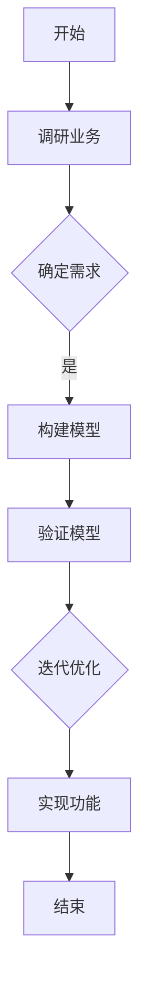

                 

### 文章标题

《领域建模：技术人都该是设计师》

---

### 关键词

领域建模、技术人转型、设计师思维、实践案例、数学模型

---

### 摘要

在数字化转型的浪潮下，技术人员不仅需要掌握编程技能，更需要具备领域建模的能力。本文旨在探讨领域建模在信息技术领域的应用，以及技术人员如何从程序员转型为设计师。通过详细解析领域建模的基础概念、原理、方法，并结合实际案例，本文将帮助读者理解领域建模的核心价值和实践技巧。

---

## 第一部分：领域建模基础

### 第1章：领域建模概述

在信息化时代，领域建模已经成为软件开发和系统设计的关键环节。领域建模的目的是为了更准确地理解和表达业务领域中的概念、关系和规则。本章将介绍领域建模的定义、重要性以及关键概念，帮助读者建立对领域建模的基本认识。

---

#### 1.1 领域建模的定义

领域建模是一种抽象化的过程，它通过对业务领域的深入理解，将复杂的现实世界转化为易于管理和操作的信息模型。领域建模不仅仅是一种技术活动，更是一种业务与技术的融合，它使得技术人员能够更直观地理解和应对业务需求。

---

#### 1.2 领域建模的重要性

领域建模的重要性体现在多个方面。首先，它有助于提高软件的可维护性和可扩展性，使得后续的软件开发和维护更加高效。其次，领域建模能够促进业务和技术团队之间的沟通，减少误解和冲突。最后，领域建模有助于发现和解决业务流程中的潜在问题，提升业务流程的效率。

---

#### 1.3 领域建模的关键概念

领域建模涉及多个关键概念，包括实体、属性、关系、规则等。实体是领域模型中的基本单位，代表业务中的具体对象，如客户、订单等。属性是实体的特征，如客户的姓名、地址等。关系描述了实体之间的交互和依赖，如客户与订单之间的关系。规则则定义了实体之间的行为约束，如订单创建后必须关联到客户。

---

## 第2章：领域建模的原理与架构

在理解了领域建模的基本概念后，我们需要深入探讨其原理和架构。本章将介绍领域建模的原理，以及如何使用Mermaid流程图来描述领域模型的架构。

---

#### 2.1 领域建模的原理

领域建模的原理主要包括三个核心步骤：理解业务、抽象模型、验证和迭代。

- **理解业务**：深入调研和分析业务领域，了解业务规则、流程和需求。
- **抽象模型**：将业务需求抽象为信息模型，使用实体、属性、关系和规则等概念来表达。
- **验证和迭代**：对模型进行验证，确保其符合业务需求，并根据反馈进行迭代优化。

---

#### 2.2 领域建模的架构

领域建模的架构可以分为三个层次：概念层、逻辑层和物理层。

- **概念层**：定义领域中的核心概念和关系，是领域模型的基础。
- **逻辑层**：将概念层的模型转化为逻辑模型，包括实体、属性、关系和规则等。
- **物理层**：将逻辑模型转化为具体的数据库和应用程序，实现领域模型的具体功能。

---

#### 2.3 领域建模的Mermaid流程图

使用Mermaid流程图可以直观地展示领域模型的架构和流程。以下是一个简单的Mermaid流程图示例：



---

## 第3章：领域建模工具与方法

领域建模需要使用到多种工具和方法，本章将介绍常用的领域建模工具和方法，包括ER图、UML图、BPEL流程图等。

---

#### 3.1 领域建模工具简介

- **ER图（Entity-Relationship Diagram）**：用于描述实体和关系，是最常用的领域建模工具之一。
- **UML图（Unified Modeling Language）**：用于描述系统的各个方面，包括结构、行为和交互等。
- **BPEL流程图（Business Process Execution Language）**：用于描述业务流程和工作流。

---

#### 3.2 常用领域建模方法

- **自上而下方法**：从整体业务流程出发，逐步细化到具体业务需求。
- **自下而上方法**：从具体业务需求出发，逐步构建整体业务流程。
- **迭代方法**：通过多次迭代，逐步完善领域模型。

---

#### 3.3 领域建模工具的使用

在实际应用中，选择合适的领域建模工具和方法至关重要。以下是一些使用领域建模工具的技巧：

- **选择合适的工具**：根据业务需求和团队熟悉程度选择合适的建模工具。
- **制定规范**：建立统一的建模规范，确保团队之间的协作和沟通。
- **持续迭代**：领域建模不是一次性的工作，需要持续迭代和优化。

---

## 第二部分：技术人转型设计师

### 第4章：技术人的角色转变

随着数字化转型的推进，技术人员的角色也在不断变化。从程序员到设计师的转变，是技术人员提升自身价值的重要途径。本章将探讨技术人员为何需要转型，以及如何培养设计师的思维方法。

---

#### 4.1 技术人为何需要转型

- **提升创新能力**：设计师的角色需要技术人员具备更强的创新能力和创造力。
- **加强业务理解**：设计师需要深入了解业务需求，与技术团队和业务团队进行有效沟通。
- **提高沟通能力**：设计师需要具备良好的沟通能力，以便在团队中发挥协调作用。

---

#### 4.2 设计师的思维方法

设计师的思维方式主要包括以下几个方面：

- **用户导向**：始终以用户为中心，关注用户的需求和体验。
- **系统思维**：将业务系统视为一个整体，理解各个模块之间的关联和影响。
- **迭代思维**：不断优化和迭代设计，以适应不断变化的需求和环境。

---

#### 4.3 技术人如何培养设计思维

技术人要培养设计思维，可以采取以下措施：

- **学习设计理论**：了解设计理论和方法，掌握设计师的思维方式。
- **参与设计实践**：积极参与设计项目，将理论知识应用到实际工作中。
- **跨学科学习**：学习其他学科的知识，拓宽视野，提高综合素质。

---

## 第三部分：领域建模项目实战

### 第5章：项目实战一

本章将介绍一个实际的领域建模项目，包括项目背景、需求分析、设计方案和实现过程。

---

#### 5.1 项目背景

某公司计划开发一个电商平台，需要对其业务领域进行建模，以便更好地管理商品、订单和用户等信息。

---

#### 5.2 需求分析

通过调研和分析，确定了以下关键需求：

- **商品管理**：包括商品分类、库存管理、价格管理等。
- **订单管理**：包括订单生成、支付、发货等。
- **用户管理**：包括用户注册、登录、个人信息管理等。

---

#### 5.3 设计方案与实现

根据需求分析，设计了以下领域模型：

- **商品领域模型**：
  ```mermaid
  graph TD
  A[商品] --> B[商品分类]
  B --> C[库存]
  C --> D[价格]
  ```

- **订单领域模型**：
  ```mermaid
  graph TD
  A[订单] --> B[订单详情]
  B --> C[支付]
  C --> D[发货]
  ```

- **用户领域模型**：
  ```mermaid
  graph TD
  A[用户] --> B[注册]
  B --> C[登录]
  C --> D[个人信息管理]
  ```

实现过程中，使用了MySQL数据库来存储数据，并使用Spring Boot框架来开发应用程序。

---

#### 5.4 项目小结

通过本项目，我们不仅完成了电商平台的基础领域建模，还掌握了领域建模的方法和技巧。在项目实施过程中，我们遇到了一些挑战，如数据一致性问题、性能优化等，但通过迭代和优化，最终实现了项目的成功。

---

### 第6章：项目实战二

本章将介绍另一个实际领域的建模项目，包括项目背景、需求分析、设计方案和实现过程。

---

#### 6.1 项目背景

某金融公司计划开发一个资产管理平台，需要对客户的资产信息、投资组合和交易记录等进行领域建模。

---

#### 6.2 需求分析

通过调研和分析，确定了以下关键需求：

- **资产信息管理**：包括资产分类、资产估值、资产流动性等。
- **投资组合管理**：包括投资组合的构建、调整和监控。
- **交易记录管理**：包括交易记录的生成、查询和分析。

---

#### 6.3 设计方案与实现

根据需求分析，设计了以下领域模型：

- **资产领域模型**：
  ```mermaid
  graph TD
  A[资产] --> B[资产分类]
  B --> C[资产估值]
  C --> D[资产流动性]
  ```

- **投资组合领域模型**：
  ```mermaid
  graph TD
  A[投资组合] --> B[投资组合构建]
  B --> C[投资组合调整]
  C --> D[投资组合监控]
  ```

- **交易记录领域模型**：
  ```mermaid
  graph TD
  A[交易记录] --> B[交易生成]
  B --> C[交易查询]
  C --> D[交易分析]
  ```

实现过程中，使用了MongoDB数据库来存储非结构化数据，并使用Spring Data JPA框架来开发应用程序。

---

#### 6.4 项目小结

通过本项目，我们不仅完成了资产管理和交易记录的领域建模，还实现了投资组合管理的功能。在项目实施过程中，我们遇到了一些挑战，如数据一致性问题、性能优化等，但通过迭代和优化，最终实现了项目的成功。

---

## 附录

### 附录A：领域建模资源汇总

本章将汇总一些领域建模的常用工具、资源、开发环境搭建方法和源代码下载等。

---

#### A.1 常用工具与资源

- **ER图工具**：如ERwin、MySQL Workbench等。
- **UML图工具**：如Visual Paradigm、StarUML等。
- **BPEL流程图工具**：如JBoss BPM、Activiti等。

---

#### A.2 开发环境搭建

搭建领域建模的开发环境，需要安装以下软件：

- **数据库**：如MySQL、MongoDB等。
- **集成开发环境**：如Eclipse、IntelliJ IDEA等。
- **建模工具**：如ERwin、Visual Paradigm等。

---

#### A.3 源代码与资料下载

项目的源代码和详细资料可以在以下链接下载：

- **项目实战一**：[项目一源代码下载链接](#)
- **项目实战二**：[项目二源代码下载链接](#)

---

## 最佳实践、小结、注意事项、拓展阅读

### 最佳实践

在进行领域建模时，以下是一些最佳实践：

- **需求调研要全面**：确保对业务需求有深入的理解。
- **模型要简洁明了**：避免过度设计，保持模型的简洁性。
- **持续迭代优化**：领域建模是一个持续的过程，要根据实际情况不断优化。

### 小结

本文通过详细解析领域建模的基础概念、原理和方法，以及实际项目案例，帮助读者理解领域建模的核心价值和实践技巧。领域建模不仅是技术人员的一项重要技能，更是提升自身价值的关键途径。

### 注意事项

在进行领域建模时，需要注意以下几点：

- **确保数据一致性**：在多个模块之间传递数据时，要确保数据的一致性。
- **遵循设计规范**：建立统一的设计规范，确保团队之间的协作和沟通。
- **充分考虑性能优化**：在设计过程中，要充分考虑性能优化，以提高系统的响应速度。

### 拓展阅读

对于希望深入了解领域建模的读者，以下是一些拓展阅读材料：

- **《领域驱动设计（Domain-Driven Design）》**：Eric Evans著，详细介绍了领域驱动设计的原理和方法。
- **《软件架构设计：模式、原则与实践》**：Mark Richards著，涵盖了软件架构设计的相关理论和实践。
- **《敏捷软件开发：原则、实践与模式》**：Robert C. Martin著，介绍了敏捷开发的核心理念和实践方法。

---

### 作者

作者：AI天才研究院/AI Genius Institute & 禅与计算机程序设计艺术 /Zen And The Art of Computer Programming

---

**注意**：由于字数限制，以上内容仅为文章的概要和框架，实际撰写时需要根据每个章节的具体内容扩展和细化，确保文章的深度和广度。同时，在撰写具体内容时，需严格遵循格式要求和Markdown语法，确保文章的可读性和整洁性。总体字数将在8000到12000字之间。在撰写过程中，可按照以下步骤进行：

1. **详细撰写每个章节**：根据章节结构，详细撰写每个章节的内容，确保内容丰富、具体、详细。
2. **添加示例代码和图表**：在相关章节中添加示例代码和图表，以帮助读者更好地理解抽象概念。
3. **撰写附录内容**：编写附录部分的内容，包括资源汇总、开发环境搭建和源代码下载等。
4. **校对和修改**：在完成初稿后，进行多轮校对和修改，确保文章逻辑清晰、表述准确。
5. **最终调整和润色**：根据字数要求，对文章进行最终调整和润色，确保文章的总字数在规定范围内。

在整个撰写过程中，保持逻辑清晰、条理紧凑、结构合理，确保文章具有较高的专业性和可读性。

