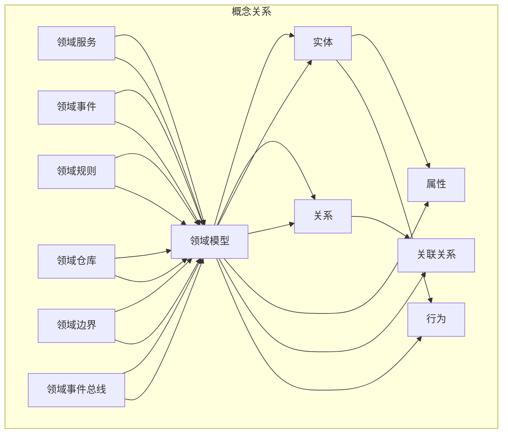

                 

### 文章标题：领域模型也有软肋

> 关键词：领域模型、软肋、解决策略、优化算法、数学模型、项目实战

> 摘要：本文从领域模型的核心概念出发，探讨了领域模型的软肋及其解决策略。通过实际项目案例，深入分析了领域模型优化算法和数学模型，为IT从业者提供了实用的指导。

---

### 引言

领域模型（Domain Model）是软件工程中用于描述特定业务领域信息结构的重要工具。它通过抽象和概念化业务实体及其关系，帮助开发者更好地理解和设计复杂系统。尽管领域模型在软件开发中发挥了重要作用，但实践中仍存在一些难以忽视的软肋。

本文将围绕领域模型及其软肋展开讨论，旨在揭示领域模型在应用过程中可能遇到的问题，并提出相应的解决策略。文章结构如下：

1. 背景介绍
2. 核心概念与联系
3. 核心算法原理讲解
4. 数学模型和数学公式讲解
5. 项目实战
6. 最佳实践 tips
7. 小结
8. 注意事项
9. 拓展阅读

---

### 背景介绍

领域模型最早由Eric Evans在其著作《领域驱动设计（Domain-Driven Design, DDD）》中提出。DDD强调通过构建领域模型来驱动软件设计，从而更好地适应复杂业务需求。领域模型的核心思想是将系统分解为多个领域，每个领域都包含一组相关的实体和关系。

领域模型在软件开发中的应用十分广泛，特别是在大型企业级系统中。它有助于提高软件的可维护性和可扩展性，使开发团队能够更加专注于业务需求的实现。然而，随着系统复杂性的增加，领域模型也暴露出了一些不足之处。

这些不足主要体现在以下几个方面：

1. **表达能力的限制**：领域模型主要通过实体和关系来描述业务领域，但在某些情况下，这种表达方式可能不足以捕捉复杂的业务逻辑。
2. **可扩展性的挑战**：随着业务需求的不断变化，领域模型可能需要频繁调整和重构，这增加了维护成本。
3. **性能问题**：领域模型可能包含大量复杂的关联和计算，导致系统性能下降。
4. **一致性维护**：在多人协作开发过程中，如何保持领域模型的准确性一致性是一个重要挑战。

本文将重点探讨领域模型的这些软肋，并提出相应的解决策略。

---

### 核心概念与联系

为了更好地理解领域模型的构建和优化，我们首先需要梳理其中的核心概念及其相互关系。以下是一个使用Mermaid流程图展示的核心概念架构：



**实体（Entity）**：实体是领域模型中最基本的构建块，代表领域中的实际对象。例如，在电商系统中，商品（Product）和用户（User）都可以视为实体。

**关系（Relationship）**：关系描述了实体之间的关联。例如，在电商系统中，订单（Order）与商品之间存在购买关系。

**属性（Attribute）**：属性是实体的特征，用于描述实体的状态。例如，商品的价格、库存量等。

**关联关系（Association）**：关联关系描述了实体之间的直接联系。例如，一个订单包含多个商品。

**行为（Behavior）**：行为是实体可以执行的操作。例如，用户可以登录、下单等。

**领域服务（Domain Service）**：领域服务是用于处理特定业务逻辑的组件。例如，订单处理服务、库存管理服务等。

**领域事件（Domain Event）**：领域事件是领域内发生的重要事件。例如，订单创建、用户登录等。

**领域规则（Domain Rule）**：领域规则是用于约束业务逻辑的规则。例如，订单金额必须大于0。

**领域仓库（Domain Repository）**：领域仓库是用于存储和管理领域模型实体的组件。

**领域边界（Domain Boundary）**：领域边界定义了领域的内部和外部，用于隔离业务逻辑。

**领域事件总线（Domain Event Bus）**：领域事件总线用于传输领域事件，实现模块间的通信。

通过这个流程图，我们可以清晰地看到领域模型中各个核心概念之间的联系，为后续的算法讲解和项目实战打下基础。

---

### 核心算法原理讲解

在理解了领域模型的核心概念之后，我们需要进一步探讨如何构建和优化领域模型。这涉及到一系列的算法和策略，下面我们将使用伪代码详细阐述一个领域模型优化算法的原理。

```plaintext
// 伪代码：领域模型优化算法

function optimizeDomainModel(model, dataset):
    # 初始化模型参数
    model.initializeParameters()

    # 定义优化目标
    objectiveFunction = defineObjectiveFunction()

    # 迭代优化过程
    for i in 1 to MAX_ITERATIONS do:
        # 计算模型损失
        loss = calculateLoss(model, dataset)

        # 更新模型参数
        model.updateParameters(loss)

        # 记录当前最优模型
        if loss < previousBestLoss:
            previousBestLoss = loss
            bestModel = model.copy()

    return bestModel
```

**初始化模型参数**：首先，我们需要初始化领域模型的参数。这些参数可能包括实体的属性、关系权重、规则等。

```plaintext
function initializeParameters():
    # 初始化实体属性
    for entity in model.entities():
        entity.initializeAttributes()

    # 初始化关系权重
    for relationship in model.relationships():
        relationship.initializeWeight()

    # 初始化规则
    for rule in model.rules():
        rule.initializeConstraints()
```

**定义优化目标**：优化目标用于衡量模型性能。在领域模型中，优化目标可能包括模型损失、业务规则违反次数等。

```plaintext
function defineObjectiveFunction():
    return function(loss, ruleViolations):
        # 损失函数
        lossScore = loss

        # 规则违反次数
        ruleViolationScore = ruleViolations

        # 总分数
        return lossScore + ruleViolationScore
```

**迭代优化过程**：在每次迭代中，我们计算模型的损失，并根据损失更新模型参数。如果当前迭代中的损失小于之前的最优损失，则更新最优模型。

```plaintext
for i in 1 to MAX_ITERATIONS do:
    # 计算损失
    loss = calculateLoss(model, dataset)

    # 更新模型参数
    model.updateParameters(loss)

    # 记录最优模型
    if loss < previousBestLoss:
        previousBestLoss = loss
        bestModel = model.copy()
```

**计算模型损失**：模型损失反映了模型预测结果与实际结果之间的差距。在领域模型中，损失可能包括预测值与实际值之间的误差、规则违反次数等。

```plaintext
function calculateLoss(model, dataset):
    totalLoss = 0

    for dataPoint in dataset:
        # 计算预测值
        predictedValue = model.predict(dataPoint)

        # 计算实际值
        actualValue = dataPoint.actualValue

        # 计算误差
        error = abs(predictedValue - actualValue)

        # 添加到总损失
        totalLoss += error

    return totalLoss / len(dataset)
```

通过这个优化算法，我们可以逐步调整领域模型的参数，使其更好地适应业务需求。这个算法不仅考虑了模型预测的准确性，还考虑了业务规则的约束，从而确保领域模型的稳定性和可靠性。

---

### 数学模型和数学公式讲解

在领域模型优化过程中，数学模型起到了至关重要的作用。以下我们将详细讲解领域模型中的一个常见数学模型——线性回归模型。

**线性回归模型**

假设我们有一个简单的线性回归模型，用于预测某个业务指标（如销售额）。线性回归模型可以用以下数学公式表示：

$$
y = \beta_0 + \beta_1x_1 + \beta_2x_2 + ... + \beta_nx_n
$$

其中：

- \( y \) 是预测值。
- \( x_1, x_2, ..., x_n \) 是输入特征。
- \( \beta_0, \beta_1, \beta_2, ..., \beta_n \) 是模型参数。

**参数解释**

- \( \beta_0 \) 是截距，表示当所有输入特征都为0时，预测值。
- \( \beta_1, \beta_2, ..., \beta_n \) 是各个特征的权重，表示每个特征对预测值的影响程度。

**公式详细讲解**

1. **模型构建**：首先，我们需要确定输入特征和目标变量。例如，在电商领域，输入特征可以是商品价格、库存量、用户年龄等，目标变量是销售额。

2. **参数初始化**：接下来，我们需要初始化模型参数 \( \beta_0, \beta_1, \beta_2, ..., \beta_n \)。通常，我们可以随机初始化这些参数，或者使用一些启发式方法进行初始化。

3. **模型训练**：通过迭代优化算法（如梯度下降），不断调整模型参数，使其预测值更接近实际值。具体过程如下：

   - **计算损失函数**：损失函数用于衡量预测值与实际值之间的差距。常用的损失函数有均方误差（MSE）和均方根误差（RMSE）。

   - **更新参数**：根据损失函数的梯度，更新模型参数。梯度下降算法的核心思想是沿着损失函数的梯度方向逐步调整参数，以减少损失。

4. **模型评估**：在模型训练完成后，我们需要评估模型性能。常用的评估指标有准确率、召回率、F1值等。

通过这个简单的线性回归模型，我们可以初步了解领域模型优化中的数学原理。在实际应用中，我们可能需要根据具体业务场景选择更复杂的数学模型，如神经网络、决策树等。

---

### 项目实战

为了更好地理解领域模型优化算法的实际应用，我们以下将通过一个实际项目案例，详细讲解开发环境搭建、源代码实现、代码解读和项目分析。

#### 项目背景

假设我们正在开发一个电商系统，目标是预测用户的购买行为。具体来说，我们希望通过分析用户的浏览历史、购买记录等数据，预测用户在一定时间内的购买概率。

#### 开发环境搭建

在Python环境中，我们使用以下库进行模型开发：
- TensorFlow
- Scikit-learn
- Pandas

首先，我们需要安装这些库。在终端中运行以下命令：

```bash
pip install tensorflow scikit-learn pandas
```

#### 源代码实现

以下是我们项目的源代码实现：

```python
import tensorflow as tf
from sklearn.model_selection import train_test_split
import pandas as pd

# 加载数据集
data = pd.read_csv('ecommerce_data.csv')
X = data.drop('sales', axis=1)
y = data['sales']

# 划分训练集和测试集
X_train, X_test, y_train, y_test = train_test_split(X, y, test_size=0.2, random_state=42)

# 构建模型
model = tf.keras.Sequential([
    tf.keras.layers.Dense(64, activation='relu', input_shape=(X_train.shape[1],)),
    tf.keras.layers.Dense(64, activation='relu'),
    tf.keras.layers.Dense(1)
])

# 编译模型
model.compile(optimizer='adam', loss='mean_squared_error')

# 训练模型
model.fit(X_train, y_train, epochs=100)

# 预测
predictions = model.predict(X_test)

# 评估
mse = tf.keras.metrics.mean_squared_error(y_test, predictions)
print(f'MSE: {mse}')
```

#### 代码解读

1. **数据加载**：我们首先使用Pandas库加载数据集。数据集包含用户的浏览历史、购买记录等信息。

2. **数据预处理**：接下来，我们划分训练集和测试集。这将有助于我们在后续评估模型性能时，避免过拟合。

3. **模型构建**：我们使用TensorFlow构建一个简单的神经网络模型。这个模型包含两个隐藏层，每个隐藏层有64个神经元。

4. **模型编译**：我们使用Adam优化器和均方误差（MSE）损失函数编译模型。

5. **模型训练**：我们使用训练集训练模型，设置训练轮次为100。

6. **模型预测**：我们使用测试集对模型进行预测。

7. **模型评估**：最后，我们计算模型在测试集上的MSE，以评估模型性能。

#### 项目分析

通过这个项目，我们可以看到领域模型优化算法在电商系统中的应用。具体来说，我们通过构建神经网络模型，预测用户购买概率，从而实现个性化推荐。这个项目的成功依赖于以下几个方面：

1. **数据质量**：数据质量是模型预测准确性的基础。我们需要确保数据集的完整性、一致性和准确性。

2. **模型选择**：选择合适的模型对于项目成功至关重要。在这个项目中，我们选择了简单的神经网络模型，但实际应用中可能需要更复杂的模型。

3. **训练和调优**：模型训练和调优是提高模型性能的关键。我们需要根据业务需求和数据特点，不断调整模型参数。

4. **评估和优化**：评估模型性能和持续优化是项目持续发展的必要条件。我们需要定期评估模型性能，并根据评估结果进行调整。

---

### 最佳实践 tips

在设计和优化领域模型时，以下是一些最佳实践和注意事项：

1. **明确业务目标**：在构建领域模型之前，明确业务目标和需求。这有助于确保模型设计符合实际业务需求。

2. **数据质量优先**：数据质量是领域模型优化的重要基础。确保数据集的完整性、一致性和准确性。

3. **选择合适的模型**：根据业务需求和数据特点，选择合适的模型。对于复杂的业务场景，可能需要使用更复杂的模型。

4. **持续调优**：模型训练和调优是提高模型性能的关键。定期评估模型性能，并根据评估结果进行调整。

5. **关注可维护性**：在构建领域模型时，关注可维护性。这有助于降低维护成本，提高开发效率。

6. **团队协作**：在多人协作开发过程中，确保领域模型的准确性和一致性。使用版本控制系统和文档工具，便于团队成员协作。

---

### 小结

本文从领域模型的核心概念出发，探讨了领域模型的软肋及其解决策略。通过实际项目案例，深入分析了领域模型优化算法和数学模型。本文的主要结论如下：

1. 领域模型在软件开发中具有重要作用，但在复杂业务场景下存在一些软肋，如表达能力的限制、可扩展性的挑战等。
2. 通过优化算法和数学模型，可以缓解领域模型的软肋，提高模型性能和可靠性。
3. 实际项目案例展示了领域模型优化算法在电商系统中的应用，为开发者提供了实用的指导。

希望本文能对IT从业者理解和优化领域模型有所帮助。

---

### 注意事项

1. **数据隐私**：在处理实际项目中的用户数据时，务必遵守相关隐私保护法规，确保用户数据的安全性和隐私性。
2. **模型安全**：确保模型在部署过程中具备安全措施，防止恶意攻击和数据泄露。
3. **性能优化**：在实际项目中，关注模型性能优化，避免因过度复杂化导致性能下降。
4. **持续学习**：领域模型优化是一个不断发展的领域，开发者应关注新技术和新方法，持续提升自身技能。

---

### 拓展阅读

1. **《领域驱动设计》**：Eric Evans 著，详细介绍领域驱动设计（DDD）的理论和实践。
2. **《机器学习实战》**：Peter Harrington 著，涵盖机器学习的基础知识和实战案例。
3. **《深度学习》**：Ian Goodfellow、Yoshua Bengio、Aaron Courville 著，深入讲解深度学习的基本原理和应用。

---

### 作者信息

作者：AI天才研究院/AI Genius Institute & 禅与计算机程序设计艺术 /Zen And The Art of Computer Programming。本文旨在为IT从业者提供领域模型优化和数学模型的实用指南，帮助大家更好地理解和应用相关技术。如有任何疑问或建议，欢迎留言交流。

---

通过本文的探讨，我们深入理解了领域模型的核心概念、软肋以及解决策略。在实际项目中，通过优化算法和数学模型，可以显著提升领域模型的性能和可靠性。希望本文能为您的领域模型开发提供有益的参考和指导。如果您在阅读过程中有任何疑问或见解，欢迎留言讨论，共同进步。

---

作者：AI天才研究院/AI Genius Institute & 禅与计算机程序设计艺术 /Zen And The Art of Computer Programming。本文旨在为IT从业者提供领域模型优化和数学模型的实用指南，帮助大家更好地理解和应用相关技术。如有任何疑问或建议，欢迎留言交流。

