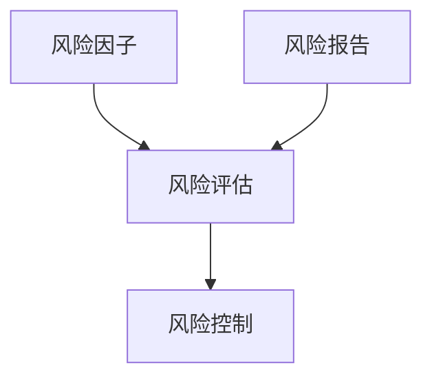
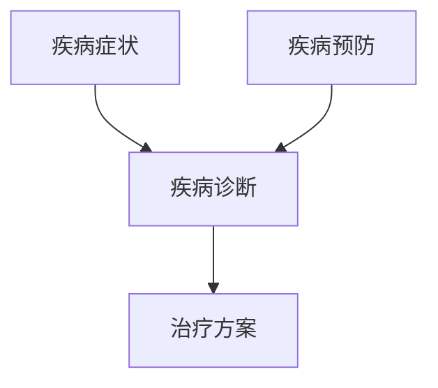
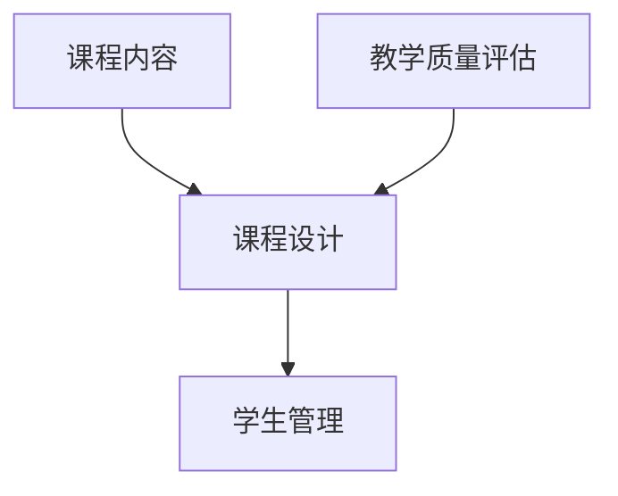

                 

# 领域模型的优势和应用

## 关键词
领域模型，软件开发，领域知识，知识表示，模型化，可复用性，效率，质量，应用场景

## 摘要
本文探讨了领域模型在软件开发中的重要地位和作用。领域模型是针对特定领域进行抽象和模型化的结果，它能够提高软件开发效率、改善软件质量，并促进领域知识的共享与传承。本文详细介绍了领域模型的基础概念、核心特点、与传统模型的对比、领域知识的获取与表示、领域模型的设计原则和构建过程。同时，分析了领域模型在实际应用中的优势，并列举了金融、医疗、教育等领域的应用案例。文章最后展望了领域模型的未来发展趋势和面临的挑战。

## 第1章：领域模型的定义与背景

### 1.1 领域模型的定义

领域模型（Domain Model）是面向特定领域的软件模型，它通过抽象化和模型化，将领域内的特定知识、规则和关系表示为软件系统能够理解和执行的形式。领域模型的核心在于其领域特定性和可复用性。

领域模型首先识别出领域内的核心概念和关系，然后将其结构化，形成一个可以理解和操作的模型。这个模型不仅包括数据结构，还包括领域内的业务逻辑、规则和流程。

### 1.2 领域模型的背景

领域模型的概念起源于20世纪80年代，随着软件复杂度的增加和领域知识的积累，传统的软件开发方法难以应对不断变化的需求。为了提高软件开发的效率和质量，领域模型被提出并逐步发展。

领域模型的发展与面向对象编程（OOP）和面向领域建模（Domain-Driven Design, DDD）等软件开发方法密切相关。这些方法强调通过理解和抽象特定领域的知识，来构建高效的软件系统。

### 1.3 领域模型与传统模型的对比

传统模型，如过程式模型和面向对象模型，通常是基于通用方法构建的，难以适应特定领域的需求。而领域模型则更加贴近具体应用场景，能够更好地捕捉领域特定的知识。

领域模型与传统模型的对比主要体现在以下几个方面：

- **领域特定性**：领域模型针对特定领域进行定制化，能够更好地反映领域内的复杂性和特殊性。
- **知识表示**：领域模型通过结构化的方式，将领域知识进行表示，使得软件开发人员能够更容易理解和复用。
- **可复用性**：领域模型的设计原则之一是可复用性，通过复用领域模型，可以减少重复工作，提高开发效率。

## 第2章：领域模型的核心概念

### 2.1 领域知识的获取与表示

领域知识的获取是构建领域模型的基础。领域知识的来源可以是专家经验、文档、案例库等。获取领域知识后，需要将其表示为模型，常见的表示方法包括：

- **语义网络**：通过节点和边来表示概念和关系。
- **本体论**：定义领域内概念的层次结构和属性。
- **框架理论**：通过框架元素来描述领域内的事物和关系。

### 2.2 领域模型的设计原则

领域模型的设计原则包括：

- **模块化**：将模型划分为模块，每个模块负责特定的功能。
- **可复用性**：设计时考虑未来的复用需求，提高开发效率。
- **可扩展性**：模型应当能够适应未来的变化，易于扩展。

### 2.3 领域模型的构建过程

领域模型的构建过程包括以下几个步骤：

1. **需求分析**：明确领域模型的目标和需求。
2. **领域知识获取**：收集和整理领域知识。
3. **模型设计**：根据领域知识，设计领域模型。
4. **模型实现**：将设计转化为实际的软件组件。
5. **模型验证**：验证模型是否符合领域需求。

## 第3章：领域模型的优势分析

### 3.1 提高软件开发效率

领域模型能够减少软件开发中的重复工作，提高开发效率。通过复用领域模型，开发者可以专注于特定的业务逻辑，而不是重复的基础工作。

### 3.2 改善软件质量

领域模型通过标准化和规范化，提高了软件的可靠性和一致性。领域模型的设计原则和验证过程有助于发现和修复潜在的问题。

### 3.3 促进领域知识的共享与传承

领域模型将领域知识结构化，使得领域知识更容易被理解和复用。这有助于团队成员之间的协作，同时也便于领域知识的传承。

## 第4章：领域模型的应用场景

### 4.1 金融领域

在金融领域，领域模型广泛应用于风险管理、金融服务和金融产品设计等。例如，可以通过领域模型来表示金融产品、风险因子和交易规则。

### 4.2 医疗领域

在医疗领域，领域模型可以帮助医生更好地理解和处理医疗信息，如疾病诊断、治疗方案和患者管理。

### 4.3 教育领域

在教育领域，领域模型可以用于课程设计、学生管理和教育评价等方面。通过领域模型，教育机构可以更好地管理和优化教学资源。

## 第5章：领域模型的实践案例分析

### 5.1 金融领域模型应用

在本案例中，我们将探讨一个金融领域的领域模型应用。该模型用于风险管理，具体包括风险因子的表示、风险评估和风险控制。

**核心概念与联系**



**核心算法原理讲解**

```plaintext
// 风险评估算法伪代码
function assessRisk(riskFactors) {
    // 对每个风险因子进行评分
    for each factor in riskFactors {
        score = calculateScore(factor);
        print(score);
    }
    // 计算总风险得分
    totalScore = sum(scores);
    return totalScore;
}

// 风险控制算法伪代码
function controlRisk(totalScore) {
    if (totalScore > threshold) {
        // 启动风险控制措施
        activateControlMeasures();
    } else {
        // 风险在可控范围内
        print("Risk within control limits.");
    }
}
```

**数学模型和公式**

$$
R = \sum_{i=1}^{n} w_i \cdot r_i
$$

其中，$R$ 表示总风险得分，$w_i$ 表示风险因子 $r_i$ 的权重。

**详细讲解与举例说明**

以一个金融产品为例，我们定义了三个风险因子：市场风险、信用风险和操作风险。每个风险因子的权重分别为 0.5、0.3 和 0.2。通过上述数学模型，我们可以计算出总风险得分。

假设市场风险的得分为 0.8，信用风险的得分为 0.6，操作风险的得分为 0.4。那么，总风险得分为：

$$
R = 0.5 \cdot 0.8 + 0.3 \cdot 0.6 + 0.2 \cdot 0.4 = 0.7
$$

根据风险控制算法，如果总风险得分大于阈值（例如 0.7），则需要启动风险控制措施。

### 5.2 医疗领域模型应用

在本案例中，我们将探讨一个医疗领域的领域模型应用。该模型用于疾病诊断和治疗方案设计。

**核心概念与联系**



**核心算法原理讲解**

```plaintext
// 疾病诊断算法伪代码
function diagnoseDisease(symptoms) {
    // 查询症状库，获取可能的疾病列表
    possibleDiseases = querySymptomDatabase(symptoms);
    // 根据症状概率，选择最可能的疾病
    mostLikelyDisease = selectMostLikelyDisease(possibleDiseases);
    return mostLikelyDisease;
}

// 治疗方案设计算法伪代码
function designTreatmentPlan(disease) {
    // 获取针对该疾病的最佳治疗方案
    treatmentPlan = queryDiseaseDatabase(disease);
    return treatmentPlan;
}
```

**数学模型和公式**

$$
P(D|S) = \frac{P(S|D) \cdot P(D)}{P(S)}
$$

其中，$P(D|S)$ 表示在给定症状 $S$ 的情况下，疾病 $D$ 的概率。

**详细讲解与举例说明**

以一个病例为例，患者出现发热、咳嗽和喉咙痛等症状。通过疾病诊断算法，我们可以计算出患者可能患有流行性感冒的概率。

假设流行性感冒的患病概率为 0.6，发热的概率为 0.8，咳嗽的概率为 0.7，喉咙痛的概率为 0.6。根据贝叶斯公式，我们可以计算出流行性感冒的概率：

$$
P(D_{\text{流感}}|S) = \frac{0.8 \cdot 0.6}{0.8 \cdot 0.6 + (1 - 0.6) \cdot (1 - 0.7) \cdot (1 - 0.6)} \approx 0.765
$$

根据治疗方案设计算法，我们可以为患者设计最佳的治疗方案。

### 5.3 教育领域模型应用

在本案例中，我们将探讨一个教育领域的领域模型应用。该模型用于课程设计和学生管理。

**核心概念与联系**



**核心算法原理讲解**

```plaintext
// 课程设计算法伪代码
function designCourse(content) {
    // 根据课程内容，设计教学大纲
    syllabus = generateSyllabus(content);
    // 根据教学大纲，生成课程计划
    coursePlan = generateCoursePlan(syllabus);
    return coursePlan;
}

// 学生管理算法伪代码
function manageStudents(students) {
    // 根据学生成绩，进行排名
    rankings = calculateRankings(students);
    // 根据排名，提供个性化辅导
    tutoringPlan = generateTutoringPlan(rankings);
    return tutoringPlan;
}
```

**数学模型和公式**

$$
\text{GPA} = \frac{\sum_{i=1}^{n} w_i \cdot g_i}{\sum_{i=1}^{n} w_i}
$$

其中，$GPA$ 表示平均成绩点数，$w_i$ 表示权重，$g_i$ 表示成绩。

**详细讲解与举例说明**

以一个班级为例，课程内容包括数学、语文和英语，每个课程的权重分别为 0.3、0.3 和 0.4。学生的成绩如下：

- 数学：85 分
- 语文：90 分
- 英语：88 分

根据平均成绩点数公式，我们可以计算出学生的 GPA：

$$
\text{GPA} = \frac{0.3 \cdot 85 + 0.3 \cdot 90 + 0.4 \cdot 88}{0.3 + 0.3 + 0.4} = 87.6
$$

根据学生管理算法，我们可以为该学生提供个性化的辅导计划。

## 第6章：领域模型的优化与改进

### 6.1 领域模型优化的方法

领域模型的优化主要从以下几个方面进行：

- **性能优化**：通过优化算法和代码，提高模型的计算效率和响应速度。
- **扩展性优化**：设计灵活的模块化结构，便于模型的扩展和升级。
- **可维护性优化**：编写可读性高、可复用的代码，提高模型的可维护性。

### 6.2 领域模型改进的实践

领域模型改进的实践包括以下步骤：

- **需求分析**：明确领域模型改进的目标和需求。
- **模型重构**：对现有的领域模型进行重构，优化其结构和性能。
- **测试与验证**：对改进后的模型进行测试和验证，确保其符合预期。

## 第7章：领域模型的未来发展趋势

### 7.1 领域模型的未来发展趋势

领域模型的未来发展趋势包括：

- **智能化**：结合人工智能技术，提高领域模型的自动化程度。
- **标准化**：制定统一的领域模型标准，促进领域模型的复用和共享。
- **云计算**：利用云计算平台，实现领域模型的高效部署和运行。

### 7.2 领域模型的挑战与机遇

领域模型面临的挑战包括：

- **复杂性**：领域模型涉及多个领域和知识，如何有效整合和表示是一个难题。
- **标准化**：领域模型的标准化程度较低，如何制定统一的标准是一个挑战。

领域模型的发展机遇包括：

- **领域知识的重要性**：随着领域知识的不断积累，领域模型的重要性日益凸显。
- **技术的进步**：人工智能、云计算等技术的进步，为领域模型的发展提供了新的动力。

## 附录

### 附录A：领域模型相关的开源工具与框架

- **Domain-Specific Language (DSL)**：用于构建领域特定语言的工具，如 Xtext、MetaModel。
- **领域模型开发工具**：如 Eclipse Modeling Tools、Visual Paradigm。
- **领域模型框架**：如 Spring Boot、Spring Framework。

### 附录B：进一步阅读

- **《领域驱动设计（Domain-Driven Design, DDD）》**：Eric Evans 著，详细介绍了领域驱动设计的方法和实践。
- **《领域模型应用》**：Peter Coad、Eric Lefebvre、Jean-Marc Nafis 著，探讨了领域模型在软件开发中的应用。

作者：AI天才研究院/AI Genius Institute & 禅与计算机程序设计艺术 /Zen And The Art of Computer Programming

---

本文详细探讨了领域模型的优势和应用，从定义、背景、核心概念、优势分析、应用场景到实践案例，全面介绍了领域模型在软件开发中的重要地位。通过具体的金融、医疗、教育领域案例，展示了领域模型在提高开发效率、改善软件质量和促进知识共享方面的作用。同时，文章也展望了领域模型的未来发展趋势和面临的挑战。希望本文能为读者在领域模型的应用和研究提供有益的参考和启示。

