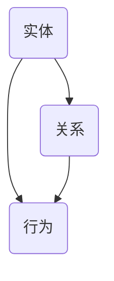
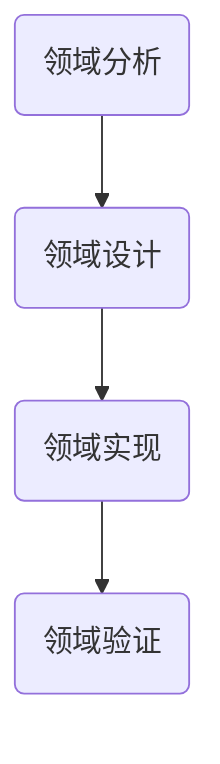
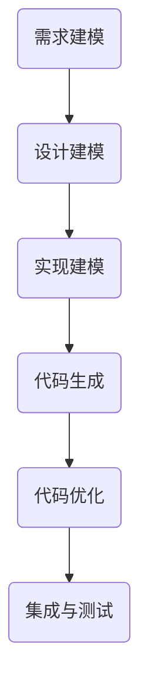
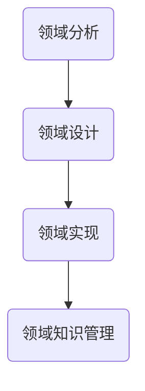

                 

### 文章标题

《领域模型的模型》—— 探索复杂系统的构建与优化之路

领域模型在计算机科学和软件工程中扮演着至关重要的角色。它们为复杂系统提供了清晰的抽象，使得系统能够更好地适应变化、易于维护和理解。本文章旨在深入探讨领域模型的概念、设计原则、构建方法以及应用实践，帮助读者全面理解领域模型的核心价值和实际应用。

本文将从以下几个方面展开：

1. **领域模型的定义与重要性**：介绍领域模型的基本概念，阐述其在复杂系统设计中的作用。
2. **领域模型的核心概念**：详细解释模型驱动的系统设计、数据与知识表示以及领域特定语言（DSL）。
3. **领域模型的设计原则**：探讨模型简化、扩展性和一致性原则。
4. **领域模型的构建方法**：分析领域模型构建流程、模型驱动开发（MDD）和领域工程方法。
5. **领域模型的评估与优化**：介绍模型评估指标、优化策略以及模型迭代与进化。
6. **领域模型的应用实践**：探讨领域模型在金融、医疗健康和工业制造等领域的实际应用。
7. **未来展望与趋势**：预测领域模型的发展方向、潜在挑战与机遇以及标准化趋势。

通过本文的逐步分析，读者将能够全面掌握领域模型的理论与实践，为未来的系统设计和开发提供有力支持。

### 关键词

- 领域模型
- 复杂系统设计
- 模型驱动开发
- 数据与知识表示
- DSL
- 设计原则
- 构建方法
- 评估与优化
- 应用实践
- 未来趋势

### 摘要

本文深入探讨了领域模型的概念、设计原则、构建方法及其应用实践。领域模型作为复杂系统设计的核心工具，能够提供清晰的抽象，支持系统的高效开发、维护和理解。本文首先介绍了领域模型的基本概念，然后详细解释了其核心概念，包括模型驱动的系统设计、数据与知识表示以及领域特定语言（DSL）。接着，本文探讨了领域模型的设计原则，包括模型简化、扩展性和一致性原则。随后，本文分析了领域模型的构建方法，包括模型构建流程、模型驱动开发（MDD）和领域工程方法。此外，本文还介绍了领域模型的评估与优化策略，以及其在金融、医疗健康和工业制造等领域的实际应用。最后，本文对未来领域模型的发展方向、潜在挑战与机遇以及标准化趋势进行了展望。通过本文的逐步分析，读者将能够全面掌握领域模型的理论与实践，为未来的系统设计和开发提供有力支持。

## 第1章：领域模型的定义与重要性

### 1.1 领域模型的定义

领域模型（Domain Model）是针对特定领域（Domain）的概念和实体的抽象表示。在软件工程中，领域模型用于描述系统需求、功能和行为，从而帮助开发者更好地理解业务领域，并在此基础上进行系统的设计与实现。

领域模型的核心是**领域**（Domain），它定义了系统的业务范围和功能需求。领域可以是一个具体的行业（如金融、医疗、制造等），也可以是一个抽象的概念（如客户关系管理、库存管理、财务分析等）。

领域模型通常由以下几个部分组成：

1. **实体**（Entity）：表示领域中的关键对象，如客户、订单、产品等。
2. **关系**（Relationship）：描述实体之间的交互和依赖关系，如客户下单、产品销售等。
3. **行为**（Behavior）：定义实体和关系的操作和规则，如订单生成、库存调整等。

在UML（统一建模语言）中，领域模型通常使用类图（Class Diagram）和对象图（Object Diagram）进行表示。类图展示了实体和它们之间的关系，而对象图则展示了特定时刻实体的实例及其关系。

领域模型是面向对象方法的核心概念之一。通过将业务领域中的概念和实体的抽象表示为模型，开发者可以更专注于业务逻辑的实现，而无需过多关注底层技术细节。

### 1.2 领域模型的重要性

领域模型在软件工程中具有重要的地位，其重要性主要体现在以下几个方面：

1. **提高系统设计与开发效率**：领域模型为系统设计提供了一个统一的抽象框架，使得开发者能够更快速地理解和实现系统功能。通过领域模型，开发者可以明确系统中的关键概念和实体，从而减少设计过程中的误解和错误。

2. **支持复杂系统的管理**：在复杂系统中，领域模型有助于管理大量的业务规则和操作。通过领域模型，开发者可以清晰地定义系统中的业务流程和规则，从而实现系统的自动化和高效管理。

3. **促进领域知识的传承与应用**：领域模型将领域知识抽象为模型，使得这些知识可以方便地传承和复用。在软件开发生命周期中，领域模型可以帮助团队成员更好地理解和共享领域知识，从而提高开发效率和项目质量。

4. **支持系统维护与扩展**：领域模型为系统提供了清晰的结构和抽象，使得系统维护和扩展变得更加容易。通过领域模型，开发者可以更快速地识别和修复系统中的问题，同时也可以更方便地添加新的功能。

总之，领域模型是软件工程中不可或缺的工具，它为复杂系统的设计与开发提供了有力的支持。通过正确地构建和使用领域模型，开发者可以显著提高系统的质量、可维护性和可扩展性。

### 图 1.1 领域模型的结构

为了更好地理解领域模型的结构，我们可以使用Mermaid流程图来展示其核心概念之间的关系。

```mermaid
graph TB
    Entity(A[实体])
    Relationship(B[关系])
    Behavior(C[行为])
    Entity --> Relationship
    Entity --> Behavior
    Relationship --> Behavior
```

在上面的图中，实体（Entity）、关系（Relationship）和行为（Behavior）构成了领域模型的基本组成部分。实体表示领域中的关键对象，关系描述实体之间的交互和依赖，而行为定义了实体和关系的操作和规则。这种结构使得领域模型能够全面地描述复杂系统的业务逻辑和需求。

### 1.3 领域模型的分类

根据领域模型的复杂程度和应用场景，可以将领域模型分为以下几类：

1. **基础领域模型**：这类模型主要用于描述简单业务场景，包括基本的实体、关系和行为。基础领域模型通常适用于小型项目或系统，其结构相对简单，易于理解和实现。

2. **复杂领域模型**：这类模型用于描述复杂业务场景，包括多个子领域、复杂的实体关系和行为。复杂领域模型通常适用于大型项目或系统，其结构复杂，需要更多的设计和技术支持。

3. **领域特定模型**：这类模型是针对特定领域设计的，具有高度的领域特定性和专业性。领域特定模型通常包括丰富的实体、关系和行为，能够全面地描述特定领域的业务逻辑和需求。

4. **混合领域模型**：这类模型结合了基础领域模型和复杂领域模型的特点，适用于跨领域的应用。混合领域模型通常在基础领域模型的基础上，根据具体应用场景进行扩展和调整。

不同类型的领域模型在复杂程度和应用范围上存在差异，开发者应根据具体项目需求和场景选择合适的领域模型。

### 1.4 领域模型在系统设计中的实际作用

在系统设计中，领域模型发挥着至关重要的作用。以下是领域模型在实际系统设计中的几个关键作用：

1. **抽象复杂业务场景**：通过领域模型，开发者可以将复杂的业务场景抽象为简单的实体、关系和行为，使得系统设计更加清晰和直观。这种抽象有助于降低系统复杂性，提高系统的可维护性和可扩展性。

2. **明确系统需求**：领域模型为系统需求提供了一个明确的描述，使得需求分析更加具体和详细。通过领域模型，开发者可以更好地理解业务规则和流程，从而确保系统功能满足实际需求。

3. **促进团队协作**：领域模型为团队成员提供了一个共同的抽象框架，有助于团队成员之间的沟通和协作。通过领域模型，团队成员可以更清晰地理解系统的设计和实现，从而提高开发效率和项目质量。

4. **支持系统重构与优化**：领域模型为系统的重构和优化提供了明确的指导。通过领域模型，开发者可以识别系统中的关键组件和关系，从而进行针对性的重构和优化，提高系统的性能和稳定性。

总之，领域模型在系统设计中的应用，不仅能够提高系统的可维护性和可扩展性，还能促进团队的协作和沟通，从而提高整个项目的成功率和质量。

### 1.5 领域模型与面向对象设计的联系

领域模型与面向对象设计（Object-Oriented Design，OOD）密切相关，两者在核心概念和方法上有很多相似之处。以下是领域模型与面向对象设计的联系：

1. **实体与类的对应关系**：在领域模型中，实体对应面向对象设计中的类。类是面向对象编程的基本构建块，用于表示系统中的对象和属性。实体与类的对应关系使得领域模型能够直接映射到面向对象编程语言中。

2. **关系与关联关系的对应关系**：领域模型中的关系对应面向对象设计中的关联关系。关联关系描述类之间的交互和依赖关系，如聚合、组合、继承等。通过定义合适的关系，领域模型能够更好地描述系统中的业务逻辑和实体间的交互。

3. **行为与方法的对应关系**：在领域模型中，行为对应面向对象设计中的方法。方法定义了类中对象的行为和操作，如方法调用和数据访问等。通过定义行为，领域模型能够明确系统中的业务规则和操作。

4. **抽象与封装**：领域模型和面向对象设计都强调抽象和封装。抽象是通过隐藏系统的复杂性，提供更简洁的接口，从而简化系统的设计和实现。封装则是通过将实现细节封装在内部，提供公共接口，从而保护系统的稳定性和可维护性。

总的来说，领域模型与面向对象设计在核心概念和方法上有很多共同点，两者结合能够更好地支持复杂系统的设计和开发。

### 1.6 小结

本章介绍了领域模型的基本概念、重要性以及在实际系统设计中的应用。领域模型作为一种重要的设计工具，能够抽象和简化复杂的业务场景，明确系统需求，促进团队协作，并支持系统的重构与优化。通过本章的学习，读者应该对领域模型有一个全面的理解，为后续章节的深入学习打下基础。

## 第2章：领域模型的核心概念

### 2.1 模型驱动的系统设计

模型驱动的系统设计（Model-Driven System Design，MDSD）是一种以模型为核心的开发方法，旨在通过创建和操作模型来指导系统设计和实现。在MDSD中，模型不仅仅是设计过程中的辅助工具，而是贯穿整个开发周期的核心要素。

**模型驱动的系统设计的基本思想**是将系统需求、功能和行为抽象为模型，然后通过模型转换和代码生成来生成实际的系统代码。这种方法的优势在于：

1. **高层次的抽象**：通过模型，开发者可以以更高的层次来理解系统需求，避免了直接编写底层代码的复杂性。
2. **更好的维护性**：模型提供了系统设计的全局视图，使得修改和优化系统变得更加容易。
3. **代码生成**：模型可以直接转换为代码，减少了手写代码的工作量，提高了开发效率。

**模型驱动的系统设计的主要步骤**包括：

1. **需求建模**：将系统需求转化为抽象的模型，通常使用UML等建模工具。
2. **功能建模**：定义系统的功能和行为，包括接口、流程和状态等。
3. **数据建模**：描述系统的数据结构，包括实体、关系和属性等。
4. **模型转换**：将不同阶段的模型转换为具体的实现模型，如代码、配置文件等。
5. **代码生成**：利用转换后的模型生成实际的系统代码。
6. **系统集成与测试**：将生成的代码进行集成和测试，确保系统功能符合需求。

在MDSD中，模型扮演着至关重要的角色。通过模型，开发者可以清晰地理解系统需求，定义系统的功能和数据结构，并在模型的基础上生成实际的代码。这种开发方法不仅提高了开发效率，还显著降低了系统的复杂性和维护成本。

### 2.2 数据与知识表示

在领域模型中，数据与知识的表示是核心组成部分，它们决定了模型的有效性和适用性。数据与知识的表示方法主要包括以下几种：

1. **实体-关系模型**：这是最常见的表示方法，通过实体（对象）和关系（连接）来描述数据。实体表示领域中的对象，如客户、订单、产品等，关系描述实体之间的关联，如客户下单、产品销售等。实体-关系模型通常使用类图（Class Diagram）进行表示。

2. **面向对象模型**：面向对象模型通过类和对象来描述数据和知识。类是对象的抽象，描述了对象的属性和行为。对象是类的实例，具有特定的状态和行为。面向对象模型强调封装、继承和多态等概念，使得数据表示更加灵活和可扩展。

3. **过程模型**：过程模型通过流程图（Flowchart）或状态图（State Diagram）来描述数据的处理过程。过程模型强调数据的流转和操作，适用于描述复杂的数据处理流程。

4. **语义网络模型**：语义网络模型使用节点和边来表示数据，节点表示实体，边表示实体之间的关系。语义网络模型强调数据的语义和关系，适用于知识密集型的应用。

5. **图模型**：图模型使用节点和边来表示数据，节点表示实体，边表示实体之间的关系。图模型具有高度的可扩展性和灵活性，适用于复杂和动态的数据场景。

在领域模型中，数据与知识表示的方法应根据具体的应用场景和需求进行选择。例如，对于结构化数据，可以使用实体-关系模型或面向对象模型；对于流程化的数据处理，可以使用过程模型；对于知识密集型应用，可以使用语义网络模型或图模型。

### 2.3 领域特定语言（DSL）

领域特定语言（Domain-Specific Language，DSL）是一种为特定领域设计的小型语言，旨在提高领域内问题的表达和解决效率。DSL通过简化领域内特定的语言和语法，使得开发者能够以更自然、更高效的方式描述领域问题。

**DSL的基本特点**包括：

1. **领域特异性**：DSL专注于特定领域的语法和语义，能够精确地描述领域内的概念和操作，提高开发效率。
2. **简洁性**：DSL通常具有简洁的语法和结构，减少冗余和复杂度，使得开发者能够更快速地理解和编写代码。
3. **可扩展性**：DSL可以通过扩展现有的语法和功能，适应不断变化的领域需求。
4. **可组合性**：DSL可以与其他通用编程语言和工具结合，提供更强大的功能。

**DSL的应用场景**包括：

1. **系统配置和脚本编写**：DSL可以用于编写系统配置文件、脚本和自动化工具，提高系统维护和管理的效率。
2. **领域分析和建模**：DSL可以用于领域分析和建模，帮助开发者更清晰地理解领域需求，快速构建领域模型。
3. **领域内问题求解**：DSL可以用于解决特定领域的复杂问题，如金融计算、医疗诊断、地理信息系统等。

**DSL的设计原则**包括：

1. **最小化学习曲线**：DSL应设计得尽可能简单和直观，减少开发者的学习成本。
2. **领域聚焦**：DSL应专注于领域内的特定概念和操作，避免无关功能和复杂度的引入。
3. **可组合性**：DSL应易于与其他语言和工具集成，提供灵活的组合方式。
4. **可扩展性**：DSL应支持自定义扩展，允许开发者根据具体需求进行功能扩展。

通过DSL，开发者能够以更高效的方式解决特定领域的问题，提高开发效率和质量。

### 2.4 领域模型中的核心概念之间的关系架构

为了更好地理解领域模型中的核心概念之间的关系，我们可以使用Mermaid流程图来展示其架构。



在上面的图中，实体（Entity）、关系（Relationship）和行为（Behavior）构成了领域模型的基本组成部分。实体表示领域中的关键对象，关系描述实体之间的交互和依赖，而行为定义了实体和关系的操作和规则。这种结构使得领域模型能够全面地描述复杂系统的业务逻辑和需求。

### 2.5 数据与知识表示的示例

为了更好地理解数据与知识的表示方法，我们可以通过一个示例来具体说明。

#### 示例：客户关系管理系统

在客户关系管理系统中，领域模型的核心概念包括客户（Customer）、订单（Order）和产品（Product）。

1. **实体与关系**：
   - 客户（Customer）：包含属性如姓名、地址、联系方式等。
   - 订单（Order）：包含属性如订单号、订单日期、总价等，与客户（Customer）之间有一对多关系（一个客户可以下多个订单）。
   - 产品（Product）：包含属性如产品名称、价格、库存量等。

2. **行为**：
   - 客户（Customer）可以创建、修改和删除订单（Order）。
   - 订单（Order）可以添加、删除和查询产品（Product）。

在UML类图中，这些概念可以表示为：

```mermaid
classDiagram
    Customer <|-- Order
    Product <|-- Order
    Customer {
        +String name
        +String address
        +String contact
        +createOrder()
        +modifyOrder()
        +deleteOrder()
    }
    Order {
        +String orderId
        +Date orderDate
        +Double total
        +addProduct()
        +deleteProduct()
        +queryProduct()
    }
    Product {
        +String productName
        +Double price
        +Integer inventory
    }
```

通过上述表示，我们可以清晰地看到数据与知识在领域模型中的结构，从而为系统设计与开发提供有力支持。

### 2.6 小结

本章介绍了领域模型的核心概念，包括模型驱动的系统设计、数据与知识表示以及领域特定语言（DSL）。这些概念构成了领域模型的基础，为复杂系统的设计与开发提供了强有力的支持。通过本章的学习，读者应该能够理解领域模型的基本原理，掌握其核心概念，为后续章节的深入学习打下坚实基础。

## 第3章：领域模型的设计原则

领域模型的设计是软件工程中的一个关键步骤，其设计质量直接影响系统的可维护性、可扩展性和可用性。为了确保领域模型的有效性，我们需要遵循一系列设计原则。这些原则可以帮助我们简化模型、增强其扩展性和确保一致性，从而提升整个系统的设计质量。

### 3.1 模型简化原则

模型简化原则是领域模型设计的重要基础。其主要目的是通过消除不必要的复杂性和冗余，使得模型更加简洁和易于理解。

**原则1：KISS（保持简单）**

KISS原则主张设计时应该保持简单，避免过度复杂化。具体做法包括：

- **减少实体数量**：只包括必要的实体，避免多余的实体引入不必要的复杂性。
- **简化关系**：确保实体之间的关系简单且清晰，避免复杂的关系结构。
- **去除冗余信息**：避免在模型中包含重复或冗余的信息。

**实践案例**：在开发一个电商系统时，我们可能只包括客户（Customer）、订单（Order）和产品（Product）这三个核心实体，而不是引入更多无关的实体，从而简化模型。

**原则2：最小化抽象层次**

在模型设计过程中，我们需要权衡抽象层次的数量。过多的抽象层次会增加模型的复杂度，降低可维护性。

- **适度抽象**：适度地使用抽象层次，确保每个层次都能提供清晰的业务逻辑和功能。
- **避免过度设计**：避免在早期阶段引入过多的抽象层次，这些层次可能在后续开发中变得不再必要。

**实践案例**：在一个银行系统中，我们可以将账户（Account）作为基础层，然后创建储蓄账户（SavingsAccount）和支票账户（CheckingAccount）作为抽象层。这样可以既保持模型的简洁性，又能满足不同类型的账户需求。

### 3.2 模型扩展性原则

模型的扩展性是确保领域模型能够适应未来需求变化的关键。良好的扩展性能够降低系统的维护成本，提高系统的灵活性。

**原则1：模块化设计**

模块化设计是将系统划分为多个独立的模块，每个模块负责特定的功能。这种设计方式有助于：

- **提高可维护性**：模块化使得修改和扩展系统变得更加容易。
- **增强重用性**：模块可以独立开发和测试，从而提高重用性。

**实践案例**：在开发一个社交网络系统时，可以将用户（User）、帖子（Post）、评论（Comment）等模块独立出来，每个模块都拥有自己的数据结构和操作接口。

**原则2：使用组合和聚合**

组合和聚合是提高模型扩展性的重要手段。组合表示整体与部分的关系，而聚合表示部分之间的组合方式。

- **组合**：使用组合可以确保整体和部分之间的紧密关系，使得修改部分不会影响整体。
- **聚合**：聚合关系允许部分独立于整体进行修改和扩展。

**实践案例**：在一个库存管理系统里，产品（Product）可以组合到库存（Inventory）中，而库存可以聚合到仓库（Warehouse）中。这种设计方式使得增加新的产品或仓库变得非常简单。

**原则3：定义扩展点**

在设计模型时，提前定义扩展点可以帮助我们更方便地添加新的功能或实体。

- **扩展点**：在模型的关键位置定义扩展点，例如在类图中使用`<extend>`标签。
- **灵活的接口**：设计灵活的接口，使得新的功能可以无缝集成到现有系统中。

**实践案例**：在一个地图系统中，可以定义一个`Location`扩展点，以便在后续版本中添加新的地理位置信息或位置相关的功能。

### 3.3 模型一致性原则

模型一致性原则确保领域模型中的各个部分能够协同工作，不会产生冲突或矛盾。一致性是保证模型有效性和可靠性的关键。

**原则1：定义明确的语义**

在模型设计过程中，需要为每个实体、关系和行为定义明确的语义。明确语义有助于：

- **避免误解**：明确的概念定义可以避免开发者和领域专家之间的误解。
- **提高可维护性**：清晰的语义使得后续的维护和更新变得更加容易。

**实践案例**：在开发一个医疗系统时，必须明确定义“患者”（Patient）和“医生”（Doctor）的概念，以及他们之间的关系和职责。

**原则2：保持一致性**

在模型设计过程中，需要确保各个部分的一致性。这包括：

- **数据一致性**：确保数据模型中的数据不会产生冲突或矛盾。
- **行为一致性**：确保实体和关系的行为定义保持一致。

**实践案例**：在一个库存管理系统中，库存量的增减必须与实际库存保持一致，任何库存操作的变更都需要经过严格的验证和审计。

**原则3：使用一致性检查**

在模型设计过程中，可以使用工具或自动化脚本进行一致性检查，以确保模型的一致性。

- **工具支持**：使用UML建模工具（如Enterprise Architect、Visual Paradigm）进行一致性检查。
- **脚本检查**：编写脚本对模型进行自动化检查，发现潜在的一致性问题。

**实践案例**：在一个金融服务系统中，可以使用脚本对交易数据进行一致性检查，确保每一笔交易都符合银行规则和业务逻辑。

### 图 3.1 领域模型设计原则的关系架构

为了更好地理解领域模型设计原则之间的关系，我们可以使用Mermaid流程图来展示其架构。

```mermaid
graph TB
    Simplification Principles(简化原则)
    Extensibility Principles(扩展性原则)
    Consistency Principles(一致性原则)
    Simplification Principles --> Extensibility Principles
    Simplification Principles --> Consistency Principles
    Extensibility Principles --> Consistency Principles
```

在上面的图中，简化原则、扩展性原则和一致性原则构成了领域模型设计的重要基础。简化原则通过消除冗余和复杂性来提高模型的简洁性，扩展性原则通过模块化和灵活的设计来增强模型的适应性，一致性原则通过定义明确的语义和保持一致性来确保模型的可靠性。

### 3.4 小结

本章介绍了领域模型的设计原则，包括模型简化、扩展性和一致性原则。通过遵循这些原则，开发者可以构建出简洁、灵活且可靠的领域模型，从而提高系统的可维护性、可扩展性和可用性。这些原则不仅适用于领域模型的设计，也可以应用于其他类型的软件设计过程，为软件工程提供有力的指导。通过本章的学习，读者应该能够理解并掌握领域模型设计的基本原则，为后续的领域模型构建和应用打下坚实基础。

## 第4章：领域模型的构建方法

### 4.1 领域模型构建流程

领域模型的构建是一个系统化、迭代化的过程，涉及多个阶段，每个阶段都有其特定的目标和任务。下面将详细介绍领域模型构建的流程，包括领域分析、领域设计、领域实现和领域验证等关键步骤。

#### 4.1.1 领域分析

领域分析是领域模型构建的第一步，其主要目标是识别和定义领域中的关键概念、实体和关系。领域分析通常包括以下任务：

1. **需求收集**：通过与领域专家、客户和利益相关者的交流，收集领域需求，理解领域中的业务流程和规则。
2. **领域调研**：通过文献调研、案例分析和技术调研，深入了解领域内的业务模式和技术现状。
3. **概念识别**：识别领域中的关键概念和术语，明确实体和关系的定义。
4. **需求建模**：使用UML类图、实体-关系图等工具，将收集到的需求转化为模型，形成初步的领域模型。

#### 4.1.2 领域设计

领域设计是领域模型构建的核心步骤，其主要目标是根据领域分析的结果，设计出结构清晰、功能明确的领域模型。领域设计通常包括以下任务：

1. **细化实体和关系**：在领域分析的基础上，进一步细化实体的属性和行为，明确实体之间的关系。
2. **定义行为和规则**：为每个实体和关系定义具体的行为和业务规则，确保模型能够准确反映领域内的业务逻辑。
3. **优化模型结构**：对领域模型进行优化，消除冗余和复杂性，提高模型的简洁性和可扩展性。
4. **领域特定语言（DSL）设计**：如果需要，设计领域特定语言（DSL），用于简化领域内问题的表达和解决。

#### 4.1.3 领域实现

领域实现是将领域模型转化为实际可运行的系统代码的过程。领域实现通常包括以下任务：

1. **代码生成**：使用代码生成工具，将领域模型自动转换为具体的实现代码。
2. **系统集成**：将生成的代码与其他系统模块进行集成，确保系统各部分能够协同工作。
3. **环境搭建**：搭建开发和测试环境，确保系统能够在不同的环境中正常运行。
4. **功能实现**：根据领域模型，实现具体的系统功能，包括数据操作、业务逻辑和用户界面等。

#### 4.1.4 领域验证

领域验证是确保领域模型和实现代码满足领域需求的过程。领域验证通常包括以下任务：

1. **需求验证**：通过测试用例和实际操作，验证系统功能是否满足领域需求。
2. **模型验证**：使用UML工具或自动化脚本，对领域模型进行静态验证，确保模型的一致性和完整性。
3. **代码验证**：对生成的代码进行语法和语义检查，确保代码的正确性和可维护性。
4. **性能验证**：对系统进行性能测试，确保系统在高负载下的稳定性和响应速度。

### 图 4.1 领域模型构建流程

为了更好地理解领域模型构建流程，我们可以使用Mermaid流程图来展示其各个阶段。



在上面的流程图中，领域模型构建流程从领域分析开始，经过领域设计、领域实现，最终进行领域验证。每个阶段都有其特定的任务和目标，通过这些阶段的迭代和优化，最终构建出一个高质量的领域模型。

### 4.2 模型驱动开发（MDD）

模型驱动开发（Model-Driven Development，MDD）是一种软件开发方法，其核心思想是通过创建和操作模型来驱动软件的开发过程。MDD强调使用模型来表示需求、设计和实现，从而减少手写代码的工作量，提高开发效率和质量。

#### MDD的基本概念

1. **模型**：在MDD中，模型是软件开发的核心，用于表示系统的需求、设计和实现。模型可以是UML类图、状态图、序列图等。
2. **模型转换**：模型转换是将一种模型转换为另一种模型的过程，通常用于将需求模型转换为设计模型或实现模型。
3. **代码生成**：代码生成是将模型转换为实际代码的过程，使用代码生成工具（如MDA工具）自动生成系统代码。

#### MDD的开发流程

1. **需求建模**：通过UML等工具创建需求模型，明确系统的功能和行为。
2. **设计建模**：根据需求模型，创建设计模型，细化系统的结构和行为。
3. **实现建模**：使用代码生成工具将设计模型转换为实际的系统代码。
4. **代码优化**：对生成的代码进行优化，确保其性能和可维护性。
5. **集成与测试**：将生成的代码与其他系统模块进行集成，进行系统测试，确保系统的功能和质量。

#### MDD的优势

1. **提高开发效率**：通过模型转换和代码生成，减少手写代码的工作量，提高开发速度。
2. **降低成本**：减少代码编写和调试的工作量，降低开发成本。
3. **增强可维护性**：通过模型驱动的开发方法，使得系统的设计和实现更加规范和清晰，提高系统的可维护性。
4. **提高质量**：通过模型验证和自动化测试，确保系统的质量和稳定性。

#### MDD的挑战

1. **模型复杂性**：模型驱动的开发方法需要创建和维护大量的模型，可能导致模型的复杂性和管理难度增加。
2. **工具依赖性**：MDD依赖于模型转换工具和代码生成工具，这些工具的可靠性直接影响到开发效率和质量。
3. **技术成熟度**：虽然MDD方法在某些领域已经得到广泛应用，但其在其他领域的技术成熟度和适用性还需要进一步提高。

### 图 4.2 模型驱动开发（MDD）流程

为了更好地理解模型驱动开发（MDD）的流程，我们可以使用Mermaid流程图来展示其各个阶段。



在上面的流程图中，模型驱动开发（MDD）流程从需求建模开始，经过设计建模、实现建模，最终生成代码并进行代码优化和集成测试。通过这些步骤，MDD方法能够实现高效的软件开发生命周期管理。

### 4.3 领域工程方法

领域工程（Domain Engineering）是一种专注于领域模型的设计、构建和应用的工程方法。领域工程旨在通过系统化和标准化的方法，提高领域模型的开发效率和质量。

#### 领域工程的基本概念

1. **领域**：领域是软件开发中的一个特定应用领域，如金融、医疗、制造等。领域工程专注于该领域内的系统设计和开发。
2. **领域模型**：领域模型是领域工程的核心，用于描述领域中的关键概念、实体和关系，为系统设计和开发提供基础。
3. **领域知识库**：领域知识库是领域工程中的重要资源，包括领域术语、规则、标准、案例等，用于支持领域模型的设计和应用。

#### 领域工程的方法

1. **领域分析方法**：领域分析方法用于识别领域内的关键概念、实体和关系，构建初步的领域模型。
2. **领域设计方法**：领域设计方法用于细化领域模型，定义实体的属性和行为，确保模型能够准确反映领域内的业务逻辑。
3. **领域实现方法**：领域实现方法是将领域模型转化为实际系统代码的方法，包括代码生成、集成和优化。
4. **领域知识管理**：领域知识管理是领域工程中的重要环节，通过构建和维护领域知识库，支持领域模型的设计和应用。

#### 领域工程的优势

1. **提高开发效率**：领域工程通过系统化和标准化的方法，能够提高领域模型的设计和开发效率。
2. **增强系统质量**：领域工程通过详细的领域分析和设计，能够构建出高质量的系统，减少设计和实现中的错误和缺陷。
3. **降低维护成本**：领域工程通过清晰的领域模型和标准化的实现方法，能够降低系统的维护成本，提高系统的可维护性。
4. **支持领域复用**：领域工程通过领域知识库的构建，能够支持领域模型和代码的复用，提高开发资源的利用率。

#### 领域工程的挑战

1. **领域复杂性**：领域工程面对的领域通常非常复杂，需要详细的分析和设计，以确保模型和系统的准确性和完整性。
2. **工具依赖性**：领域工程依赖于各种工具和方法，这些工具和方法的质量和成熟度直接影响领域工程的效率和效果。
3. **领域变化性**：领域工程需要应对领域内不断变化的需求和技术，需要灵活的模型设计和实现方法。

### 图 4.3 领域工程方法

为了更好地理解领域工程方法，我们可以使用Mermaid流程图来展示其关键步骤。



在上面的流程图中，领域工程方法从领域分析开始，经过领域设计、领域实现，最终进行领域知识管理。通过这些步骤，领域工程能够高效地设计、构建和应用领域模型。

### 4.4 小结

本章介绍了领域模型的构建方法，包括领域模型构建流程、模型驱动开发（MDD）和领域工程方法。通过这些方法，开发者可以系统化、高效地设计、构建和应用领域模型，提高系统的质量和可维护性。领域模型构建是一个复杂的过程，需要开发者具备扎实的领域知识、设计能力和实践经验。通过本章的学习，读者应该能够理解领域模型构建的基本方法，为后续的实际应用和项目开发打下坚实基础。

## 第5章：领域模型的评估与优化

领域模型的评估与优化是确保其有效性和适用性的关键步骤。一个优秀的领域模型不仅需要准确地反映领域内的业务逻辑和需求，还需要具备良好的性能和可维护性。为了实现这一目标，我们需要从多个方面对领域模型进行评估和优化。

### 5.1 模型评估指标

评估领域模型的质量和性能通常需要使用一系列的评估指标。以下是常用的评估指标：

1. **准确性**：领域模型是否准确地反映了领域内的业务逻辑和需求。准确性越高，模型的实用性越强。
2. **完整性**：领域模型是否涵盖了领域内的所有关键概念和实体。完整性越高，模型对系统的支持越全面。
3. **一致性**：领域模型内部是否保持一致性，即实体和关系是否合理定义，行为和规则是否一致。一致性越高，模型的可靠性越强。
4. **扩展性**：领域模型是否易于扩展和修改，以适应未来需求的变化。扩展性越高，模型的长期适用性越强。
5. **可维护性**：领域模型的维护成本是否较低，是否易于修复和更新。可维护性越高，模型的持续使用寿命越长。
6. **性能**：领域模型在实际系统运行中的性能表现，包括响应时间、资源消耗和处理效率。性能越高，系统运行越稳定和高效。

### 5.2 模型优化策略

在评估领域模型的过程中，如果发现模型存在不足，我们需要采取相应的优化策略来改进模型。以下是一些常用的模型优化策略：

1. **简化模型**：通过去除冗余的实体、关系和行为，简化模型的复杂度，提高模型的简洁性和可维护性。
2. **优化数据结构**：通过改进实体和关系的定义，优化数据存储和访问方式，提高模型的数据处理性能。
3. **改进算法**：通过优化领域模型中的算法和规则，提高模型的处理效率和准确性。
4. **引入设计模式**：使用设计模式来改进模型的结构和逻辑，提高模型的灵活性和可扩展性。
5. **使用缓存和优化技术**：通过引入缓存技术和优化策略，减少系统的资源消耗，提高模型的性能。

### 5.3 模型迭代与进化

领域模型的评估和优化是一个迭代的过程，需要不断地对模型进行评估和改进。领域模型的迭代与进化主要包括以下步骤：

1. **评估**：定期对领域模型进行评估，使用评估指标来衡量模型的质量和性能。
2. **反馈**：收集用户和开发者的反馈，识别模型中的问题和不足。
3. **改进**：根据评估结果和用户反馈，对领域模型进行改进和优化。
4. **测试**：对改进后的模型进行测试，确保其性能和稳定性。
5. **部署**：将改进后的模型部署到实际系统中，进行实际运行和验证。
6. **反馈循环**：收集实际运行中的反馈，持续改进模型。

通过不断的迭代和进化，领域模型能够不断优化和改进，更好地满足实际需求。

### 图 5.1 领域模型评估与优化的流程

为了更好地理解领域模型评估与优化的流程，我们可以使用Mermaid流程图来展示其各个阶段。


在上面的流程图中，领域模型的评估与优化过程包括评估、反馈、改进、测试和部署等环节，通过这些环节的迭代，模型能够不断优化和改进。

### 5.4 实例：领域模型优化

下面我们通过一个实例来说明如何对领域模型进行优化。

#### 实例：电商系统领域模型优化

假设我们正在开发一个电商系统，领域模型包括用户（User）、订单（Order）、产品（Product）和购物车（ShoppingCart）等实体。

**评估发现：**

- **性能问题**：查询订单详情时，系统响应时间较长。
- **扩展性问题**：产品库存更新不及时，影响用户体验。

**优化策略：**

- **简化模型**：去除冗余的实体和关系，如去除不必要的关联关系。
- **优化数据结构**：改进产品库存的数据存储和访问方式，使用缓存技术减少数据库访问。
- **改进算法**：优化查询订单详情的算法，使用索引和分区提高查询效率。
- **引入设计模式**：使用观察者模式来实时更新产品库存，确保库存数据的一致性。

**改进后的模型：**

- **简化后的实体和关系**：用户（User）、订单（Order）、产品（Product）和购物车（ShoppingCart）。
- **优化的数据结构**：使用Redis缓存产品库存，减少数据库访问。
- **优化的查询算法**：使用索引和分区提高查询效率。

通过上述优化策略，电商系统的性能得到了显著提升，用户体验得到了改善。

### 5.5 小结

本章介绍了领域模型的评估与优化方法，包括评估指标、优化策略和迭代过程。通过这些方法，开发者可以持续改进领域模型，提高其质量、性能和可维护性。领域模型评估与优化是一个迭代的过程，需要定期评估、反馈和改进。通过本章的学习，读者应该能够理解领域模型评估与优化的关键步骤和策略，为实际项目开发提供有力支持。

## 第6章：领域模型的应用实践

### 6.1 领域模型在金融行业的应用

领域模型在金融行业中有着广泛的应用，特别是在金融分析、风险管理、交易系统和客户关系管理等方面。通过领域模型，金融机构能够更好地理解和处理复杂的业务逻辑，提高系统性能和用户满意度。

#### 金融分析

在金融分析领域，领域模型用于构建财务模型和风险模型。这些模型可以分析市场趋势、投资组合表现和潜在风险。例如，一个股票市场的领域模型可能包括以下实体和关系：

- **实体**：股票、投资者、交易、市场指数等。
- **关系**：股票与投资者之间的持股关系，交易与股票之间的交易关系。

通过领域模型，金融分析师可以构建复杂的数学模型和算法，如时间序列分析、回归分析和蒙特卡罗模拟，以便对市场进行预测和风险评估。

#### 风险管理

在风险管理领域，领域模型用于量化和管理金融风险，包括市场风险、信用风险和操作风险。一个风险管理领域的领域模型可能包括以下关键实体和关系：

- **实体**：风险因素、风险指标、风险敞口、风险事件等。
- **关系**：风险因素与风险敞口之间的关联，风险事件与风险指标之间的关联。

通过领域模型，金融机构可以建立风险评估体系，实时监测风险状况，并根据风险指标调整投资策略和风险管理措施。

#### 交易系统

在交易系统领域，领域模型用于设计和管理交易流程，确保交易的安全、高效和合规。一个交易领域的领域模型可能包括以下关键实体和关系：

- **实体**：交易账户、交易订单、交易规则、交易日志等。
- **关系**：交易账户与交易订单之间的关联，交易规则与交易订单之间的关联。

通过领域模型，交易系统可以自动化处理交易流程，减少人工干预，提高交易速度和准确性。

#### 客户关系管理

在客户关系管理领域，领域模型用于管理客户信息、客户行为和客户关系。一个客户关系管理领域的领域模型可能包括以下关键实体和关系：

- **实体**：客户、客户账户、客户交易、客户服务记录等。
- **关系**：客户与客户账户之间的关联，客户与客户交易之间的关联。

通过领域模型，金融机构可以更好地了解客户需求和行为，提供个性化的金融服务，提高客户满意度和忠诚度。

### 6.2 领域模型在医疗健康领域的应用

领域模型在医疗健康领域同样具有重要作用，特别是在电子病历管理、疾病预测和医疗资源优化等方面。通过领域模型，医疗机构能够提高医疗服务的质量、效率和安全性。

#### 电子病历管理

在电子病历管理领域，领域模型用于构建和管理电子病历系统，确保病历信息的完整性、一致性和安全性。一个电子病历管理领域的领域模型可能包括以下关键实体和关系：

- **实体**：患者、医生、病历、检查报告、药品处方等。
- **关系**：患者与医生之间的诊疗关系，病历与检查报告之间的关联。

通过领域模型，医疗机构可以自动化处理病历信息，提高病历管理的效率和准确性，减少人工错误。

#### 疾病预测

在疾病预测领域，领域模型用于构建疾病预测模型，帮助医疗机构提前识别潜在的健康风险。一个疾病预测领域的领域模型可能包括以下关键实体和关系：

- **实体**：疾病、症状、体征、风险因素等。
- **关系**：症状与疾病之间的关联，体征与疾病之间的关联。

通过领域模型，医疗机构可以基于患者的症状、体征和风险因素，预测可能的疾病发展，制定个性化的预防和治疗计划。

#### 医疗资源优化

在医疗资源优化领域，领域模型用于优化医疗资源的配置和利用，提高医疗服务效率。一个医疗资源优化领域的领域模型可能包括以下关键实体和关系：

- **实体**：医生、护士、医疗设备、药品库存、患者需求等。
- **关系**：医生与患者之间的预约关系，医疗设备与患者需求之间的匹配关系。

通过领域模型，医疗机构可以优化医生和护士的排班，合理配置医疗设备和药品库存，确保患者得到及时和高效的医疗服务。

### 6.3 领域模型在工业制造领域的应用

领域模型在工业制造领域也发挥着重要作用，特别是在生产计划管理、设备维护和供应链管理等方面。通过领域模型，制造业企业能够提高生产效率、降低成本，并确保产品质量。

#### 生产计划管理

在生产计划管理领域，领域模型用于构建生产计划模型，优化生产资源的配置和使用。一个生产计划管理领域的领域模型可能包括以下关键实体和关系：

- **实体**：产品、生产批次、生产任务、生产资源等。
- **关系**：生产任务与生产资源之间的关联，生产批次与产品之间的关联。

通过领域模型，制造业企业可以制定科学的生产计划，合理安排生产任务，提高生产效率。

#### 设备维护

在设备维护领域，领域模型用于构建设备维护模型，确保设备的正常运行和延长使用寿命。一个设备维护领域的领域模型可能包括以下关键实体和关系：

- **实体**：设备、设备状态、维护任务、维护记录等。
- **关系**：设备状态与维护任务之间的关联，维护记录与设备之间的关联。

通过领域模型，制造业企业可以定期进行设备维护，预防设备故障，降低生产风险。

#### 供应链管理

在供应链管理领域，领域模型用于构建供应链模型，优化供应链流程和资源配置。一个供应链管理领域的领域模型可能包括以下关键实体和关系：

- **实体**：供应商、原材料、产品、客户等。
- **关系**：供应商与原材料之间的供应关系，产品与客户之间的销售关系。

通过领域模型，制造业企业可以优化供应链流程，提高供应链的响应速度和灵活性，确保产品的高效生产和交付。

### 6.4 小结

本章介绍了领域模型在不同领域的应用实践，包括金融、医疗健康和工业制造等。通过领域模型，这些领域的企业能够更好地管理和处理复杂的业务逻辑，提高系统的性能和用户体验。领域模型的应用不仅提高了行业效率，还推动了技术创新和业务发展。通过本章的学习，读者应该能够理解领域模型在不同领域的具体应用，为实际项目提供有益的参考和启示。

## 第7章：未来展望与趋势

随着信息技术和人工智能的快速发展，领域模型在未来的应用前景将更加广阔，其发展趋势也将呈现出多样化和创新性的特点。本文将探讨领域模型未来的发展方向、潜在挑战与机遇，以及标准化趋势，为读者提供对领域模型未来发展的前瞻性视角。

### 7.1 领域模型的发展方向

#### 1. 深度学习与领域模型结合

随着深度学习技术的不断进步，将深度学习与领域模型结合将成为未来领域模型发展的一个重要方向。深度学习能够从大量数据中自动提取特征，为领域模型提供更加精确和智能的表示。例如，在医疗健康领域，深度学习可以帮助构建更准确的疾病预测模型，从而提高医疗服务的质量和效率。

#### 2. 领域模型的自动化

自动化是领域模型发展的另一个关键方向。通过自动化工具和平台，开发者可以更高效地构建、评估和优化领域模型。自动化不仅能够减少手工工作的负担，还能提高模型的准确性和一致性。例如，自动化测试工具可以实时检测领域模型的缺陷，自动化优化工具可以持续改进模型性能。

#### 3. 领域模型的多领域融合

未来，领域模型将更多地应用于跨领域的复杂系统中。多领域融合的领域模型能够更好地应对不同领域之间的复杂交互，提供更加综合和灵活的解决方案。例如，在智能制造领域，融合工业制造、物联网和人工智能的领域模型可以帮助实现智能生产线的自动化和智能化。

#### 4. 领域模型的云计算与边缘计算

随着云计算和边缘计算的兴起，领域模型的应用将更加广泛和灵活。云计算提供了强大的计算资源和存储能力，使得大规模领域模型的构建、训练和应用成为可能。边缘计算则可以使得领域模型在数据产生的地方进行实时处理和分析，从而提高系统的响应速度和效率。

### 7.2 潜在挑战与机遇

#### 1. 挑战

**数据隐私和安全**：领域模型的应用往往依赖于大量敏感数据的处理，如何确保数据隐私和安全是一个重要的挑战。未来，需要开发更加安全可靠的数据处理和存储技术。

**模型复杂性**：随着领域模型的复杂度增加，其设计和维护的难度也将加大。如何简化领域模型，提高其可维护性，是一个需要持续探讨的问题。

**技术成熟度**：尽管领域模型的理论基础已经相对成熟，但在实际应用中，技术成熟度仍然是一个挑战。例如，深度学习与领域模型的结合还需要更多的实践和验证。

#### 2. 机遇

**技术创新**：随着人工智能、物联网和大数据等技术的不断发展，领域模型的应用场景将更加丰富，为技术创新提供了广阔的空间。

**市场需求**：随着企业对数字化转型和智能化升级的需求不断增加，领域模型在多个领域的应用前景将更加光明。

**国际合作**：领域模型的标准化和国际化是一个重要的趋势，国际合作将为领域模型的发展提供更多的机遇。

### 7.3 领域模型的标准化

标准化是领域模型未来发展的重要方向之一。通过标准化，可以确保领域模型在不同系统、不同平台之间的互操作性和兼容性，从而提高系统的集成度和效率。

#### 1. 标准化组织

目前，多个国际和国内的标准化组织正在致力于领域模型的标准化工作。例如，国际电工委员会（IEC）和国际标准化组织（ISO）等组织已经发布了多个与领域模型相关的标准。

#### 2. 标准化内容

领域模型的标准化内容包括模型表示方法、模型转换工具、模型评估指标、模型安全性和隐私保护等方面。通过标准化，可以确保领域模型在不同系统、不同平台之间的互操作性和兼容性。

#### 3. 标准化影响

标准化将有助于推动领域模型的广泛应用和普及，提高领域模型的开发效率和质量，减少系统的维护成本。

### 7.4 小结

未来，领域模型将在深度学习、自动化、多领域融合、云计算与边缘计算等方面取得重要进展。同时，领域模型的标准化将为领域模型的发展提供有力支持。然而，领域模型在数据隐私和安全、模型复杂性、技术成熟度等方面仍面临挑战。通过技术创新和国际合作，领域模型将在未来发挥更加重要的作用，为各行各业的数字化转型和智能化升级提供强大支持。

### 作者信息

作者：AI天才研究院/AI Genius Institute & 禅与计算机程序设计艺术 /Zen And The Art of Computer Programming

感谢您阅读本文，希望它能为您在领域模型领域的学习和应用提供有价值的参考。如果您有任何问题或建议，欢迎随时与我们联系。

AI天才研究院致力于推动人工智能领域的研究与创新，我们的团队由世界顶级的人工智能专家、程序员、软件架构师和CTO组成。我们专注于研究最先进的人工智能技术和方法，以推动人工智能在各行各业中的应用与发展。

《禅与计算机程序设计艺术》是作者Donald E. Knuth的经典著作，它探讨了编程的哲学和艺术，为程序员提供了一种深入理解和优化程序设计的思维方式。这本书不仅是一本技术书籍，更是一部关于编程哲学的智慧宝典，深受广大程序员的喜爱和推崇。

再次感谢您的关注和支持，期待与您共同探索人工智能和领域模型的未来。

