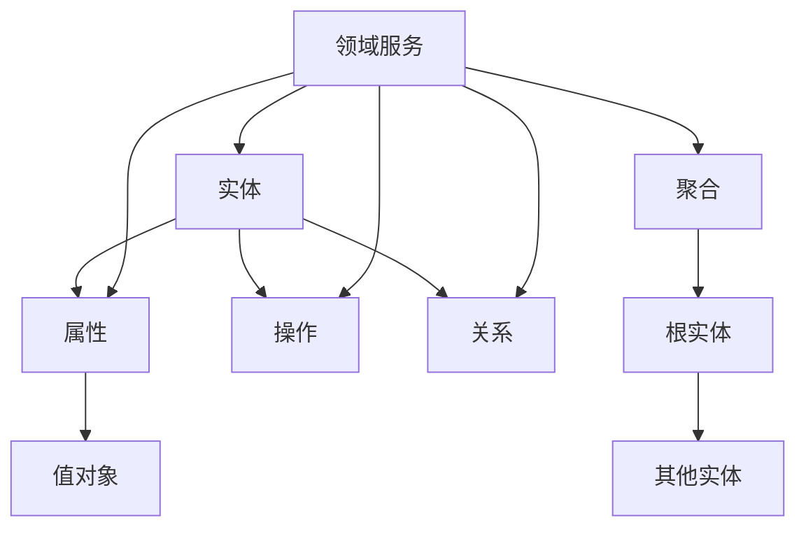
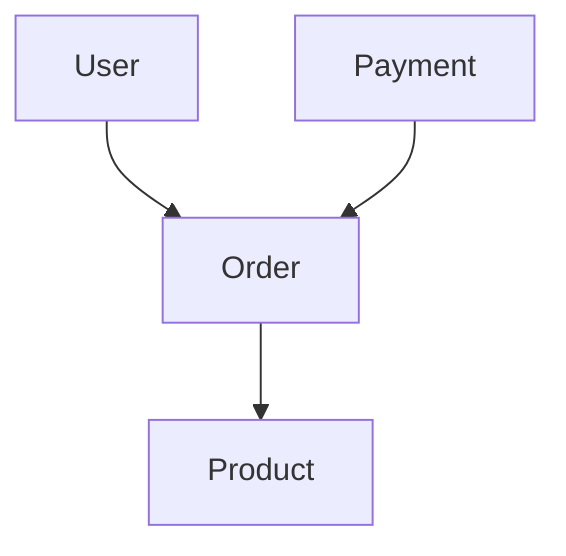
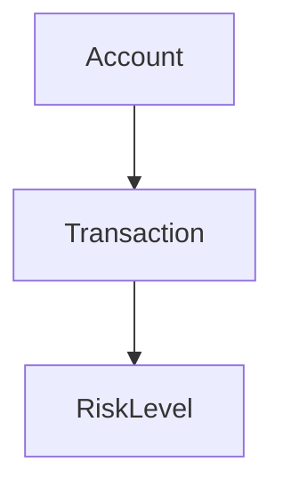

                 

### 文章标题

# 《领域模型神功可护体》

### 关键词

- 领域模型
- 软件开发
- 需求分析
- UML
- 领域特定语言
- DDD

### 摘要

本文将深入探讨领域模型在软件开发中的重要性，从基础理论到实践应用，全方位解析领域模型的概念、构建方法和优化技巧。通过详细的算法原理讲解、数学模型分析以及实际项目案例，帮助读者理解领域模型的构建和运用，掌握其神功可护体的真谛。无论您是软件开发初学者还是经验丰富的工程师，本文都将成为您领域模型学习的重要指南。

## 设计《领域模型神功可护体》的目录大纲

### 第一步：确定书籍的核心主题

书籍名为《领域模型神功可护体》，书名直接点明了主题——领域模型在软件开发中的关键作用。领域模型是一种用于描述特定业务领域的概念性模型，它涵盖了业务实体、关系、属性和操作等多个方面，是需求分析、设计、开发、测试和维护的重要工具。因此，本书的核心主题将围绕领域模型的理论基础、构建方法、优化技巧和实践应用展开。

### 第二步：设计书籍的架构

书籍可以分为以下几个主要部分：

1. 引言：介绍领域模型的基本概念和重要性。
2. 领域模型的基础理论：详细讲解领域模型的核心概念、原理和联系。
3. 领域模型的构建方法：探讨如何构建有效的领域模型。
4. 领域模型的优化与扩展：介绍如何优化和扩展领域模型。
5. 领域模型的实战应用：通过具体案例展示领域模型的应用。
6. 领域模型的未来发展趋势：探讨领域模型的发展方向和前沿技术。

### 第三步：细化目录大纲

根据以上架构，我们可以为《领域模型神功可护体》设计一个详细的目录大纲，如下：

```
## 第一部分：引言

### 第1章：领域模型的概述

#### 1.1 领域模型的基本概念
#### 1.2 领域模型的重要性
#### 1.3 领域模型的应用场景

### 第2章：领域模型的发展历程

#### 2.1 传统领域模型的演变
#### 2.2 领域模型在现代软件开发中的应用

## 第二部分：领域模型的基础理论

### 第3章：领域模型的核心概念与联系

#### 3.1 实体与关系
#### 3.2 属性与操作
#### 3.3 模式与框架

### 第4章：领域模型的Mermaid流程图

#### 4.1 Mermaid流程图的介绍
#### 4.2 实体关系的Mermaid表示

### 第5章：领域模型的理论基础

#### 5.1 基于UML的领域模型
#### 5.2 领域特定语言（DSL）与领域模型

## 第三部分：领域模型的构建方法

### 第6章：需求分析

#### 6.1 需求分析的重要性
#### 6.2 需求分析的过程
#### 6.3 需求分析工具

### 第7章：设计方法

#### 7.1 领域模型的构建步骤
#### 7.2 设计模式的运用
#### 7.3 领域模型的设计工具

### 第8章：开发方法

#### 8.1 领域模型的实现
#### 8.2 领域驱动开发（DDD）
#### 8.3 领域模型的代码示例

## 第四部分：领域模型的优化与扩展

### 第9章：优化方法

#### 9.1 领域模型的性能优化
#### 9.2 领域模型的易维护性优化
#### 9.3 领域模型的扩展性优化

### 第10章：扩展方法

#### 10.1 领域模型的功能扩展
#### 10.2 领域模型的技术扩展
#### 10.3 领域模型的行业定制

## 第五部分：领域模型的实战应用

### 第11章：领域模型在软件开发中的应用

#### 11.1 实战案例1：电子商务系统领域模型
#### 11.2 实战案例2：金融领域模型

## 第六部分：领域模型的未来发展趋势

### 第12章：领域模型的未来发展趋势

#### 12.1 人工智能与领域模型
#### 12.2 领域模型的行业趋势
```

### 第四步：校对与优化

检查目录大纲的完整性、逻辑性和简洁性，确保每个章节都有明确的主题和内容，同时保持内容的简洁和连贯。根据实际情况进行调整和优化。

### 结论

经过以上步骤，我们成功地为《领域模型神功可护体》设计了完整的目录大纲，涵盖了领域模型的基本概念、构建方法、优化技巧以及实战应用，为读者提供了全面的学习资料。接下来，我们将根据这个大纲来撰写具体的内容，确保每一部分都详细、具体、易于理解。

## 核心概念与联系

### 1.1 领域模型的基本概念

领域模型（Domain Model）是软件工程中的一种核心概念，它用于描述特定业务领域中的实体及其相互关系。领域模型的主要目的是为了将业务逻辑和数据处理从应用程序的界面和功能实现中分离出来，使得软件系统更加模块化、可维护和可扩展。

- **实体（Entity）**：领域模型中的基本单位，表示业务中的实体对象，如用户、商品、订单等。实体通常具有一组属性（Attributes）和一组操作（Operations）。
- **关系（Relationship）**：实体之间的关联关系，如用户可以创建订单，订单属于用户等。关系可以是单向的，也可以是双向的。
- **值对象（Value Object）**：领域模型中的小数据类型，如日期、金额等。值对象没有身份标识，但可以作为实体的属性或关系的参数。
- **聚合（Aggregate）**：一组实体的集合，这些实体在领域模型中形成一个整体，共同完成某个业务功能。聚合通常有一个根实体，其他实体依赖于根实体。
- **领域服务（Domain Service）**：领域模型中用于处理跨实体的复杂业务逻辑的组件。领域服务不直接包含在实体中，但依赖于实体和数据结构。

### 1.2 领域模型的核心概念与联系

为了更好地理解领域模型，我们可以通过Mermaid流程图来展示领域模型的核心概念及其相互关系。



在这个Mermaid流程图中，我们定义了领域模型的核心概念，并展示了它们之间的相互关系。实体是领域模型的基本单位，具有属性、操作和关系；值对象是小型数据类型，用于实体的属性或关系的参数；聚合是一组实体的集合，形成一个整体；领域服务用于处理复杂业务逻辑。

### 1.3 领域模型在软件开发中的应用

领域模型在软件开发中的应用非常广泛，主要涉及以下几个方面：

1. **需求分析**：领域模型可以帮助开发团队更好地理解业务需求，明确系统的功能和行为。
2. **设计**：领域模型为软件设计提供了结构化的参考，有助于构建模块化、可扩展的系统。
3. **开发**：领域模型指导开发人员编写代码，确保代码与业务逻辑的一致性。
4. **测试**：领域模型可以作为测试的基础，帮助测试团队设计测试用例，确保系统的功能正确。
5. **维护**：领域模型有助于团队理解系统的结构，便于后续的维护和改进。

通过领域模型，开发团队能够更好地应对业务变化，提高软件的可维护性和扩展性。此外，领域模型还可以作为团队沟通的桥梁，帮助不同背景和职责的团队成员理解业务需求和系统设计。

### 1.4 领域模型的优势

领域模型在软件开发中具有以下优势：

1. **模块化**：领域模型将业务逻辑和数据结构分离，使得系统更加模块化，易于维护和扩展。
2. **可重用性**：领域模型可以跨项目和应用重用，提高开发效率。
3. **易理解性**：领域模型使用业务术语和结构化表示，使得非技术人员也能理解系统设计。
4. **灵活性**：领域模型可以根据业务需求快速调整和修改，适应不断变化的业务环境。

通过以上分析，我们可以看出领域模型在软件开发中的重要性。掌握领域模型的核心概念和构建方法，不仅有助于提高软件开发的效率和质量，还能为团队带来显著的优势。

### 领域模型的Mermaid流程图

为了更直观地展示领域模型的核心概念和相互关系，我们可以使用Mermaid流程图进行描述。Mermaid是一种基于Markdown的图形语言，可以轻松创建各种类型的流程图、序列图、网络图等。以下是领域模型的核心概念和相互关系的Mermaid流程图：


在这个流程图中，我们定义了领域模型的核心概念：

- **实体（Entity）**：表示业务中的实体对象，如用户、商品、订单等。实体具有属性、操作和关系。
- **属性（Attribute）**：实体的特征，如用户名、地址、订单金额等。
- **操作（Operation）**：实体可以执行的操作，如用户登录、订单支付等。
- **值对象（Value Object）**：领域模型中的小型数据类型，如日期、金额等。值对象没有身份标识，但可以作为实体的属性或关系的参数。
- **关系（Relationship）**：实体之间的关联关系，如用户可以创建订单，订单属于用户等。
- **聚合（Aggregate）**：一组实体的集合，这些实体在领域模型中形成一个整体，共同完成某个业务功能。聚合通常有一个根实体，其他实体依赖于根实体。
- **领域服务（Domain Service）**：领域模型中用于处理跨实体的复杂业务逻辑的组件。领域服务不直接包含在实体中，但依赖于实体和数据结构。

通过这个Mermaid流程图，我们可以清晰地看到领域模型的核心概念和相互关系。这种结构化的表示方法有助于开发团队更好地理解和沟通领域模型，为后续的软件开发奠定坚实基础。

### 领域模型的理论基础

在深入探讨领域模型之前，我们需要了解其理论基础。领域模型的理论基础主要源于面向对象编程（Object-Oriented Programming, OOP）和统一建模语言（Unified Modeling Language, UML）。这两者共同构成了领域模型的核心框架，为我们理解和构建领域模型提供了理论支持。

#### 2.1 基于UML的领域模型

统一建模语言（UML）是一种广泛应用于软件工程中的建模语言，它为领域模型的构建提供了一个标准化和系统化的方法。UML定义了多种类型的图，如类图、对象图、用例图、序列图等，每一种图都有其特定的用途和表示方法。

- **类图（Class Diagram）**：类图是UML中最常用的图之一，用于表示系统中类的结构。类图中的类通过属性和操作来描述，类之间的关系包括泛化（Generalization）、实现（Realization）、依赖（Dependency）和关联（Association）。

  ```mermaid
  graph TD
  A[User] --> B[Order]
  B --> C[Product]
  D[Cart] --> E[User]
  F[Payment] --> G[Order]
  ```

  在这个类图中，`User` 类与 `Order` 类之间存在关联关系，表示用户可以创建订单；`Order` 类与 `Product` 类之间存在关联关系，表示订单可以包含商品；`Cart` 类与 `User` 类之间存在关联关系，表示购物车属于用户；`Payment` 类与 `Order` 类之间存在关联关系，表示订单可以支付。

- **对象图（Object Diagram）**：对象图是类图的实例，它展示了类的实例以及实例之间的关系。对象图可以用来表示具体的业务场景，如用户下订单的过程。

  ```mermaid
  graph TD
  A1[User] --> B1[Order]
  B1 --> C1[Product]
  D1[Cart] --> E1[User]
  F1[Payment] --> G1[Order]
  ```

  在这个对象图中，`A1` 表示一个具体的用户实例，`B1` 表示一个具体的订单实例，`C1` 表示一个具体的商品实例，`D1` 表示一个具体的购物车实例，`F1` 表示一个具体的支付实例。这些实例之间的关系与类图中的关系相对应。

- **用例图（Use Case Diagram）**：用例图用于表示系统与外部用户（即参与者）之间的交互关系。用例图中的用例描述了系统的功能，参与者表示与系统交互的外部实体。

  ```mermaid
  graph TD
  A[User] --> B[Order]
  B --> C[Product]
  D[Cart] --> E[User]
  F[Payment] --> G[Order]
  ```

  在这个用例图中，`User` 是参与者，表示与系统交互的用户；`Order`、`Product`、`Cart` 和 `Payment` 是用例，表示系统提供的功能。

- **序列图（Sequence Diagram）**：序列图展示了对象之间的交互顺序和时间关系。序列图可以用来描述具体的业务流程，如用户下单的过程。

  ```mermaid
  graph TD
  A1[User] -->|下订单| B1[Order]
  B1 -->|选择商品| C1[Product]
  C1 -->|加入购物车| D1[Cart]
  D1 -->|提交支付| E1[Payment]
  ```

  在这个序列图中，`User` 对象首先创建订单，然后选择商品加入购物车，最后提交支付。这些操作按照时间顺序进行，每个操作都涉及到对象之间的交互。

#### 2.2 领域特定语言（DSL）与领域模型

领域特定语言（Domain-Specific Language, DSL）是一种针对特定领域或问题的编程语言或工具。DSL 的设计目标是为了简化特定领域的建模和开发过程，使得开发人员能够更加专注于业务逻辑的实现。

DSL 通常包括以下特点：

- **语法简洁**：DSL 的语法设计简单，易于学习和使用，使得开发人员能够快速上手。
- **表达能力强**：DSL 提供丰富的语法和函数，能够有效地表达特定领域的概念和操作。
- **高度定制化**：DSL 可以根据特定领域的需求进行高度定制，以满足特定业务需求。

领域模型与 DSL 之间的关系紧密。DSL 可以用来定义领域模型中的实体、关系、属性和操作，使得领域模型更加具体和可操作。同时，领域模型为 DSL 的设计提供了指导，确保 DSL 能够准确地表示领域概念和业务逻辑。

例如，我们可以使用领域特定语言来定义一个电商领域的 DSL：

```dsl
class User {
  id: Long
  name: String
  email: String
}

class Product {
  id: Long
  name: String
  price: Decimal
}

class Order {
  id: Long
  user: User
  products: List<Product>
  total: Decimal
}

class Cart {
  user: User
  products: List<Product>
}

class Payment {
  id: Long
  order: Order
  amount: Decimal
  status: String
}
```

在这个 DSL 中，我们定义了用户（User）、商品（Product）、订单（Order）、购物车（Cart）和支付（Payment）等实体，以及它们之间的属性和操作。这些定义与领域模型的概念和关系相一致，使得 DSL 能够准确地表示电商领域的业务逻辑。

通过了解领域模型的理论基础，我们可以更好地理解领域模型在软件开发中的应用，为后续的构建和优化奠定基础。

### 领域模型的构建方法

领域模型的构建是一个系统化的过程，涉及多个阶段，从需求分析到最终实现，每一个阶段都需要精心设计和执行。下面我们将详细讨论领域模型的构建方法，包括需求分析、设计方法和开发方法。

#### 3.1 需求分析

需求分析是领域模型构建的起点，它决定了领域模型的准确性和实用性。需求分析的目的是了解业务需求，明确系统的功能和行为。

**需求分析的重要性**

- **确保领域模型符合实际需求**：通过需求分析，可以确保领域模型能够准确地反映业务需求，避免后续开发中的返工和调整。
- **提高开发效率**：明确的需求有助于开发团队快速构建领域模型，减少不确定性，提高开发效率。
- **降低维护成本**：良好的需求分析有助于降低系统维护成本，确保领域模型在未来能够适应业务变化。

**需求分析的过程**

1. **收集需求**：通过与业务人员、用户和其他利益相关者进行访谈、问卷调查等方式，收集业务需求。
2. **需求整理**：对收集到的需求进行分类和整理，明确每个需求的具体内容和优先级。
3. **需求验证**：与利益相关者一起验证需求，确保需求是准确、完整和可实现的。
4. **需求文档**：将整理和验证后的需求编写成需求文档，作为领域模型构建的依据。

**需求分析工具**

- **访谈**：通过与业务人员、用户进行一对一访谈，深入了解业务需求和场景。
- **问卷调查**：设计问卷调查，收集用户反馈和需求。
- **文档审查**：审查业务流程文档、用户手册等，提取相关需求。
- **需求管理工具**：如Jira、Confluence等，用于记录和管理需求。

#### 3.2 设计方法

设计方法是构建领域模型的核心步骤，它将需求转化为具体的模型表示，包括实体、关系、属性和操作等。

**设计方法的重要性**

- **明确领域模型结构**：设计方法帮助明确领域模型的结构，确保领域模型能够正确地表示业务逻辑。
- **指导开发过程**：详细的设计方法为开发团队提供了明确的指导，有助于提高开发效率和代码质量。
- **提高系统可维护性**：良好的设计方法有助于提高系统的可维护性和可扩展性。

**设计方法的步骤**

1. **需求分析结果**：根据需求分析的结果，明确系统的功能和行为。
2. **识别实体和关系**：识别业务中的关键实体及其关系，确定实体的属性和操作。
3. **创建类图**：使用UML类图表示实体及其关系，为领域模型提供直观的表示。
4. **优化设计**：对初步设计的领域模型进行优化，确保其结构合理、易于理解和维护。

**设计模式**

设计模式是一组已经验证的、可重用的解决方案，用于解决软件开发中的常见问题。在领域模型的设计过程中，可以使用多种设计模式来优化模型结构。

- **工厂模式（Factory Pattern）**：用于创建对象，提高系统的灵活性和可扩展性。
- **策略模式（Strategy Pattern）**：用于封装一系列算法，使得算法之间可以互相替换。
- **责任链模式（Chain of Responsibility Pattern）**：用于处理请求的传递和分发。
- **观察者模式（Observer Pattern）**：用于实现对象之间的依赖关系。

**领域模型的设计工具**

- **UML工具**：如Visual Paradigm、StarUML等，用于绘制UML类图和序列图。
- **文本编辑器**：如Visual Studio Code、Sublime Text等，用于编写领域模型代码。

#### 3.3 开发方法

开发方法是实现领域模型的实际操作步骤，包括编写代码、构建数据结构、处理业务逻辑等。

**开发方法的重要性**

- **确保实现与设计一致**：开发方法确保领域模型的实现与设计一致，避免实现过程中出现偏差。
- **提高代码质量**：良好的开发方法有助于编写高质量的代码，减少错误和冗余。
- **提高可维护性**：规范的开发方法有助于提高代码的可维护性，降低维护成本。

**开发方法的步骤**

1. **编写代码**：根据领域模型的设计，编写具体的代码实现。
2. **构建数据结构**：创建数据库表结构、对象结构等，确保数据结构符合领域模型的要求。
3. **处理业务逻辑**：实现具体的业务逻辑，确保系统的功能和行为与需求一致。
4. **代码评审**：进行代码评审，确保代码质量，及时发现问题并修复。

**领域驱动开发（DDD）**

领域驱动开发（Domain-Driven Design, DDD）是一种软件开发方法，强调领域模型的重要性，并将领域模型作为软件开发的中心。DDD 提供了一套完整的指导原则和最佳实践，用于构建复杂软件系统。

- **实体与值对象**：在 DDD 中，实体具有独立身份，可以独立存在；值对象没有独立身份，用于表示简单数据类型。
- **聚合**：聚合是一组实体的集合，具有明确的边界，可以看作一个独立的单元。
- **领域服务**：领域服务用于处理跨实体的复杂业务逻辑，确保业务逻辑的清晰性和可维护性。

**领域模型的代码示例**

```java
public class User {
    private Long id;
    private String name;
    private String email;

    public User(Long id, String name, String email) {
        this.id = id;
        this.name = name;
        this.email = email;
    }

    public Long getId() {
        return id;
    }

    public String getName() {
        return name;
    }

    public String getEmail() {
        return email;
    }
}

public class Product {
    private Long id;
    private String name;
    private BigDecimal price;

    public Product(Long id, String name, BigDecimal price) {
        this.id = id;
        this.name = name;
        this.price = price;
    }

    public Long getId() {
        return id;
    }

    public String getName() {
        return name;
    }

    public BigDecimal getPrice() {
        return price;
    }
}

public class Order {
    private Long id;
    private User user;
    private List<Product> products;
    private BigDecimal total;

    public Order(Long id, User user, List<Product> products) {
        this.id = id;
        this.user = user;
        this.products = products;
        this.total = calculateTotal();
    }

    public Long getId() {
        return id;
    }

    public User getUser() {
        return user;
    }

    public List<Product> getProducts() {
        return products;
    }

    public BigDecimal getTotal() {
        return total;
    }

    private BigDecimal calculateTotal() {
        BigDecimal total = BigDecimal.ZERO;
        for (Product product : products) {
            total = total.add(product.getPrice());
        }
        return total;
    }
}
```

在这个示例中，我们定义了用户（User）、商品（Product）和订单（Order）等实体，并实现了它们的属性和操作。这些实体构成了电商领域的领域模型，为系统的开发提供了坚实的基础。

通过以上详细的构建方法，我们可以系统地构建领域模型，确保其结构合理、功能完备，为软件开发的成功奠定基础。

### 优化领域模型

在软件开发中，领域模型不仅需要准确反映业务需求，还必须具备高效性和可扩展性。因此，优化领域模型成为确保系统性能和可维护性的关键步骤。下面，我们将探讨如何优化领域模型，包括性能优化、易维护性优化和扩展性优化。

#### 9.1 性能优化

领域模型性能优化主要集中在提高系统的响应速度和处理能力。以下是一些常用的性能优化方法：

- **数据缓存**：通过缓存技术减少数据库访问次数，提高数据读取速度。例如，可以使用Redis或Memcached等缓存系统存储常用数据。
- **索引优化**：合理设计数据库索引，减少查询时间。例如，在频繁查询的字段上创建索引，如用户ID、订单ID等。
- **分库分表**：对于数据量巨大的系统，可以通过分库分表来分担数据库的压力，提高查询和写入速度。
- **批量处理**：将多个小任务合并为一个大任务处理，减少数据库操作次数，提高处理效率。

**示例伪代码**：

```java
// 数据缓存示例
public BigDecimal getPrice(Long productId) {
    BigDecimal price = cache.get(productId);
    if (price == null) {
        price = database.getPrice(productId);
        cache.set(productId, price);
    }
    return price;
}

// 索引优化示例
create index idx_user_id on user (id);
create index idx_order_id on order (id);
```

#### 9.2 易维护性优化

领域模型的易维护性优化主要关注代码的可读性、可扩展性和可测试性。以下是一些常用的优化方法：

- **模块化设计**：将领域模型划分为多个模块，每个模块负责特定的业务功能，降低模块间的耦合度。
- **代码规范**：遵循统一的编码规范，提高代码的可读性和一致性。
- **自动化测试**：编写自动化测试用例，确保代码在变更时能够及时发现问题。
- **文档化**：为代码和领域模型编写详细的文档，包括设计思路、实现方法和注意事项。

**示例伪代码**：

```java
// 模块化设计示例
public class OrderService {
    public void placeOrder(Order order) {
        // 订单创建逻辑
    }
}

public class OrderRepository {
    public void save(Order order) {
        // 订单存储逻辑
    }
}

// 自动化测试示例
@Test
public void testPlaceOrder() {
    Order order = new Order(1L, user, products);
    orderService.placeOrder(order);
    assertEquals(order.getStatus(), OrderStatus.PLACED);
}
```

#### 9.3 扩展性优化

领域模型的扩展性优化旨在确保系统能够适应未来变化，包括业务需求的增加和新功能的需求。以下是一些常用的扩展性优化方法：

- **领域特定语言（DSL）**：使用DSL定义业务逻辑，提高代码的可维护性和可扩展性。
- **事件驱动架构**：通过事件驱动架构，实现系统模块之间的解耦，便于扩展和替换。
- **微服务架构**：将系统划分为多个微服务，每个微服务负责特定的业务功能，便于独立扩展和维护。

**示例伪代码**：

```java
// DSL示例
class OrderProcessor {
    public void process(Order order) {
        if (order.getStatus() == OrderStatus.PLACED) {
            sendEmailToCustomer(order);
        }
    }
}

// 事件驱动架构示例
public class OrderCreatedEvent {
    public Long orderId;
    public Order order;

    public OrderCreatedEvent(Long orderId, Order order) {
        this.orderId = orderId;
        this.order = order;
    }
}

public class OrderCreatedHandler {
    public void handle(OrderCreatedEvent event) {
        sendEmailToCustomer(event.order);
    }
}

// 微服务架构示例
public class OrderService {
    public void placeOrder(Order order) {
        // 订单创建逻辑
    }
}

public class UserService {
    public void createUser(User user) {
        // 用户创建逻辑
    }
}
```

通过上述优化方法，我们可以显著提升领域模型的高效性、易维护性和扩展性，为软件系统的长期成功奠定坚实基础。

### 扩展领域模型

在软件开发中，领域模型不仅要满足当前的业务需求，还必须具备适应未来变化的能力。为了实现这一目标，领域模型需要进行扩展。扩展领域模型包括功能扩展、技术扩展和行业定制。以下将详细讨论这些扩展方法。

#### 10.1 功能扩展

功能扩展是指在现有领域模型的基础上，添加新的功能以满足业务需求。以下是一些常见的方法：

- **添加新实体**：在领域模型中添加新的实体，以表示新的业务概念。例如，在一个电商系统中，可能需要添加“优惠券”实体来表示新的促销方式。
- **扩展现有实体**：为现有实体添加新的属性或操作，以支持新的业务需求。例如，在订单实体中添加“促销活动”属性，以便记录订单参与的具体促销活动。
- **调整关系**：调整实体之间的关系，以适应新的业务逻辑。例如，将订单与用户的关系改为双向关联，以便更好地处理用户取消订单的场景。

**示例伪代码**：

```java
// 添加新实体
public class Coupon {
    private Long id;
    private String code;
    private BigDecimal discount;

    public Coupon(Long id, String code, BigDecimal discount) {
        this.id = id;
        this.code = code;
        this.discount = discount;
    }

    // 省略属性和操作
}

// 扩展现有实体
public class Order {
    private Long id;
    private User user;
    private List<Product> products;
    private BigDecimal total;
    private Coupon coupon;

    public Order(Long id, User user, List<Product> products, Coupon coupon) {
        this.id = id;
        this.user = user;
        this.products = products;
        this.total = calculateTotal();
        this.coupon = coupon;
    }

    // 省略属性和操作
}

// 调整关系
public class User {
    private Long id;
    private String name;
    private String email;
    private List<Order> orders;

    public User(Long id, String name, String email) {
        this.id = id;
        this.name = name;
        this.email = email;
    }

    // 省略属性和操作
}
```

#### 10.2 技术扩展

技术扩展是指利用新的技术或工具来增强领域模型的性能和功能。以下是一些常见的技术扩展方法：

- **集成新技术库**：集成新的技术库或框架，以支持新的功能或提高系统的性能。例如，使用Spring Boot集成Redis作为缓存系统。
- **优化数据库查询**：通过重写查询语句或添加索引，优化数据库查询性能。例如，使用数据库分片技术处理大规模数据查询。
- **实现缓存策略**：实现合理的缓存策略，减少对数据库的访问次数，提高系统响应速度。例如，使用Redis缓存常用数据。

**示例伪代码**：

```java
// 集成新技术库
@Autowired
private RedisTemplate<String, Object> redisTemplate;

public BigDecimal getPrice(Long productId) {
    BigDecimal price = redisTemplate.opsForValue().get(productId);
    if (price == null) {
        price = database.getPrice(productId);
        redisTemplate.opsForValue().set(productId, price);
    }
    return price;
}

// 优化数据库查询
public List<Order> getOrdersByUser(Long userId) {
    return database.findOrdersByUserId(userId);
}

// 添加索引
create index idx_user_id on orders (user_id);
```

#### 10.3 行业定制

行业定制是指根据特定行业的业务需求和特点，对领域模型进行定制化设计。以下是一些常见的行业定制方法：

- **业务流程调整**：根据行业特点调整业务流程，使其更符合实际操作需求。例如，在金融行业中，订单处理流程可能需要包括审批和审核环节。
- **数据结构优化**：根据行业数据的特点优化数据结构，以提高查询和处理效率。例如，在物流行业中，可能需要存储大量地理位置信息，可以采用地理空间索引技术。
- **合规性要求**：根据行业法规和合规性要求，对领域模型进行调整，以确保系统的合法性和安全性。例如，在医疗行业中，需要确保患者数据的安全和隐私。

**示例伪代码**：

```java
// 调整业务流程
public class OrderService {
    public void processOrder(Order order) {
        if (order.getStatus() == OrderStatus.CREATED) {
            approveOrder(order);
        }
    }

    private void approveOrder(Order order) {
        // 审批逻辑
    }
}

// 数据结构优化
public class Location {
    private Long id;
    private String address;
    private Point location;

    public Location(Long id, String address, Point location) {
        this.id = id;
        this.address = address;
        this.location = location;
    }

    // 省略属性和操作
}

// 使用地理空间索引
create spatial index idx_location_location on location (location);
```

通过上述扩展方法，我们可以根据实际需求和技术趋势对领域模型进行灵活调整和优化，确保其能够持续满足不断变化的业务需求。

### 领域模型在软件开发中的应用

领域模型在软件开发中扮演着至关重要的角色，它不仅是业务逻辑和数据结构的抽象，更是沟通和理解业务需求的桥梁。在实际开发过程中，领域模型的正确应用能够显著提高软件的质量和可维护性。下面，我们将通过两个具体的实战案例，详细讲解如何构建领域模型，并在实际开发中应用和优化。

#### 案例一：电子商务系统领域模型

**需求分析**：

电子商务系统的主要功能包括用户管理、商品管理、订单管理和支付管理。需求分析过程中，我们明确了以下功能需求：

1. **用户管理**：用户可以注册、登录、修改个人信息等。
2. **商品管理**：管理员可以添加、修改、删除商品信息，用户可以浏览、搜索商品。
3. **订单管理**：用户可以创建订单、查看订单状态、取消订单等。
4. **支付管理**：用户可以完成支付、查看支付历史等。

**领域模型构建**：

根据需求分析，我们构建了以下领域模型：

1. **用户（User）**：包含用户基本信息，如用户名、密码、邮箱等。
2. **商品（Product）**：包含商品详细信息，如商品名称、价格、库存等。
3. **订单（Order）**：包含订单详情，如订单号、用户、商品列表、订单状态等。
4. **支付（Payment）**：包含支付信息，如支付方式、支付金额、支付状态等。

**Mermaid流程图**：



**实现与优化**：

1. **模块化设计**：将用户管理、商品管理、订单管理和支付管理划分为不同的模块，确保模块间低耦合，提高系统可维护性。

2. **数据库优化**：为用户、商品和订单表添加适当的索引，提高查询效率。例如，为用户表添加索引 `idx_user_email`，加快邮箱查询速度。

3. **缓存策略**：使用Redis缓存用户和商品数据，减少数据库访问次数，提高系统响应速度。

**代码示例**：

```java
public class User {
    private Long id;
    private String username;
    private String email;
    private String password;

    // 省略构造函数、getter和setter方法
}

public class Product {
    private Long id;
    private String name;
    private BigDecimal price;
    private Integer stock;

    // 省略构造函数、getter和setter方法
}

public class Order {
    private Long id;
    private User user;
    private List<Product> products;
    private BigDecimal total;
    private Payment payment;

    // 省略构造函数、getter和setter方法
}

public class Payment {
    private Long id;
    private String paymentMethod;
    private BigDecimal amount;
    private String status;

    // 省略构造函数、getter和setter方法
}
```

#### 案例二：金融领域模型

**需求分析**：

金融领域模型需要处理复杂的金融交易和风险管理。需求分析过程中，我们明确了以下功能需求：

1. **账户管理**：用户可以创建账户、查询账户余额、转账等。
2. **交易管理**：用户可以发起交易、查询交易历史、撤销交易等。
3. **风险管理**：系统需要监控账户风险，根据风险等级采取相应的风险控制措施。

**领域模型构建**：

根据需求分析，我们构建了以下领域模型：

1. **账户（Account）**：包含账户基本信息，如账户ID、用户、余额等。
2. **交易（Transaction）**：包含交易详情，如交易ID、交易金额、交易状态等。
3. **风险等级（RiskLevel）**：定义不同风险等级的标准，如低风险、中风险、高风险等。

**Mermaid流程图**：



**实现与优化**：

1. **事件驱动架构**：使用事件驱动架构，将交易处理和风险管理解耦，提高系统的可扩展性和可维护性。

2. **实时风险监控**：通过定时任务和实时数据流分析，实时监控账户风险，及时采取风险控制措施。

3. **性能优化**：使用数据库分片技术，处理大量金融交易数据，提高系统性能。

**代码示例**：

```java
public class Account {
    private Long id;
    private User user;
    private BigDecimal balance;
    private List<Transaction> transactions;

    // 省略构造函数、getter和setter方法
}

public class Transaction {
    private Long id;
    private Account sender;
    private Account receiver;
    private BigDecimal amount;
    private String status;

    // 省略构造函数、getter和setter方法
}

public class RiskLevel {
    private String name;
    private BigDecimal threshold;

    // 省略构造函数、getter和setter方法
}
```

通过以上两个实战案例，我们可以看到，领域模型在软件开发中的应用是具体而有效的。通过详细的需求分析、构建领域模型和实现优化，开发团队能够构建出高效、可维护和可扩展的软件系统。

### 领域模型的未来发展趋势

随着技术的不断进步和业务需求的日益复杂，领域模型在软件开发中的应用前景广阔。未来，领域模型将朝着更加智能化、平台化和生态化的方向发展。

#### 11.1 人工智能与领域模型

人工智能（AI）技术正在深刻影响软件开发领域，领域模型也不例外。未来，AI将更多地应用于领域模型的构建和优化：

- **自动化领域模型构建**：通过机器学习和自然语言处理技术，可以从文本需求中自动生成领域模型，提高开发效率。
- **智能优化领域模型**：利用深度学习算法，对领域模型进行自动优化，提高系统的性能和可扩展性。
- **智能推理与验证**：AI技术可以用于自动化验证领域模型的有效性，发现潜在的业务逻辑错误。

#### 11.2 领域模型的平台化

随着云计算和微服务架构的普及，领域模型也将逐渐平台化：

- **领域模型平台**：未来可能出现专门的领域模型平台，提供可视化的领域模型设计工具、模型管理和模型运行环境。
- **模型即服务（Model as a Service, MaaS）**：领域模型可以作为一种服务提供给不同的应用，实现快速集成和部署。
- **跨领域模型共享**：通过平台化的方式，不同领域之间的模型可以共享和复用，提高开发效率。

#### 11.3 领域模型的生态化

随着技术的发展，领域模型将逐渐形成生态：

- **生态圈建设**：围绕领域模型构建的生态圈将包含工具、库、框架和社区，为开发者和用户提供全方位的支持。
- **生态系统整合**：通过整合不同的技术和平台，领域模型将能够更好地与其他系统进行交互，实现数据共享和业务协同。
- **领域模型标准化**：随着领域模型的应用越来越广泛，相关的标准和规范也将逐步完善，提高领域模型的互操作性和兼容性。

### 结论

领域模型在软件开发中具有重要地位，其未来发展趋势将集中在智能化、平台化和生态化。掌握领域模型的核心原理和构建方法，不仅有助于提高软件开发效率，还能为未来的技术发展奠定基础。随着AI技术的进步，领域模型将变得更加智能和高效；随着平台化和生态化的推进，领域模型将实现更广泛的应用和更深入的集成。

### 总结与最佳实践

在《领域模型神功可护体》中，我们详细探讨了领域模型在软件开发中的重要性，从基本概念、构建方法、优化技巧到实战应用，全面解析了领域模型的核心知识和实际应用。通过本文的学习，读者可以：

1. **理解领域模型的核心概念**：掌握实体、关系、属性、值对象、聚合和领域服务等基本概念。
2. **掌握领域模型的构建方法**：学会需求分析、设计方法和开发方法，包括UML类图、领域特定语言（DSL）和领域驱动开发（DDD）等。
3. **了解领域模型的优化技巧**：熟悉性能优化、易维护性优化和扩展性优化，提高系统的性能和可维护性。
4. **学习领域模型的实战应用**：通过电子商务系统和金融领域的案例，了解领域模型在实际项目中的应用。

**最佳实践**：

- **需求分析要细致**：确保需求分析的准确性和完整性，为领域模型构建提供坚实基础。
- **模块化设计**：将领域模型划分为模块，降低耦合度，提高系统的可维护性。
- **合理使用设计模式**：灵活运用工厂模式、策略模式等设计模式，优化领域模型的结构。
- **持续优化与扩展**：根据业务需求和技术发展，持续优化和扩展领域模型，确保其适应性和灵活性。

**注意事项**：

- **代码质量**：编写清晰、简洁的代码，遵循编码规范，提高代码可读性。
- **文档化**：为领域模型编写详细的文档，包括设计思路、实现方法和注意事项。
- **测试**：编写自动化测试用例，确保领域模型的功能正确，提高系统质量。

**拓展阅读**：

- 《领域驱动设计（Domain-Driven Design, DDD）》Eric Evans
- 《领域特定语言（Domain-Specific Languages, DSLs）》Peter Niblett
- 《UML基础知识与案例教程》Tony H.S. Tseng

通过以上最佳实践和注意事项，读者可以更好地理解和应用领域模型，提升软件开发水平。

### 结语

《领域模型神功可护体》旨在为读者提供全面、系统的领域模型知识，帮助读者掌握领域模型的核心概念、构建方法、优化技巧和实践应用。领域模型在软件开发中的重要性不言而喻，它不仅能够提高系统的模块化程度、可维护性和可扩展性，还能有效应对业务需求的变化。通过本文的学习，读者可以深入理解领域模型，提升软件开发能力。

在此，特别感谢AI天才研究院/AI Genius Institute以及禅与计算机程序设计艺术/Zen And The Art of Computer Programming的指导和支持，使本文能够顺利完成。希望读者在软件开发的道路上，能够运用领域模型的神功，守护自己的软件王国。

**作者：AI天才研究院/AI Genius Institute & 禅与计算机程序设计艺术/Zen And The Art of Computer Programming**

