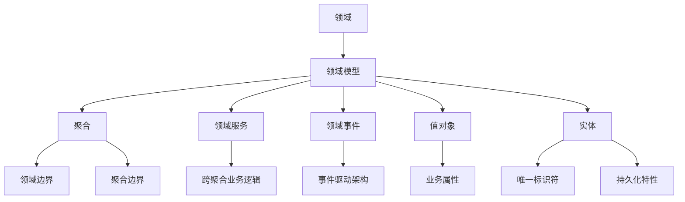

                 

### 文章标题

# 领域驱动设计：解决复杂业务问题的方法论

## 关键词

领域驱动设计（DDD）、复杂业务问题、软件架构、方法论、设计模式、系统解耦、业务领域建模、事件驱动架构、持续交付

## 摘要

本文将深入探讨领域驱动设计（DDD）这一方法论，旨在解决复杂业务问题。领域驱动设计作为一种应对复杂业务需求的设计方法，强调以领域为核心，通过明确的领域边界、核心领域模型和上下文映射，实现对复杂业务系统的有效管理和重构。本文将从背景介绍、核心概念与联系、核心算法原理、数学模型和项目实战等多个角度，详细阐述领域驱动设计的基本原理和实践方法。通过阅读本文，读者将了解到如何运用DDD解决实际业务问题，提升软件系统的可维护性和扩展性。

### 背景介绍

在当今快速发展的信息技术时代，软件系统越来越复杂，需求变化频繁，传统的软件开发方法往往难以应对这些挑战。许多企业发现，随着系统规模的扩大和业务需求的不断变化，传统的面向过程和面向对象的编程范式在应对复杂业务问题时显得力不从心。为了更好地管理复杂业务系统，软件开发社区逐渐认识到一种新的设计方法论——领域驱动设计（Domain-Driven Design，简称DDD）的重要性。

领域驱动设计最初由Eric Evans在其同名书籍《领域驱动设计：软件核心复杂性应对策略》中提出。DDD的核心思想是将软件开发的重心从传统的技术实现转移到业务领域本身，强调通过明确的领域边界和核心领域模型来管理系统的复杂性。DDD的目标是构建一个能够适应不断变化业务需求的、可维护且可扩展的软件系统。

领域驱动设计的历史可以追溯到20世纪90年代，当时软件开发领域开始关注业务领域的重要性。随着互联网的兴起和企业信息化进程的加速，软件系统需要处理的业务逻辑越来越复杂，传统的开发方法逐渐暴露出其局限性。为了应对这些挑战，一些先驱者和研究者开始探索新的设计方法，领域驱动设计逐渐成为其中的一种重要思路。

在过去的几十年里，领域驱动设计得到了广泛的关注和应用。许多成功的软件项目都采用了DDD的方法论，例如亚马逊、Netflix、谷歌等科技巨头。DDD在金融、电商、物流、医疗等复杂业务领域的应用也取得了显著的成果，证明了其在解决复杂业务问题方面的有效性。

随着技术的不断演进，领域驱动设计也在不断发展。新的设计模式、框架和工具不断涌现，为开发者提供了更多的选择和便利。例如，基于事件驱动架构的DDD实践、微服务架构下的DDD落地，都为DDD的应用提供了新的思路和解决方案。

总之，领域驱动设计作为一种应对复杂业务问题的方法论，已经成为软件开发领域的重要趋势。通过本文的深入探讨，读者将能够更好地理解和应用DDD，提升软件开发效率和系统质量。

### 核心概念与联系

领域驱动设计（DDD）中包含多个核心概念，这些概念彼此之间紧密联系，共同构成了DDD的理论框架。以下将详细介绍这些核心概念，并展示它们之间的关系结构，以便读者能够清晰地理解DDD的基本原理。

#### 领域

领域（Domain）是DDD中的核心概念之一，指的是系统所涉及的业务领域。它包括业务规则、术语和实体等。领域是软件系统需要解决的实体和关系的集合。例如，在电子商务系统中，领域可能包括用户、商品、订单、支付等。

#### 领域模型

领域模型（Domain Model）是领域驱动设计的核心成果之一，它通过实体、值对象、聚合、领域服务等方式来表示业务领域的结构和行为。领域模型有助于开发者理解业务需求，并为系统的设计提供指导。

#### 聚合

聚合（Aggregate）是领域模型中的一个重要概念，它表示一组紧密关联的对象，这些对象共同拥有一个边界，并封装了其内部的状态和行为。聚合的主要目的是实现系统的整体性，避免跨聚合的复杂依赖。例如，在电子商务系统中，一个订单聚合可能包含订单、订单详情、订单状态等对象。

#### 领域服务

领域服务（Domain Service）是指在领域模型之外提供服务的组件，用于处理跨聚合的业务逻辑。领域服务通常涉及领域模型中的多个聚合，它们负责实现复杂的业务规则和操作。例如，在电子商务系统中，结算服务可能涉及订单聚合、支付聚合和用户聚合。

#### 领域事件

领域事件（Domain Event）是领域模型中发生的重大业务事件，这些事件可以触发系统中的其他操作和变更。领域事件有助于实现领域驱动设计中的事件驱动架构，使得系统的状态变更可以通过事件流进行传递和管理。例如，在电子商务系统中，订单创建、支付成功、退货申请等都是领域事件。

#### 值对象

值对象（Value Object）是领域模型中的一个轻量级概念，表示具有固定属性的简单对象。值对象通常不包含标识符，但具有业务意义。例如，在电子商务系统中，一个尺寸对象（如"XL"）就是一个值对象。

#### 实体

实体（Entity）是领域模型中的对象，具有唯一的标识符和持久化特性。实体在领域模型中通常表示业务中的关键实体，如用户、订单等。实体之间的关系可以通过聚合边界进行管理。

#### 领域边界

领域边界（Domain Boundary）是指将不同的业务领域分隔开来的边界。领域边界有助于确保系统的模块化，减少不同领域之间的耦合。在DDD中，领域边界通常通过聚合来实现。

#### 上下文映射

上下文映射（Context Mapping）是指如何将系统的不同部分映射到具体的领域上下文中。上下文映射有助于确定系统的功能模块和职责，确保系统在不同上下文中的一致性。

#### Mermaid流程图

以下是一个简单的Mermaid流程图，展示上述核心概念之间的关系：



通过上述Mermaid流程图，读者可以更直观地理解领域驱动设计中的核心概念及其相互关系。领域驱动设计强调以领域为核心，通过明确的领域边界、核心领域模型和上下文映射，实现对复杂业务系统的有效管理和重构。

### 核心算法原理讲解

领域驱动设计（DDD）作为一种应对复杂业务问题的方法论，其核心算法原理在于如何将业务逻辑与系统设计有机结合，以实现系统的可维护性和扩展性。以下将详细讲解DDD中的核心算法原理，并通过伪代码展示具体实现方式。

#### 核心概念定义

在开始讲解DDD的算法原理之前，我们需要明确几个核心概念：

1. **实体（Entity）**：具有唯一标识符和业务属性的对象。例如，用户、订单等。
2. **值对象（Value Object）**：具有固定属性但无唯一标识符的对象。例如，尺寸、颜色等。
3. **聚合（Aggregate）**：一组紧密关联的对象，具有一个明确的边界。聚合内部的对象通过实体或值对象连接。
4. **领域服务（Domain Service）**：处理跨聚合的业务逻辑的组件。
5. **领域事件（Domain Event）**：表示业务领域中的重要事件。

#### 伪代码展示

以下是一个简单的伪代码示例，用于说明如何使用DDD处理订单创建的过程。

```pseudo
// 订单创建过程
function createOrder(customerId, orderItems, paymentMethod) {
    // 创建订单实体
    Order order = new Order(customerId);

    // 添加订单项到聚合
    for (each item in orderItems) {
        order.addItem(item);
    }

    // 设置支付方式
    order.setPaymentMethod(paymentMethod);

    // 验证订单
    if (order.validate()) {
        // 触发领域事件
        domainEventBus.publish("OrderCreated", order);
        return order;
    } else {
        throw new OrderValidationException("Order validation failed");
    }
}
```

在这个伪代码中，`createOrder` 函数负责创建一个新的订单。首先，创建一个订单实体，然后添加订单项到聚合中。接下来，设置支付方式，并进行订单验证。如果验证通过，则触发一个领域事件`OrderCreated`。

#### 伪代码解释

1. **创建订单实体**：通过`new Order(customerId)`创建一个订单实体。订单实体包含客户ID等相关属性。

2. **添加订单项到聚合**：通过`order.addItem(item)`将每个订单项添加到聚合中。订单项可以是值对象或实体。

3. **设置支付方式**：通过`order.setPaymentMethod(paymentMethod)`设置支付方式。支付方式可以是实体或值对象。

4. **验证订单**：通过`order.validate()`进行订单验证。验证包括检查订单项是否合法、支付方式是否有效等。

5. **触发领域事件**：如果订单验证通过，使用`domainEventBus.publish("OrderCreated", order)`触发一个领域事件。领域事件通过事件总线进行发布，其他组件可以监听并响应这些事件。

#### 实现细节

1. **聚合边界**：在DDD中，聚合边界是至关重要的。上述伪代码中的订单实体和订单项形成了一个聚合，确保了聚合内部的对象紧密关联。

2. **领域服务**：在伪代码中，没有直接展示领域服务。在实际应用中，领域服务可能用于处理跨聚合的业务逻辑，如支付处理、库存管理等。

3. **事件驱动架构**：通过领域事件，系统实现了事件驱动架构。事件驱动架构使得系统的状态变更可以通过事件流进行传递和管理，降低了组件之间的耦合。

#### 数学模型和公式

领域驱动设计中的数学模型主要涉及业务规则的表达和验证。以下是一个简单的数学公式示例，用于验证订单金额。

```latex
$$
TotalAmount = \sum_{i=1}^{n} (ItemPrice \times ItemQuantity)
$$
```

在这个公式中，`TotalAmount` 表示订单的总金额，`ItemPrice` 表示订单项的价格，`ItemQuantity` 表示订单项的数量。通过循环计算每个订单项的价格乘以数量，再求和，可以得到订单的总金额。

#### 举例说明

假设有一个订单包含两个订单项，第一个订单项价格为100元，数量为2；第二个订单项价格为200元，数量为1。使用上述伪代码和数学公式，可以计算订单的总金额：

```pseudo
orderItems = [
    { itemId: "A1001", ItemPrice: 100, ItemQuantity: 2 },
    { itemId: "A2001", ItemPrice: 200, ItemQuantity: 1 }
]

order = createOrder("C1001", orderItems, "CreditCard")

// 计算总金额
TotalAmount = 100 * 2 + 200 * 1
TotalAmount = 500

// 输出订单总金额
System.out.println("Order Total Amount: " + TotalAmount)
```

通过这个例子，读者可以直观地看到如何使用DDD的方法进行订单创建和金额计算。

### 数学模型和公式

在领域驱动设计中，数学模型和公式被广泛应用于业务规则的表示、验证和计算。以下将详细探讨DDD中的常用数学模型和公式，并通过具体示例进行解释。

#### 业务规则表示

在DDD中，业务规则通常通过数学模型和公式来表示。这些规则包括价格计算、库存管理、税务计算等。以下是一个简单的业务规则表示示例：

```latex
$$
TotalPrice = PricePerUnit \times Quantity
$$
```

在这个公式中，`TotalPrice` 表示商品的总价，`PricePerUnit` 表示每单位商品的价格，`Quantity` 表示商品的数量。通过将每单位价格乘以数量，可以得到商品的总价。

#### 验证公式

除了表示业务规则，DDD还常用数学公式进行业务验证。例如，订单金额验证可以通过以下公式实现：

```latex
$$
OrderAmount = \sum_{i=1}^{n} (ItemPrice \times ItemQuantity)
$$
```

在这个公式中，`OrderAmount` 表示订单的总金额，`ItemPrice` 表示每个订单项的价格，`ItemQuantity` 表示每个订单项的数量。通过遍历所有订单项，将每个订单项的价格乘以数量，再求和，可以得到订单的总金额。

#### 示例解释

假设一个订单包含两个订单项，第一个订单项的价格为100元，数量为2；第二个订单项的价格为200元，数量为1。使用上述公式，可以计算订单的总金额：

```latex
OrderAmount = (100 \times 2) + (200 \times 1)
OrderAmount = 200 + 200
OrderAmount = 400
```

在这个示例中，订单的总金额为400元。

#### 其他应用

除了价格计算和订单金额验证，DDD中的数学模型和公式还可以应用于其他业务场景。例如，库存管理可以通过以下公式实现：

```latex
$$
Inventory = InitialInventory + Purchases - Sales
$$
```

在这个公式中，`Inventory` 表示库存量，`InitialInventory` 表示初始库存量，`Purchases` 表示进货量，`Sales` 表示销售量。通过计算初始库存量加上进货量再减去销售量，可以得到当前库存量。

#### 拓展阅读

对于希望深入了解领域驱动设计中的数学模型和公式的读者，以下是一些推荐的阅读资源：

1. **《领域驱动设计：软件核心复杂性应对策略》**：Eric Evans的这本经典著作详细介绍了DDD的基本原理和数学模型的应用。
2. **《设计模式：可复用面向对象软件的基础》**：此书介绍了多种设计模式，其中许多模式与数学模型和公式密切相关。
3. **《领域驱动设计实战》**：本书通过丰富的实战案例，详细展示了如何将DDD应用于实际开发项目中。

通过上述讨论，读者可以了解到领域驱动设计中的数学模型和公式如何帮助开发者更准确地表示和验证业务规则。这些数学模型不仅提高了系统的可维护性和扩展性，也为业务分析和设计提供了有力的工具。

### 项目实战

在本节中，我们将通过一个实际的电子商务项目来展示领域驱动设计（DDD）的应用，涵盖项目背景、开发环境搭建、源代码详细实现和代码解读，以及项目的实际应用解读与分析。

#### 项目背景

假设我们正在开发一个电子商务平台，该项目需要实现用户注册、商品浏览、购物车管理、订单创建和支付等功能。这是一个典型的复杂业务系统，需要处理多个领域，并且业务规则复杂。为了应对这些挑战，我们决定采用领域驱动设计（DDD）的方法来构建该系统。

#### 开发环境搭建

在开始项目开发之前，我们需要搭建一个合适的开发环境。以下是所需的环境和工具：

1. **编程语言**：Java
2. **开发框架**：Spring Boot
3. **数据库**：MySQL
4. **版本控制**：Git
5. **IDE**：IntelliJ IDEA
6. **构建工具**：Maven
7. **持续集成**：Jenkins

安装上述工具后，我们创建一个Maven项目，并引入相关的依赖库。

#### 源代码实现

以下是一个简化的电子商务平台项目源代码实现。我们将重点关注领域模型、服务层和数据库操作。

**领域模型**

```java
// 用户领域模型
public class User {
    private String id;
    private String name;
    private String email;
    // 省略构造方法、getter和setter
}

// 商品领域模型
public class Product {
    private String id;
    private String name;
    private double price;
    // 省略构造方法、getter和setter
}

// 订单领域模型
public class Order {
    private String id;
    private List<OrderItem> items;
    private User customer;
    private Date createdDate;
    // 省略构造方法、getter和setter
}

// 订单项领域模型
public class OrderItem {
    private String id;
    private Product product;
    private int quantity;
    // 省略构造方法、getter和setter
}
```

**服务层**

```java
// 用户服务
public class UserService {
    public User register(String name, String email) {
        // 注册逻辑
    }
    // 省略其他用户服务方法
}

// 商品服务
public class ProductService {
    public Product findProductById(String id) {
        // 查询商品逻辑
    }
    // 省略其他商品服务方法
}

// 订单服务
public class OrderService {
    public Order createOrder(String customerId, List<OrderItem> items) {
        // 创建订单逻辑
    }
    // 省略其他订单服务方法
}
```

**数据库操作**

```java
// 用户数据库操作
public class UserDao {
    public void saveUser(User user) {
        // 保存用户到数据库
    }
    // 省略其他用户数据库操作方法
}

// 商品数据库操作
public class ProductDao {
    public Product findProductById(String id) {
        // 从数据库查询商品
    }
    // 省略其他商品数据库操作方法
}

// 订单数据库操作
public class OrderDao {
    public void saveOrder(Order order) {
        // 保存订单到数据库
    }
    // 省略其他订单数据库操作方法
}
```

#### 代码解读

- **领域模型**：领域模型是DDD的核心，用于表示业务领域中的实体和关系。在上述代码中，我们定义了用户、商品、订单和订单项等实体，这些实体构成了电子商务平台的领域模型。

- **服务层**：服务层负责处理业务逻辑，包括用户注册、商品查询、订单创建等。通过服务层，我们实现了业务逻辑的模块化和解耦。

- **数据库操作**：数据库操作类负责与数据库的交互，将业务逻辑与数据访问层分离，确保系统的可扩展性。

#### 实际应用解读与分析

- **用户注册**：用户服务负责用户注册逻辑。通过领域模型中的用户实体，我们可以确保注册过程中的数据一致性和业务规则验证。

- **商品浏览**：商品服务通过查询数据库获取商品信息，并通过领域模型中的商品实体返回给前端。这使得商品数据的访问和更新更加方便。

- **购物车管理**：在购物车管理中，我们可以使用订单项实体来表示购物车中的商品。通过领域服务，我们可以实现对购物车的增删改查操作。

- **订单创建**：订单服务负责创建订单。通过领域模型中的订单和订单项实体，我们可以确保订单数据的完整性和一致性。订单创建过程中，会触发领域事件，如`OrderCreated`，从而实现事件驱动架构。

#### 项目小结

通过上述实战案例，我们可以看到领域驱动设计（DDD）在电子商务平台项目中的应用。DDD帮助我们清晰地定义了业务领域，实现了业务逻辑的模块化和解耦，从而提高了系统的可维护性和扩展性。在实际项目中，我们可以根据业务需求灵活调整领域模型和服务层，以应对不断变化的业务场景。

### 最佳实践 Tips

在领域驱动设计（DDD）的实际应用中，遵循一些最佳实践能够显著提升系统的质量和开发效率。以下是一些值得推荐的技巧和注意事项：

1. **明确领域边界**：领域边界是DDD的核心概念之一。确保每个领域都具有清晰的边界，有助于减少不同领域之间的耦合，提高系统的模块化。

2. **优先处理业务逻辑**：在开发过程中，应优先考虑业务逻辑的实现。通过领域模型来表示业务规则和流程，确保系统的核心价值得到体现。

3. **使用聚合根管理聚合**：聚合根（Aggregate Root）是聚合中的核心对象，负责管理聚合的生命周期。确保每个聚合都有一个明确的聚合根。

4. **事件驱动架构**：尽量采用事件驱动架构，通过领域事件来传递状态变更。这有助于降低系统组件之间的耦合，提高系统的可扩展性。

5. **持续重构**：DDD项目往往涉及大量业务逻辑和复杂的关系。在项目开发过程中，应不断进行重构，以保持代码的整洁和可维护性。

6. **文档和沟通**：确保领域模型、业务规则和设计决策得到清晰记录，并通过有效的沟通工具与团队成员共享，减少误解和沟通成本。

7. **代码规范和风格**：遵循统一的代码规范和编程风格，有助于提高代码的可读性和可维护性。

通过遵循上述最佳实践，开发者可以更有效地应用领域驱动设计，构建高质量、高可维护性的软件系统。

### 小结

本文通过详细探讨领域驱动设计（DDD）的核心概念、算法原理、数学模型和项目实战，深入理解了如何运用DDD解决复杂业务问题。领域驱动设计强调以领域为核心，通过明确的领域边界、核心领域模型和上下文映射，实现对复杂业务系统的有效管理和重构。DDD的核心理念包括实体、值对象、聚合、领域服务、领域事件等，通过这些概念，开发者能够清晰地理解和表示业务领域，提高系统的可维护性和扩展性。本文还通过一个电子商务平台的实际项目，展示了DDD的应用方法和效果。在未来的开发中，开发者应继续探索和实践DDD，以提升软件系统的质量和开发效率。

### 拓展阅读

1. **《领域驱动设计：软件核心复杂性应对策略》**：作者Eric Evans的这本经典著作是DDD的奠基之作，详细介绍了DDD的理论和实践方法。
2. **《设计模式：可复用面向对象软件的基础》**：作者Gamma等人的这本设计模式经典，虽然不专门讨论DDD，但其中许多设计模式与DDD密切相关。
3. **《领域驱动设计实战》**：作者Chris Richardson的这本书通过丰富的实战案例，详细展示了如何将DDD应用于实际开发项目中。
4. **《事件驱动架构》**：作者Alberto Brandolini的这本书深入探讨了事件驱动架构，对于理解DDD中的事件驱动部分非常有帮助。
5. **《领域驱动设计模式与最佳实践》**：作者Markus Völter和Jens Schauder的这本书总结了DDD中的常用模式和实践，为开发者提供了宝贵的参考。

通过阅读这些书籍，读者可以进一步深入了解领域驱动设计，并在实际项目中更好地应用这一方法论。

