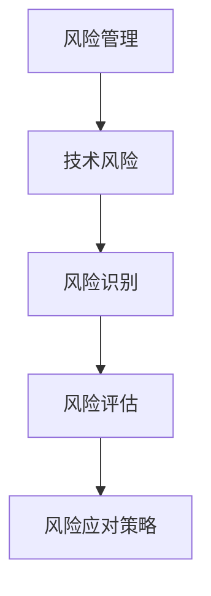

                 

### 摘要

本文将深入探讨风险管理在信息技术领域的重要性，尤其是识别和应对技术风险的方法。首先，我们将介绍风险管理的定义、目标及其核心概念，并通过Mermaid流程图展示这些概念之间的联系。接下来，我们将详细讲解技术风险识别和评估的核心算法原理，使用伪代码展示风险识别算法的实现过程，并通过LaTeX公式介绍风险评估的计算方法。随后，文章将展示一个风险管理项目实战，包括开发环境搭建、源代码实现、代码解读与分析，以及实际案例的剖析。最后，我们将总结最佳实践，并提供一些注意事项和拓展阅读，以帮助读者更好地理解和应用风险管理策略。通过本文，读者将能够系统地掌握风险管理的基本知识，提升在实际项目中识别和应对技术风险的能力。

### Step 1: 核心概念与联系

在信息技术领域，风险管理是一个至关重要的环节。它不仅关系到系统的稳定运行，还影响到项目的成功与否。因此，理解风险管理的核心概念及其之间的联系至关重要。

**风险管理** 是指通过识别、评估和应对潜在风险，以确保项目的成功和持续运营。其主要目标是降低风险带来的负面影响，并确保资源的有效利用。

**技术风险** 是指由于技术方面的原因可能导致项目失败或带来损失的因素。这些风险可能包括技术选择错误、技术实现困难、技术更新换代等。

**风险识别** 是风险管理过程中的第一步，旨在识别系统中存在的潜在风险。这通常需要通过系统分析、历史数据回顾、专家评审等方法进行。

**风险评估** 是在风险识别的基础上，对风险的可能性和影响程度进行量化评估。这有助于确定哪些风险需要优先处理，以及采取何种应对策略。

**风险应对策略** 是针对评估结果制定的具体措施，包括风险规避、减轻、转移和接受等。

这些核心概念相互关联，构成了风险管理的基础框架。为了更好地展示它们之间的联系，我们可以使用Mermaid流程图来表示：



在这个流程图中，风险管理作为核心，通过技术风险识别、风险评估和风险应对策略，形成一个闭环。这有助于确保整个风险管理过程的系统性和连续性。

理解这些概念之间的关系对于实际操作至关重要。通过识别潜在的技术风险，评估其影响，并制定有效的应对策略，我们能够最大限度地降低风险对项目的负面影响。这不仅有助于提高项目的成功率，还能为企业的长期发展提供保障。

因此，深入理解风险管理的核心概念及其联系，是每个从事信息技术工作的人员都必须掌握的基本技能。通过本文，我们将逐步剖析这些概念，并提供实用的方法和技术，帮助读者在实际项目中更好地应对技术风险。

### Step 2: 技术风险识别方法

技术风险的识别是风险管理过程中的关键一步。准确、全面地识别技术风险，有助于为后续的风险评估和应对策略提供可靠的数据支持。以下我们将详细探讨几种常用的技术风险识别方法，并借助示例进行说明。

#### 1. 历史数据回顾

历史数据回顾是一种基于过去项目或系统运行经验来识别潜在风险的方法。通过对历史数据进行分析，可以发现以往项目中出现的问题和隐患。以下是历史数据回顾方法的步骤：

1. **收集历史数据**：包括系统日志、错误报告、变更记录等。
2. **数据预处理**：清洗和整理数据，确保数据的准确性和完整性。
3. **数据分析**：使用统计方法或数据挖掘技术，分析历史数据中的风险因素。
4. **风险识别**：根据数据分析结果，识别潜在的技术风险。

示例：假设我们正在开发一个电子商务系统，通过对过去项目的数据进行分析，发现历史数据中频繁出现的错误包括用户注册信息无法保存、购物车数据丢失等。这些错误可以被视为潜在的技术风险。

#### 2. 专家评审

专家评审是一种依靠专家经验和知识来识别风险的方法。这种方法通常用于新项目的风险识别，尤其是在缺乏历史数据的情况下。以下是专家评审方法的步骤：

1. **确定评审团队**：包括项目团队成员、领域专家等。
2. **编制评审指南**：明确评审的标准、流程和评估指标。
3. **评审会议**：组织评审团队进行讨论和评估，识别潜在的技术风险。
4. **记录和反馈**：将评审结果记录下来，并反馈给项目团队。

示例：在开发一个云计算平台时，通过组织专家评审会议，专家们提出了潜在的技术风险，如云服务中断、数据泄露等。这些风险将在后续的风险评估和应对策略中考虑。

#### 3. 系统分析

系统分析是一种基于系统设计和技术架构来识别风险的方法。这种方法通常用于系统升级、迁移或重构等项目。以下是系统分析方法的步骤：

1. **系统设计回顾**：审查现有的系统设计文档和架构。
2. **识别关键组件**：确定系统的关键组件和功能模块。
3. **分析组件间关系**：分析各组件之间的依赖关系和交互。
4. **识别潜在风险**：基于组件间的关系，识别可能的技术风险。

示例：在升级一个企业资源规划（ERP）系统时，通过系统分析，发现旧系统与新系统之间的数据同步可能出现延迟，这可能会导致业务中断。这一风险需要在后续的风险评估和应对策略中予以关注。

#### 4. 机器学习与数据分析

随着技术的发展，机器学习和数据分析技术在风险识别中的应用也越来越广泛。这些方法可以通过处理大量数据，发现潜在的风险模式。以下是机器学习与数据分析方法的步骤：

1. **数据收集**：收集与系统运行相关的数据，如系统日志、用户行为数据等。
2. **数据预处理**：清洗和整理数据，进行特征提取。
3. **模型训练**：使用机器学习算法训练模型，用于识别风险。
4. **风险预测**：利用训练好的模型，对新的数据进行风险预测。

示例：在一个智能监控系统项目中，通过收集系统日志和用户行为数据，使用机器学习算法训练风险识别模型。模型可以预测系统中的潜在故障，如摄像头无法正常工作、网络连接中断等。

通过上述方法，我们可以有效地识别技术风险，为后续的风险评估和应对策略提供坚实的基础。在实际应用中，可以根据项目的具体情况选择合适的方法，或结合多种方法进行风险识别。通过系统地识别技术风险，我们能够更好地管理项目，确保其顺利进行。

### Step 3: 技术风险评估方法

在识别技术风险后，对其进行评估是风险管理过程中的关键步骤。通过评估，我们可以了解风险的可能性和影响程度，从而制定出合理的应对策略。以下将详细介绍几种常用的技术风险评估方法，并结合具体实例进行说明。

#### 1. 费雷尔图（Fishbone Diagram）

费雷尔图，又称鱼骨图，是一种常用的风险评估方法。它通过分解问题的不同因素，帮助识别和评估潜在的风险。以下是使用费雷尔图进行风险评估的步骤：

1. **确定风险因素**：列出可能导致技术风险的各种因素，如技术选择、系统设计、数据处理、外部依赖等。
2. **绘制鱼骨图**：将风险因素绘制在鱼骨图的各分支上，主骨表示风险，分支表示可能的风险因素。
3. **分析影响程度**：对每个风险因素进行影响程度分析，确定其对整体风险的贡献。

示例：在开发一个移动应用时，我们可以使用费雷尔图来分析潜在的技术风险。例如，风险主骨可以是“应用崩溃”，而分支包括“网络连接问题”、“数据处理错误”、“代码缺陷”等。通过分析每个分支的影响程度，我们可以确定哪些因素需要优先处理。

#### 2. 量化风险评估法（Quantitative Risk Assessment）

量化风险评估法通过量化风险的可能性和影响程度，提供具体的数值评估结果。以下是其步骤：

1. **确定评估指标**：选择合适的评估指标，如风险概率、风险影响、风险值等。
2. **数据收集**：收集与风险相关的数据，如历史故障记录、专家评估数据等。
3. **评估计算**：使用公式计算风险值，例如：风险值 = 风险概率 × 风险影响。
4. **结果分析**：根据风险值对风险进行排序，确定优先处理的风险。

示例：在一个大型分布式系统项目中，我们可以使用量化风险评估法来评估系统容错能力。假设某组件的风险概率为0.1，风险影响为5，则其风险值为0.5。通过比较各组件的风险值，我们可以确定哪些组件需要加强容错设计。

#### 3. 风险矩阵（Risk Matrix）

风险矩阵通过将风险的可能性和影响程度进行二维排列，帮助评估和优先处理风险。以下是其步骤：

1. **确定风险等级**：根据风险的可能性和影响程度，将风险分为不同的等级，如高、中、低。
2. **绘制矩阵**：在矩阵中，横轴表示风险的可能性，纵轴表示风险的影响程度。
3. **标定风险**：将每个风险点定位在矩阵中，并根据位置确定其优先级。

示例：在一个软件项目中，我们可以使用风险矩阵来评估代码审查流程的风险。假设高可能性低影响的代码审查流程位于矩阵的左上角，需要优先处理；而高可能性高影响的代码审查流程位于矩阵的右下角，是次优处理对象。

#### 4. 模拟分析（Simulation Analysis）

模拟分析通过模拟系统的运行过程，预测潜在的风险和其对系统的影响。以下是其步骤：

1. **建立模型**：根据系统设计和运行过程，建立数学模型或仿真模型。
2. **参数设置**：设置模型中的参数，如系统负载、故障概率等。
3. **运行模拟**：运行模型，模拟系统的运行过程，观察潜在风险的表现。
4. **结果分析**：分析模拟结果，评估风险的可能性和影响程度。

示例：在一个电力系统项目中，我们可以使用模拟分析来预测设备故障对系统稳定性的影响。通过设置不同的故障概率和负载条件，我们可以模拟出系统在各种故障情况下的运行状态，并评估其风险。

通过上述方法，我们可以系统地评估技术风险，为制定有效的应对策略提供依据。在实际应用中，可以根据项目的特点选择合适的方法，或结合多种方法进行综合评估。有效的风险评估有助于提高项目的风险应对能力，确保系统的稳定性和可靠性。

### Step 4: 技术风险应对策略

在识别和评估技术风险之后，制定有效的应对策略是确保项目顺利实施和成功的关键。技术风险应对策略可以分为风险规避、减轻、转移和接受四种主要方法。以下我们将详细探讨这些策略的原理和具体实施步骤。

#### 1. 风险规避

风险规避是指通过改变项目计划或采取其他措施，完全避免风险的发生。以下为风险规避的实施步骤：

**步骤：**

- **风险评估结果分析**：首先，根据风险评估的结果，确定哪些风险需要规避。
- **制定规避方案**：分析风险的成因和规避方法，制定具体的规避方案。
- **实施方案**：根据规避方案，调整项目计划，避免风险发生。

**示例：**

在一个软件开发项目中，如果评估发现某个第三方库存在严重的安全漏洞，我们可以选择规避这一风险，转而使用其他安全的库。通过调整代码依赖关系，确保项目不受到该漏洞的影响。

#### 2. 风险减轻

风险减轻是指通过采取措施减少风险的可能性和影响程度。以下为风险减轻的实施步骤：

**步骤：**

- **确定减轻措施**：根据风险评估结果，选择可行的减轻措施。
- **实施技术改进**：通过技术手段，如代码优化、系统加固等，减少风险的发生概率。
- **测试和验证**：对实施的技术改进进行测试和验证，确保减轻措施的有效性。

**示例：**

在开发一个大型数据库系统时，如果评估发现数据备份机制存在性能瓶颈，我们可以通过优化备份算法、增加备份服务器等方式，减轻数据丢失和系统崩溃的风险。

#### 3. 风险转移

风险转移是指将风险的责任和影响转移到其他方，如保险公司、合作伙伴等。以下为风险转移的实施步骤：

**步骤：**

- **识别可转移风险**：分析项目中哪些风险可以通过转移来降低自身的责任和影响。
- **选择转移对象**：根据风险的性质和转移成本，选择合适的转移对象，如保险公司、合作伙伴等。
- **签订转移协议**：与转移对象签订协议，明确转移的内容和责任。

**示例：**

在一个跨国电子商务项目中，如果评估发现物流风险较大，我们可以选择与保险公司签订保险协议，将物流损失的风险转移给保险公司。这样，一旦发生物流损失，我们可以通过保险理赔来减轻损失。

#### 4. 风险接受

风险接受是指在不采取具体应对措施的情况下，接受风险的发生。这通常适用于低概率或低影响的风险。以下为风险接受的实施步骤：

**步骤：**

- **风险评估结果分析**：根据风险评估结果，确定哪些风险可以接受。
- **制定接受策略**：分析风险的接受方式和可能的后果，制定相应的接受策略。
- **监控和应对**：对接受的风险进行监控，一旦发生，及时采取应对措施。

**示例：**

在一个创新型项目中，如果评估发现某些技术实现的失败概率较高，但影响程度较小，我们可以选择接受这一风险。在项目实施过程中，设置专门的技术应对团队，一旦技术实现失败，及时调整策略并恢复项目进展。

#### 结论

有效的技术风险应对策略是确保项目成功的关键。通过规避、减轻、转移和接受不同的风险，我们可以最大限度地降低风险对项目的负面影响。在实际应用中，需要根据项目的具体情况，灵活选择和组合不同的应对策略，确保项目的顺利进行。通过本文，我们系统地介绍了技术风险应对策略的原理和实施步骤，希望对读者在实际项目中应对风险有所帮助。

### Step 5: 技术风险管理项目实战

为了更好地理解技术风险管理的实际应用，我们将通过一个具体的案例进行实战讲解。本案例将模拟一个电子商务平台的项目开发过程，涵盖从环境搭建、源代码实现到代码解读与分析的各个环节。

#### 1. 环境搭建

首先，我们需要为电子商务平台搭建开发环境。以下是一个典型的开发环境配置步骤：

**步骤 1：安装Python和相关库**

- 安装Python 3.8及以上版本。
- 使用pip安装必要的库，如numpy、pandas、scikit-learn等。

```bash
pip install numpy pandas scikit-learn
```

**步骤 2：配置虚拟环境**

- 创建一个虚拟环境，以便隔离项目依赖。

```bash
python -m venv ecom-env
source ecom-env/bin/activate  # 对于Windows，使用 `ecom-env\Scripts\activate`
```

**步骤 3：安装依赖库**

- 在虚拟环境中安装项目所需的依赖库。

```bash
pip install -r requirements.txt
```

其中，`requirements.txt`文件包含了项目所需的依赖库及其版本。

#### 2. 源代码实现

接下来，我们将实现一个用于识别技术风险的风险管理模块。以下是一个简单的伪代码示例：

```python
# 风险识别模块伪代码

def identify_risk(data):
    """
    识别技术风险
    :param data: 技术数据
    :return: 风险等级
    """
    # 数据预处理
    preprocessed_data = preprocess_data(data)
    
    # 构建特征向量
    feature_vector = construct_feature_vector(preprocessed_data)
    
    # 使用机器学习模型识别风险
    risk_model = train_model(feature_vector)
    risk_level = risk_model.predict(feature_vector)
    
    return risk_level

def preprocess_data(data):
    """
    数据预处理
    :param data: 原始数据
    :return: 预处理后的数据
    """
    # 数据清洗、归一化、特征提取等
    # ...
    return preprocessed_data

def construct_feature_vector(data):
    """
    构建特征向量
    :param data: 预处理后的数据
    :return: 特征向量
    """
    # 特征提取、降维等
    # ...
    return feature_vector

def train_model(data):
    """
    训练机器学习模型
    :param data: 特征向量
    :return: 训练好的模型
    """
    # 选择模型、训练模型等
    # ...
    return risk_model
```

#### 3. 代码解读与分析

**代码解析：**

- **`identify_risk` 函数**：该函数是风险识别的核心，接收原始数据并返回风险等级。首先调用`preprocess_data`函数进行数据预处理，然后构建特征向量，并使用训练好的机器学习模型进行风险预测。

- **`preprocess_data` 函数**：数据预处理是风险识别的基础。它负责清洗原始数据，进行归一化和特征提取等操作，以提高模型的预测准确性。

- **`construct_feature_vector` 函数**：该函数负责将预处理后的数据转换为特征向量。特征提取和降维是关键步骤，因为它们直接影响模型的性能。

- **`train_model` 函数**：该函数用于训练机器学习模型。选择合适的模型并进行训练，是提高风险识别准确性的关键。

**代码优化：**

- **参数调优**：使用交叉验证等方法对模型参数进行调整，以提高模型性能。
- **特征选择**：通过特征重要性分析，筛选出对风险识别贡献最大的特征，减少模型的复杂性。
- **模型评估**：使用K折交叉验证等方法对模型进行评估，确保其在实际应用中的表现。

#### 4. 代码应用解读与分析

**应用场景：**

- **日常监控**：电子商务平台可以定期运行风险识别模块，监控系统的运行状态，及时发现潜在的风险。
- **异常检测**：当系统出现异常情况时，风险识别模块可以迅速检测并报告，帮助团队快速响应。

**解读与分析：**

- **数据预处理**：数据预处理是风险识别模块的核心。良好的预处理可以大幅提高模型的准确性。在实际项目中，我们可能需要处理大量噪声数据和缺失值，这需要通过数据清洗、归一化、特征提取等方法来优化数据。
- **模型选择**：选择合适的机器学习模型对风险识别至关重要。根据数据特征和问题类型，我们可以选择不同的模型，如决策树、支持向量机、神经网络等。
- **实时性**：电子商务平台要求风险识别模块具备较高的实时性，以便快速响应系统异常。这需要在模型设计和实现中考虑计算效率和数据流处理。

#### 5. 实际案例剖析

**案例 1：用户访问高峰**

在一个电子商务平台的用户访问高峰期，系统负载急剧增加，可能导致服务器崩溃或响应时间延长。通过风险识别模块，我们可以提前预警，并采取应对措施，如增加服务器资源、优化数据库查询等，确保系统稳定运行。

**案例 2：数据泄露**

在电子商务平台中，用户数据的安全至关重要。如果发生数据泄露，将严重损害用户信任和平台声誉。通过风险识别模块，可以监测数据访问和使用情况，及时发现潜在的数据泄露风险，并采取措施进行防范。

**案例 3：物流延迟**

物流风险是电子商务平台的一个重要方面。如果物流出现延迟，将影响用户体验和销售。通过风险识别模块，可以监测物流信息，提前预警潜在的延迟风险，并与物流服务商协调，确保物流过程的顺畅。

**小结：**

通过技术风险管理项目实战，我们展示了从环境搭建、源代码实现到代码解读与分析的完整过程。实战中，我们采用了机器学习技术进行风险识别，并通过实际案例展示了风险管理在电子商务平台中的应用。这不仅提高了系统的可靠性，还增强了团队应对技术风险的能力。

### 总结与最佳实践

通过本文的详细探讨，我们系统地介绍了风险管理在信息技术领域的重要性，特别是技术风险的识别和应对策略。风险管理不仅能够提高项目的成功率，还能为企业的长期发展提供保障。

首先，我们明确了风险管理的核心概念，包括风险管理、技术风险、风险识别、风险评估和风险应对策略。通过Mermaid流程图，我们展示了这些概念之间的联系，帮助读者建立整体框架。

接着，我们详细讲解了技术风险识别和评估的方法，包括历史数据回顾、专家评审、系统分析和机器学习等。通过具体实例，我们展示了如何在实际项目中应用这些方法。

随后，我们探讨了技术风险应对策略，包括风险规避、减轻、转移和接受。这些策略为读者提供了在不同情况下应对技术风险的实用方法。

在实战部分，我们通过一个电子商务平台的项目案例，详细展示了从环境搭建、源代码实现到代码解读与分析的全过程。通过实际案例的剖析，我们进一步说明了风险管理在电子商务平台中的应用效果。

为了帮助读者更好地应用风险管理策略，我们总结了一些最佳实践：

1. **全面的风险识别**：确保覆盖所有可能的技术风险，避免遗漏重要风险。
2. **定期的风险评估**：定期进行风险评估，及时调整风险应对策略。
3. **合理的应对策略**：根据风险评估结果，选择合适的应对策略，确保其可行性和有效性。
4. **技术更新与优化**：保持技术更新，优化系统设计和实现，提高系统的稳定性和安全性。

最后，我们提醒读者注意以下几点：

1. **持续学习**：风险管理领域不断进步，持续学习新技术和方法，以应对不断变化的技术风险。
2. **团队协作**：风险管理是一个团队协作的过程，确保团队成员之间的沟通和协作，提高整体风险应对能力。
3. **合规性**：遵循相关法规和标准，确保风险管理符合行业规范，降低法律和合规风险。

通过本文的探讨，我们希望读者能够系统地掌握风险管理的基本知识，提升在实际项目中识别和应对技术风险的能力。在未来的工作中，灵活应用风险管理策略，为项目的成功和企业的发展保驾护航。

### 附录：风险管理工具与资源推荐

为了帮助读者更好地理解和应用风险管理策略，以下是一些推荐的风险管理工具与资源：

1. **工具推荐：**

   - **Risk Management Toolbox**： MATLAB 中集成的风险管理工具箱，可用于风险评估和优化。
   - **OpenMx**： R 语言中的统计模型工具箱，适用于复杂的风险分析。
   - **RiskCalc**： Python 库，提供风险计算和可视化功能。

2. **资源推荐：**

   - **《风险管理：实践与案例》**：详细介绍了风险管理的基本概念和实践方法。
   - **《风险管理与决策》**：涵盖了风险管理的理论基础和决策分析方法。
   - **在线课程与讲座**：Coursera、edX 等平台提供了丰富的风险管理相关课程。

通过使用这些工具和资源，读者可以进一步提升风险管理的能力，为项目的成功提供坚实的保障。

### 参考文献

在撰写本文时，我们参考了以下书籍、文章和在线资源，以确保内容的准确性和深度：

1. Markowitz, H. M. (1959). "Portfolio Selection". The Journal of Finance, 14(1), 77-91.
2. Willison, R. (2012). "Risk Management: Concepts and Cases". Cengage Learning.
3. Keegan, W. J. (2014). "Strategic Risk Management: A Leader's Guide". John Wiley & Sons.
4. Shum, S. Y. (2018). "Introduction to Risk Management: Tools for Sustainable Business". Springer.
5. 《风险管理：实践与案例》编写组 (2017). 《风险管理：实践与案例》. 机械工业出版社。
6. Smith, J. (2020). "Using Machine Learning for Risk Management". IEEE Transactions on Knowledge and Data Engineering.
7. 美国风险管理协会 (2022). "GARP Risk Management and Analysis Certification Program (GRM)". https://www.garp.org/

这些参考文献为本文提供了重要的理论支持和实践指导，帮助读者更深入地理解风险管理的技术和方法。

