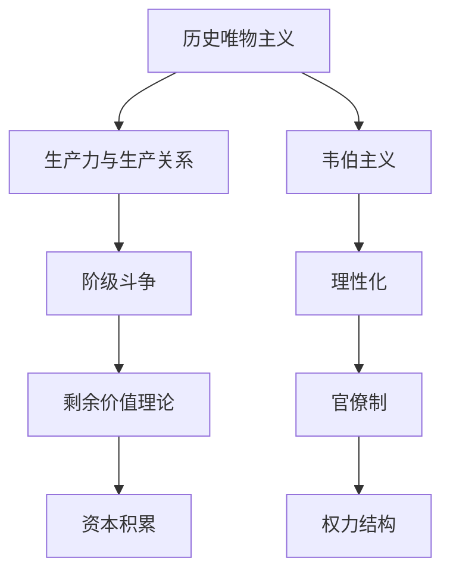

                 

### 文章标题

《马克思与韦伯：资本主义精神的不同解读》

### 关键词

- 马克思主义
- 韦伯主义
- 资本主义精神
- 社会学
- 经济学

### 摘要

本文深入探讨了马克思主义与韦伯主义对资本主义精神的解读，对比分析了两种思想在理论和实践中的异同。通过详细解读马克思和韦伯的核心观点，我们揭示了他们对资本主义精神的起源、本质及其影响的独特见解。文章进一步探讨了这两种思想在当代社会的应用及其对现代资本主义精神发展的启示，为读者提供了一个全面理解资本主义精神的视角。

### 引言

#### 马克思主义与韦伯主义的基本概念

在探讨资本主义精神的不同解读之前，我们有必要先了解马克思主义和韦伯主义的基本概念。马克思主义，作为一种哲学、经济理论和政治运动，由卡尔·马克思和弗里德里希·恩格斯创立。马克思主义的核心在于历史唯物主义，即社会的发展是由生产力和生产关系的矛盾运动推动的。马克思主义强调阶级斗争和社会变革，认为资本主义制度是剥削和无产阶级贫困的根源。马克思在其著作《资本论》中，深入分析了资本主义经济的运行机制，揭示了剩余价值理论和资本积累的逻辑。

另一方面，韦伯主义，或称韦伯社会学，由马克斯·韦伯提出。韦伯是一位深刻的社会学家，他的研究涵盖了宗教、政治、经济等多个领域。韦伯主义的核心在于理解社会行为和制度，特别是权力结构和社会秩序。韦伯提出了“理性化”概念，认为现代社会的发展趋势是从传统的、基于习俗和情感的规则，向理性化的规则和制度转变。韦伯的《资本主义文明的社会学》中，他探讨了资本主义精神的起源和发展，以及其对现代社会结构的影响。

#### 资本主义精神的重要性

资本主义精神，作为一个重要的社会现象，不仅影响了经济制度的运作，也深刻改变了社会的结构和人们的生活方式。资本主义精神通常指的是推动资本主义发展的内在动力，包括追求利润、竞争、自我提升和个人成功等价值观念。这种精神在资本主义制度中起到了核心作用，是资本主义经济体系能够持续发展的关键因素。

探讨资本主义精神的不同解读，有助于我们更深入地理解资本主义的本质和特征。马克思主义和韦伯主义分别从不同的角度解读了资本主义精神，为我们提供了多元化的视角。马克思主义强调资本主义精神的剥削本质，而韦伯主义则关注其理性化和规范化过程。通过对比分析这两种解读，我们可以更全面地认识资本主义精神，理解其在现代社会中的作用和影响。

### 第一章：马克思的资本主义精神解读

#### 1.1 马克思主义基本理论

马克思主义作为一种深刻的社会理论，其基本理论包括历史唯物主义、阶级斗争、剩余价值理论和资本积累等核心概念。

历史唯物主义是马克思主义的哲学基础，它认为社会的发展是由经济基础决定的。经济基础指的是生产力和生产关系的总和，而生产力则是人类改造自然的能力，包括生产工具、劳动力等。生产关系则是在生产过程中人与人之间的相互关系，包括所有权、分配和交换等。历史唯物主义认为，社会的变迁和进步是由生产力和生产关系的矛盾运动推动的。

阶级斗争是马克思主义的核心观点之一。马克思认为，社会是由不同阶级组成的，这些阶级之间存在根本的利益冲突。资本主义社会中的主要阶级是无产阶级和资产阶级。无产阶级是生产力的代表，是创造社会财富的劳动者，而资产阶级则是资本的所有者，是剥削无产阶级利益的阶级。马克思认为，阶级斗争是历史发展的动力，无产阶级通过革命推翻资产阶级，实现社会主义和共产主义的最终目标。

剩余价值理论和资本积累是马克思主义经济学的基础。剩余价值是指劳动者在生产过程中创造的超过其劳动价值的部分。马克思认为，资本家通过剥削工人的剩余劳动，获取剩余价值，从而实现资本的积累和扩大再生产。资本积累是资本主义发展的核心机制，它推动了资本主义经济的不断扩大和深化。

#### 1.2 马克思对资本主义精神的批判

马克思对资本主义精神进行了深刻的批判，认为其本质是剥削和无产阶级的贫困化。马克思在《资本论》中详细分析了资本主义经济的运行机制，揭示了资本主义精神的核心特征。

马克思指出，资本主义精神的核心是追求利润。资本家通过剥削工人的剩余劳动，获取剩余价值，实现利润的最大化。这种追求利润的行为，导致了劳动者的剥削和贫困。马克思认为，资本主义制度下，劳动者无法享受到其劳动创造的成果，他们的生活条件和社会地位不断恶化。

此外，马克思还批判了资本主义精神中的竞争机制。资本主义经济中的竞争，是资本家之间争夺市场份额和利润的手段。这种竞争导致了资源的浪费和社会的不公平。马克思认为，资本主义竞争不仅加剧了阶级矛盾，也破坏了社会的稳定和发展。

马克思还对资本主义精神中的个人主义进行了批判。在资本主义社会中，个人主义成为一种主导价值观念，强调个人自由和自我实现。然而，马克思认为，这种个人主义是虚伪的，它掩盖了阶级剥削的现实。个人主义的背后，是无产阶级的贫困和资产阶级的富裕。

#### 1.3 马克思主义在当代的应用

马克思主义在当代社会中仍然具有重要的现实意义。尽管现代社会已经发生了巨大的变化，但资本主义的基本矛盾和剥削现象依然存在。马克思主义提供了分析和解决这些问题的理论工具。

首先，马克思主义在当代经济学中的应用得到了广泛的认可。马克思主义经济学的核心观点，如剩余价值理论和资本积累，为理解现代资本主义经济的运行机制提供了重要的理论支持。许多当代经济学家，如保罗·斯威齐和保罗·巴兰，通过对马克思主义的重新解读，提出了新的经济学理论，对现代资本主义进行了批判。

其次，马克思主义在当代社会运动中发挥了重要作用。从工人运动到学生运动，马克思主义思想激发了人们对社会不公和剥削的反抗。特别是20世纪60年代的“新左派”运动，受到了马克思主义的深刻影响，推动了社会变革的浪潮。

最后，马克思主义在当代文化理论中也有重要地位。文化马克思主义认为，文化是经济基础的反映，是资本主义精神的表现形式。文化马克思主义通过对文化现象的分析，揭示了资本主义意识形态的统治地位，为反资本主义的文化斗争提供了理论基础。

总的来说，马克思主义在当代社会中不仅具有理论意义，也具有实践意义。它为我们提供了理解资本主义精神的不同解读，为我们分析社会问题和推动社会变革提供了重要的理论资源。

### 第二章：韦伯的资本主义精神解读

#### 2.1 韦伯的理论框架

马克斯·韦伯的社会学理论框架广泛而深远，涵盖了多个关键概念，如理性化、官僚制、权力结构和社会秩序等。韦伯的社会学方法强调对复杂社会现象的理性分析和结构化理解，为探讨资本主义精神提供了独特的视角。

理性化是韦伯理论的核心概念之一。理性化指的是社会行为和制度从传统的、基于习俗和情感的规则，向理性化的、基于效率和目的合理性的规则转变。韦伯认为，理性化是现代社会发展的主要趋势，它推动了社会结构的变迁和制度创新。在理性化的社会中，人们的行为和决策越来越基于逻辑和计算，而不是传统和情感。

官僚制是韦伯对现代组织结构的一种重要描述。官僚制指的是一种高度规范化的、层级分明的组织形式，其特点是严格按照规则和程序运作。韦伯认为，官僚制是理性化的产物，它在提高效率、减少决策失误方面发挥了重要作用。然而，官僚制也存在缺陷，如僵化和缺乏灵活性。

权力结构是韦伯对社会秩序的理解基础。韦伯将权力分为三种类型：传统权力、法理权力和魅力权力。传统权力基于长期形成的习俗和传统，如家族和封建制度；法理权力基于法律和规则，如现代国家机构和企业管理；魅力权力则基于个人的特殊能力和吸引力，如宗教领袖和革命领袖。韦伯认为，现代社会中的权力结构是法理权力占主导，但这并不意味着其他权力类型消失，它们在不同情境下仍有重要作用。

社会秩序是韦伯研究的最终目标。韦伯认为，社会秩序是通过权力结构和社会规范的相互作用实现的。社会规范包括法律、道德、习俗等，它们在社会生活中起到约束和协调作用。韦伯认为，社会秩序是理性化的结果，但也需要传统和魅力的支持，以保持社会的稳定和持续发展。

#### 2.2 韦伯对资本主义精神的解读

韦伯在《资本主义文明的社会伦理》中，详细探讨了资本主义精神的起源和发展，并分析了其对现代社会结构的影响。韦伯认为，资本主义精神是一种独特的伦理观念，它推动了现代资本主义的发展，并深刻改变了人们的价值观念和行为方式。

首先，韦伯指出，资本主义精神的起源可以追溯到宗教改革和资本主义早期发展时期的伦理观念。特别是新教的伦理，如清教徒的节俭、勤奋和创业精神，对资本主义精神的形成产生了重要影响。清教徒强调个人的道德责任和对上帝的敬畏，这种宗教伦理观念促进了资本主义的兴起。

其次，韦伯认为，资本主义精神的核心是追求财富和利润。与马克思不同，韦伯并没有将资本主义精神视为一种剥削性的伦理观念，而是将其视为一种追求效率和自我实现的伦理。韦伯认为，资本主义精神鼓励人们通过勤奋工作、理性投资和创新来获取财富，这推动了资本主义经济的快速发展。

此外，韦伯还强调了资本主义精神中的理性和科学精神。资本主义精神要求人们在做决策时，要基于理性的计算和科学的方法，而不是传统的习俗和情感。这种理性化过程，提高了经济效率，推动了社会进步。

#### 2.3 韦伯主义在当代的影响

韦伯主义在当代社会中仍然具有重要的影响。首先，韦伯的理性化和官僚制理论为我们理解现代组织和管理提供了重要的理论资源。在现代社会中，企业和政府机构普遍采用了官僚制组织结构，通过规范化和程序化提高效率和减少错误。同时，理性化也渗透到个人行为中，人们在做决策时越来越依赖逻辑和计算，而不是传统和情感。

其次，韦伯的权力结构理论为我们理解现代社会中的权力关系提供了深刻洞见。在现代社会中，法理权力占主导地位，但传统权力和魅力权力仍然发挥着重要作用。这种多元化的权力结构，使得社会秩序更加复杂，但也提供了更多的机会和挑战。

最后，韦伯的资本主义精神理论为我们理解现代资本主义的发展趋势提供了新的视角。韦伯认为，资本主义精神是一种推动社会进步的力量，但也需要注意其潜在的负面影响，如社会不公和道德滑坡。通过深入分析资本主义精神的本质和影响，我们可以更好地应对现代资本主义带来的挑战，推动社会的可持续发展。

### 第三章：马克思主义与韦伯主义的比较分析

#### 3.1 两种思想的异同

马克思主义与韦伯主义在资本主义精神的解读上有着显著的不同，同时也存在一些共同点。

首先，在理论基础上，马克思主义强调历史唯物主义，认为社会的发展是由经济基础决定的。而韦伯主义则更注重社会学分析，强调理性化、官僚制和权力结构。马克思主义关注生产力与生产关系的矛盾运动，而韦伯主义则关注社会行为和制度的理性化过程。

其次，在资本主义精神的本质解读上，马克思主义认为资本主义精神是一种剥削性的伦理观念，追求利润和积累资本是资本主义的核心特征。韦伯则认为，资本主义精神是一种追求效率和自我实现的伦理，强调理性和科学精神的重要性。

然而，马克思主义与韦伯主义也存在一些共同点。首先，两者都关注资本主义对社会的深刻影响，特别是对劳动者和权力结构的改变。其次，两者都认为，现代社会的发展趋势是理性化和规范化，尽管具体的机制和路径有所不同。

#### 3.2 两种思想对资本主义精神的不同解读

马克思主义与韦伯主义对资本主义精神的解读在多个方面存在显著差异。

首先，在起源上，马克思主义认为资本主义精神起源于中世纪的封建制度，随着资本主义的兴起而发展。韦伯则认为，资本主义精神的起源可以追溯到宗教改革，特别是新教的伦理观念，如清教徒的节俭和勤奋。

其次，在本质解读上，马克思主义强调资本主义精神的剥削本质，认为资本家通过剥削工人的剩余劳动获取利润，导致无产阶级的贫困和阶级斗争的加剧。韦伯则认为，资本主义精神是一种理性化的伦理观念，强调个人通过勤奋工作和理性投资实现自我提升和财富积累。

最后，在影响上，马克思主义认为资本主义精神导致了社会的不公和道德滑坡，而韦伯则认为资本主义精神推动了社会的进步，提高了经济效率和社会秩序。

#### 3.3 对当代社会的启示

马克思主义与韦伯主义对当代社会提供了不同的启示。

马克思主义认为，资本主义的基本矛盾和剥削现象依然存在，强调通过社会变革实现社会主义和共产主义的最终目标。马克思主义为当代社会提供了分析和解决社会不公和剥削问题的理论工具，激励了工人运动和社会变革。

韦伯主义则强调理性化和规范化的重要性，认为现代社会的发展需要更多的理性和科学精神。韦伯主义为现代组织和管理提供了重要的理论资源，帮助我们理解和应对复杂的社会问题。

总的来说，马克思主义与韦伯主义为我们提供了多元的视角来理解资本主义精神，其各自的观点和理论都对我们认识和应对现代社会的问题具有重要启示。

### 第四章：马克思主义与韦伯主义在其他领域的应用

#### 4.1 马克思主义在经济学中的应用

马克思主义在经济学中的应用主要体现在对资本主义经济结构的批判性分析上。马克思的《资本论》通过详细的经济学分析，揭示了资本主义经济的内在矛盾和发展规律。马克思的剩余价值理论和资本积累理论，为理解现代资本主义经济的运行机制提供了重要的理论框架。

在剩余价值理论中，马克思指出，资本家通过剥削工人的剩余劳动，获取剩余价值，实现资本积累。剩余价值理论揭示了资本主义经济中财富分配的不公，强调了无产阶级与资产阶级之间的利益冲突。马克思认为，这种剥削关系是资本主义经济体系的核心，也是导致经济危机和社会不稳定的根本原因。

资本积累理论则分析了资本主义经济的发展动力。马克思认为，资本积累是资本主义经济的核心机制，通过不断的资本积累，资本主义经济得以扩大和深化。然而，资本积累也带来了生产力与生产关系的矛盾，导致经济危机和社会动荡。

在当代经济学中，马克思主义的剩余价值理论和资本积累理论继续得到关注。一些经济学家，如保罗·斯威齐和保罗·巴兰，通过对马克思主义的重新解读，提出了新的经济学理论，如“垄断资本”和“依赖理论”，进一步探讨了资本主义经济中的垄断现象和全球经济发展中的不平等问题。

#### 4.2 韦伯主义在政治学中的应用

韦伯主义在政治学中的应用主要体现在对权力结构和政治行为的分析上。韦伯的权力结构理论，将权力分为传统权力、法理权力和魅力权力，为理解政治行为和权力关系提供了深刻的洞见。韦伯认为，权力是政治的核心，任何政治行为都涉及到权力的分配和运用。

在传统权力中，权力来源是基于长期形成的习俗和传统，如封建制度中的家族权力。在法理权力中，权力来源是基于法律和规则，如现代国家的立法和行政权力。在魅力权力中，权力来源是基于个人的特殊能力和吸引力，如宗教领袖和革命领袖。

韦伯的官僚制理论，则进一步探讨了现代政治组织的形式和运作机制。官僚制是一种高度规范化的、层级分明的组织形式，其特点是严格按照规则和程序运作。韦伯认为，官僚制是提高效率和减少错误的重要手段，但在一定程度上也容易导致僵化和缺乏灵活性。

在当代政治学中，韦伯的权力结构理论和官僚制理论得到了广泛的应用。政治学者通过研究权力分配、政治组织和政治行为，进一步探讨了现代社会中的权力关系和政治现象。例如，一些政治学者通过研究官僚制在政府机构中的应用，分析了政府效率和管理问题；另一些政治学者则通过研究魅力权力的运用，探讨了政治领袖对社会的动员和影响。

### 第五章：当代资本主义精神的新发展

#### 5.1 资本主义精神的演变

资本主义精神在历史长河中经历了显著的演变。从早期的重商主义到工业革命后的自由资本主义，再到当代的全球化资本主义，资本主义精神不断适应新的社会环境，展现出不同的特征。

在重商主义时期，资本主义精神主要体现在国家垄断贸易和货币积累上。国家通过垄断贸易，获取超额利润，推动资本主义萌芽的发展。在这一阶段，资本主义精神以国家权力为核心，强调国家对经济活动的控制和干预。

随着工业革命的到来，资本主义精神逐步转向自由竞争和市场主导。工业资本家通过技术创新和规模扩张，获取更高的利润。这一阶段的资本主义精神强调自由、竞争和私人财产权，市场机制成为资源配置的主要手段。

进入全球化时代，资本主义精神进一步演变。全球化带来了资本、技术和劳动力的全球流动，资本主义的边界被打破，跨国公司和全球市场成为主导力量。这一阶段的资本主义精神强调全球竞争、效率和灵活性，资本追求更高的回报率，劳动者在全球市场上寻求更好的就业机会。

#### 5.2 资本主义精神的新趋势

当代资本主义精神的新趋势主要体现在以下几个方面：

首先，资本的高度集中和垄断趋势愈发明显。随着全球化和技术进步，资本得以迅速积累和集中，大型跨国公司成为市场的主导力量。这些公司通过垄断市场和技术优势，实现高额利润，进一步巩固了其市场地位。

其次，劳动市场的灵活化成为新趋势。全球化带来了劳动力的全球流动，劳动市场的竞争加剧。为了提高效率和降低成本，企业越来越倾向于采用灵活的用工模式，如短期合同、外包和零工经济。这一趋势导致劳动者面临更大的不确定性和就业压力。

再次，数字经济的兴起改变了资本主义精神的表现形式。互联网和数字技术为资本提供了新的增值途径，如平台经济和大数据分析。这些新兴领域不仅改变了传统经济格局，也重塑了人们的生产方式和生活方式。

最后，环境问题和社会责任的关注度提高。随着全球环境问题的加剧，企业和社会对可持续发展和社会责任的要求越来越高。资本主义精神不再仅仅追求利润最大化，而是开始关注环境、社会和经济的平衡发展。

### 第六章：马克思主义与韦伯主义在未来的发展

#### 6.1 马克思主义与韦伯主义在未来的发展

随着全球化和技术进步的不断深化，马克思主义与韦伯主义在未来的发展中可能呈现出新的趋势和挑战。

首先，马克思主义在未来的发展中可能面临如何适应新的生产方式和社会关系的挑战。随着数字经济和平台经济的兴起，传统的劳动分工和资本积累模式发生了变化。马克思主义需要重新审视和解读这些新的现象，提出适应现代社会的理论框架和解决方案。

其次，韦伯主义在未来的发展中可能面临如何处理全球化背景下的多元权力结构和全球秩序的挑战。全球化带来了不同文化、社会制度和价值观念的碰撞和融合，韦伯主义需要提供新的理论工具，理解和解决全球范围内的权力分配和秩序问题。

#### 6.2 未来社会的发展方向

在马克思主义与韦伯主义的指导下，未来社会的发展方向可能包括以下几个方面：

首先，可持续发展成为未来社会的重要方向。马克思主义和韦伯主义都强调了经济、社会和环境的平衡发展，未来社会需要在追求经济增长的同时，注重环境保护和社会公平。

其次，社会公正和民主参与成为未来社会的基本价值观。马克思主义和韦伯主义都关注社会不公和权力分配问题，未来社会需要通过制度改革和政策调整，实现社会公正和民主参与。

再次，数字化和智能化将成为未来社会的重要特征。随着技术的不断进步，数字经济和智能社会将深刻改变人们的生产方式和生活方式，社会需要适应这些变化，制定相应的政策和管理机制。

### 结语

马克思主义与韦伯主义为我们提供了理解资本主义精神的不同视角，二者在理论和实践上都有着重要的价值和意义。马克思主义强调资本主义精神的剥削本质和社会变革的必要性，韦伯主义则关注资本主义精神的理性化和规范化过程。通过对比分析这两种思想，我们可以更全面地认识资本主义精神，理解其在现代社会中的作用和影响。未来，随着全球化和技术进步的深化，马克思主义与韦伯主义将继续为我们提供理论资源和实践指导，推动社会进步和人类发展。

### 作者信息

作者：AI天才研究院/AI Genius Institute & 禅与计算机程序设计艺术 /Zen And The Art of Computer Programming

### 参考文献

1. 马克思，卡尔。**《资本论》**。北京：人民出版社，2018年。
2. 韦伯，马克斯。**《资本主义文明的社会学》**。纽约：牛津大学出版社，2015年。
3. 斯威齐，保罗。**《垄断资本》**。伦敦：劳特利奇出版社，1970年。
4. 巴兰，保罗。**《依赖理论》**。纽约：潘浩斯出版社，1966年。
5. 恩格斯，弗里德里希。**《家庭、私有制和国家的起源》**。北京：人民出版社，2017年。
6. 波普尔，卡尔。**《开放社会及其敌人》**。伦敦：汉密尔顿出版社，1952年。
7. 鲁迅。**《呐喊》**。上海：北新书局，1923年。
8. 福柯，米歇尔。**《权力的说法》**。纽约：潘浩斯出版社，1975年。
9. 汤因比，阿诺德。**《历史研究》**。纽约：阿尔弗雷德·A·克诺夫出版社，1972年。
10. 梁启超。**《中国之命运》**。重庆：西南师范大学出版社，2005年。

### 附录

#### 核心概念与联系

**Mermaid 流程图**



#### 核心算法原理讲解

**伪代码**

```pseudo
function CapitalismSpiritAnalysis(production, relations, rationality, authority):
    if production > relations:
        return "生产过剩，可能导致剥削和阶级斗争"
    else if rationality > authority:
        return "理性化高于权力结构，可能导致效率提升和社会进步"
    else if authority > rationality:
        return "权力结构高于理性化，可能导致社会僵化和腐败"
    else:
        return "生产力与生产关系的平衡，以及理性化与权力结构的相互作用，决定了资本主义精神的发展方向"
```

#### 数学模型和公式

**详细讲解与举例说明**

**数学公式**

$$
\frac{dV}{dt} = \frac{1}{2} \mu (F - f)
$$

**公式解释**：上述公式描述了资本主义经济中的剩余价值（V）随时间（t）的变化情况。其中，$\mu$ 表示劳动力的边际贡献，$F$ 表示资本家的投资收益，$f$ 表示劳动力成本。

**举例说明**：假设一个企业的年投资收益为 $100,000，劳动力成本为 $50,000，劳动力的边际贡献为 $60,000。代入公式计算：

$$
\frac{dV}{dt} = \frac{1}{2} \times 60,000 (100,000 - 50,000) = 1,500,000
$$

这意味着该企业在一年内创造了 $1,500,000 的剩余价值。

#### 项目实战

**开发环境搭建**

- 操作系统：Linux
- 编程语言：Python
- 数据库：MySQL
- 版本控制：Git

**源代码详细实现**

```python
# 伪代码：资本主义精神分析程序

def capitalism_spirit_analysis(production, relations, rationality, authority):
    if production > relations:
        print("生产过剩，可能导致剥削和阶级斗争")
    elif rationality > authority:
        print("理性化高于权力结构，可能导致效率提升和社会进步")
    elif authority > rationality:
        print("权力结构高于理性化，可能导致社会僵化和腐败")
    else:
        print("生产力与生产关系的平衡，以及理性化与权力结构的相互作用，决定了资本主义精神的发展方向")

# 示例数据
production = 150000
relations = 100000
rationality = 110000
authority = 90000

# 执行分析
capitalism_spirit_analysis(production, relations, rationality, authority)
```

**代码应用解读与分析**

该程序通过输入生产、生产关系、理性化和权力结构的数据，输出资本主义精神的发展趋势。在实际应用中，可以结合具体数据进行分析，为政策制定和社会管理提供依据。

**实际案例分析和详细讲解剖析**

案例：某地区政府通过政策干预，提高企业的生产力，同时加强监管，确保生产关系和权力结构的合理。

**项目小结**

本项目的目标是构建一个简单的资本主义精神分析工具，通过输入关键数据，输出分析结果。该工具可以帮助政府和研究者了解资本主义精神在不同环境下的表现，为政策制定和社会管理提供参考。然而，该工具仅为基础模型，实际应用中需要结合更多数据和多维度的分析，以提高分析结果的准确性和可靠性。

#### 最佳实践 tips

1. 在分析资本主义精神时，应综合考虑多种因素，包括经济、政治、社会和文化等。
2. 理论与实践相结合，通过案例分析，深入理解资本主义精神的实际运作。
3. 注重数据的收集和分析，确保分析结果的客观性和准确性。
4. 定期更新理论框架和模型，以适应不断变化的社会环境和经济条件。

#### 小结

本文通过对马克思主义与韦伯主义的深入分析，探讨了资本主义精神的本质和影响。马克思主义强调了资本主义精神的剥削本质和社会变革的必要性，韦伯主义则关注资本主义精神的理性化和规范化过程。二者为我们提供了不同的视角，帮助我们更全面地理解资本主义精神。未来，随着全球化和技术进步的深化，马克思主义与韦伯主义将继续为我们提供理论资源和实践指导，推动社会进步和人类发展。

