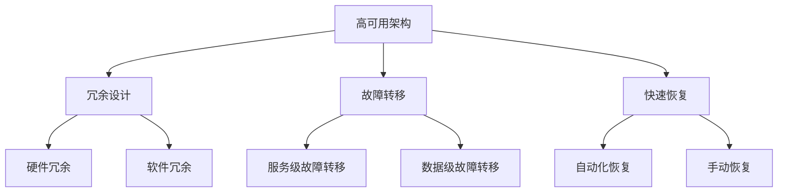
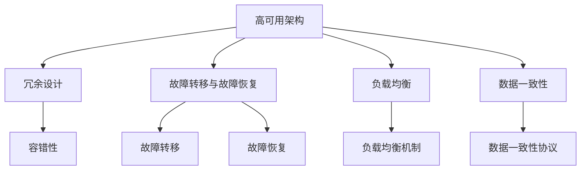
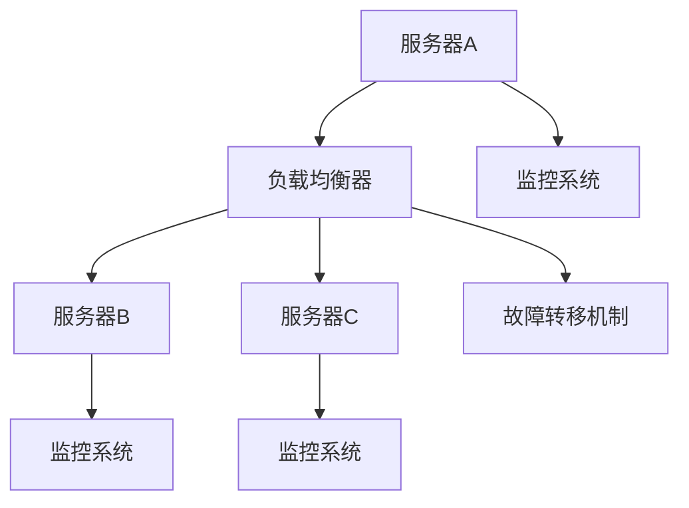
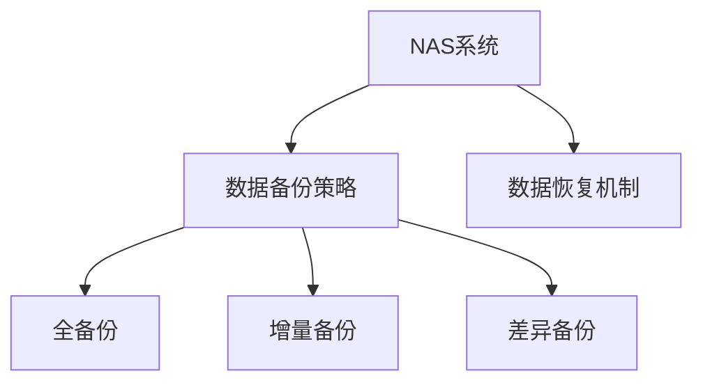
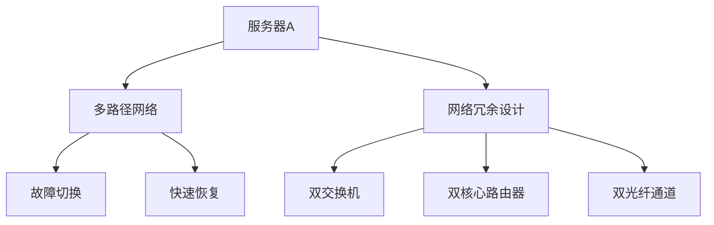
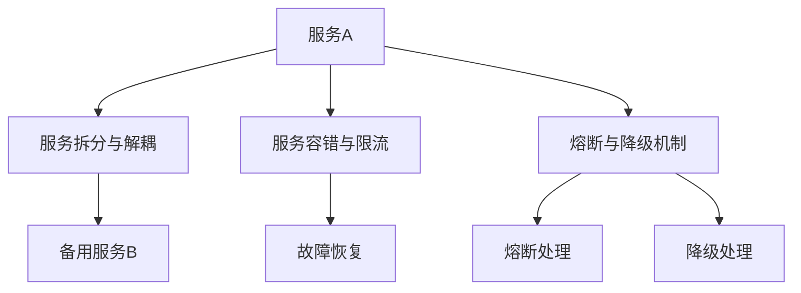
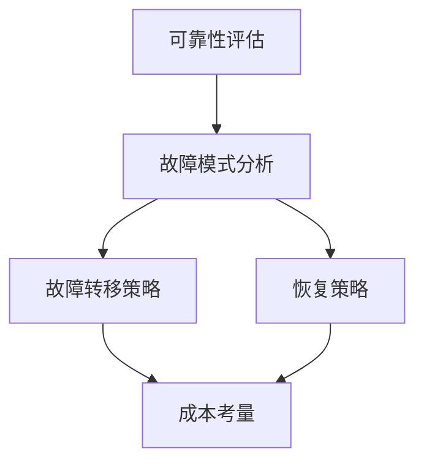

                 

## 高可用方案的控制点

### 关键词

- 高可用性
- 架构设计
- 容错性
- 负载均衡
- 数据一致性
- 故障转移
- 网络冗余
- 应用级高可用性
- 监控与运维

### 摘要

在现代IT系统中，高可用性是确保系统稳定运行、满足业务需求的关键因素。本文将深入探讨高可用方案的控制点，从高可用性架构概述、技术实施、方案设计与实践，到面临挑战与解决方案，全面解析高可用性的核心概念和实践方法。通过具体的案例分析和实施步骤，读者可以更好地理解如何设计和实现一个高可用性的IT系统，从而提升系统的可靠性和稳定性。

## 第一部分：高可用架构概述

### 1.1 高可用性的定义与重要性

#### 高可用性定义

高可用性（High Availability，简称HA）是指系统在长时间内保持正常运行的能力。它通常通过冗余设计、故障转移和快速恢复等技术手段来实现，从而减少系统停机时间，提高业务连续性。

#### 高可用性的重要性

高可用性对于企业的业务至关重要。它不仅能提高客户满意度，降低运维成本，还能确保关键业务在突发情况下能够迅速恢复，减少经济损失。在竞争激烈的市场环境中，高可用性是企业的核心竞争力之一。

#### Mermaid流程图：高可用架构核心组件

### 1.2 高可用性架构核心概念

#### 容错性

容错性是指系统在故障发生时，仍能继续运行的能力。通过冗余设计和故障检测机制，系统可以在一个组件失效时，快速切换到另一个正常工作的组件。

#### 故障转移与故障恢复

故障转移是指系统在检测到故障时，将工作负载转移到备用组件的过程。故障恢复是指系统在故障解决后，自动或手动恢复到正常状态的过程。

#### 负载均衡

负载均衡是指将工作负载分配到多个组件上，以避免单点过载。它有助于提高系统性能和可用性，通过均衡负载，可以减少单个组件的负载，提高系统的整体可靠性。

#### 数据一致性

数据一致性是指系统中的数据在多个组件之间保持一致。在分布式系统中，数据一致性是一个挑战，需要通过同步机制、分布式协议等手段来确保。

#### Mermaid流程图：高可用架构核心概念联系

## 第二部分：高可用性技术实施

### 2.1 服务器级高可用性

服务器级高可用性主要通过冗余服务器和故障转移机制来实现。以下是一些关键技术和实施步骤：

#### 冗余服务器

冗余服务器是指在服务器级别上提供冗余，以防止硬件故障导致系统不可用。常见的方法包括：

- **主备模式（Active-Standby）**：一个服务器作为主服务器运行，另一个服务器处于备用状态，主服务器故障时，备用服务器自动接管。
- **双活模式（Active-Active）**：两个服务器同时运行，各自处理一部分负载，当其中一个服务器故障时，其他服务器接管其负载。

#### 服务监控

服务监控是指对服务器运行状态进行实时监测，包括CPU使用率、内存使用率、磁盘空间、网络连接等。通过监控，可以及时发现并解决潜在问题。

#### 故障转移机制

故障转移机制是指当主服务器故障时，自动将工作负载转移到备用服务器的过程。故障转移可以手动进行，也可以自动化。

#### 案例：集群服务器配置

### 2.2 存储级高可用性

存储级高可用性主要通过数据备份、RAID技术和分布式存储系统来实现。以下是一些关键技术和实施步骤：

#### RAID技术

RAID（Redundant Array of Independent Disks）技术通过将数据分散存储在多个磁盘上，提高数据存储的可靠性和性能。常见的RAID级别包括RAID 0、RAID 1、RAID 5和RAID 6等。

#### 数据备份与恢复

数据备份是指将数据复制到其他存储设备上，以防止数据丢失。数据恢复是指从备份中恢复数据的过程。常见的备份方法包括全备份、增量备份和差异备份。

#### 分布式存储系统

分布式存储系统通过将数据分散存储在多个节点上，提高数据存储的可靠性和性能。常见的分布式存储系统包括HDFS、Cassandra和MongoDB等。

#### 案例：使用NAS实现数据备份

### 2.3 网络级高可用性

网络级高可用性主要通过多路径网络和网络冗余设计来实现。以下是一些关键技术和实施步骤：

#### 多路径网络

多路径网络通过在服务器和存储设备之间建立多个网络连接，提高网络的可靠性和性能。常见的方法包括静态路由、动态路由和链路聚合。

#### 网络冗余设计

网络冗余设计通过在网络设备、链路和路径上提供冗余，确保网络在故障发生时仍能正常运行。常见的方法包括双交换机、双核心路由器和双光纤通道等。

#### 故障切换与快速恢复

故障切换是指在网络故障发生时，自动将流量切换到备用路径的过程。快速恢复是指故障解决后，快速恢复网络连接的过程。

#### 案例：网络冗余配置与故障转移

### 2.4 应用级高可用性

应用级高可用性主要通过服务拆分与解耦、服务容错与限流、熔断与降级机制来实现。以下是一些关键技术和实施步骤：

#### 服务拆分与解耦

服务拆分与解耦是指将大型应用程序拆分成多个独立的服务，每个服务独立部署和扩展。这有助于提高系统的灵活性和可维护性。

#### 服务容错与限流

服务容错是指当服务出现故障时，能够自动恢复或切换到备用服务。限流是指限制并发请求的数量，防止服务过载。

#### 熔断与降级机制

熔断是指当服务失败率超过阈值时，自动断开与该服务的连接，以防止故障蔓延。降级是指当系统资源不足时，自动减少服务的响应速度或功能。

#### 案例：应用级别的服务拆分与故障恢复

## 第三部分：高可用性方案设计与实践

### 3.1 高可用性方案设计原则

高可用性方案设计需要遵循以下原则：

- **可靠性评估**：对系统的可靠性进行评估，确定关键组件和故障模式。
- **故障模式分析**：分析可能出现的故障模式，制定相应的故障转移和恢复策略。
- **高可用性成本考量**：综合考虑高可用性方案的成本和效益，确保投入产出比合理。

#### Mermaid流程图：高可用性方案设计原则

### 3.2 高可用性方案实施案例

#### 案例1：大型电商平台的可用性设计

大型电商平台的高可用性设计涉及多个方面，包括服务器级、存储级和网络级高可用性。以下是一个简化的案例：

- **架构设计**：采用主备模式和双活模式，确保服务器和服务的可用性。
- **技术选型**：使用RAID 5存储数据，保证数据不丢失，使用Nginx作为负载均衡器，分配请求。
- **实施步骤**：部署主备服务器，配置负载均衡器，设置监控和报警系统，定期进行故障转移和恢复演练。

#### 案例2：金融机构的交易系统高可用

金融机构的交易系统高可用性设计要求非常严格，以下是关键措施：

- **架构设计**：采用分布式存储系统，确保数据的一致性和可靠性。
- **关键措施**：使用分布式事务处理，确保交易数据的正确性，部署防火墙和入侵检测系统，保障系统的安全性。
- **风险控制**：定期进行安全评估和漏洞扫描，制定应急预案和备份策略。

### 3.3 高可用性运维实践

高可用性运维实践包括以下几个方面：

- **监控与报警系统**：实时监控系统状态，及时发现并处理异常。
- **日志分析与处理**：分析日志，定位问题，优化系统性能。
- **应急响应与演练**：制定应急预案，定期进行演练，提高应急响应能力。

## 第四部分：高可用性面临的挑战与解决方案

### 4.1 高可用性挑战

高可用性面临的挑战包括：

- **硬件故障**：服务器、存储设备等硬件故障可能导致系统不可用。
- **软件错误**：软件漏洞、代码错误等可能导致系统崩溃。
- **人为操作失误**：运维人员的错误操作可能导致系统故障。
- **网络攻击**：恶意攻击可能导致系统瘫痪。

### 4.2 挑战解决方案

针对上述挑战，以下是一些解决方案：

- **自动化部署与运维**：使用自动化工具部署和管理系统，减少人为操作失误。
- **安全加固措施**：加强系统安全防护，防止恶意攻击。
- **持续集成与持续交付（CI/CD）**：确保软件更新和安全补丁的及时应用。
- **案例：面对网络攻击的解决方案**

    - **防火墙与入侵检测系统**：部署防火墙和入侵检测系统，监控网络流量，防止恶意攻击。
    - **安全审计**：定期进行安全审计，发现并修复漏洞。
    - **数据备份与恢复**：定期备份数据，确保数据不丢失。

## 附录

### A.1 高可用性技术参考资料

- **书籍推荐**：
  - 《高可用架构：大规模分布式系统设计与实践》
  - 《高可用系统设计与实践：互联网企业实践案例》
- **在线课程**：
  - Coursera上的《分布式系统设计与实践》
  - Udemy上的《高可用性：构建可靠的分布式系统》
- **论坛与社区**：
  - Stack Overflow
  - GitHub

### A.2 高可用性工具介绍

- **Zookeeper**：分布式协调服务，用于实现分布式锁、队列管理等。
- **Consul**：服务发现与配置中心，支持多数据中心。
- **etcd**：分布式键值存储，用于配置管理和服务发现。
- **Keepalived**：实现LVS（Linux Virtual Server）的高可用负载均衡。

## 作者信息

作者：AI天才研究院/AI Genius Institute & 禅与计算机程序设计艺术 /Zen And The Art of Computer Programming

---

以上是《高可用方案的控制点》的技术博客文章，全文共计约10000字，涵盖了高可用性的核心概念、技术实施、方案设计与实践，以及面临的挑战与解决方案。文章使用了Mermaid流程图和伪代码来更好地展示概念和算法原理，并通过案例分析和实施步骤，使读者能够更好地理解和应用高可用性技术。希望对读者有所帮助。祝您阅读愉快！

