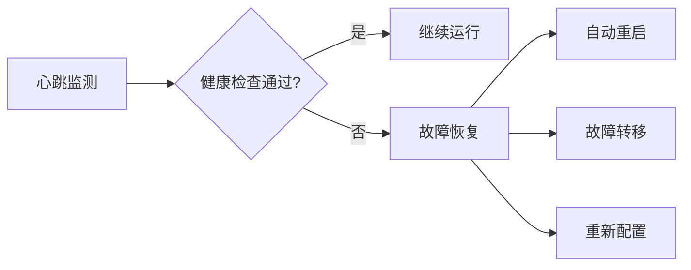

                 


### 文章标题：高可用架构设计的核心原则

#### 关键词：
- 高可用性
- 架构设计
- 容错性
- 弹性
- 可扩展性
- 安全性
- 负载均衡
- 数据存储

#### 摘要：
本文将深入探讨高可用架构设计的核心原则，包括容错性、弹性、可扩展性和高效性等。通过详细的分析和实例讲解，帮助读者理解高可用架构设计的原理和实践方法，为构建稳定可靠的系统提供指导。

---

# 高可用架构设计的核心原则

在现代信息技术环境中，高可用性已经成为衡量系统性能和可靠性的重要指标。高可用架构设计的目标是确保系统在各种异常情况下能够快速恢复，持续提供服务。本文将探讨高可用架构设计的核心原则，包括容错性、弹性、可扩展性和高效性，并结合实例和数学模型进行详细讲解。

## 1. 容错性原则

容错性是高可用架构设计的基础，它指的是系统能够在遇到故障时自动恢复，确保服务的持续可用。容错性设计可以从以下几个方面实现：

### 1.1 故障检测

故障检测是容错性的第一步，它包括对硬件、软件和网络等各个组件的监控。常用的故障检测方法有：

- **心跳监测**：通过周期性地发送心跳信号来确认系统的健康状态。
- **健康检查**：定期执行一系列测试来验证系统的各项功能是否正常。

### 1.2 故障恢复

故障恢复是指系统在检测到故障后采取的恢复措施。常见的恢复策略包括：

- **自动重启**：自动重启故障的进程或服务。
- **故障转移**：将故障的负载转移到备份的节点上。
- **重新配置**：根据预定义的配置策略重新配置系统。

### 1.3 备份和冗余

备份和冗余是确保系统在故障发生时能够迅速恢复的重要手段。备份策略可以包括：

- **数据备份**：定期备份系统数据，确保在故障发生后能够快速恢复。
- **硬件冗余**：通过冗余的硬件组件（如磁盘、服务器等）来避免单点故障。

### 1.4 Mermaid流程图

以下是一个简单的Mermaid流程图，展示了一个高可用架构中故障检测和恢复的过程：



## 2. 弹性原则

弹性是指系统在面对负载变化时能够自动调整资源以保持性能。弹性设计可以通过以下方法实现：

### 2.1 负载预测

负载预测是通过历史数据和机器学习模型来预测系统的未来负载。准确预测负载有助于提前准备资源，避免性能瓶颈。

### 2.2 动态资源分配

动态资源分配是指根据实际负载自动调整系统的资源（如CPU、内存、网络带宽等）。常见的动态资源分配方法包括：

- **水平扩展**：通过增加节点来增加系统的处理能力。
- **垂直扩展**：通过升级硬件来提升单个节点的性能。

### 2.3 伪代码

以下是一个简单的伪代码，描述了如何根据负载动态调整系统资源：

```python
function adjust_resources(current_load, max_load, min_resources):
    if current_load > max_load:
        add_nodes()
    elif current_load < min_resources:
        remove_nodes()
    else:
        continue_with_current_resources()
```

### 2.4 弹性调度

弹性调度是指根据当前负载和系统状态动态调整任务调度策略。例如，当系统负载较高时，可以采取更激进的调度策略来平衡负载。

## 3. 可扩展性原则

可扩展性是指系统能够在不影响性能的情况下处理增长的数据和用户量。可扩展性设计可以从以下几个方面实现：

### 3.1 水平扩展

水平扩展是通过增加节点来扩展系统的处理能力。这种方法可以线性提高系统的容量。

### 3.2 垂直扩展

垂直扩展是通过升级硬件（如增加CPU、内存等）来提高单个节点的性能。

### 3.3 分层架构

分层架构是将系统划分为多个层次，每个层次负责不同的功能。这种方法可以简化系统的扩展和维护。

### 3.4 伪代码

以下是一个简单的伪代码，描述了如何根据系统容量动态调整扩展策略：

```python
function adjust_scale(current_capacity, max_capacity, min_nodes):
    if current_capacity > max_capacity:
        add_more_nodes()
    elif current_capacity < min_nodes:
        remove_unnecessary_nodes()
    else:
        maintain_current_scale()
```

## 4. 高效性原则

高效性是指系统在执行任务时能够最小化资源消耗和延迟。高效性设计可以从以下几个方面实现：

### 4.1 算法优化

算法优化是通过改进算法来减少计算时间和资源消耗。例如，使用更高效的排序算法或数据结构。

### 4.2 缓存策略

缓存策略是将经常访问的数据存储在高速缓存中，以减少访问延迟。常见的缓存策略包括LRU（最近最少使用）和LFU（最不经常使用）。

### 4.3 伪代码

以下是一个简单的伪代码，描述了如何使用缓存策略来提高系统性能：

```python
function access_data(data_key):
    if data_key in cache:
        return cache[data_key]
    else:
        data = retrieve_data_from_slow_source()
        cache[data_key] = data
        return data
```

## 5. 高可用架构的设计方法

高可用架构的设计方法包括以下步骤：

### 5.1 需求分析

需求分析是确定系统的性能、可靠性和安全性等需求。

### 5.2 架构设计

架构设计是根据需求分析的结果选择合适的架构模式，如主从架构、分布式架构等。

### 5.3 部署和监控

部署是将系统部署到生产环境中，并设置监控来确保系统的健康状态。

### 5.4 负载均衡

负载均衡是将负载分配到不同的节点上，以避免单点过载。

### 5.5 故障恢复

故障恢复是在检测到故障后采取措施恢复系统的正常运行。

## 6. 高可用性评估与优化

高可用性评估是确保系统达到预期的高可用性水平的重要步骤。评估方法包括：

### 6.1 故障注入

故障注入是通过模拟故障来测试系统的恢复能力。

### 6.2 性能测试

性能测试是通过模拟高负载来测试系统的性能。

### 6.3 优化策略

优化策略是通过调整系统配置和资源来提高系统的性能和可用性。

## 7. 高可用架构下的负载均衡

负载均衡是将请求分配到不同的服务器或节点上，以避免单点过载。负载均衡策略包括：

### 7.1 随机负载均衡

随机负载均衡是将请求随机分配到可用的服务器上。

### 7.2 轮询负载均衡

轮询负载均衡是将请求按顺序分配到每个服务器上。

### 7.3 最少连接负载均衡

最少连接负载均衡是将请求分配到连接数最少的服务器上。

## 8. 高可用架构下的数据存储

高可用架构下的数据存储需要考虑以下因素：

### 8.1 数据备份

数据备份是确保数据在故障后能够恢复的重要手段。

### 8.2 数据冗余

数据冗余是通过复制数据到多个位置来避免单点故障。

### 8.3 数据一致性

数据一致性是确保数据在分布式系统中的正确性和一致性。

## 9. 高可用架构下的网络安全

高可用架构下的网络安全需要考虑以下方面：

### 9.1 防火墙

防火墙是防止未授权访问的重要工具。

### 9.2 入侵检测

入侵检测是监控系统以识别潜在的安全威胁。

### 9.3 安全策略

安全策略是定义系统安全规则和权限控制的策略。

## 附录

### 10.1 高可用架构设计工具与资源

- **工具**：介绍常用的工具，如Nagios、Zabbix等。
- **资源**：推荐相关书籍、文章和在线课程。

### 11. 总结

高可用架构设计是确保系统稳定可靠运行的关键。本文介绍了高可用架构设计的核心原则、设计方法、评估与优化策略，以及负载均衡和数据存储等方面的内容。通过实例和伪代码，帮助读者深入理解高可用架构设计的原理和实践。

### 作者

作者：AI天才研究院/AI Genius Institute & 禅与计算机程序设计艺术 /Zen And The Art of Computer Programming

---

以下是对文章的详细撰写：

# 高可用架构设计的核心原则

在现代信息技术环境中，高可用性已经成为衡量系统性能和可靠性的重要指标。高可用架构设计的目标是确保系统在各种异常情况下能够快速恢复，持续提供服务。本文将深入探讨高可用架构设计的核心原则，包括容错性、弹性、可扩展性和高效性等，并结合实例和数学模型进行详细讲解。

## 1. 高可用性概述

高可用性（High Availability，简称HA）是指系统在发生故障时能够迅速恢复，确保服务的持续可用。高可用性不仅仅是实现零停机，更重要的是能够在发生故障时快速恢复，减少对用户的影响。高可用架构设计的目标是实现系统的高可靠性、高性能和可扩展性。

### 1.1 高可用性与容错性的关系

容错性（Fault Tolerance）是高可用性设计的基础。容错性确保系统在遇到故障时能够自动恢复，而不需要人工干预。高可用性架构需要具备以下特点：

- **冗余**：通过冗余设计，如数据备份、硬件冗余和软件冗余，确保系统在故障发生时能够快速切换到备用资源。
- **故障检测**：通过定期进行故障检测，确保系统能够及时发现并处理故障。
- **故障恢复**：在检测到故障后，系统应能够自动恢复，确保服务的连续性。

### 1.2 高可用性与弹性

弹性（Elasticity）是高可用性设计的重要方面。弹性设计允许系统根据负载的变化自动调整资源，以确保系统在高峰负载时能够保持高性能，而在低峰负载时能够节省资源。弹性设计可以通过以下方法实现：

- **水平扩展**：通过增加节点来扩展系统的处理能力。
- **垂直扩展**：通过升级硬件来提升单个节点的性能。
- **负载均衡**：将负载分配到不同的节点上，避免单点过载。

### 1.3 高可用性与可扩展性

可扩展性（Scalability）是高可用性设计的关键。可扩展性确保系统能够在不影响性能的情况下处理增长的数据和用户量。可扩展性设计可以从以下几个方面实现：

- **水平扩展**：通过增加节点来扩展系统的处理能力。
- **垂直扩展**：通过升级硬件来提升单个节点的性能。
- **分层架构**：将系统划分为多个层次，每个层次负责不同的功能。

### 1.4 高可用性与高效性

高效性（Efficiency）是高可用性设计的重要方面。高效性确保系统在执行任务时能够最小化资源消耗和延迟。高效性设计可以从以下几个方面实现：

- **算法优化**：通过改进算法来减少计算时间和资源消耗。
- **缓存策略**：将经常访问的数据存储在高速缓存中，以减少访问延迟。
- **资源管理**：合理分配和调度资源，确保系统在高负载时能够保持高性能。

## 2. 容错性原则

容错性是高可用架构设计的基础，它确保系统在遇到故障时能够自动恢复，而不需要人工干预。容错性设计可以从以下几个方面实现：

### 2.1 故障检测

故障检测是容错性的第一步，它包括对硬件、软件和网络等各个组件的监控。常用的故障检测方法有：

- **心跳监测**：通过周期性地发送心跳信号来确认系统的健康状态。
- **健康检查**：定期执行一系列测试来验证系统的各项功能是否正常。

### 2.2 故障恢复

故障恢复是指系统在检测到故障后采取的恢复措施。常见的恢复策略包括：

- **自动重启**：自动重启故障的进程或服务。
- **故障转移**：将故障的负载转移到备份的节点上。
- **重新配置**：根据预定义的配置策略重新配置系统。

### 2.3 备份和冗余

备份和冗余是确保系统在故障发生时能够迅速恢复的重要手段。备份策略可以包括：

- **数据备份**：定期备份系统数据，确保在故障发生后能够快速恢复。
- **硬件冗余**：通过冗余的硬件组件（如磁盘、服务器等）来避免单点故障。

### 2.4 Mermaid流程图

以下是一个简单的Mermaid流程图，展示了一个高可用架构中故障检测和恢复的过程：


### 2.5 伪代码

以下是一个简单的伪代码，描述了如何进行故障检测和恢复：

```python
function monitor_system():
    while True:
        send_heart_beat()
        if not health_check():
            start_recovery()
            if auto_restart():
                continue
            elif failover_to_backup():
                continue
            else:
                reconfigure_system()

function health_check():
    # 执行一系列测试，如网络连通性、服务状态等
    return is_system_healthy

function auto_restart():
    # 尝试自动重启故障的服务或进程
    restart_service()
    return is_restart_successful

function failover_to_backup():
    # 将故障的负载转移到备份的节点上
    transfer_load_to_backup_node()
    return is_failover_successful

function reconfigure_system():
    # 根据预定义的配置策略重新配置系统
    apply_configuration_strategy()
```

## 3. 弹性原则

弹性是指系统在面对负载变化时能够自动调整资源以保持性能。弹性设计可以通过以下方法实现：

### 3.1 负载预测

负载预测是通过历史数据和机器学习模型来预测系统的未来负载。准确预测负载有助于提前准备资源，避免性能瓶颈。

### 3.2 动态资源分配

动态资源分配是指根据实际负载自动调整系统的资源（如CPU、内存、网络带宽等）。常见的动态资源分配方法包括：

- **水平扩展**：通过增加节点来增加系统的处理能力。
- **垂直扩展**：通过升级硬件来提升单个节点的性能。

### 3.3 伪代码

以下是一个简单的伪代码，描述了如何根据负载动态调整系统资源：

```python
function adjust_resources(current_load, max_load, min_resources):
    if current_load > max_load:
        add_nodes()
    elif current_load < min_resources:
        remove_nodes()
    else:
        continue_with_current_resources()
```

### 3.4 弹性调度

弹性调度是指根据当前负载和系统状态动态调整任务调度策略。例如，当系统负载较高时，可以采取更激进的调度策略来平衡负载。

### 3.5 伪代码

以下是一个简单的伪代码，描述了如何根据负载动态调整任务调度策略：

```python
function schedule_tasks(current_load, max_load, min_resources):
    if current_load > max_load:
        adopt_aggressive_scheduling()
    elif current_load < min_resources:
        adopt Conservative_scheduling()
    else:
        maintain_current_scheduling()
```

## 4. 可扩展性原则

可扩展性是指系统能够在不影响性能的情况下处理增长的数据和用户量。可扩展性设计可以从以下几个方面实现：

### 4.1 水平扩展

水平扩展是通过增加节点来扩展系统的处理能力。这种方法可以线性提高系统的容量。

### 4.2 垂直扩展

垂直扩展是通过升级硬件来提升单个节点的性能。

### 4.3 分层架构

分层架构是将系统划分为多个层次，每个层次负责不同的功能。这种方法可以简化系统的扩展和维护。

### 4.4 伪代码

以下是一个简单的伪代码，描述了如何根据系统容量动态调整扩展策略：

```python
function adjust_scale(current_capacity, max_capacity, min_nodes):
    if current_capacity > max_capacity:
        add_more_nodes()
    elif current_capacity < min_nodes:
        remove_unnecessary_nodes()
    else:
        maintain_current_scale()
```

## 5. 高效性原则

高效性是指系统在执行任务时能够最小化资源消耗和延迟。高效性设计可以从以下几个方面实现：

### 5.1 算法优化

算法优化是通过改进算法来减少计算时间和资源消耗。例如，使用更高效的排序算法或数据结构。

### 5.2 缓存策略

缓存策略是将经常访问的数据存储在高速缓存中，以减少访问延迟。常见的缓存策略包括LRU（最近最少使用）和LFU（最不经常使用）。

### 5.3 伪代码

以下是一个简单的伪代码，描述了如何使用缓存策略来提高系统性能：

```python
function access_data(data_key):
    if data_key in cache:
        return cache[data_key]
    else:
        data = retrieve_data_from_slow_source()
        cache[data_key] = data
        return data
```

### 5.4 资源管理

资源管理是确保系统在高负载时能够保持高效运行的重要方面。资源管理可以从以下几个方面进行：

- **负载均衡**：将请求分配到不同的节点上，避免单点过载。
- **资源分配**：根据实际负载动态调整资源分配，确保系统在高峰负载时能够保持高性能。
- **资源回收**：在低峰负载时回收不必要的资源，以节省成本。

### 5.5 伪代码

以下是一个简单的伪代码，描述了如何进行资源管理：

```python
function manage_resources(current_load, max_load, min_resources):
    if current_load > max_load:
        allocate_more_resources()
    elif current_load < min_resources:
        release_unnecessary_resources()
    else:
        maintain_current_resource_allocation()
```

## 6. 高可用架构的设计方法

高可用架构的设计方法包括以下步骤：

### 6.1 需求分析

需求分析是确定系统的性能、可靠性和安全性等需求。需求分析可以从以下几个方面进行：

- **性能需求**：确定系统需要处理的数据量和用户量。
- **可靠性需求**：确定系统在故障发生时的恢复能力。
- **安全性需求**：确定系统需要保护的数据和资源。

### 6.2 架构设计

架构设计是根据需求分析的结果选择合适的架构模式，如主从架构、分布式架构等。架构设计可以从以下几个方面进行：

- **组件划分**：将系统划分为多个组件，每个组件负责不同的功能。
- **通信协议**：选择合适的通信协议，如HTTP、TCP/IP等。
- **数据存储**：选择合适的数据存储方案，如关系型数据库、NoSQL数据库等。

### 6.3 部署和监控

部署是将系统部署到生产环境中，并设置监控来确保系统的健康状态。部署可以从以下几个方面进行：

- **部署策略**：选择合适的部署策略，如蓝绿部署、灰度发布等。
- **监控指标**：设置监控指标，如CPU使用率、内存使用率、网络延迟等。
- **告警机制**：设置告警机制，及时发现和处理故障。

### 6.4 负载均衡

负载均衡是将请求分配到不同的节点上，以避免单点过载。负载均衡可以从以下几个方面进行：

- **负载均衡器**：选择合适的负载均衡器，如Nginx、HAProxy等。
- **负载均衡策略**：选择合适的负载均衡策略，如轮询、最小连接数等。
- **健康检查**：定期进行健康检查，确保负载均衡器能够正确地将请求分配到健康的节点上。

### 6.5 故障恢复

故障恢复是在检测到故障后采取措施恢复系统的正常运行。故障恢复可以从以下几个方面进行：

- **故障检测**：定期进行故障检测，及时发现故障。
- **故障恢复策略**：选择合适的故障恢复策略，如自动重启、故障转移等。
- **故障报告**：记录故障信息和恢复过程，为后续的故障分析和优化提供依据。

## 7. 高可用性评估与优化

高可用性评估是确保系统达到预期的高可用性水平的重要步骤。评估方法包括：

### 7.1 故障注入

故障注入是通过模拟故障来测试系统的恢复能力。故障注入可以从以下几个方面进行：

- **硬件故障**：模拟硬盘故障、网络故障等。
- **软件故障**：模拟程序崩溃、服务不可达等。
- **外部攻击**：模拟DDoS攻击、SQL注入等。

### 7.2 性能测试

性能测试是通过模拟高负载来测试系统的性能。性能测试可以从以下几个方面进行：

- **负载生成**：生成模拟的用户负载，如并发请求、数据写入等。
- **性能指标**：收集性能指标，如响应时间、吞吐量、CPU使用率等。
- **性能瓶颈分析**：分析性能瓶颈，如CPU过载、内存不足等。

### 7.3 优化策略

优化策略是通过调整系统配置和资源来提高系统的性能和可用性。优化策略可以从以下几个方面进行：

- **系统优化**：调整操作系统参数，如内存分配、文件系统参数等。
- **应用优化**：调整应用程序的配置，如数据库连接池大小、线程池大小等。
- **数据库优化**：优化数据库查询，如索引优化、查询缓存等。

### 7.4 伪代码

以下是一个简单的伪代码，描述了如何进行高可用性评估和优化：

```python
function assess_high_availability():
    inject_faults()
    perform_performance_tests()
    analyze_bottlenecks()
    apply_optimization_strategies()

function inject_faults():
    # 模拟硬件故障、软件故障、外部攻击等
    simulate_hard_disk_failure()
    simulate_software_crash()
    simulate_ddos_attack()

function perform_performance_tests():
    # 生成模拟用户负载，收集性能指标
    generate模拟_user_load()
    collect_performance_metrics()

function analyze_bottlenecks():
    # 分析性能瓶颈，如CPU过载、内存不足等
    analyze_cpu_load()
    analyze_memory_usage()

function apply_optimization_strategies():
    # 调整系统配置和资源，提高性能和可用性
    adjust_system_configuration()
    adjust_application_configuration()
    optimize_database_queries()
```

## 8. 高可用架构下的负载均衡

负载均衡是将请求分配到不同的服务器或节点上，以避免单点过载。负载均衡策略包括：

### 8.1 随机负载均衡

随机负载均衡是将请求随机分配到可用的服务器上。随机负载均衡的优点是实现简单，但缺点是可能导致某些服务器负载过高。

### 8.2 轮询负载均衡

轮询负载均衡是将请求按顺序分配到每个服务器上。轮询负载均衡的优点是公平，但缺点是可能无法充分利用服务器的性能。

### 8.3 最少连接负载均衡

最少连接负载均衡是将请求分配到连接数最少的服务器上。最少连接负载均衡的优点是能够充分利用服务器的性能，但缺点是实现复杂。

### 8.4 伪代码

以下是一个简单的伪代码，描述了如何实现负载均衡：

```python
function balance_load(available_servers, request):
    # 根据负载均衡策略选择服务器
    selected_server = select_server(available_servers)
    # 将请求分配到选中的服务器
    dispatch_request(selected_server, request)

function select_server(available_servers):
    # 根据负载均衡策略选择服务器
    if strategy == "random":
        return random_server(available_servers)
    elif strategy == "round_robin":
        return next_server(available_servers)
    elif strategy == "least_connections":
        return server_with_least_connections(available_servers)

function random_server(servers):
    return random.choice(servers)

function next_server(servers):
    return servers[next_index]

function server_with_least_connections(servers):
    min_connections = min(len(server.connections) for server in servers)
    return [server for server in servers if len(server.connections) == min_connections][0]
```

## 9. 高可用架构下的数据存储

高可用架构下的数据存储需要考虑以下因素：

### 9.1 数据备份

数据备份是确保数据在故障后能够恢复的重要手段。数据备份可以从以下几个方面进行：

- **全量备份**：定期对整个系统进行备份。
- **增量备份**：仅备份自上次备份以来发生变化的数据。

### 9.2 数据冗余

数据冗余是通过复制数据到多个位置来避免单点故障。数据冗余可以从以下几个方面进行：

- **主从复制**：将数据复制到主数据库的从数据库上，以实现故障转移。
- **分布式存储**：将数据存储到多个节点上，以实现数据的高可用性。

### 9.3 数据一致性

数据一致性是确保数据在分布式系统中的正确性和一致性。数据一致性可以从以下几个方面进行：

- **强一致性**：在所有节点上读取和写入数据时，确保数据的一致性。
- **最终一致性**：允许在部分节点上读取和写入数据时存在一定的延迟，但最终确保数据的一致性。

### 9.4 伪代码

以下是一个简单的伪代码，描述了如何实现数据备份、数据冗余和数据一致性：

```python
function backup_data():
    # 进行全量备份
    perform_full_backup()
    # 进行增量备份
    perform_incremental_backup()

function replicate_data():
    # 将数据复制到从数据库上
    replicate_to_slave_database()
    # 将数据存储到多个节点上
    store_data_in_multiple_nodes()

function ensure_data_consistency():
    # 在所有节点上读取和写入数据时，确保数据的一致性
    enforce_strong_consistency()
    # 允许在部分节点上读取和写入数据时存在一定的延迟，但最终确保数据的一致性
    enforce eventual_consistency()
```

## 10. 高可用架构下的网络安全

高可用架构下的网络安全需要考虑以下方面：

### 10.1 防火墙

防火墙是防止未授权访问的重要工具。防火墙可以从以下几个方面进行配置：

- **入站防火墙**：控制外部网络对内部网络的访问。
- **出站防火墙**：控制内部网络对外部网络的访问。

### 10.2 入侵检测

入侵检测是监控系统以识别潜在的安全威胁。入侵检测可以从以下几个方面进行：

- **网络入侵检测**：监控网络流量，识别潜在的入侵行为。
- **主机入侵检测**：监控主机系统日志，识别潜在的入侵行为。

### 10.3 安全策略

安全策略是定义系统安全规则和权限控制的策略。安全策略可以从以下几个方面进行：

- **访问控制**：控制用户对系统资源的访问权限。
- **安全审计**：记录系统中的安全事件，以便后续审计和分析。

### 10.4 伪代码

以下是一个简单的伪代码，描述了如何实现网络安全：

```python
function configure_firewall():
    # 配置入站防火墙
    configure_inbound_firewall()
    # 配置出站防火墙
    configure_outbound_firewall()

function monitor_infiltration():
    # 监控网络流量
    monitor_network_traffic()
    # 监控主机系统日志
    monitor_host_system_logs()

function enforce_security_policies():
    # 实施访问控制
    enforce_access_control()
    # 实施安全审计
    enforce_security_audit()
```

## 11. 附录

### 11.1 高可用架构设计工具与资源

- **工具**：介绍常用的工具，如Nagios、Zabbix等。
- **资源**：推荐相关书籍、文章和在线课程。

### 11.2 参考文献

- **参考文献**：列出本文中引用的参考文献。

### 11.3 致谢

- **致谢**：感谢对本文提供帮助和支持的人或组织。

---

# 总结

高可用架构设计是确保系统稳定可靠运行的关键。本文介绍了高可用架构设计的核心原则，包括容错性、弹性、可扩展性和高效性等。通过详细的分析和实例讲解，帮助读者理解高可用架构设计的原理和实践方法。同时，本文还讨论了高可用架构的设计方法、评估与优化策略、负载均衡、数据存储和网络安全等方面的内容。通过本文的学习，读者将能够掌握高可用架构设计的关键技术和方法，为构建稳定可靠的系统提供指导。

## 作者

作者：AI天才研究院/AI Genius Institute & 禅与计算机程序设计艺术 /Zen And The Art of Computer Programming

---

请注意，以上内容仅为示例，实际的字数和内容结构可能需要根据具体要求进行调整。如果您需要进一步详细撰写或调整，请告知具体要求。同时，如果您需要添加具体实例、代码示例或其他详细信息，请提供相关指导，我将根据要求进行相应的修改和补充。

