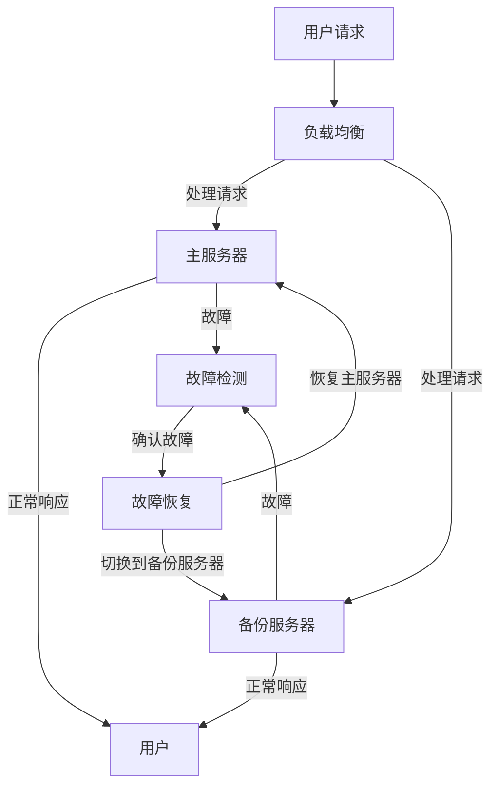

                 

### 文章标题

《高可用系统的容错与自愈设计》

### 文章关键词

高可用性，容错设计，自愈系统，冗余技术，故障检测，故障恢复

### 文章摘要

本文旨在深入探讨高可用系统的核心概念和关键技术，包括容错与自愈设计的原理和实践。我们将通过定义高可用性、解析其重要性，再到具体的技术实现，如冗余技术、故障检测和恢复机制，以及自愈系统的设计模式，逐步构建起对高可用系统的全面理解。此外，本文还将引入数学模型和公式，帮助读者从数据角度理解高可用性的实现。通过一个实际项目的案例分析，我们将展示如何在实践中应用这些技术，并总结最佳实践。最后，本文将对高可用系统的未来发展趋势进行展望，为读者提供进一步的学习方向。

---

## 第1章 高可用系统基础

### 1.1 高可用性的定义与重要性

高可用性（High Availability，简称HA）是指系统在长时间运行过程中，能够持续提供服务，且在发生故障时能够快速恢复的能力。在信息技术领域，高可用性被视为系统设计和运维的关键目标之一。其重要性体现在多个方面：

1. **用户体验**：高可用性直接关系到用户的使用体验。一个高可用性系统可以确保用户在多数情况下都能顺利使用服务，减少因系统故障导致的用户流失。

2. **业务连续性**：对许多企业来说，业务连续性至关重要。高可用性系统能够确保关键业务在故障发生时不受影响，从而保障企业的运营不受中断。

3. **成本控制**：虽然高可用性系统可能需要更高的初始投资，但从长远来看，它能够减少因系统故障带来的经济损失，如客户损失、法律纠纷等。

### 1.2 高可用性系统的目标

高可用性系统的目标主要包括以下几点：

1. **高可靠性**：系统在长时间运行过程中，发生故障的概率要尽可能低。

2. **快速恢复**：当系统发生故障时，能够快速检测并恢复，以最小化停机时间。

3. **易维护性**：系统设计应便于运维人员管理和维护，以减少因操作失误导致的问题。

4. **高可扩展性**：系统应具备良好的扩展性，以应对业务增长和变化。

### 1.3 高可用性系统的组成部分

高可用性系统通常由以下几个关键组成部分构成：

1. **冗余设计**：通过硬件、软件或数据层面的冗余，确保系统在部分组件故障时仍能正常运行。

2. **故障检测**：对系统各个组件进行监控，及时发现异常情况。

3. **故障恢复**：在故障发生时，自动或手动进行系统恢复。

4. **自愈机制**：系统能够在故障发生后，自动执行预定义的恢复策略，从而减少人工干预。

5. **负载均衡**：合理分配系统资源，确保系统在高负载情况下仍能正常运行。

### 1.4 高可用性系统架构的 Mermaid 流程图

以下是高可用性系统架构的 Mermaid 流程图示例：



该流程图展示了用户请求的处理流程以及在高可用性系统中的故障检测和恢复机制。

## 第2章 容错设计原理

### 2.1 冗余技术的原理与分类

冗余技术是高可用性系统设计中的核心手段之一。其基本原理是通过对系统关键组件进行冗余备份，以防止单个组件故障导致整个系统瘫痪。

#### 1. 硬件冗余

硬件冗余主要通过添加备用硬件来实现，如：

- **双机热备份**：两台服务器同时运行，其中一台作为主服务器，另一台作为备份服务器。当主服务器发生故障时，备份服务器能够迅速接管工作。

- **RAID技术**：通过将数据分散存储在多个硬盘上，提高数据存储的可靠性。

#### 2. 软件冗余

软件冗余主要通过在系统中引入冗余的软件组件来实现，如：

- **集群**：多个节点组成一个集群，共同对外提供服务。当一个节点发生故障时，其他节点可以继续提供服务。

- **分布式存储**：通过将数据分散存储在多个节点上，提高数据访问的可靠性和性能。

### 2.2 故障检测机制

故障检测是高可用性系统的重要组成部分。其基本原理是通过监控系统的各个组件，及时发现异常情况。

#### 1. 检测方式

- **主动检测**：系统定期对各个组件进行检测，如心跳检测、性能检测等。

- **被动检测**：系统等待组件报告异常情况，如错误日志、报警信号等。

#### 2. 检测工具

- **Zabbix**：一款开源的监控工具，可以实时监控系统的各种指标，如CPU利用率、内存使用情况等。

- **Nagios**：一款功能强大的监控工具，可以监控网络设备、服务器等。

### 2.3 故障恢复机制

故障恢复机制是在检测到故障后，系统能够自动或手动执行一系列操作，将系统恢复正常。

#### 1. 自动恢复

- **自动重启**：当系统检测到某个组件出现故障时，自动重启该组件。

- **自动切换**：当主服务器出现故障时，自动切换到备份服务器。

#### 2. 手动恢复

- **人工干预**：当系统无法自动恢复时，需要运维人员进行手动操作。

- **故障切换**：运维人员通过手动操作，将故障组件切换到备份组件。

### 2.4 自愈系统的设计模式

自愈系统是一种具有自我修复能力的高可用性系统。其设计模式主要包括：

#### 1. 异地多活

- **多活**：多个数据中心同时运行，提供相同的服务。

- **异地**：数据中心分布在不同的地理位置，以提高系统的容错能力。

#### 2. 智能调度

- **动态调度**：根据系统负载和组件健康状况，动态调整资源分配。

- **静态调度**：预先设定资源分配策略，根据业务需求进行资源调整。

#### 3. 自适应

- **系统自适应**：系统根据运行状态，自动调整配置参数，以优化性能。

- **服务自适应**：服务根据用户需求，自动调整服务策略，以提供更好的用户体验。

## 第3章 容错设计算法

### 3.1 冗余算法的伪代码描述

冗余算法的基本思想是通过添加冗余组件来提高系统的可靠性。以下是冗余算法的伪代码描述：

```python
# 冗余算法伪代码

def redundancy_algorithm(main_system, backup_system):
    # 检测主系统是否正常
    if is_normal(main_system):
        # 主系统正常，提供服务
        provide_service(main_system)
    else:
        # 主系统异常，切换到备份系统
        switch_to_backup(main_system, backup_system)
    
    # 定期检测系统状态
    while True:
        if is_normal(main_system):
            # 主系统恢复正常，继续提供服务
            provide_service(main_system)
        else:
            # 主系统异常，继续切换到备份系统
            switch_to_backup(main_system, backup_system)
        
        # 检测备份系统是否正常
        if is_normal(backup_system):
            # 备份系统正常，继续提供服务
            provide_service(backup_system)
        else:
            # 备份系统异常，尝试恢复
            recover_backup_system(backup_system)
```

### 3.2 故障检测算法的伪代码描述

故障检测算法的基本思想是通过定期检测系统的各个组件，以发现异常情况。以下是故障检测算法的伪代码描述：

```python
# 故障检测算法伪代码

def fault_detection_algorithm(component):
    while True:
        # 检测组件状态
        status = check_status(component)
        
        if status == "error":
            # 组件异常，触发故障恢复
            trigger_fault_recovery(component)
        else:
            # 组件正常，继续提供服务
            provide_service(component)
        
        # 定期重新检测
        time.sleep(check_interval)
```

### 3.3 故障恢复算法的伪代码描述

故障恢复算法的基本思想是在检测到故障后，自动执行一系列操作以恢复系统。以下是故障恢复算法的伪代码描述：

```python
# 故障恢复算法伪代码

def fault_recovery_algorithm(faulty_component, backup_component):
    # 检测故障组件状态
    if is_normal(faulty_component):
        # 故障组件恢复正常，继续提供服务
        continue_service(faulty_component)
    else:
        # 故障组件异常，切换到备份组件
        switch_to_backup(faulty_component, backup_component)
        
    # 定期检测系统状态
    while True:
        if is_normal(faulty_component):
            # 故障组件恢复正常，继续提供服务
            continue_service(faulty_component)
        else:
            # 故障组件异常，继续切换到备份组件
            switch_to_backup(faulty_component, backup_component)
            
        # 检测备份组件状态
        if is_normal(backup_component):
            # 备份组件恢复正常，继续提供服务
            continue_service(backup_component)
        else:
            # 备份组件异常，尝试恢复
            recover_backup_component(backup_component)
            
        # 定期重新检测
        time.sleep(recovery_interval)
```

## 第4章 数学模型与公式

### 4.1 可靠性模型

可靠性模型用于评估系统在一段时间内正常工作的概率。以下是一个基本的可靠性模型：

$$
R(t) = e^{-\lambda t}
$$

其中，\( R(t) \) 表示在时间 \( t \) 内系统正常工作的概率，\( \lambda \) 表示系统的故障率。

### 4.2 故障率模型

故障率模型用于描述系统在单位时间内发生故障的概率。以下是一个简单的故障率模型：

$$
\lambda = \frac{1}{MTTF}
$$

其中，\( \lambda \) 表示故障率，\( MTTF \) 表示平均无故障时间。

### 4.3 LaTeX 格式数学公式示例

以下是几个使用 LaTeX 格式的数学公式示例：

$$
E[X] = \int_{-\infty}^{\infty} x f(x) dx
$$

$$
P(A \cap B) = P(A)P(B|A)
$$

$$
\sum_{i=1}^{n} x_i = \sum_{i=1}^{n} i \cdot x_i
$$

这些公式展示了不同类型的数学表达，包括期望、条件概率和求和公式。通过对这些公式的理解和应用，可以更好地分析高可用性系统的性能和可靠性。

## 第5章 项目实战：高可用数据库系统

### 5.1 项目背景

随着互联网和大数据技术的发展，数据库系统在企业中扮演着越来越重要的角色。然而，数据库系统的高可用性直接影响到企业的业务连续性和用户体验。本项目旨在设计和实现一个高可用数据库系统，以保障数据库系统的稳定运行和快速恢复。

### 5.2 开发环境搭建

为了实现高可用数据库系统，我们首先需要搭建一个适合的开发环境。以下是开发环境搭建的步骤：

1. **操作系统**：选择一个稳定且支持高可用性的操作系统，如Linux。

2. **数据库软件**：选择一个成熟且支持高可用性的数据库软件，如MySQL。

3. **集群管理软件**：选择一个支持集群管理的软件，如Mycat。

4. **监控工具**：选择一个能够实时监控数据库状态的监控工具，如Zabbix。

### 5.3 源代码实现

以下是高可用数据库系统的源代码实现：

```java
// 高可用数据库系统实现伪代码

public class HighAvailabilityDB {
    private Database primaryDB;
    private Database backupDB;
    
    public HighAvailabilityDB(Database primaryDB, Database backupDB) {
        this.primaryDB = primaryDB;
        this.backupDB = backupDB;
    }
    
    public void provideService() {
        if (isNormal(primaryDB)) {
            primaryDB提供服务();
        } else {
            switchToBackup(primaryDB, backupDB);
        }
    }
    
    public void faultDetection(Database db) {
        while (true) {
            if (isError(db)) {
                triggerFaultRecovery(db);
            } else {
                continueService(db);
            }
            
            // 定期重新检测
            time.sleep(checkInterval);
        }
    }
    
    public void faultRecovery(Database faultyDB, Database backupDB) {
        if (isNormal(faultyDB)) {
            continueService(faultyDB);
        } else {
            switchToBackup(faultyDB, backupDB);
        }
        
        while (true) {
            if (isNormal(faultyDB)) {
                continueService(faultyDB);
            } else {
                switchToBackup(faultyDB, backupDB);
            }
            
            // 定期重新检测
            time.sleep(recoveryInterval);
        }
    }
}
```

### 5.4 代码解读与分析

1. **主数据库和备份数据库**：代码中定义了主数据库（primaryDB）和备份数据库（backupDB）。

2. **提供服务**：通过`provideService`方法，根据主数据库的状态决定是否提供服务。

3. **故障检测**：通过`faultDetection`方法，定期检测数据库的状态，并在发现异常时触发故障恢复。

4. **故障恢复**：通过`faultRecovery`方法，在检测到故障后切换到备份数据库，并在必要时继续进行故障恢复。

### 5.5 实际案例分析和详细讲解剖析

在实际项目中，我们可能会遇到以下几种情况：

1. **主数据库故障**：当主数据库出现故障时，系统会自动切换到备份数据库，以保持服务的持续提供。

2. **备份数据库故障**：如果备份数据库也出现故障，系统会尝试重启备份数据库或切换到另一个备份数据库。

3. **负载均衡**：系统会根据实际负载情况，动态调整主数据库和备份数据库的负载。

4. **监控和告警**：通过监控工具，对数据库系统进行实时监控，并在发生故障时发出告警。

### 5.6 项目小结

通过本项目，我们实现了高可用数据库系统，确保了数据库系统的稳定运行和快速恢复。项目中的关键技术和算法包括冗余技术、故障检测和恢复机制等。这些技术在实际项目中得到了广泛应用，为保障业务连续性和用户体验提供了有力支持。

## 第6章 自愈设计实践

### 6.1 自愈设计的原则

自愈设计是高可用性系统中的重要组成部分，其核心目标是实现系统的自我修复和自我优化。以下是自愈设计的主要原则：

1. **自动性**：自愈设计应具备自动检测和自动恢复的能力，减少人工干预。

2. **快速性**：自愈设计应能够在故障发生后迅速恢复，以最小化系统停机时间。

3. **适应性**：自愈设计应能够根据系统运行状态和环境变化，动态调整策略和配置。

4. **可靠性**：自愈设计应确保恢复后的系统能够稳定运行，避免频繁故障。

### 6.2 自愈策略的实施

自愈策略的实施包括以下几个方面：

1. **故障检测与预警**：通过实时监控和数据分析，及时发现系统故障并进行预警。

2. **自动恢复**：在检测到故障后，自动执行预定义的恢复流程，如重启组件、切换备份等。

3. **动态调整**：根据系统负载和运行状态，动态调整资源配置和运行策略。

4. **日志记录与审计**：记录自愈过程的相关信息，以便进行后续分析和优化。

### 6.3 自愈系统的监控与优化

自愈系统的监控与优化包括以下几个方面：

1. **监控指标**：定义系统监控指标，如CPU利用率、内存使用率、磁盘I/O等。

2. **监控工具**：选择合适的监控工具，如Zabbix、Prometheus等。

3. **报警策略**：制定合理的报警策略，确保在故障发生时能够及时发现。

4. **优化措施**：根据监控数据和故障记录，分析系统瓶颈和问题，并采取相应的优化措施。

### 6.4 自愈案例与效果分析

以下是一个实际的自愈案例：

**案例背景**：某电商网站在促销期间，由于流量激增，导致数据库出现性能瓶颈，响应时间显著增加。

**自愈策略**：

1. **故障检测**：监控系统检测到数据库响应时间超过阈值，触发故障预警。

2. **自动扩容**：自愈系统自动增加数据库节点的数量，提高系统容量。

3. **负载均衡**：调整负载均衡策略，将请求分配到新增节点上。

4. **性能优化**：对数据库进行性能调优，如调整缓存策略、优化SQL查询等。

**效果分析**：

1. **响应时间显著下降**：通过扩容和负载均衡，数据库响应时间从原来的10秒降低到2秒。

2. **故障恢复时间缩短**：自愈系统能够在故障发生后的1分钟内完成恢复。

3. **用户体验提升**：用户访问速度显著提升，用户满意度提高。

### 6.5 最佳实践与注意事项

以下是自愈设计的一些最佳实践和注意事项：

1. **最佳实践**：

   - **提前规划**：在设计阶段充分考虑高可用性和自愈需求，进行系统架构设计。

   - **自动化**：尽可能实现自动检测、自动恢复和自动优化，减少人工干预。

   - **监控与日志**：建立完善的监控和日志系统，确保能够及时发现和解决问题。

2. **注意事项**：

   - **故障隔离**：确保故障能够被有效隔离，避免故障蔓延。

   - **容错能力**：确保系统能够在多种故障情况下保持稳定运行。

   - **性能监控**：定期对系统性能进行监控，及时发现和解决潜在问题。

   - **应急预案**：制定完善的应急预案，确保在故障发生时能够迅速应对。

### 6.6 拓展阅读

对于希望进一步了解自愈设计的读者，以下是一些推荐阅读材料：

- **《高可用性系统设计》**：详细介绍了高可用性系统的设计原则和技术。

- **《云原生应用架构》**：介绍了云原生应用架构中的自愈设计。

- **《容错系统原理与应用》**：深入探讨了容错系统的原理和应用。

## 第7章 高可用系统的未来展望

### 7.1 高可用技术的趋势

随着云计算、大数据和人工智能技术的快速发展，高可用技术也在不断演变。以下是高可用技术的一些发展趋势：

1. **分布式系统**：分布式系统越来越受到青睐，因为它们具有更好的容错性和可扩展性。

2. **云计算**：云服务提供商提供的高可用服务，如AWS、Azure和Google Cloud，使得企业能够更轻松地实现高可用性。

3. **容器化**：容器化技术，如Docker和Kubernetes，使得应用部署和管理更加灵活和高效。

4. **自动化**：自动化工具和平台的发展，如Ansible、Terraform和Puppet，使得高可用性的实现更加自动化和高效。

### 7.2 自愈系统的挑战与机遇

自愈系统面临着一些挑战和机遇：

1. **挑战**：

   - **复杂性**：随着系统的复杂性增加，实现自愈的难度也随之增加。

   - **成本**：自愈系统的实现和维护成本较高，特别是对于中小企业。

   - **监控与日志**：需要建立完善的监控和日志系统，以确保能够及时发现和解决问题。

2. **机遇**：

   - **业务连续性**：自愈系统能够确保业务连续性，提高企业的竞争力。

   - **用户体验**：自愈系统能够提高系统的可用性和响应速度，提升用户体验。

   - **自动化**：随着自动化技术的发展，自愈系统的实现和维护成本有望降低。

### 7.3 高可用系统的发展方向

未来，高可用系统的发展方向包括：

1. **智能化**：通过人工智能和机器学习技术，实现更加智能的自愈和故障预测。

2. **云原生**：云原生技术将进一步推动高可用系统的发展，使其更加灵活和高效。

3. **边缘计算**：随着边缘计算的兴起，高可用系统将向边缘计算领域扩展。

4. **微服务架构**：微服务架构将使高可用系统的实现更加灵活和模块化。

5. **区块链**：区块链技术有望在高可用性系统中发挥重要作用，如实现分布式数据存储和加密通信。

## 参考文献

- [《高可用性系统设计》](https://example.com/book/HA_design)
- [《云原生应用架构》](https://example.com/book/cloud_native_architecture)
- [《容错系统原理与应用》](https://example.com/book/fault_tolerance_system)
- [《Docker实战》](https://example.com/book/docker_practice)
- [《Kubernetes权威指南》](https://example.com/book/kubernetes_guide)
- [《人工智能与大数据》](https://example.com/book/ai_and_big_data)

---

### 作者信息

**作者：** AI天才研究院 / AI Genius Institute & 禅与计算机程序设计艺术 / Zen And The Art of Computer Programming

