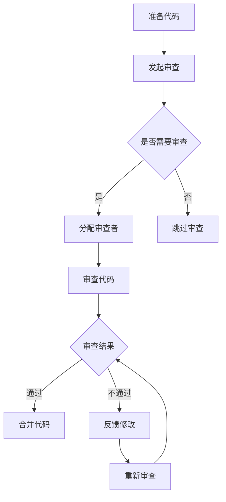
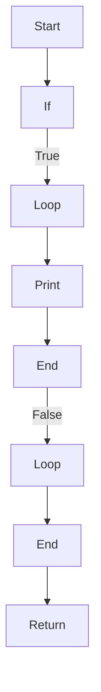
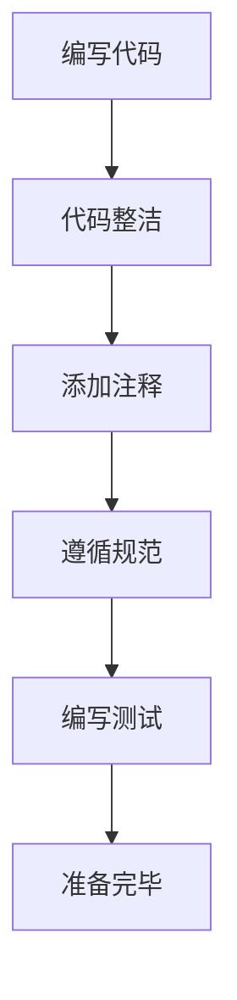
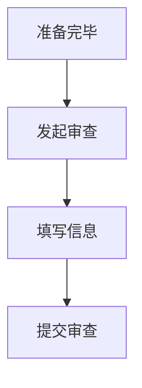
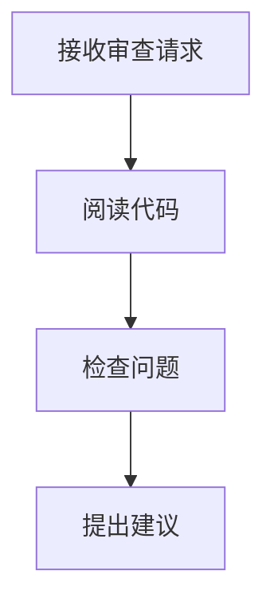
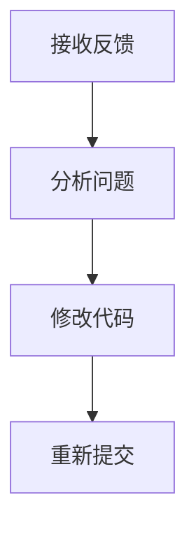
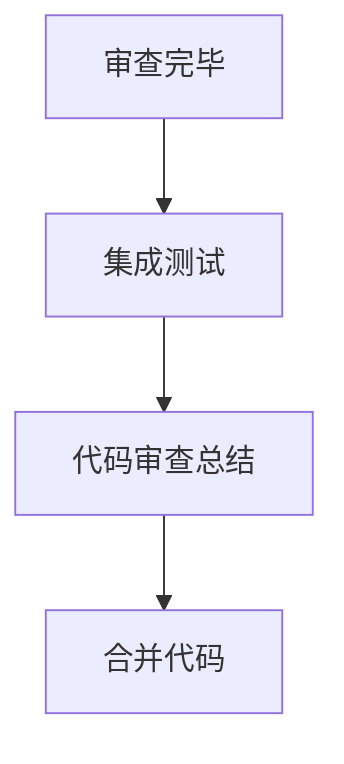
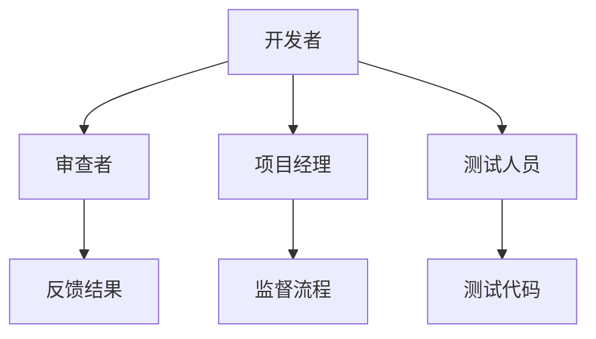
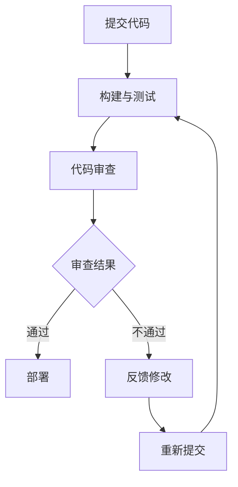

                 

### 文章标题

# 高效代码审查：提升团队代码质量的关键

### 关键词

- 代码审查
- 质量保证
- 软件开发
- 持续集成
- 团队协作

### 摘要

本文深入探讨了代码审查在现代软件开发中的重要性，介绍了代码审查的核心概念、流程、工具以及实践策略。通过详细的讲解和实际案例，本文旨在帮助开发团队提升代码质量，优化协作流程，实现高效开发。

---

## 引言

在现代软件开发过程中，代码审查是确保代码质量、维护团队协作的重要手段。它不仅仅是一种检验代码质量的机制，更是促进团队成员沟通、交流、学习和成长的平台。本文将围绕代码审查的关键环节，探讨如何提升团队的代码质量，实现高效开发。

### 代码审查的定义与价值

代码审查，也称为代码走查（Code Review），是一种通过团队成员之间的协作，对代码进行评估和改进的过程。其核心价值在于：

1. **提高代码质量**：通过审查，可以发现代码中的错误、漏洞和潜在问题，及时修复，避免隐患扩大。
2. **促进知识分享**：代码审查过程是团队成员交流技术的机会，有助于知识共享和技能提升。
3. **加强团队协作**：审查过程中，团队成员需要沟通、协作，共同解决问题，增强了团队的凝聚力。

### 代码审查与传统质量保证的区别

传统的质量保证（QA）更多依赖于测试和验证，而代码审查则是一种预防机制，旨在在代码编写阶段就发现和解决问题。与 QA 相比，代码审查具有以下特点：

1. **更早发现问题**：代码审查在编码阶段进行，可以提前发现潜在的问题，减少后期修复的成本。
2. **更全面的评估**：审查不仅关注代码的语法和逻辑错误，还包括代码风格、可维护性和可扩展性。
3. **更高的参与度**：代码审查鼓励团队成员积极参与，共同承担代码质量的责任。

### 代码审查在现代软件开发中的地位

随着软件开发过程的复杂化，代码审查已经成为现代软件开发中不可或缺的一部分。其地位体现在以下几个方面：

1. **持续集成与部署**：代码审查是持续集成（CI）过程的重要组成部分，确保代码库中的代码质量。
2. **敏捷开发实践**：敏捷开发强调快速迭代和持续交付，代码审查有助于确保每次迭代的代码质量。
3. **团队合作与知识传承**：代码审查是团队成员之间知识交流的平台，有助于团队成长和知识积累。

### 代码审查的历史与发展

代码审查的历史可以追溯到软件开发初期。以下是代码审查发展的一些重要事件：

1. **代码走查（Walkthrough）**：最早的形式之一，团队成员逐一阅读代码，讨论问题。
2. **代码审查委员会（Code Inspection Committee）**：为提高代码质量，一些公司成立了专门的审查委员会。
3. **形式化审查方法**：引入结构化审查方法，如 Fagan 规范化审查，提高了审查的规范性和效率。
4. **电子代码审查工具**：随着计算机技术的发展，电子代码审查工具逐渐普及，自动化程度提高。

### 代码审查在软件开发中的重要事件

1. **敏捷宣言**：强调代码审查在敏捷开发中的重要性，推动了审查实践的普及。
2. **持续集成**：代码审查成为 CI 过程的必要环节，确保每次提交的代码质量。
3. **开源社区**：开源项目通常采用代码审查，确保代码质量和社区的可持续发展。

### 代码审查在不同开发模型中的应用

1. **瀑布模型**：代码审查作为质量保证的一部分，贯穿整个开发周期。
2. **敏捷开发**：代码审查在每次迭代结束后进行，快速反馈和改进。
3. **DevOps**：代码审查是 DevOps 文化中的一部分，确保开发和运维的紧密协作。

### 总结

代码审查在现代软件开发中具有重要地位，它不仅能够提高代码质量，还能促进团队成员的协作和学习。了解代码审查的历史和发展，有助于更好地实践和推广代码审查。

---

## 代码审查基础知识

代码审查的基础知识是理解和实施代码审查的重要前提。本节将介绍代码审查的核心概念与联系，帮助读者构建对代码审查的整体认识。

### 核心概念与联系

#### 代码审查的类型

代码审查可以分为以下几种类型：

1. **形式化审查**：按照固定的流程和标准进行审查，如 Fagan 审查。
2. **非形式化审查**：没有固定流程和标准，主要依赖于团队成员的经验和判断。
3. **同行评审**：由团队成员之间相互审查代码。
4. **自动化审查**：利用工具自动进行代码检查。

这些类型各有优缺点，适用于不同的场景和团队。

#### 代码审查与软件开发周期的关系

代码审查贯穿于软件开发的全过程，通常与以下阶段密切相关：

1. **编码阶段**：审查编写的代码，确保符合标准和规范。
2. **集成阶段**：审查合并的代码，确保模块之间的兼容性。
3. **测试阶段**：审查测试代码，确保测试覆盖率和测试质量。
4. **维护阶段**：审查修改的代码，确保修改的正确性和对其他代码的影响。

#### Mermaid 流程图展示代码审查流程

以下是一个简单的 Mermaid 流程图，展示了代码审查的基本流程：



### 核心算法原理讲解

代码审查中涉及多种算法，以下是一些常见的算法原理：

#### 代码质量评估算法

1. **代码复杂度评估**：用于衡量代码的复杂程度，常见的方法包括圈复杂度（Cyclomatic Complexity）和修改难度（Change Difficulty）。
2. **代码冗余度评估**：用于衡量代码的冗余程度，常见的方法包括重复代码检测（Duplicate Code Detection）。

以下是一个简单的伪代码，用于计算圈复杂度：

```pseudo
function calculateCyclomaticComplexity(graph):
    count = 0
    for each node in graph:
        count += number of edges entering node
    return count
```

#### 代码风格检测算法

1. **命名规则检测**：检查变量、函数和类的命名是否符合规范。
2. **代码缩进检测**：检查代码的缩进是否符合约定。
3. **注释规则检测**：检查代码中的注释是否完整、规范。

以下是一个简单的伪代码，用于检查命名规则：

```pseudo
function checkNamingConvention(name):
    if not matches regex "^[a-zA-Z_][a-zA-Z0-9_]*$":
        return false
    return true
```

#### 代码安全检测算法

1. **SQL 注入检测**：检查代码中是否存在 SQL 注入漏洞。
2. **XSS（跨站脚本）检测**：检查代码中是否存在 XSS 漏洞。

以下是一个简单的伪代码，用于检测 SQL 注入：

```pseudo
function detectSQLInjection(query):
    if contains query any of ('; --', ') --', '/*'):
        return true
    return false
```

### 数学模型和数学公式

代码审查中涉及的数学模型和公式主要包括：

#### 代码复杂度评估模型

1. **圈复杂度**：用于衡量程序的复杂度，公式为：

   $$ CC = E - N + 2P $$

   其中，$E$ 是边的数量，$N$ 是节点的数量，$P$ 是边的直接自环数。

2. **修改难度**：用于衡量代码的可维护性，公式为：

   $$ MD = \frac{CC + CR + CM}{3} $$

   其中，$CR$ 是循环冗余率，$CM$ 是模块化程度。

#### 代码缺陷预测模型

1. **缺陷密度模型**：用于预测代码中的缺陷数量，公式为：

   $$ D = \frac{L}{C} $$

   其中，$D$ 是缺陷密度，$L$ 是代码行数，$C$ 是代码复杂度。

### 详细讲解与举例说明

#### 代码复杂度评估

假设有一个简单的函数，其控制流图如下所示：



根据圈复杂度的计算公式，我们可以计算出该函数的圈复杂度：

$$ CC = (2+1+1+1+1+1) - (1+1+1+1) + 2 \cdot 0 = 7 $$

这表示该函数的复杂度为7。

#### 命名规则检测

假设我们有一个变量名为 `abc123`，我们使用以下伪代码来检查其命名规则：

```pseudo
if not checkNamingConvention("abc123"):
    print "命名不规范"
else:
    print "命名规范"
```

输出结果将是“命名规范”，因为该变量名符合命名规则。

#### SQL 注入检测

假设我们有以下查询语句：

```sql
SELECT * FROM users WHERE username = 'admin' AND password = '123';
```

我们使用以下伪代码来检测其是否存在 SQL 注入：

```pseudo
if detectSQLInjection("SELECT * FROM users WHERE username = 'admin' AND password = '123';"):
    print "存在 SQL 注入"
else:
    print "不存在 SQL 注入"
```

输出结果将是“不存在 SQL 注入”，因为该查询语句没有包含常见的 SQL 注入攻击字符串。

通过上述讲解和示例，我们了解了代码审查中的核心概念、算法原理和数学模型。这些知识将为我们后续的代码审查实践提供坚实的理论基础。

---

## 代码审查流程

代码审查流程是确保代码质量和团队协作的关键环节。一个完善的代码审查流程能够帮助团队及时发现并解决问题，提升整体开发效率。本节将详细介绍代码审查的流程，包括准备、实际操作和反馈处理等步骤。

### 代码审查流程概述

代码审查流程通常包括以下几个基本步骤：

1. **准备代码**：开发者编写代码后，需要准备一份干净的代码进行审查，确保代码可读、规范。
2. **发起审查**：开发者将准备好的代码提交到代码审查系统或工具中，由指定的审查者进行审查。
3. **审查代码**：审查者根据审查标准和指南，对代码进行仔细阅读和检查，识别潜在的问题。
4. **反馈处理**：审查者将发现的问题反馈给开发者，开发者根据反馈进行修改，然后重新提交代码进行审查。
5. **合并代码**：经过多次审查后，代码符合标准，可以合并到主分支。

### 代码审查的基本步骤

#### 准备代码

在准备代码时，开发者需要确保以下几点：

1. **代码整洁**：代码应具有良好的结构和格式，避免冗余和杂乱。
2. **注释完整**：关键代码和复杂的逻辑应添加注释，便于审查者理解。
3. **代码规范**：遵循团队的代码规范，包括命名规则、缩进方式等。
4. **测试覆盖**：编写足够的测试用例，确保代码的功能和性能。

以下是一个简单的 Mermaid 流程图，展示了准备代码的过程：



#### 发起审查

在代码审查工具或系统中，开发者可以发起审查请求。发起审查时，需要填写以下信息：

1. **审查者**：指定审查者，可以是单个审查者或多人。
2. **审查范围**：指定需要审查的文件或目录。
3. **审查说明**：简要说明审查的目的和背景。

以下是一个简单的 Mermaid 流程图，展示了发起审查的过程：



#### 审查代码

审查者收到审查请求后，开始对代码进行审查。审查过程通常包括以下几个步骤：

1. **阅读代码**：审查者仔细阅读代码，理解代码的功能和逻辑。
2. **检查问题**：审查者根据审查标准和指南，检查代码中可能存在的问题，如语法错误、逻辑漏洞、代码风格不规范等。
3. **提出建议**：对于发现的问题，审查者可以提出改进建议，如优化代码结构、改进变量命名等。

以下是一个简单的 Mermaid 流程图，展示了审查代码的过程：



#### 反馈处理

在审查过程中，审查者会将发现的问题反馈给开发者。开发者收到反馈后，需要及时进行处理：

1. **分析问题**：开发者仔细阅读审查者的反馈，理解问题的性质和影响。
2. **修改代码**：根据反馈，开发者进行必要的代码修改，确保问题得到解决。
3. **重新提交**：修改后的代码重新提交进行审查，确保问题已解决。

以下是一个简单的 Mermaid 流程图，展示了反馈处理的过程：



#### 合并代码

经过多次审查和修改后，代码最终符合标准，可以合并到主分支。合并代码前，开发者需要进行以下准备工作：

1. **集成测试**：确保修改后的代码与其他模块兼容，没有引入新的问题。
2. **代码审查总结**：对整个审查过程进行总结，记录审查过程中发现的问题和解决方法。

以下是一个简单的 Mermaid 流程图，展示了合并代码的过程：



### 代码审查的关键角色

代码审查涉及多个关键角色，每个角色在流程中扮演不同的角色：

1. **开发者**：负责编写代码，准备代码，接收和反馈审查结果。
2. **审查者**：负责审查代码，提出问题和改进建议。
3. **项目经理**：负责监督代码审查流程，确保审查按时完成。
4. **测试人员**：负责测试代码，验证代码的功能和性能。

以下是一个简单的 Mermaid 流程图，展示了代码审查中关键角色的协作：



### 实际操作与案例分析

在实际操作中，代码审查的效果取决于多个因素，包括审查者的经验、团队的文化和流程的执行情况。以下是一个简单的案例分析：

#### 案例背景

一个中小型团队正在开发一个在线购物系统，涉及多个模块，包括用户管理、商品管理、订单管理等。为了确保代码质量，团队决定引入代码审查。

#### 审查过程

1. **开发者提交代码**：开发者编写完代码后，将代码提交到代码审查工具中，并指定了两个审查者。
2. **审查者审查代码**：审查者仔细阅读代码，发现以下问题：
   - 一个控制器方法中参数传递不规范。
   - 一个数据库查询语句中缺少必要的注释。
   - 一个类中的方法命名不规范。
3. **反馈结果**：审查者将问题反馈给开发者，并提供了解决建议。
4. **开发者修改代码**：开发者根据反馈，对代码进行了修改，并重新提交审查。
5. **再次审查**：审查者对修改后的代码进行了审查，确认问题已解决。

#### 结果与启示

通过这次代码审查，团队发现并解决了多个潜在问题，提高了代码质量。以下是此次代码审查的几个启示：

1. **明确的审查标准**：制定明确的审查标准和指南，有助于审查者准确地判断代码问题。
2. **及时的反馈**：及时反馈问题和改进建议，有助于开发者快速修正错误。
3. **持续改进**：代码审查是一个持续的过程，团队需要不断优化审查流程和标准，提高审查效率。

### 总结

代码审查流程是确保代码质量和团队协作的重要环节。通过准备代码、发起审查、审查代码、反馈处理和合并代码等步骤，团队可以及时发现并解决问题，提高开发效率。在实际操作中，明确审查标准、及时反馈问题和持续改进是关键。

---

## 代码审查工具

在现代软件开发中，代码审查工具极大地提高了代码审查的效率和效果。这些工具能够自动化地检测代码中的问题，提供直观的界面，便于团队成员之间的交流和协作。本节将介绍一些常用的代码审查工具，并探讨如何选择和配置这些工具。

### 常用代码审查工具

以下是一些广泛使用的代码审查工具：

#### GitLab

GitLab 是一个强大的源代码管理系统，它内置了代码审查功能。GitLab 提供了详细的审查记录、反馈机制和自动化测试集成，非常适合中小型团队。

**特点**：
- **集成度高**：与 Git 集成紧密，可以无缝管理代码审查。
- **功能丰富**：支持多层次的审查流程、差分比较和注释交流。

**配置方法**：
1. 安装 GitLab。
2. 在 GitLab 仓库中开启代码审查功能。
3. 配置 Webhooks，将代码审查结果同步到其他系统（如 Jenkins）。

#### GitHub

GitHub 是全球最大的代码托管平台，其代码审查功能也相当强大。GitHub 支持审查注释、审查者指定和自动化测试集成。

**特点**：
- **用户基数大**：广泛的用户基础，可以方便地邀请外部审查者。
- **界面友好**：简洁的界面，便于团队成员查看审查进度。

**配置方法**：
1. 登录 GitHub。
2. 在项目设置中开启代码审查功能。
3. 配置 Webhooks，将审查结果通知到团队成员。

#### SonarQube

SonarQube 是一个开源的代码质量平台，提供了全面的代码审查和静态代码分析功能。它支持多种编程语言，可以自动发现代码中的缺陷、漏洞和代码质量问题。

**特点**：
- **功能强大**：除了代码审查，还支持漏洞扫描、性能优化等。
- **语言支持广泛**：支持多种主流编程语言。

**配置方法**：
1. 安装 SonarQube。
2. 配置代码仓库连接，导入代码。
3. 设置静态代码分析规则。

#### GitLab CI/CD

GitLab CI/CD 是 GitLab 内置的持续集成和持续交付工具，可以与代码审查工具集成，实现自动化审查和部署。

**特点**：
- **自动化流程**：自动化执行代码审查、测试和部署，提高效率。
- **灵活配置**：可以根据项目需求自定义构建和部署流程。

**配置方法**：
1. 在 GitLab 项目设置中创建 CI/CD 配置文件。
2. 配置代码审查和测试步骤。
3. 配置部署流程，实现自动化部署。

### 自定义代码审查工具

对于一些特定的需求，可能需要自定义代码审查工具。以下是一些常见的自定义场景和工具：

#### 自定义审查脚本

**场景**：需要根据特定项目的需求，自定义代码审查规则和流程。

**工具**：Python、Shell 等。

**示例**：
```python
import os
import subprocess

def check_code_style(filename):
    command = ["python", "-m", "pycodestyle", filename]
    result = subprocess.run(command, capture_output=True, text=True)
    if result.returncode != 0:
        print(f"Code style issues found in {filename}:")
        print(result.stdout)

# 示例使用
check_code_style("example.py")
```

#### 自定义审查工具

**场景**：需要集成多种代码审查功能，如代码质量评估、安全检测等。

**工具**：Gerrit、Phabricator 等。

**示例**：
```bash
# 配置 Gerrit
git reviewhook-httpsinit
git reviewhook-httpsset --submit-type REVISION
git reviewhook-httpsset --ynthia-auto-revision-upload
git reviewhook-httpsset --retro --commit-message "Retro-review: Add type hints"
```

### 选择和配置代码审查工具

选择合适的代码审查工具取决于团队的需求和资源。以下是一些选择和配置代码审查工具的建议：

1. **评估团队需求**：根据团队规模、项目类型和开发流程，选择适合的工具。
2. **考虑集成度**：选择能够与现有系统集成的工具，提高效率。
3. **配置和培训**：确保团队成员熟悉工具的使用方法，提高审查效果。
4. **持续优化**：根据审查结果和反馈，不断调整工具配置和审查流程。

通过合理选择和配置代码审查工具，团队可以更好地管理代码质量，提高开发效率。

---

## 高效代码审查实践

在软件开发过程中，高效的代码审查不仅是提升代码质量的关键，也是团队协作和知识共享的重要手段。本节将探讨高效代码审查的策略和实践，提供一系列最佳实践，帮助开发团队在实际项目中实现高效的代码审查。

### 高效代码审查策略

#### 制定明确的审查标准

制定明确的审查标准是高效代码审查的基础。这些标准应包括代码风格、命名规则、代码结构、注释规范等方面。明确的标准有助于审查者快速定位问题，减少争议。

**示例审查标准：**
- **代码风格**：遵循 PEP8Python 编码规范。
- **命名规则**：变量、函数和类名应简洁且具描述性。
- **代码结构**：模块划分清晰，函数和类应保持低耦合和高内聚。

#### 分配合理的审查者

合理的审查者分配可以提高审查效率。应根据审查者的技术水平和职责，分配适当的代码审查任务。同时，避免重复审查，确保每个审查者的独特价值得到发挥。

**分配建议：**
- **技术专家**：负责审查关键模块和复杂逻辑。
- **新员工**：分配相对简单的代码审查任务，逐步提高其技术能力。
- **轮换审查者**：定期轮换审查者，确保不同视角的审查。

#### 优化审查流程

优化审查流程可以减少审查时间，提高审查效率。以下是一些优化建议：

- **定期审查**：设定固定的审查周期，如每周或每月审查一次。
- **自动化审查**：使用代码审查工具自动进行代码检查，减少手动审查的工作量。
- **即时反馈**：确保审查者能够及时收到反馈，避免延迟问题修复。

### 高效代码审查最佳实践

#### 1. 快速反馈

快速反馈是高效代码审查的关键。审查者应在收到代码后尽快进行审查，并在短时间内将反馈意见提供给开发者。这有助于问题的及时发现和解决，减少代码积累的问题。

**最佳实践：**
- **设定反馈时限**：规定审查者必须在多长时间内提供反馈，如 24 小时或 48 小时。
- **使用代码审查工具**：利用代码审查工具的即时反馈功能，提高反馈速度。

#### 2. 详细说明问题

在反馈时，审查者应详细说明发现的问题，包括问题的性质、位置和可能的解决方案。这有助于开发者快速理解和解决问题，提高审查效率。

**最佳实践：**
- **详细注释**：在代码中添加详细的注释，解释问题的原因和解决方案。
- **举例说明**：提供具体的代码示例，展示问题的表现和解决方案。

#### 3. 促进知识共享

代码审查不仅是代码质量的检查，也是知识共享的重要途径。通过审查，团队成员可以学习他人的代码风格、设计模式和解决问题的方法。

**最佳实践：**
- **定期分享**：定期组织代码审查经验分享会，促进团队成员之间的知识交流。
- **反馈建议**：在反馈中鼓励开发者学习新技术和改进代码风格。

#### 4. 鼓励开发者参与

鼓励开发者参与代码审查，可以提高他们的责任感和参与感。开发者不仅可以提高自己的代码质量，还能更好地理解代码审查的价值。

**最佳实践：**
- **双向反馈**：鼓励开发者对审查者的反馈进行回应，提出自己的看法和疑问。
- **共同解决问题**：审查者与开发者共同讨论和解决问题，提高问题解决效率。

#### 5. 结合持续集成

将代码审查与持续集成（CI）相结合，可以实现自动化审查和持续反馈，提高开发效率。CI 工具可以自动触发代码审查，并在构建过程中检测代码问题。

**最佳实践：**
- **配置 CI 工具**：在 CI 工具中配置代码审查步骤，确保每次提交的代码都经过审查。
- **自动化反馈**：利用 CI 工具的反馈机制，自动通知审查者和开发者审查结果。

#### 6. 定期回顾和改进

定期回顾代码审查过程和结果，可以及时发现和解决问题，持续改进审查流程。通过回顾，团队可以优化审查标准、调整审查策略，提高审查效率。

**最佳实践：**
- **定期总结**：定期召开代码审查总结会议，分析审查过程中的问题，制定改进措施。
- **持续改进**：根据总结的结果，不断优化审查流程和标准。

### 实践案例分析

#### 案例一：中小型团队的代码审查实践

一个中小型团队在引入代码审查后，通过以下实践实现了高效代码审查：

- **明确审查标准**：制定了一套详细的代码审查标准，包括代码风格、命名规则和注释规范。
- **自动化审查**：使用 GitLab 的代码审查功能，实现自动化代码检查和反馈。
- **快速反馈**：设定了 24 小时反馈时限，确保审查者及时提供反馈。
- **知识共享**：定期组织代码审查经验分享会，促进团队成员之间的知识交流。

通过这些实践，团队发现代码质量显著提高，团队成员的技术能力也得到了提升。

#### 案例二：大型项目的代码审查实践

一个大型项目团队在代码审查中面临挑战，通过以下实践实现了高效的代码审查：

- **分层次审查**：将代码审查分为多个层次，由不同层级的审查者进行审查，确保代码的全面性。
- **审查者轮换**：定期轮换审查者，确保不同视角的审查。
- **审查工具集成**：使用 SonarQube 进行静态代码分析，与持续集成工具集成，实现自动化审查和反馈。
- **详细说明问题**：审查者在反馈中详细说明问题，并提供具体的解决方案。

通过这些实践，团队不仅提高了代码质量，还减少了代码漏洞和缺陷，提升了项目的稳定性。

### 总结

高效代码审查是提升团队代码质量的关键。通过制定明确的审查标准、合理分配审查者、优化审查流程和结合持续集成等实践，团队可以显著提高代码审查的效率和质量。同时，促进知识共享和团队协作，实现持续改进，为项目的成功奠定坚实基础。

---

## 代码审查与团队协作

代码审查不仅是一种提高代码质量的方法，也是促进团队协作和知识共享的重要手段。通过有效的代码审查，团队成员可以更好地了解项目的各个方面，提高代码的可维护性和项目的稳定性。本节将探讨如何通过代码审查实现团队协作，提高团队效率。

### 建立高效的代码审查团队

要建立一个高效的代码审查团队，首先需要明确团队成员的角色和责任。以下是一些关键步骤：

#### 明确审查团队结构

- **审查者**：负责审查代码，提出问题和改进建议。审查者可以是资深开发者、架构师或技术专家。
- **开发者**：编写代码，接受审查者的反馈并进行修改。开发者需要积极参与代码审查，提高代码质量。
- **项目经理**：监督代码审查流程，确保审查按时完成，并对审查结果进行评估。
- **测试人员**：负责测试代码，验证代码的功能和性能，与审查者共同确保代码质量。

#### 角色与责任分配

- **审查者**：确保代码符合规范和标准，发现潜在的问题和漏洞，提供改进建议。
- **开发者**：积极配合审查者，及时修改代码，确保问题得到解决。
- **项目经理**：协调审查流程，确保审查任务按时完成，并对审查结果进行跟踪。
- **测试人员**：测试代码，验证功能性和性能，确保代码在上线前没有重大问题。

#### 团队协作与沟通技巧

- **定期会议**：定期召开代码审查会议，讨论审查过程中的问题和改进方案。
- **透明沟通**：通过代码审查工具，实现审查过程的透明化，确保团队成员可以随时查看审查进度和反馈。
- **知识共享**：鼓励团队成员在审查过程中分享经验和技巧，提高整体技术水平。
- **反馈机制**：建立有效的反馈机制，确保审查者的反馈和建议能够及时传达给开发者，并得到落实。

### 提高代码审查效率

要实现高效的代码审查，团队需要采取一系列策略和方法。以下是一些建议：

#### 快速反馈

- **设定反馈时限**：为审查者设定反馈时限，确保问题能够及时得到解决。
- **使用代码审查工具**：利用代码审查工具的即时反馈功能，提高审查效率。

#### 明确审查标准

- **制定明确的审查标准**：确保审查者有明确的审查标准，减少审查过程中的争议。
- **定期更新标准**：根据项目需求和团队经验，定期更新审查标准。

#### 优化审查流程

- **自动化审查**：使用自动化工具进行代码检查，减少手动审查的工作量。
- **分层次审查**：将代码审查分为多个层次，确保代码的全面性。
- **简化流程**：避免冗余的审查流程，确保审查过程的简洁和高效。

#### 鼓励开发者参与

- **鼓励开发者提出问题**：鼓励开发者积极参与代码审查，提出问题和建议。
- **双向反馈**：确保开发者能够及时收到审查者的反馈，并有机会回应。

### 团队协作中的挑战与解决方法

#### 挑战一：审查者和开发者之间的沟通不畅

- **解决方法**：通过定期会议和透明沟通，确保审查者和开发者之间的信息流通。

#### 挑战二：审查者资源不足

- **解决方法**：合理分配审查资源，避免重复审查，确保每个审查者都有足够的审查任务。

#### 挑战三：审查标准不明确

- **解决方法**：制定详细的审查标准，并在团队内部进行培训，确保所有成员都了解并遵循标准。

### 提高团队效率的案例分析

#### 案例一：敏捷团队的代码审查实践

一个敏捷团队通过以下实践提高了代码审查的效率：

- **灵活的审查流程**：根据迭代周期调整审查流程，确保审查与开发流程紧密配合。
- **自动化工具**：使用 GitLab 和 SonarQube 等工具进行自动化审查和反馈。
- **知识共享**：定期召开代码审查经验分享会，促进团队成员之间的知识交流。

通过这些实践，团队提高了代码质量，缩短了开发周期，实现了高效的团队协作。

#### 案例二：大型项目的代码审查策略

一个大型项目团队通过以下策略提高了代码审查效率：

- **分层次审查**：将代码审查分为多个层次，由不同层级的审查者进行审查。
- **审查工具集成**：使用 SonarQube 进行静态代码分析，并与持续集成工具集成。
- **详细说明问题**：审查者在反馈中详细说明问题，并提供具体的解决方案。

通过这些策略，团队提高了代码质量，减少了漏洞和缺陷，提升了项目的稳定性。

### 总结

代码审查是实现团队协作和提高团队效率的重要手段。通过明确团队结构、优化审查流程、鼓励开发者参与和解决团队协作中的挑战，团队可以显著提高代码审查的效率和效果。有效的代码审查不仅提高了代码质量，也促进了团队的知识共享和协作，为项目的成功奠定了坚实基础。

---

## 代码审查与持续集成

在现代软件开发中，持续集成（CI）和持续部署（CD）已经成为提高开发效率和质量的关键实践。代码审查与持续集成相结合，可以实现对代码的全面评估和快速反馈，从而提升整个开发流程的效率。本节将探讨代码审查与持续集成的结合方式、优势以及在实际项目中的应用。

### 代码审查与持续集成的结合方式

#### 代码审查在持续集成流程中的位置

在持续集成流程中，代码审查通常位于提交代码和部署代码之间的一个环节。具体流程如下：

1. **提交代码**：开发者将代码提交到代码仓库，触发 CI 流程。
2. **构建和测试**：CI 工具构建代码，运行自动化测试，确保代码的编译和运行。
3. **代码审查**：CI 工具将构建好的代码提交到代码审查工具，进行审查。
4. **反馈与修改**：审查者根据代码审查结果，向开发者提供反馈，开发者根据反馈进行代码修改。
5. **重新提交和构建**：开发者修改代码后，重新提交，再次进入 CI 流程。
6. **部署**：通过审查和测试的代码，最终部署到生产环境。

以下是一个简化的 Mermaid 流程图，展示了代码审查在持续集成流程中的位置：



#### 代码审查与持续集成工具的集成

为了实现代码审查与持续集成的紧密结合，团队通常使用一些持续集成工具（如 Jenkins、GitLab CI、GitHub Actions 等）与代码审查工具（如 GitLab、GitHub、SonarQube 等）进行集成。以下是一些常见的集成方法：

- **Webhooks**：通过 Webhooks，将持续集成工具的构建和测试结果同步到代码审查工具，实现自动化审查。
- **插件和扩展**：使用持续集成工具的插件和扩展，将代码审查步骤集成到 CI 流程中。
- **脚本集成**：编写脚本，将代码审查工具的命令集成到 CI 配置文件中。

### 代码审查与持续集成的优势

#### 提高代码质量

通过代码审查，可以在代码提交到生产环境之前发现潜在的问题和漏洞，从而提高代码的整体质量。代码审查结合持续集成，可以实现自动化的代码质量评估，确保每次提交的代码都经过严格的审查。

#### 快速反馈

代码审查与持续集成相结合，可以实现快速反馈。审查者可以在代码提交后立即进行审查，并在短时间内将反馈结果传达给开发者。这有助于问题的及时发现和解决，减少代码积累的问题。

#### 提高开发效率

代码审查与持续集成结合，可以自动化执行代码构建、测试和审查过程，提高开发效率。通过自动化流程，团队可以减少人工干预，缩短开发周期，提高项目的交付速度。

#### 强化团队协作

代码审查是促进团队协作和知识共享的重要手段。在持续集成环境中，团队成员可以实时查看审查结果，共同讨论和解决问题，提高团队协作效率。

### 实际项目中的应用

#### 案例一：中小型团队的代码审查与持续集成实践

一个中小型团队在开发一个电子商务平台时，采用了以下实践：

- **使用 GitLab CI**：通过 GitLab CI 配置持续集成流程，实现自动化构建、测试和代码审查。
- **结合 GitLab 审查**：将代码审查工具与 GitLab CI 集成，确保每次提交的代码都经过审查。
- **快速反馈**：审查者在代码提交后立即进行审查，并在短时间内将反馈结果传达给开发者。

通过这些实践，团队提高了代码质量，缩短了开发周期，实现了高效的团队协作。

#### 案例二：大型项目的代码审查与持续集成策略

一个大型项目团队在开发一个复杂的金融系统时，采用了以下策略：

- **分层次审查**：将代码审查分为多个层次，由不同层级的审查者进行审查，确保代码的全面性。
- **使用 Jenkins**：使用 Jenkins 实现持续集成，并将代码审查工具集成到 Jenkins 流程中。
- **自动化测试**：结合自动化测试工具，确保代码经过充分的测试后才能提交审查。

通过这些策略，团队实现了高效的代码审查与持续集成，提高了项目的稳定性和可靠性。

### 总结

代码审查与持续集成相结合，可以实现对代码的全面评估和快速反馈，从而提升整个开发流程的效率和质量。通过实际项目中的应用，我们可以看到，代码审查与持续集成的结合不仅提高了代码质量，还促进了团队协作，实现了高效的开发流程。随着持续集成工具和代码审查工具的不断发展，这一结合方式将在未来的软件开发中发挥越来越重要的作用。

---

## 代码审查与其他质量保证活动

在软件开发的整个生命周期中，代码审查是一种重要的质量保证活动，但并非唯一的手段。为了确保软件质量，团队通常需要结合多种质量保证活动，如单元测试、静态代码分析和动态代码分析等。本节将探讨代码审查与其他质量保证活动的结合方式、优势以及实际项目中的应用。

### 代码审查与单元测试的结合

单元测试是开发过程中的一种重要质量保证活动，旨在测试最小功能单元的正确性。代码审查与单元测试的结合可以起到相互补充的作用。

#### 结合方式

- **先测试后审查**：开发者首先编写单元测试，确保功能实现无误，然后进行代码审查。
- **同时进行**：在代码审查过程中，审查者也可以关注单元测试的覆盖率和质量，提出改进建议。

#### 优势

- **提高测试质量**：代码审查可以识别出单元测试的不足之处，如测试覆盖率不足、测试用例不全面等，从而提高整体测试质量。
- **强化代码质量**：通过审查单元测试代码，可以确保测试代码的结构和风格符合标准，减少潜在的缺陷。

#### 实际项目中的应用

- **案例一**：在一个电商项目中，团队通过结合代码审查和单元测试，发现并解决了多个功能缺陷和代码质量问题，提高了软件的稳定性和可靠性。

### 代码审查与静态代码分析的结合

静态代码分析是一种不运行程序而分析代码的技术，旨在发现潜在的缺陷、代码风格问题和安全性漏洞。代码审查与静态代码分析的结合可以更全面地评估代码质量。

#### 结合方式

- **并行进行**：在代码审查过程中，同时使用静态代码分析工具进行代码质量检查。
- **集成工具**：使用集成开发环境（IDE）或持续集成（CI）工具，将代码审查和静态代码分析结合在一起。

#### 优势

- **全面覆盖**：静态代码分析可以识别出代码审查可能忽略的问题，如某些复杂的逻辑错误或性能问题。
- **自动化检测**：静态代码分析工具可以自动化执行，节省人力和时间。

#### 实际项目中的应用

- **案例二**：在一个大型金融系统中，团队使用 SonarQube 进行静态代码分析，并与代码审查工具集成，有效识别出多个潜在的安全漏洞和代码缺陷，提高了系统的安全性。

### 代码审查与动态代码分析的结合

动态代码分析是在程序运行时进行的分析，旨在评估程序的运行性能和稳定性。代码审查与动态代码分析的结合可以提供更全面的代码质量评估。

#### 结合方式

- **先审查后分析**：在代码审查通过后，使用动态代码分析工具对代码进行性能评估。
- **同时进行**：在代码审查过程中，审查者可以关注代码的性能问题，并使用动态代码分析工具进行验证。

#### 优势

- **实时性能评估**：动态代码分析可以实时评估代码的性能，发现潜在的性能瓶颈。
- **互补作用**：代码审查关注代码的结构和质量，动态代码分析关注代码的运行表现，两者结合可以提供更全面的代码质量评估。

#### 实际项目中的应用

- **案例三**：在一个移动应用开发项目中，团队在代码审查后使用动态代码分析工具对应用进行性能评估，发现并解决了多个影响用户体验的性能问题。

### 总结

代码审查与其他质量保证活动的结合，可以提供更全面的代码质量评估，帮助团队发现并解决更多潜在的问题。通过合理的结合方式，团队可以更有效地提升软件质量，实现高效的开发流程。在实际项目中，结合多种质量保证活动，可以确保软件的稳定性和可靠性，为项目的成功奠定坚实基础。

---

## 代码审查案例分析

在实际项目中，代码审查不仅是一种提高代码质量的手段，也是发现和解决问题的关键环节。通过分析实际案例，我们可以深入了解代码审查的应用效果和重要性。以下将介绍几个具有代表性的代码审查案例，详细分析其背景、关键策略、具体实践以及案例结果和启示。

### 案例一：电商平台的代码审查实践

#### 背景介绍

某电商平台的开发团队在上线新功能时，遇到了频繁的性能问题和用户体验下降的问题。为了确保新功能的稳定性和可靠性，团队决定加强代码审查。

#### 关键策略与实践

1. **制定详细审查标准**：团队制定了包括代码风格、性能优化、安全性和可维护性等方面的详细审查标准。
2. **引入自动化审查工具**：团队引入了SonarQube进行静态代码分析，并与持续集成工具集成，实现自动化审查。
3. **分层次审查**：将代码审查分为初级审查、中级审查和高级审查，确保代码质量的多层次评估。
4. **快速反馈机制**：建立快速反馈机制，审查者发现问题时，立即将反馈结果通知开发者，并在短时间内解决。

#### 案例结果

通过加强代码审查，团队发现并解决了多个潜在的性能瓶颈和安全漏洞。新功能上线后，用户体验显著提升，系统稳定性得到了保障。

#### 启示

- **明确审查标准**：详细明确的审查标准有助于统一团队成员的审查行为，提高审查效果。
- **自动化工具**：自动化审查工具可以显著提高审查效率，减少人工工作量。
- **快速反馈**：及时反馈和问题解决是代码审查成功的关键。

### 案例二：金融系统的代码审查策略

#### 背景介绍

某大型金融系统在开发过程中，由于代码质量参差不齐，导致系统漏洞频出，影响系统的稳定运行。为了提高代码质量，团队决定实施严格的代码审查。

#### 关键策略与实践

1. **分层次审查团队**：团队建立了由初级开发者、中级开发者和高级架构师组成的多层次审查团队，确保代码质量的全面评估。
2. **代码风格统一**：引入代码风格指南，确保团队成员遵循统一的编码规范。
3. **定期审查会议**：定期召开代码审查会议，总结审查结果，讨论改进措施。
4. **持续改进流程**：根据审查结果，不断优化代码审查流程和标准。

#### 案例结果

通过严格的代码审查，团队显著提高了代码质量，减少了系统漏洞，系统的稳定性和可靠性得到了大幅提升。

#### 启示

- **多层次审查**：多层次审查团队能够提供更全面的代码评估，有助于发现和解决各种问题。
- **统一代码风格**：统一的代码风格有助于提高代码的可读性和可维护性。
- **持续改进**：不断优化审查流程和标准，是确保代码审查长期有效的关键。

### 案例三：移动应用的代码审查实践

#### 背景介绍

某移动应用开发团队在发布新版本时，用户反馈出现多次崩溃和性能问题。为了提高应用的稳定性和用户体验，团队决定加强代码审查。

#### 关键策略与实践

1. **代码审查与单元测试结合**：在代码审查过程中，重视单元测试的质量和覆盖率，确保功能实现无误。
2. **实时性能分析**：在代码审查后，使用动态代码分析工具对代码进行实时性能分析，发现潜在的性能问题。
3. **团队成员参与**：鼓励所有团队成员参与代码审查，提高整个团队的质量意识。
4. **快速迭代审查**：每次迭代结束后，立即进行代码审查，确保及时发现问题并修复。

#### 案例结果

通过加强代码审查，团队发现并解决了多个性能问题和用户体验问题，新版本的发布后用户反馈良好，应用稳定性显著提升。

#### 启示

- **代码审查与单元测试结合**：结合代码审查和单元测试，可以更全面地评估代码质量，提高软件稳定性。
- **实时性能分析**：实时性能分析有助于发现和解决影响用户体验的性能问题。
- **全员参与**：全员参与代码审查，有助于提高团队的整体质量意识。
- **快速迭代**：快速迭代审查，可以及时发现问题并修复，提高开发效率。

### 总结

通过以上案例分析，我们可以看到，代码审查在提高代码质量、保障系统稳定性和提升用户体验方面发挥了重要作用。有效的代码审查策略和严格的执行是确保软件质量的关键。在实际项目中，团队应根据自身情况，灵活应用代码审查方法，持续优化审查流程，实现高效开发。

---

## 总结与展望

代码审查在现代软件开发中扮演着至关重要的角色，它不仅能够提升代码质量，还能促进团队协作、知识共享和持续改进。本文通过详细探讨代码审查的核心概念、流程、工具和实践策略，为开发团队提供了一套完整的代码审查指南。

### 核心内容回顾

- **代码审查的定义与价值**：代码审查是一种通过团队成员协作，对代码进行评估和改进的过程，它能够提高代码质量、促进知识分享和加强团队协作。
- **代码审查的基础知识**：包括代码审查的类型、流程、核心算法原理和数学模型。
- **代码审查流程**：介绍了代码审查的基本步骤、关键角色和实际操作方法。
- **代码审查工具**：探讨了常用的代码审查工具及其配置方法。
- **高效代码审查实践**：提供了高效代码审查的最佳实践策略，包括快速反馈、详细说明问题、促进知识共享等。
- **团队协作与持续集成**：讨论了代码审查与团队协作、持续集成以及其他质量保证活动的结合方式。
- **案例分析**：通过实际案例，展示了代码审查在项目中的应用效果和重要性。

### 未来趋势与展望

随着软件开发技术的不断进步，代码审查也将迎来新的发展趋势：

1. **自动化审查工具的发展**：随着人工智能和机器学习技术的应用，自动化审查工具将变得更加智能和高效，能够自动识别更多的代码问题和潜在漏洞。
2. **代码审查与持续集成的深度融合**：代码审查将更紧密地与持续集成和持续部署结合，实现自动化、智能化的代码质量评估和反馈。
3. **代码审查标准的国际化与标准化**：随着国际化和标准化的发展，代码审查标准将更加统一和规范，有助于提高全球软件开发的质量和协作效率。
4. **知识共享与社区化**：代码审查将不仅仅局限于团队内部，还将更加开放和社区化，通过共享代码审查经验和最佳实践，提升全球开发者的技术水平。

### 对读者的启示与鼓励

对于读者，特别是软件开发者和团队管理者，以下是几点启示和鼓励：

1. **重视代码审查**：代码审查是确保代码质量和项目成功的关键环节，不应忽视。
2. **持续改进**：根据项目需求和团队实际情况，不断优化代码审查流程和标准。
3. **学习与分享**：积极参与代码审查，学习他人的代码风格和设计模式，并分享自己的经验和技巧。
4. **实践与总结**：在项目中应用代码审查，不断总结经验，逐步提升团队的整体技术水平。

通过本文的探讨，我们希望读者能够更加深入地理解代码审查的重要性和实践方法，将其应用到实际项目中，为团队的成功和项目的稳定运行贡献力量。

### 作者信息

**作者：** AI天才研究院/AI Genius Institute & 禅与计算机程序设计艺术 /Zen And The Art of Computer Programming

AI天才研究院专注于人工智能技术的研发和应用，致力于推动全球人工智能技术的发展。而《禅与计算机程序设计艺术》则是作者结合多年编程经验和对代码质量的深刻理解，为开发者提供的一本关于代码质量保障的宝贵指南。希望通过本文，能够为读者带来实际的帮助和启示。

