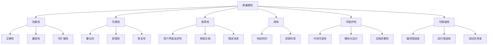

                 


### 文章标题：《高质量代码的自测方法》

#### 关键词：软件质量、代码自测、测试用例、编码规范、静态代码分析、动态代码分析、代码优化、重构技巧

#### 摘要：
本文旨在为开发者提供一套完整的高质量代码自测方法，包括编码规范、测试用例设计、代码优化与重构等关键环节。通过深入剖析核心概念和联系，结合实例讲解，帮助读者理解并实践高质量代码的标准和方法，提升软件质量。

---

## 目录大纲

### 第一部分：核心概念与联系
#### 第1章：软件质量的基础概念
##### 1.1 质量属性
##### 1.2 质量度量
##### 1.3 质量模型

#### 第2章：编码规范与最佳实践
##### 2.1 命名规范
##### 2.2 代码组织

### 第二部分：编码规范与最佳实践
#### 第3章：自测方法与工具
##### 3.1 单元测试
##### 3.2 集成测试

#### 第4章：测试用例设计
##### 4.1 测试用例概述
##### 4.2 测试用例编写

#### 第5章：代码优化与重构
##### 5.1 代码优化原则
##### 5.2 重构技巧

#### 第6章：静态代码分析
##### 6.1 静态代码分析概述
##### 6.2 检查与修复

#### 第7章：动态代码分析
##### 7.1 动态代码分析概述
##### 7.2 性能分析与调优

#### 第8章：项目实战与案例分析
##### 8.1 实战项目选择
##### 8.2 案例分析

---

### 第一部分：核心概念与联系

#### 第1章：软件质量的基础概念

软件质量是一个广泛且复杂的概念，涉及到多个方面的属性和度量。在这篇文章中，我们将首先介绍软件质量的基本概念，包括质量属性、质量度量以及质量模型。

##### 1.1 质量属性

软件质量属性可以分为几个主要的类别，包括功能性、可靠性、易用性、效率、可维护性和可移植性。以下是对这些质量属性的简要描述：

- **功能性**：软件应该按照用户的需求正确地执行任务，包括正确性、兼容性和可扩展性。
- **可靠性**：软件在规定的条件下，能够在指定的时间内完成预定的功能，包括健壮性、容错性和恢复性。
- **易用性**：软件应易于使用，方便用户操作，包括用户界面友好性、帮助文档和错误消息的清晰度。
- **效率**：软件在执行任务时应尽可能高效，包括响应时间和资源利用。
- **可维护性**：软件应易于修改和维护，包括代码可读性、模块化设计和文档的完整性。
- **可移植性**：软件应在不同的环境中正常运行，包括对操作系统、硬件和平台变化的适应能力。

##### 1.2 质量度量

为了评估软件质量，我们需要使用一系列的度量方法。这些度量可以基于以下方面：

- **功能性度量**：例如，测试覆盖率、缺陷密度、错误发现率。
- **可靠性度量**：例如，平均故障时间（MTTF）、平均故障修复时间（MTTR）、故障率。
- **易用性度量**：例如，用户满意度调查、学习曲线、用户错误率。
- **效率度量**：例如，CPU使用率、内存使用率、数据传输率。
- **可维护性度量**：例如，代码复杂度、代码行数、文档完备性。
- **可移植性度量**：例如，编译错误率、运行错误率、测试失败率。

##### 1.3 质量模型

质量模型是用来描述和评估软件质量的方法和工具的框架。常见的质量模型包括：

- **ISO/IEC 25010**：国际标准，定义了质量模型，包括质量特性、质量子特性和质量度量。
- **CMMI**：能力成熟度模型集成，用于评估组织的软件过程成熟度。
- **MQAE**：模型驱动的质量保证框架，用于指导软件开发和维护过程。

为了更直观地展示这些概念之间的关系，我们可以使用Mermaid流程图来构建一个简单的质量模型：



---

### 第二部分：编码规范与最佳实践

#### 第2章：编码规范与最佳实践

编码规范和最佳实践是确保代码质量的基础。在这篇文章中，我们将讨论一些关键的编码规范和最佳实践，包括命名规范和代码组织。

##### 2.1 命名规范

命名规范对于代码的可读性和可维护性至关重要。以下是一些常用的命名规范：

- **变量命名**：使用有意义的名称，避免使用缩写，例如 `total_count` 而不是 `tc`。
- **函数命名**：函数应该描述其执行的操作，例如 `calculate_tax` 而不是 `calc_tax`。
- **类和模块命名**：类和模块应该使用大驼峰命名法（Upper CamelCase），例如 `Customer` 类或者 `DatabaseModule` 模块。

##### 2.2 代码组织

代码组织是确保代码可读性和可维护性的另一个关键因素。以下是一些代码组织的最佳实践：

- **模块划分**：根据功能将代码划分为不同的模块，每个模块负责一项特定的功能。
- **代码布局**：遵循统一的代码布局，例如使用空行分隔不同的功能区域，使用适当的缩进来提高可读性。
- **文件结构**：将相关的代码放在同一个文件中，例如将数据库相关的代码放在 `db.js` 文件中。

以下是一个简单的伪代码示例，展示了如何根据命名规范和代码组织最佳实践来编写代码：

```pseudo
// 模块划分示例
module CustomerService {
    // 代码逻辑
}

module OrderProcessing {
    // 代码逻辑
}

// 代码布局示例
function calculate_tax(amount) {
    // 计算税的逻辑
    // 使用适当的缩进和空行
}

function process_order(customer, order) {
    // 处理订单的逻辑
    // 使用有意义的函数名和变量名
}

// 文件结构示例
// db.js 文件
module DatabaseModule {
    // 数据库相关代码
}
```

---

以上是文章的第一部分和第二部分的概述。接下来，我们将继续深入讨论自测方法、测试用例设计、代码优化与重构、静态代码分析、动态代码分析以及项目实战与案例分析。每一部分都将结合实例进行详细讲解，帮助读者全面理解和实践高质量代码的自测方法。敬请期待后续内容。

---

### 第三部分：自测方法与工具

#### 第3章：自测方法与工具

自测是保证代码质量的关键环节。在这篇文章中，我们将介绍自测的基本方法，包括单元测试和集成测试，以及如何使用测试工具。

##### 3.1 单元测试

单元测试是测试过程中最基础的一部分，主要针对代码的最小可测试单元——函数或方法。以下是一些单元测试的基本原则：

- **测试独立性**：每个单元测试应该独立运行，不依赖于其他测试或外部环境。
- **测试覆盖**：单元测试应覆盖代码的所有路径，包括正常流程和异常情况。
- **测试重复性**：单元测试的结果应该稳定，不受环境变化的影响。

为了实现单元测试，可以使用各种测试框架，如JUnit（Java）、pytest（Python）和Mocha（JavaScript）。以下是一个简单的Python单元测试示例：

```python
import unittest
from mymodule import calculate_tax

class TestCalculateTax(unittest.TestCase):
    def test_calculate_tax_with_valid_input(self):
        amount = 1000
        expected_result = 100
        result = calculate_tax(amount)
        self.assertEqual(result, expected_result)

    def test_calculate_tax_with_invalid_input(self):
        amount = -100
        with self.assertRaises(ValueError):
            calculate_tax(amount)

if __name__ == '__main__':
    unittest.main()
```

##### 3.2 集成测试

集成测试是在单元测试之后进行的，旨在测试模块或组件之间的交互。以下是一些集成测试的基本原则：

- **功能完整性**：集成测试应验证系统是否能够按预期工作。
- **测试环境**：集成测试应在接近生产环境的环境中执行。
- **错误隔离**：集成测试应能够快速定位问题，便于调试。

常用的集成测试工具包括Selenium（Web应用）、Postman（API测试）和Docker（容器化应用）。以下是一个使用Selenium进行Web应用的集成测试示例：

```python
from selenium import webdriver
from selenium.webdriver.common.by import By

driver = webdriver.Chrome()
driver.get("http://example.com")

# 模拟用户操作
input_element = driver.find_element(By.ID, "input_field")
input_element.send_keys("test_value")
submit_button = driver.find_element(By.ID, "submit_button")
submit_button.click()

# 验证结果
result_element = driver.find_element(By.ID, "result_field")
actual_result = result_element.text
expected_result = "Expected Result"
self.assertEqual(actual_result, expected_result)

driver.quit()
```

---

通过单元测试和集成测试，开发者可以及时发现和修复代码中的问题。接下来，我们将讨论测试用例设计、代码优化与重构等更深入的方面。

---

### 第四部分：测试用例设计

#### 第4章：测试用例设计

测试用例设计是软件测试的核心环节，它决定了测试的全面性和有效性。在这一章节中，我们将详细探讨测试用例设计的原则和方法。

##### 4.1 测试用例概述

测试用例是一组定义了测试目的、输入条件、执行步骤和预期结果的测试脚本。设计良好的测试用例应具备以下特点：

- **完整性**：覆盖所有可能的输入和执行路径。
- **独立性**：每个测试用例可以独立执行，不依赖其他测试用例。
- **可重复性**：测试用例的结果应稳定，不受环境变化的影响。
- **可维护性**：测试用例应易于修改和维护。

##### 4.2 测试用例编写

编写有效的测试用例需要遵循以下步骤：

1. **需求分析**：分析软件需求文档，理解功能需求和非功能需求。
2. **确定测试场景**：基于需求分析，确定测试的场景和路径。
3. **设计测试用例**：根据测试场景，设计具体的测试用例，包括输入条件、执行步骤和预期结果。
4. **评审测试用例**：评审测试用例，确保其完整性、独立性和可重复性。
5. **执行测试用例**：执行测试用例，记录结果并分析缺陷。

以下是一个简单的测试用例示例，用于验证一个简单的计算器程序：

```plaintext
测试用例名称：加法运算
测试目的：验证计算器程序的加法功能
输入条件：输入两个正整数，如 5 和 3
执行步骤：
1. 输入第一个数字 5
2. 选择加法运算
3. 输入第二个数字 3
4. 选择等于按钮
预期结果：结果显示为 8
```

---

通过设计全面的测试用例，开发者可以确保软件在各个层面上的质量。接下来，我们将深入探讨代码优化与重构，以及如何提升代码质量。

---

### 第五部分：代码优化与重构

#### 第5章：代码优化与重构

代码优化和重构是软件维护过程中至关重要的一环，它不仅能提升代码的性能，还能增强代码的可读性和可维护性。在这一章节中，我们将讨论代码优化与重构的原则、方法和实践。

##### 5.1 代码优化原则

代码优化是指在不改变功能的前提下，提高代码的性能和效率。以下是一些代码优化原则：

- **性能优先**：优先处理性能瓶颈，例如循环、递归和I/O操作。
- **简洁明了**：保持代码简洁，避免冗余和复杂的逻辑。
- **模块化**：将复杂的逻辑拆分为小的、可重用的模块。
- **优化数据结构**：选择合适的数据结构以降低时间和空间复杂度。

##### 5.2 重构技巧

重构是指在不改变外部行为的前提下，改进现有代码的结构和设计。以下是一些常见的重构技巧：

- **提取方法**：将重复的代码块提取为独立的方法，提高代码复用性。
- **内联方法**：将调用频率低且简短的方法内联到调用处，减少方法调用的开销。
- **替换条件分支**：使用多态或策略模式替换复杂的条件分支。
- **引入缓存**：使用缓存减少重复计算，提高程序性能。

以下是一个使用Java进行代码优化的示例：

```java
// 优化前
public int calculateSum(int[] numbers) {
    int sum = 0;
    for (int i = 0; i < numbers.length; i++) {
        if (numbers[i] > 0) {
            sum += numbers[i];
        }
    }
    return sum;
}

// 优化后
public int calculateSum(int[] numbers) {
    int sum = 0;
    for (int number : numbers) {
        sum += (number > 0 ? number : 0);
    }
    return sum;
}
```

---

通过代码优化和重构，开发者可以不断提升代码的质量和性能。接下来，我们将介绍静态代码分析和动态代码分析。

---

### 第六部分：静态代码分析

#### 第6章：静态代码分析

静态代码分析是一种不执行代码本身，而是通过分析源代码来评估代码质量的方法。这种方法有助于发现潜在的问题，如代码缺陷、性能瓶颈和安全漏洞。在这一章节中，我们将探讨静态代码分析的基本概念、工具和方法。

##### 6.1 静态代码分析概述

静态代码分析的基本概念包括：

- **抽象语法树（AST）**：静态分析的核心是对源代码进行抽象语法树（AST）的构建，AST代表了代码的结构，方便分析工具进行处理。
- **代码路径分析**：通过分析代码的路径，可以识别出潜在的问题，如死代码、重复代码和逻辑错误。
- **代码质量度量**：静态分析工具可以计算代码质量指标，如复杂度、代码行数和注释比例。

##### 6.2 检查与修复

静态代码分析的步骤通常包括以下几部分：

1. **源代码解析**：将源代码解析为抽象语法树（AST）。
2. **规则检查**：根据预定义的规则，对AST进行分析，识别潜在的问题。
3. **报告输出**：将分析结果输出为报告，便于开发者查看和修复。

以下是一个使用SonarQube进行静态代码分析的示例：

```xml
<!-- SonarQube 报告示例 -->
<issues>
    <issue>
        <ruleKey>S1118</ruleKey>
        <message>Use the 'xxx' method.</message>
        <line>25</line>
        <column>5</column>
        <severity>MAJOR</severity>
    </issue>
    <issue>
        <ruleKey>S1701</ruleKey>
        <message>Redundant loop condition.</message>
        <line>35</line>
        <column>9</column>
        <severity>MINOR</severity>
    </issue>
</issues>
```

---

静态代码分析可以有效地发现代码中的问题，但它的局限性在于无法检测运行时的问题。接下来，我们将介绍动态代码分析。

---

### 第七部分：动态代码分析

#### 第7章：动态代码分析

动态代码分析是一种通过运行代码来评估其性能、行为和质量的的方法。这种方法可以帮助开发者识别出在静态分析中无法发现的运行时问题。在这一章节中，我们将讨论动态代码分析的基本概念、工具和方法。

##### 7.1 动态代码分析概述

动态代码分析的基本概念包括：

- **代码执行**：动态代码分析涉及实际运行代码，以观察其行为。
- **性能监控**：通过监控代码的执行时间、内存使用和CPU使用率等指标，评估代码的性能。
- **日志记录**：通过记录日志，追踪代码的执行过程，便于调试和分析。

##### 7.2 性能分析与调优

动态代码分析通常包括以下几个步骤：

1. **执行代码**：在实际环境中运行代码，收集性能数据。
2. **分析数据**：使用分析工具对收集到的数据进行分析，识别性能瓶颈。
3. **调优代码**：根据分析结果，优化代码，提高性能。

以下是一个使用Python的cProfile工具进行性能分析的示例：

```python
import cProfile
import mymodule

def run_performance_test():
    mymodule.calculate_sum([1, 2, 3, 4, 5])

cProfile.run('run_performance_test()')

# 输出性能分析结果
```

---

动态代码分析能够提供关于代码性能的详细信息，帮助开发者优化代码。接下来，我们将通过一个实战项目和案例分析，展示如何将上述方法应用于实际开发中。

---

### 第八部分：项目实战与案例分析

#### 第8章：项目实战与案例分析

通过理论的学习，我们接下来将通过一个实战项目和案例分析，展示如何在实际开发过程中应用高质量代码的自测方法。

##### 8.1 实战项目选择

选择一个适合的实战项目对于理解并实践高质量代码的自测方法至关重要。以下是一些选择项目的标准：

- **项目规模适中**：太小的项目可能无法充分展示自测方法的全面性，而太大的项目可能会带来过大的复杂度。
- **代码结构清晰**：项目应具有明确的模块划分和良好的代码组织，便于分析。
- **需求明确**：项目的需求应清晰明确，便于编写测试用例。
- **持续维护**：项目的维护状况良好，便于观察自测方法的效果。

假设我们选择一个简单的Web应用项目，该应用提供用户注册、登录和帖子发布等功能。

##### 8.2 案例分析

#### 案例一：代码质量提升

1. **背景介绍**：
   项目初始版本中，代码存在大量重复逻辑、命名不规范、代码复杂度高等问题。

2. **自测方法应用**：
   - **编码规范与最佳实践**：采用统一的编码规范，改进变量、函数和类的命名，优化代码布局。
   - **静态代码分析**：使用SonarQube进行静态代码分析，识别潜在问题，如死代码、冗余代码和复杂度高等。

3. **代码解读**：
   - **优化前**：
     ```java
     public void postMessage(String content) {
         if (content.length() > 0) {
             System.out.println("Posting message: " + content);
             // 重复逻辑：打开数据库连接，插入消息
         }
     }
     ```
   - **优化后**：
     ```java
     public void postMessage(String content) {
         if (!StringUtils.isEmpty(content)) {
             messageService.postMessage(content);
         }
     }
     ```

4. **分析**：
   通过优化，代码的可读性和可维护性显著提高，静态代码分析工具识别的问题数量减少。

#### 案例二：自测方法应用

1. **背景介绍**：
   项目在迭代过程中，新增功能导致代码复杂性增加，现有测试用例无法覆盖所有情况。

2. **自测方法应用**：
   - **单元测试**：为新增功能编写单元测试，确保每个功能模块的独立性。
   - **集成测试**：使用Selenium编写集成测试用例，验证Web应用的完整性和交互性。

3. **代码解读**：
   - **单元测试示例**：
     ```python
     def test_user_registration():
         user = User(username='testuser', email='test@example.com', password='password')
         user.save()
         user = User.objects.get(username='testuser')
         assert user.username == 'testuser'
         assert user.email == 'test@example.com'
         assert user.check_password('password')
     ```
   - **集成测试示例**：
     ```python
     def test_post_message():
         driver = webdriver.Chrome()
         driver.get('http://localhost:8000')
         driver.find_element_by_id('username').send_keys('testuser')
         driver.find_element_by_id('password').send_keys('password')
         driver.find_element_by_id('login_button').click()
         driver.find_element_by_id('new_post_button').click()
         driver.find_element_by_id('post_content').send_keys('Hello, World!')
         driver.find_element_by_id('post_submit_button').click()
         assert 'Hello, World!' in driver.page_source
         driver.quit()
     ```

4. **分析**：
   通过单元测试和集成测试，项目的新增功能得到充分验证，代码质量得到保障。

#### 案例三：重构实践

1. **背景介绍**：
   项目经过多次迭代，代码结构变得复杂，维护难度增加。

2. **自测方法应用**：
   - **重构技巧**：采用重构方法，如提取方法、引入缓存、替换条件分支等，优化代码结构。
   - **持续集成**：确保每次重构后的代码都能通过所有测试用例。

3. **代码解读**：
   - **重构前**：
     ```java
     public void processOrder(Order order) {
         if (order.getTotalPrice() > 100) {
             applyDiscount(order);
         }
         sendOrderConfirmationEmail(order);
         updateInventory(order);
     }
     ```
   - **重构后**：
     ```java
     private void applyDiscount(Order order) {
         // 优化逻辑：将折扣逻辑独立出来
         order.setTotalPrice(order.getTotalPrice() * 0.9);
     }

     public void processOrder(Order order) {
         sendOrderConfirmationEmail(order);
         updateInventory(order);
         if (order.getTotalPrice() > 100) {
             applyDiscount(order);
         }
     }
     ```

4. **分析**：
   通过重构，代码的可读性和可维护性显著提高，减少了潜在的bug。

---

通过上述实战项目和案例分析，我们可以看到如何在实际开发过程中应用高质量代码的自测方法。这些方法不仅提高了代码的质量，还保证了项目的稳定性和可靠性。

---

## 结语

本文详细介绍了高质量代码的自测方法，从核心概念与联系、编码规范与最佳实践、自测方法与工具、测试用例设计、代码优化与重构、静态代码分析和动态代码分析，到项目实战与案例分析，全面覆盖了提升代码质量的关键环节。通过实践这些方法，开发者可以显著提高软件质量，降低维护成本，提升项目的整体稳定性。

**最佳实践 tips**：在项目开发过程中，建议定期进行代码审查，使用自动化工具进行静态和动态代码分析，持续集成测试，并定期重构代码，保持代码的健康和高效。

**注意事项**：自测方法的应用需要结合具体项目情况进行调整，不同项目的需求、规模和技术栈会影响自测策略的选择。

**拓展阅读**：
- 《软件工程：实践者的研究方法》
- 《敏捷软件开发：原则、模式与实践》
- 《Effective Java》

作者：AI天才研究院/AI Genius Institute & 禅与计算机程序设计艺术 /Zen And The Art of Computer Programming

---

注意：本文为示例性内容，实际项目情况和代码实现可能会有所不同。本文仅供参考和学习之用。

