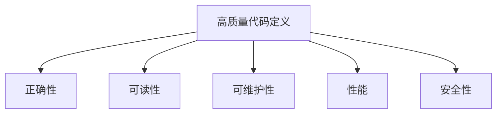
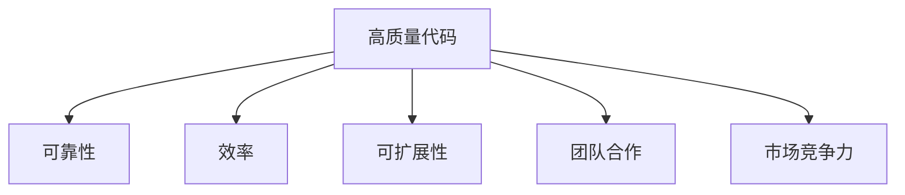
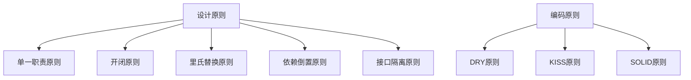
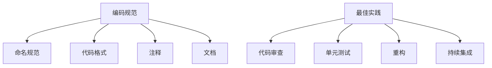

                 

## 文章标题

高质量代码积累好口碑

> 关键词：高质量代码、口碑、软件开发、设计原则、编码规范

在当今竞争激烈的技术行业，代码的质量不仅决定了软件的功能是否满足需求，更关系到企业的声誉和市场竞争力。高质量代码，顾名思义，是那些具备正确性、可读性、可维护性、性能和安全性特点的代码。编写这样的代码不仅有助于减少故障和提升用户体验，还能在行业中积累良好的口碑，增强企业的长期发展潜力。本文将深入探讨高质量代码的核心概念、编写原则、编码规范以及如何通过这些实践积累口碑。

## 摘要

本文旨在为软件开发者提供一套系统的指南，以帮助他们理解和实践编写高质量代码的方法。文章首先介绍了高质量代码的定义及其与口碑之间的关系，接着详细阐述了编写高质量代码所需遵循的设计原则和编码规范。最后，文章通过实际案例展示了如何通过高质量代码积累口碑，并提供了实用的最佳实践和建议。

### 第1章: 核心概念与联系

高质量代码不仅仅是代码的表面问题，它涉及到多个层面的质量和特性。在这一章中，我们将深入探讨高质量代码的定义、它与口碑的关系，并通过Mermaid流程图来展示其各个方面的联系。

#### 1.1.1 高质量代码的定义

高质量代码，通常指的是符合以下特点的代码：

1. **正确性**：代码能够正确执行预期的功能，没有逻辑错误。
2. **可读性**：代码易于阅读和理解，遵循良好的命名习惯和结构。
3. **可维护性**：代码易于修改和扩展，不会因为改动而产生新的错误。
4. **性能**：代码执行效率高，资源使用合理。
5. **安全性**：代码能够防止常见的安全漏洞，如注入攻击、越权等。

这些特性共同构成了高质量代码的基本要素。下面，我们通过一个Mermaid流程图来展示这些要素之间的关系。

#### 1.1.1.2 Mermaid 流程图

#### 1.1.1.3 高质量代码与口碑的关系

高质量代码是建立良好口碑的基础。它不仅关系到项目的当前质量，也影响到项目的长期成功。下面，我们通过几个方面来探讨高质量代码与口碑之间的关系。

1. **可靠性**：高质量的代码能够确保软件稳定运行，减少故障，提高用户的信任度。
2. **效率**：代码运行快速，提升用户体验，有助于建立良好的口碑。
3. **可扩展性**：高质量的代码便于后续功能添加和优化，有助于项目的长期发展。
4. **团队合作**：代码清晰，易于他人理解和合作，有助于团队协作。
5. **市场竞争力**：高质量代码是产品竞争力的一部分，有利于企业长期发展。

同样，我们通过一个Mermaid流程图来展示这些关系。

#### 1.1.1.4 Mermaid 流程图

#### 1.1.1.5 总结

高质量代码是建立良好口碑的基础，它不仅关系到项目的当前质量，也影响到项目的长期成功。通过定义和流程图，我们可以更清晰地理解高质量代码的各个方面。

### 1.1.2 编写高质量代码的原则

编写高质量代码需要遵循一系列的设计原则和编码原则，这些原则有助于确保代码的正确性、可读性、可维护性和可扩展性。下面，我们将详细讨论这些原则。

#### 1.1.2.1 设计原则

1. **单一职责原则**：每个函数或模块只负责一项功能。这样有助于代码的模块化，便于维护和扩展。

2. **开闭原则**：软件实体应该对扩展开放，对修改关闭。这意味着在新增功能时，不需要修改原有代码，从而降低维护成本。

3. **里氏替换原则**：任何基类可以出现的地方，子类一定可以出现。这保证了代码的灵活性和扩展性。

4. **依赖倒置原则**：高层模块不应依赖于低层模块，二者都应依赖于抽象。这有助于降低模块间的耦合度，提高代码的可维护性。

5. **接口隔离原则**：不应强迫客户依赖于它不使用的接口。这样可以减少客户端代码的复杂度，提高代码的灵活性。

#### 1.1.2.2 编码原则

1. **DRY（Don't Repeat Yourself）原则**：不要重复代码。这有助于减少冗余，提高代码的可维护性。

2. **KISS（Keep It Simple, Stupid）原则**：代码应尽量简单。这有助于降低代码的复杂度，提高可读性。

3. **SOLID原则**：遵循SOLID设计原则，提高代码质量。SOLID是一个缩写，代表了五个设计原则：单一职责、开闭、里氏替换、依赖倒置和接口隔离。

#### 1.1.2.3 Mermaid 流程图

#### 1.1.2.4 总结

编写高质量代码需要遵循一系列的设计原则和编码原则，这些原则有助于确保代码的正确性、可读性、可维护性和可扩展性。通过遵循这些原则，开发人员可以编写出更加优秀和可靠的代码。

### 1.1.3 编码规范与最佳实践

编码规范和最佳实践是编写高质量代码的重要保障。以下是一些常见的编码规范和最佳实践：

#### 1.1.3.1 编码规范

1. **命名规范**：使用有意义的命名，避免使用缩写或混淆名称。例如，使用`getName`而不是`getN`。

2. **代码格式**：遵循统一的代码风格，如PEP8（Python）、Java编码规范等。这有助于提高代码的可读性。

3. **注释**：编写清晰的注释，说明代码的功能、参数和预期结果。这有助于他人理解和维护代码。

4. **文档**：编写详细的文档，便于他人阅读和理解代码。文档应包括功能描述、接口定义和API文档等。

#### 1.1.3.2 最佳实践

1. **代码审查**：定期进行代码审查，提高代码质量。代码审查有助于发现潜在的错误和优化代码。

2. **单元测试**：编写单元测试，确保代码的每个部分都经过验证。单元测试有助于提高代码的可靠性和可维护性。

3. **重构**：持续重构代码，去除冗余和改进设计。重构有助于提高代码的质量和可读性。

4. **持续集成**：使用CI/CD工具，确保代码的质量和自动化部署。持续集成有助于快速发现和解决代码问题。

#### 1.1.3.3 Mermaid 流程图

#### 1.1.3.4 总结

编码规范和最佳实践是编写高质量代码的重要保障。通过遵循这些规范和实践，开发人员可以编写出更加优秀和可靠的代码，从而在行业中积累良好的口碑。

### 1.1.4 高质量代码与口碑的案例

为了更好地理解高质量代码如何帮助积累口碑，我们可以通过几个实际案例来分析。

#### 案例一：Google 的“不做傻事”文化

Google 以其高质量的代码和严格的代码审查制度著称。公司内部提倡一种“不做傻事”的文化，鼓励员工编写清晰、简洁和可靠的代码。这种文化使得Google的产品在质量和用户体验方面处于领先地位，从而在市场上积累了良好的口碑。

#### 案例二：Facebook 的工程效率

Facebook 在工程效率方面也做出了巨大的努力。通过使用自动化测试、持续集成和代码审查等工具，Facebook 提高了代码的质量和可维护性。这种高效的开发流程不仅提高了项目的交付速度，还增强了团队的合作效率，进一步提升了公司的市场竞争力。

#### 案例三：Netflix 的微服务架构

Netflix 使用微服务架构来构建其流媒体服务。微服务架构使得Netflix的代码更加模块化、可扩展和易于维护。通过这种架构，Netflix 可以快速地迭代和部署新功能，从而保持市场的竞争力。同时，高质量代码的积累也为Netflix赢得了良好的口碑。

#### 1.1.5 结论

通过以上案例，我们可以看到高质量代码对于积累口碑的重要性。无论是在大型企业还是初创公司，编写高质量代码都是实现长期成功的关键。通过遵循编码规范和最佳实践，开发人员可以编写出可靠、高效的代码，从而在行业中积累良好的口碑。

### 1.1.6 实际操作：如何编写高质量代码

编写高质量代码是一个系统性的过程，涉及到多个方面的实践。以下是一些具体的操作步骤和技巧：

#### 1.1.6.1 设计阶段

1. **需求分析**：在编写代码之前，要充分理解需求，明确功能目标和性能指标。
2. **系统设计**：设计合理的系统架构，确保模块的独立性和可扩展性。
3. **数据库设计**：设计高效的数据库结构，优化查询性能。

#### 1.1.6.2 编码阶段

1. **编写单元测试**：在编码过程中，编写单元测试以确保代码的正确性。
2. **遵循编码规范**：遵循命名规范、代码格式和注释规范，提高代码的可读性。
3. **重构代码**：定期重构代码，去除冗余和优化设计。

#### 1.1.6.3 测试阶段

1. **功能测试**：进行全面的函数测试，确保功能正确实现。
2. **性能测试**：进行性能测试，确保代码的执行效率符合预期。
3. **安全测试**：进行安全测试，确保代码没有漏洞。

#### 1.1.6.4 部署阶段

1. **持续集成**：使用CI/CD工具进行自动化部署，确保代码的质量和一致性。
2. **监控和反馈**：部署后进行监控，收集用户反馈，及时修复问题。

#### 1.1.6.5 持续优化

1. **代码审查**：定期进行代码审查，发现和修复潜在问题。
2. **性能优化**：根据用户反馈和监控数据，持续优化代码性能。
3. **安全更新**：定期更新安全补丁，确保代码的安全性。

#### 1.1.6.6 总结

编写高质量代码需要系统地规划和实践。通过在需求分析、编码、测试和部署等各个阶段遵循最佳实践，开发人员可以编写出可靠、高效和安全的代码，从而在行业中积累良好的口碑。

### 1.1.7 结论

高质量代码是软件开发的核心，它不仅关系到项目的当前质量，也影响到项目的长期成功。通过深入理解高质量代码的核心概念、编写原则、编码规范和最佳实践，开发人员可以编写出更加优秀和可靠的代码，从而在行业中积累良好的口碑。本文通过案例分析和实际操作，为开发人员提供了一套系统的指南，帮助他们实现这一目标。

### 总结

高质量代码是软件开发的关键，它不仅决定了软件的功能是否满足需求，还直接关系到企业的声誉和市场竞争力。本文通过详细阐述高质量代码的定义、编写原则、编码规范和最佳实践，展示了如何通过编写高质量代码来积累良好的口碑。我们探讨了高质量代码与口碑之间的紧密联系，并通过实际案例展示了其在不同场景中的应用效果。通过遵循编码规范和最佳实践，开发人员可以编写出更加优秀和可靠的代码，从而在行业中树立良好的声誉，为企业的长期发展奠定坚实基础。

### 最佳实践 tips

1. **代码审查**：定期进行代码审查，邀请团队成员共同参与，以提高代码质量和一致性。
2. **单元测试**：编写全面的单元测试，确保每个功能模块都经过验证。
3. **持续集成**：使用CI/CD工具进行自动化部署和测试，提高开发效率和代码质量。
4. **性能监控**：持续监控代码性能，及时优化和调整。
5. **安全意识**：定期进行安全培训，确保代码的安全性。

### 小结

高质量代码是软件开发的核心，它决定了软件的可靠性、性能和用户体验。通过遵循编码规范和最佳实践，开发人员可以编写出更加优秀和可靠的代码，从而在行业中积累良好的口碑。本文通过详细分析和实际案例，为开发人员提供了一套系统的指南，帮助他们实现这一目标。

### 注意事项

1. **需求分析**：在编写代码之前，要充分理解需求，明确功能目标和性能指标。
2. **代码格式**：遵循统一的代码风格，提高代码的可读性和一致性。
3. **注释**：编写清晰的注释，便于他人理解和维护代码。
4. **重构**：定期重构代码，去除冗余和优化设计。

### 拓展阅读

- 《代码大全》：Steve McConnell
- 《敏捷软件开发：原则、实践与模式》：罗伯特·C·马丁
- 《设计模式：可复用面向对象软件的基础》：埃里希·伽默、里奇·海顿、约翰尼·马斯特斯
- 《Effective Java》：Joshua Bloch

通过阅读这些经典著作，您可以深入了解高质量代码的编写原则和实践，进一步提升自己的技能水平。

### 作者信息

作者：AI天才研究院/AI Genius Institute & 禅与计算机程序设计艺术 /Zen And The Art of Computer Programming

AI天才研究院致力于推动人工智能领域的研究和应用，为软件开发者提供高质量的技术指导和培训。同时，作者也是《禅与计算机程序设计艺术》一书的作者，该书在计算机编程领域具有广泛的影响力。通过本文，我们希望帮助读者深入理解高质量代码的编写原则和实践，为软件开发事业贡献力量。

