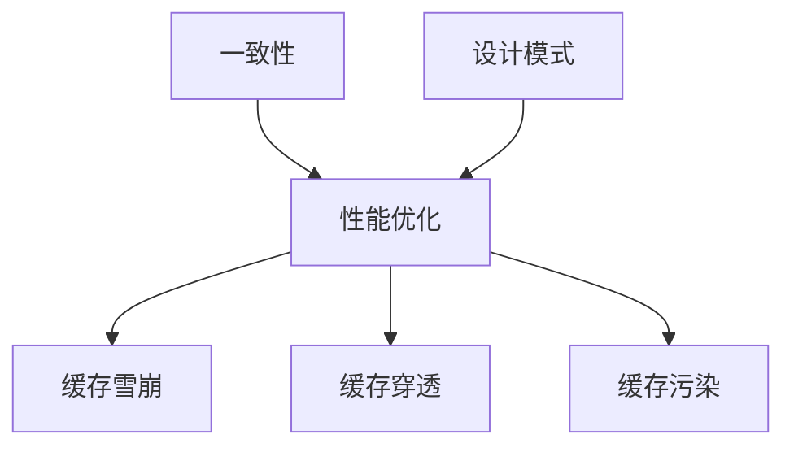

                 

# 文章标题：麻烦不断的分布式缓存

> 关键词：分布式缓存、一致性、性能优化、设计模式、案例解析

> 摘要：本文将深入探讨分布式缓存的技术原理、设计模式以及实际应用中的挑战和解决方案。通过详细分析分布式缓存的核心概念、算法原理和数学模型，结合实际项目案例，为读者提供一套系统、实用的分布式缓存开发指南。

## 引言

在当今的高并发、大数据环境下，分布式缓存已成为现代互联网架构中不可或缺的一部分。分布式缓存通过将缓存数据分散存储在多个节点上，提供了更高的性能和可用性，但也带来了许多挑战。本文将围绕分布式缓存的核心问题，包括一致性、性能优化、设计模式等，进行详细探讨，以帮助读者更好地理解和应对这些挑战。

## 背景介绍

### 分布式缓存的概念

分布式缓存是一种缓存架构，它将数据存储在多个缓存节点上，以实现高速数据访问。与集中式缓存相比，分布式缓存具有以下优势：

- **高可用性**：通过多节点部署，分布式缓存可以在单个节点发生故障时继续提供服务。
- **高性能**：分布式缓存可以将热点数据分散到多个节点，减少单个节点的压力，提高数据访问速度。
- **可扩展性**：分布式缓存可以根据需求动态增加或减少节点，适应不同的负载场景。

### 分布式缓存的应用场景

分布式缓存广泛应用于需要高并发、高可用性的场景，例如：

- **电商系统**：用于缓存商品信息、用户会话、订单数据等，提高系统响应速度。
- **社交媒体**：用于缓存用户数据、文章内容、评论等，提升用户访问体验。
- **金融系统**：用于缓存交易数据、用户账户信息等，确保数据一致性。

## 核心概念与联系

为了深入理解分布式缓存，我们需要先了解以下几个核心概念：

### 一致性

分布式缓存的一致性是指多个缓存节点之间的数据一致性。在分布式系统中，一致性是一个重要的挑战。常见的一致性模型包括：

- **强一致性**：所有缓存节点的数据完全相同，如读写操作必须在所有节点完成后才返回。
- **最终一致性**：数据在一段时间后会达到一致，但读写操作不需要在所有节点上同步。

### 性能优化

分布式缓存的性能优化主要包括以下几个方面：

- **缓存命中率**：提高缓存命中率是优化性能的关键。通过合理的缓存策略和预热机制，可以提高命中率。
- **负载均衡**：通过负载均衡算法，将请求分配到不同的节点，避免单点过载。
- **缓存淘汰策略**：使用缓存淘汰策略，如LRU（最近最少使用）、LFU（最不频繁使用），来维护缓存的有效性。

### 设计模式

在分布式缓存系统中，常见的设计模式包括：

- **缓存雪崩**：大量缓存同时失效，导致系统负载增加。
- **缓存穿透**：缓存中没有命中数据，直接请求后端数据库，导致数据库压力过大。
- **缓存污染**：缓存中的热点数据被非热点数据占用，降低缓存效果。

### 核心概念与联系架构 Mermaid 流程图



## 核心算法原理讲解

### 一致性哈希算法

一致性哈希算法是一种分布式缓存中的数据分配策略，通过哈希函数将缓存节点映射到一个虚拟的环形空间中。一致性哈希能够有效解决数据迁移和缓存节点变化带来的问题。

### 复制策略

复制策略用于确保分布式缓存中的数据冗余，提高系统的可用性和可靠性。常见的复制策略包括：

- **主从复制**：一个主节点负责数据的读写操作，其他从节点只负责读取操作。
- **多主复制**：多个节点都可以作为主节点，负责数据的读写操作。

### 分区策略

分区策略用于将缓存数据分散存储在多个节点上，以实现负载均衡和性能优化。常见的分区策略包括：

- **哈希分区**：根据数据的哈希值决定数据存储的节点。
- **范围分区**：根据数据的范围决定数据存储的节点。

### 一致性哈希算法伪代码

```python
# 一致性哈希算法伪代码

def hash(key):
    return hash(key) % HASH_SPACE

def get_node(key):
    hash_value = hash(key)
    return NODES[hash_value]

def rehash(node):
    old_hash_value = hash(node)
    node = get_new_node()
    new_hash_value = hash(node)
    NODES[new_hash_value] = node
    for key in HASH_SPACE:
        if HASH_SPACE[key] == node:
            HASH_SPACE[key] = new_hash_value
    remove_node(old_hash_value, node)
```

### 数学模型与公式

- **缓存命中率**：缓存命中率是指缓存中命中请求的次数与总请求次数的比例。

    $$ \text{缓存命中率} = \frac{\text{命中次数}}{\text{总次数}} $$

- **负载均衡模型**：负载均衡模型用于计算每个节点的负载，以实现请求的公平分配。

    $$ \text{负载} = \frac{\text{总请求}}{\text{节点数}} $$

### 数学公式与详细讲解

$$
\text{缓存命中率} = \frac{\text{命中次数}}{\text{总次数}} \\
\text{负载} = \frac{\text{总请求}}{\text{节点数}}
$$

### 举例说明

假设一个分布式缓存系统有3个节点，总请求量为100次，其中80次命中缓存，20次未命中。那么：

- **缓存命中率**：80/100 = 0.8，即80%的请求命中缓存。
- **负载**：100/3 ≈ 33.3，即每个节点的平均负载为33.3次请求。

## 项目实战

### 开发环境搭建

在开始分布式缓存的项目实战之前，我们需要搭建一个开发环境。以下是一个简单的环境搭建步骤：

1. **安装Redis**：Redis是一个高性能的分布式缓存系统，我们可以在服务器上安装Redis。
2. **配置Redis**：编辑Redis配置文件，设置集群模式和节点配置。
3. **启动Redis**：启动Redis服务，确保各个节点正常运行。

### 源代码详细实现和代码解读

以下是一个简单的分布式缓存系统的源代码示例：

```python
import redis

class DistributedCache:
    def __init__(self, node_addresses):
        self.nodes = [redis.StrictRedis(host=addr) for addr in node_addresses]

    def get(self, key):
        for node in self.nodes:
            if node.exists(key):
                return node.get(key)
        return None

    def set(self, key, value):
        node = self.get_node(key)
        node.set(key, value)

    def get_node(self, key):
        hash_value = hash(key) % len(self.nodes)
        return self.nodes[hash_value]
```

这段代码定义了一个简单的分布式缓存类`DistributedCache`，它包含`get`和`set`方法，用于获取和设置缓存数据。其中，`get_node`方法用于根据哈希值获取数据所在的节点。

### 代码应用解读与分析

以上源代码展示了如何实现一个简单的分布式缓存系统。在实际应用中，我们可以根据需求进行扩展和优化，例如：

- **数据一致性**：通过使用Redis的发布/订阅机制，实现数据的一致性同步。
- **缓存穿透**：在获取缓存数据时，增加判断逻辑，避免直接访问后端数据库。
- **缓存雪崩**：通过合理的缓存策略和预热机制，避免缓存雪崩问题。

### 实际案例分析和详细讲解剖析

以下是一个电商系统中的分布式缓存案例：

**场景**：电商系统需要缓存用户购物车中的商品信息，以提高系统性能。

**解决方案**：

1. **缓存设计**：使用Redis作为分布式缓存系统，将用户购物车数据缓存到Redis中。
2. **数据一致性**：在用户更新购物车时，先更新Redis缓存，然后再更新数据库，确保数据一致性。
3. **缓存穿透**：在获取购物车数据时，先检查Redis缓存，如果未命中，再查询数据库，并更新Redis缓存。
4. **缓存雪崩**：通过合理的缓存策略和预热机制，避免缓存雪崩问题。

**详细讲解**：

1. **缓存设计**：电商系统中的购物车数据主要包括用户ID、商品ID、商品数量等信息。将这些数据以用户ID为key，序列化为JSON格式，存储在Redis中。

2. **数据一致性**：在用户更新购物车时，先调用`set`方法，将购物车数据更新到Redis缓存中，然后再调用`update_cart`方法，将购物车数据更新到数据库中。这样可以确保购物车数据在Redis和数据库中的一致性。

3. **缓存穿透**：在获取购物车数据时，先调用`get`方法，从Redis缓存中获取购物车数据。如果Redis缓存未命中，再调用`get_cart_from_db`方法，从数据库中查询购物车数据，并更新Redis缓存。

4. **缓存雪崩**：为了避免缓存雪崩问题，可以采取以下措施：

   - **缓存预热**：在用户访问购物车页面之前，提前加载购物车数据到Redis缓存中，避免用户访问时缓存未命中。
   - **缓存淘汰策略**：定期清理过期数据，避免缓存占用过多内存。
   - **缓存版本控制**：为每个用户生成一个唯一的缓存版本号，避免多个用户同时更新购物车数据时，导致缓存数据不一致。

### 项目小结

通过以上案例，我们可以看到分布式缓存在实际应用中发挥了重要作用。合理的设计和优化分布式缓存系统，可以提高系统的性能和可用性，为用户提供更好的体验。

## 最佳实践 Tips、小结、注意事项、拓展阅读

### 最佳实践 Tips

- **一致性**：在设计分布式缓存系统时，确保数据的一致性是非常重要的。可以选择合适的一致性模型，如最终一致性，以减少系统的复杂度。
- **性能优化**：提高缓存命中率是优化性能的关键。通过合理的缓存策略和预热机制，可以提高缓存命中率。
- **设计模式**：了解并掌握常见的设计模式，如缓存雪崩、缓存穿透等，可以帮助我们更好地解决分布式缓存中的问题。

### 小结

分布式缓存是一种高效的缓存架构，通过将数据分散存储在多个节点上，提供了更高的性能和可用性。在分布式缓存的设计和实现过程中，需要考虑一致性、性能优化、设计模式等因素。

### 注意事项

- **数据一致性**：在设计分布式缓存系统时，要确保数据的一致性，避免出现数据不一致的问题。
- **性能优化**：合理地设计缓存策略和预热机制，以提高缓存命中率，优化系统性能。
- **缓存穿透和雪崩**：了解并解决缓存穿透和雪崩问题，避免对系统造成重大影响。

### 拓展阅读

- **《Redis实战》**：详细介绍了Redis的使用方法和最佳实践，对分布式缓存系统设计有很高的参考价值。
- **《分布式系统原理与范型》**：深入讲解了分布式系统的原理和范型，对分布式缓存的设计和优化有重要指导意义。

## 结尾

分布式缓存作为一种高效的缓存架构，在当今互联网环境中发挥着重要作用。通过本文的探讨，我们深入了解了分布式缓存的核心概念、算法原理和实际应用，希望读者能够掌握分布式缓存的设计和优化技巧，为构建高性能、高可用的分布式系统打下坚实基础。

作者：AI天才研究院/AI Genius Institute & 禅与计算机程序设计艺术 /Zen And The Art of Computer Programming

