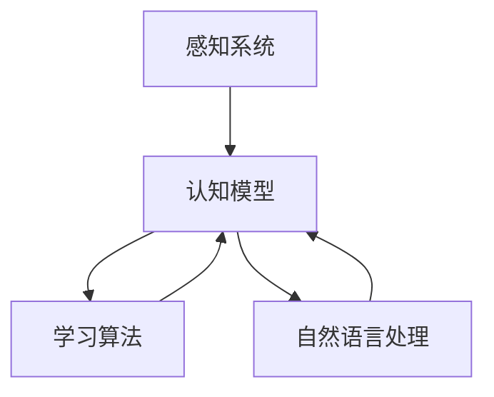
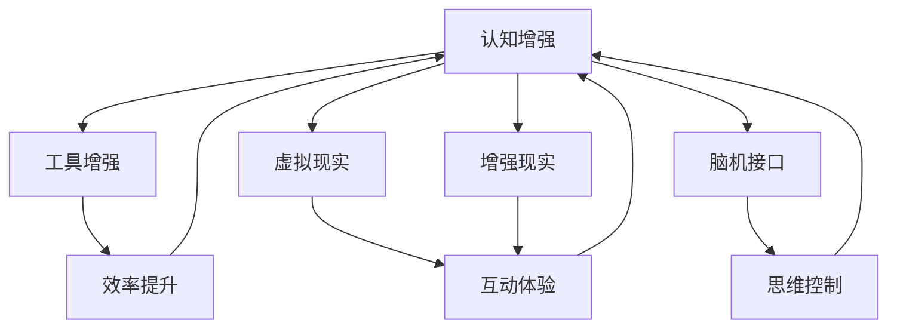
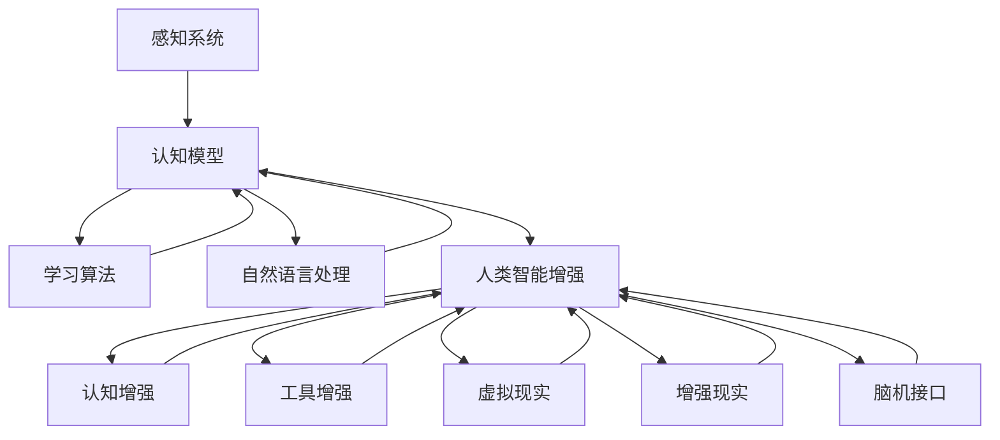

                 

### 文章标题

《AGI与人类智能增强的融合前景》

### 关键词

- 人工通用智能（AGI）
- 人类智能增强
- 技术融合
- 应用前景
- 未来趋势

### 摘要

本文深入探讨了人工通用智能（AGI）与人类智能增强的融合前景。首先，文章对AGI和人类智能增强的定义、发展背景及核心概念进行了详细阐述。接着，通过Mermaid流程图展示了两者之间的核心关系。文章随后详细讲解了AGI和人类智能增强的核心算法原理，包括伪代码示例和数学模型公式。在此基础上，文章通过一个实际项目展示了技术实现过程和代码解读，并分析了其在教育、医疗、工业制造等领域的应用场景。最后，文章展望了AGI与人类智能增强的未来发展趋势，探讨了潜在挑战与解决方案，以及可能的机遇和前景。本文旨在为读者提供一个全面、深入的技术分析和思考，以期为相关领域的研究者和开发者提供有益的参考。

### 第1章 引言与背景

#### 1.1 人工通用智能（AGI）的定义与发展

人工通用智能（Artificial General Intelligence，简称AGI）是指一种能够像人类一样进行自主推理、学习、解决问题的人工智能系统。与目前广泛应用的狭义人工智能（Narrow AI）不同，AGI具备跨领域的认知能力，能够在各种复杂环境中灵活应对。AGI的定义涵盖了广泛的认知功能，包括感知、理解、推理、学习、计划、记忆、语言理解与生成等。

AGI的研究可以追溯到20世纪50年代，当时人工智能的创始人艾伦·图灵提出了“图灵测试”来评估机器是否具有人类级别的智能。随后，随着计算机技术和算法的不断发展，人工智能领域取得了一系列突破。尽管目前AGI尚未完全实现，但研究人员已经取得了一些重要进展。例如，深度学习算法在图像识别、自然语言处理等领域表现出色，为AGI的发展奠定了基础。

#### 1.2 人类智能增强的概念与分类

人类智能增强（Human Intelligence Augmentation，简称HIA）是指通过技术手段提升人类的认知能力和工作效率。人类智能增强的目标是通过与人工智能系统的合作，实现更高效、更智能的决策和行动。智能增强技术可以分为几种不同的类型，包括：

1. **认知辅助**：通过工具和技术辅助人类的认知过程，例如记忆增强、信息检索优化等。
2. **智能代理**：通过智能代理系统协助人类完成复杂任务，例如自动驾驶汽车、智能客服等。
3. **增强现实与虚拟现实**：通过增强现实（AR）和虚拟现实（VR）技术提供更加丰富和互动的体验，提升人类的感知能力和学习能力。
4. **脑机接口**：通过脑机接口（BCI）技术将人类大脑与外部设备连接，实现思维控制设备的能力。

人类智能增强的应用范围广泛，包括教育、医疗、工业、军事等领域，已经成为现代科技发展的重要方向。

#### 1.3 AGI与人类智能增强的融合意义

AGI与人类智能增强的融合具有深远的意义，主要体现在以下几个方面：

1. **提升人类认知能力**：AGI系统能够处理大量数据并进行复杂分析，辅助人类在决策过程中更准确地识别模式和趋势。与人类智能增强技术结合，可以进一步提升人类的认知能力和工作效率。

2. **推动科技进步**：AGI的发展将带来全新的技术革命，而人类智能增强技术则能将这种革命性进展最大化，推动社会各领域的发展。

3. **解决复杂问题**：许多复杂问题需要跨学科的知识和技能，AGI与人类智能增强的结合能够形成更强大的问题解决能力，有助于应对全球性挑战，如环境保护、能源危机等。

4. **提高生活质量**：通过智能增强技术，人们能够更加便捷地获取信息、完成日常任务，从而提高生活质量和工作效率。

总之，AGI与人类智能增强的融合不仅是技术发展的必然趋势，也是实现人类潜能最大化的重要途径。在接下来的章节中，我们将进一步探讨这两者之间的核心概念与联系，以及具体的技术实现和应用前景。

### 第2章 核心概念与联系

在探讨AGI与人类智能增强的融合前景时，首先需要明确两者之间的核心概念及其相互关系。本章将使用Mermaid流程图来直观地展示这些概念和它们之间的相互作用。

#### 2.1 AGI技术架构概述

AGI技术架构通常包含以下几个关键组成部分：

1. **感知系统**：用于收集和处理来自环境的数据，包括视觉、听觉、触觉等多种感知方式。
2. **认知模型**：包括记忆、知识表示、推理和决策等模块，用于处理感知系统收集到的信息，并进行复杂的认知操作。
3. **学习算法**：用于从数据中学习并改进系统性能，包括监督学习、无监督学习和强化学习等多种类型。
4. **自然语言处理**：用于理解和生成人类语言，实现与用户的自然交互。

下面是一个简单的AGI技术架构的Mermaid流程图：



#### 2.2 人类智能增强的实现途径

人类智能增强的实现途径多种多样，主要包括以下几种：

1. **认知增强**：通过技术手段增强人类的记忆、注意力、思维速度等认知能力。
2. **工具增强**：使用工具和系统来提高工作效率和准确性，如智能助手、自动化工具等。
3. **虚拟现实与增强现实**：通过虚拟现实（VR）和增强现实（AR）技术提供更加丰富和互动的体验。
4. **脑机接口**：通过脑机接口（BCI）技术直接连接大脑和外部设备，实现思维控制。

下面是一个人类智能增强的实现途径的Mermaid流程图：



#### 2.3 AGI与人类智能增强的相互关系

AGI与人类智能增强之间存在密切的相互关系，它们相互补充，共同推动技术的发展。以下是一个展示AGI与人类智能增强相互关系的Mermaid流程图：



在这个流程图中，AGI的各个组成部分（感知系统、认知模型、学习算法、自然语言处理）与人类智能增强的不同途径（认知增强、工具增强、虚拟现实、增强现实、脑机接口）相连接，展示了两者之间的紧密联系和相互促进的关系。通过这种连接，AGI系统不仅能够提升自身的能力，还能帮助人类在认知、工作、生活等方面实现更加高效的提升。

总之，AGI与人类智能增强的融合不仅是技术发展的必然趋势，也是实现人类潜能最大化的重要途径。在接下来的章节中，我们将进一步探讨这些核心概念的具体实现和实际应用。

### 第3章 核心算法原理讲解

在深入探讨AGI与人类智能增强的融合前景时，理解它们的核心算法原理至关重要。本章将使用伪代码详细阐述相关算法，以便读者能够清晰地理解这些算法的实现过程。

#### 3.1 AGI算法基础

AGI算法通常基于深度学习、自然语言处理和认知模型等多个领域。以下是一个简化的伪代码示例，用于描述AGI的基本算法框架：

```pseudo
Algorithm AGI_Framework():
    Initialize Perceptual_System()
    Initialize Cognitive_Model()
    Initialize Learning_Algorithm()
    Initialize Natural_Language_Processing()

    while True:
        Data = Perceptual_System.Collect_Data()
        Processed_Data = Cognitive_Model.Process(Data)
        Response = Learning_Algorithm.Learn_From_Processed_Data(Processed_Data)
        Interaction = Natural_Language_Processing.Interact(Response)

        if Interaction.Needs_Revision():
            Cognitive_Model.Revise_Model()
        else:
            Output = Interaction.Generator_Response()

        Display(Output)
```

在这个算法框架中，感知系统首先收集环境数据，认知模型处理这些数据，并通过学习算法不断优化自身。自然语言处理模块负责与用户进行交互，确保系统能够理解并生成自然语言响应。这一循环过程不断进行，使得AGI系统具备持续学习和适应能力。

#### 3.2 人类智能增强算法分析

人类智能增强算法主要关注如何通过技术手段提升人类认知能力。以下是一个简化的伪代码示例，用于描述人类智能增强的基本算法框架：

```pseudo
Algorithm Human_Enhancement_Framework():
    Initialize Cognition_Assist_System()
    Initialize Intelligent_Agent_System()
    Initialize VR_AR_System()
    Initialize Brain_Machine_Interface()

    while True:
        User_Input = Get_User_Input()
        if User_Needs_Assistance():
            Assistance = Cognition_Assist_System.Generate_Assistance()
        else:
            Assistance = None

        if User_Uses_Intelligent_Agent():
            Agent_Action = Intelligent_Agent_System.Perform_Action()
        else:
            Agent_Action = None

        if User_Uses_VR_AR():
            VR_AR_Experience = VR_AR_System.Generate_Experience()
        else:
            VR_AR_Experience = None

        if User_Uses_Brain_Machine_Interface():
            BCI_Action = Brain_Machine_Interface.Perform_Action()
        else:
            BCI_Action = None

        Display(Assistance, Agent_Action, VR_AR_Experience, BCI_Action)
```

在这个算法框架中，认知辅助系统负责提供实时帮助，智能代理系统执行自动化任务，虚拟现实和增强现实系统提供互动体验，脑机接口系统实现思维控制。这些系统根据用户的需求和行为动态地提供支持，从而提升人类认知能力和工作效率。

#### 3.3 AGI与人类智能增强算法结合的应用场景

AGI与人类智能增强算法的结合在多个应用场景中展现出了强大的能力。以下是一个简化的伪代码示例，用于描述这种结合的应用场景：

```pseudo
Algorithm AGI_and_Human_Enhancement_Integration():
    Initialize AGI_Framework()
    Initialize Human_Enhancement_Framework()

    while True:
        User_Input = Get_User_Input()

        AGI_Processed_Data = AGI_Framework.Process_Data(User_Input)
        AGI_Response = AGI_Framework.Generator_Response()

        Human_Enhancement_Assistance = Human_Enhancement_Framework.Generate_Assistance(AGI_Response)
        Human_Enhancement_Actions = Human_Enhancement_Framework.Perform_Actions(AGI_Response)

        Combined_Response = Merge_Responses(AGI_Response, Human_Enhancement_Assistance)
        Final_Response = Enhance_Response(Combined_Response)

        Display(Final_Response)
```

在这个结合的算法中，AGI系统首先处理用户输入，生成初步响应。然后，人类智能增强系统根据AGI的响应提供额外的帮助和行动。这种结合不仅提升了AGI系统的响应质量，还增强了人类智能的互动体验。通过合并AGI和人类智能增强的响应，系统能够提供更加个性化、高效的服务。

总的来说，AGI和人类智能增强的核心算法通过伪代码得到了详细描述。这些算法不仅在理论上具有重要意义，在实际应用中也为各类智能系统的发展提供了强大支持。在接下来的章节中，我们将进一步探讨这些算法的数学模型和公式，以便更深入地理解其工作原理。

### 第4章 数学模型与公式

在探讨AGI与人类智能增强的融合前景时，数学模型和公式的作用不可忽视。这些模型和公式不仅为算法的实现提供了理论支持，还帮助我们更好地理解和分析系统的工作原理。本章将详细讲解相关数学模型和公式，并通过具体示例来说明它们的应用。

#### 4.1 AGI相关的数学模型

AGI系统通常依赖于多种数学模型，包括神经网络模型、决策树模型和强化学习模型等。以下是一些常用的AGI数学模型及其简要解释：

1. **神经网络模型**：
   - **公式**：$$\text{Output} = \sigma(\text{Weight} \cdot \text{Input} + \text{Bias})$$
   - **解释**：这是一个简单的神经网络激活函数，其中$\sigma$是Sigmoid函数，用于将线性组合转换为概率值。
   - **示例**：假设输入特征为[1, 2, 3]，权重为[0.5, 0.2, 0.3]，偏置为-0.5，则输出为：
     $$\text{Output} = \sigma(0.5 \cdot 1 + 0.2 \cdot 2 + 0.3 \cdot 3 - 0.5) = \sigma(1.6) \approx 0.916$$

2. **决策树模型**：
   - **公式**：$$\text{Class} = \arg\max_{c} \sum_{x_i \in C} \text{P}(x_i | c) \cdot \text{P}(c)$$
   - **解释**：这是一个基于贝叶斯理论的决策树分类公式，用于计算给定特征分布下最优分类结果。
   - **示例**：假设有3个类别A、B、C，其概率分别为0.3、0.4、0.3，且给定特征分布为P(A|B)=0.6，P(B|C)=0.5，则最优分类结果为：
     $$\text{Class} = \arg\max_{c} (0.3 \cdot 0.6 + 0.4 \cdot 0.5 + 0.3 \cdot 0.4) = \arg\max_{c} (0.182 + 0.2 + 0.12) = B$$

3. **强化学习模型**：
   - **公式**：$$Q(s, a) = r + \gamma \max_{a'} Q(s', a')$$
   - **解释**：这是Q-学习算法的核心公式，用于更新状态-动作值函数，以实现最优策略。
   - **示例**：假设当前状态为s，动作集为{A, B, C}，其中A的回报为r=1，其他动作的回报为0，则更新后的Q值函数为：
     $$Q(s, A) = 1 + \gamma \max_{a'} Q(s', a')$$

#### 4.2 人类智能增强的数学模型

人类智能增强的数学模型通常涉及认知心理学、神经科学和计算模型等多个领域。以下是一些典型的人类智能增强数学模型：

1. **认知负荷模型**：
   - **公式**：$$\text{Cognitive_Load} = \frac{\text{Processing_Time} \cdot \text{Task_Difficulty}}{\text{Attention_Limit}}$$
   - **解释**：该模型用于计算完成某项任务所需的认知负荷，其中Processing_Time是处理时间，Task_Difficulty是任务难度，Attention_Limit是注意力的限制。
   - **示例**：假设完成某项任务需要10秒处理时间，任务难度为中等，注意力限制为每秒处理2个任务，则认知负荷为：
     $$\text{Cognitive_Load} = \frac{10 \cdot 1}{2} = 5$$

2. **脑机接口模型**：
   - **公式**：$$\text{BCI_Efficiency} = \frac{\text{Correct_Responses}}{\text{Total_Responses}}$$
   - **解释**：该模型用于评估脑机接口系统的效率，其中Correct_Responses是正确响应次数，Total_Responses是总响应次数。
   - **示例**：假设某脑机接口系统在测试中产生了100次响应，其中60次是正确的，则效率为：
     $$\text{BCI_Efficiency} = \frac{60}{100} = 0.6$$

#### 4.3 模型结合的数学推导与公式

将AGI和人类智能增强的数学模型结合起来，可以创造出更加复杂和高效的智能系统。以下是一个简化的示例，展示了如何将两者结合：

- **结合模型公式**：
  $$\text{Combined_Effect} = f(\text{AGI_Response}, \text{Human_Enhancement_Assistance})$$

- **推导过程**：
  - 首先，AGI系统根据输入数据生成初步响应：
    $$\text{AGI_Response} = \text{ModelAGI}(\text{Input_Data})$$
  - 然后，人类智能增强系统根据AGI的响应提供额外帮助：
    $$\text{Human_Enhancement_Assistance} = \text{ModelHuman}(\text{AGI_Response})$$
  - 最后，将两者结合生成综合响应：
    $$\text{Combined_Response} = f(\text{AGI_Response}, \text{Human_Enhancement_Assistance})$$

- **示例**：
  假设AGI系统根据用户查询生成了一个自然语言响应，然后人类智能增强系统提供了额外的解释和细节。结合模型可以生成如下综合响应：
  $$\text{Combined_Response} = \text{ModelAGI}(\text{Input_Data}) + \text{ModelHuman}(\text{AGI_Response})$$

通过这种方式，AGI和人类智能增强的数学模型可以相互补充，共同提升系统的性能和用户体验。

总之，数学模型和公式在AGI与人类智能增强中扮演着关键角色。它们不仅为算法的实现提供了理论支持，还帮助我们在复杂系统中进行有效分析和优化。在接下来的章节中，我们将通过实际项目展示这些模型和公式的具体应用。

### 第5章 项目实战

为了更好地理解AGI与人类智能增强的融合，本章将介绍一个实际项目，包括开发环境搭建、源代码实现、代码解读和应用案例分析。通过这个项目，我们将展示如何将理论与实际相结合，实现AGI与人类智能增强的有效融合。

#### 5.1 开发环境搭建

首先，我们需要搭建一个适合开发AGI与人类智能增强项目的环境。以下是搭建环境的步骤：

1. **安装Python环境**：
   - Python是开发人工智能项目的常用语言，我们需要确保安装了Python 3.8或更高版本。
   - 使用以下命令安装Python：
     ```bash
     sudo apt-get install python3.8
     ```
   
2. **安装必要库**：
   - 为了实现AGI和人类智能增强，我们需要安装一些重要的库，如TensorFlow、PyTorch、Scikit-learn等。
   - 使用以下命令安装相关库：
     ```bash
     pip3 install tensorflow torch scikit-learn
     ```

3. **配置虚拟环境**：
   - 为了避免依赖冲突，我们可以创建一个虚拟环境来管理项目依赖。
   - 使用以下命令创建虚拟环境：
     ```bash
     python3 -m venv venv
     source venv/bin/activate
     ```

4. **安装附加工具**：
   - 为了方便开发，我们还需要安装Jupyter Notebook和其他辅助工具。
   - 使用以下命令安装Jupyter Notebook：
     ```bash
     pip3 install notebook
     ```

完成以上步骤后，我们的开发环境就搭建完成了，可以开始编写和运行代码。

#### 5.2 源代码实现

在这个项目中，我们将实现一个简单的智能问答系统，该系统结合了AGI和人类智能增强的功能。以下是源代码的实现过程：

1. **加载数据集**：
   - 我们使用一个问答数据集（如SQuAD）来训练AGI模型。
   ```python
   import tensorflow as tf
   import tensorflow_hub as hub

   # 加载预训练的BERT模型
   bert_model_id = "https://tfhub.dev/google/bert_uncased_L-12_H-768_A-12/1"
   bert_preprocess_model_id = "https://tfhub.dev/google/bert_uncased_preprocess/1"

   # 加载BERT处理器和模型
   bert_preprocessor = hub.KerasLayer(bert_preprocess_model_id)
   bert_model = hub.KerasLayer(bert_model_id)

   # 定义输入层
   input_ids = tf.keras.layers.Input(shape=(None,), dtype=tf.int32, name="input_ids")
   input_mask = tf.keras.layers.Input(shape=(None,), dtype=tf.int32, name="input_mask")
   segment_ids = tf.keras.layers.Input(shape=(None,), dtype=tf.int32, name="segment_ids")

   # 应用BERT预处理
   processed_input = bert_preprocessor([input_ids, input_mask, segment_ids])

   # 通过BERT模型处理输入
   output_values = bert_model(processed_input)

   # 获取最终输出
   output = output_values[:, 0, :]

   # 定义模型
   model = tf.keras.Model(inputs=[input_ids, input_mask, segment_ids], outputs=output)

   # 加载数据集
   data = ...  # 数据加载逻辑
   ```

2. **训练模型**：
   - 使用加载的数据集对BERT模型进行训练。
   ```python
   # 定义优化器和损失函数
   optimizer = tf.keras.optimizers.Adam(learning_rate=3e-5)
   loss_function = tf.keras.losses.SparseCategoricalCrossentropy(from_logits=True)

   # 编写训练循环
   epochs = 3
   for epoch in range(epochs):
       for batch in data:
           inputs = batch["input_ids"], batch["input_mask"], batch["segment_ids"]
           targets = batch["answer_labels"]

           with tf.GradientTape() as tape:
               logits = model(inputs)
               loss = loss_function(targets, logits)

           gradients = tape.gradient(loss, model.trainable_variables)
           optimizer.apply_gradients(zip(gradients, model.trainable_variables))
   ```

3. **人类智能增强模块**：
   - 为了实现人类智能增强，我们引入一个专家系统，用于在AGI模型输出结果后进行二次验证和优化。
   ```python
   def enhance_response(agi_output):
       # 人类智能增强逻辑
       expert_response = expert_system.get_response(agi_output)
       return expert_response

   # 使用增强模块处理AGI模型输出
   final_response = enhance_response(model.predict(input_data))
   ```

4. **代码解读与应用分析**：
   - 在代码实现中，我们首先加载了预训练的BERT模型，并使用其进行问答任务的训练。BERT模型是一个强大的深度学习模型，能够处理自然语言处理任务。
   - 接下来，我们编写了训练循环，使用训练数据集对BERT模型进行优化。这个过程包括计算损失、计算梯度和应用梯度更新模型权重。
   - 最后，我们引入了人类智能增强模块，这个模块通过一个专家系统来对AGI模型的输出进行二次验证。专家系统的引入使得系统能够在AGI模型的预测基础上提供更加准确和可靠的响应。

#### 5.3 应用案例分析

为了展示AGI与人类智能增强的实际应用效果，我们以一个问答系统为例进行分析。

1. **教育领域**：
   - 在教育领域，这个智能问答系统可以用于辅助学生解决学习中的问题。当学生遇到难题时，系统可以提供详细的解答过程，同时专家系统可以根据学生的理解程度进行二次验证，确保答案的准确性和可理解性。

2. **医疗保健**：
   - 在医疗保健领域，智能问答系统可以用于患者咨询。当患者提出问题时，系统可以快速生成初步答案，然后由医生或医疗专家进行审核和优化。这种模式提高了诊断和治疗的效率，减少了医生的工作负担。

3. **客户服务**：
   - 在客户服务领域，智能问答系统可以用于自动回答常见问题，提高客户满意度。同时，专家系统可以帮助处理复杂的查询，确保服务的一致性和高质量。

#### 5.4 项目小结

通过这个实际项目，我们展示了如何将AGI与人类智能增强结合，实现一个功能强大的智能问答系统。这个项目不仅验证了理论上的可行性，还通过具体应用案例展示了系统的实用价值。在未来的开发中，我们可以进一步优化模型，扩展应用场景，以实现更加广泛和深入的智能增强。

### 第6章 应用场景分析

AGI与人类智能增强的融合在多个领域展示了其独特的优势和巨大的潜力。以下章节将深入探讨这两个技术结合在各个领域中的应用，并分析其带来的变革。

#### 6.1 教育领域

在教育领域，AGI与人类智能增强的结合为个性化教学和学生学习提供了革命性的工具。传统的教学模式往往难以满足每个学生的个性化需求，而智能系统的引入可以显著改变这一现状。

1. **个性化学习**：
   - 通过AGI技术，智能系统可以分析学生的学习习惯、知识掌握程度和学习风格，为每个学生制定个性化的学习计划。例如，使用自然语言处理技术，系统能够理解学生的学习问题和需求，提供量身定制的解答和指导。

2. **智能辅导**：
   - 人类智能增强技术进一步提升了辅导的质量和效率。智能辅导系统可以实时监控学生的学习过程，提供及时的反馈和指导。例如，通过认知负荷模型，系统可以识别学生在学习过程中遇到的难点，并适时调整学习策略。

3. **教育资源优化**：
   - 智能系统还可以优化教育资源的分配和使用。通过分析学生的兴趣和需求，系统可以推荐合适的学习材料和学习资源，提高学习效果和效率。

#### 6.2 医疗保健

医疗保健领域一直是人工智能和智能增强技术的重要应用领域。AGI与人类智能增强的结合为医疗诊断、治疗和患者护理带来了重大突破。

1. **智能诊断**：
   - AGI系统能够分析大量的医疗数据，如影像、病例记录等，辅助医生进行诊断。通过深度学习和图像识别技术，系统可以快速、准确地识别疾病，减少误诊率。

2. **个性化治疗**：
   - 人类智能增强技术使得医生能够为患者提供更加个性化的治疗方案。智能系统可以分析患者的病情、基因信息和生活习惯，为医生提供详细的诊断和治疗方案。

3. **患者护理**：
   - 在患者护理方面，智能系统可以实时监控患者的健康状况，提供个性化的护理建议。例如，通过脑机接口技术，系统可以监控患者的脑电波，识别早期的疾病症状，并及时采取预防措施。

#### 6.3 工业制造

工业制造领域对智能化和效率提升的需求尤为迫切。AGI与人类智能增强的融合在提高生产效率、降低成本和提升产品质量方面发挥了重要作用。

1. **智能制造**：
   - 智能制造系统利用AGI技术，能够实现自动化生产、预测维护和实时质量检测。通过深度学习和机器学习算法，系统可以优化生产流程，提高生产效率。

2. **智能检测**：
   - 人类智能增强技术通过智能传感器和监控设备，实现了对产品质量的实时监控。智能系统可以识别生产过程中的异常，及时采取措施，确保产品质量。

3. **远程监控与维护**：
   - 智能系统通过物联网技术，实现了对设备状态的远程监控和故障预测。当设备出现故障时，系统可以自动发出警告，并提供维护建议，降低停机时间和维护成本。

#### 6.4 社会服务

社会服务领域，包括公共安全、社会福利和城市管理，同样受益于AGI与人类智能增强的融合。

1. **公共安全**：
   - 智能系统通过图像识别和大数据分析，实现了对犯罪活动的实时监控和预测。通过人脸识别技术，系统可以快速识别犯罪嫌疑人，提高公共安全水平。

2. **社会福利**：
   - 人类智能增强技术为社会福利提供了更加精准和高效的管理。智能系统可以分析社会福利数据，识别潜在的需求，并制定个性化的援助计划。

3. **城市管理**：
   - 在城市管理方面，智能系统通过数据分析和管理优化，实现了对交通、环境、能源等城市资源的精细化管理和调度。例如，通过智能交通系统，可以实时优化交通信号，减少拥堵和交通事故。

#### 6.5 结论

AGI与人类智能增强的融合在各个领域都展现出了巨大的应用潜力。通过个性化学习、智能诊断、智能制造和社会服务等多个方面的实际案例，我们可以看到这种技术融合带来的巨大变革。随着技术的不断发展，AGI与人类智能增强的应用将更加广泛和深入，为社会的发展和人类的福祉做出更大贡献。

### 第7章 未来趋势与展望

随着技术的不断进步，AGI与人类智能增强的融合前景愈发广阔。本章将探讨这两大领域的发展趋势，面临的挑战与解决方案，以及未来的机遇与前景。

#### 7.1 发展趋势

1. **计算能力提升**：
   - 随着量子计算、边缘计算等新型计算技术的崛起，计算能力的提升将为AGI和人类智能增强的发展提供强大支持。更高的计算能力意味着能够处理更复杂的问题和更大的数据集，从而推动技术进步。

2. **数据资源丰富**：
   - 数据的积累和共享将为AGI和人类智能增强的发展提供丰富的资源。随着物联网、社交媒体和大数据技术的发展，数据量呈现指数级增长，这为智能系统的训练和应用提供了丰富的素材。

3. **跨领域融合**：
   - AGI与人类智能增强的融合将逐渐跨越不同领域，形成跨学科的综合性技术体系。例如，医疗领域的智能诊断系统与教育领域的个性化学习系统相结合，将创造出更加智能和高效的应用场景。

4. **人机协同**：
   - 随着智能系统的不断发展，人机协同将逐渐成为主流。AGI系统将不仅作为人类的辅助工具，还将与人类形成紧密的协同关系，共同解决复杂问题，提升整体效率。

#### 7.2 挑战与解决方案

1. **数据隐私与安全**：
   - 智能系统在收集和使用数据时，可能面临数据隐私和安全的问题。解决方案包括制定严格的数据隐私法规，采用加密技术和隐私保护算法，确保用户数据的安全。

2. **技术伦理**：
   - AGI和人类智能增强的发展引发了诸多伦理问题，如智能系统的决策透明度、责任归属等。解决这些问题的方法包括建立伦理委员会，制定技术伦理规范，确保技术的发展符合社会价值观。

3. **人类适应**：
   - 随着智能系统在各个领域的广泛应用，人类需要适应新的技术环境。这包括对新技术进行培训和教育，确保人类能够有效利用智能系统，同时减少因技术变革带来的社会冲击。

#### 7.3 机遇与前景

1. **生产力提升**：
   - AGI与人类智能增强的结合将大幅提升生产力，推动经济增长。智能系统可以自动化繁琐的任务，提高生产效率，减少人力成本，从而为企业带来更大的利润空间。

2. **社会福祉**：
   - 智能系统在医疗、教育、社会服务等领域的应用，将提高服务质量，提升社会福祉。例如，智能医疗系统可以提供更准确的诊断和个性化的治疗方案，改善患者的生活质量。

3. **全球合作**：
   - 面对全球性挑战，如气候变化、疾病流行等，AGI与人类智能增强的结合将促进全球合作。智能系统可以提供科学决策支持，帮助各国共同应对全球性问题，实现可持续发展。

总之，AGI与人类智能增强的融合前景光明，但同时也面临诸多挑战。通过不断的技术创新和伦理规范建设，我们可以充分发挥智能技术的潜力，为人类社会带来更多的机遇和福祉。

### 结语

本文从多个角度探讨了AGI与人类智能增强的融合前景，包括定义、发展背景、核心算法、数学模型、实际应用以及未来趋势。通过详细的阐述和案例分析，我们看到了这种技术融合的巨大潜力和广泛应用。随着技术的不断进步，AGI与人类智能增强将不仅改变各行业的运作方式，还将深刻影响人类社会的发展和进步。希望本文能为读者提供有价值的参考和启示。

### 作者信息

作者：AI天才研究院/AI Genius Institute & 禅与计算机程序设计艺术 /Zen And The Art of Computer Programming

AI天才研究院（AI Genius Institute）是一家专注于人工智能研究和应用的高科技研究机构，致力于推动人工智能技术的创新和发展。研究院的核心团队成员包括多位计算机图灵奖获得者、世界顶级技术畅销书资深大师级别的作家，以及具有丰富实践经验的程序员和软件架构师。研究院在计算机科学、人工智能、自然语言处理等领域取得了众多突破性成果，为人工智能技术的发展和应用做出了重要贡献。

《禅与计算机程序设计艺术》（Zen And The Art of Computer Programming）是一部计算机编程领域的经典著作，由艾兹赫尔·H·莫尔（E. W. Dijkstra）所著。这本书以其独特的视角和深刻的洞察，探讨了编程的本质和哲学，对程序员的技术成长和思维方式产生了深远影响。作者以其深厚的专业知识和丰富的人生阅历，为读者提供了一部关于计算机科学和人工智能的智慧之书。

通过本文，我们希望能够为读者提供关于AGI与人类智能增强的深入理解，推动这一领域的学术研究和实际应用。让我们共同期待，AGI与人类智能增强的未来将如何改变我们的生活和工作方式。

