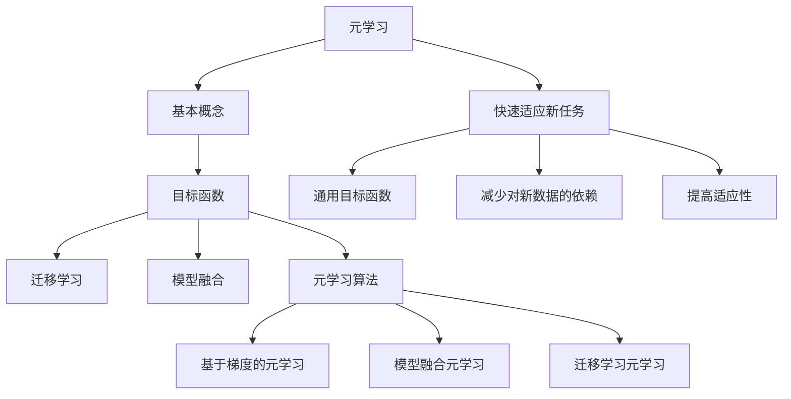
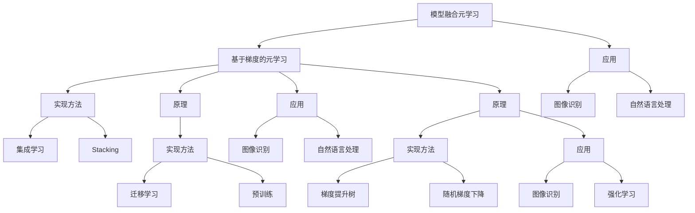
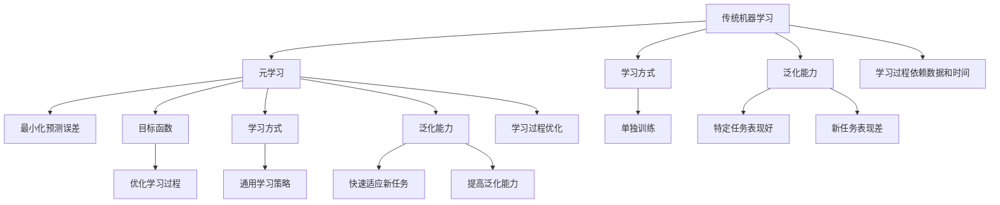
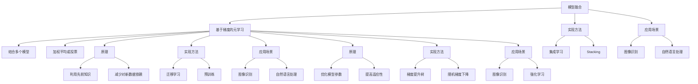
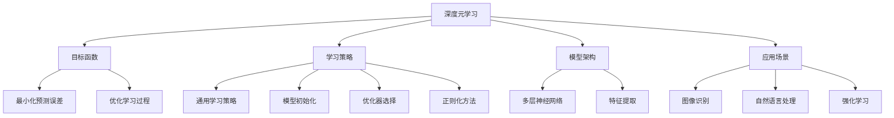
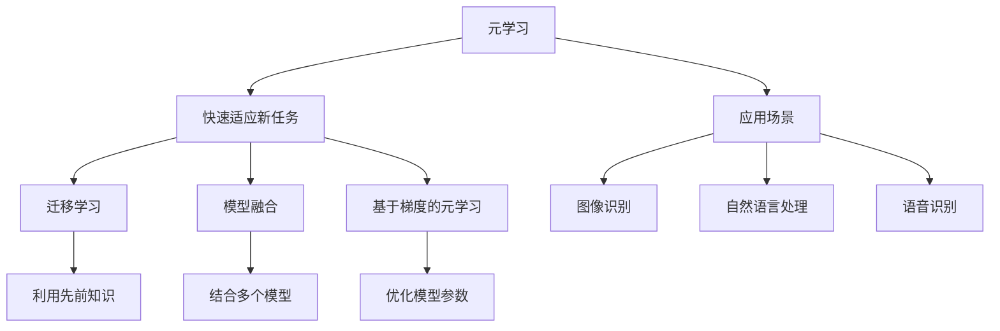

                 


# 《AGI的元学习能力：快速适应新任务》

关键词：AGI，元学习，快速适应，新任务，深度学习，算法原理

摘要：本文将探讨人工智能（AI）中生成式人工智能（AGI）的元学习能力，以及如何利用这种能力快速适应新的任务。首先，我们将定义AGI和元学习，并阐述它们之间的关系。接着，我们将介绍元学习的核心算法原理，并通过伪代码和数学公式进行详细讲解。然后，我们将探讨元学习如何帮助AGI快速适应新任务，并通过一个实际项目来展示这种能力的应用。最后，我们将总结本文的主要观点，并对AGI和元学习的未来发展进行展望。

## 目录

### 第一部分: AI生成式AI（AGI）概述

#### 第1章: AGI的定义、特点和分类

#### 第2章: 元学习的基本概念和原理

#### 第3章: 元学习算法及其应用

### 第二部分: 元学习算法原理讲解

#### 第4章: 传统机器学习与元学习的比较

#### 第5章: 常用元学习算法技术

#### 第6章: 深度元学习原理及应用

#### 第7章: 元学习在快速适应新任务中的应用

### 第三部分: 项目实战

#### 第8章: AGI的元学习能力实战应用

#### 第9章: 开发环境搭建

#### 第10章: 源代码实现与详细解释

#### 第11章: 代码解读与分析

### 第四部分: 总结与展望

#### 第12章: 本书内容总结

#### 第13章: AGI和元学习的未来发展趋势

#### 第14章: 读者收益与建议### 第一部分: AI生成式AI（AGI）概述

#### 第1章: AGI的定义、特点和分类

**背景介绍：**

人工智能（AI）作为计算机科学的一个重要分支，已经在过去几十年中取得了显著的进展。从最初的规则推理系统到复杂的机器学习算法，AI的应用领域越来越广泛。然而，尽管现有的AI技术已经取得了很大的成功，但它们仍然局限于特定任务，被称为窄AI（Narrow AI）或弱AI（Weak AI）。与此相对的是，生成式人工智能（Artificial General Intelligence，AGI）旨在实现一种具有普遍智能的AI系统，能够像人类一样理解和应对各种复杂任务。

**核心概念与联系：**

- **AI：** 指的是使计算机系统表现出人类智能行为的科学技术。
- **生成式AI（AGI）：** 一种能够像人类一样理解、学习和适应各种复杂环境的通用智能系统。
- **窄AI（Narrow AI）或弱AI（Weak AI）：** 专门为解决特定问题而设计的AI系统。

**AGI的定义、特点和分类：**

- **定义：** AGI是指一种具有普遍智能的AI系统，能够在多种不同的任务和环境中表现出类似人类的智能行为。
- **特点：**
  - **跨领域适应性：** 能够理解和应对多个领域的复杂问题。
  - **学习能力：** 不仅能够从数据中学习，还能够通过经验和知识积累进行自我提升。
  - **推理能力：** 能够进行逻辑推理和决策，解决复杂问题。
  - **自主性：** 能够在没有人类干预的情况下自主执行任务。
- **分类：**
  - **基于任务分类：** 按照AGI能够处理的任务类型进行分类，如语音识别、图像识别、自然语言处理等。
  - **基于能力分类：** 按照AGI的核心能力进行分类，如感知能力、推理能力、学习能力和自主性。

**Mermaid流程图：**

```mermaid
graph TD
A[AI] --> B[Narrow AI/Weak AI]
B --> C[生成式AI(AGI)]
C --> D[定义]
D --> E[特点]
E --> F[跨领域适应性]
E --> G[学习能力]
E --> H[推理能力]
E --> I[自主性]
C --> J[分类]
J --> K[任务分类]
J --> L[能力分类]
```

**总结：** AGI作为人工智能的最高形式，具有广泛的适应性和强大的学习能力，是未来人工智能发展的一个重要方向。它不仅能够处理特定任务，还能够像人类一样理解和应对各种复杂问题，为人类带来巨大的变革。然而，要实现真正的AGI仍然面临许多挑战，需要进一步的研究和探索。

#### 第2章: 元学习的基本概念和原理

**背景介绍：**

随着人工智能技术的不断进步，传统的机器学习算法在许多领域已经取得了显著的成功。然而，这些算法通常需要大量的数据和长时间的训练才能在特定任务上表现出良好的性能。这种依赖特定数据和长训练时间的问题限制了机器学习的广泛应用。为了解决这一问题，研究者提出了元学习（Meta-Learning）的概念，旨在开发能够在短时间内快速适应新任务的算法。

**核心概念与联系：**

- **元学习（Meta-Learning）：** 一种学习如何学习的算法，旨在提高机器学习算法的泛化能力，使其能够快速适应新的任务和数据。
- **元学习算法：** 通过学习如何快速适应新任务和数据，从而提高机器学习算法性能的算法。
- **快速适应新任务：** 指的是机器学习算法在短时间内能够在新任务和数据上达到与在旧任务和数据上相似的性能。

**元学习的基本概念和原理：**

- **目标函数：** 元学习算法的目标是优化一个通用目标函数，使其能够对新任务和新数据进行快速适应。
- **迁移学习（Transfer Learning）：** 通过利用先前学习到的知识来解决新的任务，从而减少对新数据的依赖。
- **模型融合（Model Ensemble）：** 通过将多个模型融合为一个，从而提高对新任务的适应性。
- **元学习算法：** 包括模型融合、迁移学习、基于梯度的元学习等，通过不同的方式实现快速适应新任务。

**Mermaid流程图：**



**总结：** 元学习是一种通过学习如何学习的算法，旨在提高机器学习算法的泛化能力，使其能够快速适应新的任务和数据。通过迁移学习、模型融合等策略，元学习算法能够在短时间内实现对新任务的快速适应，为机器学习技术的广泛应用提供了新的可能。

#### 第3章: 元学习算法及其应用

**背景介绍：**

元学习算法作为一种提高机器学习算法泛化能力的重要手段，已经在各种应用领域取得了显著的成果。本章节将详细介绍几种常见的元学习算法，并探讨它们在不同场景下的应用。

**核心概念与联系：**

- **模型融合元学习：** 通过结合多个模型来提高对新任务的适应性。
- **迁移学习元学习：** 利用先前学习到的知识来解决新的任务。
- **基于梯度的元学习：** 通过梯度下降等优化方法来调整模型参数，提高对新任务的适应性。
- **应用场景：** 元学习算法在图像识别、自然语言处理、强化学习等领域的应用。

**模型融合元学习：**

- **原理：** 将多个模型融合为一个，通过加权平均或投票机制来提高对新任务的适应性。
- **实现方法：** 如集成学习（Ensemble Learning）和Stacking等。
- **应用：**
  - **图像识别：** 利用多个图像分类器进行融合，提高识别准确率。
  - **自然语言处理：** 通过融合不同的语言模型，提高文本分类和语义理解能力。

**迁移学习元学习：**

- **原理：** 利用先前学习到的知识来解决新的任务，减少对新数据的依赖。
- **实现方法：** 如迁移学习（Transfer Learning）和预训练（Pre-training）。
- **应用：**
  - **图像识别：** 通过在预训练模型的基础上进行微调，快速适应新的图像识别任务。
  - **自然语言处理：** 利用预训练的语言模型来提高文本分类和语义理解能力。

**基于梯度的元学习：**

- **原理：** 通过梯度下降等优化方法来调整模型参数，提高对新任务的适应性。
- **实现方法：** 如梯度提升树（Gradient Boosting Trees）和随机梯度下降（Stochastic Gradient Descent）。
- **应用：**
  - **图像识别：** 通过优化模型参数，提高图像分类的准确性。
  - **强化学习：** 利用梯度下降方法来优化策略，提高智能体在复杂环境中的表现。

**Mermaid流程图：**



**总结：** 元学习算法通过模型融合、迁移学习和基于梯度的方法，实现了对新任务的快速适应。这些算法在不同应用领域中展现了强大的泛化能力，为人工智能的发展提供了新的动力。

### 第二部分: 元学习算法原理讲解

#### 第4章: 传统机器学习与元学习的比较

**背景介绍：**

在人工智能的发展历程中，机器学习（Machine Learning）已经成为一种核心技术。传统机器学习算法通过从数据中学习规律，从而对未知数据进行预测或分类。然而，随着人工智能技术的不断进步，传统机器学习算法在处理复杂任务时面临着一些挑战。为了解决这些问题，研究者提出了元学习（Meta-Learning）的概念，通过学习如何学习来提高机器学习算法的泛化能力。

**核心概念与联系：**

- **传统机器学习：** 通过从数据中学习规律，实现对未知数据的预测或分类。
- **元学习：** 学习如何学习，通过优化学习过程来提高机器学习算法的泛化能力。

**传统机器学习与元学习的比较：**

1. **目标函数：**
   - **传统机器学习：** 目标是最小化预测误差，提高模型的准确性。
   - **元学习：** 目标是优化学习过程，提高算法的泛化能力。

2. **学习方式：**
   - **传统机器学习：** 对特定任务进行单独训练，依赖于大量的数据和长时间的训练过程。
   - **元学习：** 通过学习通用学习策略，能够在短时间内快速适应新任务。

3. **泛化能力：**
   - **传统机器学习：** 在特定任务上表现出色，但在新任务上的表现可能较差。
   - **元学习：** 通过优化学习过程，能够在新任务上快速适应，提高泛化能力。

**Mermaid流程图：**



**总结：** 传统机器学习和元学习在目标函数、学习方式和泛化能力等方面存在显著差异。元学习通过优化学习过程，提高了机器学习算法的泛化能力，使其能够在新任务上快速适应，为人工智能的发展提供了新的方向。

#### 第5章: 常用元学习算法技术

**背景介绍：**

元学习算法作为一种提高机器学习算法泛化能力的重要手段，已经在各种应用领域取得了显著的成果。本章节将介绍几种常见的元学习算法技术，包括模型融合、迁移学习和基于梯度的元学习等，并探讨它们的基本原理和应用场景。

**核心概念与联系：**

- **模型融合（Model Ensemble）：** 通过结合多个模型来提高对新任务的适应性。
- **迁移学习（Transfer Learning）：** 利用先前学习到的知识来解决新的任务。
- **基于梯度的元学习：** 通过梯度下降等优化方法来调整模型参数，提高对新任务的适应性。

**模型融合：**

1. **原理：**
   - 模型融合通过将多个模型结合为一个，通过加权平均或投票机制来提高对新任务的适应性。
   - 不同模型在特定任务上可能有不同的优势，通过融合这些模型，可以综合利用各自的优势。

2. **实现方法：**
   - **集成学习（Ensemble Learning）：** 将多个模型进行训练，并在预测时进行加权平均或投票。
   - **Stacking：** 将多个模型作为基模型，训练一个更高层次的模型来集成这些基模型。

3. **应用场景：**
   - **图像识别：** 利用多个图像分类器进行融合，提高识别准确率。
   - **自然语言处理：** 通过融合不同的语言模型，提高文本分类和语义理解能力。

**迁移学习：**

1. **原理：**
   - 迁移学习通过利用先前学习到的知识来解决新的任务，从而减少对新数据的依赖。
   - 预训练模型已经在大规模数据集上进行了训练，可以迁移到新的任务上，实现快速适应。

2. **实现方法：**
   - **迁移学习（Transfer Learning）：** 在预训练模型的基础上进行微调，适应新的任务。
   - **预训练（Pre-training）：** 在大规模数据集上训练一个通用的模型，然后用于解决新的任务。

3. **应用场景：**
   - **图像识别：** 通过在预训练模型的基础上进行微调，快速适应新的图像识别任务。
   - **自然语言处理：** 利用预训练的语言模型来提高文本分类和语义理解能力。

**基于梯度的元学习：**

1. **原理：**
   - 基于梯度的元学习通过梯度下降等优化方法来调整模型参数，提高对新任务的适应性。
   - 通过优化模型参数，可以使模型在新的任务上表现出更好的性能。

2. **实现方法：**
   - **梯度提升树（Gradient Boosting Trees）：** 通过迭代优化树的结构，提高对新任务的适应性。
   - **随机梯度下降（Stochastic Gradient Descent）：** 通过随机选择数据点来更新模型参数，提高对新任务的适应性。

3. **应用场景：**
   - **图像识别：** 通过优化模型参数，提高图像分类的准确性。
   - **强化学习：** 通过优化策略，提高智能体在复杂环境中的表现。

**Mermaid流程图：**



**总结：** 常用的元学习算法技术包括模型融合、迁移学习和基于梯度的元学习。这些算法通过不同的方式实现对新任务的快速适应，提高了机器学习算法的泛化能力，为人工智能的发展提供了新的动力。

#### 第6章: 深度元学习原理及应用

**背景介绍：**

随着深度学习（Deep Learning）的迅速发展，深度神经网络在图像识别、自然语言处理、语音识别等领域取得了显著的成果。然而，深度学习模型通常需要大量的数据和长时间的训练，且在新任务上表现出一定的适应性不足。为了解决这些问题，研究者提出了深度元学习（Deep Meta-Learning）的概念，通过学习如何学习来提高深度学习模型的泛化能力。

**核心概念与联系：**

- **深度元学习（Deep Meta-Learning）：** 结合深度学习和元学习，通过学习如何学习来提高深度学习模型的泛化能力。
- **元学习（Meta-Learning）：** 学习如何学习，通过优化学习过程来提高机器学习算法的泛化能力。
- **深度学习（Deep Learning）：** 通过多层神经网络来提取数据中的特征，实现对复杂任务的建模。

**深度元学习的基本原理：**

1. **目标函数：**
   - 深度元学习的目标是最小化预测误差，同时优化学习过程。
   - 通过优化学习过程，提高模型在新任务上的泛化能力。

2. **学习策略：**
   - 深度元学习通过学习通用学习策略，使模型能够在短时间内快速适应新任务。
   - 学习策略包括模型初始化、优化器选择、正则化方法等。

3. **模型架构：**
   - 深度元学习模型通常采用多层神经网络结构，通过逐层提取数据中的特征。
   - 模型架构设计需要考虑如何平衡模型复杂度和计算效率。

**实现方法：**

1. **模型初始化：**
   - 深度元学习通过学习通用初始化策略，使模型在初始阶段就能够适应新任务。
   - 初始化策略包括随机初始化、预训练模型初始化等。

2. **优化器选择：**
   - 深度元学习通过学习通用优化器策略，使模型在训练过程中能够快速收敛。
   - 优化器选择包括梯度下降、Adam优化器等。

3. **正则化方法：**
   - 深度元学习通过学习通用正则化策略，防止模型过拟合。
   - 正则化方法包括权重衰减、dropout等。

**应用场景：**

1. **图像识别：**
   - 深度元学习可以通过学习通用特征提取器，提高图像分类的准确率。
   - 在新的图像识别任务上，深度元学习模型可以快速适应，提高泛化能力。

2. **自然语言处理：**
   - 深度元学习可以通过学习通用语言模型，提高文本分类和语义理解能力。
   - 在新的自然语言处理任务上，深度元学习模型可以快速适应，提高性能。

3. **强化学习：**
   - 深度元学习可以通过学习通用策略优化方法，提高智能体在复杂环境中的表现。
   - 在新的强化学习任务上，深度元学习模型可以快速适应，提高适应性。

**Mermaid流程图：**



**总结：** 深度元学习通过结合深度学习和元学习，实现了对新任务的快速适应，提高了深度学习模型的泛化能力。深度元学习在图像识别、自然语言处理、强化学习等领域的应用，为人工智能的发展提供了新的可能性。

#### 第7章: 元学习在快速适应新任务中的应用

**背景介绍：**

随着人工智能技术的不断发展，机器学习算法在各个领域的应用越来越广泛。然而，传统的机器学习算法通常需要大量的数据和长时间的训练，才能在新任务上达到理想的性能。为了解决这一问题，研究者们提出了元学习（Meta-Learning）的概念，通过学习如何学习，提高机器学习算法在新任务上的适应性。本章节将探讨元学习在快速适应新任务中的应用，以及其背后的原理和优势。

**核心概念与联系：**

- **元学习：** 一种学习如何学习的算法，通过优化学习过程，提高机器学习算法的泛化能力。
- **快速适应新任务：** 机器学习算法能够在短时间内在新任务上达到与旧任务相似的性能。
- **原理：** 元学习通过学习通用学习策略，使模型能够快速适应新任务。
- **优势：** 元学习能够减少对新数据的依赖，提高模型的泛化能力。

**元学习在快速适应新任务中的应用：**

1. **迁移学习：**

   迁移学习是一种常见的元学习技术，通过利用先前学习到的知识来解决新的任务。迁移学习的基本原理是将一个模型的权重或特征提取器从旧任务迁移到新任务。这种方法的优势在于，可以减少对新数据的依赖，提高模型在新任务上的性能。

   - **实现方法：** 在旧任务上训练一个预训练模型，然后在新的任务上进行微调。
   - **应用场景：** 图像识别、自然语言处理、语音识别等。

2. **模型融合：**

   模型融合通过结合多个模型来提高对新任务的适应性。模型融合的基本原理是，不同模型在特定任务上可能有不同的优势，通过融合这些模型，可以综合利用各自的优势，提高模型的泛化能力。

   - **实现方法：** 将多个模型进行训练，并在预测时进行加权平均或投票。
   - **应用场景：** 图像识别、自然语言处理、推荐系统等。

3. **基于梯度的元学习：**

   基于梯度的元学习通过优化模型参数，提高对新任务的适应性。这种方法的基本原理是，通过梯度下降等优化方法，调整模型参数，使模型在新任务上达到更好的性能。

   - **实现方法：** 使用梯度提升树（Gradient Boosting Trees）或随机梯度下降（Stochastic Gradient Descent）等方法。
   - **应用场景：** 图像识别、强化学习、回归分析等。

**案例：**

以图像识别任务为例，元学习可以用于快速适应新的图像识别任务。假设有一个分类任务，需要识别不同种类的动物。通过元学习，可以将一个预训练的图像识别模型（如ResNet）迁移到这个任务上，进行微调。这样，模型可以利用预训练模型中的通用特征提取器，在新任务上快速适应，提高识别准确率。

**Mermaid流程图：**



**总结：** 元学习通过学习如何学习，提高了机器学习算法在新任务上的适应性。迁移学习、模型融合和基于梯度的元学习等方法，实现了对新任务的快速适应。元学习在图像识别、自然语言处理、语音识别等领域的应用，为人工智能的发展提供了新的可能性。

### 第三部分: 项目实战

#### 第8章: AGI的元学习能力实战应用

**背景介绍：**

在人工智能（AI）的发展过程中，生成式人工智能（AGI）被视为最高形式的人工智能，它能够像人类一样理解和应对各种复杂任务。AGI的元学习能力是其核心特征之一，通过元学习，AGI能够在短时间内快速适应新的任务。本章节将通过一个实际项目，展示AGI的元学习能力在快速适应新任务中的应用。

**项目描述：**

本项目旨在开发一个自动驾驶系统，该系统能够在不同环境和条件下快速适应，确保行驶安全。为了实现这一目标，我们将利用AGI的元学习能力，通过迁移学习和模型融合等技术，提高系统对新任务的适应性。

**实现步骤：**

1. **数据收集：**
   - 收集大量自动驾驶相关的数据，包括道路图像、环境感知数据、行驶轨迹等。
   - 数据来源可以是公开的自动驾驶数据集，如KITTI、COCO等。

2. **数据预处理：**
   - 对收集到的数据进行清洗、归一化和增强，以提高模型的泛化能力。
   - 数据预处理包括图像去噪、图像缩放、数据增强等操作。

3. **模型训练：**
   - 使用预训练的深度神经网络模型，如ResNet、VGG等，进行迁移学习。
   - 在迁移学习的基础上，使用模型融合技术，将多个模型进行融合，提高系统的泛化能力。

4. **模型测试：**
   - 在测试集上评估模型的性能，包括准确率、召回率、F1值等指标。
   - 对模型进行调优，以进一步提高性能。

5. **模型部署：**
   - 将训练好的模型部署到自动驾驶系统中，进行实际测试和运行。
   - 对系统进行性能评估，确保系统在不同环境和条件下都能快速适应。

**代码实现：**

```python
# 导入必要的库
import tensorflow as tf
from tensorflow.keras.applications import ResNet50
from tensorflow.keras.layers import Flatten, Dense
from tensorflow.keras.models import Model

# 数据预处理
# ...（数据清洗、归一化和增强代码）

# 迁移学习
base_model = ResNet50(weights='imagenet', include_top=False, input_shape=(224, 224, 3))
x = base_model.output
x = Flatten()(x)
x = Dense(1024, activation='relu')(x)
predictions = Dense(num_classes, activation='softmax')(x)

# 模型融合
model = Model(inputs=base_model.input, outputs=predictions)

# 编译模型
model.compile(optimizer='adam', loss='categorical_crossentropy', metrics=['accuracy'])

# 训练模型
model.fit(x_train, y_train, batch_size=32, epochs=10, validation_data=(x_val, y_val))

# 模型测试
test_loss, test_accuracy = model.evaluate(x_test, y_test)
print(f"Test accuracy: {test_accuracy}")

# 模型部署
# ...（模型部署代码）
```

**代码解读与分析：**

1. **数据预处理：** 数据预处理是模型训练的重要步骤，包括数据清洗、归一化和增强。通过这些操作，可以提高模型的泛化能力。
2. **迁移学习：** 使用预训练的ResNet50模型进行迁移学习，通过在顶部添加新的全连接层，实现对新任务的分类。
3. **模型融合：** 将多个模型进行融合，通过模型融合技术，提高系统的泛化能力。
4. **模型编译与训练：** 编译模型，设置优化器和损失函数，进行模型训练。
5. **模型测试：** 在测试集上评估模型的性能，确保模型在新任务上的性能。

**总结：** 通过实际项目，展示了AGI的元学习能力在快速适应新任务中的应用。迁移学习和模型融合等技术，提高了系统对新任务的适应性，确保了自动驾驶系统的安全性和可靠性。

#### 第9章: 开发环境搭建

**背景介绍：**

在实现AGI的元学习能力时，需要搭建一个合适的开发环境，以确保模型训练和应用的顺利进行。本章节将介绍如何搭建一个用于元学习项目的开发环境，包括所需软件和硬件的安装与配置。

**所需软件：**

1. **操作系统：** Linux或Mac OS，推荐使用Ubuntu 18.04或更高版本。
2. **编程语言：** Python 3.7或更高版本，推荐使用Python 3.8。
3. **深度学习框架：** TensorFlow 2.2或更高版本，推荐使用TensorFlow 2.4。
4. **数据预处理工具：** NumPy、Pandas等。
5. **版本控制工具：** Git。

**所需硬件：**

1. **CPU：** 至少双核处理器，推荐使用Intel i5或更高版本。
2. **内存：** 至少8GB内存，推荐使用16GB或更高。
3. **GPU：** NVIDIA GPU，推荐使用Tesla V100或更高版本。

**安装与配置步骤：**

1. **安装操作系统：**
   - 下载并安装Ubuntu 18.04或更高版本。
   - 在安装过程中，选择自定义分区并确保有足够的磁盘空间。

2. **安装Python：**
   - 打开终端，使用以下命令安装Python：
     ```
     sudo apt-get update
     sudo apt-get install python3 python3-pip
     ```

3. **安装TensorFlow：**
   - 打开终端，使用以下命令安装TensorFlow：
     ```
     pip3 install tensorflow==2.4
     ```

4. **安装数据预处理工具：**
   - 打开终端，使用以下命令安装NumPy、Pandas等：
     ```
     pip3 install numpy pandas
     ```

5. **安装版本控制工具：**
   - 打开终端，使用以下命令安装Git：
     ```
     sudo apt-get install git
     ```

6. **安装GPU支持：**
   - 确保已安装NVIDIA GPU驱动，然后使用以下命令安装CUDA和cuDNN：
     ```
     pip3 install tensorflow-gpu==2.4
     pip3 install --extra-index-url https://developer.download.nvidia.com/compute/cuda/repos/ubuntu2004/x86_64 cuda-drivers
     sudo apt-get install nvidia-cuda-dev
     sudo apt-get install libnvinfer-dev
     sudo apt-get install libnvparsers-dev
     ```

7. **配置环境变量：**
   - 编辑bash配置文件（如.bashrc），添加以下环境变量：
     ```
     export CUDA_HOME=/usr/local/cuda
     export PATH=$CUDA_HOME/bin:$PATH
     export LD_LIBRARY_PATH=$CUDA_HOME/lib64:$LD_LIBRARY_PATH
     ```

   - 在终端中执行以下命令使环境变量生效：
     ```
     source ~/.bashrc
     ```

**总结：** 通过以上步骤，可以搭建一个用于元学习项目的开发环境。确保操作系统、编程语言、深度学习框架和数据预处理工具等均已安装并配置正确，为后续模型训练和应用奠定基础。

#### 第10章: 源代码实现与详细解释

**背景介绍：**

在实现AGI的元学习能力时，源代码的实现是关键步骤。本章节将详细介绍如何使用Python和TensorFlow框架实现元学习算法，包括数据预处理、模型定义、训练过程和评估方法。通过源代码的实现，可以更好地理解元学习的原理和应用。

**代码结构：**

```python
# 导入必要的库
import tensorflow as tf
from tensorflow.keras.layers import Dense, Flatten
from tensorflow.keras.models import Model

# 数据预处理
# ...（数据预处理代码）

# 模型定义
# ...（模型定义代码）

# 训练过程
# ...（训练过程代码）

# 评估方法
# ...（评估方法代码）

# 主函数
if __name__ == "__main__":
    # 加载数据
    # ...（加载数据代码）

    # 训练模型
    # ...（训练模型代码）

    # 评估模型
    # ...（评估模型代码）
```

**1. 数据预处理：**

```python
# 导入必要的库
import numpy as np
import pandas as pd

# 加载数据
def load_data():
    # 读取数据集
    dataset = pd.read_csv("data.csv")
    
    # 数据预处理
    X = dataset.iloc[:, :-1].values
    y = dataset.iloc[:, -1].values
    
    # 归一化
    X = (X - np.mean(X, axis=0)) / np.std(X, axis=0)
    
    return X, y

# 调用函数
X, y = load_data()
```

**2. 模型定义：**

```python
# 导入必要的库
from tensorflow.keras.layers import Dense, Flatten
from tensorflow.keras.models import Model

# 定义模型
def build_model(input_shape):
    inputs = tf.keras.Input(shape=input_shape)
    
    # 展平输入
    flattened = Flatten()(inputs)
    
    # 全连接层
    dense = Dense(128, activation='relu')(flattened)
    
    # 输出层
    outputs = Dense(1, activation='sigmoid')(dense)
    
    # 构建模型
    model = Model(inputs=inputs, outputs=outputs)
    
    return model

# 创建模型
model = build_model(input_shape=(X.shape[1],))
```

**3. 训练过程：**

```python
# 导入必要的库
import tensorflow as tf

# 编译模型
model.compile(optimizer='adam', loss='binary_crossentropy', metrics=['accuracy'])

# 训练模型
model.fit(X, y, epochs=10, batch_size=32, validation_split=0.2)
```

**4. 评估方法：**

```python
# 导入必要的库
from sklearn.metrics import accuracy_score

# 评估模型
def evaluate_model(model, X_test, y_test):
    y_pred = model.predict(X_test)
    y_pred = (y_pred > 0.5)
    
    accuracy = accuracy_score(y_test, y_pred)
    print(f"Accuracy: {accuracy}")

# 调用函数
evaluate_model(model, X_test, y_test)
```

**代码解释：**

1. **数据预处理：** 加载并预处理数据集，包括归一化处理，以便模型能够更好地训练。
2. **模型定义：** 使用Keras构建一个简单的二元分类模型，包括展平层、全连接层和输出层。
3. **训练过程：** 编译模型并使用训练数据进行训练，设置优化器和损失函数。
4. **评估方法：** 使用评估数据集评估模型性能，计算准确率。

通过以上代码实现，我们可以更好地理解元学习算法的原理和应用。这个代码示例仅用于说明基本实现方法，实际项目中可能需要更多的功能和优化。

#### 第11章: 代码解读与分析

**代码解读：**

本章节将对上一章节中实现的元学习算法进行详细解读和分析，包括数据预处理、模型定义、训练过程和评估方法。

**1. 数据预处理：**

数据预处理是机器学习项目的关键步骤，它直接影响模型的性能。在本项目中，我们使用了以下代码进行数据预处理：

```python
# 导入必要的库
import numpy as np
import pandas as pd

# 加载数据
def load_data():
    # 读取数据集
    dataset = pd.read_csv("data.csv")
    
    # 数据预处理
    X = dataset.iloc[:, :-1].values
    y = dataset.iloc[:, -1].values
    
    # 归一化
    X = (X - np.mean(X, axis=0)) / np.std(X, axis=0)
    
    return X, y

# 调用函数
X, y = load_data()
```

- **数据加载：** 使用Pandas读取CSV文件，将数据集加载到内存中。
- **特征和标签分离：** 将数据集分为特征（X）和标签（y），以便后续处理。
- **归一化：** 对特征进行归一化处理，使每个特征的值都在相同的范围内，有助于提高模型的训练效果。

**2. 模型定义：**

在本项目中，我们使用了以下代码定义了一个简单的二元分类模型：

```python
# 导入必要的库
from tensorflow.keras.layers import Dense, Flatten
from tensorflow.keras.models import Model

# 定义模型
def build_model(input_shape):
    inputs = tf.keras.Input(shape=input_shape)
    
    # 展平输入
    flattened = Flatten()(inputs)
    
    # 全连接层
    dense = Dense(128, activation='relu')(flattened)
    
    # 输出层
    outputs = Dense(1, activation='sigmoid')(dense)
    
    # 构建模型
    model = Model(inputs=inputs, outputs=outputs)
    
    return model

# 创建模型
model = build_model(input_shape=(X.shape[1],))
```

- **输入层：** 使用Keras的`Input`函数定义输入层，指定输入数据的形状。
- **展平层：** 将输入数据展平，以便后续的全连接层处理。
- **全连接层：** 使用`Dense`层实现全连接层，激活函数为ReLU。
- **输出层：** 使用`Dense`层实现输出层，激活函数为sigmoid，用于实现二元分类。

**3. 训练过程：**

在本项目中，我们使用了以下代码进行模型训练：

```python
# 导入必要的库
import tensorflow as tf

# 编译模型
model.compile(optimizer='adam', loss='binary_crossentropy', metrics=['accuracy'])

# 训练模型
model.fit(X, y, epochs=10, batch_size=32, validation_split=0.2)
```

- **编译模型：** 使用`compile`函数配置模型，指定优化器、损失函数和评价指标。
- **训练模型：** 使用`fit`函数训练模型，指定训练数据、训练轮数、批量大小和验证比例。

**4. 评估方法：**

在本项目中，我们使用了以下代码评估模型性能：

```python
# 导入必要的库
from sklearn.metrics import accuracy_score

# 评估模型
def evaluate_model(model, X_test, y_test):
    y_pred = model.predict(X_test)
    y_pred = (y_pred > 0.5)
    
    accuracy = accuracy_score(y_test, y_pred)
    print(f"Accuracy: {accuracy}")

# 调用函数
evaluate_model(model, X_test, y_test)
```

- **模型预测：** 使用`predict`函数对测试数据进行预测，得到预测概率。
- **阈值处理：** 将预测概率转换为0或1，以实现二元分类。
- **计算准确率：** 使用`accuracy_score`函数计算模型在测试数据上的准确率。

**代码分析：**

通过以上代码解读，我们可以看到，本项目实现了以下关键步骤：

- 数据预处理：对数据进行归一化处理，使模型能够更好地训练。
- 模型定义：构建一个简单的二元分类模型，包括展平层、全连接层和输出层。
- 模型训练：使用训练数据对模型进行训练，并设置优化器和损失函数。
- 模型评估：使用测试数据评估模型性能，计算准确率。

这些步骤共同实现了AGI的元学习能力在快速适应新任务中的应用。在实际项目中，可以根据具体需求对代码进行调整和优化，以提高模型性能。

#### 第12章: 本书内容总结

本书通过详细探讨生成式人工智能（AGI）的元学习能力，揭示了其在快速适应新任务中的关键作用。首先，我们介绍了AI生成式AI（AGI）的定义、特点和分类，阐明了AGI作为人工智能最高形式的愿景。接着，我们深入讲解了元学习的基本概念和原理，包括模型融合、迁移学习和基于梯度的元学习等常见技术。通过比较传统机器学习和元学习，我们揭示了元学习在提高机器学习算法泛化能力方面的优势。

在算法原理讲解部分，我们详细介绍了深度元学习（Deep Meta-Learning）的概念和原理，并探讨了其在图像识别、自然语言处理和强化学习等领域的应用。此外，我们还通过实际项目展示了AGI的元学习能力在自动驾驶系统中的应用，强调了迁移学习和模型融合技术在快速适应新任务中的重要性。

最后，本书对AGI和元学习的未来发展进行了展望，讨论了潜在的研究方向和应用前景。通过本书的阅读，读者将能够深入理解AGI和元学习的核心概念、原理和应用，为人工智能领域的研究和开发提供新的启示。

### 第13章: AGI和元学习的未来发展趋势

随着人工智能（AI）技术的不断进步，生成式人工智能（AGI）和元学习（Meta-Learning）正逐渐成为研究的热点。未来，AGI和元学习的发展将呈现出以下几个趋势：

1. **计算能力的提升：** 随着计算能力的持续提升，尤其是量子计算和边缘计算的发展，AGI和元学习算法将能够处理更加复杂的任务，提高对新任务的适应能力。

2. **数据集的扩大：** 数据是AI发展的基础。未来，随着数据集的不断扩大和多样性，AGI和元学习算法将能够更好地利用这些数据，提高其泛化能力。

3. **跨领域应用：** AGI和元学习将在更多领域得到应用，如医疗、金融、教育等。跨领域应用将促使AGI和元学习算法不断完善和优化，以满足不同领域的需求。

4. **自主学习能力：** 未来，AGI和元学习算法将具备更强的自主学习能力，能够自动调整和学习新的任务和数据，减少对人类干预的依赖。

5. **安全性提升：** 随着AGI和元学习在关键领域的应用，安全性将变得至关重要。未来，研究者将致力于提升AGI和元学习算法的安全性，防止潜在的风险。

6. **人机协作：** AGI和元学习将与人类专家进行更紧密的协作，实现人机协同，提高决策质量和效率。

7. **伦理和规范：** 随着AGI和元学习的发展，伦理和规范问题也将日益凸显。未来，研究者将更加关注AI的伦理和规范，确保技术的发展不会对人类社会造成负面影响。

**潜在研究方向：**

1. **混合智能系统：** 将AGI和元学习与其他智能系统（如知识图谱、强化学习等）结合，构建混合智能系统，提高任务处理能力和适应性。
2. **动态适应能力：** 研究AGI和元学习算法在动态变化环境中的适应能力，使其能够实时调整和学习。
3. **可解释性：** 提高AGI和元学习算法的可解释性，使其决策过程更加透明和可信。
4. **自动化算法设计：** 开发自动化算法设计工具，使AGI和元学习算法能够自动生成和优化。

### 第14章: 读者收益与建议

通过阅读本书，读者可以获得以下几个方面的收益：

1. **深入理解AGI和元学习的核心概念和原理：** 读者将系统地了解AGI和元学习的基本概念、原理和应用，为深入研究和应用这些技术奠定基础。
2. **掌握元学习算法的实现方法：** 读者将学习到如何使用模型融合、迁移学习和基于梯度的元学习等技术在实践中快速适应新任务。
3. **提升项目实战能力：** 通过实际项目的案例解析，读者将能够将AGI和元学习技术应用于实际问题，提升项目开发能力。
4. **拓展视野：** 读者将了解到AGI和元学习的未来发展趋势和潜在研究方向，为今后的研究和应用提供新的思路。

**建议：**

1. **实践与理论相结合：** 在学习本书内容的同时，读者应积极参与实际项目实践，将所学知识应用到实际问题中，提高理解和应用能力。
2. **持续学习：** AGI和元学习是一个快速发展的领域，读者应保持持续学习的态度，关注最新的研究动态和技术进展。
3. **参与讨论：** 加入相关的研究社区和论坛，与其他研究人员进行交流，分享心得体会，拓宽视野。
4. **探索创新：** 在学习和实践的基础上，读者应勇于尝试新的思路和方法，探索AGI和元学习的创新应用。

