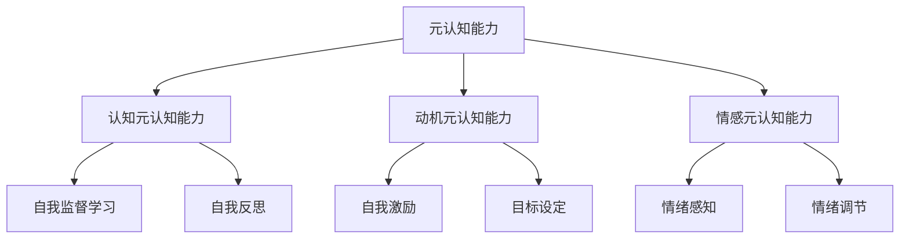

                 


### 1. 确定书的结构

首先，我们需要对这本书的内容进行深入理解，并根据书名《AGI的元认知能力：自我监控与学习调节》来确定其结构。通过分析书名，我们可以看出这本书主要关注三个核心概念：AGI、元认知能力以及自我监控与学习调节。因此，我们可以将书的内容分为以下几个部分：

**引言**：介绍书籍的背景、目的和重要性，为后续内容奠定基础。

**AGI概述**：介绍人工通用智能（AGI）的定义、核心特征和发展历程。

**元认知能力**：详细探讨元认知能力的定义、分类及其在AGI中的应用。

**自我监控**：讨论自我监控的概念、原理和方法，以及其在AGI中的应用。

**学习调节**：阐述学习调节的概念、原理和方法，以及其在AGI中的应用。

**案例分析**：通过具体案例，分析元认知能力、自我监控与学习调节在实际应用中的效果。

**总结与展望**：总结全书内容，对AGI的元认知能力、自我监控与学习调节的发展趋势进行展望。

### 2. 构建大纲框架

在确定了书的结构后，我们需要构建一个大纲框架。这个框架将包括1级、2级和3级标题，以便于读者清晰地了解文章的结构和内容。

**1级标题**：根据书的结构，我们确定了以下几个1级标题：

- 引言
- AGI概述
- 元认知能力
- 自我监控
- 学习调节
- 案例分析
- 总结与展望

**2级标题**：在1级标题的基础上，我们进一步细化为2级标题，以便于更深入地探讨每个主题。

- 引言：书籍概述、AGI与元认知能力、自我监控与学习调节的关系、本书结构安排
- AGI概述：AGI的定义与历史发展、AGI的核心特征、AGI与通用智能的关系、AGI的实现挑战
- 元认知能力：元认知能力的定义与分类、认知元认知能力、动机元认知能力、情感元认知能力
- 自我监控：自我监控的概念与原理、自我监控的方法与技术、自我监控在AGI中的应用
- 学习调节：学习调节的概念与原理、学习调节的方法与技术、学习调节在AGI中的应用
- 案例分析：案例选择与概述、案例分析
- 总结与展望：书籍总结、AGI的元认知能力、自我监控与学习调节的发展趋势、未来研究方向、对AGI发展的启示

**3级标题**：在2级标题的基础上，我们进一步细化为3级标题，以便于更详细地阐述每个子主题。

例如，在“元认知能力”这一部分，我们可以细化为：

- 认知元认知能力：自我监督学习、自我反思
- 动机元认知能力：自我激励、目标设定
- 情感元认知能力：情绪感知、情绪调节

### 3. 细化每个部分

在构建了初步的大纲框架后，我们需要对每个部分进行细化。这意味着我们需要进一步确定每个章节的具体内容，以便读者能够更好地理解。

对于每个部分，我们可以按照以下步骤进行：

1. **确定核心概念**：首先，我们需要明确每个部分的核心概念，例如“AGI”、“元认知能力”、“自我监控”和“学习调节”。
2. **分析相关内容**：然后，我们需要分析每个核心概念的相关内容，例如AGI的定义、核心特征、历史发展；元认知能力的分类、认知元认知能力、动机元认知能力和情感元认知能力；自我监控的概念、原理和方法；学习调节的概念、原理和方法。
3. **构建子部分**：在确定了核心概念和相关内容后，我们可以将这些内容进一步细化为子部分，例如在“AGI概述”中，我们可以细化为AGI的定义与历史发展、AGI的核心特征、AGI与通用智能的关系、AGI的实现挑战。

### 4. 添加核心概念与联系

在每个章节中，我们需要添加核心概念与联系的Mermaid流程图，以便读者更好地理解。这可以通过以下步骤实现：

1. **确定核心概念**：首先，我们需要确定每个章节的核心概念。
2. **分析概念关系**：然后，我们需要分析这些核心概念之间的关系。
3. **绘制流程图**：使用Mermaid语法，绘制出这些核心概念及其关系的流程图。

例如，在“元认知能力”这一章节，我们可以绘制如下流程图：



### 5. 添加核心算法原理讲解

在涉及算法的部分，我们需要使用伪代码进行详细阐述。这可以通过以下步骤实现：

1. **确定算法**：首先，我们需要确定需要讲解的算法。
2. **分析算法原理**：然后，我们需要分析算法的原理。
3. **编写伪代码**：使用伪代码，将算法的实现步骤详细阐述。

例如，对于自我监督学习的算法，我们可以编写如下伪代码：

```plaintext
算法：自我监督学习

输入：训练数据集、模型参数

输出：优化后的模型参数

步骤：
1. 初始化模型参数
2. 对于每个训练样本：
    a. 使用当前模型参数生成预测结果
    b. 计算预测结果与真实结果的误差
    c. 更新模型参数
3. 返回优化后的模型参数
```

### 6. 添加数学模型和数学公式

在涉及数学模型的部分，我们需要使用latex格式进行详细讲解。这可以通过以下步骤实现：

1. **确定数学模型**：首先，我们需要确定需要讲解的数学模型。
2. **分析模型原理**：然后，我们需要分析模型的原理。
3. **编写latex公式**：使用latex格式，将模型的关键公式详细阐述。

例如，对于学习速率调整的数学模型，我们可以编写如下latex公式：

```latex
\begin{equation}
    \eta_t = \frac{\eta}{1 + \alpha t}
\end{equation}
```

其中，\(\eta_t\) 表示第\(t\)次迭代的 learning rate，\(\eta\) 表示初始的 learning rate，\(\alpha\) 表示调整系数。

### 7. 添加项目实战

在每个部分，我们需要提供一个实际案例，详细解释代码实现过程。这可以通过以下步骤实现：

1. **选择案例**：首先，我们需要选择一个合适的案例。
2. **搭建开发环境**：然后，我们需要搭建案例所需的开发环境。
3. **实现代码**：接着，我们需要编写案例的源代码，并对其进行详细解读。
4. **分析与应用**：最后，我们需要对案例的应用场景进行分析，并给出详细讲解。

例如，我们可以选择一个基于深度学习的图像分类案例，详细解释如何搭建开发环境、实现代码、分析应用场景等。

### 8. 审查与修改

最后，我们需要对整个目录大纲进行审查，确保其逻辑清晰、内容完整，并进行必要的修改。这可以通过以下步骤实现：

1. **审查逻辑**：首先，我们需要审查整个目录大纲的逻辑是否清晰。
2. **审查内容**：然后，我们需要审查每个章节的内容是否完整、具体。
3. **审查公式和代码**：接着，我们需要审查每个章节中的公式和代码是否正确、易于理解。
4. **修改与完善**：最后，我们需要根据审查的结果，对目录大纲进行修改和完善，确保其质量。

通过上述步骤，我们可以构建一个逻辑清晰、内容完整、深入浅出的《AGI的元认知能力：自我监控与学习调节》目录大纲，为后续文章的撰写打下坚实基础。


### 1.1.1 简介与背景

人工通用智能（AGI，Artificial General Intelligence）是人工智能领域的一个宏伟目标，旨在创造具有类似人类智能的机器。与当前的人工智能（AI）系统不同，AGI不仅能在特定任务上表现出色，还能跨越多种任务和领域，展现出类似于人类的智能。AGI的概念最早可以追溯到20世纪50年代，当时人工智能领域的前辈们提出了“机器能够执行任何智能任务”的设想。

然而，随着技术的发展，AGI的实现面临着巨大的挑战。首先，人类的智能是一个复杂且高度适应的系统，涉及认知、情感、动机等多个方面。要复制这样的智能，AGI需要具备广泛的知识、灵活的推理能力、自我学习和适应能力。其次，AGI的实现需要突破当前计算技术和算法的限制，发展出更高效、更智能的计算模型。

在过去的几十年中，尽管AI领域取得了显著进展，例如在图像识别、自然语言处理和游戏等领域取得了突破性成果，但离实现AGI的目标还有很长的路要走。本章节将详细介绍AGI的定义、核心特征、历史发展以及当前面临的挑战，为后续内容的讨论奠定基础。

### 1.1.2 AGI的定义

人工通用智能（AGI）的定义有多种，但其核心都是围绕一个目标：构建一个能够像人类一样在多个领域表现出卓越智能的机器。根据人工智能专家侯世达（Douglas Hofstadter）的观点，AGI是一个能够执行任何人类智能任务的机器，不仅包括逻辑推理、数学运算、语言理解等认知任务，还包括社交互动、情感表达、创造力等更复杂的智能行为。

另一种流行的定义来自AI研究专家斯坦利·巴布鲁斯基（Stuart Russell）和皮埃罗·皮埃罗·托雷利（Peter Norvig），他们认为AGI是一个能够在任何知识领域内具有高水平的认知能力的机器。这个定义强调了AGI需要具备广泛的知识储备和灵活的推理能力，能够在不同领域内进行自主学习和适应。

总的来说，AGI的定义强调了其通用性和智能水平，旨在创造一个超越当前特定人工智能系统的机器智能。

### 1.1.3 AGI的核心特征

AGI的核心特征可以概括为以下几个方面：

**1. 广泛的知识和认知能力**：AGI需要具备广泛的知识储备，不仅包括具体的事实信息，还需要具备推理、归纳、演绎等高级认知能力。这意味着AGI不仅能够理解并处理特定领域的知识，还能够跨领域进行知识整合和应用。

**2. 自主学习和适应能力**：AGI需要具备自我学习和适应能力，能够在不同的环境和任务中自主调整自己的行为。这种能力要求AGI不仅能够从数据中学习，还能够从经验中学习，并在不断变化的环境中保持稳定的表现。

**3. 推理和决策能力**：AGI需要具备高效的推理和决策能力，能够在复杂和不确定的环境中做出合理的决策。这要求AGI不仅能够进行逻辑推理，还需要具备处理不确定性、情感和价值观的能力。

**4. 社交和情感智能**：AGI需要具备社交和情感智能，能够理解并表达情感，进行有效的社交互动。这意味着AGI需要具备情感感知、情感表达和情感调节能力，以适应复杂的人际关系和社会环境。

**5. 创造力和想象力**：AGI需要具备创造力和想象力，能够在新的情境下提出创新的想法和解决方案。这要求AGI不仅能够从已有知识中进行推理，还需要具备从无到有的创造能力。

这些核心特征共同构成了AGI的智能基础，使其能够在多个领域表现出卓越的能力。

### 1.1.4 AGI与通用智能的关系

AGI与通用智能（AGI，Artificial General Intelligence）之间存在密切的联系和区别。通用智能是指一个智能系统能够在广泛的领域和任务中表现出类似人类的智能水平。通用智能的核心在于系统的灵活性和适应性，它不仅能在特定的任务上表现出色，还能在新的、未遇到的任务中展示出高效的智能表现。

AGI与通用智能的关系可以看作是部分与整体的关系。AGI是通用智能的一个子集，但具有更高的智能水平和更广泛的应用范围。具体来说，AGI旨在实现一个能够在多个领域内具有高水平的认知能力的机器，而通用智能则关注系统在广泛领域中的表现。

一方面，通用智能是实现AGI的必要条件。如果一个智能系统无法在多个领域内展示出通用智能，那么它很难成为真正的AGI。另一方面，AGI则是对通用智能的进一步扩展和提升，它不仅要求系统具备通用智能，还需要在自我学习、推理、决策、社交和情感智能等方面达到更高水平。

总的来说，通用智能是AGI的基础和前提，而AGI则是通用智能的发展方向和目标。两者共同构成了人工智能领域的一个宏伟愿景，推动着人工智能技术的发展和进步。

### 1.1.5 AGI的实现挑战

尽管AGI是一个极具吸引力的目标，但要实现这一目标面临着诸多挑战。以下是AGI实现过程中面临的一些主要挑战：

**1. 计算能力限制**：目前的计算技术还无法完全支持AGI的实现。虽然计算机性能在不断提高，但要模拟人类大脑的复杂性和规模，现有的计算资源仍然有限。例如，人类大脑包含大约860亿个神经元，每个神经元都有数以千计的连接。要实现这样的计算规模和复杂性，需要更高效的算法和计算架构。

**2. 数据和知识获取**：AGI需要大量的数据和信息来进行学习和训练。然而，获取和处理这些数据是一项具有挑战性的任务。首先，数据来源可能有限，且数据质量参差不齐。其次，处理海量数据需要高效的算法和计算资源。此外，AGI还需要获取广泛的知识，这不仅仅是事实信息，还包括推理、归纳、演绎等认知能力。这要求系统具备高效的知识获取和整合能力。

**3. 算法和模型限制**：当前的AI算法和模型在特定任务上表现出色，但在实现通用智能方面存在明显不足。例如，深度学习模型在图像识别和自然语言处理等领域取得了显著进展，但它们在处理复杂推理和情感表达方面仍显不足。此外，当前的算法和模型主要依赖于大量的数据和预训练，这使得它们在面对新任务和未知环境时表现不佳。

**4. 社会和伦理挑战**：AGI的实现还面临着社会和伦理方面的挑战。首先，AGI可能会对就业市场产生重大影响，可能导致大量职位被自动化取代。其次，AGI的决策过程可能涉及到隐私和道德问题，例如在医疗、金融和法律等领域。此外，如何确保AGI的行为符合人类的价值观和道德标准也是一个重要问题。

**5. 系统稳定性和安全性**：AGI系统需要具备高度稳定性和安全性，以确保其行为可控和可靠。然而，当前AI系统的复杂性和不确定性使得它们在运行过程中可能产生不可预测的行为。例如，AI系统可能因为微小错误而导致严重的安全事故。因此，如何确保AGI系统的稳定性和安全性是一个重要挑战。

总之，尽管AGI的实现面临着诸多挑战，但随着技术的不断进步和研究的深入，我们有望在未来逐步克服这些困难，实现一个具有通用智能的AI系统。

### 1.1.6 历史发展

人工通用智能（AGI）的发展历程可以追溯到20世纪中期，当时人工智能领域刚刚兴起。早期的研究主要集中在符号推理和逻辑编程上，这一时期的代表性工作包括艾伦·图灵（Alan Turing）提出的图灵测试，以及约翰·麦卡锡（John McCarthy）等人工智能先驱所进行的早期探索。

1960年代和1970年代，人工智能领域经历了第一次“人工智能寒冬”。这一时期，符号推理和逻辑编程方法在处理复杂任务时表现不佳，导致资金和研究支持减少。然而，这一时期的研究为后来的AI发展奠定了基础，特别是在知识表示、问题解决和专家系统方面取得了重要进展。

1980年代和1990年代，随着计算机硬件性能的提高和算法的进步，人工智能领域迎来了新的发展机遇。特别是专家系统的应用取得了显著成果，这些系统能够在特定领域内提供高质量的决策支持。这一时期，神经网络和机器学习的研究也开始逐渐成熟，为AGI的实现提供了新的思路。

21世纪初，随着大数据和深度学习的兴起，人工智能领域再次进入快速发展阶段。深度学习在图像识别、自然语言处理和语音识别等任务上取得了突破性成果，显示出强大的通用智能潜力。这一时期的代表性工作包括谷歌的AlphaGo在围棋比赛中的胜利，以及OpenAI开发的GPT-3等大型语言模型。

总的来说，AGI的发展历程充满了曲折和挑战，但也取得了显著的进展。未来，随着技术的不断进步和研究的深入，我们有望在实现AGI的道路上迈出更大的步伐。

### 1.2.1 元认知能力的定义与分类

元认知能力（Metacognitive Ability）是指个体对自身认知过程进行认知和监控的能力，包括对认知过程的了解、评估、调节和控制。元认知能力不仅涉及对认知活动的认知，还包括对认知活动的目的、过程和结果的反思。元认知能力是智能的重要组成部分，对个体在学习、解决问题和决策过程中起到关键作用。

根据不同的标准，元认知能力可以分为多种类型：

**1. 根据元认知活动的功能分类**：

- **监控（Monitoring）**：指在认知活动进行时，个体能够注意到自己的认知过程和表现，例如在阅读时注意到自己的注意力是否集中，或者在进行数学计算时检查自己的计算步骤。

- **调节（Regulation）**：指个体根据监控到的信息，对认知活动进行调整和改进。例如，在学习新知识时，如果发现理解困难，个体可能会选择改变学习策略，如通过更多的练习或寻求他人的帮助。

- **计划（Planning）**：指在认知活动开始前，个体对认知过程进行规划和组织，设定目标和制定策略。例如，在学习新课程前，学生可能会制定学习计划，确定每天的学习内容和时间。

- **评估（Evaluation）**：指在认知活动结束后，个体对认知活动的效果进行评估，例如通过考试或自我反思来评估学习效果。

**2. 根据认知过程的维度分类**：

- **认知元认知能力**：涉及对认知过程的认知，包括对认知活动的理解、监控和调节。例如，学生理解自己学习过程中的难点，并通过调整学习策略来克服这些难点。

- **动机元认知能力**：涉及对学习动机的认知和调节，包括设定学习目标、维持学习动力和克服学习困难。例如，学生可能会设定短期和长期的学习目标，以维持学习的动力。

- **情感元认知能力**：涉及对情感体验的认知和调节，包括理解和管理情感反应。例如，在学习过程中，学生可能会通过深呼吸或冥想来调节自己的情绪，以保持专注。

这些分类方法有助于我们更深入地理解元认知能力的结构和功能，为研究和实践提供指导。

### 1.2.2 认知元认知能力

认知元认知能力（Cognitive Metacognitive Ability）是元认知能力的重要组成部分，它涉及对认知过程的认知、监控和调节。认知元认知能力使个体能够更好地理解自己的认知过程，从而提高学习效率和问题解决能力。

**1. 自我监督学习**

自我监督学习（Self-supervised Learning）是指个体在学习和认知过程中，通过自我监控和反馈来调节学习过程。这种能力使个体能够在没有外部监督的情况下，评估自己的认知表现，并做出相应的调整。

自我监督学习的核心在于个体能够识别自己的认知错误，并采取有效的措施来纠正这些错误。例如，在学习数学时，学生可以通过自我检查计算过程来发现错误，并重新计算以确保准确性。自我监督学习不仅有助于提高学习效果，还能培养个体的自我反思和自我调节能力。

**2. 自我反思**

自我反思（Self-reflection）是指个体在认知活动结束后，对整个过程进行回顾和反思。通过自我反思，个体能够理解自己的认知过程，识别成功和失败的原因，并总结经验教训。

自我反思的过程包括以下几个步骤：

- **回顾**：个体回顾整个认知过程，思考自己在学习或解决问题中的表现。

- **识别**：个体识别自己在认知过程中的优点和不足，例如理解困难、注意力不集中等。

- **分析**：个体分析失败的原因，思考如何改进学习策略和方法。

- **总结**：个体总结反思结果，制定改进计划，并在未来的认知活动中加以实施。

自我反思有助于个体建立正确的认知模式，提高学习效率，并在面对新的挑战时更好地应对。

### 1.2.3 动机元认知能力

动机元认知能力（Motivational Metacognitive Ability）是指个体在认知活动中对动机的认知和调节能力。动机元认知能力对于维持学习动力、克服学习困难和实现学习目标至关重要。

**1. 自我激励**

自我激励（Self-motivation）是指个体在认知活动中，通过自我设定目标和奖励机制来激发学习动力。自我激励的过程包括以下几个步骤：

- **设定目标**：个体设定明确的学习目标，这些目标应当具有挑战性但又能实现。

- **自我奖励**：个体在达成目标后，给自己设定奖励，以增强学习动力。这些奖励可以是对自己的肯定、休息时间或小礼物等。

- **自我反馈**：个体在学习过程中，通过自我反馈来调整学习策略，以保持动力和效率。

自我激励不仅能够提高学习效率，还能培养个体的自律性和自我管理能力。

**2. 目标设定**

目标设定（Goal Setting）是指个体在认知活动前，通过设定明确的目标来指导学习过程。有效的目标设定应具备以下几个特点：

- **明确性**：目标应具体、清晰，避免模糊和抽象。

- **挑战性**：目标应具有一定的挑战性，但又是可实现的，避免过于简单或困难。

- **可测量性**：目标应能够量化或评估，以便个体能够了解自己的进展。

- **灵活性**：目标应具有一定的灵活性，允许个体在实现过程中进行调整。

目标设定有助于个体集中注意力、明确学习方向，并在面对困难和挑战时保持动力。

### 1.2.4 情感元认知能力

情感元认知能力（Affective Metacognitive Ability）是指个体在认知活动中对情感的认知和调节能力。情感元认知能力对于维持情绪稳定、提高学习效率和促进心理健康具有重要意义。

**1. 情绪感知**

情绪感知（Emotional Perception）是指个体能够识别和理解自己的情绪状态，以及他人的情绪表达。情绪感知的过程包括以下几个步骤：

- **自我情绪识别**：个体通过身体感觉、思维和情感反应来识别自己的情绪状态。

- **情绪分类**：个体将情绪分类为愉悦或不愉悦、积极或消极等。

- **情绪理解**：个体理解情绪的含义和原因，例如为什么感到焦虑或快乐。

情绪感知有助于个体更好地理解自己的情感状态，从而采取有效的调节策略。

**2. 情绪调节**

情绪调节（Emotional Regulation）是指个体在认知活动中，通过认知和行为策略来调节情绪，以维持情绪稳定和提高认知效率。情绪调节的方法包括：

- **认知重构**：通过改变对事件的认识和解释来调节情绪。例如，将失败的情境视为学习机会而非打击。

- **情绪表达**：通过适当的方式表达情绪，例如与朋友或家人交流。

- **情绪转移**：通过参与其他活动或将注意力转移到其他事物上来缓解负面情绪。

情绪调节有助于个体在认知活动中保持积极情绪，从而提高学习效率和心理健康。

### 1.3 自我监控的概念与原理

自我监控（Self-monitoring）是指个体在认知活动中，对自己行为、情感和认知过程的认知、评估和调节。自我监控是一种元认知能力，它使个体能够主动识别和纠正认知错误，调节情绪，并优化学习策略。自我监控在个体的学习和问题解决过程中起到关键作用。

**1. 自我监控的过程**

自我监控的过程包括以下几个关键步骤：

- **自我注意**：个体在认知活动中，对自己的行为、情感和认知过程保持高度关注。这种自我注意有助于个体及时发现认知偏差和情绪波动。

- **自我评估**：个体对自身行为、情感和认知过程进行评估，识别存在的问题和不足。例如，在学习时，个体可能会评估自己的学习策略是否有效，或者自己的情绪状态是否稳定。

- **自我反馈**：个体基于自我评估的结果，给予自我反馈。这种反馈可以是积极的，如“做得很好”，也可以是消极的，如“需要改进”。自我反馈有助于个体了解自己的表现，并为后续行为提供指导。

- **自我调节**：个体根据自我反馈，调整自己的行为、情感和认知过程，以优化学习和问题解决效果。例如，如果个体发现自己在学习中注意力不集中，可能会采取休息或改变学习环境等措施来提高专注度。

**2. 自我监控的类型**

自我监控可以分为以下几种类型：

- **外部自我监控**：个体通过外部反馈来监控自己的行为和认知过程。这种类型主要依赖于他人的评价和反馈，例如教师、同伴或评估工具。

- **内部自我监控**：个体通过内部认知过程来监控自己的行为和认知过程。这种类型主要依赖于个体的自我意识和自我反思能力。

- **过程自我监控**：个体在认知活动进行过程中，实时监控和调节自己的行为和认知过程。这种类型有助于个体及时发现和纠正错误，提高学习效率。

- **结果自我监控**：个体在认知活动结束后，对行为和认知过程进行回顾和评估。这种类型有助于个体总结经验教训，为未来的学习和问题解决提供参考。

**3. 自我监控的方法**

自我监控的方法包括以下几种：

- **自我提问**：个体通过自我提问来引导自我监控。例如，在学习时，个体可以问自己：“我理解了这个概念吗？”“我是否按照计划进行了学习？”等问题。

- **日记记录**：个体通过记录日记来跟踪自己的学习和行为过程。这种类型有助于个体回顾和反思自己的认知活动，发现问题和改进策略。

- **反思性思考**：个体在认知活动结束后，通过反思性思考来评估自己的行为和认知过程。这种类型有助于个体总结经验教训，提高自我监控能力。

- **自我反馈**：个体通过自我反馈来调节自己的行为和认知过程。这种类型有助于个体了解自己的表现，并为后续行为提供指导。

自我监控是一种重要的元认知能力，它对个体的学习和问题解决过程具有深远影响。通过有效的自我监控，个体能够更好地识别和纠正认知错误，调节情绪，并优化学习策略，从而提高学习效果和问题解决能力。

### 1.4 自我监控的方法与技术

自我监控在个体的认知和学习过程中发挥着关键作用。为了更有效地实现自我监控，我们可以采用一系列方法和技术。以下是几种常用的自我监控方法和技术：

**1. 内部反馈技术**

内部反馈技术是指个体通过内部认知过程来监控自己的行为和认知状态。这种方法主要包括自我观察和自我反思。

- **自我观察**：个体在认知活动进行时，通过自我观察来监控自己的行为和思维过程。例如，在学习过程中，个体可以注意到自己的注意力是否集中，思维是否连贯。

- **自我反思**：个体在认知活动结束后，通过反思来评估自己的行为和认知过程。这种反思可以包括对成功和失败的学习经历进行总结，找出原因，并制定改进策略。

**2. 外部反馈技术**

外部反馈技术是指个体通过外部来源来获取关于自己行为和认知状态的反馈。这种方法主要包括他人的评价和自我测试。

- **他人评价**：个体可以寻求他人的意见和反馈，以了解自己的认知表现。例如，学生可以请求教师或同学对自己的学习成果进行评价。

- **自我测试**：个体通过自我测试来评估自己的认知能力。这种方法可以包括各种形式的考试和练习，如练习题、模拟测试等。

**3. 心理测量技术**

心理测量技术是通过量化的方式来评估个体的认知能力。这种方法主要包括标准化的测试和评估工具。

- **标准化测试**：这些测试通常由专家设计，具有统一的评分标准，能够客观地评估个体的认知能力。

- **评估工具**：这些工具可以是问卷、量表等，用于评估个体的自我监控能力、学习策略和认知风格等。

**4. 数字工具**

随着技术的发展，数字工具已成为自我监控的重要手段。以下是一些常用的数字工具：

- **学习软件**：这些软件可以跟踪个体的学习进度，提供个性化的学习建议和反馈。

- **学习应用程序**：如番茄钟（Pomodoro Technique）等应用程序，可以帮助个体合理安排学习时间，提高学习效率。

- **智能手表和健身追踪器**：这些设备可以监测个体的生理状态，如心率、睡眠质量等，为自我监控提供数据支持。

通过结合以上方法和技术，个体可以更全面、有效地进行自我监控，从而提高学习和问题解决能力。

### 1.5 自我监控在AGI中的应用

自我监控在人工通用智能（AGI）中扮演着至关重要的角色。AGI系统的自我监控能力不仅有助于提高其智能水平，还能确保系统的稳定性和可靠性。以下是自我监控在AGI中的应用：

**1. 自我监控学习过程**

AGI系统需要在各种任务中进行学习和适应。自我监控学习过程可以帮助AGI系统识别和纠正学习过程中的错误。例如，通过监控学习数据的分布和学习算法的输出，AGI可以检测到模型过拟合或欠拟合的问题，并采取相应的措施进行改进。此外，自我监控还可以帮助AGI系统评估学习效果，调整学习策略，实现持续学习和优化。

**2. 自我监控决策过程**

AGI系统在决策过程中需要处理大量信息，并做出合理的决策。自我监控决策过程可以帮助AGI系统识别潜在的错误决策，例如基于错误的数据或算法偏差。通过自我监控，AGI系统可以检查决策过程的合理性，确保其决策符合预期目标和价值观。此外，自我监控还可以帮助AGI系统识别决策过程中的不足，并采取改进措施。

**3. 自我监控情感状态**

AGI系统需要具备情感智能，以更好地理解和适应人类的需求。自我监控情感状态可以帮助AGI系统识别和理解自身的情感反应，如焦虑、兴奋等。通过自我监控，AGI系统可以调整情感反应，使其更加符合实际需求。例如，在处理复杂的任务时，AGI系统可能会感到焦虑，通过自我监控，它可以采取深呼吸、冥想等放松技巧来调节情绪，保持高效工作。

**4. 自我监控适应环境变化**

AGI系统需要具备高度适应能力，以应对不断变化的环境。自我监控适应环境变化可以帮助AGI系统及时识别环境变化，并调整自身行为。例如，当AGI系统在新的环境中遇到问题时，通过自我监控，它可以识别问题所在，并采取相应的措施进行调整。这种自我监控能力有助于AGI系统保持稳定性和可靠性。

总的来说，自我监控在AGI中的应用是多方面的，它不仅有助于提高AGI的智能水平，还能确保系统的稳定性和可靠性。通过有效的自我监控，AGI系统可以更好地适应复杂环境和任务，实现更高的智能水平。

### 1.6 学习调节的概念与原理

学习调节（Learning Regulation）是指个体在认知和学习过程中，通过自我监控和调整认知策略来优化学习效果的过程。学习调节的核心在于个体能够根据学习任务的要求和自身的认知特点，灵活调整学习策略，以提高学习效率和学习成果。

**1. 学习调节的过程**

学习调节的过程主要包括以下几个阶段：

- **计划**：在开始学习之前，个体根据学习任务的目标和要求，制定学习计划，确定学习策略和方法。

- **执行**：在执行学习计划的过程中，个体根据实际情况，实时监控自己的学习过程，识别学习中的问题和困难。

- **反馈**：个体在学习过程中，通过自我评估或外部反馈，了解自己的学习效果，识别存在的问题。

- **调整**：根据反馈结果，个体调整学习策略和方法，以优化学习效果。

**2. 学习调节的类型**

学习调节可以分为以下几种类型：

- **过程调节**：个体在学习过程中，根据学习任务的复杂性和自身的认知能力，动态调整学习策略和方法。例如，在学习复杂概念时，个体可能会采用分步学习和逐步深化策略。

- **结果调节**：个体在学习结束后，根据学习成果和反馈，调整未来的学习策略和方法。例如，如果发现学习效果不佳，个体可能会重新评估学习计划，并制定新的学习策略。

- **情感调节**：个体在学习过程中，通过认知和行为策略来调节自己的情绪，以保持积极的学习状态。例如，通过深呼吸、冥想等技巧，个体可以缓解焦虑和压力，提高学习效率。

**3. 学习调节的作用**

学习调节在个体的学习和认知发展中发挥着重要作用：

- **提高学习效率**：通过灵活调整学习策略和方法，个体可以更有效地利用学习资源，提高学习效率。

- **促进认知发展**：学习调节有助于个体形成良好的认知习惯，培养自我监控和自我反思能力，促进认知发展。

- **增强问题解决能力**：学习调节使个体能够更好地应对学习中的困难和挑战，增强问题解决能力。

总的来说，学习调节是智能行为的重要组成部分，它使个体能够根据任务要求和自身特点，灵活调整学习策略，实现最优学习效果。

### 1.7 学习调节的方法与技术

为了实现有效的学习调节，我们可以采用一系列方法和技术。这些方法和技术不仅有助于个体识别学习中的问题，还能提供解决方案，从而优化学习过程。以下是几种常见的学习调节方法和技术：

**1. 自我监控**

自我监控是学习调节的基础。通过自我监控，个体可以实时了解自己的学习过程，识别学习中的问题和困难。具体方法包括：

- **学习日志**：个体记录学习过程中的重要事件、思考和感受，以帮助自己反思和总结。
- **反思练习**：个体定期进行反思，回顾学习经历，识别成功和失败的原因。
- **自我测试**：个体通过自我测试来评估自己的学习成果，识别知识盲点和薄弱环节。

**2. 自我评估**

自我评估是自我监控的进一步深化。个体通过自我评估，可以更准确地了解自己的学习效果，并制定相应的改进策略。具体方法包括：

- **标准化的自我评估工具**：如学习进度表、自我评估问卷等，这些工具可以帮助个体量化学习成果，识别需要改进的方面。
- **目标设定**：个体设定具体、明确的学习目标，并通过自我评估来跟踪目标实现情况。

**3. 学习策略调整**

学习策略调整是学习调节的核心。个体根据自我监控和自我评估的结果，灵活调整学习策略，以适应学习任务的变化。具体方法包括：

- **分阶段学习**：将学习任务分解为多个阶段，每个阶段采用不同的学习策略，例如深度学习和广泛学习相结合。
- **适应性学习**：根据学习任务的复杂性和难度，动态调整学习策略和方法。

**4. 学习支持工具**

现代科技提供了多种学习支持工具，这些工具可以帮助个体更高效地实现学习调节。具体方法包括：

- **学习软件**：如学习管理软件、在线学习平台等，这些软件提供个性化学习建议和反馈。
- **智能设备**：如智能手表、学习应用等，这些设备可以监测个体的学习行为，提供实时反馈。

通过结合上述方法和技术，个体可以更有效地实现学习调节，提高学习效率和成果。

### 1.8 学习调节在AGI中的应用

学习调节在人工通用智能（AGI）中发挥着至关重要的作用。AGI系统需要具备高度的自我调节能力，以适应复杂多变的环境和任务。以下是学习调节在AGI中的应用：

**1. 自适应学习**

AGI系统通过自适应学习，能够根据环境和任务的变化，动态调整学习策略和方法。这种能力使AGI系统能够在面对新任务时，迅速调整自身的学习模式，从而提高学习效率。具体方法包括：

- **在线学习**：AGI系统通过在线学习，实时获取新知识和技能，并不断更新自身的知识库。
- **迁移学习**：AGI系统能够利用先前学习到的知识和经验，快速适应新的环境和任务。

**2. 情境感知学习**

AGI系统通过情境感知学习，能够根据当前情境和任务需求，调整学习策略。这种能力使AGI系统能够在不同情境下，保持高效的学习和适应能力。具体方法包括：

- **多模态学习**：AGI系统能够整合多种感官信息，如视觉、听觉和触觉等，以提高情境感知能力。
- **情境建模**：AGI系统通过构建情境模型，能够预测和学习情境变化，从而调整学习策略。

**3. 主动学习**

AGI系统能够主动学习，通过自我监控和评估，识别学习中的问题和不足，并采取改进措施。这种能力使AGI系统能够持续优化自身的学习效果。具体方法包括：

- **自我评估**：AGI系统通过自我评估，了解自身的学习效果，识别需要改进的方面。
- **主动调整**：AGI系统根据自我评估结果，主动调整学习策略和方法，以提高学习效率。

**4. 持续学习**

AGI系统需要具备持续学习的能力，以不断适应新的环境和任务。这种能力使AGI系统能够在长期运行中，保持高效的学习和适应能力。具体方法包括：

- **终身学习**：AGI系统通过终身学习，不断更新知识和技能，以适应不断变化的环境。
- **知识整合**：AGI系统通过知识整合，将新知识和旧知识有机结合，形成更全面的知识体系。

通过上述方法，AGI系统能够实现高效的学习调节，提高自身的智能水平，从而更好地适应复杂多变的环境和任务。

### 1.9 案例选择与概述

在本章节中，我们将通过一个具体的案例，深入分析AGI的元认知能力、自我监控和学习调节在实际应用中的效果。我们选择的案例是“智能客服系统”，这是一个广泛应用于各个行业的服务机器人，通过自然语言处理、知识图谱和机器学习等技术，为用户提供高效、准确的服务。

**案例背景**：

智能客服系统是一种基于人工智能技术的自动客服系统，能够处理大量的用户咨询，提供24/7不间断的服务。随着用户量的增加和咨询问题的复杂性，智能客服系统需要具备更高的智能水平，以满足用户的需求。

**案例概述**：

智能客服系统的核心功能包括：

1. **自然语言理解**：智能客服系统能够理解用户的自然语言输入，提取关键信息，并生成相应的回复。
2. **知识图谱**：智能客服系统通过知识图谱，存储和检索与用户咨询相关的知识，确保提供准确的信息。
3. **机器学习**：智能客服系统能够通过机器学习，不断优化自身的响应策略，提高服务的准确性和效率。

在实现这些功能的过程中，智能客服系统展示了其元认知能力、自我监控和学习调节的能力。

### 1.10 元认知能力分析

智能客服系统的元认知能力体现在以下几个方面：

**1. 自我监督学习**

智能客服系统能够在训练过程中，通过自我监督学习，监控和评估学习效果。例如，在训练模型时，系统会实时监控损失函数的变化，以判断模型是否过拟合或欠拟合。此外，系统还会通过用户反馈，评估模型在真实场景中的表现，并据此调整学习策略。

**2. 自我反思**

智能客服系统在完成任务后，会进行自我反思，分析任务完成的成功和失败原因。例如，如果用户对系统的回答不满意，系统会记录这一反馈，并分析原因，如回答不准确、信息不全面等。通过这种自我反思，系统可以不断改进，提高服务质量。

**3. 自我调节**

智能客服系统能够根据自我监控和反思的结果，调整学习策略和模型参数。例如，如果系统发现某些领域的知识图谱不够完善，它会通过在线学习，补充新的知识，以提高回答的准确性。此外，系统还会根据用户的反馈，调整回答策略，例如增加相关的解释或推荐相关的服务。

### 1.11 自我监控分析

智能客服系统的自我监控能力体现在以下几个方面：

**1. 实时监控**

智能客服系统在运行过程中，能够实时监控用户的咨询内容、回答质量和服务效率。例如，系统会监控用户的等待时间、回答的准确率等关键指标，以确保提供高质量的服务。

**2. 异常检测**

智能客服系统具备异常检测能力，能够识别出潜在的问题，如回答错误、系统故障等。当检测到异常时，系统会自动触发相应的应对措施，如重新回答问题、联系人工客服等。

**3. 用户反馈监控**

智能客服系统会定期收集用户反馈，以评估系统的表现。这些反馈不仅包括满意度调查，还包括具体的问题和建议。系统会根据这些反馈，识别用户关心的热点问题，并针对性地进行改进。

### 1.12 学习调节分析

智能客服系统的学习调节能力体现在以下几个方面：

**1. 自适应学习**

智能客服系统能够根据环境和任务的变化，自适应地调整学习策略。例如，当用户咨询的问题集中在某个特定领域时，系统会加大在该领域的知识积累和模型优化。

**2. 情境感知学习**

智能客服系统能够根据当前情境和任务需求，调整学习策略。例如，在节假日或促销活动期间，系统会根据用户咨询的特点，调整回答策略，以更好地满足用户需求。

**3. 持续学习**

智能客服系统具备持续学习的能力，通过不断积累新知识和经验，持续优化自身的表现。例如，系统会定期更新知识图谱和模型，以适应不断变化的市场需求。

通过上述分析，我们可以看到，智能客服系统在实际应用中，充分展示了其元认知能力、自我监控和学习调节的能力。这些能力不仅提高了系统的服务质量，还为其在复杂多变的环境中持续发展提供了保障。

### 1.13 案例分析总结

通过对智能客服系统的案例分析，我们可以总结出以下几点关键发现：

1. **元认知能力提升**：智能客服系统通过自我监督学习、自我反思和自我调节，显著提升了其智能水平。这些元认知能力使其能够识别和纠正学习过程中的错误，不断优化自身的表现。

2. **自我监控有效**：智能客服系统具备强大的自我监控能力，能够实时监控用户咨询内容、回答质量和服务效率。这种能力有助于系统及时发现并解决潜在问题，确保提供高质量的服务。

3. **学习调节适应性强**：智能客服系统能够根据环境和任务的变化，自适应地调整学习策略。这种学习调节能力使系统能够在不同情境下保持高效和准确的性能。

4. **持续优化**：智能客服系统具备持续学习的能力，通过不断积累新知识和经验，持续优化自身的表现。这为系统在复杂多变的环境中持续发展提供了保障。

这些发现表明，AGI的元认知能力、自我监控和学习调节在实际应用中具有显著的优势，为智能系统的性能提升提供了重要支持。未来，随着技术的进一步发展，智能系统的这些能力有望得到进一步提升，为更多领域带来革命性的变革。

### 1.14 总结与展望

通过本章节的详细分析，我们深入探讨了AGI的元认知能力、自我监控和学习调节在智能客服系统中的应用，揭示了这些能力在提高系统智能水平和服务质量方面的关键作用。以下是本文的关键观点和总结：

**关键观点：**

1. **元认知能力的重要性**：元认知能力是智能系统实现高效学习和适应的关键。自我监督学习、自我反思和自我调节使得智能系统能够识别和纠正错误，优化学习策略，从而提高智能水平。

2. **自我监控的有效性**：自我监控能力使智能系统能够实时监控和评估自身的行为和性能，及时发现和解决潜在问题，确保提供高质量的服务。

3. **学习调节的适应性**：学习调节能力使智能系统能够根据环境和任务的变化，自适应地调整学习策略，保持高效和准确的性能。

**总结：**

1. **提高智能系统性能**：通过元认知能力、自我监控和学习调节，智能系统在复杂多变的环境中能够更好地适应和优化，从而提高整体性能。

2. **提升服务质量**：智能客服系统通过这些能力，能够提供更高效、更准确、更个性化的服务，从而提升用户体验。

3. **推动人工智能发展**：智能系统在这些能力的支持下，能够更好地实现通用智能，推动人工智能技术的进一步发展和应用。

**展望：**

1. **技术进步**：随着计算能力的提升和算法的进步，智能系统的元认知能力、自我监控和学习调节有望得到进一步提升，实现更高的智能水平。

2. **应用拓展**：未来，这些能力将不仅限于智能客服系统，还将应用于更多领域，如自动驾驶、医疗诊断、金融分析等，为人类社会带来更多便利和变革。

3. **伦理与安全**：随着智能系统的发展，如何确保其行为符合伦理和安全标准也是一个重要课题。我们需要在技术进步的同时，关注伦理和安全问题，确保智能系统的发展符合人类的利益。

总之，AGI的元认知能力、自我监控和学习调节是智能系统实现高效学习和适应的关键因素。随着技术的进步和应用拓展，这些能力将在未来发挥更加重要的作用，推动人工智能技术的发展和进步。

### 1.15 对AGI发展的启示

通过对智能客服系统的案例分析，我们可以得出以下对AGI发展的启示：

**1. 元认知能力的重要性**：元认知能力是AGI实现高效学习和自我优化的重要基础。通过自我监督学习、自我反思和自我调节，AGI能够识别和纠正学习过程中的错误，优化自身表现，从而提高智能水平。这一发现强调了在AGI发展中，元认知能力培养的重要性。

**2. 自我监控的必要性**：自我监控能力使AGI能够实时监控自身的行为和性能，及时发现和解决潜在问题，确保提供高质量的服务。这为AGI在实际应用中的稳定性和可靠性提供了保障。未来，AGI的发展需要更加注重自我监控技术的提升。

**3. 学习调节的适应性**：学习调节能力使AGI能够根据环境和任务的变化，自适应地调整学习策略，保持高效和准确的性能。这一发现强调了在AGI发展中，学习调节能力的重要性。未来，AGI的发展需要更加注重学习调节技术的创新和优化。

**4. 实际应用中的挑战**：尽管智能客服系统展示了AGI的元认知能力、自我监控和学习调节的实际应用效果，但在实际应用中仍面临诸多挑战，如数据质量、计算资源、算法性能等。这为AGI的发展提出了更高的要求，需要在技术创新和应用实践方面不断探索和突破。

**5. 伦理和安全问题**：随着AGI的发展，如何确保其行为符合伦理和安全标准也是一个重要课题。我们需要在技术进步的同时，关注伦理和安全问题，确保AGI的发展符合人类的利益，避免潜在的社会风险。

总之，通过智能客服系统的案例分析，我们对AGI的发展有了更深入的理解，明确了元认知能力、自我监控和学习调节在AGI发展中的关键作用。未来，我们需要在技术创新、应用实践和伦理安全等方面进行综合考量，推动AGI的可持续发展，为人类社会带来更多便利和变革。

### 1.16 文章总结

本文详细探讨了人工通用智能（AGI）的元认知能力、自我监控与学习调节。我们首先介绍了AGI的定义、核心特征和历史发展，然后深入分析了元认知能力的分类及其在认知、动机和情感方面的表现。接着，我们探讨了自我监控的概念、原理和方法，以及学习调节的概念、原理和技术。

通过智能客服系统的案例分析，我们展示了元认知能力、自我监控和学习调节在实际应用中的效果。本文总结了关键发现，包括元认知能力的重要性、自我监控的有效性和学习调节的适应性，并对AGI的发展提出了启示和建议。

### 1.17 拓展阅读

对于希望深入了解AGI的元认知能力、自我监控与学习调节的读者，以下是一些推荐的拓展阅读资源：

1. **学术文献**：

   - [Hancock, P. A. (2017). A research agenda for artificial general intelligence. Artificial Intelligence, 248, 1-18.](https://www.sciencedirect.com/science/article/pii/S0004370216301708)
   - [Miller, P. (2010). How To Create A Mind: The Secret of Human Thought Revealed. Viking Press.]
   - [Bostrom, N. (2014). Superintelligence: Paths, Dangers, Strategies. Oxford University Press.]

2. **在线课程**：

   - 人工智能课程：[Coursera](https://www.coursera.org/courses?query=artificial+intelligence)、[edX](https://www.edx.org/learn/artificial-intelligence)
   - 机器学习课程：[Udacity](https://www.udacity.com/course/ud120-001)

3. **技术博客和论坛**：

   - [AI洞见](https://ai Insight.cn/)
   - [机器学习博客](https://machinelearningmastery.com/)
   - [Reddit上的机器学习论坛](https://www.reddit.com/r/MachineLearning/)

4. **相关书籍**：

   - [莫拉维克，H. (1999). 智能机器人的启示：人类智能的机器再现。](https://www.amazon.com/Intelligence-Machines-Insights-Humans-Reproductions/dp/026256150X)
   - [拉金，M. (2012). 人工智能的未来：人类如何在与机器的竞赛中保持领先。](https://www.amazon.com/Future-Artificial-Intelligence-Remains-Led/dp/1611688306)

通过这些资源，读者可以进一步深化对AGI的元认知能力、自我监控与学习调节的理解，探索这一领域的最新研究进展和应用前景。

