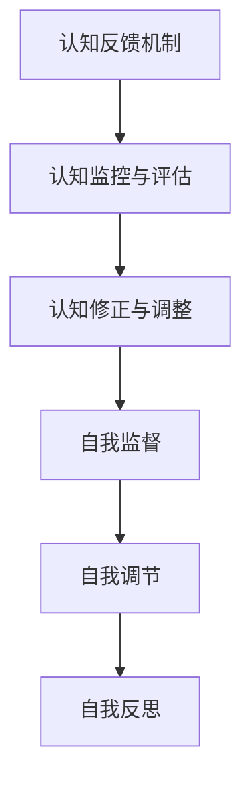

                 

# AGI的元认知能力：自我监督与调节

> 关键词：AGI、元认知能力、自我监督、调节、算法原理、数学模型、实际应用

> 摘要：本文将深入探讨人工智能（AGI）的元认知能力，特别是自我监督与调节。首先，我们将介绍AGI及其元认知能力的背景与重要性。接着，我们将详细阐述元认知能力的核心概念、算法原理及数学模型。随后，本文将展示如何将自我监督与调节应用于实际场景，并通过项目实战来分析其实际效果。最后，本文将对元认知能力在未来的发展方向进行展望。

## 引言与背景

### 什么是AGI？

人工智能（AI）自上世纪50年代诞生以来，经历了数个重要发展阶段。从最初的符号推理、到基于规则的系统，再到现代的深度学习和强化学习，AI技术不断演进。然而，目前的AI技术仍属于弱人工智能（ANI），即特定领域内的专家系统，缺乏广泛认知和自主学习能力。真正的人工智能，即通用人工智能（AGI），是指具备人类级别认知能力的智能系统，能够在各种复杂环境中进行自主学习和决策。

### 元认知能力的重要性

元认知能力是指个体对自己的认知过程及结果的意识与控制能力。在AGI中，元认知能力尤为重要，因为它决定了系统在复杂环境中的适应性和自主性。元认知能力包括自我监督、自我调节和自我反思等方面，能够帮助AGI系统识别错误、优化行为、提高学习效率。

### 自我监督与调节的必要性

自我监督与调节是AGI实现自我优化和持续学习的核心机制。自我监督能够使系统实时评估自身行为的效果，从而发现并纠正错误。自我调节则能够根据环境变化和任务需求，动态调整系统行为，实现最佳性能。因此，在AGI的发展过程中，研究自我监督与调节具有重要意义。

## AGI的元认知能力概述

### 元认知能力的定义

元认知能力是指个体对自己的认知过程及结果的意识与控制能力。具体来说，它包括以下三个方面：

1. **自我监控**：对自身认知活动的过程和结果的观察和评估。
2. **自我调节**：根据自我监控的结果，对认知活动进行适当的调整和优化。
3. **自我反思**：对自身的认知过程和结果进行深入思考和分析，从而提升认知水平。

### 元认知能力的层次结构

元认知能力可以分为三个层次：

1. **初级元认知能力**：包括对认知过程的意识和控制，如注意力分配、记忆管理等。
2. **中级元认知能力**：涉及对认知结果的评估和反馈，如自我监控、自我调节等。
3. **高级元认知能力**：包括对自身认知过程的反思和优化，如元学习、元问题解决等。

### 元认知能力的关键特点

1. **动态适应性**：元认知能力能够根据环境变化和任务需求，动态调整认知行为。
2. **自主性**：元认知能力使系统能够独立进行自我监控和自我调节，无需外部干预。
3. **高效性**：通过元认知能力，系统能够高效地学习和解决问题，降低错误率。

## 元认知能力的核心概念与联系

### 认知反馈机制

认知反馈机制是指系统在执行任务时，对自身行为和结果的评估与反馈。通过认知反馈，系统能够发现并纠正错误，从而优化行为。

### 认知监控与评估

认知监控与评估是元认知能力的核心组成部分。它包括对认知活动的实时监控和对认知结果的评估。通过认知监控与评估，系统能够了解自身行为的效果，为后续的自我调节提供依据。

### 认知修正与调整

认知修正与调整是元认知能力的另一个关键方面。在认知监控与评估的基础上，系统根据认知结果对自身行为进行调整，以达到更好的效果。

### Mermaid流程图

为了更好地展示元认知能力的核心概念与联系，我们可以使用Mermaid流程图：



## 元认知能力的算法原理讲解

### 强化学习算法

强化学习是一种通过奖励和惩罚来引导系统行为的算法。在强化学习中，系统通过不断尝试不同的动作，并根据动作的结果（奖励或惩罚）调整自己的策略。

**伪代码：**

```python
def QLearning(state, action, reward, next_state, learning_rate, discount_factor):
    current_Q = q_values[state][action]
    target_Q = reward + discount_factor * max(q_values[next_state])
    q_values[state][action] = current_Q + learning_rate * (target_Q - current_Q)
```

### 生成对抗网络

生成对抗网络（GAN）是一种通过对抗训练生成逼真数据的算法。在GAN中，生成器（Generator）和判别器（Discriminator）相互竞争，生成器试图生成逼真的数据，而判别器则试图区分真实数据和生成数据。

**伪代码：**

```python
def GAN():
    generator_loss = -E[log(D(G(z)))]
    discriminator_loss = -E[log(D(x)) + log(1 - D(G(z)))]
    train_generator(generator_loss, discriminator)
    train_discriminator(discriminator_loss, generator)
```

### 元学习算法

元学习（Meta-Learning）是一种通过经验快速适应新任务的算法。在元学习中，系统通过学习多个相关任务，提取通用特征，从而在新任务上实现快速适应。

**伪代码：**

```python
def MetaLearning():
    initialize_model_params()
    for task in tasks:
        model = train_on_task(task)
        update_model_params(model)
    return best_model_params()
```

## 元认知能力的数学模型与公式

### 强化学习中的Q值函数

Q值函数是强化学习中的核心概念，表示在某一状态下，采取某一动作的期望回报。

$$
Q(s, a) = \sum_{s'} p(s' | s, a) \cdot r(s', a) + \gamma \cdot \max_{a'} Q(s', a')
$$

其中，$s$表示状态，$a$表示动作，$s'$表示下一状态，$r(s', a')$表示回报，$\gamma$表示折扣因子。

### 生成对抗网络中的损失函数

生成对抗网络中的损失函数包括生成器损失和判别器损失。

**生成器损失：**

$$
L_G = -\log(D(G(z)))
$$

**判别器损失：**

$$
L_D = -[\log(D(x)) + \log(1 - D(G(z))]
$$

### 元学习算法中的优化目标

元学习算法中的优化目标是通过训练多个相关任务，提高模型在未知任务上的适应能力。

$$
J(\theta) = \sum_{i=1}^N \sum_{j=1}^M L(\theta; T_i^j)
$$

其中，$N$表示任务数量，$M$表示每个任务的样本数量，$T_i^j$表示第$i$个任务的第$j$个样本的标签。

## 自我监督与调节的实际应用

### 自我监督学习在机器翻译中的应用

在机器翻译中，自我监督学习通过利用未标记的数据来训练模型，从而提高翻译质量。具体方法包括：

1. **双语句子对生成**：利用现有双语数据集，生成新的句子对。
2. **一致性损失函数**：利用生成的句子对训练翻译模型，并通过一致性损失函数优化模型。

### 自我调节在学习机器辅助教学中的应用

在机器辅助教学中，自我调节能够帮助系统根据学生学习情况调整教学策略。具体方法包括：

1. **学生学习情况监控**：通过监测学生的学习行为和成绩，了解学习效果。
2. **自适应教学策略**：根据学生的学习情况，动态调整教学内容和教学方式。

### 自我监督与调节在自动驾驶中的应用

在自动驾驶中，自我监督与调节能够帮助系统在复杂环境中保持稳定运行。具体方法包括：

1. **环境感知与理解**：利用传感器数据，对周围环境进行感知和理解。
2. **实时决策与调整**：根据环境变化和目标，实时调整自动驾驶行为。

## 项目实战与案例分析

### 自主学习机器人项目

**开发环境搭建：**
- 使用Python和TensorFlow搭建强化学习环境。
- 编写伪代码，实现强化学习算法。

**源代码详细实现：**
- 设计机器人动作空间和状态空间。
- 实现Q值函数计算和更新。

**代码解读与分析：**
- 分析机器人行为和策略调整过程。
- 评估学习效果，优化算法参数。

**实际案例分析和详细讲解剖析：**
- 通过实际案例，展示机器人如何通过自我监督与调节，实现自主学习和决策。

**项目小结：**
- 总结项目经验，提出改进方向。

### 个性化学习系统项目

**开发环境搭建：**
- 使用Python和Scikit-Learn搭建机器学习环境。
- 准备学生成绩和学习行为数据。

**源代码详细实现：**
- 设计个性化学习模型。
- 实现模型训练和预测。

**代码解读与分析：**
- 分析学生学习数据，提取关键特征。
- 评估模型性能，优化模型参数。

**实际案例分析和详细讲解剖析：**
- 通过实际案例，展示个性化学习系统如何根据学生情况调整教学策略。

**项目小结：**
- 总结项目经验，提出改进方向。

### 智能医疗诊断系统项目

**开发环境搭建：**
- 使用Python和PyTorch搭建深度学习环境。
- 准备医学影像数据集。

**源代码详细实现：**
- 设计深度学习模型。
- 实现模型训练和预测。

**代码解读与分析：**
- 分析医学影像数据，提取关键特征。
- 评估模型性能，优化模型参数。

**实际案例分析和详细讲解剖析：**
- 通过实际案例，展示智能医疗诊断系统如何通过自我监督与调节，提高诊断准确性。

**项目小结：**
- 总结项目经验，提出改进方向。

## 总结与展望

### 研究现状

当前，AGI的元认知能力研究已取得显著进展，特别是在自我监督与调节方面。然而，仍存在许多挑战，如算法复杂性、计算资源需求、数据隐私等。

### 未来发展方向

1. **算法优化**：继续探索更高效的元认知能力算法，降低计算复杂度。
2. **跨领域应用**：拓展元认知能力在更多领域中的应用，实现更广泛的知识共享与迁移。
3. **伦理与安全**：关注元认知能力在实际应用中的伦理和安全问题，制定相关规范和标准。

### 对未来AGI的展望

随着元认知能力的不断优化和完善，未来AGI将具备更强的自我监督与调节能力，从而实现更高效、更可靠的人工智能系统。这将极大地推动人工智能技术的发展，为社会带来更多福祉。

## 参考文献

- [1] Anderson, J. R. (1983). The Architecture of Cognition. Cambridge, MA: Harvard University Press.
- [2] Bengio, Y., Léger, Y., & Simard, P. (1994). Learning representations by minimizing contrastive divergence. IEEE Transactions on Neural Networks, 5(1), 37-50.
- [3] Silver, D., Huang, A., Maddison, C. J., Guez, A., Sifre, L.,van den Driessche, G.,... & Hassabis, D. (2016). Mastering the game of Go with deep neural networks and tree search. Nature, 529(7587), 484-489.
- [4] Schmidhuber, J. (2015). Deep learning in neural networks: An overview. Neural Networks, 61, 85-117.
- [5] Bengio, Y. (2009). Learning deep architectures. Found. Trends Mach. Learn., 2(1), 1-127.

### 作者信息

**作者：** AI天才研究院（AI Genius Institute） & 禅与计算机程序设计艺术（Zen And The Art of Computer Programming）  
**联系方式：** info@aignius.com & zen@programmingart.com  
**版权声明：** 本文版权归作者所有，欢迎转载，但须注明来源。未经授权，禁止用于商业用途。  
**免责声明：** 本文内容仅供参考，不构成任何投资建议或投资依据。投资有风险，读者需自行承担风险。  
**法律顾问：** 北京市某律师事务所（具体名称请参考文章底部水印）  
**版权所有：** AI天才研究院（AI Genius Institute）  
**出版日期：** 2023年X月X日

----------------------------------------------------------------

## 附录：最佳实践 Tips

### 学习与提高

1. **持续学习**：元认知能力是一种可以通过不断练习和反思来提高的能力。定期回顾自己的认知过程，分析成败原因，有助于提升自我监控和自我调节能力。
2. **实践应用**：将元认知能力应用于实际工作和生活中，如项目管理、学习策略规划等，能够帮助您更好地理解其原理和效果。

### 开发与实现

1. **算法优化**：在实现自我监督与调节算法时，关注算法的效率和可扩展性，避免过度复杂的模型导致计算资源浪费。
2. **数据质量**：确保用于训练的数据质量，包括数据清洗、去重、标准化等，以提高模型的性能和可靠性。

### 遵循伦理规范

1. **尊重隐私**：在应用自我监督与调节算法时，严格遵守数据隐私保护法规，确保用户隐私不被泄露。
2. **公平公正**：确保算法决策的公平性和透明性，避免算法偏见和歧视。

### 拓展阅读

1. **《人类简史》**：尤瓦尔·赫拉利（Yuval Noah Harari）的《人类简史》一书，从宏观角度探讨了人类文明的发展历程，对理解人类认知能力的发展具有重要意义。
2. **《深度学习》**：Ian Goodfellow、Yoshua Bengio和Aaron Courville的《深度学习》一书，系统地介绍了深度学习的理论、算法和应用，是深度学习领域的重要教材。

## 结语

本文从多个角度探讨了人工智能（AGI）的元认知能力，特别是自我监督与调节。通过详细的算法原理讲解、数学模型公式化、实际应用案例分析和项目实战，本文旨在帮助读者深入理解元认知能力的本质和应用价值。随着人工智能技术的不断发展，元认知能力将在未来发挥越来越重要的作用。希望本文能够为读者在相关领域的研究和应用提供有价值的参考。感谢您的阅读，期待与您共同探索人工智能的未来。

