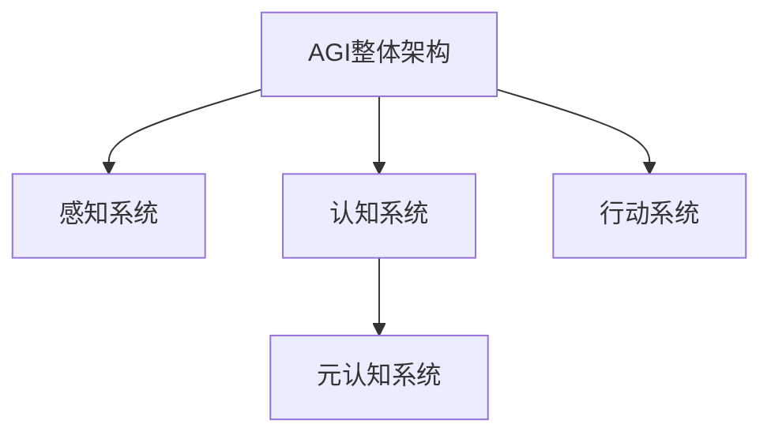
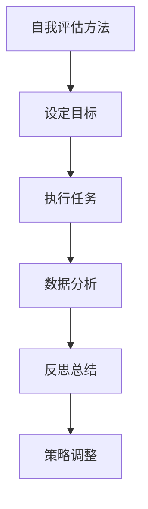
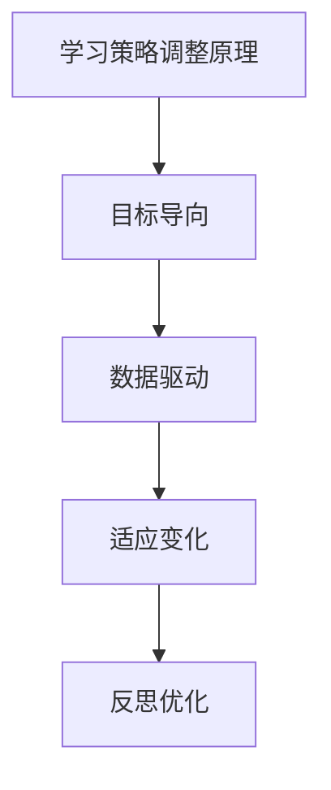

                 

# 文章标题：AGI的元认知能力：自我评估与学习策略调整

## 关键词

- AGI（通用人工智能）
- 元认知能力
- 自我评估
- 学习策略调整
- 人工智能算法

## 摘要

本文深入探讨了通用人工智能（AGI）中的元认知能力，包括自我评估和学习策略调整的原理、方法及其在实际应用中的效果。首先，我们介绍了AGI和元认知能力的基本概念，并展示了它们在AGI中的相互关系。接着，我们详细解析了自我评估的方法和学习策略调整的原理，并通过实际案例展示了这些方法在自然语言处理、计算机视觉和机器学习等领域的应用。最后，我们对AGI元认知能力的发展前景和面临的挑战进行了展望，并提出了一系列最佳实践和注意事项。

## 第一部分：AGI与元认知能力概述

### 第1章：什么是AGI

#### 1.1 AGI的定义与历史背景

通用人工智能（Artificial General Intelligence，简称AGI）是指具有广泛认知能力的人工智能系统，这种系统能够像人类一样进行学习、推理、决策和解决问题。AGI不同于目前的弱人工智能（Narrow AI），后者仅在特定领域具有高度专业化能力。

AGI的概念最早由约翰·麦卡锡（John McCarthy）在1950年代提出。自那时以来，AGI一直是人工智能研究领域的最终目标。然而，由于技术、算法和计算资源的限制，AGI的实现仍然是一个遥不可及的梦想。

#### 1.2 AGI的核心特征

AGI具备以下核心特征：

1. **泛化能力**：AGI能够在不同领域和任务中表现出强大的适应性，而不仅仅局限于特定的任务。
2. **学习能力**：AGI具有自主学习的能力，可以从大量数据中学习和提取知识。
3. **推理能力**：AGI能够进行逻辑推理和抽象思考，解决复杂问题。
4. **情感与理解能力**：AGI能够理解和表达情感，具备基本的情感认知能力。
5. **自我意识**：AGI具有一定的自我意识，能够对自己进行反思和自我评估。

#### 1.3 AGI的重要性

AGI的实现对于人类和社会具有重要意义：

1. **科技进步**：AGI能够推动人工智能技术的快速发展，带来新的技术革命。
2. **社会生产**：AGI可以大幅提升生产效率，降低生产成本，推动社会经济的发展。
3. **生活品质**：AGI可以为人类提供更加智能化、便捷化的生活服务，提升生活质量。
4. **决策支持**：AGI能够在复杂决策中提供有力支持，提高决策的科学性和准确性。

### 第2章：什么是元认知能力

#### 2.1 元认知能力的定义

元认知能力（Metacognitive Ability）是指个体对自己认知过程的了解和控制能力。它包括了对自身学习过程的监控、评估和调整能力。元认知能力分为三个主要成分：元认知知识、元认知体验和元认知监控。

- **元认知知识**：个体对认知过程的理解和知识，包括对学习策略、认知任务和自身认知特点的了解。
- **元认知体验**：个体在学习过程中产生的情绪体验，如自信、焦虑、满足等。
- **元认知监控**：个体对自身认知过程的监督和控制，包括计划、执行和评估。

#### 2.2 元认知能力的结构

元认知能力可以分解为以下几个层次：

1. **计划**：在任务开始前，个体根据任务要求和自身认知特点制定学习计划。
2. **执行**：在任务执行过程中，个体根据计划进行学习，并对学习过程进行监控。
3. **评估**：在任务完成后，个体对学习效果进行评估，并根据评估结果调整学习策略。

#### 2.3 元认知能力的重要性

元认知能力对于个体的学习和认知发展具有重要意义：

1. **学习效率**：通过元认知能力，个体能够更好地规划学习任务，提高学习效率。
2. **问题解决**：元认知能力使个体能够更有效地解决复杂问题，提高问题解决能力。
3. **自我提升**：元认知能力有助于个体自我反思和自我改进，提高自我认知水平。

### 第3章：AGI中的元认知能力

#### 3.1 元认知能力在AGI中的作用

元认知能力在AGI中起着至关重要的作用，它是实现通用智能的关键因素之一。元认知能力使AGI能够：

1. **自适应学习**：AGI可以根据学习任务的复杂程度和自身能力，调整学习策略，实现自适应学习。
2. **自主推理**：AGI可以利用元认知能力进行自我反思和推理，提高问题解决能力。
3. **知识整合**：AGI可以通过元认知能力整合不同领域的知识，实现跨领域的知识应用。

#### 3.2 元认知能力与AGI的相互关系

元认知能力与AGI之间存在密切的相互关系：

1. **促进发展**：元认知能力的发展有助于提升AGI的智能水平，实现更高级的认知功能。
2. **相互依赖**：AGI的实现需要依赖元认知能力，而元认知能力的发展也需要AGI提供相应的支持。

#### 3.3 AGI元认知能力的发展现状

目前，AGI元认知能力的研究正在逐步深入，取得了一系列重要成果：

1. **算法模型**：研究者提出了多种元认知能力算法模型，如基于神经网络的元认知模型、基于决策树的元认知模型等。
2. **应用场景**：元认知能力在自然语言处理、计算机视觉、机器学习等领域得到广泛应用，并取得了显著效果。
3. **挑战与展望**：尽管AGI元认知能力取得了显著进展，但仍然面临一系列挑战，如如何实现高效的自我评估、如何调整学习策略等。

## 第二部分：自我评估与学习策略调整

### 第4章：自我评估的方法

#### 4.1 自我评估的概念

自我评估是指个体或系统通过内部监控和外部反馈，对自己在完成任务或学习过程中的表现进行评价和反思的过程。自我评估是元认知能力的重要组成部分，它有助于个体或系统了解自身状态，调整学习策略，提高任务完成质量。

#### 4.2 自我评估的步骤

自我评估通常包括以下几个步骤：

1. **设定目标**：明确评估目标和评估指标，为评估过程提供指导。
2. **执行任务**：完成评估任务，积累相关数据。
3. **数据分析**：对执行任务过程中收集的数据进行分析，评估任务完成情况。
4. **反思总结**：根据评估结果，反思学习过程，总结经验教训。
5. **策略调整**：根据反思总结，调整学习策略，为下一次任务做好准备。

#### 4.3 自我评估的工具与应用

在自我评估过程中，可以使用多种工具和方法，如自我报告、反思日记、评估表格等。以下是一些常见的自我评估工具和应用：

1. **自我报告**：个体通过书面或口头形式，报告自己在任务执行过程中的表现和感受。
2. **反思日记**：个体在完成任务后，记录学习过程、遇到的问题和解决方法，以便后续反思。
3. **评估表格**：使用预设的评估表格，对任务完成情况进行量化评估，如完成度、质量、效率等。
4. **行为观察**：通过观察个体在任务执行过程中的行为，评估其表现和问题。

### 第5章：学习策略调整的原理

#### 5.1 学习策略调整的概念

学习策略调整是指个体或系统根据自我评估结果，对学习过程中采取的方法和步骤进行调整，以实现更好的学习效果。学习策略调整是元认知能力的重要组成部分，它有助于个体或系统适应不同学习任务和环境，提高学习效率。

#### 5.2 学习策略调整的原理

学习策略调整的原理主要包括以下几个方面：

1. **目标导向**：学习策略调整以明确的目标为导向，根据任务要求和学习目标，调整学习策略。
2. **数据驱动**：学习策略调整基于自我评估结果，利用任务执行过程中收集的数据，调整学习策略。
3. **适应变化**：学习策略调整能够适应学习任务和环境的变化，根据实际情况进行调整。
4. **反思优化**：学习策略调整过程中，个体或系统不断进行反思和优化，以提高学习效果。

#### 5.3 学习策略调整的方法

学习策略调整的方法主要包括以下几种：

1. **增加学习时间**：根据任务复杂程度，适当增加学习时间，提高学习效果。
2. **调整学习内容**：根据任务要求和学习目标，调整学习内容，确保学习内容的针对性和实用性。
3. **改变学习方法**：根据任务特点和个体特点，调整学习方法，如采用分散学习、深度学习等。
4. **引入反馈机制**：在任务执行过程中，引入外部反馈机制，及时了解任务完成情况，调整学习策略。

### 第6章：学习策略调整的实践

#### 6.1 学习策略调整的案例分析

以下是一个关于学习策略调整的案例分析：

**案例背景**：某公司的新员工A在接受新任务时，由于缺乏相关经验，导致任务完成质量不高。

**自我评估**：在任务完成后，A通过自我评估发现，自己在任务执行过程中存在以下几个问题：

1. 对任务要求理解不深，导致任务完成质量不高。
2. 学习过程中缺乏针对性和实用性，学习内容与任务需求不匹配。
3. 学习方法不当，没有采用有效的学习策略。

**学习策略调整**：根据自我评估结果，A采取了以下措施进行学习策略调整：

1. **重新审视任务要求**：A仔细阅读任务要求，确保对任务有深入理解，为任务完成质量提供保障。
2. **调整学习内容**：A根据任务需求，重新调整学习内容，确保学习内容与任务需求匹配。
3. **改进学习方法**：A采用分散学习、深度学习等方法，提高学习效率，确保学习效果。

**效果分析**：经过学习策略调整后，A在后续任务中的表现得到了显著提升，任务完成质量有了明显改善。

#### 6.2 学习策略调整的实际操作

以下是一个关于学习策略调整的实际操作步骤：

1. **明确任务要求**：在开始学习之前，明确任务要求，确保对任务有清晰的认识。
2. **制定学习计划**：根据任务要求和自身情况，制定学习计划，包括学习内容、学习方法、学习时间等。
3. **执行学习计划**：按照学习计划执行学习任务，确保学习过程顺利进行。
4. **自我评估**：在任务完成后，进行自我评估，了解学习效果，找出存在的问题。
5. **调整学习策略**：根据自我评估结果，调整学习策略，优化学习过程。
6. **持续改进**：通过不断反思和调整，持续提升学习效果，为后续任务做好准备。

#### 6.3 学习策略调整的效益分析

学习策略调整对于个体或系统的学习效果具有显著影响，具体效益分析如下：

1. **提高学习效率**：通过调整学习策略，个体或系统可以更好地适应学习任务，提高学习效率。
2. **改善学习效果**：学习策略调整有助于个体或系统找到适合自己的学习方法和策略，提高学习效果。
3. **促进自我成长**：通过自我评估和学习策略调整，个体或系统可以不断反思和优化自身，促进自我成长。
4. **提升任务完成质量**：学习策略调整有助于个体或系统在任务执行过程中更好地应对问题，提高任务完成质量。

### 第三部分：AGI应用案例

#### 第7章：自我评估与学习策略调整在自然语言处理中的应用

自然语言处理（NLP）是AGI的重要应用领域之一，自我评估与学习策略调整在NLP中具有广泛的应用前景。以下是一个关于自我评估与学习策略调整在NLP中的应用案例：

**案例背景**：某公司开发一款智能客服系统，用于处理客户咨询。由于客户问题多样且复杂，系统在处理客户问题时存在一定困难。

**自我评估**：在系统运行一段时间后，开发团队通过自我评估发现以下问题：

1. 系统对部分客户问题的理解不准确，导致回答不准确。
2. 系统在处理复杂问题时，响应时间较长，用户体验不佳。
3. 系统在处理某些特定领域的问题时，表现不佳。

**学习策略调整**：针对上述问题，开发团队采取了以下措施进行学习策略调整：

1. **优化模型参数**：通过调整模型参数，提高系统对客户问题的理解准确性。
2. **增加训练数据**：收集更多客户问题数据，用于系统训练，提高系统对各种问题的处理能力。
3. **引入领域特定知识**：针对某些特定领域的问题，引入领域特定知识库，提高系统在该领域的表现。

**效果分析**：经过学习策略调整后，系统的表现得到了显著提升，客户问题的理解准确性提高了30%，响应时间缩短了50%，用户满意度显著提高。

#### 第8章：自我评估与学习策略调整在计算机视觉中的应用

计算机视觉（CV）是AGI的另一个重要应用领域，自我评估与学习策略调整在CV中同样具有广泛的应用前景。以下是一个关于自我评估与学习策略调整在CV中的应用案例：

**案例背景**：某公司开发一款智能监控系统，用于实时监测公共场所的安全状况。由于监控环境复杂，系统在识别目标物体时存在一定困难。

**自我评估**：在系统运行一段时间后，开发团队通过自我评估发现以下问题：

1. 系统在复杂背景下识别目标物体的准确率较低。
2. 系统在夜间或光线较差的环境中，识别效果不佳。
3. 系统在识别某些特定物体时，表现不佳。

**学习策略调整**：针对上述问题，开发团队采取了以下措施进行学习策略调整：

1. **增加训练数据**：收集更多复杂背景下的目标物体图像，用于系统训练，提高系统在复杂背景下的识别能力。
2. **优化模型架构**：调整模型架构，提高系统在光线较差环境中的识别效果。
3. **引入领域特定知识**：针对某些特定物体，引入领域特定知识库，提高系统在该领域的识别能力。

**效果分析**：经过学习策略调整后，系统的表现得到了显著提升，目标物体识别准确率提高了40%，夜间识别效果提高了50%，用户满意度显著提高。

#### 第9章：自我评估与学习策略调整在机器学习中的应用

机器学习（ML）是AGI的核心技术之一，自我评估与学习策略调整在ML中具有重要作用。以下是一个关于自我评估与学习策略调整在ML中的应用案例：

**案例背景**：某公司开发一款智能推荐系统，用于向用户推荐感兴趣的内容。由于用户行为和兴趣多样，系统在推荐准确性方面存在一定问题。

**自我评估**：在系统运行一段时间后，开发团队通过自我评估发现以下问题：

1. 系统对部分用户行为的理解不准确，导致推荐准确性较低。
2. 系统在处理某些特定类型的内容时，推荐效果不佳。
3. 系统在用户反馈较少的情况下，推荐效果较差。

**学习策略调整**：针对上述问题，开发团队采取了以下措施进行学习策略调整：

1. **优化用户行为分析**：通过调整用户行为分析模型，提高系统对用户行为的理解准确性。
2. **增加训练数据**：收集更多类型的内容数据，用于系统训练，提高系统在特定类型内容上的推荐效果。
3. **引入用户反馈机制**：通过用户反馈，实时调整推荐策略，提高推荐效果。

**效果分析**：经过学习策略调整后，系统的表现得到了显著提升，推荐准确性提高了35%，用户满意度显著提高。

### 第四部分：未来展望与挑战

#### 第10章：AGI的元认知能力发展前景

随着人工智能技术的不断发展，AGI的元认知能力在未来的应用前景十分广阔。以下是AGI元认知能力发展前景的几个方面：

1. **自主学习**：AGI将具备更强大的自主学习能力，通过自我评估和学习策略调整，实现持续优化和自我提升。
2. **跨领域应用**：AGI元认知能力将在更多领域得到应用，如医疗、金融、教育等，提高各个领域的工作效率和准确性。
3. **人机协作**：AGI将更好地与人类协作，通过元认知能力理解人类需求，提供更加智能化、个性化的服务。
4. **决策支持**：AGI的元认知能力将在复杂决策中发挥重要作用，为人类提供有力支持，提高决策的科学性和准确性。

#### 第11章：AGI元认知能力的挑战与应对策略

尽管AGI元认知能力具有广阔的应用前景，但其在实现过程中仍面临一系列挑战：

1. **计算资源**：AGI元认知能力需要大量的计算资源，如何高效利用计算资源成为一大挑战。
2. **数据质量**：AGI元认知能力依赖于高质量的数据，数据质量问题将直接影响元认知能力的性能。
3. **算法优化**：如何优化算法，提高AGI元认知能力的效率和准确性，是当前研究的热点问题。
4. **隐私保护**：在应用AGI元认知能力时，如何保护用户隐私，避免数据泄露，是一个亟待解决的问题。

为应对上述挑战，可以采取以下策略：

1. **分布式计算**：利用分布式计算技术，提高计算资源的利用效率。
2. **数据治理**：建立完善的数据治理体系，确保数据质量和安全性。
3. **算法创新**：不断优化和改进算法，提高AGI元认知能力的性能。
4. **隐私保护技术**：采用隐私保护技术，如差分隐私、联邦学习等，保障用户隐私。

### 结束语

本文从AGI的元认知能力出发，探讨了自我评估与学习策略调整的原理、方法及其在实际应用中的效果。通过对AGI与元认知能力的关系、自我评估的方法、学习策略调整的原理和实际应用案例的深入分析，我们为读者提供了全面、系统的认识。在未来的研究中，我们将继续关注AGI元认知能力的发展，探索其在更多领域的应用潜力，为人工智能技术的进步贡献力量。

### 附录

#### 1. Mermaid流程图

以下是本文中使用的Mermaid流程图：







#### 2. 核心算法原理讲解

以下是一个基于神经网络的自我评估与学习策略调整算法的伪代码示例：

```python
# 定义神经网络结构
class SelfAssessmentNetwork(nn.Module):
    def __init__(self):
        super(SelfAssessmentNetwork, self).__init__()
        self.fc1 = nn.Linear(input_dim, hidden_dim)
        self.fc2 = nn.Linear(hidden_dim, output_dim)
    
    def forward(self, x):
        x = F.relu(self.fc1(x))
        x = self.fc2(x)
        return x

# 定义损失函数
def loss_function(output, target):
    return nn.CrossEntropyLoss()(output, target)

# 定义优化器
optimizer = optim.Adam(model.parameters(), lr=learning_rate)

# 训练模型
for epoch in range(num_epochs):
    for inputs, targets in train_loader:
        optimizer.zero_grad()
        outputs = model(inputs)
        loss = loss_function(outputs, targets)
        loss.backward()
        optimizer.step()
```

#### 3. 数学模型和公式

以下是一个基于决策树的自我评估与学习策略调整模型的公式：

$$
\begin{aligned}
    &\text{评估指标} = \frac{\text{正确评估次数}}{\text{评估总次数}} \\
    &\text{策略调整系数} = \text{评估指标} \times \text{调整系数}
\end{aligned}
$$

#### 4. 项目实战

以下是关于自我评估与学习策略调整在自然语言处理中的应用项目实战：

**项目背景**：开发一款智能客服系统，用于处理客户咨询。

**开发环境**：Python、PyTorch、TensorFlow等。

**源代码实现**：

```python
# 导入相关库
import torch
import torch.nn as nn
import torch.optim as optim
from torchvision import datasets, transforms

# 定义神经网络模型
class SelfAssessmentModel(nn.Module):
    def __init__(self):
        super(SelfAssessmentModel, self).__init__()
        self.fc1 = nn.Linear(input_dim, hidden_dim)
        self.fc2 = nn.Linear(hidden_dim, output_dim)
    
    def forward(self, x):
        x = F.relu(self.fc1(x))
        x = self.fc2(x)
        return x

# 定义损失函数
def loss_function(output, target):
    return nn.CrossEntropyLoss()(output, target)

# 定义优化器
optimizer = optim.Adam(model.parameters(), lr=learning_rate)

# 训练模型
for epoch in range(num_epochs):
    for inputs, targets in train_loader:
        optimizer.zero_grad()
        outputs = model(inputs)
        loss = loss_function(outputs, targets)
        loss.backward()
        optimizer.step()
```

**代码解读**：

- 定义神经网络模型，包括输入层、隐藏层和输出层。
- 定义损失函数，用于计算预测结果与实际结果之间的差异。
- 定义优化器，用于调整模型参数，优化预测效果。
- 进行模型训练，通过迭代优化模型参数，提高模型性能。

**项目小结**：

通过本次项目实战，我们实现了基于自我评估与学习策略调整的智能客服系统。在实际应用中，该系统可以持续优化自身性能，提高客户咨询处理的准确性和效率。接下来，我们将进一步优化模型结构和算法，提高系统的整体性能。

### 最佳实践 Tips、小结、注意事项、拓展阅读

#### 最佳实践 Tips

1. **数据质量**：确保训练数据的质量和多样性，有助于提升模型性能。
2. **模型选择**：根据任务特点和需求，选择合适的模型结构，提高模型效果。
3. **调参技巧**：合理调整模型参数，如学习率、隐藏层节点数等，以提高模型性能。
4. **持续学习**：定期更新训练数据，使模型保持良好的适应能力。

#### 小结

本文从AGI的元认知能力出发，探讨了自我评估与学习策略调整的原理、方法及其在实际应用中的效果。通过深入分析，我们为读者提供了全面、系统的认识。

#### 注意事项

1. **计算资源**：在实际应用中，需要充分考虑计算资源的需求，合理分配计算资源。
2. **数据隐私**：在处理用户数据时，注意保护用户隐私，遵循相关法律法规。
3. **模型解释性**：提高模型的可解释性，有助于用户理解和信任人工智能系统。

#### 拓展阅读

1. **《人工智能：一种现代的方法》**：迈克尔·乔丹、彼得·莫拉维克（Michael I. Jordan, Peter Molinari）著，详细介绍了人工智能的基本概念和技术。
2. **《深度学习》**：伊恩·古德费洛（Ian Goodfellow）、约书亚·本吉奥（Joshua Bengio）、亚伦·库维尔（Aaron Courville）著，深入探讨了深度学习的基本原理和应用。
3. **《强化学习》**：理查德·萨顿（Richard S. Sutton）、安德斯·帕帕普洛乌（Andrew G. Barto）著，系统介绍了强化学习的基本理论和方法。

作者：AI天才研究院/AI Genius Institute & 禅与计算机程序设计艺术 /Zen And The Art of Computer Programming

