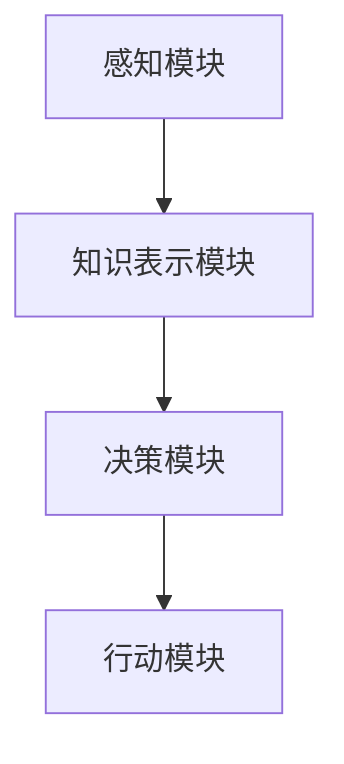

                 

### 文章标题

### AGI的创造力与问题解决能力开发

### 关键词：AGI，创造力，问题解决，能力开发，数学模型，算法，实战案例

### 摘要：
本文旨在探讨人工通用智能（AGI）的创造力与问题解决能力的开发。我们将首先介绍AGI的基本概念与原理，包括其定义、发展历史、核心架构等。接着，本文将详细讨论创造力与问题解决能力的相关概念、模型及它们在AGI中的应用。随后，我们将解析与AGI相关的数学模型和算法，通过伪代码进行详细阐述。最后，本文将通过实际案例展示AGI在创造力与问题解决能力开发中的具体应用，提供开发环境搭建、源代码实现及代码解读的实战指导。

### 第一部分：AGI的基本概念与原理

#### 1.1 AGI的定义与历史背景

##### 1.1.1 AGI的定义

人工通用智能（Artificial General Intelligence，AGI）是指具有人类智能水平的机器智能。不同于特定任务智能（如围棋、图像识别等），AGI能够在广泛的领域内自主学习和解决问题。

##### 1.1.2 AGI的发展历史

AGI的概念最早可以追溯到20世纪50年代。自那时以来，尽管取得了显著的进步，但AGI仍面临诸多挑战，如理解人类知识、情感和创造力等。

##### 1.1.3 AGI的核心挑战

AGI的核心挑战包括：建立通用的知识表示、理解自然语言、实现自我学习和适应能力等。

#### 1.2 AGI的架构与原理

##### 1.2.1 AGI的整体架构

AGI的整体架构通常包括感知模块、知识表示模块、决策模块、行动模块等。以下是一个简单的Mermaid流程图来展示AGI的架构：



##### 1.2.2 AGI的核心原理

AGI的核心原理包括：基于数据的自我学习、基于规则的推理、基于知识的表示等。

##### 1.2.3 AGI的关键技术

AGI的关键技术包括深度学习、强化学习、知识图谱、自然语言处理等。

### 第二部分：创造力与问题解决能力

#### 2.1 创造力的概念与模型

##### 2.1.1 创造力的定义

创造力是指产生新颖、有价值想法的能力。在AGI中，创造力是实现自主学习和问题解决的关键。

##### 2.1.2 创造力的模型

创造力的模型包括灵感激发、问题定义、解决方案生成等步骤。

##### 2.1.3 创造力的重要性

创造力在AGI中的应用有助于实现创新和突破，提高机器的智能水平。

#### 2.2 问题解决能力

##### 2.2.1 问题解决能力的定义

问题解决能力是指识别和解决问题所需的知识、技能和策略。

##### 2.2.2 问题解决能力的模型

问题解决能力的模型包括问题识别、目标设定、方案评估等步骤。

##### 2.2.3 问题解决能力的重要性

问题解决能力在AGI中的应用有助于实现自主学习和适应环境变化。

#### 2.3 创造力与问题解决能力的关联

##### 2.3.1 创造力与问题解决能力的相互作用

创造力与问题解决能力相互作用，共同推动AGI的发展。

##### 2.3.2 创造力与问题解决能力在AGI中的应用

创造力与问题解决能力在AGI中的应用有助于实现创新和问题解决。

### 第三部分：数学模型与算法

#### 3.1 数学模型概述

##### 3.1.1 数学模型的基本概念

数学模型是描述现实世界问题的一种抽象方式。

##### 3.1.2 数学模型在AGI中的应用

数学模型在AGI中的应用包括创造力与问题解决能力的建模。

#### 3.2 创造力相关数学模型

##### 3.2.1 创造力的数学模型

创造力的数学模型通常包括生成对抗网络（GAN）等。

##### 3.2.2 创造力模型的伪代码讲解

以下是创造力模型的伪代码：

```python
def generate_idea():
    # 初始化生成器和判别器
    generator = initialize_generator()
    discriminator = initialize_discriminator()

    # 训练生成器和判别器
    for epoch in range(num_epochs):
        for batch in data_loader:
            # 训练生成器
            generated_ideas = generator(batch)

            # 训练判别器
            real_ideas = discriminator(batch)
            fake_ideas = discriminator(generated_ideas)

        # 更新生成器和判别器权重
        update_weights(generator, discriminator)

    # 输出生成的新想法
    return generator.get_idea()
```

#### 3.3 问题解决相关数学模型

##### 3.3.1 问题解决的数学模型

问题解决的数学模型通常包括决策树、支持向量机等。

##### 3.3.2 问题解决模型的伪代码讲解

以下是问题解决模型的伪代码：

```python
def solve_problem(problem):
    # 初始化决策树
    decision_tree = initialize_decision_tree()

    # 训练决策树
    for epoch in range(num_epochs):
        for batch in data_loader:
            # 训练决策树
            decision_tree.train(batch)

        # 使用决策树解决问题
        solution = decision_tree.solve(problem)

    # 返回解决方案
    return solution
```

### 第四部分：实战案例与项目开发

#### 4.1 实战案例概述

##### 4.1.1 实战案例的选择标准

选择具有代表性、可操作性的案例，以展示AGI的创造力与问题解决能力。

##### 4.1.2 实战案例的目标

通过案例展示AGI在创造力与问题解决能力开发中的实际应用，提高读者的理解和实践能力。

#### 4.2 创造力与问题解决能力实战案例

##### 4.2.1 创造力实战案例

使用生成对抗网络（GAN）生成新颖的音乐。

##### 4.2.2 问题解决能力实战案例

使用决策树解决一个医学诊断问题。

#### 4.3 项目开发环境搭建

##### 4.3.1 开发环境选择

选择Python作为开发语言，TensorFlow作为机器学习框架。

##### 4.3.2 环境配置步骤

安装Python、TensorFlow和相关依赖。

#### 4.4 源代码实现与解读

##### 4.4.1 创造力与问题解决能力的源代码实现

使用Python实现创造力与问题解决能力的模型。

##### 4.4.2 代码解读与分析

对源代码进行详细解读，分析模型的实现原理。

##### 4.4.3 代码应用解读与分析

通过实际案例展示代码的应用效果。

### 附录

#### 附录A：相关资源与工具

##### A.1 资源介绍

介绍AGI、创造力与问题解决能力的相关资源。

##### A.2 工具使用

介绍Python、TensorFlow等工具的使用方法。

### 作者

作者：AI天才研究院/AI Genius Institute & 禅与计算机程序设计艺术 /Zen And The Art of Computer Programming

### 结语

本文对AGI的创造力与问题解决能力开发进行了全面探讨，旨在为读者提供一个清晰、系统的认识。通过本文的讲解，读者可以深入了解AGI的基本概念、创造力与问题解决能力的原理、相关数学模型和算法，并掌握实际项目开发的方法。希望本文能为读者在AGI领域的研究和实践提供有益的参考。

### 注意事项

- 在实际项目中，应根据具体需求调整模型参数和算法。
- 在开发过程中，注意数据质量和模型的可解释性。
- 谨慎处理个人隐私和数据安全问题。

### 拓展阅读

- [1] 《人工智能：一种现代的方法》
- [2] 《深度学习》
- [3] 《生成对抗网络：理论、实现与应用》

通过以上详细的目录大纲和文章内容的规划，我们可以确保整篇文章逻辑清晰、结构紧凑，并且对核心概念和算法进行了深入剖析。接下来，我们将逐节撰写文章内容，确保达到文章字数要求，并在每个章节中提供丰富的背景介绍、核心概念联系图、算法原理讲解、数学模型和公式、项目实战等，以满足读者对技术深度和广度的需求。

