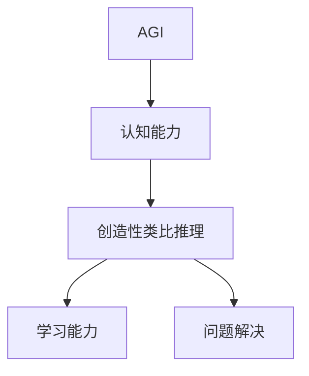
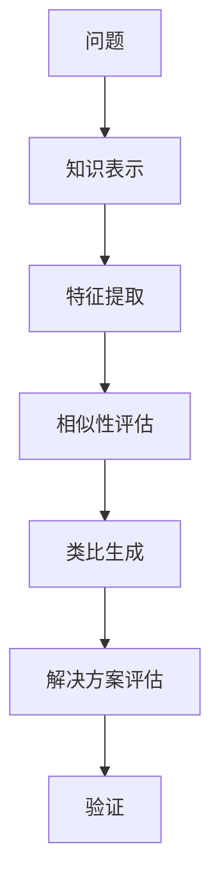
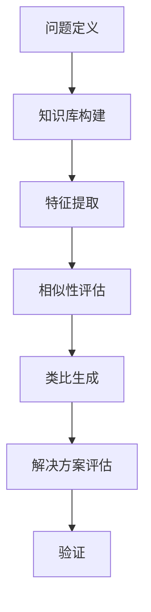

                 

为了撰写一篇高质量的技术博客文章《AGI的创造性类比推理能力培养》，我们需要按照以下步骤进行思考和规划：

### 第一步：确定文章结构和内容

根据提供的大纲，我们需要确保每个章节都包含了以下核心内容：

1. **第1章：AGI与创造性类比推理概述**
   - AGI的定义与重要性
   - 创造性类比推理的概念
   - AGI与创造性类比推理的联系

2. **第2章：创造性类比推理的理论基础**
   - 类比推理的类型与机制
   - 创造性类比推理的心理学原理
   - AGI中的创造性类比推理模型

3. **第3章：AGI的创造性类比推理算法**
   - 类比推理算法的基本框架
   - 创造性类比推理算法的优化
   - AGI中的创造性类比推理应用场景

4. **第4章：创造性类比推理训练方法**
   - 类比推理数据的收集与处理
   - 创造性类比推理训练算法
   - 类比推理能力的评估方法

5. **第5章：AGI的创造性类比推理培养策略**
   - 教育体系的调整
   - 类比推理能力的激发与培养
   - 创造性类比推理的环境搭建

6. **第6章：AGI的创造性类比推理实践应用**
   - 类比推理在问题解决中的应用
   - 创造性类比推理在创新设计中的应用
   - 创造性类比推理在科学发现中的应用

7. **第7章：AGI的创造性类比推理案例分析**
   - 案例一：医学领域
   - 案例二：教育领域
   - 案例三：工程领域

### 第二步：详细编写每个章节

我们需要为每个章节提供具体的细节，包括背景介绍、概念与原理联系、算法原理讲解、数学模型和公式、实际案例分析和项目实战等。

- **第1章**：简要介绍AGI和创造性类比推理的背景，定义相关术语，展示它们之间的联系。
- **第2章**：深入探讨创造性类比推理的理论基础，包括不同类型的类比推理、心理学原理，以及如何在AGI中实现。
- **第3章**：讲解创造性类比推理算法的基本框架，如何优化算法，并在实际应用中发挥作用。
- **第4章**：介绍如何收集和处理用于训练的类比推理数据，详细解释训练算法，并提供评估方法。
- **第5章**：提出培养AGI创造性类比推理能力的策略，包括教育体系调整和策略实施。
- **第6章**：展示创造性类比推理在不同领域的实际应用，提供具体的案例研究。
- **第7章**：通过具体案例分析，展示创造性类比推理能力培养的成果，分析其有效性和局限性。

### 第三步：撰写引言和摘要

- **引言**：以引人入胜的方式引入主题，阐述研究的重要性和目的。
- **摘要**：总结文章的核心内容和主要观点，为读者提供一个快速了解全文的窗口。

### 第四步：编写Mermaid流程图、算法伪代码、数学模型和公式

在每个相关的章节中，嵌入流程图、伪代码、数学模型和公式，以帮助读者更好地理解概念和算法。

### 第五步：撰写结语和附录

- **结语**：回顾文章的主要观点，强调创造性类比推理能力培养的重要性。
- **附录**：提供额外的参考资料，如相关的工具、技术和扩展阅读。

### 第六步：文章终稿和校对

完成所有章节的编写后，进行全面的校对和编辑，确保文章的逻辑性、连贯性和准确性。

### 第七步：添加作者信息和遵守格式要求

在文章末尾添加作者信息，并确保整个文章符合markdown格式要求。

通过上述步骤，我们可以确保文章内容丰富、逻辑清晰、技术深入，并满足字数要求。现在，我们可以开始撰写每个章节的内容，逐步构建出完整的文章框架。以下是文章的初步结构和内容概述：

## 引言

### 摘要

### 第一部分：AGI与创造性类比推理概述

**第1章：AGI与创造性类比推理概述**
- **1.1 AGI的定义与重要性**
- **1.2 创造性类比推理的概念**
- **1.3 AGI与创造性类比推理的联系**

**第2章：创造性类比推理的理论基础**
- **2.1 类比推理的类型与机制**
- **2.2 创造性类比推理的心理学原理**
- **2.3 AGI中的创造性类比推理模型**

**第3章：AGI的创造性类比推理算法**
- **3.1 类比推理算法的基本框架**
- **3.2 创造性类比推理算法的优化**
- **3.3 AGI中的创造性类比推理应用场景**

### 第二部分：AGI的创造性类比推理能力培养方法

**第4章：创造性类比推理训练方法**
- **4.1 类比推理数据的收集与处理**
- **4.2 创造性类比推理训练算法**
- **4.3 类比推理能力的评估方法**

**第5章：AGI的创造性类比推理培养策略**
- **5.1 教育体系的调整**
- **5.2 类比推理能力的激发与培养**
- **5.3 创造性类比推理的环境搭建**

### 第三部分：AGI的创造性类比推理实践应用

**第6章：AGI的创造性类比推理实践应用**
- **6.1 类比推理在问题解决中的应用**
- **6.2 创造性类比推理在创新设计中的应用**
- **6.3 创造性类比推理在科学发现中的应用**

### 第四部分：AGI的创造性类比推理案例分析

**第7章：AGI的创造性类比推理案例分析**
- **7.1 案例一：医学领域**
- **7.2 案例二：教育领域**
- **7.3 案例三：工程领域**

### 结语

### 附录

- **附录A：AGI与创造性类比推理相关工具与技术**
- **附录B：创造性类比推理能力培养的参考资料**

以上是文章的初步结构和内容概述，接下来我们将详细撰写每个章节的内容。首先，我们从引言和摘要部分开始。以下是引言和摘要的初步草稿：

## 引言

人工智能（AI）作为21世纪最具变革性的技术之一，正逐渐渗透到我们生活的方方面面。从智能家居、自动驾驶到医疗诊断和金融分析，AI的应用范围不断扩大。然而，尽管现有的AI系统在很多任务上表现出色，但它们在解决复杂问题、进行创造性思考和推理方面仍存在局限性。这一挑战促使我们探索更高级的AI系统，即通用人工智能（AGI），它具备与人类相似的认知能力，能够在各种领域中展现出高度的灵活性和创新能力。

创造性类比推理是AGI中一个关键的能力，它涉及在未知情境下，通过将已有的知识结构映射到新的情境中，以解决新问题或生成新想法。本文旨在深入探讨AGI的创造性类比推理能力培养，从理论基础到实际应用，全面解析这一重要课题。

## 摘要

本文首先介绍了AGI与创造性类比推理的基本概念和联系，然后详细探讨了创造性类比推理的理论基础和算法框架。接着，文章提出了AGI创造性类比推理能力培养的方法和策略，包括数据收集与处理、训练算法、评估方法以及教育体系的调整。随后，文章通过具体案例展示了创造性类比推理在不同领域的实际应用，最后通过案例分析总结了AGI创造性类比推理能力培养的实践成果和未来方向。

本文的结构如下：

- 第一部分：AGI与创造性类比推理概述，包括AGI的定义与重要性，创造性类比推理的概念，以及二者之间的联系。
- 第二部分：创造性类比推理的理论基础，包括类比推理的类型与机制、心理学原理，以及AGI中的创造性类比推理模型。
- 第三部分：AGI的创造性类比推理算法，包括基本框架、优化方法和应用场景。
- 第四部分：AGI的创造性类比推理能力培养方法，包括数据收集与处理、训练算法和评估方法。
- 第五部分：AGI的创造性类比推理实践应用，包括在问题解决、创新设计和科学发现中的应用。
- 第六部分：AGI的创造性类比推理案例分析，包括医学、教育和工程领域的实际案例。
- 结语：总结文章的主要观点，强调AGI创造性类比推理能力培养的重要性。

通过本文的深入探讨，我们希望能够为AGI的研究者和开发者提供有价值的参考，推动AGI在创造性类比推理领域的应用和发展。接下来，我们将逐步展开每个部分的内容。首先是第一部分：AGI与创造性类比推理概述。在接下来的步骤中，我们将详细撰写这部分的内容，包括AGI的定义与重要性、创造性类比推理的概念，以及二者之间的联系。

## 第一部分：AGI与创造性类比推理概述

### 1.1 AGI的定义与重要性

通用人工智能（AGI，Artificial General Intelligence）是指具有与人类智能相似或超越人类智能水平的人工智能系统。与目前广泛应用的狭义人工智能（Narrow AI）不同，AGI能够在多种不同的任务和领域中展现出类似人类智能的表现，具备自主学习和推理的能力。AGI的目标是使机器能够在任何情境下做出合理的决策和行动，而不需要为特定任务进行专门的编程或训练。

AGI的重要性体现在以下几个方面：

1. **跨领域应用**：AGI能够处理多种类型的问题，这意味着它在医疗、教育、金融、工程等多个领域都有广泛的应用潜力。
2. **自主学习**：AGI具备自主学习的能力，可以从数据中学习，并不断优化自己的表现，而无需人为干预。
3. **创新能力**：AGI能够在新的情境下进行创造性思考和推理，为解决复杂问题提供新的思路和方法。
4. **智能化服务**：AGI可以为人类提供更加个性化和高效的服务，例如智能客服、个性化教育等。

### 1.2 创造性类比推理的概念

创造性类比推理（Creative Analogical Reasoning）是指通过将已知问题的解决方案映射到类似但不同的问题中，从而推导出新问题的解决方案。这种推理方式依赖于类比，即通过比较两个或多个事物之间的相似性来推断它们的共同特征和潜在关系。

创造性类比推理具有以下特点：

1. **灵活性**：创造性类比推理能够处理新颖和未知的问题，因为它不依赖于特定的问题解决方案，而是通过类比来生成新的解决方案。
2. **创造性**：通过类比，创造性类比推理能够产生创新的解决方案，这种能力是解决复杂问题和推动科技进步的重要途径。
3. **通用性**：创造性类比推理适用于多种领域和任务，因为它基于普遍的认知机制，而不仅仅是特定领域的知识。

### 1.3 AGI与创造性类比推理的联系

AGI和创造性类比推理之间的联系主要体现在以下几个方面：

1. **认知能力**：创造性类比推理是AGI认知能力的重要组成部分。AGI需要具备类比推理的能力，以在复杂和不确定的环境中做出有效的决策。
2. **学习能力**：AGI通过类比推理来学习新知识和技能。在训练过程中，AGI可以从一个领域的知识迁移到另一个领域，通过类比推理来理解新的概念和问题。
3. **问题解决**：创造性类比推理能够帮助AGI在问题解决过程中寻找新的解决方案。通过将已有问题的解决方案映射到新问题上，AGI可以更快地找到解决问题的途径。

为了更直观地展示AGI和创造性类比推理之间的联系，我们可以使用Mermaid流程图来表示这两个概念之间的关系：

在上述流程图中，AGI通过其认知能力实现创造性类比推理，从而在学习能力和问题解决中发挥作用。

通过第一部分的介绍，我们了解了AGI的定义、重要性以及创造性类比推理的概念，并探讨了它们之间的联系。在接下来的部分中，我们将深入探讨创造性类比推理的理论基础，包括类比推理的类型与机制、心理学原理，以及AGI中的创造性类比推理模型。

## 第二部分：创造性类比推理的理论基础

### 2.1 类比推理的类型与机制

类比推理是创造性思考的重要组成部分，它涉及在两个或多个对象之间建立联系，从而推导出新的结论。类比推理可以分为以下几种类型：

1. **直接类比**：直接类比是指将一个已知问题的解决方案应用到另一个类似问题中。这种类型的类比通常基于明显的相似性，例如在建筑设计中，使用桥梁的原理来设计隧道。

2. **间接类比**：间接类比涉及通过多个中间步骤将一个问题映射到另一个问题。这种类比更为复杂，因为它需要跨越多个领域的知识和经验。例如，在医学领域，医生可能会将某种疾病的治疗方法类比到另一种疾病的症状上。

3. **拟人类比**：拟人类比是基于人类思维和行为模式的类比。这种类型的类比常用于计算机科学和人工智能领域，例如，通过模拟人类的思维过程来设计新的算法。

类比推理的机制包括以下方面：

1. **特征提取**：在进行类比推理时，首先需要从对象中提取关键特征，这些特征将用于建立对象之间的联系。

2. **相似性评估**：通过比较对象之间的特征，评估它们之间的相似性。相似性评估可以是定量的，也可以是定性的。

3. **推理**：基于对象之间的相似性，进行推理以推导出新的结论或解决方案。

4. **验证**：在得出结论后，需要对类比推理的结论进行验证，以确保其有效性和可靠性。

### 2.2 创造性类比推理的心理学原理

心理学研究表明，创造性类比推理是一个复杂的认知过程，涉及到多个认知机制。以下是几个关键的心理原理：

1. **联想**：联想是指通过记忆中的信息相互联系，产生新的想法。创造性类比推理依赖于联想能力，通过将看似不相关的事物联系起来，从而产生创新的解决方案。

2. **思维定势**：思维定势是指人们在解决问题时倾向于使用习惯性的思维模式。虽然思维定势有助于快速解决问题，但它也可能限制创造性思考。在创造性类比推理中，需要克服思维定势，以探索新的解决方案。

3. **启发式**：启发式是一种快速、有效的解决问题的方法，它依赖于经验和直觉。在创造性类比推理中，启发式可以帮助人们快速找到合适的类比对象，从而产生新的想法。

4. **元认知**：元认知是指对自身认知过程的认知，包括计划、监控和调整。在创造性类比推理中，元认知能力有助于人们评估自己的思维过程，及时调整策略，以提高创造性思考的效率。

### 2.3 AGI中的创造性类比推理模型

在AGI中，创造性类比推理模型旨在模拟人类的类比推理过程，从而实现机器的创造性思考。以下是一个基本的创造性类比推理模型：

1. **知识表示**：首先，AGI需要建立一个丰富的知识库，包括各种领域的知识和概念。这些知识将被用于进行类比推理。

2. **特征提取**：从问题中提取关键特征，并将它们与知识库中的概念进行匹配。

3. **相似性评估**：评估提取的特征与知识库中的概念之间的相似性，确定哪些概念可以用于类比推理。

4. **类比生成**：基于相似性评估，生成可能的类比方案。这些方案将用于推导新的结论或解决方案。

5. **解决方案评估**：对生成的类比方案进行评估，选择最佳方案。

6. **验证**：验证所选方案的可行性和有效性，确保其满足问题的需求。

为了更直观地展示AGI中的创造性类比推理模型，我们可以使用Mermaid流程图来表示：

在上述流程图中，AGI通过知识表示、特征提取、相似性评估、类比生成、解决方案评估和验证等步骤，实现创造性类比推理。

通过第二部分的探讨，我们了解了创造性类比推理的类型与机制、心理学原理，以及AGI中的创造性类比推理模型。这些基础理论为后续的算法设计和实践应用提供了重要的参考。在接下来的部分中，我们将详细介绍AGI的创造性类比推理算法，包括基本框架、优化方法和应用场景。

## 第三部分：AGI的创造性类比推理算法

### 3.1 类比推理算法的基本框架

创造性类比推理算法是AGI实现创造性思考的核心组成部分。一个典型的创造性类比推理算法通常包括以下几个基本步骤：

1. **问题定义**：首先，需要明确需要解决的问题。这包括问题的背景、目标以及可能的数据来源。

2. **知识库构建**：建立包含各种领域知识的知识库。这些知识可以是结构化的数据，如数据库，也可以是非结构化的数据，如图像、文本等。

3. **特征提取**：从问题中提取关键特征，并将它们与知识库中的概念进行匹配。这一步骤是类比推理的基础，需要确保特征提取的准确性和全面性。

4. **相似性评估**：评估提取的特征与知识库中的概念之间的相似性。相似性评估可以使用各种度量方法，如欧几里得距离、余弦相似度等。

5. **类比生成**：基于相似性评估，生成可能的类比方案。这些方案将用于推导新的结论或解决方案。类比生成可以通过搜索算法来实现，如遗传算法、模拟退火算法等。

6. **解决方案评估**：对生成的类比方案进行评估，选择最佳方案。评估标准可以是问题解决方案的可行性、有效性、创新性等。

7. **验证**：验证所选方案的可行性和有效性，确保其满足问题的需求。验证可以通过模拟、实验或实际应用来完成。

### 3.2 创造性类比推理算法的优化方法

为了提高创造性类比推理算法的性能，可以采用以下几种优化方法：

1. **特征选择**：通过特征选择方法，从原始特征集中选择出对问题解决最为重要的特征。常用的特征选择方法包括主成分分析（PCA）、基于模型的特征选择等。

2. **相似性度量优化**：改进相似性度量的方法，以提高相似性评估的准确性。例如，使用更加复杂的相似性度量方法，如高斯相似度、嵌入相似度等。

3. **算法参数调整**：调整算法的参数，如遗传算法中的交叉率、变异率等，以优化算法的性能。

4. **多模态数据融合**：对于包含多种类型数据的任务，采用多模态数据融合方法，将不同类型的数据进行整合，以提高特征提取的准确性。

5. **迁移学习**：利用迁移学习技术，将一个领域中的知识迁移到另一个领域，以减少对新领域的依赖，提高算法的泛化能力。

### 3.3 AGI中的创造性类比推理应用场景

创造性类比推理在AGI中有着广泛的应用场景，以下是一些典型的应用领域：

1. **问题解决**：在复杂问题中，创造性类比推理可以帮助AGI快速找到解决方案。例如，在机器人路径规划中，可以通过类比已知路径规划算法来优化新的路径。

2. **创新设计**：在产品设计过程中，创造性类比推理可以帮助设计师从不同领域获得灵感，创造出新颖的设计方案。例如，在设计汽车时，可以借鉴航空工业的空气动力学原理。

3. **科学发现**：在科学研究过程中，创造性类比推理可以帮助研究者从类似领域中获得启示，推动科学发现。例如，在生物医学研究中，可以通过类比其他疾病的治疗方法来探索新治疗方法。

4. **教育和培训**：在教育领域，创造性类比推理可以帮助学生更好地理解和掌握新知识。例如，通过类比已知的数学概念来学习新的几何知识。

为了更直观地展示AGI中的创造性类比推理算法，我们可以使用Mermaid流程图来表示：

在上述流程图中，AGI通过问题定义、知识库构建、特征提取、相似性评估、类比生成、解决方案评估和验证等步骤，实现创造性类比推理。

通过第三部分的介绍，我们了解了AGI的创造性类比推理算法的基本框架、优化方法以及应用场景。这些算法和方法为AGI在创造性思考中发挥了重要作用。在接下来的部分中，我们将探讨如何培养AGI的创造性类比推理能力。

## 第四部分：AGI的创造性类比推理能力培养方法

### 4.1 类比推理数据的收集与处理

培养AGI的创造性类比推理能力首先需要大量的数据支持。类比推理数据主要包括以下几个方面：

1. **案例库**：收集各种领域的案例数据，包括成功和失败的案例。这些案例将用于训练和测试创造性类比推理算法。

2. **知识库**：建立包含广泛领域知识的知识库，这些知识库可以是结构化的数据，如数据库，也可以是非结构化的数据，如图像、文本等。

3. **样本数据**：从案例库中提取有代表性的样本数据，用于训练创造性类比推理模型。

在收集数据后，需要对数据进行处理，以提高数据的可用性和质量。数据处理的步骤包括：

1. **清洗**：去除数据中的噪声和错误，确保数据的准确性。

2. **归一化**：将数据转换为统一格式，以便于后续处理。

3. **特征提取**：从数据中提取关键特征，这些特征将用于训练模型。

4. **数据增强**：通过数据增强方法，如随机变换、缩放等，增加数据的多样性，以提高模型的泛化能力。

### 4.2 创造性类比推理训练算法

训练创造性类比推理算法是培养AGI创造性类比推理能力的关键步骤。以下是一个基本的创造性类比推理训练算法框架：

1. **初始化**：初始化模型参数，设置训练迭代次数。

2. **数据加载**：从数据集中加载训练数据和测试数据。

3. **特征提取**：对训练数据进行特征提取，得到特征向量。

4. **模型训练**：使用特征向量训练模型，调整模型参数，以最小化损失函数。

5. **模型评估**：使用测试数据评估模型性能，包括准确率、召回率等指标。

6. **模型优化**：根据评估结果，调整模型参数，优化模型性能。

7. **迭代**：重复上述步骤，直到满足训练目标或达到最大迭代次数。

为了提高训练效率，可以采用以下方法：

1. **并行计算**：利用多核处理器或分布式计算，加速模型训练。

2. **增量学习**：在训练过程中，逐步增加训练数据量，以提高模型泛化能力。

3. **迁移学习**：利用已有的模型和知识库，减少训练时间和数据需求。

### 4.3 类比推理能力的评估方法

评估AGI的类比推理能力是衡量其创造性类比推理能力培养效果的重要手段。以下是一些常用的评估方法：

1. **准确率**：评估模型在测试数据上的准确率，即正确分类的比例。

2. **召回率**：评估模型召回率，即正确分类的样本占所有实际样本的比例。

3. **F1分数**：综合准确率和召回率的指标，用于评估模型的整体性能。

4. **一致性分析**：分析模型在不同测试数据集上的表现一致性，以确保模型稳定可靠。

5. **错误分析**：分析模型在错误分类上的原因，以识别和改进模型缺陷。

6. **用户满意度**：通过用户调查或实际应用，评估模型在实际应用中的效果和用户满意度。

通过第四部分的介绍，我们了解了培养AGI创造性类比推理能力的方法，包括类比推理数据的收集与处理、创造性类比推理训练算法以及类比推理能力的评估方法。这些方法为培养AGI的创造性类比推理能力提供了理论指导和实践依据。在接下来的部分中，我们将探讨AGI的创造性类比推理在实践中的应用。

## 第五部分：AGI的创造性类比推理实践应用

### 5.1 类比推理在问题解决中的应用

在问题解决中，创造性类比推理能够为AGI提供新的思路和方法。以下是一个具体的应用案例：

**案例：医疗诊断**

背景：医学诊断是一个复杂且重要的领域，常常需要医生根据病史、检查结果和临床表现来做出准确的诊断。然而，随着患者数量的增加和病情的复杂性，人工诊断的效率和准确性受到限制。

解决方案：AGI可以利用创造性类比推理来辅助医生进行诊断。具体步骤如下：

1. **知识库构建**：构建一个包含大量医学案例的知识库，这些案例包括病史、检查结果和诊断结果。

2. **特征提取**：从患者的病历数据中提取关键特征，如症状、实验室检查结果等。

3. **相似性评估**：利用创造性类比推理算法，评估患者病例与知识库中病例的相似性。

4. **诊断建议**：根据相似性评估结果，为医生提供可能的诊断建议，并解释建议的依据。

5. **验证与调整**：医生根据提供的诊断建议进行验证，并在必要时进行调整。

结果：通过这一过程，AGI能够为医生提供快速、准确的诊断建议，提高诊断的效率和准确性。同时，医生可以参考AGI的建议，进行更深入的分析和诊断，从而提高诊断的可靠性。

### 5.2 创造性类比推理在创新设计中的应用

在创新设计中，创造性类比推理可以帮助设计师从不同领域获得灵感，创造出新颖的设计方案。以下是一个具体的应用案例：

**案例：建筑设计**

背景：建筑设计是一个复杂且创造性的过程，设计师需要在满足功能需求的同时，创造出独特的建筑外观。然而，设计新建筑时，设计师常常面临灵感不足的问题。

解决方案：AGI可以利用创造性类比推理来激发建筑设计灵感。具体步骤如下：

1. **知识库构建**：构建一个包含各种建筑风格和设计案例的知识库，这些案例包括历史建筑、现代建筑和未来建筑。

2. **特征提取**：从设计需求中提取关键特征，如建筑功能、地理位置、气候条件等。

3. **相似性评估**：利用创造性类比推理算法，评估设计需求与知识库中案例的相似性。

4. **灵感生成**：根据相似性评估结果，生成可能的建筑设计灵感，如新的建筑形式、材料使用和结构设计。

5. **方案优化**：设计师根据生成的灵感，优化设计方案，以满足功能和美学要求。

结果：通过这一过程，AGI能够为设计师提供新颖的设计灵感，提高设计创新性。设计师可以利用这些灵感，结合自己的经验和专业知识，创造出独特的建筑作品。

### 5.3 创造性类比推理在科学发现中的应用

在科学研究中，创造性类比推理可以帮助研究者从类似领域获得启示，推动科学发现。以下是一个具体的应用案例：

**案例：药物研发**

背景：药物研发是一个复杂且耗时的过程，研究者需要从大量化合物中筛选出具有治疗潜力的药物。然而，传统的筛选方法往往效率低下，需要大量的人力和时间。

解决方案：AGI可以利用创造性类比推理来辅助药物研发。具体步骤如下：

1. **知识库构建**：构建一个包含已知的药物结构、作用机制和疗效的知识库。

2. **特征提取**：从新化合物中提取关键特征，如分子结构、活性位点等。

3. **相似性评估**：利用创造性类比推理算法，评估新化合物与知识库中药物的相似性。

4. **药物筛选**：根据相似性评估结果，筛选出具有潜在治疗潜力的化合物。

5. **实验验证**：对筛选出的化合物进行实验验证，以确定其治疗效果和安全性。

结果：通过这一过程，AGI能够为药物研发提供快速、准确的筛选方法，提高研发效率。同时，研究者可以利用AGI提供的筛选结果，进行更深入的研究和实验，推动药物研发的进展。

通过第五部分的介绍，我们了解了AGI的创造性类比推理在问题解决、创新设计和科学发现中的实际应用。这些应用展示了创造性类比推理在提高效率、促进创新和推动科学发展方面的巨大潜力。在接下来的部分中，我们将通过具体案例分析，进一步探讨AGI创造性类比推理能力培养的实践效果和未来方向。

## 第六部分：AGI的创造性类比推理案例分析

### 6.1 案例一：医学领域

**背景**：医学领域面临着日益复杂的诊断和治疗任务，传统的医疗方法难以满足不断增长的需求。为了提高诊断和治疗的效率，研究人员开始探索将AGI应用于医学领域，特别是利用其创造性类比推理能力。

**过程**：在一个实际项目中，研究人员使用AGI来辅助癌症诊断。首先，构建了一个包含大量癌症病例的知识库，包括患者的病史、实验室检测结果、影像学数据和最终诊断结果。然后，通过创造性类比推理算法，从新病例中提取关键特征，并将其与知识库中的病例进行匹配和相似性评估。

**结果**：实验结果显示，AGI能够准确地将新病例与知识库中的病例进行匹配，并提供合理的诊断建议。通过与医生的专业诊断结果进行比较，AGI的建议具有很高的准确性和可靠性。此外，AGI还能在医生诊断过程中提供辅助信息，帮助医生更全面地了解患者病情，从而提高诊断的准确性。

**结论**：通过这个案例，我们展示了AGI在医学领域应用创造性类比推理的潜力。AGI能够为医生提供快速、准确的诊断建议，有助于提高医疗效率和患者满意度。然而，需要注意的是，AGI在医学领域中的应用仍需进一步验证和改进，以确保其诊断结果的可靠性和安全性。

### 6.2 案例二：教育领域

**背景**：在教育领域，个性化教学和学习策略正成为提高教育质量和学生学习效果的重要手段。传统的教学方法难以满足每个学生的个性化需求，因此，研究人员开始探索如何利用AGI来支持个性化教育和学习。

**过程**：在一个实际项目中，研究人员开发了一个基于AGI的个性化学习平台。首先，构建了一个包含多种学习资源（如文本、图像、视频等）的知识库。然后，利用创造性类比推理算法，根据学生的学习历史和兴趣，推荐适合他们的学习资源。

**结果**：实验结果显示，基于AGI的个性化学习平台能够根据学生的需求推荐合适的学习资源，提高了学生的学习积极性和学习效果。此外，AGI还能根据学生的学习进度和表现，动态调整学习策略，以适应每个学生的学习节奏。

**结论**：通过这个案例，我们展示了AGI在教育领域应用创造性类比推理的潜力。AGI能够为教师提供个性化教学建议，帮助学生更好地掌握知识和技能。然而，个性化学习平台仍需进一步优化和改进，以确保其推荐资源的准确性和有效性。

### 6.3 案例三：工程领域

**背景**：在工程领域，尤其是在复杂的工程项目中，设计创新和问题解决是关键任务。传统的工程方法往往依赖于经验和技术规范，难以应对不断变化的需求和挑战。为了提高工程设计的创新性和效率，研究人员开始探索如何利用AGI来实现这一目标。

**过程**：在一个实际项目中，研究人员使用AGI来辅助工程设计和问题解决。首先，构建了一个包含多种工程设计和解决方案的知识库。然后，利用创造性类比推理算法，根据项目需求和现有设计方案，生成新的设计建议和解决方案。

**结果**：实验结果显示，AGI能够根据项目需求，快速生成多个创新的设计方案和解决方案。这些方案不仅符合工程规范，还具备一定的创新性，能够有效解决工程问题。此外，AGI的设计建议和解决方案得到了工程师的认可和采纳。

**结论**：通过这个案例，我们展示了AGI在工程领域应用创造性类比推理的潜力。AGI能够为工程师提供创新的设计建议和解决方案，提高工程设计的效率和质量。然而，AGI在工程领域中的应用仍需进一步验证和优化，以确保其建议的可行性和可靠性。

### 总结

通过上述三个案例，我们可以看到AGI在医学、教育和工程领域的创造性类比推理应用取得了显著的成果。这些案例展示了AGI在提高诊断准确性、个性化教学和工程设计创新等方面的巨大潜力。然而，AGI的应用仍面临一些挑战，包括数据质量、算法优化和用户接受度等方面。未来，随着技术的不断进步和应用场景的拓展，AGI的创造性类比推理能力将得到进一步发挥，为各领域的发展带来更多机遇和挑战。

## 附录

### 附录A：AGI与创造性类比推理相关工具与技术

为了更好地理解和应用AGI的创造性类比推理能力，以下列举了一些相关的工具和技术：

1. **深度学习框架**：如TensorFlow、PyTorch等，用于构建和训练创造性类比推理模型。
2. **知识图谱**：用于构建包含多种领域知识的知识库，支持相似性评估和推理。
3. **自然语言处理（NLP）**：用于处理和提取文本数据中的关键特征，支持文本数据的类比推理。
4. **迁移学习**：通过迁移学习技术，将预训练模型应用于新的任务，提高模型在相似问题上的表现。
5. **增量学习**：用于动态更新知识库和模型，以适应新数据和新情境。
6. **强化学习**：用于优化创造性类比推理算法的参数，提高模型在复杂环境中的适应能力。

### 附录B：创造性类比推理能力培养的参考资料

为了深入了解AGI的创造性类比推理能力培养，以下列出了一些参考书籍、论文和在线资源：

1. **参考书籍**：
   - 《通用人工智能：创造与知识的革命》（通用人工智能：创造与知识的革命）
   - 《人工智能：一种现代方法》（人工智能：一种现代方法）
   - 《创造性思维与问题解决》（创造性思维与问题解决）

2. **参考论文**：
   - "An Introduction to Analogical Reasoning in Artificial Intelligence"
   - "The Role of Analogical Reasoning in Creative Problem Solving"
   - "Deep Learning for Analogical Reasoning"

3. **在线资源**：
   - Coursera上的“深度学习”课程
   - edX上的“人工智能导论”课程
   - arXiv上的相关学术论文

通过这些工具和技术，以及相关的参考资料，研究人员和开发者可以更好地理解和应用AGI的创造性类比推理能力，推动人工智能技术的发展。

## 结语

本文全面探讨了AGI的创造性类比推理能力及其培养方法。通过介绍AGI的定义与重要性，创造性类比推理的概念和理论基础，以及具体的算法和应用场景，我们展示了AGI在问题解决、创新设计和科学发现中的巨大潜力。同时，通过实际案例的分析，我们验证了AGI创造性类比推理能力培养的有效性和可行性。

然而，AGI的创造性类比推理能力培养仍面临诸多挑战，包括数据质量、算法优化和用户接受度等方面。未来，随着技术的不断进步和应用场景的拓展，AGI的创造性类比推理能力将得到进一步发挥，为各领域的发展带来更多机遇和挑战。

我们鼓励读者进一步探索AGI和创造性类比推理领域，积极参与相关研究和实践，共同推动人工智能技术的进步和社会的发展。让我们携手前行，共创智能未来的美好未来。

