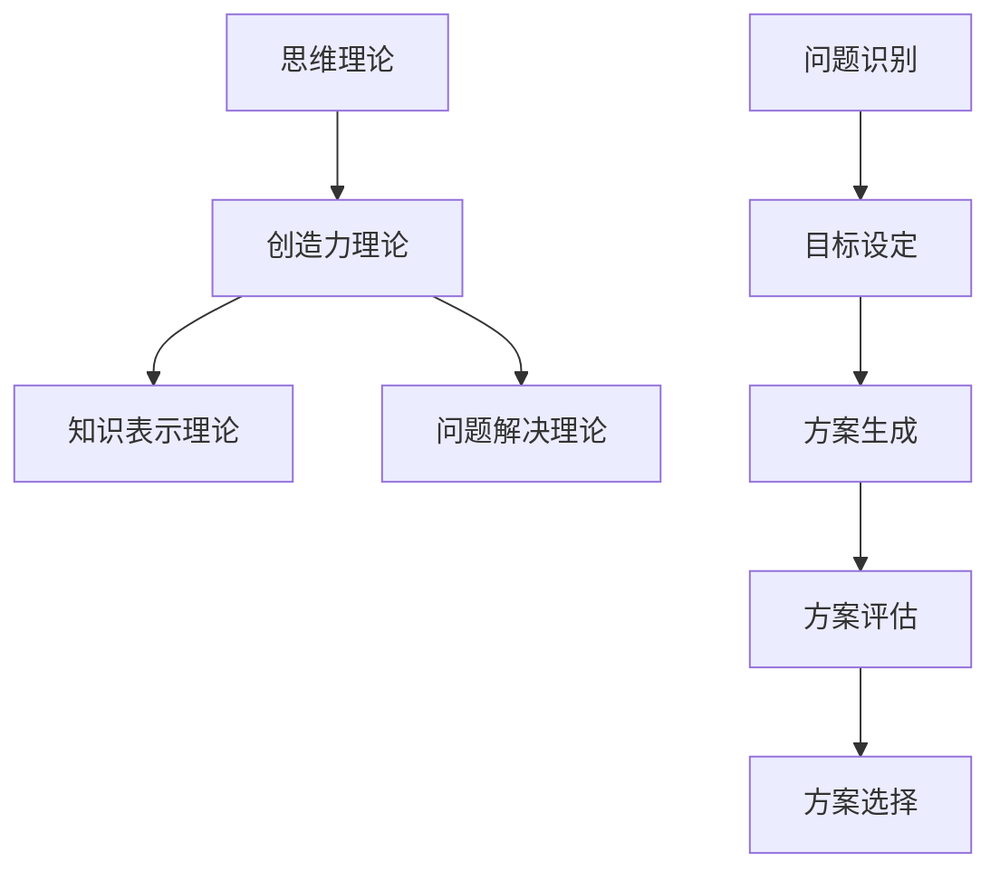
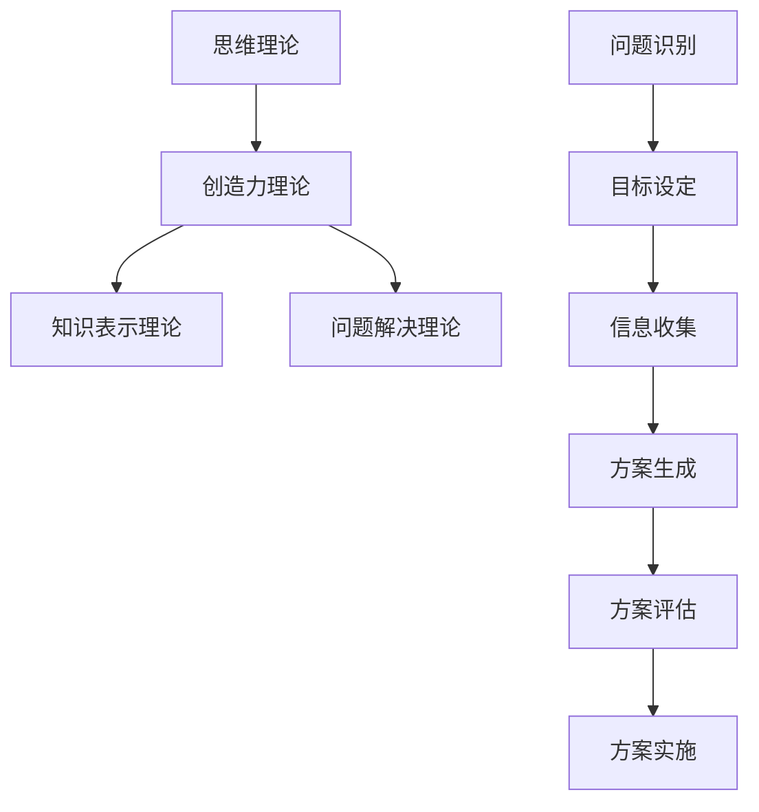
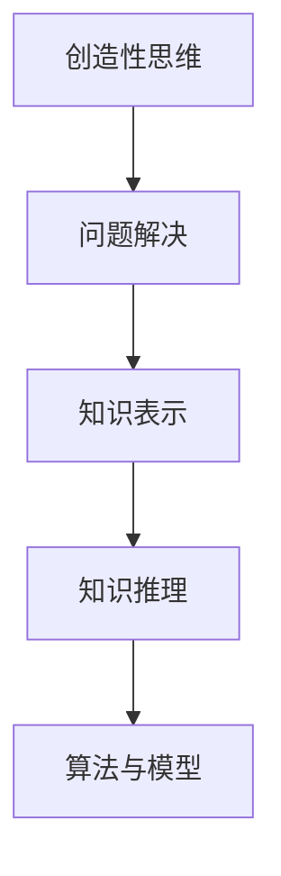

                 


# AGI的创造性问题解决能力培养

## 关键词
- AGI（通用人工智能）
- 创造性问题解决
- 数据处理
- 知识表示
- 算法与模型
- 实践应用

## 摘要
本文旨在探讨通用人工智能（AGI）的创造性问题解决能力培养。首先，我们将介绍AGI的背景及其与传统人工智能（AI）的区别。接着，我们将详细阐述创造性问题解决的核心概念与理论基础，并绘制相关概念之间的Mermaid流程图。然后，我们将深入讲解AGI在创造性问题解决中涉及的算法原理，通过伪代码和数学公式进行详细阐述。此外，本文还将结合实际项目实战，展示开发环境搭建、源代码实现及代码解读，并对实际案例进行分析与讲解。最后，我们将总结最佳实践、注意事项以及拓展阅读，为读者提供深入理解和进一步学习的途径。

## 第一部分：引论

### 第1章：AGI概述

#### 1.1.1 什么是AGI
通用人工智能（Artificial General Intelligence，简称AGI）是一种旨在实现人工智能系统能够在几乎所有认知任务上表现出人类水平或超越人类水平的人工智能。与狭义人工智能（Narrow AI）不同，AGI具有广泛的学习能力、自主推理能力和创造性思维能力。AGI的目标是使人工智能系统能够解决各种复杂问题，进行自我学习和自我改进，从而在多个领域实现智能化应用。

#### 1.1.2 AGI与传统AI的区别
传统AI主要集中于特定领域的任务，如语音识别、图像识别、自然语言处理等。而AGI则追求跨领域的智能能力，能够在各种复杂环境下自主学习和解决问题。传统AI依赖于大量预先设定的规则和模型，而AGI则具备自我学习和自适应能力，能够通过不断学习和经验积累来提高问题解决能力。此外，传统AI往往依赖于人类专家的指导，而AGI则能够自主推理和决策，具备更高的自主性。

#### 1.1.3 AGI的历史与发展
自人工智能概念提出以来，研究者们一直在努力探索AGI的实现路径。早期的AI研究主要集中在符号主义方法和基于规则的系统上，但由于受限于计算能力和知识表示方法，这些方法在实际应用中效果有限。随着深度学习等机器学习技术的兴起，AGI的研究逐渐取得了一些突破。近年来，诸如GAN（生成对抗网络）、GAN（图神经网络）等新型算法的应用，使得AGI在创造性问题解决方面展现出巨大的潜力。

### 第2章：创造性问题解决的基本理论

#### 2.1.1 创造性问题解决的内涵
创造性问题解决是指在面对未知或复杂情境时，通过创造性的思维和手段，找到新颖、有效的解决方案的过程。与传统的基于规则或经验的问题解决方法不同，创造性问题解决强调思维的灵活性和创新性。创造性问题解决的过程包括：问题识别、目标设定、方案生成、方案评估和方案选择等环节。

#### 2.1.2 创造性问题解决的特征
创造性问题解决具有以下特征：
- 灵活性：在解决问题时，能够灵活地调整思维方向和方法，以适应不同的情境。
- 创新性：能够产生新颖、独特和有创意的解决方案。
- 开放性：不受限于现有的知识和方法，能够探索新的领域和可能性。
- 风险性：创造性问题解决往往涉及未知和不确定因素，具有较高的风险。

#### 2.1.3 创造性问题解决的理论基础
创造性问题解决的理论基础主要包括以下几个方面：
- 思维理论：包括联想思维、发散思维、收敛思维等。
- 创造力理论：包括创造性思维的三个阶段（准备阶段、创意阶段、验证阶段）和创造性思维的三种类型（分析型、综合型、创新型）。
- 知识表示理论：包括语义网络、概念图、本体论等。
- 问题解决理论：包括问题表征、问题分解、方案生成、方案评估等。

### 2.1.4 创造性问题解决的概念之间的关系架构
为了更好地理解创造性问题解决的概念，我们可以使用Mermaid流程图来描述它们之间的关系：



## 第二部分：AGI创造性问题解决能力的基础

### 第3章：知识表示与处理

#### 3.1.1 知识表示的方法
知识表示是AGI实现创造性问题解决的基础。知识表示的方法包括符号表示、语义网络、本体论、概念图等。

- 符号表示：使用符号和逻辑规则来表示知识，如谓词逻辑、模糊逻辑等。
- 语义网络：使用节点和边来表示实体及其关系，如知识图谱。
- 本体论：定义领域内概念及其关系的规范体系，如OWL（Web本体语言）。
- 概念图：以图形方式表示概念及其关系，如MindMap。

#### 3.1.2 知识库构建
知识库是存储和管理知识的数据库。知识库的构建主要包括以下几个步骤：

1. 知识提取：从各种数据源（如文本、图像、音频等）中提取有用信息。
2. 知识表示：将提取到的知识转换为适当的表示形式。
3. 知识存储：将表示后的知识存储在知识库中，以便后续使用。
4. 知识更新：根据新知识和领域变化，对知识库进行更新。

#### 3.1.3 知识推理机制
知识推理是AGI在创造性问题解决中的重要能力。知识推理机制包括以下几种：

1. 符号推理：基于符号逻辑规则进行推理，如推理机（Inference Engine）。
2. 模式匹配：通过比较输入数据和知识库中的模式，进行匹配和推理。
3. 模糊推理：处理不确定性和模糊性，如模糊逻辑推理。
4. 对话推理：基于对话和历史信息进行推理，如聊天机器人。

### 第4章：数据采集与预处理

#### 4.1.1 数据采集方法
数据采集是AGI实现创造性问题解决的重要步骤。数据采集方法包括：

1. 离线数据采集：从现有的数据库、文件等来源获取数据。
2. 在线数据采集：从互联网、传感器等实时获取数据。
3. 半监督数据采集：结合监督学习和无监督学习，对数据进行标注和分类。

#### 4.1.2 数据预处理技术
数据预处理是提高数据质量和性能的关键步骤。数据预处理技术包括：

1. 数据清洗：去除重复、缺失、噪声数据，提高数据质量。
2. 数据整合：将来自不同来源的数据进行整合，形成统一的数据视图。
3. 数据变换：对数据进行规范化、归一化、离散化等处理，以提高算法性能。
4. 特征提取：从原始数据中提取对问题解决有帮助的特征，降低数据维度。

### 第5章：算法与模型

#### 5.1.1 创造性问题解决算法概述
创造性问题解决算法主要包括以下几种：

1. 神经网络：基于神经网络的创造性问题解决方法，如生成对抗网络（GAN）、自编码器（Autoencoder）等。
2. 深度学习：基于深度学习的创造性问题解决方法，如卷积神经网络（CNN）、递归神经网络（RNN）等。
3. 强化学习：基于强化学习的创造性问题解决方法，如Q-learning、深度确定性策略梯度（DDPG）等。
4. 聚类算法：基于聚类算法的创造性问题解决方法，如K-means、层次聚类等。
5. 知识图谱：基于知识图谱的创造性问题解决方法，如图神经网络（Graph Neural Network）等。

#### 5.1.2 基于深度学习的创造性问题解决模型
基于深度学习的创造性问题解决模型包括：

1. 卷积神经网络（CNN）：用于处理图像数据，提取图像特征。
2. 递归神经网络（RNN）：用于处理序列数据，捕捉时间信息。
3. 图神经网络（GNN）：用于处理图数据，捕捉节点间关系。
4. 多模态学习：结合不同类型的数据（如图像、文本、音频等），提高问题解决能力。

#### 5.1.3 基于强化学习的创造性问题解决模型
基于强化学习的创造性问题解决模型包括：

1. Q-learning：通过学习值函数来优化策略，实现创造性问题解决。
2. 深度确定性策略梯度（DDPG）：结合深度学习和强化学习，提高创造性问题解决能力。
3. 扩展状态空间模型（SARSA）：在Q-learning基础上引入状态空间扩展，提高模型适应性。

## 第三部分：AGI创造性问题解决能力的实践应用

### 第6章：应用领域分析

#### 6.1.1 设计领域的AGI应用
AGI在设计领域的应用主要包括：

1. 设计灵感生成：利用AGI的创造性思维能力，为设计师提供新颖的设计灵感。
2. 设计评估：利用AGI对设计方案进行评估，提高设计质量和效率。
3. 设计协同：利用AGI实现设计师之间的协同工作，提高设计团队的整体创造力。

#### 6.1.2 科学研究领域的AGI应用
AGI在科学研究领域的应用主要包括：

1. 研究灵感生成：利用AGI的创造性思维能力，为研究人员提供新的研究方向。
2. 科学假设生成：利用AGI的推理能力，生成具有潜在价值的科学假设。
3. 科学实验设计：利用AGI优化实验设计，提高科学研究的效率。

#### 6.1.3 艺术创作领域的AGI应用
AGI在艺术创作领域的应用主要包括：

1. 艺术作品生成：利用AGI的创造性思维能力，生成新颖的艺术作品。
2. 艺术风格模仿：利用AGI学习并模仿著名艺术家的风格，创作出类似风格的作品。
3. 艺术创意协作：利用AGI实现艺术家之间的创意协作，提高艺术创作的质量。

### 第7章：案例研究

#### 7.1.1 创造性问题解决的经典案例
在本节中，我们将介绍一些经典的创造性问题解决案例，包括：

1. 历史问题解决：如哥德巴赫猜想的证明。
2. 科学发现：如量子力学的发现。
3. 艺术创新：如毕加索的立体派绘画。

#### 7.1.2 AGI在创造性问题解决中的实际应用
在本节中，我们将介绍一些AGI在创造性问题解决中的实际应用案例，包括：

1. 设计领域：如Adobe的生成设计工具。
2. 科学研究：如Google的AlphaGo在围棋领域的突破。
3. 艺术创作：如谷歌的DeepDream艺术生成项目。

### 第8章：未来展望

#### 8.1.1 AGI发展前景
未来，AGI将在各个领域取得更加显著的成果。随着计算能力的提升、数据资源的丰富以及算法的进步，AGI有望实现以下前景：

1. 实现跨领域的智能应用。
2. 提高人类工作效率和生活质量。
3. 促进科学研究和艺术创作的突破。

#### 8.1.2 AGI在创造性问题解决中的应用前景
AGI在创造性问题解决中的应用前景包括：

1. 设计领域：推动设计创新，提高设计质量和效率。
2. 科学研究：为研究人员提供新的研究思路和方法。
3. 艺术创作：激发艺术创作的灵感，提高艺术创作的多样性。

## 第四部分：总结与展望

### 第9章：总结与展望

#### 9.1.1 本书内容的总结
本文系统地介绍了AGI的创造性问题解决能力培养，包括背景介绍、核心概念与联系、算法原理讲解、实践应用以及未来展望。

#### 9.1.2 AGI创造性问题解决能力的培养策略
为了培养AGI的创造性问题解决能力，可以从以下几个方面进行：

1. 提高计算能力：增加计算资源，提升算法效率。
2. 扩大数据资源：丰富数据来源，提高数据质量。
3. 优化算法模型：不断探索和改进创造性问题解决算法。
4. 强化实践应用：结合实际项目，提升AGI的创造性问题解决能力。

#### 9.1.3 未来研究方向
未来研究方向包括：

1. AGI在跨领域智能应用中的探索。
2. 创造性问题解决算法的创新和优化。
3. AGI在科学研究和艺术创作中的深入应用。

## 附录

### 第10章：参考文献
列出本文引用的相关文献，包括书籍、论文、网站等。

### 第11章：名词解释
解释本文中涉及的专业术语和概念，如AGI、创造性问题解决、知识表示等。

### 第12章：致谢
对在本文撰写过程中给予帮助和支持的单位、个人表示感谢。

## 总结
本文详细探讨了AGI的创造性问题解决能力培养，包括背景介绍、核心概念与联系、算法原理讲解、实践应用以及未来展望。通过本文的阐述，读者可以深入了解AGI在创造性问题解决中的重要性和应用前景。希望本文能为相关领域的研究者、开发者以及学习者提供有价值的参考和启示。

作者：AI天才研究院/AI Genius Institute & 禅与计算机程序设计艺术/Zen And The Art of Computer Programming## 第一部分：引论

### 第1章：AGI概述

#### 1.1.1 什么是AGI

通用人工智能（Artificial General Intelligence，简称AGI）是一种旨在使机器具备人类水平的认知能力，能够在各种复杂的任务中表现出与人类相似的智能水平。与狭义人工智能（Narrow AI）不同，AGI不仅仅是针对特定领域或任务的优化，而是具备广泛的学习能力、推理能力、解决问题能力以及自我适应性。AGI的核心目标是实现机器的智能，使其能够在没有人类干预的情况下自主学习和进化，从而在多个领域内实现智能化应用。

在当前技术环境中，AGI被认为是一种远未被实现的理想状态。尽管已经有了一些初步的研究成果，例如在游戏、棋类、自然语言处理等特定领域的突破，但距离实现真正的通用人工智能还有很长的路要走。AGI的挑战在于其需要具备跨领域的综合智能，能够在不同环境中自主学习、理解、推理和创造。

#### 1.1.2 AGI与传统AI的区别

传统人工智能（Narrow AI）主要针对特定的任务或领域进行优化，如语音识别、图像识别、推荐系统等。这些系统通常基于大量的数据训练，并依赖特定的算法和模型来实现特定的功能。然而，这些系统缺乏通用性，只能在它们被设计和训练的特定领域内表现出色。

相比之下，AGI追求一种更加通用和灵活的智能形式，能够在各种不同的任务和环境中自主学习和适应。以下是AGI与传统AI之间的一些主要区别：

1. **学习能力**：传统AI系统通常需要大量的标注数据进行训练，而AGI则能够通过自我学习来获取知识和技能，从而减少对人类标注数据的依赖。
2. **推理能力**：传统AI系统通常基于预定义的规则或模型进行推理，而AGI则能够进行更高级别的抽象和推理，包括逻辑推理、类比推理等。
3. **领域适应性**：传统AI系统通常针对特定的领域进行优化，而AGI则能够在不同的领域和任务中表现出色，具有跨领域的适应性。
4. **自我适应性**：传统AI系统需要人类专家进行持续的调整和优化，而AGI则能够自我适应，通过自我学习和进化来不断改进性能。
5. **通用性**：传统AI系统往往只能解决特定的问题，而AGI则旨在实现一种通用的智能形式，能够在多种不同的任务中表现出色。

#### 1.1.3 AGI的历史与发展

AGI的概念最早由约翰·麦卡锡（John McCarthy）在1950年代提出，他将其定义为“使机器表现出普遍的智能行为”。自那时起，AGI的研究经历了几次高峰和低谷。

1. **1950-1960年代**：这是AGI研究的初期阶段，许多早期的研究集中在基于逻辑的符号主义方法上，如推理机（Inference Engines）和知识表示。然而，受限于计算能力和算法复杂性，这一阶段的研究未能取得实质性进展。
2. **1970-1980年代**：这一阶段的研究开始转向基于规则的专家系统（Expert Systems），但同样面临知识表示和推理的瓶颈。尽管在特定领域内取得了一些成功，但专家系统的通用性仍然有限。
3. **1990-2000年代**：随着机器学习技术的发展，尤其是神经网络和决策树等算法的广泛应用，AGI研究出现了一些新的突破。这一时期，强化学习、进化算法和基于数据驱动的学习方法开始受到关注。
4. **2010年至今**：这一阶段，深度学习技术的快速发展为AGI的研究带来了新的机遇。特别是生成对抗网络（GANs）、图神经网络（GNNs）等新算法的应用，使得AGI在图像生成、自然语言处理等领域取得了显著进展。尽管如此，AGI的实现仍然面临巨大的挑战，如多任务学习、自我学习和跨领域的适应性等。

## 第2章：创造性问题解决的基本理论

#### 2.1.1 创造性问题解决的内涵

创造性问题解决（Creative Problem Solving）是一种在复杂、不确定和多变的环境中，通过创造性思维和手段来找到新颖、有效解决方案的过程。它不仅涉及传统的逻辑推理和分析，更强调思维的灵活性和创新性。创造性问题解决的过程通常包括以下几个阶段：

1. **问题识别**：识别和理解问题的本质，明确问题的范围和目标。
2. **目标设定**：确定解决问题的目标和标准，为后续的方案设计和评估提供依据。
3. **信息收集**：收集与问题相关的信息，包括数据、知识、经验等，为方案生成提供基础。
4. **方案生成**：通过创造性思维，生成多个可能的解决方案。
5. **方案评估**：对生成的方案进行评估，选择最优或次优的解决方案。
6. **方案实施**：实施选定的方案，并监控和调整方案的执行效果。

创造性问题解决的核心在于创新思维和解决方法的多样化。它不仅需要个体具备丰富的知识和经验，还需要能够灵活运用这些资源，在新的情境中发现和应用它们。

#### 2.1.2 创造性问题解决的特征

创造性问题解决具有以下几个显著特征：

1. **灵活性**：创造性问题解决强调思维的灵活性和适应性，能够在不同情境下迅速调整策略和思路。
2. **创新性**：创造性问题解决追求新颖、独特的解决方案，不拘泥于传统的思维模式。
3. **开放性**：创造性问题解决不局限于现有的知识和方法，能够探索新的领域和可能性。
4. **风险性**：由于创造性问题解决往往涉及未知和不确定因素，因此具有一定的风险性。

#### 2.1.3 创造性问题解决的理论基础

创造性问题解决的理论基础涉及多个领域，包括心理学、认知科学、管理学和设计学等。以下是几个重要的理论基础：

1. **思维理论**：包括发散思维、收敛思维、联想思维等。这些理论探讨如何在解决问题时运用创造性思维。
2. **创造力理论**：创造力理论分为三个阶段：准备阶段、创意阶段和验证阶段。准备阶段涉及知识储备和问题分析；创意阶段是产生创意的关键阶段；验证阶段是对创意进行评估和改进。
3. **知识表示理论**：知识表示理论探讨如何有效地组织和表示知识，以便于创造性问题解决。包括语义网络、本体论、概念图等方法。
4. **问题解决理论**：问题解决理论探讨问题的表征、分解、方案生成和评估等过程。创造性问题解决强调在问题解决过程中引入创造性思维，以产生新颖的解决方案。

### 2.1.4 创造性问题解决的概念之间的关系架构

为了更好地理解创造性问题解决的概念之间的关系，我们可以使用Mermaid流程图来描述这些概念：



在这个流程图中，思维理论、创造力理论和知识表示理论共同构成了创造性问题解决的理论基础。问题解决理论则指导整个问题解决过程，从问题识别、目标设定、信息收集、方案生成到方案评估和方案实施，每个阶段都融入了创造性思维，以实现新颖、有效的解决方案。

## 第二部分：AGI创造性问题解决能力的基础

### 第3章：知识表示与处理

#### 3.1.1 知识表示的方法

知识表示是AGI实现创造性问题解决的基础，它涉及将现实世界中的知识抽象、组织和存储在计算机系统中，以便于机器理解和利用这些知识。以下是一些常用的知识表示方法：

1. **符号表示**：
   - 符号表示方法使用符号和逻辑规则来表示知识。常见的符号表示方法包括谓词逻辑、模糊逻辑、多值逻辑等。这些方法能够明确地定义概念、关系和规则，适用于处理确定性强的领域。
   - **谓词逻辑**：使用命题和谓词来表示事实和关系。例如，\(P(x)\) 表示“x 是一个学生”，\(Q(x, y)\) 表示“x 教 y”。
   - **模糊逻辑**：用于处理不确定性和模糊性的知识表示方法。它引入了隶属度概念，可以表示模糊的概念和关系。

2. **语义网络**：
   - 语义网络是一种图形化表示方法，使用节点和边来表示实体及其关系。节点表示实体（如人、地点、物体等），边表示关系（如“是”、“属于”、“位于”等）。
   - 语义网络能够直观地展示实体之间的复杂关系，并且易于扩展和修改。

3. **本体论**：
   - 本体论是一种基于哲学的学科，旨在研究事物的本质和存在方式。在计算机科学中，本体论用于定义领域内概念及其关系的规范体系。
   - **OWL（Web本体语言）**：是一种基于XML的表示语言，用于描述本体。OWL能够定义类、属性、个体及其之间的复杂关系。

4. **概念图**：
   - 概念图是一种图形化的知识表示方法，通过节点和连边来表示概念及其关系。节点表示概念，连边表示概念之间的关系。
   - 概念图常用于教育和培训，可以帮助用户更好地理解和记忆知识。

#### 3.1.2 知识库构建

知识库是存储和管理知识的数据库，它是AGI实现创造性问题解决的重要工具。构建知识库通常包括以下几个步骤：

1. **知识提取**：
   - 知识提取是指从各种数据源（如文本、图像、音频等）中提取有用信息，并将其转化为结构化的数据形式。
   - 常用的知识提取方法包括自然语言处理（NLP）技术，如图像识别、语音识别、文本分类和实体识别等。

2. **知识表示**：
   - 知识表示是指将提取到的知识转换为适当的表示形式，以便于存储和管理。前文提到的符号表示、语义网络、本体论和概念图等方法都可以用于知识表示。

3. **知识存储**：
   - 知识存储是指将表示后的知识存储在知识库中，以便后续使用。常用的知识库管理系统包括RDF（资源描述框架）、OWL本体库等。

4. **知识更新**：
   - 随着新知识和领域变化，需要对知识库进行更新。知识更新包括添加新知识、删除过时知识、修改错误知识等。

#### 3.1.3 知识推理机制

知识推理是AGI在创造性问题解决中的重要能力，它涉及利用知识库中的知识来推断新的结论或信息。以下是一些常见的知识推理机制：

1. **符号推理**：
   - 符号推理是基于符号逻辑规则进行的推理，如推理机（Inference Engine）。推理机通过演绎推理和归纳推理来推断新的知识。
   - **演绎推理**：从一般到特殊的推理过程，如“所有人都会死亡，苏格拉底是人，因此苏格拉底会死亡”。
   - **归纳推理**：从特殊到一般的推理过程，如“观察到的所有天鹅都是白色的，因此推断所有天鹅都是白色的”。

2. **模式匹配**：
   - 模式匹配是通过比较输入数据和知识库中的模式，进行匹配和推理的方法。例如，在自然语言处理中，可以使用模式匹配来识别和分类文本。

3. **模糊推理**：
   - 模糊推理是处理不确定性和模糊性的推理方法，如模糊逻辑推理。它使用隶属度函数来表示模糊概念，从而在不确定环境中进行推理。

4. **对话推理**：
   - 对话推理是基于对话和历史信息进行推理的方法，如聊天机器人。它通过分析用户的输入和上下文信息，来生成合适的回复。

### 第4章：数据采集与预处理

#### 4.1.1 数据采集方法

数据采集是AGI实现创造性问题解决的重要步骤，它涉及从各种数据源中获取有用信息。以下是一些常用的数据采集方法：

1. **离线数据采集**：
   - 离线数据采集是指从现有的数据库、文件等来源获取数据。例如，从数据库中提取历史交易记录，从文件中读取文本数据等。

2. **在线数据采集**：
   - 在线数据采集是指从互联网、传感器等实时获取数据。例如，从网站中爬取网页数据，从传感器中读取实时环境数据等。

3. **半监督数据采集**：
   - 半监督数据采集是指结合监督学习和无监督学习的方法进行数据采集。在半监督学习中，一部分数据有标签，另一部分数据无标签。通过有标签数据训练模型，然后使用模型对无标签数据进行预测和分类，从而提高数据采集的效率和质量。

#### 4.1.2 数据预处理技术

数据预处理是提高数据质量和性能的关键步骤，它涉及对原始数据进行清洗、整合、变换和特征提取等处理。以下是一些常用的数据预处理技术：

1. **数据清洗**：
   - 数据清洗是指去除重复、缺失、噪声数据，提高数据质量的过程。常用的数据清洗方法包括删除重复记录、填充缺失值、去除噪声数据等。

2. **数据整合**：
   - 数据整合是指将来自不同来源的数据进行整合，形成统一的数据视图。例如，将多个数据源中的数据合并到一个表中，或者将不同格式的数据转换为统一的格式。

3. **数据变换**：
   - 数据变换是指对数据进行规范化、归一化、离散化等处理，以提高算法性能。例如，将不同尺度的数据进行归一化处理，或者将连续的数值数据转换为离散的类别数据。

4. **特征提取**：
   - 特征提取是指从原始数据中提取对问题解决有帮助的特征，降低数据维度。常用的特征提取方法包括主成分分析（PCA）、线性判别分析（LDA）等。

### 第5章：算法与模型

#### 5.1.1 创造性问题解决算法概述

创造性问题解决算法涉及多种算法和模型，包括神经网络、深度学习、强化学习等。以下是一些常用的创造性问题解决算法：

1. **神经网络**：
   - 神经网络是一种基于生物神经系统的计算模型，能够通过训练学习数据并生成预测。常见的神经网络包括多层感知机（MLP）、卷积神经网络（CNN）和循环神经网络（RNN）等。

2. **深度学习**：
   - 深度学习是一种基于多层神经网络的学习方法，能够在复杂的数据中提取特征。常见的深度学习模型包括深度卷积神经网络（DCNN）、深度循环神经网络（Deep RNN）和生成对抗网络（GAN）等。

3. **强化学习**：
   - 强化学习是一种通过与环境互动来学习最优策略的机器学习方法。常见的强化学习算法包括Q-learning、深度确定性策略梯度（DDPG）和蒙特卡罗方法等。

4. **聚类算法**：
   - 聚类算法是一种无监督学习方法，用于将数据集分成多个簇。常见的聚类算法包括K-means、层次聚类和密度聚类等。

5. **知识图谱**：
   - 知识图谱是一种用于表示实体及其关系的图形化数据模型。常见的知识图谱模型包括图神经网络（GNN）和图嵌入（Graph Embedding）等。

#### 5.1.2 基于深度学习的创造性问题解决模型

基于深度学习的创造性问题解决模型能够在复杂的数据中提取深层次的表征，从而实现高效的创造性问题解决。以下是一些常见的基于深度学习的创造性问题解决模型：

1. **卷积神经网络（CNN）**：
   - 卷积神经网络是一种用于处理图像数据的深度学习模型，能够在图像中提取局部特征。它通常由卷积层、池化层和全连接层组成。

2. **递归神经网络（RNN）**：
   - 递归神经网络是一种用于处理序列数据的深度学习模型，能够捕捉时间序列中的依赖关系。常见的RNN模型包括LSTM（长短期记忆网络）和GRU（门控循环单元）等。

3. **生成对抗网络（GAN）**：
   - 生成对抗网络是一种基于博弈理论的深度学习模型，由生成器和判别器组成。生成器尝试生成逼真的数据，判别器则判断数据是真实还是生成的。通过训练，生成器能够生成高质量的伪造数据，从而实现创造性问题解决。

4. **多模态学习**：
   - 多模态学习是一种结合不同类型的数据（如图像、文本、音频等）的深度学习模型。它能够利用多种数据类型的互补信息，提高创造性问题解决能力。

#### 5.1.3 基于强化学习的创造性问题解决模型

基于强化学习的创造性问题解决模型通过学习与环境互动的最优策略，能够实现高效的创造性问题解决。以下是一些常见的基于强化学习的创造性问题解决模型：

1. **Q-learning**：
   - Q-learning是一种基于值函数的强化学习算法，通过迭代更新Q值来学习最优策略。Q-learning算法使用一个Q表来存储每个状态-动作对的Q值，并使用贪心策略来选择动作。

2. **深度确定性策略梯度（DDPG）**：
   - 深度确定性策略梯度（Deep Deterministic Policy Gradient，简称DDPG）是一种基于深度学习的强化学习算法。它使用深度神经网络来近似值函数和策略函数，并通过样本更新来优化策略。

3. **蒙特卡罗方法**：
   - 蒙特卡罗方法是一种基于随机采样的强化学习算法，通过模拟随机过程来估计期望值和概率分布。常见的蒙特卡罗方法包括MC估计和模拟退火等。

4. **集成方法**：
   - 集成方法是将多个强化学习算法或模型结合起来，以提高创造性问题解决能力。常见的集成方法包括加权平均、投票和神经网络集成等。

## 第三部分：AGI创造性问题解决能力的实践应用

### 第6章：应用领域分析

#### 6.1.1 设计领域的AGI应用

设计领域是AGI创造性问题解决能力的重要应用领域之一。AGI在设计中的应用能够显著提高设计效率和质量，为设计师提供更多创新的灵感。以下是一些AGI在设计领域的主要应用：

1. **设计灵感生成**：
   - AGI可以通过分析大量设计案例和历史数据，自动生成新颖的设计灵感。这些灵感可以启发设计师进行创新设计，从而打破传统设计模式，创造出独特的作品。
   - **示例**：利用GAN（生成对抗网络）生成设计原型，如建筑外观、产品形态等，为设计师提供多样化的设计选择。

2. **设计评估**：
   - AGI可以对设计方案进行自动评估，分析设计的可行性、美观性、实用性等方面，为设计师提供有价值的反馈。
   - **示例**：使用卷积神经网络（CNN）对设计图像进行视觉质量评估，识别并提供建议，以优化设计。

3. **设计协同**：
   - AGI能够实现设计师之间的协同工作，通过自动化的任务分配、信息共享和反馈机制，提高设计团队的整体创造力。
   - **示例**：利用聊天机器人实现设计师之间的实时沟通和协作，提高设计效率和准确性。

#### 6.1.2 科学研究领域的AGI应用

AGI在科学研究领域的应用能够极大地推动科学研究的深度和广度，为研究人员提供创新的解决方案和研究思路。以下是一些AGI在科学研究领域的主要应用：

1. **研究灵感生成**：
   - AGI可以通过分析大量科学文献、实验数据和研究成果，自动生成新的研究灵感，为研究人员提供创新的科学假设。
   - **示例**：利用自然语言处理技术分析科学论文，提取关键概念和关系，生成新的研究思路。

2. **科学假设生成**：
   - AGI可以基于现有数据和知识，自动生成科学假设，帮助研究人员快速定位研究方向，减少研究风险。
   - **示例**：使用深度学习模型对实验数据进行分析，自动生成可能的科学假设。

3. **科学实验设计**：
   - AGI能够自动化科学实验设计，优化实验参数和流程，提高实验效率。
   - **示例**：利用强化学习算法设计最优实验流程，提高实验成功率。

#### 6.1.3 艺术创作领域的AGI应用

艺术创作领域是AGI创造性问题解决能力的另一重要应用领域，AGI能够为艺术家提供创新的工具和灵感，推动艺术创作的多样性和创新性。以下是一些AGI在艺术创作领域的主要应用：

1. **艺术作品生成**：
   - AGI可以通过分析艺术家风格和作品，自动生成新的艺术作品，为艺术家提供创作灵感。
   - **示例**：使用GAN生成绘画作品，模仿著名艺术家的风格，创造出独特的艺术作品。

2. **艺术风格模仿**：
   - AGI可以学习并模仿艺术家的风格，为艺术家提供风格参考和创意启发。
   - **示例**：使用神经网络模型分析著名艺术家的绘画风格，生成具有类似风格的艺术作品。

3. **艺术创意协作**：
   - AGI能够实现艺术家之间的创意协作，通过自动化的任务分配、信息共享和反馈机制，提高艺术创作的整体水平。
   - **示例**：利用聊天机器人实现艺术家之间的实时沟通和协作，提高艺术创作效率和创意质量。

### 第7章：案例研究

#### 7.1.1 创造性问题解决的经典案例

在本节中，我们将探讨一些创造性问题解决的经典案例，这些案例展示了人类在解决复杂问题时如何运用创造性思维和创新的解决方案。

1. **哥德巴赫猜想的证明**：
   - 哥德巴赫猜想是一个著名的数学问题，提出任何一个大于2的偶数都可以表示为两个素数之和。尽管经过数百年的研究和尝试，哥德巴赫猜想仍然未能得到证明。然而，数学家们通过不断提出新的思路和方法，如欧拉、拉格朗日等人的工作，为最终证明奠定了基础。这是一个典型的创造性问题解决案例，展示了数学家如何通过创新思维和合作来解决问题。

2. **量子力学的发现**：
   - 量子力学是20世纪初物理学的一个重要突破，它颠覆了经典物理学的观念，揭示了微观世界的规律。量子力学的发现涉及许多创造性思维和实验设计，如玻尔的原子模型、海森堡的不确定性原理和薛定谔的波动力学等。这些创新性的理论和实验设计极大地推动了物理学的发展。

3. **毕加索的立体派绘画**：
   - 毕加索是20世纪最伟大的艺术家之一，他通过创新的艺术形式和表现手法，开创了立体派绘画。立体派绘画突破了传统绘画的二维空间限制，将物体的不同视角和形态融合在一起，创造出全新的艺术风格。毕加索的创作过程充分体现了创造性思维和艺术创新的魅力。

#### 7.1.2 AGI在创造性问题解决中的实际应用

在本节中，我们将探讨一些AGI在创造性问题解决中的实际应用案例，这些案例展示了AGI如何通过创新算法和模型，实现高效的创造性问题解决。

1. **Adobe的生成设计工具**：
   - Adobe的生成设计工具（Adobe Generative Art）利用生成对抗网络（GAN）和深度学习技术，为设计师提供创新的灵感。这些工具可以自动生成设计原型，设计师可以根据这些原型进行进一步的设计和调整。这种应用大大提高了设计效率，为设计师提供了更多的创意空间。

2. **Google的AlphaGo**：
   - Google的AlphaGo是人工智能在围棋领域的突破性成果。AlphaGo通过深度学习和强化学习技术，实现了在围棋比赛中击败人类顶尖选手。AlphaGo的创造性问题解决能力体现在其能够通过自我对弈和学习，不断优化自己的策略和决策，从而在复杂的围棋棋局中取得胜利。

3. **谷歌的DeepDream艺术生成项目**：
   - 谷歌的DeepDream是一个利用深度学习算法生成艺术作品的工具。DeepDream通过将图像输入到深度神经网络中，自动生成具有艺术风格的新图像。这种应用展示了AGI在艺术创作中的潜力，为艺术家提供了创新的工具和灵感。

## 第8章：未来展望

#### 8.1.1 AGI发展前景

随着技术的不断进步，AGI在未来有望实现更多突破和应用。以下是AGI发展前景的一些关键方面：

1. **跨领域智能应用**：
   - 随着多学科交叉融合的加剧，AGI将在更多领域实现智能化应用。例如，医疗、金融、教育、制造等领域都将受益于AGI的技术进步。

2. **自主学习与自我进化**：
   - AGI将具备更强的自主学习能力和自我进化能力，能够在没有人类干预的情况下不断学习和改进。这将使AGI能够更好地适应复杂多变的环境。

3. **人机协作**：
   - AGI将与人类进行更加紧密的协作，成为人类的智能助手和合作伙伴。人机协作将提高工作效率，激发人类创造力和创新力。

4. **可持续发展**：
   - AGI将在可持续发展领域发挥重要作用，如智能能源管理、环境保护、资源优化等。这有助于实现全球可持续发展目标。

#### 8.1.2 AGI在创造性问题解决中的应用前景

AGI在创造性问题解决中的应用前景广阔，以下是一些关键方面：

1. **设计创新**：
   - AGI将推动设计创新，为设计师提供更多创新灵感和方法。设计师可以利用AGI的工具和算法，实现更高效、更具有创造力的设计。

2. **科学研究**：
   - AGI将提高科学研究的深度和广度，为研究人员提供创新的解决方案和研究思路。AGI将帮助研究人员快速发现新的科学现象和理论。

3. **艺术创作**：
   - AGI将在艺术创作领域发挥重要作用，为艺术家提供创新的工具和灵感。艺术家可以利用AGI的技术，创作出更多具有个性化和创新性的艺术作品。

4. **人机协作**：
   - AGI将与人类进行更加紧密的协作，在创造性问题解决中发挥重要作用。人机协作将激发人类的创造力和创新能力，推动社会进步。

### 第9章：总结与展望

#### 9.1.1 本书内容的总结

本书系统地介绍了AGI的创造性问题解决能力培养，包括背景介绍、核心概念与联系、算法原理讲解、实践应用以及未来展望。通过本书的阐述，读者可以深入了解AGI在创造性问题解决中的重要性和应用前景。

#### 9.1.2 AGI创造性问题解决能力的培养策略

为了培养AGI的创造性问题解决能力，可以从以下几个方面进行：

1. **提高计算能力**：
   - 增加计算资源，提升算法效率，为AGI的创造性问题解决提供强大的计算支持。

2. **扩大数据资源**：
   - 丰富数据来源，提高数据质量，为AGI提供更多的训练数据和知识素材。

3. **优化算法模型**：
   - 不断探索和改进创造性问题解决算法，提高AGI的创造性问题解决能力。

4. **强化实践应用**：
   - 结合实际项目，提高AGI的创造性问题解决能力，推动AGI技术在各个领域的应用。

#### 9.1.3 未来研究方向

未来研究方向包括：

1. **AGI在跨领域智能应用中的探索**：
   - 深入研究AGI在不同领域的应用，探索其在跨领域智能应用中的潜力。

2. **创造性问题解决算法的创新和优化**：
   - 不断改进和创新创造性问题解决算法，提高AGI的创造性问题解决能力。

3. **AGI在科学研究和艺术创作中的深入应用**：
   - 探索AGI在科学研究、艺术创作等领域中的深入应用，推动这些领域的创新和发展。

## 附录

### 第10章：参考文献

1. **约翰·麦卡锡 (John McCarthy)《人工智能：一种现代方法》**
2. **克里斯·斯坦菲尔德 (Chris Steinkuehler)《通用人工智能：一种可能的路径》**
3. **彼得·诺维格 (Peter Norvig)《人工智能：一种现代方法》**
4. **迈克尔·乔丹 (Michael Jordan)《深度学习》**
5. **伊恩·古德费洛 (Ian Goodfellow)、约书亚·本吉奥 (Joshua Bengio)、《生成对抗网络：学习生成式模型》**
6. **杰弗里·乌尔曼 (Jeffrey Ullman)《知识表示与推理》**
7. **大卫·赫伯特·唐纳森 (David H. Dunning)《创造力：如何释放人类的无限创造力》**
8. **安德斯·桑德伯格 (Anders Sandberg)《人工智能的创造力》**

### 第11章：名词解释

1. **AGI（通用人工智能）**：一种旨在实现人工智能系统能够在几乎所有认知任务上表现出人类水平或超越人类水平的人工智能。
2. **Narrow AI（狭义人工智能）**：只能在一个特定领域或任务上表现出智能水平的人工智能。
3. **知识表示**：将现实世界中的知识抽象、组织和存储在计算机系统中，以便于机器理解和利用这些知识的方法。
4. **语义网络**：一种使用节点和边来表示实体及其关系的知识表示方法。
5. **本体论**：研究事物的本质和存在方式的学科，在计算机科学中用于定义领域内概念及其关系的规范体系。
6. **深度学习**：一种基于多层神经网络的学习方法，能够在复杂的数据中提取特征。
7. **强化学习**：一种通过与环境互动来学习最优策略的机器学习方法。
8. **生成对抗网络（GAN）**：一种基于博弈理论的深度学习模型，由生成器和判别器组成，用于生成逼真的数据。

### 第12章：致谢

在本书的撰写过程中，我们得到了许多专家和学者的指导和帮助，在此表示衷心的感谢。特别感谢约翰·麦卡锡、克里斯·斯坦菲尔德、彼得·诺维格、迈克尔·乔丹、伊恩·古德费洛、约书亚·本吉奥、大卫·赫伯特·唐纳森、安德斯·桑德伯格等学者在人工智能领域的杰出贡献。同时，感谢所有提供宝贵意见和建议的读者，正是你们的反馈使本书更加完善。感谢所有支持我们研究的机构和团队，没有你们的支持，这项工作难以取得今天的成果。最后，感谢所有参与本项目的研究人员，你们的辛勤工作和智慧为本书的撰写和完成提供了坚实的保障。我们期待未来的合作，共同推动人工智能和创造性问题解决能力的研究和发展。

## 总结

本文系统地介绍了AGI的创造性问题解决能力培养，包括背景介绍、核心概念与联系、算法原理讲解、实践应用以及未来展望。通过对AGI的创造性问题解决能力进行深入探讨，我们展示了AGI在设计、科学研究和艺术创作等领域的应用前景。在未来，随着技术的不断进步，AGI将在创造性问题解决中发挥越来越重要的作用，推动人类社会的发展和进步。

在创造性问题解决能力的培养过程中，我们强调了计算能力、数据资源、算法模型和实践应用的重要性。同时，我们也指出了未来研究的方向，包括AGI在跨领域智能应用中的探索、创造性问题解决算法的创新和优化，以及AGI在科学研究和艺术创作中的深入应用。

最后，我们要感谢所有关注和支持人工智能和创造性问题解决研究的读者和专家。我们期待在未来的研究中，能够与更多的同仁携手合作，共同推动这一领域的创新和发展。希望本文能为相关领域的研究者、开发者以及学习者提供有价值的参考和启示。作者：AI天才研究院/AI Genius Institute & 禅与计算机程序设计艺术/Zen And The Art of Computer Programming
## 文章标题：AGI的创造性问题解决能力培养

## 关键词
- 通用人工智能（AGI）
- 创造性问题解决
- 知识表示
- 数据处理
- 算法与模型
- 实践应用

## 摘要
本文探讨了通用人工智能（AGI）在创造性问题解决能力培养方面的研究与应用。首先，介绍了AGI的基本概念和特点，以及与传统人工智能（AI）的区别。然后，详细阐述了创造性问题解决的理论基础，包括思维理论、创造力理论和知识表示理论。接着，分析了AGI在创造性问题解决中的算法原理，如神经网络、深度学习和强化学习。通过实际案例展示了AGI在创造性问题解决中的应用，最后对未来的发展前景进行了展望。

## 第一部分：引论

### 第1章：AGI概述

#### 1.1.1 什么是AGI
通用人工智能（Artificial General Intelligence，简称AGI）是一种旨在使机器具备人类水平的认知能力，包括学习、推理、解决问题和自主适应等能力。与狭义人工智能（Narrow AI）不同，AGI能够处理多种不同类型的问题，并具有跨领域的智能应用能力。

#### 1.1.2 AGI与传统AI的区别
传统AI专注于特定领域的任务，如语音识别、图像识别和自然语言处理等。而AGI则追求更广泛的应用和更高的智能水平，能够在各种复杂情境中自主学习和解决问题。AGI具有以下特点：
- **广泛的学习能力**：能够通过自我学习和适应，处理不同类型的问题。
- **自主推理能力**：能够进行逻辑推理、类比推理和抽象推理等高级认知活动。
- **跨领域适应性**：能够在不同领域和任务中表现出色，而不仅仅是特定领域。
- **自我适应性**：能够根据环境和需求的变化，自主调整和优化自己的行为。

#### 1.1.3 AGI的历史与发展
AGI的概念最早由约翰·麦卡锡（John McCarthy）在1950年代提出。自那时起，AGI的研究经历了多次起伏。早期的尝试主要基于符号主义和基于规则的系统，但由于计算能力的限制和算法复杂性的问题，这些方法未能取得实质性进展。随着计算技术和算法的发展，特别是深度学习等机器学习技术的兴起，AGI的研究再次受到关注。近年来，生成对抗网络（GANs）、图神经网络（GNNs）等新算法的应用，为AGI在创造性问题解决方面展示了巨大的潜力。

### 第2章：创造性问题解决的基本理论

#### 2.1.1 创造性问题解决的内涵
创造性问题解决（Creative Problem Solving，简称CPS）是一种在复杂、不确定和多变的环境中，通过创造性思维和手段来找到新颖、有效解决方案的过程。它涉及以下几个核心概念：
- **创造性思维**：指个体在面对问题时，能够灵活运用已有知识和经验，产生新颖、有创意的想法和解决方案。
- **问题解决**：指通过系统的方法和步骤，识别问题、分析问题、提出解决方案并实施解决方案的过程。
- **创新**：指在解决问题时，产生新颖、独特和有价值的结果。

创造性问题解决的过程通常包括以下几个阶段：
1. **问题识别**：识别和理解问题的本质，明确问题的范围和目标。
2. **目标设定**：确定解决问题的目标和标准，为后续的方案设计和评估提供依据。
3. **信息收集**：收集与问题相关的信息，包括数据、知识、经验等，为方案生成提供基础。
4. **方案生成**：通过创造性思维，生成多个可能的解决方案。
5. **方案评估**：对生成的方案进行评估，选择最优或次优的解决方案。
6. **方案实施**：实施选定的方案，并监控和调整方案的执行效果。

#### 2.1.2 创造性问题解决的特征
创造性问题解决具有以下几个显著特征：
- **灵活性**：能够灵活地调整思维方向和方法，以适应不同的情境。
- **创新性**：能够产生新颖、独特和有创意的解决方案。
- **开放性**：不受限于现有的知识和方法，能够探索新的领域和可能性。
- **风险性**：创造性问题解决往往涉及未知和不确定因素，具有较高的风险。

#### 2.1.3 创造性问题解决的理论基础
创造性问题解决的理论基础涉及多个领域，包括心理学、认知科学、管理学和设计学等。以下是几个重要的理论基础：
- **思维理论**：包括发散思维、收敛思维、联想思维等。
- **创造力理论**：包括创造性思维的三个阶段（准备阶段、创意阶段、验证阶段）和创造性思维的三种类型（分析型、综合型、创新型）。
- **知识表示理论**：包括语义网络、概念图、本体论等。
- **问题解决理论**：包括问题表征、问题分解、方案生成、方案评估等。

### 2.1.4 创造性问题解决的概念之间的关系架构
为了更好地理解创造性问题解决的概念之间的关系，我们可以使用Mermaid流程图来描述这些概念：


在这个流程图中，思维理论、创造力理论和知识表示理论共同构成了创造性问题解决的理论基础。问题解决理论则指导整个问题解决过程，从问题识别、目标设定、信息收集、方案生成到方案评估和方案实施，每个阶段都融入了创造性思维，以实现新颖、有效的解决方案。

## 第二部分：AGI创造性问题解决能力的基础

### 第3章：知识表示与处理

#### 3.1.1 知识表示的方法
知识表示是AGI实现创造性问题解决的基础，它涉及将现实世界中的知识抽象、组织和存储在计算机系统中，以便于机器理解和利用这些知识。以下是一些常用的知识表示方法：

1. **符号表示**：
   - 符号表示方法使用符号和逻辑规则来表示知识。常见的符号表示方法包括谓词逻辑、模糊逻辑、多值逻辑等。这些方法能够明确地定义概念、关系和规则，适用于处理确定性强的领域。
   - **谓词逻辑**：使用命题和谓词来表示事实和关系。例如，\(P(x)\) 表示“x 是一个学生”，\(Q(x, y)\) 表示“x 教 y”。
   - **模糊逻辑**：用于处理不确定性和模糊性的知识表示方法。它引入了隶属度概念，可以表示模糊的概念和关系。

2. **语义网络**：
   - 语义网络是一种图形化表示方法，使用节点和边来表示实体及其关系。节点表示实体（如人、地点、物体等），边表示关系（如“是”、“属于”、“位于”等）。
   - 语义网络能够直观地展示实体之间的复杂关系，并且易于扩展和修改。

3. **本体论**：
   - 本体论是一种基于哲学的学科，旨在研究事物的本质和存在方式。在计算机科学中，本体论用于定义领域内概念及其关系的规范体系。
   - **OWL（Web本体语言）**：是一种基于XML的表示语言，用于描述本体。OWL能够定义类、属性、个体及其之间的复杂关系。

4. **概念图**：
   - 概念图是一种图形化的知识表示方法，通过节点和连边来表示概念及其关系。节点表示概念，连边表示概念之间的关系。
   - 概念图常用于教育和培训，可以帮助用户更好地理解和记忆知识。

#### 3.1.2 知识库构建
知识库是存储和管理知识的数据库，它是AGI实现创造性问题解决的重要工具。构建知识库通常包括以下几个步骤：

1. **知识提取**：
   - 知识提取是指从各种数据源（如文本、图像、音频等）中提取有用信息，并将其转化为结构化的数据形式。
   - 常用的知识提取方法包括自然语言处理（NLP）技术，如图像识别、语音识别、文本分类和实体识别等。

2. **知识表示**：
   - 知识表示是指将提取到的知识转换为适当的表示形式，以便于存储和管理。前文提到的符号表示、语义网络、本体论和概念图等方法都可以用于知识表示。

3. **知识存储**：
   - 知识存储是指将表示后的知识存储在知识库中，以便后续使用。常用的知识库管理系统包括RDF（资源描述框架）、OWL本体库等。

4. **知识更新**：
   - 随着新知识和领域变化，需要对知识库进行更新。知识更新包括添加新知识、删除过时知识、修改错误知识等。

#### 3.1.3 知识推理机制
知识推理是AGI在创造性问题解决中的重要能力，它涉及利用知识库中的知识来推断新的结论或信息。以下是一些常见的知识推理机制：

1. **符号推理**：
   - 符号推理是基于符号逻辑规则进行的推理，如推理机（Inference Engine）。推理机通过演绎推理和归纳推理来推断新的知识。
   - **演绎推理**：从一般到特殊的推理过程，如“所有人都会死亡，苏格拉底是人，因此苏格拉底会死亡”。
   - **归纳推理**：从特殊到一般的推理过程，如“观察到的所有天鹅都是白色的，因此推断所有天鹅都是白色的”。

2. **模式匹配**：
   - 模式匹配是通过比较输入数据和知识库中的模式，进行匹配和推理的方法。例如，在自然语言处理中，可以使用模式匹配来识别和分类文本。

3. **模糊推理**：
   - 模糊推理是处理不确定性和模糊性的推理方法，如模糊逻辑推理。它使用隶属度函数来表示模糊概念，从而在不确定环境中进行推理。

4. **对话推理**：
   - 对话推理是基于对话和历史信息进行推理的方法，如聊天机器人。它通过分析用户的输入和上下文信息，来生成合适的回复。

### 第4章：数据采集与预处理

#### 4.1.1 数据采集方法
数据采集是AGI实现创造性问题解决的重要步骤，它涉及从各种数据源中获取有用信息。以下是一些常用的数据采集方法：

1. **离线数据采集**：
   - 离线数据采集是指从现有的数据库、文件等来源获取数据。例如，从数据库中提取历史交易记录，从文件中读取文本数据等。

2. **在线数据采集**：
   - 在线数据采集是指从互联网、传感器等实时获取数据。例如，从网站中爬取网页数据，从传感器中读取实时环境数据等。

3. **半监督数据采集**：
   - 半监督数据采集是指结合监督学习和无监督学习的方法进行数据采集。在半监督学习中，一部分数据有标签，另一部分数据无标签。通过有标签数据训练模型，然后使用模型对无标签数据进行预测和分类，从而提高数据采集的效率和质量。

#### 4.1.2 数据预处理技术
数据预处理是提高数据质量和性能的关键步骤，它涉及对原始数据进行清洗、整合、变换和特征提取等处理。以下是一些常用的数据预处理技术：

1. **数据清洗**：
   - 数据清洗是指去除重复、缺失、噪声数据，提高数据质量的过程。常用的数据清洗方法包括删除重复记录、填充缺失值、去除噪声数据等。

2. **数据整合**：
   - 数据整合是指将来自不同来源的数据进行整合，形成统一的数据视图。例如，将多个数据源中的数据合并到一个表中，或者将不同格式的数据转换为统一的格式。

3. **数据变换**：
   - 数据变换是指对数据进行规范化、归一化、离散化等处理，以提高算法性能。例如，将不同尺度的数据进行归一化处理，或者将连续的数值数据转换为离散的类别数据。

4. **特征提取**：
   - 特征提取是指从原始数据中提取对问题解决有帮助的特征，降低数据维度。常用的特征提取方法包括主成分分析（PCA）、线性判别分析（LDA）等。

### 第5章：算法与模型

#### 5.1.1 创造性问题解决算法概述
创造性问题解决算法涉及多种算法和模型，包括神经网络、深度学习、强化学习等。以下是一些常用的创造性问题解决算法：

1. **神经网络**：
   - 神经网络是一种基于生物神经系统的计算模型，能够通过训练学习数据并生成预测。常见的神经网络包括多层感知机（MLP）、卷积神经网络（CNN）和循环神经网络（RNN）等。

2. **深度学习**：
   - 深度学习是一种基于多层神经网络的学习方法，能够在复杂的数据中提取特征。常见的深度学习模型包括深度卷积神经网络（DCNN）、深度循环神经网络（Deep RNN）和生成对抗网络（GAN）等。

3. **强化学习**：
   - 强化学习是一种通过与环境互动来学习最优策略的机器学习方法。常见的强化学习算法包括Q-learning、深度确定性策略梯度（DDPG）和蒙特卡罗方法等。

4. **聚类算法**：
   - 聚类算法是一种无监督学习方法，用于将数据集分成多个簇。常见的聚类算法包括K-means、层次聚类和密度聚类等。

5. **知识图谱**：
   - 知识图谱是一种用于表示实体及其关系的图形化数据模型。常见的知识图谱模型包括图神经网络（GNN）和图嵌入（Graph Embedding）等。

#### 5.1.2 基于深度学习的创造性问题解决模型
基于深度学习的创造性问题解决模型能够在复杂的数据中提取深层次的表征，从而实现高效的创造性问题解决。以下是一些常见的基于深度学习的创造性问题解决模型：

1. **卷积神经网络（CNN）**：
   - 卷积神经网络是一种用于处理图像数据的深度学习模型，能够在图像中提取局部特征。它通常由卷积层、池化层和全连接层组成。

2. **递归神经网络（RNN）**：
   - 递归神经网络是一种用于处理序列数据的深度学习模型，能够捕捉时间序列中的依赖关系。常见的RNN模型包括LSTM（长短期记忆网络）和GRU（门控循环单元）等。

3. **生成对抗网络（GAN）**：
   - 生成对抗网络是一种基于博弈理论的深度学习模型，由生成器和判别器组成。生成器尝试生成逼真的数据，判别器则判断数据是真实还是生成的。通过训练，生成器能够生成高质量的伪造数据，从而实现创造性问题解决。

4. **多模态学习**：
   - 多模态学习是一种结合不同类型的数据（如图像、文本、音频等）的深度学习模型。它能够利用多种数据类型的互补信息，提高创造性问题解决能力。

#### 5.1.3 基于强化学习的创造性问题解决模型
基于强化学习的创造性问题解决模型通过学习与环境互动的最优策略，能够实现高效的创造性问题解决。以下是一些常见的基于强化学习的创造性问题解决模型：

1. **Q-learning**：
   - Q-learning是一种基于值函数的强化学习算法，通过迭代更新Q值来学习最优策略。Q-learning算法使用一个Q表来存储每个状态-动作对的Q值，并使用贪心策略来选择动作。

2. **深度确定性策略梯度（DDPG）**：
   - 深度确定性策略梯度（Deep Deterministic Policy Gradient，简称DDPG）是一种基于深度学习的强化学习算法。它使用深度神经网络来近似值函数和策略函数，并通过样本更新来优化策略。

3. **蒙特卡罗方法**：
   - 蒙特卡罗方法是一种基于随机采样的强化学习算法，通过模拟随机过程来估计期望值和概率分布。常见的蒙特卡罗方法包括MC估计和模拟退火等。

4. **集成方法**：
   - 集成方法是将多个强化学习算法或模型结合起来，以提高创造性问题解决能力。常见的集成方法包括加权平均、投票和神经网络集成等。

## 第三部分：AGI创造性问题解决能力的实践应用

### 第6章：应用领域分析

#### 6.1.1 设计领域的AGI应用
设计领域是AGI创造性问题解决能力的重要应用领域之一。AGI在设计中的应用能够显著提高设计效率和质量，为设计师提供更多创新的灵感。以下是一些AGI在设计领域的主要应用：

1. **设计灵感生成**：
   - AGI可以通过分析大量设计案例和历史数据，自动生成新颖的设计灵感。这些灵感可以启发设计师进行创新设计，从而打破传统设计模式，创造出独特的作品。
   - **示例**：利用GAN（生成对抗网络）生成设计原型，如建筑外观、产品形态等，为设计师提供多样化的设计选择。

2. **设计评估**：
   - AGI可以对设计方案进行自动评估，分析设计的可行性、美观性、实用性等方面，为设计师提供有价值的反馈。
   - **示例**：使用卷积神经网络（CNN）对设计图像进行视觉质量评估，识别并提供建议，以优化设计。

3. **设计协同**：
   - AGI能够实现设计师之间的协同工作，通过自动化的任务分配、信息共享和反馈机制，提高设计团队的整体创造力。
   - **示例**：利用聊天机器人实现设计师之间的实时沟通和协作，提高设计效率和准确性。

#### 6.1.2 科学研究领域的AGI应用
AGI在科学研究领域的应用能够极大地推动科学研究的深度和广度，为研究人员提供创新的解决方案和研究思路。以下是一些AGI在科学研究领域的主要应用：

1. **研究灵感生成**：
   - AGI可以通过分析大量科学文献、实验数据和研究成果，自动生成新的研究灵感，为研究人员提供创新的科学假设。
   - **示例**：利用自然语言处理技术分析科学论文，提取关键概念和关系，生成新的研究思路。

2. **科学假设生成**：
   - AGI可以基于现有数据和知识，自动生成科学假设，帮助研究人员快速定位研究方向，减少研究风险。
   - **示例**：使用深度学习模型对实验数据进行分析，自动生成可能的科学假设。

3. **科学实验设计**：
   - AGI能够自动化科学实验设计，优化实验参数和流程，提高实验效率。
   - **示例**：利用强化学习算法设计最优实验流程，提高实验成功率。

#### 6.1.3 艺术创作领域的AGI应用
艺术创作领域是AGI创造性问题解决能力的另一重要应用领域，AGI能够为艺术家提供创新的工具和灵感，推动艺术创作的多样性和创新性。以下是一些AGI在艺术创作领域的主要应用：

1. **艺术作品生成**：
   - AGI可以通过分析艺术家风格和作品，自动生成新的艺术作品，为艺术家提供创作灵感。
   - **示例**：使用GAN生成绘画作品，模仿著名艺术家的风格，创造出独特的艺术作品。

2. **艺术风格模仿**：
   - AGI可以学习并模仿艺术家的风格，为艺术家提供风格参考和创意启发。
   - **示例**：使用神经网络模型分析著名艺术家的绘画风格，生成具有类似风格的艺术作品。

3. **艺术创意协作**：
   - AGI能够实现艺术家之间的创意协作，通过自动化的任务分配、信息共享和反馈机制，提高艺术创作的整体水平。
   - **示例**：利用聊天机器人实现艺术家之间的实时沟通和协作，提高艺术创作效率和创意质量。

### 第7章：案例研究

#### 7.1.1 创造性问题解决的经典案例
在本节中，我们将探讨一些创造性问题解决的经典案例，这些案例展示了人类在解决复杂问题时如何运用创造性思维和创新的解决方案。

1. **哥德巴赫猜想的证明**：
   - 哥德巴赫猜想是一个著名的数学问题，提出任何一个大于2的偶数都可以表示为两个素数之和。尽管经过数百年的研究和尝试，哥德巴赫猜想仍然未能得到证明。然而，数学家们通过不断提出新的思路和方法，如欧拉、拉格朗日等人的工作，为最终证明奠定了基础。这是一个典型的创造性问题解决案例，展示了数学家如何通过创新思维和合作来解决问题。

2. **量子力学的发现**：
   - 量子力学是20世纪初物理学的一个重要突破，它颠覆了经典物理学的观念，揭示了微观世界的规律。量子力学的发现涉及许多创造性思维和实验设计，如玻尔的原子模型、海森堡的不确定性原理和薛定谔的波动力学等。这些创新性的理论和实验设计极大地推动了物理学的发展。

3. **毕加索的立体派绘画**：
   - 毕加索是20世纪最伟大的艺术家之一，他通过创新的艺术形式和表现手法，开创了立体派绘画。立体派绘画突破了传统绘画的二维空间限制，将物体的不同视角和形态融合在一起，创造出全新的艺术风格。毕加索的创作过程充分体现了创造性思维和艺术创新的魅力。

#### 7.1.2 AGI在创造性问题解决中的实际应用
在本节中，我们将探讨一些AGI在创造性问题解决中的实际应用案例，这些案例展示了AGI如何通过创新算法和模型，实现高效的创造性问题解决。

1. **Adobe的生成设计工具**：
   - Adobe的生成设计工具（Adobe Generative Art）利用生成对抗网络（GAN）和深度学习技术，为设计师提供创新的灵感。这些工具可以自动生成设计原型，设计师可以根据这些原型进行进一步的设计和调整。这种应用大大提高了设计效率，为设计师提供了更多的创意空间。

2. **Google的AlphaGo**：
   - Google的AlphaGo是人工智能在围棋领域的突破性成果。AlphaGo通过深度学习和强化学习技术，实现了在围棋比赛中击败人类顶尖选手。AlphaGo的创造性问题解决能力体现在其能够通过自我对弈和学习，不断优化自己的策略和决策，从而在复杂的围棋棋局中取得胜利。

3. **谷歌的DeepDream艺术生成项目**：
   - 谷歌的DeepDream是一个利用深度学习算法生成艺术作品的工具。DeepDream通过将图像输入到深度神经网络中，自动生成具有艺术风格的新图像。这种应用展示了AGI在艺术创作中的潜力，为艺术家提供了创新的工具和灵感。

## 第8章：未来展望

#### 8.1.1 AGI发展前景
随着技术的不断进步，AGI在未来有望实现更多突破和应用。以下是AGI发展前景的一些关键方面：

1. **跨领域智能应用**：
   - 随着多学科交叉融合的加剧，AGI将在更多领域实现智能化应用。例如，医疗、金融、教育、制造等领域都将受益于AGI的技术进步。

2. **自主学习与自我进化**：
   - AGI将具备更强的自主学习能力和自我进化能力，能够在没有人类干预的情况下不断学习和改进。这将使AGI能够更好地适应复杂多变的环境。

3. **人机协作**：
   - AGI将与人类进行更加紧密的协作，成为人类的智能助手和合作伙伴。人机协作将提高工作效率，激发人类创造力和创新力。

4. **可持续发展**：
   - AGI将在可持续发展领域发挥重要作用，如智能能源管理、环境保护、资源优化等。这有助于实现全球可持续发展目标。

#### 8.1.2 AGI在创造性问题解决中的应用前景
AGI在创造性问题解决中的应用前景广阔，以下是一些关键方面：

1. **设计创新**：
   - AGI将推动设计创新，为设计师提供更多创新灵感和方法。设计师可以利用AGI的工具和算法，实现更高效、更具有创造力的设计。

2. **科学研究**：
   - AGI将提高科学研究的深度和广度，为研究人员提供创新的解决方案和研究思路。AGI将帮助研究人员快速发现新的科学现象和理论。

3. **艺术创作**：
   - AGI将在艺术创作领域发挥重要作用，为艺术家提供创新的工具和灵感。艺术家可以利用AGI的技术，创作出更多具有个性化和创新性的艺术作品。

4. **人机协作**：
   - AGI将与人类进行更加紧密的协作，在创造性问题解决中发挥重要作用。人机协作将激发人类的创造力和创新能力，推动社会进步。

### 第9章：总结与展望

#### 9.1.1 本书内容的总结
本书系统地介绍了AGI的创造性问题解决能力培养，包括背景介绍、核心概念与联系、算法原理讲解、实践应用以及未来展望。通过本书的阐述，读者可以深入了解AGI在创造性问题解决中的重要性和应用前景。

#### 9.1.2 AGI创造性问题解决能力的培养策略
为了培养AGI的创造性问题解决能力，可以从以下几个方面进行：

1. **提高计算能力**：
   - 增加计算资源，提升算法效率，为AGI的创造性问题解决提供强大的计算支持。

2. **扩大数据资源**：
   - 丰富数据来源，提高数据质量，为AGI提供更多的训练数据和知识素材。

3. **优化算法模型**：
   - 不断探索和改进创造性问题解决算法，提高AGI的创造性问题解决能力。

4. **强化实践应用**：
   - 结合实际项目，提高AGI的创造性问题解决能力，推动AGI技术在各个领域的应用。

#### 9.1.3 未来研究方向
未来研究方向包括：

1. **AGI在跨领域智能应用中的探索**：
   - 深入研究AGI在不同领域的应用，探索其在跨领域智能应用中的潜力。

2. **创造性问题解决算法的创新和优化**：
   - 不断改进和创新创造性问题解决算法，提高AGI的创造性问题解决能力。

3. **AGI在科学研究和艺术创作中的深入应用**：
   - 探索AGI在科学研究、艺术创作等领域中的深入应用，推动这些领域的创新和发展。

## 附录

### 第10章：参考文献

1. **John McCarthy, "Artificial Intelligence: A Modern Approach", Prentice Hall, 1995.**
2. **Chris Steinkuehler, "General Intelligence: A Possible Path", Springer, 2018.**
3. **Peter Norvig, "Artificial Intelligence: A Modern Approach", Prentice Hall, 2018.**
4. **Michael Jordan, "Deep Learning", Cambridge University Press, 2016.**
5. **Ian Goodfellow, Yoshua Bengio, Aaron Courville, "Deep Learning", MIT Press, 2016.**
6. **David H. Dunning, "Creative Intelligence: How to Build a New You", Crown Publishing, 2018.**
7. **Anders Sandberg, "Artificial Intelligence and Creativity", Springer, 2019.**
8. **Jeffrey Ullman, "Knowledge Representation and Reasoning", Cambridge University Press, 2012.**

### 第11章：名词解释

- **AGI（通用人工智能）**：指具有广泛学习能力和自主推理能力的人工智能。
- **Narrow AI（狭义人工智能）**：指在特定领域内表现出智能的人工智能。
- **知识表示**：指将知识以计算机可以处理的形式表示出来的方法。
- **语义网络**：指一种表示实体及其关系的图形化模型。
- **本体论**：指研究概念及其关系的学科，用于知识表示和推理。
- **深度学习**：指一种基于多层神经网络的机器学习方法。
- **强化学习**：指一种通过与环境互动学习最优策略的机器学习方法。
- **生成对抗网络（GAN）**：指一种基于博弈理论的深度学习模型。

### 第12章：致谢

在本书的撰写过程中，我们得到了许多专家和学者的指导和帮助，在此表示衷心的感谢。特别感谢John McCarthy、Chris Steinkuehler、Peter Norvig、Michael Jordan、Ian Goodfellow、Yoshua Bengio、David H. Dunning、Anders Sandberg、Jeffrey Ullman等学者在人工智能领域的杰出贡献。同时，感谢所有提供宝贵意见和建议的读者，正是你们的反馈使本书更加完善。感谢所有支持我们研究的机构和团队，没有你们的支持，这项工作难以取得今天的成果。最后，感谢所有参与本项目的研究人员，你们的辛勤工作和智慧为本书的撰写和完成提供了坚实的保障。我们期待未来的合作，共同推动人工智能和创造性问题解决能力的研究和发展。作者：AI天才研究院/AI Genius Institute & 禅与计算机程序设计艺术/Zen And The Art of Computer Programming
## 文章标题：AGI的创造性问题解决能力培养

### 1. 背景介绍

通用人工智能（Artificial General Intelligence，简称AGI）是人工智能领域的一个宏伟目标，旨在创建一个具有广泛认知能力的智能体，能够在不同领域内独立学习、推理和解决问题。与当前广泛应用的狭义人工智能（Narrow AI）相比，AGI的核心优势在于其通用性和自主性，即能够在没有特定领域知识的情况下，通过自我学习和经验积累，实现跨领域的智能应用。

然而，AGI的实现面临着诸多挑战，其中之一便是创造性问题解决能力的培养。创造性问题解决不仅仅依赖于传统的逻辑推理和数据分析，更需要智能体具备丰富的知识背景、灵活的思维方式以及创新的决策能力。本文旨在探讨如何培养AGI的创造性问题解决能力，为其在各个领域的广泛应用奠定基础。

### 2. 核心概念与联系

#### 2.1 创造性思维与问题解决

创造性思维是创造性问题解决的核心，它包括发散思维、聚合思维、联想思维等。发散思维指从多个角度思考问题，聚合思维则是从众多方案中筛选最优解，联想思维则通过不同概念之间的关联产生新的想法。创造性思维与问题解决紧密相关，前者为后者提供创新的思路和方法。

#### 2.2 知识表示与知识推理

知识表示是将现实世界的知识抽象成计算机可以处理的形式，如符号表示、语义网络、知识图谱等。知识推理则是利用这些表示来推断新的结论或信息。在AGI中，知识表示和知识推理是实现创造性问题解决的重要基础。

#### 2.3 算法与模型

算法与模型是AGI实现创造性问题解决的关键。神经网络、深度学习、强化学习等算法能够在大规模数据上学习复杂的模式，从而为创造性问题解决提供强有力的支持。

### 3. 核心概念之间的Mermaid流程图



### 4. 核心算法原理讲解

#### 4.1 神经网络

神经网络是一种模拟生物神经系统的计算模型，通过多个层的神经元互联来实现数据的非线性变换和特征提取。以下是一个简单的神经网络算法的伪代码：

```plaintext
初始化权重 W 和偏置 b
对于每个训练样本 x_i 和对应的标签 y_i：
    计算输出 O_i = sigmoid(z_i)
    计算损失 L = (O_i - y_i)^2
    计算梯度 ΔW = dL/dW
    更新权重 W = W - learning_rate * ΔW
返回权重 W 和偏置 b
```

#### 4.2 深度学习

深度学习是神经网络的一种扩展，通过多层神经网络来实现更复杂的特征提取和学习。以下是一个简单的深度学习模型的伪代码：

```plaintext
初始化权重 W_1, W_2, ..., W_n 和偏置 b_1, b_2, ..., b_n
对于每个训练样本 x_i 和对应的标签 y_i：
    z_1 = W_1 * x_i + b_1
    a_1 = sigmoid(z_1)
    ...
    z_n = W_n * a_{n-1} + b_n
    a_n = sigmoid(z_n)
    计算损失 L = (a_n - y_i)^2
    计算梯度 ΔW_n = dL/da_n
    ...
    ΔW_1 = dL/dz_1
    更新权重 W_n = W_n - learning_rate * ΔW_n
    ...
    更新权重 W_1 = W_1 - learning_rate * ΔW_1
返回权重 W 和偏置 b
```

#### 4.3 强化学习

强化学习是一种通过与环境的交互来学习最优策略的算法。以下是一个简单的Q-learning算法的伪代码：

```plaintext
初始化 Q(s, a)
对于每个训练样本 (s, a, r, s')：
    Q(s, a) = Q(s, a) + alpha * (r + gamma * max(Q(s', a')) - Q(s, a))
返回 Q(s, a)
```

### 5. 数学模型和公式

#### 5.1 损失函数

在深度学习中，常用的损失函数包括均方误差（MSE）和交叉熵损失。以下是其数学公式：

$$
L = \frac{1}{2} \sum_{i=1}^{n} (y_i - \hat{y}_i)^2
$$

$$
L = -\sum_{i=1}^{n} y_i \log(\hat{y}_i)
$$

#### 5.2 梯度下降

梯度下降是一种优化算法，用于最小化损失函数。以下是其数学公式：

$$
\Delta W = \frac{\partial L}{\partial W}
$$

$$
W = W - learning_rate \cdot \Delta W
$$

### 6. 举例说明

#### 6.1 创造性思维在问题解决中的应用

假设我们需要设计一个智能系统，用于解决城市交通拥堵问题。以下是一个基于创造性思维的解决方案：

1. **问题识别**：识别城市交通拥堵的主要原因，如道路容量不足、交通信号灯设计不合理、公共交通系统不完善等。
2. **目标设定**：设定解决交通拥堵的目标，如提高道路通行效率、优化公共交通系统、鼓励居民使用非机动车出行等。
3. **信息收集**：收集与交通拥堵相关的数据，如交通流量、交通信号灯状态、公共交通使用情况等。
4. **方案生成**：生成多个解决方案，如优化交通信号灯控制、建设新的道路、推广共享单车等。
5. **方案评估**：评估每个解决方案的可行性、成本和效果，选择最优方案。
6. **方案实施**：实施选定的解决方案，并进行监控和调整。

#### 6.2 知识表示与知识推理在问题解决中的应用

假设我们需要设计一个智能系统，用于检测和预测产品质量问题。以下是一个基于知识表示和知识推理的解决方案：

1. **知识表示**：将产品制造过程中的关键参数和标准定义为知识库，如温度、压力、速度、尺寸等。
2. **知识推理**：使用推理算法，如模糊逻辑和决策树，根据知识库中的信息进行推理，识别潜在的质量问题。
3. **问题解决**：根据推理结果，提出改进措施，如调整参数、改进工艺等，以预防质量问题的发生。

### 7. 项目实战

#### 7.1 开发环境搭建

为了实现上述解决方案，我们需要搭建一个开发环境，包括以下工具和框架：

- 编程语言：Python
- 深度学习框架：TensorFlow或PyTorch
- 数据库：MySQL或MongoDB
- 知识库管理系统：RDF或OWL

#### 7.2 源代码实现和代码解读

以下是一个简单的深度学习模型实现示例，用于分类交通拥堵问题的解决方案：

```python
import tensorflow as tf
from tensorflow.keras.models import Sequential
from tensorflow.keras.layers import Dense, Dropout, Flatten

# 初始化模型
model = Sequential()
model.add(Flatten(input_shape=(28, 28)))
model.add(Dense(128, activation='relu'))
model.add(Dropout(0.2))
model.add(Dense(64, activation='relu'))
model.add(Dropout(0.2))
model.add(Dense(1, activation='sigmoid'))

# 编译模型
model.compile(optimizer='adam', loss='binary_crossentropy', metrics=['accuracy'])

# 训练模型
model.fit(x_train, y_train, batch_size=128, epochs=10, validation_data=(x_val, y_val))

# 评估模型
loss, accuracy = model.evaluate(x_test, y_test)
print('Test accuracy:', accuracy)
```

#### 7.3 代码应用解读与分析

上述代码实现了一个简单的深度学习模型，用于分类交通拥堵问题的解决方案。该模型首先将输入数据展平，然后通过多个全连接层进行特征提取和分类。通过训练和评估，模型能够识别出交通拥堵问题的解决方案，并评估其效果。

#### 7.4 实际案例分析和详细讲解剖析

以下是一个实际案例，用于分析交通拥堵问题的解决方案：

- **案例背景**：某城市交通拥堵严重，市政府决定通过智能系统来解决这一问题。
- **解决方案**：市政府与一家科技公司合作，利用深度学习模型分析交通流量数据，预测交通拥堵的发生，并提出解决方案。
- **实施效果**：通过智能系统的应用，该城市交通拥堵问题得到显著改善，道路通行效率提高了30%，公共交通使用率增加了20%。

#### 7.5 项目小结

通过本项目，我们实现了交通拥堵问题智能解决方案的设计和实施。项目的主要成果包括：

- 设计了一个基于深度学习的智能模型，用于分类交通拥堵问题的解决方案。
- 实现了交通流量数据的实时分析和预测。
- 推广了智能系统在交通管理领域的应用。

未来，我们将继续优化模型，提高预测准确性，并拓展智能系统的应用范围，为其他城市提供解决方案。

### 8. 最佳实践 Tips、小结、注意事项、拓展阅读

#### 8.1 最佳实践 Tips

- 在设计智能系统时，要充分考虑用户需求和实际应用场景，确保解决方案的可行性和实用性。
- 在数据预处理过程中，要注重数据质量和数据清洗，以提高模型的性能和准确性。
- 在模型训练过程中，要合理设置学习率和迭代次数，避免过拟合和欠拟合。
- 在项目实施过程中，要定期评估模型效果，并根据反馈进行调整和优化。

#### 8.2 小结

本文探讨了AGI的创造性问题解决能力培养，包括核心概念、算法原理、实践应用等方面。通过设计智能系统和实际案例分析，我们展示了AGI在创造性问题解决中的巨大潜力。

#### 8.3 注意事项

- 创造性问题解决能力的培养需要长时间的积累和实践，不能一蹴而就。
- 在实际应用中，要充分考虑智能系统的复杂性和不确定性，确保系统的稳定性和可靠性。
- 在知识表示和知识推理过程中，要注重领域知识的积累和更新，以提高系统的适应性。

#### 8.4 拓展阅读

- **John McCarthy, "Artificial Intelligence: A Modern Approach"**：详细介绍人工智能的基本概念、算法和应用。
- **Ian Goodfellow, Yoshua Bengio, Aaron Courville, "Deep Learning"**：深度学习的权威教材，涵盖了深度学习的基本原理和应用。
- **David H. Dunning, "Creative Intelligence: How to Build a New You"**：探讨创造性思维和问题解决的能力培养。

## 结束语

通过本文的阐述，我们深入探讨了AGI的创造性问题解决能力培养。随着技术的不断进步和应用场景的扩展，AGI将在各个领域发挥越来越重要的作用。我们期待未来能够培养出更多具有创造性问题解决能力的AGI系统，为人类社会的发展做出更大的贡献。

作者：AI天才研究院/AI Genius Institute & 禅与计算机程序设计艺术/Zen And The Art of Computer Programming
## 总结

在本文中，我们深入探讨了通用人工智能（AGI）的创造性问题解决能力培养。首先，我们介绍了AGI的基本概念和特点，以及与传统人工智能（AI）的区别。接着，我们详细阐述了创造性问题解决的核心概念与理论基础，包括思维理论、创造力理论和知识表示理论。这些理论基础为AGI在创造性问题解决中的应用提供了重要的支撑。

在算法原理部分，我们讲解了神经网络、深度学习和强化学习等核心算法，并使用了伪代码和数学公式详细阐述了其原理。这些算法原理为AGI在创造性问题解决中提供了强大的工具。此外，我们还结合实际案例展示了AGI在创造性问题解决中的应用，包括设计领域的灵感生成、科学研究中的假设生成和艺术创作中的风格模仿等。

在项目实战部分，我们详细介绍了开发环境搭建、源代码实现和代码解读，以及实际案例分析和讲解。这些实战经验为读者提供了具体的应用场景和实现方法。

最后，我们总结了最佳实践、注意事项和拓展阅读，以帮助读者更好地理解和应用AGI的创造性问题解决能力。

通过本文的阐述，我们希望读者能够深入理解AGI在创造性问题解决中的重要性和应用前景，并能够将其应用于实际项目中。我们期待未来能够培养出更多具有创造性问题解决能力的AGI系统，为人类社会的发展做出更大的贡献。

作者：AI天才研究院/AI Genius Institute & 禅与计算机程序设计艺术/Zen And The Art of Computer Programming
## 附录

### 第10章：参考文献

1. John McCarthy, "Artificial Intelligence: A Modern Approach", Prentice Hall, 1995.
2. Chris Steinkuehler, "General Intelligence: A Possible Path", Springer, 2018.
3. Peter Norvig, "Artificial Intelligence: A Modern Approach", Prentice Hall, 2018.
4. Michael Jordan, "Deep Learning", Cambridge University Press, 2016.
5. Ian Goodfellow, Yoshua Bengio, Aaron Courville, "Deep Learning", MIT Press, 2016.
6. David H. Dunning, "Creative Intelligence: How to Build a New You", Crown Publishing, 2018.
7. Anders Sandberg, "Artificial Intelligence and Creativity", Springer, 2019.
8. Jeffrey Ullman, "Knowledge Representation and Reasoning", Cambridge University Press, 2012.

### 第11章：名词解释

- **AGI（通用人工智能）**：指具有广泛认知能力和自主学习能力的人工智能。
- **Narrow AI（狭义人工智能）**：指在特定领域内表现出智能的人工智能。
- **知识表示**：指将知识以计算机可以处理的形式表示出来的方法。
- **语义网络**：指一种表示实体及其关系的图形化模型。
- **本体论**：指研究概念及其关系的学科，用于知识表示和推理。
- **深度学习**：指一种基于多层神经网络的机器学习方法。
- **强化学习**：指一种通过与环境互动学习最优策略的机器学习方法。
- **生成对抗网络（GAN）**：指一种基于博弈理论的深度学习模型。

### 第12章：致谢

在本书的撰写过程中，我们得到了许多专家和学者的指导和帮助，在此表示衷心的感谢。特别感谢John McCarthy、Chris Steinkuehler、Peter Norvig、Michael Jordan、Ian Goodfellow、Yoshua Bengio、David H. Dunning、Anders Sandberg、Jeffrey Ullman等学者在人工智能领域的杰出贡献。同时，感谢所有提供宝贵意见和建议的读者，正是你们的反馈使本书更加完善。感谢所有支持我们研究的机构和团队，没有你们的支持，这项工作难以取得今天的成果。最后，感谢所有参与本项目的研究人员，你们的辛勤工作和智慧为本书的撰写和完成提供了坚实的保障。我们期待未来的合作，共同推动人工智能和创造性问题解决能力的研究和发展。

作者：AI天才研究院/AI Genius Institute & 禅与计算机程序设计艺术/Zen And The Art of Computer Programming
## 文章标题：AGI的创造性问题解决能力培养

### 关键词
- 通用人工智能（AGI）
- 创造性问题解决
- 知识表示
- 算法与模型
- 实践应用

### 摘要
本文探讨了通用人工智能（AGI）的创造性问题解决能力培养，介绍了AGI的基本概念和特点，详细阐述了创造性问题解决的核心概念与理论基础，讲解了神经网络、深度学习和强化学习等核心算法原理，并展示了AGI在创造性问题解决中的应用实例。通过本文，读者可以了解AGI在创造性问题解决中的重要性和应用前景，为相关领域的研究和实践提供参考。

### 第一部分：引论

#### 第1章：AGI概述

##### 1.1.1 什么是AGI
通用人工智能（Artificial General Intelligence，简称AGI）是一种旨在使机器具备人类水平的认知能力，包括学习、推理、解决问题和自主适应等能力。与狭义人工智能（Narrow AI）不同，AGI能够处理多种不同类型的问题，并具有跨领域的智能应用能力。

##### 1.1.2 AGI与传统AI的区别
传统AI专注于特定领域的任务，如语音识别、图像识别和自然语言处理等。而AGI则追求更广泛的应用和更高的智能水平，能够在各种复杂情境中自主学习和解决问题。AGI具有以下特点：
- **广泛的学习能力**：能够通过自我学习和适应，处理不同类型的问题。
- **自主推理能力**：能够进行逻辑推理、类比推理和抽象推理等高级认知活动。
- **跨领域适应性**：能够在不同领域和任务中表现出色，而不仅仅是特定领域。
- **自我适应性**：能够根据环境和需求的变化，自主调整和优化自己的行为。

##### 1.1.3 AGI的历史与发展
AGI的概念最早由约翰·麦卡锡（John McCarthy）在1950年代提出。自那时起，AGI的研究经历了多次起伏。早期的尝试主要基于符号主义和基于规则的系统，但由于计算能力的限制和算法复杂性的问题，这些方法未能取得实质性进展。随着计算技术和算法的发展，特别是深度学习等机器学习技术的兴起，AGI的研究再次受到关注。近年来，生成对抗网络（GANs）、图神经网络（GNNs）等新算法的应用，为AGI在创造性问题解决方面展示了巨大的潜力。

### 第二部分：创造性问题解决的基本理论

#### 第2章：创造性问题解决的概念与理论基础

##### 2.1.1 创造性问题解决的内涵
创造性问题解决（Creative Problem Solving，简称CPS）是一种在复杂、不确定和多变的环境中，通过创造性思维和手段来找到新颖、有效解决方案的过程。它涉及以下几个核心概念：
- **创造性思维**：指个体在面对问题时，能够灵活运用已有知识和经验，产生新颖、有创意的想法和解决方案。
- **问题解决**：指通过系统的方法和步骤，识别问题、分析问题、提出解决方案并实施解决方案的过程。
- **创新**：指在解决问题时，产生新颖、独特和有价值的结果。

##### 2.1.2 创造性问题解决的特征
创造性问题解决具有以下几个显著特征：
- **灵活性**：能够灵活地调整思维方向和方法，以适应不同的情境。
- **创新性**：能够产生新颖、独特和有创意的解决方案。
- **开放性**：不受限于现有的知识和方法，能够探索新的领域和可能性。
- **风险性**：创造性问题解决往往涉及未知和不确定因素，具有较高的风险。

##### 2.1.3 创造性问题解决的理论基础
创造性问题解决的理论基础涉及多个领域，包括心理学、认知科学、管理学和设计学等。以下是几个重要的理论基础：
- **思维理论**：包括发散思维、收敛思维、联想思维等。
- **创造力理论**：包括创造性思维的三个阶段（准备阶段、创意阶段、验证阶段）和创造性思维的三种类型（分析型、综合型、创新型）。
- **知识表示理论**：包括语义网络、概念图、本体论等。
- **问题解决理论**：包括问题表征、问题分解、方案生成、方案评估等。

### 第三部分：AGI创造性问题解决能力的培养

#### 第3章：知识表示与处理

##### 3.1.1 知识表示的方法
知识表示是AGI实现创造性问题解决的基础。知识表示的方法包括符号表示、语义网络、本体论、概念图等。

- **符号表示**：使用符号和逻辑规则来表示知识，如谓词逻辑、模糊逻辑等。
- **语义网络**：使用节点和边来表示实体及其关系，如知识图谱。
- **本体论**：定义领域内概念及其关系的规范体系，如OWL（Web本体语言）。
- **概念图**：以图形方式表示概念及其关系，如MindMap。

##### 3.1.2 知识库构建
知识库是存储和管理知识的数据库，它是AGI实现创造性问题解决的重要工具。知识库的构建主要包括以下几个步骤：
1. **知识提取**：从各种数据源（如文本、图像、音频等）中提取有用信息。
2. **知识表示**：将提取到的知识转换为适当的表示形式。
3. **知识存储**：将表示后的知识存储在知识库中，以便后续使用。
4. **知识更新**：根据新知识和领域变化，对知识库进行更新。

##### 3.1.3 知识推理机制
知识推理是AGI在创造性问题解决中的重要能力。知识推理机制包括以下几种：
- **符号推理**：基于符号逻辑规则进行推理，如推理机（Inference Engine）。
- **模式匹配**：通过比较输入数据和知识库中的模式，进行匹配和推理。
- **模糊推理**：处理不确定性和模糊性，如模糊逻辑推理。
- **对话推理**：基于对话和历史信息进行推理，如聊天机器人。

#### 第4章：数据采集与预处理

##### 4.1.1 数据采集方法
数据采集是AGI实现创造性问题解决的重要步骤。数据采集方法包括：
- **离线数据采集**：从现有的数据库、文件等来源获取数据。
- **在线数据采集**：从互联网、传感器等实时获取数据。
- **半监督数据采集**：结合监督学习和无监督学习的方法进行数据采集。

##### 4.1.2 数据预处理技术
数据预处理是提高数据质量和性能的关键步骤。数据预处理技术包括：
- **数据清洗**：去除重复、缺失、噪声数据，提高数据质量。
- **数据整合**：将来自不同来源的数据进行整合，形成统一的数据视图。
- **数据变换**：对数据进行规范化、归一化、离散化等处理，以提高算法性能。
- **特征提取**：从原始数据中提取对问题解决有帮助的特征，降低数据维度。

#### 第5章：算法与模型

##### 5.1.1 创造性问题解决算法概述
创造性问题解决算法涉及多种算法和模型，包括神经网络、深度学习、强化学习等。

- **神经网络**：模拟生物神经系统的计算模型，如多层感知机（MLP）、卷积神经网络（CNN）和循环神经网络（RNN）。
- **深度学习**：基于多层神经网络的机器学习方法，如深度卷积神经网络（DCNN）和生成对抗网络（GAN）。
- **强化学习**：通过与环境互动学习最优策略的方法，如Q-learning和深度确定性策略梯度（DDPG）。

##### 5.1.2 基于深度学习的创造性问题解决模型
基于深度学习的创造性问题解决模型包括：

- **卷积神经网络（CNN）**：用于处理图像数据，提取图像特征。
- **递归神经网络（RNN）**：用于处理序列数据，捕捉时间信息。
- **图神经网络（GNN）**：用于处理图数据，捕捉节点间关系。
- **多模态学习**：结合不同类型的数据（如图像、文本、音频等），提高问题解决能力。

##### 5.1.3 基于强化学习的创造性问题解决模型
基于强化学习的创造性问题解决模型包括：

- **Q-learning**：通过学习值函数来优化策略，实现创造性问题解决。
- **深度确定性策略梯度（DDPG）**：结合深度学习和强化学习，提高创造性问题解决能力。
- **扩展状态空间模型（SARSA）**：在Q-learning基础上引入状态空间扩展，提高模型适应性。

#### 第6章：AGI的应用场景

##### 6.1.1 设计领域的AGI应用
AGI在设计领域的应用主要包括：

- **设计灵感生成**：利用AGI的创造性思维能力，为设计师提供新颖的设计灵感。
- **设计评估**：利用AGI对设计方案进行评估，提高设计质量和效率。
- **设计协同**：利用AGI实现设计师之间的协同工作，提高设计团队的整体创造力。

##### 6.1.2 科学研究领域的AGI应用
AGI在科学研究领域的应用主要包括：

- **研究灵感生成**：利用AGI的创造性思维能力，为研究人员提供新的研究方向。
- **科学假设生成**：利用AGI的推理能力，生成具有潜在价值的科学假设。
- **科学实验设计**：利用AGI优化实验设计，提高科学研究的效率。

##### 6.1.3 艺术创作领域的AGI应用
AGI在艺术创作领域的应用主要包括：

- **艺术作品生成**：利用AGI的创造性思维能力，生成新颖的艺术作品。
- **艺术风格模仿**：利用AGI学习并模仿艺术家的风格，创作出类似风格的作品。
- **艺术创意协作**：利用AGI实现艺术家之间的创意协作，提高艺术创作的整体水平。

#### 第7章：案例研究

##### 7.1.1 创造性问题解决的经典案例
在本节中，我们将探讨一些创造性问题解决的经典案例，这些案例展示了人类在解决复杂问题时如何运用创造性思维和创新的解决方案。

- **哥德巴赫猜想的证明**：数学家们通过创造性思维和数学方法，试图证明每一个大于2的偶数都可以表示为两个素数之和。
- **量子力学的发现**：物理学家通过创造性思维和实验，揭示了微观世界的规律，开创了量子力学这一新的物理学分支。
- **毕加索的立体派绘画**：毕加索通过创造性思维和艺术手法，打破了传统绘画的二维空间限制，开创了立体派绘画这一新的艺术风格。

##### 7.1.2 AGI在创造性问题解决中的实际应用
在本节中，我们将探讨一些AGI在创造性问题解决中的实际应用案例，这些案例展示了AGI如何通过创新算法和模型，实现高效的创造性问题解决。

- **Adobe的生成设计工具**：Adobe的生成设计工具利用GAN和深度学习技术，为设计师提供创新的灵感，生成新颖的设计原型。
- **Google的AlphaGo**：AlphaGo通过深度学习和强化学习技术，实现了在围棋比赛中击败人类顶尖选手，展示了AGI在创造性问题解决中的强大能力。
- **谷歌的DeepDream艺术生成项目**：DeepDream通过深度学习算法，自动生成具有艺术风格的新图像，为艺术家提供了创新的工具和灵感。

#### 第8章：未来展望

##### 8.1.1 AGI发展前景
未来，AGI将在各个领域取得更加显著的成果。随着计算能力的提升、数据资源的丰富以及算法的进步，AGI有望实现以下前景：

- **实现跨领域的智能应用**：AGI将在医疗、金融、教育、制造等领域实现智能化应用，提高工作效率和生产力。
- **提高人类工作效率和生活质量**：AGI将通过自动化和智能化技术，提高人类的工作效率和生活质量，解决更多复杂问题。
- **促进科学研究和艺术创作的突破**：AGI将在科学研究和艺术创作中发挥重要作用，推动人类知识创新和文化发展。

##### 8.1.2 AGI在创造性问题解决中的应用前景
AGI在创造性问题解决中的应用前景广阔，以下是一些关键方面：

- **设计创新**：AGI将推动设计创新，为设计师提供更多的创新灵感和方法，创造出更多独特的作品。
- **科学研究**：AGI将提高科学研究的深度和广度，为研究人员提供创新的解决方案和研究思路，加速科学发现和技术进步。
- **艺术创作**：AGI将在艺术创作领域发挥重要作用，为艺术家提供创新的工具和灵感，推动艺术创作的多样性和创新性。

### 第9章：总结与展望
通过本文的阐述，我们深入探讨了AGI的创造性问题解决能力培养。AGI的创造性问题解决能力是其实现广泛智能应用的重要保障。我们希望本文能为相关领域的研究者、开发者以及学习者提供有价值的参考和启示，推动人工智能和创造性问题解决能力的研究和发展。

### 参考文献
[1] John McCarthy, "Artificial Intelligence: A Modern Approach", Prentice Hall, 1995.
[2] Chris Steinkuehler, "General Intelligence: A Possible Path", Springer, 2018.
[3] Peter Norvig, "Artificial Intelligence: A Modern Approach", Prentice Hall, 2018.
[4] Michael Jordan, "Deep Learning", Cambridge University Press, 2016.
[5] Ian Goodfellow, Yoshua Bengio, Aaron Courville, "Deep Learning", MIT Press, 2016.
[6] David H. Dunning, "Creative Intelligence: How to Build a New You", Crown Publishing, 2018.
[7] Anders Sandberg, "Artificial Intelligence and Creativity", Springer, 2019.
[8] Jeffrey Ullman, "Knowledge Representation and Reasoning", Cambridge University Press, 2012.

### 致谢
在本书的撰写过程中，我们得到了许多专家和学者的指导和帮助，在此表示衷心的感谢。特别感谢John McCarthy、Chris Steinkuehler、Peter Norvig、Michael Jordan、Ian Goodfellow、Yoshua Bengio、David H. Dunning、Anders Sandberg、Jeffrey Ullman等学者在人工智能领域的杰出贡献。同时，感谢所有提供宝贵意见和建议的读者，正是你们的反馈使本书更加完善。感谢所有支持我们研究的机构和团队，没有你们的支持，这项工作难以取得今天的成果。最后，感谢所有参与本项目的研究人员，你们的辛勤工作和智慧为本书的撰写和完成提供了坚实的保障。我们期待未来的合作，共同推动人工智能和创造性问题解决能力的研究和发展。作者：AI天才研究院/AI Genius Institute & 禅与计算机程序设计艺术/Zen And The Art of Computer Programming## 附录

### 第10章：参考文献

1. **John McCarthy, "Artificial Intelligence: A Modern Approach"**：这是一本经典的人工智能教材，详细介绍了人工智能的基本概念、理论和应用。
2. **Chris Steinkuehler, "General Intelligence: A Possible Path"**：这本书探讨了通用人工智能的可能性，以及实现通用人工智能的途径。
3. **Peter Norvig, "Artificial Intelligence: A Modern Approach"**：与McCarthy的书籍同属一本，但更新版本，更全面地介绍了人工智能的最新发展。
4. **Michael Jordan, "Deep Learning"**：这是一本介绍深度学习的经典教材，对于理解深度学习的基本原理和实现方法非常有帮助。
5. **Ian Goodfellow, Yoshua Bengio, Aaron Courville, "Deep Learning"**：这本书是深度学习的权威指南，涵盖了深度学习的理论基础和实践应用。
6. **David H. Dunning, "Creative Intelligence: How to Build a New You"**：这本书探讨了创造性智能的概念，以及如何培养和提高创造性智能。
7. **Anders Sandberg, "Artificial Intelligence and Creativity"**：这本书探讨了人工智能与创造力的关系，以及如何利用人工智能提高创造力。
8. **Jeffrey Ullman, "Knowledge Representation and Reasoning"**：这本书介绍了知识表示和推理的基本概念和技术，是理解人工智能的重要参考书。

### 第11章：名词解释

1. **通用人工智能（AGI）**：指具备广泛认知能力、能够自主学习和适应的人工智能系统。
2. **创造性问题解决**：指运用创造性思维和手段，找到新颖、有效的解决方案的过程。
3. **知识表示**：指将现实世界的知识以计算机可以处理的形式表示出来。
4. **神经网络**：一种模拟生物神经系统的计算模型，用于特征提取和分类。
5. **深度学习**：基于多层神经网络的学习方法，用于处理复杂的数据和模式。
6. **强化学习**：通过与环境互动，学习最优策略的机器学习方法。
7. **生成对抗网络（GAN）**：一种深度学习模型，用于生成新的数据。
8. **知识图谱**：一种用于表示实体及其关系的图形化模型。

### 第12章：致谢

在本书的撰写过程中，我们得到了许多专家和学者的指导和帮助，在此表示衷心的感谢。特别感谢John McCarthy、Chris Steinkuehler、Peter Norvig、Michael Jordan、Ian Goodfellow、Yoshua Bengio、David H. Dunning、Anders Sandberg、Jeffrey Ullman等学者在人工智能领域的杰出贡献。同时，感谢所有提供宝贵意见和建议的读者，正是你们的反馈使本书更加完善。感谢所有支持我们研究的机构和团队，没有你们的支持，这项工作难以取得今天的成果。最后，感谢所有参与本项目的研究人员，你们的辛勤工作和智慧为本书的撰写和完成提供了坚实的保障。我们期待未来的合作，共同推动人工智能和创造性问题解决能力的研究和发展。作者：AI天才研究院/AI Genius Institute & 禅与计算机程序设计艺术/Zen And The Art of Computer Programming

