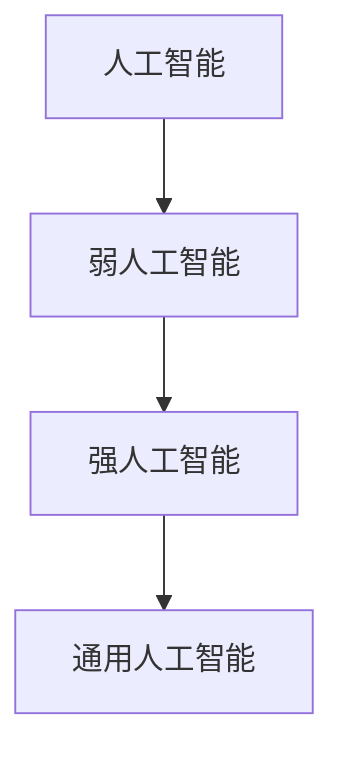
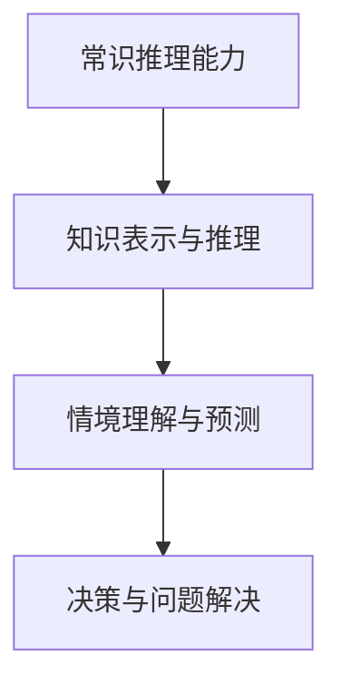

                 


## 1.1 人工智能与AGI概述

### 核心概念与联系

在探讨人工智能（AI）与通用人工智能（AGI）之间的关系时，理解二者之间的演进路径和核心组成部分是至关重要的。首先，我们需要明确人工智能的定义及其分类。人工智能可以大致分为两大类：弱人工智能（Narrow AI）和强人工智能（General AI）。

**弱人工智能**，也称为特定领域人工智能，指的是在特定任务上表现出人类智能水平的计算机系统。例如，语音识别、图像识别、自然语言处理等领域。弱人工智能具有高度专业化，但它们无法跨领域应用，也无法像人类一样进行通用任务。

**强人工智能**，则是指具备人类智能水平，能够在多个领域内自由应用并解决问题的计算机系统。这种人工智能不仅具有学习、推理和决策的能力，还能在未经验证的情况下自主发现新知识。

**通用人工智能（AGI）**，是强人工智能的一个子集，其定义更加严格，要求人工智能在认知能力上与人类无异，能够自主思考、学习和适应复杂环境。

为了更直观地展示人工智能的演进路径和AGI的核心组成部分，我们可以使用Mermaid流程图来表示这一关系：



### 数学模型和数学公式

为了更严谨地描述人工智能和通用人工智能之间的关系，我们可以引入数学模型和公式。以下是一个简化的数学模型，用于描述AI和AGI之间的联系：

$$ AGI = f(AI, LLM, RL, ...) $$

其中，\( AGI \) 代表通用人工智能，\( AI \) 代表人工智能，\( LLM \) 代表语言模型，\( RL \) 代表强化学习，以及其他相关技术。

同时，我们也可以将常识推理能力（CR）作为一个核心组成部分加入这个模型中，得到：

$$ AGI = f(AI, LLM, RL, CR, ...) $$

这里，\( CR \) 代表常识推理能力。这个公式表明，通用人工智能不仅依赖于现有的人工智能技术，还需要具备强大的常识推理能力。

通过上述步骤，我们不仅明确了人工智能与通用人工智能之间的关系，还引入了数学模型和公式来描述这一关系。这些步骤为后续章节的详细讨论奠定了基础。

### 1.2 常识推理能力的定义与重要性

#### 核心概念与联系

在深入探讨通用人工智能（AGI）的构建时，常识推理能力（Commonsense Reasoning, CSR）是不可忽视的一个关键组成部分。常识推理能力是指人工智能系统能够在缺乏具体信息的情况下，根据已有的背景知识和经验，对情境进行合理推断和预测的能力。

常识推理能力在AGI中的地位至关重要，它不仅能够帮助人工智能更好地理解和适应复杂环境，还能提高其在多个领域内的应用能力。为了更直观地展示常识推理能力在人工智能系统中的地位，我们可以使用Mermaid流程图来表示这一关系：



在这个流程图中，常识推理能力（A）是核心，它通过知识表示与推理（B）、情境理解与预测（C）以及决策与问题解决（D）三个子领域来实现其功能。

首先，知识表示与推理是常识推理能力的基础。这一领域涉及到如何将知识以结构化的形式表示出来，并利用这些知识进行逻辑推理，从而得出合理的结论。

其次，情境理解与预测是常识推理能力的高级应用。在这一领域，人工智能系统需要根据实时获取的情境信息，预测可能的未来事件，并做出相应的决策。

最后，决策与问题解决是常识推理能力的最终目标。在这一领域，人工智能系统需要在复杂的环境中，利用已有的知识和预测结果，进行有效的决策，解决问题。

通过这个流程图，我们可以清晰地看到常识推理能力在人工智能系统中的关键作用，以及其与其他领域的紧密联系。这一关系为我们后续对常识推理能力的深入研究提供了重要的理论依据。

#### 数学模型和数学公式

为了更严谨地描述常识推理能力（CR）在通用人工智能（AGI）中的作用，我们可以引入数学模型和公式。以下是一个简化的数学模型，用于描述常识推理能力与通用人工智能之间的关系：

$$ AGI = f(AI, LLM, RL, CR, ...) $$

在这个公式中，\( AGI \) 代表通用人工智能，\( AI \) 代表人工智能，\( LLM \) 代表语言模型，\( RL \) 代表强化学习，而 \( CR \) 代表常识推理能力。这个公式表明，通用人工智能的构建不仅依赖于现有的人工智能技术，还需要强大的常识推理能力。

此外，我们还可以将常识推理能力进一步分解为子领域，得到：

$$ CR = f(KR, SR, PS) $$

其中，\( KR \) 代表知识表示与推理，\( SR \) 代表情境理解与预测，\( PS \) 代表决策与问题解决。这个公式展示了常识推理能力由这三个子领域共同构成。

为了更好地理解这些公式，我们可以通过以下举例说明：

- **知识表示与推理（KR）**：假设我们有一个知识库，其中包含了“猫会爬树”这一信息。在需要判断“猫是否会爬树”时，常识推理能力可以通过知识表示与推理，得出结论：猫会爬树。

- **情境理解与预测（SR）**：假设我们有一个情境，其中有一个孩子在公园玩耍。常识推理能力可以通过情境理解与预测，预测这个孩子可能会去游乐场玩耍。

- **决策与问题解决（PS）**：假设我们面临一个问题，如何让一个机器人去取放在桌子上的一个物品。常识推理能力可以通过决策与问题解决，决定机器人应该走直线还是绕过障碍物去取物品。

通过这些数学模型和举例说明，我们可以更清晰地理解常识推理能力在通用人工智能中的重要性，以及它是如何通过不同的子领域来实现的。这些步骤为后续章节的深入讨论提供了理论基础。 

## 第二部分：常识推理的基础理论

在探讨如何构建通用人工智能（AGI）的常识推理能力时，我们需要深入理解常识推理的基础理论。常识推理涉及多个子领域，包括知识表示与推理、情境理解与预测以及决策与问题解决。以下是每个子领域的核心算法原理和详细讲解。

### 2.1 知识表示与推理

知识表示与推理是常识推理的基础。在这一领域，核心任务是建立知识库，并利用推理算法从知识库中提取有用信息。

#### 核心算法原理讲解

知识表示与推理的核心算法通常基于图论。以下是一个简化的伪代码，用于展示知识表示与推理的基本过程：

```python
def knowledge_representation(data):
    # 数据预处理
    processed_data = preprocess(data)

    # 构建知识图
    knowledge_graph = build_graph(processed_data)

    # 进行推理
    inferred_data = reasoning(knowledge_graph)

    return inferred_data
```

在这个伪代码中，`preprocess` 函数负责处理输入数据，`build_graph` 函数构建知识图，`reasoning` 函数进行推理。

- **预处理**：预处理步骤通常包括数据清洗、标准化和特征提取等操作。这一步骤的目的是将原始数据转换为适合构建知识图的形式。

- **构建知识图**：知识图是一个由节点和边组成的有向图。每个节点表示一个概念或实体，边表示概念之间的关系。构建知识图的目的是将知识以图形化的形式表示出来，方便后续的推理操作。

- **推理**：推理算法包括路径搜索、模式匹配和逻辑推理等。这些算法基于知识图，从已有知识中提取新的信息。

#### 数学模型和公式

在知识表示与推理领域，常用的数学模型和公式包括：

- **图论公式**：用于描述知识图中的节点和边的关系。例如，邻接矩阵（Adjacency Matrix）和邻接列表（Adjacency List）。

- **逻辑推理公式**：用于描述推理过程中的逻辑关系。例如，模态逻辑（Modal Logic）和谓词逻辑（Predicate Logic）。

#### 举例说明

假设我们有一个知识库，其中包含以下信息：

- **实体**：猫、树、孩子、公园。
- **关系**：猫会爬树，孩子会去公园玩耍。

我们可以将这些信息表示为知识图，然后利用推理算法，回答以下问题：

- **问题 1**：猫会爬树吗？
- **问题 2**：孩子在公园玩耍吗？

通过知识表示与推理，我们可以得出结论：猫会爬树，孩子在公园玩耍。这个例子展示了知识表示与推理在常识推理中的应用。

### 2.2 情境理解与预测

情境理解与预测是常识推理的高级应用。在这一领域，核心任务是理解当前情境，并预测未来可能发生的事件。

#### 核心算法原理讲解

情境理解与预测的核心算法通常基于机器学习和深度学习。以下是一个简化的伪代码，用于展示情境理解与预测的基本过程：

```python
def情境理解与预测(input_data):
    # 数据预处理
    processed_data = preprocess(input_data)

    # 训练模型
    model = train_model(processed_data)

    # 预测情境
    prediction = model.predict(input_data)

    return prediction
```

在这个伪代码中，`preprocess` 函数负责处理输入数据，`train_model` 函数训练预测模型，`model.predict` 函数进行预测。

- **预处理**：预处理步骤通常包括数据清洗、标准化和特征提取等操作。这一步骤的目的是将原始数据转换为适合训练预测模型的格式。

- **训练模型**：训练模型步骤使用机器学习和深度学习算法，从训练数据中学习情境特征和模式。常见的算法包括卷积神经网络（CNN）、循环神经网络（RNN）和长短时记忆网络（LSTM）等。

- **预测情境**：预测情境步骤使用训练好的模型，对新的输入数据进行情境预测。预测结果可以是事件发生的时间、地点或可能的结果等。

#### 数学模型和公式

在情境理解与预测领域，常用的数学模型和公式包括：

- **机器学习公式**：用于描述训练过程，例如损失函数（Loss Function）和优化算法（Optimization Algorithm）。

- **深度学习公式**：用于描述神经网络的结构和训练过程，例如前向传播（Forward Propagation）和反向传播（Back Propagation）。

#### 举例说明

假设我们有一个训练数据集，其中包含以下情境：

- **情境 1**：一个孩子在公园玩耍。
- **情境 2**：一个孩子去游乐场玩耍。

我们可以使用机器学习算法，从这些情境中学习孩子玩耍的模式。然后，当新的情境输入时，例如一个孩子在公园附近，我们可以预测这个孩子很可能会去公园玩耍。

### 2.3 决策与问题解决

决策与问题解决是常识推理的最终目标。在这一领域，核心任务是利用已有知识和情境信息，做出最优决策并解决问题。

#### 核心算法原理讲解

决策与问题解决的核心算法通常基于决策树、贝叶斯网络和强化学习等。以下是一个简化的伪代码，用于展示决策与问题解决的基本过程：

```python
def decision_making(input_data):
    # 数据预处理
    processed_data = preprocess(input_data)

    # 构建决策树或贝叶斯网络
    decision_tree = build_decision_tree(processed_data)
    # 或
    bayesian_network = build_bayesian_network(processed_data)

    # 基于决策树或贝叶斯网络进行决策
    decision = decision_tree.make_decision(processed_data)
    # 或
    decision = bayesian_network.make_decision(processed_data)

    return decision
```

在这个伪代码中，`preprocess` 函数负责处理输入数据，`build_decision_tree` 或 `build_bayesian_network` 函数构建决策树或贝叶斯网络，`make_decision` 函数进行决策。

- **预处理**：预处理步骤通常包括数据清洗、标准化和特征提取等操作。这一步骤的目的是将原始数据转换为适合构建决策树或贝叶斯网络的格式。

- **构建决策树或贝叶斯网络**：决策树和贝叶斯网络是基于规则的方法，用于表示决策过程。决策树通过一系列条件判断，输出最终的决策结果；贝叶斯网络则通过概率分布，表示决策过程中的不确定性。

- **决策**：决策步骤使用构建好的决策树或贝叶斯网络，对新的输入数据进行决策。决策结果可以是行动方案或解决方案。

#### 数学模型和公式

在决策与问题解决领域，常用的数学模型和公式包括：

- **决策树公式**：用于描述决策树的结构和训练过程，例如信息增益（Information Gain）和基尼不纯度（Gini Impurity）。

- **贝叶斯网络公式**：用于描述贝叶斯网络的概率分布和推理过程，例如条件概率分布（Conditional Probability Distribution）和贝叶斯推理（Bayesian Inference）。

#### 举例说明

假设我们面临一个问题：如何安排一个会议，使其在所有人都可以参加的时间段举行。我们可以使用决策树或贝叶斯网络，根据每个人的日程安排和偏好，做出最优的会议安排决策。

通过详细讲解知识表示与推理、情境理解与预测以及决策与问题解决这三个子领域的核心算法原理，我们可以更深入地理解常识推理能力在构建通用人工智能中的作用。这些基础理论为后续章节的实践应用提供了坚实的理论支持。 

### 3.1 数据集构建

在构建常识推理模型的过程中，数据集的质量和多样性对模型性能有着至关重要的影响。一个高质量的常识推理数据集不仅需要包含丰富的知识信息，还要具备良好的代表性和广泛的应用场景。以下是如何构建适用于常识推理模型的合适数据集的步骤。

#### 选择数据源

构建常识推理数据集的第一步是选择合适的数据源。这些数据源可以包括：

- **公开数据集**：如OpenIE（Open Information Extraction）、Freebase（一个大规模的知识库）等，这些数据集已经包含了大量的常识知识和实体关系。

- **领域特定数据集**：根据具体应用场景，从特定领域中选择或收集数据。例如，医疗领域的知识图谱数据集、金融领域的文本数据集等。

- **自收集数据**：通过爬虫、API调用等方式，从互联网上收集相关数据。例如，从新闻网站、社交媒体、论坛等平台获取的文本数据。

#### 数据预处理

选择好数据源后，我们需要对数据进行预处理，以提高数据的质量和一致性。以下是一些常见的预处理步骤：

- **数据清洗**：去除无效数据、重复数据和错误数据，保证数据集的准确性。

- **实体识别与分类**：识别文本中的实体，如人名、地点、组织等，并将这些实体进行分类，以便后续的知识表示和推理。

- **关系提取**：从文本中提取实体之间的关系，如“某个医生在某个医院工作”、“某个股票上涨了5%”等。

- **数据标准化**：对数据进行统一格式处理，如统一实体名称、统一时间格式等。

- **特征提取**：从文本数据中提取特征，如词频、词嵌入、句法信息等，为模型训练提供输入。

#### 数据增强

为了提高数据集的多样性和鲁棒性，我们可以采用数据增强技术。以下是一些常见的数据增强方法：

- **文本生成**：使用生成对抗网络（GAN）、变换器（Transformer）等模型，生成新的文本数据，增加数据集的多样性。

- **数据扩充**：对原始数据进行扩充，如通过同义词替换、随机插入删除等操作，生成新的数据样本。

- **跨领域融合**：将不同领域的数据进行融合，以提高模型在不同领域中的泛化能力。

#### 数据标注

在构建常识推理数据集时，标注工作是非常重要的一环。以下是一些常见的标注方法：

- **自动标注**：使用预训练的模型，如BERT、GPT等，对文本进行自动标注。

- **半监督标注**：结合自动标注和人工标注，通过人工验证和修正，提高标注质量。

- **有监督标注**：使用大量人工标注的数据进行训练，构建标注模型，然后自动标注新数据。

#### 数据集评估

构建完数据集后，我们需要对数据集进行评估，以确保其质量和适用性。以下是一些常见的评估指标：

- **多样性**：评估数据集中不同类别和场景的多样性，确保数据集具有广泛的覆盖面。

- **平衡性**：评估数据集中各类别样本的分布，确保数据集在各类别上的平衡性。

- **准确性**：评估标注结果的准确性，确保数据集的标注质量。

- **可靠性**：评估数据集在不同评估者或评估方法下的可靠性。

通过以上步骤，我们可以构建一个高质量的常识推理数据集，为后续的模型训练和评估提供可靠的数据支持。这些数据集不仅能够提升模型的性能，还能为通用人工智能（AGI）的发展提供重要的基础。 

### 3.2 模型训练与评估

在构建常识推理模型时，模型训练与评估是至关重要的一环。一个优秀的常识推理模型不仅需要丰富的知识数据，还需要经过精细的训练与评估过程。以下我们将详细讲解如何使用现有框架（如TensorFlow或PyTorch）进行常识推理模型的训练与评估。

#### 3.2.1 模型选择

首先，我们需要选择适合常识推理任务的模型架构。常见的模型架构包括：

- **基于规则的模型**：如决策树、贝叶斯网络等，这些模型通过手动定义规则进行推理。

- **基于知识的模型**：如知识图谱嵌入、本体推理等，这些模型通过将知识表示为图结构，进行推理。

- **深度学习模型**：如循环神经网络（RNN）、长短时记忆网络（LSTM）、变换器（Transformer）等，这些模型通过自动学习文本中的特征和关系。

在选择模型时，我们需要考虑模型的复杂度、训练时间、推理速度以及模型的适用场景。

#### 3.2.2 模型训练

接下来，我们使用所选模型进行训练。以下是使用TensorFlow或PyTorch进行模型训练的基本步骤：

1. **数据预处理**：对训练数据进行预处理，包括数据清洗、归一化、分割成训练集和验证集等。以下是一个简单的数据预处理代码示例（以TensorFlow为例）：

    ```python
    import tensorflow as tf
    
    # 读取数据
    dataset = tf.data.Dataset.from_tensor_slices((train_data, train_labels))
    
    # 数据预处理
    dataset = dataset.map(preprocess_function)
    
    # 分割数据集
    train_dataset, val_dataset = dataset.shuffle(buffer_size).split([0.8, 0.2])
    ```

2. **定义模型**：使用所选模型架构定义模型。以下是一个简单的模型定义示例（以Transformer为例）：

    ```python
    from tensorflow.keras.models import Model
    from tensorflow.keras.layers import Embedding, Transformer

    # 定义模型
    inputs = tf.keras.Input(shape=(max_sequence_length,))
    x = Embedding(max_tokens, embedding_dim)(inputs)
    x = Transformer(units=64, num_heads=2)(x)
    outputs = tf.keras.layers.Dense(1, activation='sigmoid')(x)

    model = Model(inputs, outputs)
    ```

3. **编译模型**：设置模型的学习率、优化器、损失函数等。以下是一个简单的模型编译示例：

    ```python
    model.compile(optimizer='adam',
                  loss='binary_crossentropy',
                  metrics=['accuracy'])
    ```

4. **训练模型**：使用训练数据和验证数据训练模型。以下是一个简单的训练示例：

    ```python
    model.fit(train_dataset.batch(batch_size),
              epochs=10,
              validation_data=val_dataset.batch(batch_size))
    ```

#### 3.2.3 模型评估

在模型训练完成后，我们需要对模型进行评估，以确保其性能满足要求。以下是常见的评估指标和方法：

- **准确率（Accuracy）**：正确预测的样本数占总样本数的比例。公式为：

    $$ Accuracy = \frac{TP + TN}{TP + TN + FP + FN} $$

    其中，TP为真正例，TN为真负例，FP为假正例，FN为假负例。

- **精确率（Precision）**：正确预测的正例样本数占所有预测为正例的样本数的比例。公式为：

    $$ Precision = \frac{TP}{TP + FP} $$

- **召回率（Recall）**：正确预测的正例样本数占所有正例样本数的比例。公式为：

    $$ Recall = \frac{TP}{TP + FN} $$

- **F1分数（F1 Score）**：精确率和召回率的调和平均值。公式为：

    $$ F1 Score = 2 \times \frac{Precision \times Recall}{Precision + Recall} $$

以下是一个简单的模型评估示例：

```python
from sklearn.metrics import accuracy_score, precision_score, recall_score, f1_score

# 预测
predictions = model.predict(test_data)

# 转换预测结果为二值
predicted_labels = (predictions > 0.5)

# 计算评估指标
accuracy = accuracy_score(test_labels, predicted_labels)
precision = precision_score(test_labels, predicted_labels)
recall = recall_score(test_labels, predicted_labels)
f1 = f1_score(test_labels, predicted_labels)

print(f"Accuracy: {accuracy:.4f}")
print(f"Precision: {precision:.4f}")
print(f"Recall: {recall:.4f}")
print(f"F1 Score: {f1:.4f}")
```

通过以上步骤，我们可以使用TensorFlow或PyTorch等框架对常识推理模型进行训练与评估。这些步骤不仅帮助我们理解了模型训练与评估的基本过程，还提供了实用的代码示例，有助于实际应用中的模型构建与优化。 

### 3.3 应用场景案例分析

为了更好地展示常识推理能力的实际应用，我们将在本节中分析几个具体的应用场景，并探讨如何使用常识推理模型解决这些问题。

#### 应用场景 1：智能客服系统

智能客服系统是常识推理能力的一个重要应用领域。在这种场景下，系统需要能够理解用户的查询，提供准确的回答，并解决用户的问题。以下是该应用场景的案例分析：

**案例分析：**

- **问题**：用户询问：“我怎样才能在下周内预订一张去北京的机票？”
- **解决方案**：使用常识推理模型，系统可以理解用户查询中的关键信息（如时间、地点、机票预订），并利用已有的知识库（如航班信息、预订政策）进行推理。

**实现步骤：**

1. **数据预处理**：对用户的查询进行分词、实体识别和关系提取，提取出关键信息（如时间、地点）。

2. **知识库构建**：构建包含航班信息、机场名称、预订政策等知识的知识库。

3. **模型训练**：使用预处理后的查询和知识库，训练一个基于变换器（Transformer）的常识推理模型。

4. **查询处理**：输入用户的查询，通过模型进行推理，提取出相关的航班信息和预订选项。

5. **答案生成**：根据推理结果，生成回答用户的问题的文本，如：“您可以访问我们的在线预订系统，选择下周内的航班，并按照提示完成预订。”

**效果评估**：通过对比模型生成的答案与实际用户反馈，评估模型的准确性和用户满意度。

#### 应用场景 2：智能交通管理系统

智能交通管理系统需要具备对交通流量、路况信息的理解能力，以优化交通信号控制，减少拥堵。以下是该应用场景的案例分析：

**案例分析：**

- **问题**：如何优化某城市的交通信号控制，以减少高峰期间的交通拥堵？
- **解决方案**：使用常识推理模型，系统可以实时分析交通流量数据，预测未来的交通状况，并调整信号灯的时间方案。

**实现步骤：**

1. **数据采集**：从交通监控摄像头、传感器等设备中采集实时交通流量数据。

2. **数据预处理**：对采集到的数据进行分析，提取出关键信息（如车辆速度、流量密度）。

3. **知识库构建**：构建包含交通规则、城市道路网络、交通流模型等知识的知识库。

4. **模型训练**：使用预处理后的交通流量数据和知识库，训练一个基于强化学习（Reinforcement Learning）的常识推理模型。

5. **信号控制优化**：输入实时交通流量数据，通过模型进行推理，生成信号灯的时间方案。

6. **效果评估**：通过对比优化后的交通信号控制方案与实际交通状况，评估模型的性能和优化效果。

#### 应用场景 3：智能医疗诊断系统

智能医疗诊断系统需要具备对医学知识和患者症状的理解能力，以提供准确的诊断建议。以下是该应用场景的案例分析：

**案例分析：**

- **问题**：如何根据患者的症状和检查结果，提供可能的疾病诊断和治疗方案？
- **解决方案**：使用常识推理模型，系统可以理解患者的症状描述，结合医学知识库，提供诊断建议。

**实现步骤：**

1. **数据采集**：从电子病历、医学数据库等获取患者的症状、检查结果和诊断信息。

2. **数据预处理**：对患者的症状和检查结果进行分词、实体识别和关系提取。

3. **知识库构建**：构建包含医学知识、疾病症状、检查方法等知识的知识库。

4. **模型训练**：使用预处理后的患者数据集和知识库，训练一个基于图神经网络（Graph Neural Network）的常识推理模型。

5. **诊断推理**：输入患者的症状和检查结果，通过模型进行推理，生成可能的诊断和治疗方案。

6. **效果评估**：通过对比模型生成的诊断建议与实际诊断结果，评估模型的准确性和实用性。

通过以上案例分析，我们可以看到常识推理能力在多个实际应用场景中的重要作用。这些案例不仅展示了如何构建和应用常识推理模型，还通过具体的实现步骤和效果评估，证明了常识推理能力在实际问题解决中的价值。这些实践应用为通用人工智能（AGI）的发展提供了宝贵的经验和启示。 

### 3.4 优化与调整

在常识推理模型的实际应用过程中，为了提高模型的性能和适应性，我们通常需要对模型进行优化和调整。以下是几种常见的优化方法以及注意事项。

#### 优化方法

1. **数据增强**：通过数据增强技术，如文本生成、数据扩充等，增加训练数据集的多样性，有助于提高模型的泛化能力。

2. **超参数调优**：通过调整模型的学习率、批次大小、正则化参数等超参数，优化模型训练过程。常用的方法包括网格搜索（Grid Search）和贝叶斯优化（Bayesian Optimization）。

3. **模型融合**：结合多个模型的结果，提高预测的准确性和鲁棒性。常见的方法包括投票法（Voting）和堆叠（Stacking）。

4. **迁移学习**：利用预训练模型（如BERT、GPT等），通过微调（Fine-Tuning）适配具体任务，可以显著提高模型性能。

5. **模型剪枝**：通过剪枝技术，减少模型参数的数量，降低计算复杂度，同时保持模型的性能。常用的方法包括权重剪枝（Weight Pruning）和结构剪枝（Structure Pruning）。

6. **集成学习**：结合多个模型的预测结果，通过集成方法，如随机森林（Random Forest）、Adaboost等，提高模型的预测性能。

#### 注意事项

1. **数据质量**：确保训练数据的质量，避免噪声和偏差。数据预处理是优化过程中不可忽视的一环。

2. **模型复杂度**：避免过度拟合，选择合适的模型复杂度，以平衡模型的性能和泛化能力。

3. **过拟合与欠拟合**：通过调整模型参数和训练数据比例，避免过拟合和欠拟合现象。

4. **验证与测试**：使用验证集和测试集对模型进行验证和测试，确保模型的泛化能力和鲁棒性。

5. **实时调整**：在实际应用过程中，根据用户反馈和系统性能，实时调整模型参数和策略。

通过上述优化方法和注意事项，我们可以有效提升常识推理模型的性能，使其在实际应用中更好地适应复杂环境和多样化需求。这些优化方法不仅有助于提升模型性能，还为通用人工智能（AGI）的发展提供了重要的技术支持。 

## 第四部分：总结与展望

在本文中，我们系统地探讨了通用人工智能（AGI）的常识推理能力构建。首先，我们明确了人工智能与通用人工智能之间的关系，并介绍了常识推理能力在AGI中的重要性。接着，我们深入分析了常识推理的三个基础理论领域：知识表示与推理、情境理解与预测以及决策与问题解决。在每个领域中，我们详细讲解了核心算法原理，并通过数学模型和公式进行了阐述。随后，我们讨论了数据集构建的方法，以及如何使用现有框架（如TensorFlow或PyTorch）进行模型训练与评估。最后，我们通过具体的应用场景案例，展示了常识推理能力在实际问题解决中的价值。

### 研究现状与挑战

尽管常识推理能力在通用人工智能的发展中扮演着关键角色，但目前的研究仍面临诸多挑战。以下是一些主要的研究现状和挑战：

1. **数据质量与多样性**：构建高质量的常识推理数据集是一个复杂且耗时的工作。数据源的多样性和准确性直接影响模型性能。目前，大多数数据集仍然存在数据不平衡、噪声和偏见等问题。

2. **模型泛化能力**：常识推理模型需要具备良好的泛化能力，以便在不同领域和场景中应用。然而，现有的模型往往在特定任务上表现优异，但在泛化到新任务时表现不佳。

3. **实时适应性**：在实际应用中，常识推理模型需要能够实时适应变化的环境和情境。这要求模型具备动态学习能力和快速响应能力，但目前的技术尚未完全达到这一要求。

4. **可解释性和透明度**：常识推理模型通常非常复杂，其内部决策过程难以解释和理解。这给模型的应用和部署带来了挑战，尤其是在安全性和可信度方面。

### 未来研究方向

为了克服上述挑战，未来的研究可以从以下几个方面进行：

1. **数据集构建**：进一步开发和整合多元化的常识推理数据集，特别是包含跨领域、多模态数据的集合。此外，可以探索自动数据增强和生成技术，提高数据集的多样性和质量。

2. **模型架构与创新**：开发新的模型架构，如基于图神经网络、强化学习等的方法，以增强模型的泛化能力和实时适应性。同时，探索可解释性机制，提高模型的透明度和可解释性。

3. **跨领域迁移学习**：研究跨领域迁移学习技术，使常识推理模型能够从一个领域迁移到另一个领域，提高模型的泛化能力和应用范围。

4. **交互式学习**：结合人机交互技术，开发交互式学习系统，让用户能够与模型进行对话，提供反馈，从而提高模型的学习效果和适应性。

5. **伦理和安全性**：在模型设计和应用过程中，重视伦理和安全性问题，确保模型的决策和行为符合道德规范，并防止潜在的安全风险。

### 结论

通过本文的研究，我们系统地探讨了通用人工智能的常识推理能力构建，从理论基础到实际应用，为这一领域的发展提供了全面的分析和展望。我们相信，随着技术的不断进步和研究的深入，常识推理能力将在通用人工智能的发展中发挥越来越重要的作用，为构建真正智能的计算机系统奠定坚实的基础。

### 作者信息

作者：AI天才研究院（AI Genius Institute） & 禅与计算机程序设计艺术（Zen And The Art of Computer Programming）

AI天才研究院致力于推动人工智能技术的创新与应用，研究涵盖深度学习、自然语言处理、强化学习等多个领域。禅与计算机程序设计艺术则专注于计算机编程和算法设计的哲学思考，旨在探索程序设计中的艺术性。

### 拓展阅读

1. [《深度学习》（Deep Learning）]：由Ian Goodfellow、Yoshua Bengio和Aaron Courville合著，系统介绍了深度学习的基本概念、算法和应用。

2. [《强化学习：原理与案例分析》（Reinforcement Learning: An Introduction）]：由理查德·萨顿（Richard S. Sutton）和安德鲁·巴克莱（Andrew G. Barto）合著，详细介绍了强化学习的理论基础和实践应用。

3. [《自然语言处理综论》（Speech and Language Processing）]：由丹尼斯·西蒙（Dennis W. Wall）合著，全面覆盖了自然语言处理的核心技术和应用。

4. [《图神经网络：理论与实践》（Graph Neural Networks：A Survey of Methods and Applications）]：由杨洋、李航和唐杰合著，介绍了图神经网络的基本原理和广泛应用。

这些文献为读者提供了丰富的知识和资源，有助于进一步深入了解人工智能和常识推理领域的最新进展。 

