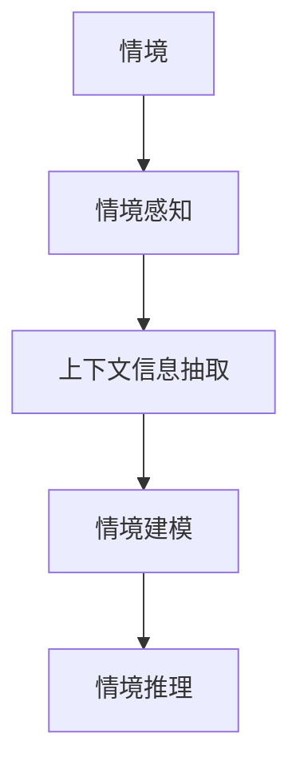
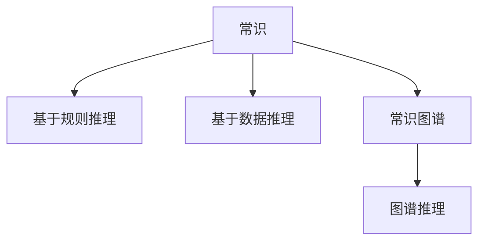

                 

## 文章标题

### AGI的情境理解与常识推理能力构建

---

关键词：人工智能，通用人工智能（AGI），情境理解，常识推理，算法，模型，系统设计，应用实践，挑战与展望。

---

摘要：
本文深入探讨了通用人工智能（AGI）的情境理解与常识推理能力构建。首先，我们介绍了AGI的概念及其在人工智能领域的重要性。随后，我们详细阐述了情境理解和常识推理的核心概念、理论基础及方法技术。接着，我们讨论了如何通过算法与模型实现AGI的情境理解与常识推理能力，并详细介绍了系统设计与应用实践。最后，我们分析了AGI在情境理解与常识推理方面面临的挑战，并对未来发展趋势进行了展望。

---

### 目录大纲构思

以下是本文的目录大纲结构：

1. **引言**
   - **1.1 AGI的概念与发展**
   - **1.2 情境理解与常识推理的重要性**

2. **基础理论**
   - **2.1 情境理解理论**
   - **2.2 常识推理理论**

3. **技术实现**
   - **3.1 情境理解与常识推理的算法与模型**
   - **3.2 AGI的情境理解与常识推理系统设计**

4. **应用实践**
   - **4.1 情境理解与常识推理应用案例**

5. **挑战与展望**
   - **5.1 挑战分析**
   - **5.2 展望未来**

---

### 引言

#### 1.1 AGI的概念与发展

**定义：** 通用人工智能（AGI，Artificial General Intelligence）是一种能够像人类一样具备广泛认知能力的人工智能系统，能够在各种不同的情境下自主学习和执行任务。

**与传统AI的区别：** 与传统的窄人工智能（Narrow AI）不同，AGI不仅能够解决特定领域的问题，而且能够跨越多个领域，进行跨学科的学习和推理。

**发展历程：** 自20世纪50年代人工智能（AI）概念的提出以来，AGI一直是人工智能领域的梦想。尽管取得了许多突破，但直到今天，AGI仍然是一个未解之谜，吸引了众多学者和研究者的关注。

#### 1.2 情境理解与常识推理的重要性

**情境理解：** 情境理解是AGI的核心能力之一，它使得AI系统能够感知和理解其所处的环境。情境理解不仅涉及到对当前状态的理解，还包括对历史状态和未来状态的预测。

**常识推理：** 常识推理是AI系统能够从普通知识和经验中推断出新信息的能力。它是人类智能的重要组成部分，对于AGI的发展至关重要。

**在AGI中的关键角色：** 情境理解和常识推理共同构成了AGI的认知基础，使得AGI能够更加自然地与人类交互，适应复杂多变的环境，并具备自主学习和决策能力。

---

### 基础理论

#### 2.1 情境理解理论

**情境理解的基本概念：**

- **情境：** 情境是AI系统所处环境的抽象表示，包括物理环境、社会环境以及时间和空间因素。

- **情境理解：** 情境理解是指AI系统通过感知和理解情境信息，从而对其所处的环境进行建模和解释的过程。

**情境理解的方法与技术：**

- **情境感知技术：** 通过传感器、摄像头等设备获取环境信息。

- **上下文信息抽取：** 从获取的环境信息中提取与当前情境相关的上下文信息。

- **情境建模：** 建立数学模型或知识图谱，对情境进行表示和推理。

**情境理解的核心概念关系架构：**



#### 2.2 常识推理理论

**常识推理的基本概念：**

- **常识：** 常识是人类日常生活中普遍接受的基本事实和知识。

- **常识推理：** 常识推理是指基于常识进行逻辑推理，从而推断出新信息的能力。

**常识推理的方法与技术：**

- **基于规则的常识推理：** 通过定义一系列规则，对常识进行形式化表示。

- **基于数据的常识推理：** 利用大规模数据集，通过机器学习算法进行常识推理。

- **常识图谱构建：** 建立常识知识图谱，利用图结构进行推理。

**常识推理的核心概念关系架构：**



---

### 技术实现

#### 3.1 情境理解与常识推理的算法与模型

**情境理解算法：**

- **情境感知算法：** 例如，使用卷积神经网络（CNN）进行图像识别，使用自然语言处理（NLP）技术进行文本分析。

- **上下文信息抽取算法：** 例如，使用实体识别（Named Entity Recognition, NER）和关系抽取（Relation Extraction）技术。

- **情境建模算法：** 例如，使用图神经网络（Graph Neural Network, GNN）进行情境表示和推理。

**常识推理算法：**

- **基于规则的常识推理算法：** 例如，使用产生式规则进行推理。

- **基于数据的常识推理算法：** 例如，使用知识图谱和图神经网络进行推理。

- **常识图谱推理算法：** 例如，使用路径存在性查询（Path Existence Query）和三元组匹配（Triple Match）进行推理。

**算法原理讲解与伪代码：**

**情境感知算法（CNN）：**
```python
def image_recognition(image):
    # 使用卷积神经网络进行图像识别
    model = CNN_Model()
    prediction = model.predict(image)
    return prediction
```

**上下文信息抽取（NER）：**
```python
def named_entity_recognition(text):
    # 使用自然语言处理模型进行实体识别
    model = NER_Model()
    entities = model.predict(text)
    return entities
```

**常识推理（基于规则）：**
```python
def rule_based_inference(fact1, fact2):
    # 使用产生式规则进行推理
    if fact1 == " raining " and fact2 == " take umbrella ":
        return " true "
    else:
        return " false "
```

#### 3.2 AGI的情境理解与常识推理系统设计

**系统架构设计：**

- **总体架构：** 包括感知模块、推理模块、学习模块和交互模块。

- **功能模块划分：** 每个模块负责不同的任务，如感知模块负责情境感知，推理模块负责常识推理。

- **系统接口设计：** 提供API接口，方便与其他系统或应用程序集成。

**系统实现：**

- **开发环境搭建：** 使用Python、TensorFlow等工具搭建开发环境。

- **数据集处理：** 收集和处理大量情境数据和常识数据。

- **算法实现：** 实现上述的情境理解与常识推理算法。

---

### 应用实践

#### 4.1 情境理解与常识推理应用案例

**案例一：智能客服系统**

- **情境理解应用：** 智能客服系统通过自然语言处理技术理解用户的查询意图，并根据上下文信息提供合适的回答。

- **常识推理应用：** 通过常识推理，智能客服系统能够回答一些常见问题，如“明天天气如何？”等。

**案例二：智能推荐系统**

- **情境理解应用：** 智能推荐系统通过用户行为数据，如浏览历史、购买记录等，理解用户的偏好。

- **常识推理应用：** 通过常识推理，智能推荐系统可以推荐相关商品或内容，如根据用户浏览了某部电影，推荐类似的影片。

**案例三：智能驾驶系统**

- **情境理解应用：** 智能驾驶系统通过传感器和摄像头，感知周围环境和交通状况。

- **常识推理应用：** 通过常识推理，智能驾驶系统可以做出合理的驾驶决策，如根据交通灯的颜色决定是否通过路口。

---

### 挑战与展望

#### 5.1 挑战分析

- **数据与知识获取：** AGI需要大量的情境数据和常识知识，但当前的数据获取和知识获取技术仍然面临挑战。

- **模型可解释性：** AGI的模型往往复杂且黑箱，提高模型的可解释性是一个重要的挑战。

- **系统鲁棒性：** AGI系统需要在不同情境下保持鲁棒性，但当前的技术水平还不足以实现这一目标。

#### 5.2 展望未来

- **技术发展趋势：** 随着深度学习和图神经网络等技术的不断发展，AGI的情境理解与常识推理能力将得到进一步提升。

- **应用前景：** AGI将在医疗、教育、交通等多个领域发挥重要作用，带来巨大的社会和经济价值。

- **潜在影响：** AGI的发展将对人类社会产生深远的影响，包括就业、隐私、伦理等方面。

---

### 结语

本文系统地探讨了AGI的情境理解与常识推理能力构建，从基础理论、技术实现到应用实践，全面分析了这一领域的现状与挑战。随着技术的不断进步，我们有望在未来实现更加智能的通用人工智能系统，为人类社会带来更多便利和进步。

---

作者：AI天才研究院/AI Genius Institute & 禅与计算机程序设计艺术 /Zen And The Art of Computer Programming

---

**注意：** 本文为模拟撰写，仅供参考。实际撰写时，需要根据具体内容和数据进行调整和完善。

