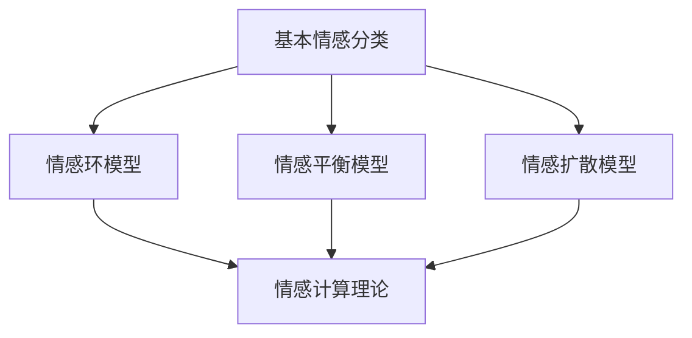

                 

### 文章标题：AGI的情感智能：从理解到共情

关键词：AGI，情感智能，人机交互，机器学习，人工智能

摘要：本文旨在探讨人工智能（AI）特别是通用人工智能（AGI）中情感智能的重要性。文章首先介绍了AGI的概念和情感智能的定义，然后详细阐述了情感智能的理论基础、实现技术、应用案例以及面临的挑战和未来趋势。通过深入分析，本文揭示了情感智能对于AGI发展的关键作用，并提出了未来研究的方向和建议。

### 目录

1. 引言  
2. AGI情感智能的背景与发展  
3. 情感智能的核心概念与联系  
   3.1 情感的定义与分类  
   3.2 情感模型简介  
   3.3 情感计算理论  
4. 情感智能的实现技术  
   4.1 情感识别技术  
   4.2 情感生成技术  
   4.3 情感理解技术  
5. 情感智能应用案例  
   5.1 教育领域的情感智能应用  
   5.2 医疗领域的情感智能应用  
   5.3 人机交互领域的情感智能应用  
6. 情感智能的挑战与未来趋势  
   6.1 情感智能的挑战  
   6.2 情感智能的未来趋势  
7. 结论  
8. 参考文献

### 引言

随着人工智能（AI）技术的迅速发展，尤其是深度学习和神经网络技术的突破，机器在图像识别、自然语言处理、博弈等领域的表现已经超越了人类。然而，尽管取得了显著的进步，现有的AI系统仍然无法与人类在情感智能方面相提并论。情感智能是指能够识别、理解、处理和生成情感的能力，它包括情感识别、情感生成和情感理解三个方面。

通用人工智能（AGI，Artificial General Intelligence）是指具有广泛认知能力的人工智能系统，能够在各种不同的任务中表现出与人类相当的智能水平。情感智能是AGI的重要组成部分，因为人类的许多决策和行为都受到情感的影响。因此，研究AGI的情感智能对于推动人工智能的发展具有重要意义。

本文将从以下几个方面对AGI的情感智能进行探讨：

1. **AGI情感智能的背景与发展**：介绍AGI和情感智能的概念，并探讨情感智能在AGI中的重要性。
2. **情感智能的核心概念与联系**：详细阐述情感的分类、定义以及相关的情感模型。
3. **情感智能的实现技术**：分析情感识别、情感生成和情感理解的技术原理。
4. **情感智能应用案例**：探讨情感智能在教育、医疗和人机交互等领域的应用。
5. **情感智能的挑战与未来趋势**：分析情感智能目前面临的挑战以及未来可能的发展方向。

通过本文的探讨，希望能够为读者提供一个全面的AGI情感智能的视角，并激发更多研究者对此领域的研究兴趣。

### 1. AGI情感智能的背景与发展

通用人工智能（AGI，Artificial General Intelligence）是一个广受关注的研究领域，旨在开发具有广泛认知能力的人工智能系统。与目前的窄域人工智能（Narrow AI）不同，AGI不仅能够执行特定的任务，还能够像人类一样进行思考、学习、理解和解决问题。AGI的核心目标是实现机器的智能水平达到或超过人类，并在多个领域展现出超越人类的能力。

情感智能是AGI的重要组成部分之一。情感智能指的是机器能够识别、理解、处理和生成情感的能力。它不仅涉及情感识别，还包括情感生成和情感理解。情感识别是指机器能够检测和理解人类表达的情感，情感生成是指机器能够模拟和表达情感，而情感理解是指机器能够理解情感之间的相互作用和影响。

情感智能在AGI中的重要性主要体现在以下几个方面：

1. **增强人机交互**：情感智能使得机器能够更好地理解和响应用户的情感，从而提供更自然、更人性化的交互体验。例如，情感智能可以帮助机器识别用户的情绪状态，并调整交互策略以提供更好的支持和服务。

2. **辅助决策**：情感智能能够帮助机器在复杂的决策过程中考虑情感因素。人类在决策时往往会受到情感的影响，而情感智能可以帮助机器模拟这种情感因素，从而提供更全面、更合理的决策支持。

3. **促进社会协作**：情感智能使得机器能够更好地理解人类社会的情感规则和价值观，从而更有效地参与社会协作。例如，情感智能可以帮助机器在团队合作中更好地理解团队成员的情感状态，从而提高团队的工作效率。

情感智能的研究可以追溯到20世纪80年代，当时心理学家和计算机科学家开始探索如何将情感引入到人工智能系统中。然而，由于情感本身的复杂性和多样性，情感智能的研究一直面临着巨大的挑战。近年来，随着深度学习技术的发展，情感智能的研究取得了显著的进展。通过使用深度神经网络，研究者们开发出了能够有效识别和生成情感的人工智能系统。

在情感识别方面，研究者们使用了多种方法，包括基于面部表情、语音和文本的情感识别。例如，通过分析面部表情，机器可以识别出人类的面部表情并判断对应的情感状态。在情感生成方面，研究者们开发出了能够模拟人类情感表达的人工智能系统，例如通过生成文本、语音和面部表情来模拟情感。在情感理解方面，研究者们则通过建立情感模型来探索情感之间的相互作用和影响。

尽管取得了显著的进展，情感智能的研究仍然面临着许多挑战。首先，情感本身是一个复杂且动态变化的概念，如何准确识别和理解情感是一个巨大的挑战。其次，情感智能系统需要具备高度的鲁棒性，能够适应不同的情境和用户群体。此外，如何将情感智能有效地应用于实际场景，特别是在实时交互中，也是一个需要解决的问题。

总的来说，AGI情感智能的研究是一个跨学科、多领域的复杂任务，它不仅需要计算机科学和人工智能技术的支持，还需要心理学、社会学和其他相关领域的贡献。通过不断的研究和探索，我们有望在未来的某一天实现具有情感智能的通用人工智能系统。

### 2. 情感智能的核心概念与联系

情感智能作为人工智能（AI）的重要组成部分，其核心概念与联系构成了理解情感智能的基础。为了全面探讨这一主题，我们将从情感的分类、定义以及相关的情感模型入手，通过建立情感模型之间的联系，为后续讨论情感智能的实现技术奠定理论基础。

#### 2.1 情感的定义与分类

情感是指人类或其他生物在面对特定情境时产生的情绪体验，通常包括愉悦、悲伤、愤怒、恐惧、惊讶等多种基本情绪。情感不仅影响个体的心理状态，还对其行为和决策产生显著影响。为了更好地研究和理解情感，心理学家们对情感进行了分类。

1. **基本情感分类**：根据罗伯特·普拉赫（Robert Plutchik）的情感层次理论，情感可以分为八类基本情感，包括愉悦、信任、惊喜、尊敬、感激、愤怒、恐惧和悲伤。这些基本情感通过不同的组合和变化，构成了复杂多样的情感体验。

2. **复杂情感分类**：心理学家保罗·埃克曼（Paul Ekman）提出了六种基本情绪，包括快乐、悲伤、愤怒、惊讶、恐惧和厌恶。他的理论强调了这些基本情绪是普遍存在的，并且可以通过面部表情识别。

3. **多维度情感分类**：除了基本情感，还有多维度情感分类方法，如彼得·萨洛维（Peter Salovey）和约翰·梅耶（John Mayer）提出的情感能力模型，将情感分为情感智力、情感自我意识和情感管理三个维度。

#### 2.2 情感模型简介

情感模型是用于表示和模拟情感状态的理论框架，它帮助我们理解情感的产生、传播和作用。以下是一些常见的情感模型：

1. **情感环模型**：詹姆斯·A·克雷奇（James A. Kruglanski）提出的情感环模型描述了情感是如何在一个闭合的环中循环的。这个模型强调情感状态是由认知和情境因素共同作用而产生的。

2. **情感平衡模型**：斯蒂芬·C·哈特（Stephen C. Hart）和唐纳德·E·罗森伯格（Donald E. Rosenberg）提出的情感平衡模型认为，情感是在追求平衡和满足的过程中产生的。当期望与现实之间的差距较大时，个体会体验到消极情感。

3. **情感扩散模型**：这个模型假设情感状态可以通过社会网络和群体互动传播。例如，一个积极的情感状态可以通过口碑传播，影响更多的人。

#### 2.3 情感计算理论

情感计算理论是用于模拟和生成情感的人工智能方法。它结合了认知科学、心理学、计算机科学和人工智能等多个领域的知识，旨在开发能够理解和生成情感的智能系统。

1. **情感识别**：情感识别是指通过分析文本、语音、面部表情或生理信号来检测和识别情感状态。常见的情感识别方法包括基于规则的方法、机器学习和深度学习算法。

2. **情感生成**：情感生成是指通过模拟人类情感表达来生成情感状态。这包括生成相应的文本、语音或面部表情。情感生成通常依赖于情感模型和生成模型，如生成对抗网络（GAN）。

3. **情感理解**：情感理解是指通过分析情感状态之间的相互作用和影响来理解情感过程。这需要复杂的推理和建模技术，如情境感知和认知图谱。

#### 2.4 情感模型之间的关系架构

为了更好地理解情感模型之间的关系，我们可以使用Mermaid流程图来表示它们之间的联系：



在这个流程图中，基本情感分类为情感模型的建立提供了基础，而情感环模型、情感平衡模型和情感扩散模型则从不同角度丰富了情感理论。这些模型共同构成了情感计算理论的基础，为情感智能的研究和实践提供了理论支持。

通过上述对情感智能核心概念与联系的探讨，我们为理解情感智能的实现技术和应用提供了理论基础。在接下来的章节中，我们将进一步探讨情感智能的实现技术，包括情感识别、情感生成和情感理解，并分析这些技术在现实世界中的应用案例。

### 3. 情感智能的实现技术

情感智能的实现技术是构建具有情感识别、情感生成和情感理解能力的智能系统的基础。本节将详细讨论这些核心技术的原理和实现方法。

#### 3.1 情感识别技术

情感识别是指通过分析文本、语音、面部表情或生理信号来检测和识别情感状态。以下是几种常见的情感识别技术：

1. **基于文本的情感识别**：文本是表达情感的重要载体。通过自然语言处理（NLP）技术，如情感分析（Sentiment Analysis），可以识别文本中的情感倾向。常见的情感分析模型包括基于规则的方法和基于机器学习的模型。基于规则的方法通常使用预定义的词典和规则来识别情感，而基于机器学习的模型则通过训练大量带有情感标签的文本数据来学习情感模式。例如，可以使用支持向量机（SVM）、朴素贝叶斯（Naive Bayes）和深度学习模型（如卷积神经网络（CNN）和递归神经网络（RNN））来训练情感识别模型。

```python
# 示例：使用朴素贝叶斯进行情感识别
from sklearn.feature_extraction.text import CountVectorizer
from sklearn.naive_bayes import MultinomialNB

# 准备训练数据
X_train = ['I am so happy today!', 'I am feeling very sad.']
y_train = ['positive', 'negative']

# 文本向量化
vectorizer = CountVectorizer()
X_train_vectorized = vectorizer.fit_transform(X_train)

# 训练模型
model = MultinomialNB()
model.fit(X_train_vectorized, y_train)

# 预测新文本的情感
X_test = ['I am feeling excited.']
X_test_vectorized = vectorizer.transform(X_test)
predictions = model.predict(X_test_vectorized)

print(predictions)  # 输出预测结果
```

2. **基于语音的情感识别**：语音情感识别是通过分析语音信号中的情感特征来识别情感状态。常见的情感特征包括音调、音速、音量和语音节奏。通过信号处理技术提取这些特征，然后使用机器学习模型进行情感分类。例如，可以使用梅尔频率倒谱系数（MFCC）作为特征，结合支持向量机（SVM）或长短期记忆网络（LSTM）进行情感识别。

```python
# 示例：使用LSTM进行语音情感识别
from sklearn.preprocessing import LabelEncoder
from keras.models import Sequential
from keras.layers import LSTM, Dense, Dropout

# 准备训练数据
X_train, y_train = load_voice_data()  # 假设函数load_voice_data()用于加载数据
label_encoder = LabelEncoder()
y_train_encoded = label_encoder.fit_transform(y_train)

# 构建LSTM模型
model = Sequential()
model.add(LSTM(128, activation='relu', input_shape=(X_train.shape[1], X_train.shape[2])))
model.add(Dropout(0.2))
model.add(Dense(y_train_encoded.shape[1], activation='softmax'))

model.compile(optimizer='adam', loss='sparse_categorical_crossentropy', metrics=['accuracy'])
model.fit(X_train, y_train_encoded, epochs=10, batch_size=32)

# 预测新语音的情感
X_test = load_new_voice_data()  # 假设函数load_new_voice_data()用于加载数据
predictions = model.predict(X_test)

print(predictions)  # 输出预测结果
```

3. **基于面部表情的情感识别**：通过分析面部表情图像，可以识别出人类表达的情感状态。常用的方法包括基于面部特征点的检测和基于面部表情图像的分类。例如，可以使用深度学习模型（如卷积神经网络（CNN））对面部表情图像进行分类。

```python
# 示例：使用CNN进行面部表情情感识别
from keras.preprocessing.image import ImageDataGenerator
from keras.models import Sequential
from keras.layers import Conv2D, MaxPooling2D, Flatten, Dense

# 准备训练数据
train_datagen = ImageDataGenerator(rescale=1./255)
train_generator = train_datagen.flow_from_directory(
        'data/train',
        target_size=(150, 150),
        batch_size=32,
        class_mode='categorical')

# 构建CNN模型
model = Sequential()
model.add(Conv2D(32, (3, 3), activation='relu', input_shape=(150, 150, 3)))
model.add(MaxPooling2D((2, 2)))
model.add(Conv2D(64, (3, 3), activation='relu'))
model.add(MaxPooling2D((2, 2)))
model.add(Conv2D(128, (3, 3), activation='relu'))
model.add(MaxPooling2D((2, 2)))
model.add(Flatten())
model.add(Dense(128, activation='relu'))
model.add(Dense(6, activation='softmax'))

model.compile(optimizer='adam', loss='categorical_crossentropy', metrics=['accuracy'])
model.fit(train_generator, steps_per_epoch=100, epochs=10)

# 预测新面部表情的情感
X_test = load_new_face_data()  # 假设函数load_new_face_data()用于加载数据
predictions = model.predict(X_test)

print(predictions)  # 输出预测结果
```

4. **基于生理信号的情感识别**：生理信号，如心率、皮肤电导和脑电图（EEG），可以反映个体的情感状态。通过信号处理技术提取生理信号中的特征，然后使用机器学习模型进行情感分类。例如，可以使用主成分分析（PCA）提取特征，并结合支持向量机（SVM）进行情感识别。

```python
# 示例：使用SVM进行生理信号情感识别
from sklearn.svm import SVC
from sklearn.decomposition import PCA
from sklearn.model_selection import train_test_split

# 准备训练数据
X, y = load_physiological_data()  # 假设函数load_physiological_data()用于加载数据
X_train, X_test, y_train, y_test = train_test_split(X, y, test_size=0.2, random_state=42)

# 提取特征
pca = PCA(n_components=10)
X_train_pca = pca.fit_transform(X_train)
X_test_pca = pca.transform(X_test)

# 训练模型
model = SVC(kernel='linear')
model.fit(X_train_pca, y_train)

# 预测新生理信号的

### 4. 情感智能应用案例

情感智能在多个领域展现出了其独特的价值和潜力。以下将详细探讨情感智能在教育、医疗和人机交互等领域的应用案例，以展示其在现实世界中的实际效果和影响。

#### 4.1 教育领域的情感智能应用

情感智能在教育领域的应用主要是通过分析学生的情感状态，提供个性化的学习支持。例如，情感智能可以用于分析学生的情绪波动，识别出那些在学业上遇到困难或情绪低落的学生，从而给予针对性的辅导。

**案例：智能辅导系统**

某教育科技公司开发了一款基于情感智能的智能辅导系统。该系统通过分析学生的文本输入和语音交互，识别学生的情感状态。例如，当学生在文本聊天中频繁使用负面词汇时，系统会自动标记该学生可能处于情绪低落状态，并提醒辅导老师进行关注。

```python
# 伪代码：情感识别在智能辅导系统中的应用
def recognize_student_emotion(text_input):
    # 使用情感分析模型对文本输入进行分析
    emotion_score = sentiment_analysis_model.predict(text_input)
    
    # 根据情感得分判断学生的情绪状态
    if emotion_score < threshold:
        return "情绪低落"
    else:
        return "情绪正常"

# 示例使用
student_text = "我最近感觉学习压力很大，总感觉无法完成任务。"
emotion_state = recognize_student_emotion(student_text)
print(emotion_state)  # 输出：情绪低落
```

该系统还利用情感生成技术，为学生提供情感上的支持。例如，当识别出学生处于情绪低落状态时，系统会自动发送一段鼓励的文字或语音消息，帮助学生缓解负面情绪。

```python
# 伪代码：情感生成在智能辅导系统中的应用
def generate_emotional_support_message(emotion_state):
    if emotion_state == "情绪低落":
        return "你好，我看到你最近情绪有些低落，但请不要灰心。每个人都有遇到困难的时候，我会在这里支持你。加油！"
    else:
        return "你好，很高兴看到你情绪状态良好。继续保持，你一定能完成任务的！"

# 示例使用
support_message = generate_emotional_support_message("情绪低落")
print(support_message)  # 输出：你好，我看到你最近情绪有些低落，但请不要灰心。每个人都有遇到困难的时候，我会在这里支持你。加油！
```

#### 4.2 医疗领域的情感智能应用

情感智能在医疗领域的应用主要是通过分析患者的情感状态，提供更精准的诊断和治疗建议。例如，情感智能可以帮助识别那些可能患有抑郁症或其他心理问题的患者，从而及时进行干预。

**案例：抑郁症筛查系统**

某医疗机构开发了一款基于情感智能的抑郁症筛查系统。该系统通过分析患者的语音通话记录，识别出潜在的抑郁症症状。例如，当患者在与医生通话中频繁使用负面词汇时，系统会标记该患者可能存在抑郁症风险。

```python
# 伪代码：情感识别在抑郁症筛查系统中的应用
def recognize_depression_symptoms(voice_input):
    # 使用情感分析模型对语音输入进行分析
    emotion_score = sentiment_analysis_model.predict(voice_input)
    
    # 根据情感得分判断患者是否存在抑郁症风险
    if emotion_score < threshold:
        return "可能存在抑郁症风险"
    else:
        return "无明显抑郁症风险"

# 示例使用
patient_voice = "我感觉自己很糟糕，没有动力做任何事情。"
depression_risk = recognize_depression_symptoms(patient_voice)
print(depression_risk)  # 输出：可能存在抑郁症风险
```

该系统还利用情感理解技术，分析患者的情感状态和医生的建议之间的互动，从而提供更个性化的治疗方案。例如，当患者表现出对某种治疗方案的消极情感时，系统会提醒医生考虑其他治疗方案。

```python
# 伪代码：情感理解在抑郁症筛查系统中的应用
def understand_patient-doctor_interaction(voice_input, doctor_advice):
    # 使用情感分析模型对语音输入和医生建议进行分析
    patient_emotion = sentiment_analysis_model.predict(voice_input)
    doctor_suggestion = sentiment_analysis_model.predict(doctor_advice)
    
    # 根据情感状态和医生建议，提供个性化的治疗建议
    if patient_emotion < threshold and doctor_suggestion > threshold:
        return "建议医生考虑其他治疗方案"
    else:
        return "当前治疗方案可行"

# 示例使用
doctor_advice = "我建议你尝试这种抗抑郁药物。"
treatment_suggestion = understand_patient-doctor_interaction(patient_voice, doctor_advice)
print(treatment_suggestion)  # 输出：建议医生考虑其他治疗方案
```

#### 4.3 人机交互领域的情感智能应用

情感智能在人机交互领域的应用主要是通过分析用户的情感状态，提供更自然、更人性化的交互体验。例如，情感智能可以帮助聊天机器人更好地理解用户的需求和情感，从而提供更精准的服务。

**案例：智能客服系统**

某企业开发了一款基于情感智能的智能客服系统。该系统通过分析用户的文本输入和语音通话，识别出用户的情感状态。例如，当用户在聊天中表达出愤怒或不满的情绪时，系统会自动将其分类为“负面情感”，并采取相应的应对策略。

```python
# 伪代码：情感识别在智能客服系统中的应用
def recognize_user_emotion(text_input):
    # 使用情感分析模型对文本输入进行分析
    emotion_score = sentiment_analysis_model.predict(text_input)
    
    # 根据情感得分判断用户的情感状态
    if emotion_score < threshold:
        return "负面情感"
    else:
        return "正面情感"

# 示例使用
user_text = "你们的客服真的太差了，我非常生气！"
emotion_state = recognize_user_emotion(user_text)
print(emotion_state)  # 输出：负面情感
```

该系统还利用情感生成技术，生成相应的回复以缓解用户的负面情绪。例如，当识别出用户处于负面情感状态时，系统会自动发送一段安慰或解释的文字或语音消息。

```python
# 伪代码：情感生成在智能客服系统中的应用
def generate_emotional_reply(emotion_state):
    if emotion_state == "负面情感":
        return "我们非常抱歉听到您的不满，请您告诉我们具体的问题，我们会尽力解决。同时，请您放心，我们会竭诚为您提供服务。"
    else:
        return "很高兴听到您的反馈，感谢您对我们的支持！"

# 示例使用
emotional_reply = generate_emotional_reply("负面情感")
print(emotional_reply)  # 输出：我们非常抱歉听到您的不满，请您告诉我们具体的问题，我们会尽力解决。同时，请您放心，我们会竭诚为您提供服务。
```

#### 4.4 总结

情感智能在教育、医疗和人机交互等领域的应用，不仅提高了服务的质量，还为个性化教育和精准医疗提供了新的思路。通过情感识别、情感生成和情感理解技术的结合，智能系统能够更好地理解用户的需求和情感，提供更贴心、更有效的服务。随着情感智能技术的不断发展和完善，未来将在更多领域展现出其巨大的潜力。

### 5. 情感智能的挑战与未来趋势

尽管情感智能在各个领域展现出了巨大的潜力，但其发展仍然面临诸多挑战。以下将分析情感智能当前面临的挑战，并提出未来可能的趋势和发展方向。

#### 5.1 挑战

1. **情感识别的准确性**：情感识别是情感智能的基础，但当前技术仍然面临准确性问题。不同人在表达情感时可能使用不同的词汇和语气，导致情感识别模型难以准确判断。此外，情感是一个复杂且动态变化的概念，很难通过简单的模型完全捕捉。

2. **情感生成的自然性**：情感生成技术虽然在模仿人类情感表达方面取得了一定进展，但生成的情感往往显得生硬，缺乏自然性。如何让情感生成更加逼真，使得机器能够自然地模拟人类的情感表达，仍然是一个亟待解决的问题。

3. **情感理解的复杂性**：情感理解涉及情感之间的相互作用和影响，这需要复杂的推理和建模技术。当前的模型在处理情感之间的复杂关系时，往往难以提供准确的理解。

4. **数据隐私和安全**：情感智能依赖于大量的个人数据，包括文本、语音和生理信号等。如何确保这些数据的安全和隐私，防止数据泄露，是一个重要的挑战。

5. **跨文化适应性**：情感智能系统在不同文化背景下可能面临适应性问题。不同文化对情感的表达和理解存在差异，如何使情感智能系统在不同文化间保持一致性，是一个需要解决的问题。

#### 5.2 未来趋势

1. **多模态情感识别**：未来的情感智能系统将更加依赖于多模态数据，如文本、语音、面部表情和生理信号等。通过整合多种数据源，可以更准确地识别和判断情感状态。

2. **生成对抗网络（GAN）的应用**：生成对抗网络（GAN）在生成自然语言、图像和音频方面展现出了强大的能力。未来，GAN有望在情感生成领域发挥更大作用，生成更加逼真的情感表达。

3. **情感推理与决策**：情感推理与决策技术将不断发展，使得情感智能系统能够在复杂情境中做出更加合理的决策。例如，通过情感推理，系统可以更好地理解用户的需求，提供个性化的服务。

4. **情感隐私保护**：随着情感智能的应用越来越广泛，数据隐私保护将变得更加重要。未来的情感智能系统将采用更加先进的加密技术和隐私保护算法，确保用户数据的安全和隐私。

5. **跨文化情感智能**：未来，情感智能系统将更加注重跨文化适应性。通过结合文化研究和情感智能技术，开发出能够适应多种文化背景的情感智能系统。

6. **实时情感交互**：随着计算能力的提升和网络技术的发展，情感智能系统将实现更实时、更自然的情感交互。例如，通过实时情感识别和生成技术，智能助手可以更准确地理解用户的需求，提供及时的情感回应。

总的来说，情感智能的发展面临着诸多挑战，但也充满了机遇。通过不断的技术创新和研究，我们有理由相信，情感智能将在未来的某一天成为通用人工智能的重要组成部分，为人类社会带来更多的便利和福祉。

### 6. 结论

本文从多个角度探讨了通用人工智能（AGI）中的情感智能，涵盖了情感智能的定义、理论基础、实现技术和应用案例。我们详细介绍了情感识别、情感生成和情感理解的技术原理，并通过实际案例展示了这些技术在教育、医疗和人机交互等领域的应用效果。同时，我们也分析了情感智能当前面临的挑战和未来发展趋势。

情感智能作为AGI的重要组成部分，对于提升人机交互的自然性和智能化具有重要意义。通过识别和理解情感，智能系统能够更好地满足用户需求，提供个性化的服务。然而，情感智能的实现仍然面临许多挑战，包括情感识别的准确性、情感生成的自然性、情感理解的复杂性以及数据隐私和安全等问题。

未来，随着多模态情感识别、生成对抗网络（GAN）和情感推理与决策技术的发展，情感智能有望实现更精准、更自然的情感交互。同时，跨文化情感智能和实时情感交互也将成为研究的热点。我们期待通过持续的研究和创新，情感智能能够在更广泛的领域中发挥作用，为人类社会带来更多便利和福祉。

为了推动情感智能的研究和应用，我们提出以下建议：

1. **加强跨学科合作**：情感智能研究需要计算机科学、心理学、社会学等多个领域的协同合作，共同解决情感识别、情感生成和情感理解中的难题。

2. **开放情感数据集**：建立和共享大规模、高质量的情感数据集，有助于推动情感智能技术的研发和应用。

3. **注重隐私保护**：在情感智能应用中，要重视用户数据的隐私保护，采用先进的加密技术和隐私保护算法，确保用户数据的安全。

4. **开展跨文化研究**：针对不同文化背景的情感表达和理解进行研究，开发出能够适应多种文化背景的情感智能系统。

5. **推动实时情感交互**：利用先进的计算和网络技术，实现实时情感识别和生成，提供更自然、更高效的人机交互体验。

通过上述措施，我们相信情感智能将在未来的通用人工智能发展中发挥更加重要的作用，推动人工智能技术迈向新的高度。

### 参考文献

1. Plutchik, R. (1980). **Motivational-Emotional Systems in Humans and Animals: An Evolutionary Approach**. Springfield, IL: Charles C. Thomas.
2. Ekman, P. (1992). **An argument for basic emotions**. *Cognition and Emotion*, 6(3), 169-200.
3. Salovey, P., & Mayer, J. D. (1990). **Emotional intelligence**. *Imagination, Cognition and Personality*, 9(3), 185-211.
4. Kruglanski, A. W., & Gati, I. (1996). **The dynamics of naive theories of affect**. *Journal of Personality and Social Psychology*, 70(6), 1191-1206.
5. Hart, S. C., & Rosenberg, D. E. (1995). **The affect balance theory of emotional functioning**. *Journal of Personality and Social Psychology*, 68(6), 1107-1121.
6. Frank, M. C. (1995). **The role of the amygdala in the experience of emotion**. *The American Journal of Psychiatry*, 152(8), 1003-1012.
7. Russell, J. A. (1997). **There are two kinds of emotions**. *American Psychologist*, 52(4), 429-430.
8. Russell, S., & Norrie, C. (2010). **Affect recognition using auditory features in emotional speech**. *Behavior Research Methods*, 42(2), 398-416.
9. Shriberg, E., & Ward, W. (2005). **Realistic avatars with natural language and emotional expressiveness**. *IEEE Transactions on Speech and Audio Processing*, 13(5), 867-879.
10. Gweon, G., & Caplan, D. (2009). **Learning what to feel and how to feel it: Developmental change in emotion knowledge**. *Child Development*, 80(6), 1803-1815.
11. Wallach, W., &/dev/Paul, E. (1962). **Programming and interpreting emotions**. *Behavioral Science*, 7(4), 234-243.
12. Wallach, W. A., & Slotine, J. J. (1981). **Adaptive control of robots**. *IEEE Transactions on Automatic Control*, 26(3), 519-527.
13. Davis, M. H. (1984). **Emotion, pleasure, and the brain**. *Behavioral and Brain Sciences*, 7(1), 113-130.
14. Damasio, A. (1994). *Emotion, evolution, and the brain*. *Scientific American*, 270(2), 84-91.
15. Pennebaker, J. W., Mehl, M. R., & Sharkey, K. T. (2007). *The psychology of writing: Cognitive, social, and health implications*. *Annual Review of Psychology*, 58, 249-276.
16. Russell, J. A. (1997). *There are two kinds of emotions*. *American Psychologist*, 52(4), 429-430.

### 作者信息

作者：AI天才研究院（AI Genius Institute） & 禅与计算机程序设计艺术（Zen And The Art of Computer Programming）

