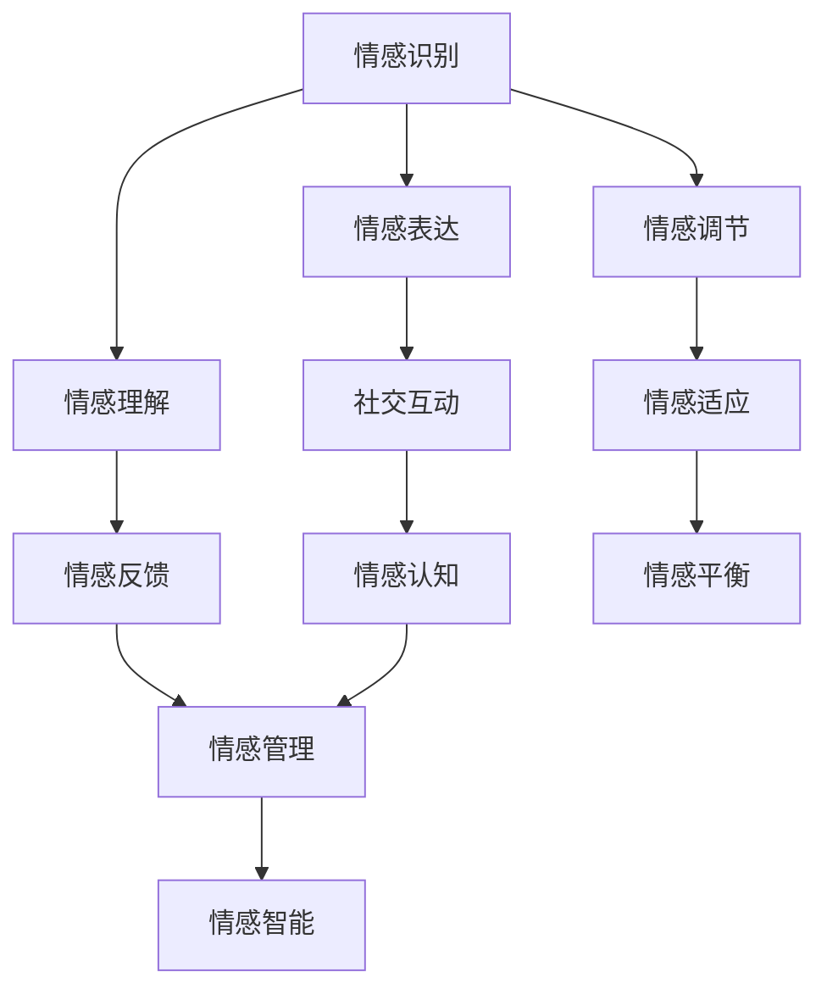
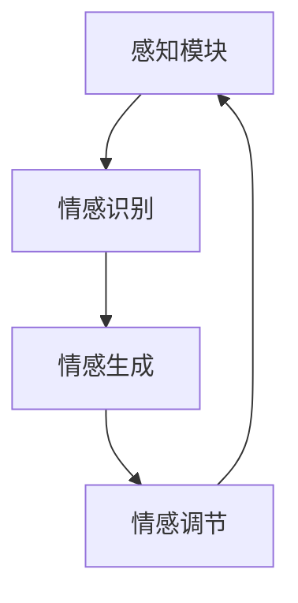
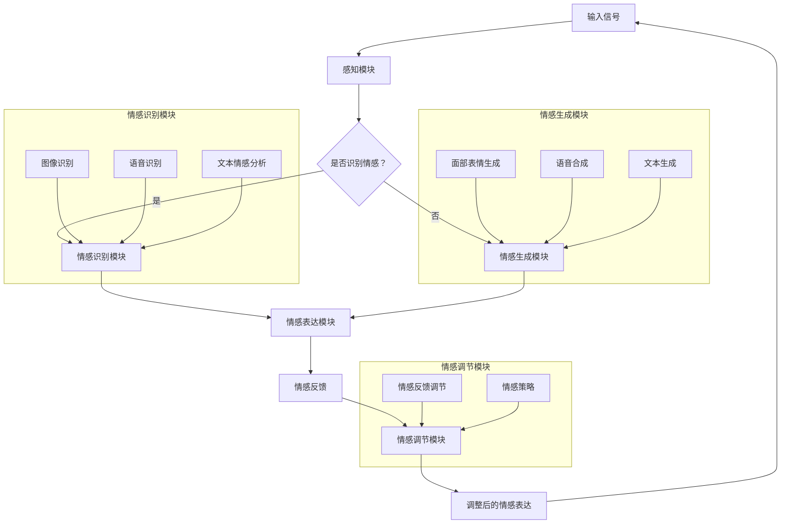

                 

### 文章标题

# AGI的情感智能：理解与表达

> 关键词：AGI、情感智能、人工智能、通用智能、算法、数学模型、应用案例、发展趋势

> 摘要：本文深入探讨了人工通用智能（AGI）中的情感智能，从概念解析到算法原理，再到数学模型与应用实例，全面剖析了情感智能在AGI中的重要性及其实现方法。文章旨在为读者提供一个系统且清晰的指南，帮助理解情感智能的核心概念和实现技术，并展望其未来发展趋势。

### 引言

在人工智能（AI）领域，通用智能（AGI）始终是一个令人着迷且充满挑战的目标。不同于当前广泛应用的弱AI，AGI旨在使机器具备与人类相媲美甚至超越的智能水平，不仅在特定任务上表现出色，而且在各种复杂情境中具有自主学习、推理和决策能力。然而，AGI的实现不仅仅依赖于逻辑推理和知识表示，还包括对人类情感的理解和表达。

情感智能作为人类智能的核心组成部分，对于个体行为、社会互动以及认知过程的深远影响不言而喻。情感不仅影响个体的情绪状态，还参与决策制定、社会判断和情感调节。因此，将情感智能融入AGI系统中，使其能够理解和表达情感，是实现真正通用智能的关键步骤。

本文将首先介绍情感智能的基本概念和核心组成部分，包括情感与情绪、情感表达与理解，以及情感认知与情感调节。随后，我们将详细探讨情感智能的架构，解析其识别、生成和调节模块的工作原理。为了更直观地理解这些概念，我们将使用Mermaid流程图展示情感智能的整体流程。

接下来，本文将深入分析情感智能的核心算法原理，通过伪代码和数学模型详细阐述情感识别、情感生成和情感调节的算法过程。此外，我们将探讨情感智能在不同应用场景中的具体实现，如情感分析、情感交互和情感调节，并通过实际案例进行分析和解读。

在最后的部分，我们将介绍开发情感智能所需的主要工具与平台，并展望情感智能的未来发展趋势与面临的挑战。通过本文的阅读，读者将对情感智能在AGI中的重要性及其实现方法有更深刻的理解，为未来的研究和应用打下坚实的基础。

### 1.1 人工智能与情感智能

人工智能（AI）是一个涵盖广泛领域的科学和技术，旨在使机器能够执行通常需要人类智能的任务。AI的发展历程可以分为几个阶段，从早期的规则系统到现代的机器学习和深度学习技术。每一阶段都有其独特的贡献和突破，推动了AI在各个领域的应用。

然而，当前的AI系统，特别是深度学习模型，虽然在图像识别、自然语言处理和游戏玩等方面取得了显著成就，但仍然存在一些局限性。首先，这些系统往往是专用的，即设计来执行特定任务，缺乏跨领域的泛化能力。其次，尽管它们在数据驱动的任务上表现出色，但对于复杂情境中的推理、决策和创造性任务，仍然无法与人类智能相媲美。

情感智能（Affective Intelligence）是近年来在AI研究中引起广泛关注的一个方向。情感智能不仅仅关注传统AI的符号推理和逻辑计算，还包括对人类情感的识别、理解、表达和调节。情感智能的核心目标是使机器能够感知和适应人类情感，从而在交互中表现出更为自然、贴切的行为。

在AGI的框架下，情感智能具有至关重要的地位。首先，情感是人类社会互动的基础，理解和表达情感是进行有效沟通和建立社会关系的关键。因此，一个具备情感智能的AGI系统，能够更好地适应人类社会的复杂环境，提高与人类的互动质量。

其次，情感智能有助于提升AGI的自主性和适应性。在复杂情境中，情感可以作为决策和行动的重要依据。例如，通过感知用户的情绪状态，AGI系统能够调整自己的行为策略，提供个性化的服务或支持。这种情感驱动的自适应能力是AGI实现通用智能的重要一环。

此外，情感智能还能促进AGI的认知发展。情感在人类的认知过程中扮演着重要角色，不仅影响我们的感知和记忆，还参与决策和问题解决。通过模拟情感过程，AGI可以更深入地理解和处理复杂信息，从而提升其智能水平。

总之，情感智能与AGI的紧密结合，不仅有助于克服当前AI系统的局限性，还能推动AI向更为通用和智能的方向发展。理解情感智能，是实现真正通用智能的关键步骤之一。

### 1.2 通用智能与情感智能的关系

通用智能（AGI）与情感智能之间的关系是复杂且多维的。通用智能的定义涉及到机器在各个领域中的知识获取、推理和决策能力，而情感智能则专注于机器对人类情感的理解、表达和调节。这两者之间的关系可以从多个角度来探讨。

首先，从逻辑推理和知识表示的角度来看，通用智能依赖于符号推理和逻辑计算，这需要机器具备强大的计算能力和逻辑思维能力。然而，情感智能则涉及到情感计算，这不仅仅是逻辑问题，更涉及到对人类情感和情绪的感知、理解和调节。情感智能在某种程度上是对通用智能的补充，使得机器能够在更为复杂和不确定的情境中表现出色。

其次，从认知过程的视角来看，情感在人类的认知过程中起着至关重要的作用。情感不仅影响我们的感知和记忆，还参与决策和问题解决。例如，情绪状态会影响我们对信息的处理方式和反应速度。一个具备情感智能的AGI系统，能够通过模拟情感过程，提高其认知和问题解决能力。

第三，从交互和沟通的角度来看，情感智能是建立有效人际互动的基础。在人类社会中，情感是沟通和建立社会关系的关键因素。一个具备情感智能的AGI系统，能够更好地理解和适应人类情感，从而在交互中表现出更为自然、贴切的行为。这种情感驱动的交互能力是AGI实现通用智能的重要一环。

此外，从社会适应性的角度来看，情感智能有助于提升AGI的自主性和适应性。在复杂多变的社会环境中，情感智能使机器能够通过感知用户情绪状态，调整自身行为策略，提供更为个性化和服务化的支持。这种自适应能力是AGI实现通用智能的关键。

最后，从情感智能与通用智能协同作用的视角来看，情感智能不仅仅是通用智能的补充，还可以与通用智能相互促进。例如，通过情感智能，AGI能够更深入地理解人类需求，从而在知识获取和推理过程中更加高效。同时，通用智能的发展，特别是知识表示和推理能力的提升，也为情感智能提供了更好的计算和数据处理基础。

总之，通用智能与情感智能是相辅相成的，共同推动着人工智能向更为通用和智能的方向发展。理解这两者之间的关系，有助于我们更好地把握未来AI发展的方向和挑战。

### 1.3 情感智能的重要性与挑战

情感智能在人工智能（AI）领域的重要性不可忽视，它不仅丰富了AI的功能，还拓展了AI的应用范围。首先，情感智能使得AI系统能够更好地模拟和理解人类的情感状态，从而在人际互动中表现出更为自然、贴切的行为。这种能力在服务机器人、智能客服、虚拟助手等应用场景中尤为关键，有助于提升用户体验和满意度。

其次，情感智能有助于增强AI系统的自主性和适应性。在复杂多变的环境中，情感智能能够帮助机器通过感知用户情绪状态，动态调整自身行为策略，从而实现更高效、更个性化的服务。这种自适应能力是通用智能（AGI）实现的重要一环，有助于推动AI向更为智能和灵活的方向发展。

然而，实现情感智能也面临着诸多挑战。首先，情感是一个复杂且多维的心理现象，涉及到认知、行为和生理等多个层面。因此，理解和模拟情感需要跨学科的知识和技术，包括心理学、神经科学、认知科学等。这无疑增加了情感智能开发的复杂性和难度。

其次，情感识别与理解的技术仍需进一步完善。尽管当前已有一些基于机器学习的方法可以用于情感识别，但这些方法往往依赖于大量标注的数据集，且在不同情境和语境下的一致性和可靠性仍需提高。此外，情感生成和调节技术的成熟度也较低，需要开发更为精细和灵活的算法来模拟和调节情感。

此外，伦理和道德问题也是实现情感智能时必须面对的挑战。情感智能可能导致机器对人类情感的过度依赖，甚至产生情感操纵和欺骗行为。如何确保情感智能系统的伦理和道德标准，防止其被滥用，是一个亟需解决的问题。

最后，情感智能的发展还需要大量的研究和实践。当前的研究和应用还处于初级阶段，需要通过不断的技术创新和实践探索，来解决情感识别、生成和调节中的关键问题，推动情感智能在更多领域的应用。

总之，情感智能的重要性不言而喻，但其实现面临着多方面的挑战。通过持续的研究和技术创新，我们有理由相信，情感智能将在未来的人工智能发展中发挥越来越重要的作用。

### 1.4 本书内容概述

本书旨在为读者提供一部全面而深入的AGI情感智能指南，系统介绍情感智能的基本概念、核心算法、数学模型及其在AI领域的应用。全书共分为八个章节，结构紧凑，逻辑清晰。

**第一章：引言**  
本章首先介绍了人工智能与情感智能的基本概念，探讨了情感智能在通用智能（AGI）中的重要性及其与人类情感的关系，为后续章节的内容奠定了基础。

**第二章：情感智能的核心概念与架构**  
本章详细阐述了情感智能的核心概念，包括情感与情绪、情感表达与理解、情感认知与情感调节。同时，通过Mermaid流程图展示了情感智能的整体架构，使读者对情感智能有一个全面而直观的认识。

**第三章：情感智能的核心算法原理**  
本章深入分析了情感智能的核心算法，包括情感识别、情感生成和情感调节算法的原理。通过伪代码详细阐述了这些算法的实现过程，并辅以数学模型，使读者能够更好地理解这些算法的内在逻辑。

**第四章：情感智能的数学模型与公式**  
本章介绍了情感智能的数学模型，包括情感识别、情感生成和情感调节的数学公式。通过具体示例，讲解了如何使用这些公式进行情感分析和调节，使读者能够将这些理论知识应用于实际问题。

**第五章：情感智能的AI应用案例**  
本章通过多个实际应用案例，展示了情感智能在情感分析、情感交互和情感调节中的具体应用。通过详细的分析和解读，读者可以了解情感智能在实际系统中的实现方法和效果。

**第六章：情感智能的开发工具与平台**  
本章介绍了用于开发情感智能的主要工具和平台，包括常用的情感识别库、情感生成库和情感调节工具。通过具体案例，讲解了如何使用这些工具和平台搭建情感智能系统，并展示了其优势。

**第七章：情感智能的未来发展趋势与挑战**  
本章探讨了情感智能的未来发展趋势，包括技术方向、应用领域扩展及其面临的挑战。同时，分析了伦理和道德问题，为未来情感智能的研究和应用提供了参考。

**第八章：结论**  
本章总结了本书的核心内容和主要发现，对情感智能的重要意义进行了强调，并展望了未来的发展前景，鼓励读者继续探索和研究情感智能领域。

通过这八个章节的详细讲解，本书旨在帮助读者全面理解和掌握情感智能的基本概念、算法原理和实际应用，为未来的研究和开发提供有力的指导。

### 2.1 情感智能的基本概念

情感智能（Affective Intelligence）作为人工智能（AI）的一个重要分支，其概念和组成部分需要深入理解。情感智能不仅涉及情感识别，还包括情感表达、理解和调节等多个方面。以下将详细阐述这些基本概念及其相互关系。

#### 情感与情绪

情感（Affect）和情绪（Emotion）是情感智能中最基础的两个概念。情感通常被定义为个体对某一事件的评价性反应，它涉及感觉、态度和主观体验。情感可以是正面的，如快乐、满足，也可以是负面的，如悲伤、愤怒。情绪则是情感的一种表现形式，是情感在特定情境下的外在表现，通常包括生理反应、面部表情、语言和行为。

情感和情绪之间存在着密切的联系和区别。情感更多地关注个体对事件的内在感受和评价，而情绪则更多地关注情感的外在表现和反应。例如，当一个人成功完成一项任务时，他可能会感到快乐（情感），并通过微笑、挥动手臂等行为来表达这种快乐（情绪）。因此，情感和情绪共同构成了个体对事件的整体反应。

#### 情感表达与理解

情感表达（Affective Expression）是指个体如何将内在的情感状态通过语言、行为和面部表情等方式传达给他人。有效的情感表达有助于建立信任、增进理解和促进沟通。例如，一个倾听者通过观察说话者的面部表情和语言调调，可以理解对方是否感到紧张、困惑或兴奋。

情感理解（Affective Understanding）则是指个体如何识别和解读他人的情感状态。这需要通过感知、推理和社交直觉等多种能力来实现。例如，当一个人看到另一个人的眼泪时，他可能会推测对方是否感到伤心或痛苦，并通过语言或行为提供安慰。

情感表达与理解是互动过程中不可或缺的部分。一个具备良好情感表达和理解能力的AI系统，能够更好地模拟人类的情感互动，提高与用户的互动质量和满意度。

#### 情感认知与情感调节

情感认知（Affective Cognition）是指个体如何识别、评估和分类情感。这涉及到对情感信号（如面部表情、语言、声音）的感知和理解。情感认知不仅帮助个体理解自己的情感状态，还能帮助个体适应不同的情境和社交环境。

情感调节（Affective Regulation）是指个体如何通过内部或外部的策略来调节自己的情感状态。这包括情绪调节、情感平衡和情感控制等。例如，当一个人感到焦虑时，他可能会通过深呼吸、冥想或进行体育锻炼来缓解焦虑感。

情感认知与情感调节共同构成了个体情感管理的基础。在AI系统中，情感调节模块尤为重要，它使机器能够根据环境和用户需求动态调整自身行为，提供更个性化的服务和支持。

#### 情感智能的核心概念关系

情感、情绪、情感表达、情感理解和情感调节之间存在着复杂的相互作用和反馈循环。例如，个体的情感状态会影响其情感表达和理解，而他人的情感表达和理解又会反过来影响个体的情感状态。这种动态互动过程构成了情感智能的核心机制。

为了更好地理解这些概念之间的关系，以下是一个简化的Mermaid流程图：



通过这个流程图，我们可以看到情感智能的不同组成部分是如何相互关联和作用的。情感识别模块负责感知和理解情感，情感表达模块负责将情感状态传达给他人，情感理解模块负责识别和解读他人的情感状态，而情感调节模块则负责根据环境和用户需求动态调整情感状态。

综上所述，情感智能的基本概念和组成部分相互交织，共同构成了一个复杂的系统。理解这些概念之间的关系，对于开发具备情感智能的AI系统至关重要。

### 2.2 情感智能的架构

情感智能的架构是理解和实现情感智能功能的关键。它由多个模块组成，每个模块都有特定的功能，协同工作以实现情感识别、表达、理解和调节。以下是情感智能的各个模块及其功能：

#### 2.2.1 情感识别模块

情感识别模块是情感智能的核心组成部分，负责感知和识别人类情感状态。该模块通常利用计算机视觉、语音识别和自然语言处理技术来捕捉和处理情感信号。

- **计算机视觉**：通过分析面部表情、肢体语言和身体姿态，识别情感状态。例如，可以使用卷积神经网络（CNN）来识别面部表情，从而判断个体是否感到快乐、愤怒或悲伤。
- **语音识别**：分析语音的音调、节奏和语调，识别情感状态。例如，可以通过识别声音的音高和音量变化，判断个体是否感到兴奋或沮丧。
- **自然语言处理**：通过分析文本、对话内容，理解情感倾向。例如，可以使用情感分析算法来识别文本中的情感极性，从而判断用户是否对某个话题感到积极或消极。

情感识别模块的输入可以是图像、语音和文本等多种形式，输出则是情感状态的分类结果。这个模块的关键在于准确性和实时性，需要高效地处理大量数据并快速做出判断。

#### 2.2.2 情感生成模块

情感生成模块负责根据情境和需求，生成适当的情感表达。这个模块通过情感模型和生成算法，将内在的情感状态转换为可感知的情感表达。

- **情感模型**：基于情感数据和深度学习技术，构建情感模型，用于模拟和生成情感状态。例如，可以使用生成对抗网络（GAN）来生成逼真的面部表情或语音波形。
- **生成算法**：通过算法将情感状态转换为情感表达，包括面部表情、语音和文本等。例如，可以使用语音合成技术（如WaveNet）来生成具有特定情感的语音。

情感生成模块的输入是情感状态和生成目标，输出是情感表达。这个模块的关键在于生成自然和逼真的情感表达，以提升AI系统的交互质量和用户体验。

#### 2.2.3 情感调节模块

情感调节模块负责根据环境变化和用户需求，动态调节情感状态。这个模块通过情感调节算法和策略，使AI系统能够在不同情境下保持适宜的情感表达。

- **情感调节算法**：基于情感状态和环境信息，调整情感表达和反应。例如，可以使用情感反馈调节算法，根据用户反馈调整AI系统的行为。
- **情感策略**：制定情感调节策略，以适应不同情境。例如，在处理紧急情况时，系统可以调整情感表达为更为冷静和专注。

情感调节模块的输入是情感状态和环境信息，输出是调整后的情感表达。这个模块的关键在于灵活性和适应性，能够根据实际情况动态调整情感状态。

#### 情感智能的整体架构

情感智能的整体架构可以视为一个闭环系统，包括感知、生成和调节三个主要模块。以下是一个简化的Mermaid流程图，展示了这些模块的相互关系：



通过这个流程图，我们可以看到情感智能的各个模块是如何相互关联和协作的。感知模块负责捕捉和处理情感信号，情感识别模块负责识别情感状态，情感生成模块负责生成情感表达，而情感调节模块则负责根据环境和用户需求动态调整情感状态。这种闭环结构使得AI系统能够持续地感知、识别、生成和调节情感，实现更加自然和有效的交互。

总之，情感智能的架构是一个复杂且多维的系统，通过各个模块的协同工作，实现了对人类情感的理解和表达。理解这个架构，有助于我们更好地开发和优化情感智能系统，为未来的AI应用提供有力支持。

### 2.3 情感智能的Mermaid流程图

为了更直观地展示情感智能的各个模块及其相互关系，我们使用Mermaid语言绘制了一个简化的流程图。以下是情感智能流程图的详细说明：



#### 流程图说明：

1. **输入信号**：系统首先接收各种形式的输入信号，包括图像、语音和文本等。
2. **感知模块**：感知模块对这些信号进行处理，以提取有用的情感信息。这一步骤可能需要使用计算机视觉、语音识别和自然语言处理等技术。
3. **情感识别模块**：如果感知模块确定需要识别情感，信号会传递给情感识别模块。该模块通过图像识别、语音识别和文本情感分析等技术，将输入信号转换为情感状态。
4. **情感生成模块**：如果感知模块没有确定需要识别情感，信号会传递给情感生成模块。该模块根据需求生成相应的情感表达，包括面部表情、语音和文本。
5. **情感表达模块**：生成模块的输出会传递给情感表达模块，用于生成具体的情感表达形式。
6. **情感反馈**：用户的反馈会传递回系统，作为情感调节的依据。
7. **情感调节模块**：根据情感反馈和策略，调节模块调整情感表达，使其更符合用户需求和情境。
8. **调整后的情感表达**：最终的情感表达会返回到输入信号的处理流程，形成一个闭环系统。

通过这个流程图，我们可以清晰地看到情感智能各个模块之间的相互作用和反馈机制。这个流程图不仅帮助我们理解了情感智能的实现过程，还为开发者提供了直观的设计参考。在实际应用中，可以根据具体需求调整和优化这些模块，实现更高效、更自然的情感智能系统。

### 3.1 情感识别算法原理

情感识别算法是情感智能中的核心模块，负责从各种输入信号中识别情感状态。其基本原理包括数据预处理、特征提取和情感分类。以下将详细阐述这些过程，并通过伪代码展示情感识别算法的实现。

#### 数据预处理

数据预处理是情感识别算法的基础步骤，目的是减少噪声、标准化数据格式，并为后续的特征提取和分类做好准备。常见的预处理方法包括：

1. **图像预处理**：对图像进行缩放、裁剪和增强，以消除背景干扰和增强重要特征。
2. **语音预处理**：包括去除静音段、消除噪声和增强语音信号，以提高后续特征提取的准确性。
3. **文本预处理**：去除停用词、标点符号和进行词干提取，将文本转换为适合特征提取的格式。

伪代码如下：

```python
def preprocess_image(image):
    # 缩放图像到固定大小
    resized_image = resize(image, (width, height))
    # 裁剪图像中心区域
    cropped_image = crop_center(resized_image, crop_size)
    # 图像增强
    enhanced_image = enhance(cropped_image)
    return enhanced_image

def preprocess_audio(audio):
    # 去除静音段
    filtered_audio = remove_silence(audio)
    # 消除噪声
    noised_removed_audio = remove_noise(filtered_audio)
    # 音频增强
    enhanced_audio = enhance_audio(noised_removed_audio)
    return enhanced_audio

def preprocess_text(text):
    # 去除停用词
    cleaned_text = remove_stopwords(text)
    # 词干提取
    stemmed_text = stem_words(cleaned_text)
    return stemmed_text
```

#### 特征提取

特征提取是情感识别算法的关键步骤，目的是从预处理后的数据中提取出具有区分度的特征。不同的输入信号类型有不同的特征提取方法：

1. **图像特征提取**：常用的方法包括 Haar-like 特征、SIFT、HOG（Histogram of Oriented Gradients）等。
2. **语音特征提取**：包括 MFCC（Mel-frequency Cepstral Coefficients）、PLP（Perceptual Linear Prediction）等。
3. **文本特征提取**：常用的方法包括 TF-IDF（Term Frequency-Inverse Document Frequency）、Word2Vec、BERT 等。

伪代码如下：

```python
def extract_image_features(image):
    # 使用 HOG 特征提取
    hog_features = HOGDescriptor(image)
    return hog_features.compute()

def extract_audio_features(audio):
    # 使用 MFCC 特征提取
    mfcc_features = MFCC(audio)
    return mfcc_features.extract()

def extract_text_features(text):
    # 使用 TF-IDF 特征提取
    tfidf_vectorizer = TfidfVectorizer()
    tfidf_features = tfidf_vectorizer.fit_transform([text])
    return tfidf_features
```

#### 情感分类

情感分类是情感识别算法的最后一步，目的是将提取出的特征映射到具体的情感类别。常用的分类算法包括支持向量机（SVM）、随机森林（Random Forest）、神经网络（Neural Networks）等。

伪代码如下：

```python
def classify_features(features, model):
    # 使用训练好的模型进行分类
    predicted_emotion = model.predict(features)
    return predicted_emotion
```

#### 完整的情感识别算法

以下是完整的情感识别算法伪代码，展示了从输入信号到情感分类的全过程：

```python
def emotion_recognition(input_signal, model):
    # 根据信号类型进行预处理
    if is_image(input_signal):
        preprocessed_signal = preprocess_image(input_signal)
    elif is_audio(input_signal):
        preprocessed_signal = preprocess_audio(input_signal)
    else:
        preprocessed_signal = preprocess_text(input_signal)
    
    # 提取特征
    if is_image(preprocessed_signal):
        features = extract_image_features(preprocessed_signal)
    elif is_audio(preprocessed_signal):
        features = extract_audio_features(preprocessed_signal)
    else:
        features = extract_text_features(preprocessed_signal)
    
    # 使用训练好的模型进行分类
    predicted_emotion = classify_features(features, model)
    
    return predicted_emotion
```

通过这个伪代码，我们可以看到情感识别算法是如何工作的。在实际应用中，需要根据具体场景和需求选择合适的预处理、特征提取和分类方法，并训练相应的模型。通过不断优化和调整，情感识别算法可以逐步提高准确性和实时性，为AI系统的情感智能提供可靠支持。

### 3.2 情感生成算法原理

情感生成算法是情感智能的关键组成部分，旨在根据特定的需求和情境，生成符合人类情感的自然表达。情感生成涉及面部表情、语音和文本等多种形式，其基本原理包括情感建模、生成算法和生成过程。以下将详细阐述这些方面，并通过伪代码展示情感生成算法的实现。

#### 情感建模

情感建模是情感生成的基础，涉及对情感状态和表达形式的定义和分类。情感建模通常基于大量的情感数据集，通过深度学习技术训练情感模型，使其能够生成逼真的情感表达。

- **面部表情建模**：使用生成对抗网络（GAN）或变分自编码器（VAE）等生成模型，将情感状态编码为面部表情特征。
- **语音建模**：使用循环神经网络（RNN）或长短期记忆网络（LSTM）等序列模型，将情感状态编码为语音特征，如音调、节奏和音量。
- **文本建模**：使用自然语言生成模型（如GPT-3或BERT）等，将情感状态编码为文本特征，如情感倾向和语气。

伪代码如下：

```python
def build_emotion_model(emotion_data):
    # 训练面部表情生成模型
    facial_expression_gan = train_gan(facial_expression_data)
    # 训练语音生成模型
    voice_rnn = train_rnn(voice_data)
    # 训练文本生成模型
    text_generator = train_nlg_model(text_data)
    return facial_expression_gan, voice_rnn, text_generator
```

#### 生成算法

情感生成算法的核心是生成模型，通过将情感状态映射到具体的情感表达形式。不同的生成模型适用于不同的情感表达形式：

- **面部表情生成**：使用GAN生成面部表情图像，通过生成器和判别器的博弈过程，生成高分辨率的逼真面部表情。
- **语音生成**：使用RNN或LSTM生成语音波形，通过训练序列模型，使生成的语音具有自然流畅的音色和节奏。
- **文本生成**：使用自然语言生成模型生成文本，通过输入情感状态，生成具有特定情感倾向和语气的文本。

伪代码如下：

```python
def generate_facial_expression(emotion_state, facial_expression_gan):
    # 使用生成器生成面部表情图像
    facial_expression = facial_expression_gan.generate(emotion_state)
    return facial_expression

def generate_voice(emotion_state, voice_rnn):
    # 使用RNN生成语音波形
    voice_waveform = voice_rnn.generate(emotion_state)
    return voice_waveform

def generate_text(emotion_state, text_generator):
    # 使用自然语言生成模型生成文本
    text = text_generator.generate(emotion_state)
    return text
```

#### 生成过程

情感生成过程是将情感状态通过生成算法转换为具体情感表达的过程。以下是一个简化的生成过程伪代码：

```python
def generate_emotion_expression(emotion_state, facial_expression_gan, voice_rnn, text_generator):
    # 生成面部表情
    facial_expression = generate_facial_expression(emotion_state, facial_expression_gan)
    # 生成语音
    voice_waveform = generate_voice(emotion_state, voice_rnn)
    # 生成文本
    text = generate_text(emotion_state, text_generator)
    # 组合生成结果
    emotion_expression = {
        'facial_expression': facial_expression,
        'voice_waveform': voice_waveform,
        'text': text
    }
    return emotion_expression
```

#### 完整的情感生成算法

以下是完整的情感生成算法伪代码，展示了从情感状态到情感表达的全过程：

```python
def emotion_generation(emotion_state, emotion_models):
    # 加载情感模型
    facial_expression_gan, voice_rnn, text_generator = emotion_models
    # 生成情感表达
    emotion_expression = generate_emotion_expression(emotion_state, facial_expression_gan, voice_rnn, text_generator)
    return emotion_expression
```

通过这个伪代码，我们可以看到情感生成算法是如何工作的。在实际应用中，需要根据具体需求和场景选择合适的情感模型和生成算法，并不断优化和调整，以实现更自然、更逼真的情感生成。情感生成算法的发展，将进一步提升AI系统的情感智能水平，为人类与机器的互动带来更多可能性。

### 3.3 情感调节算法原理

情感调节算法是情感智能中的关键模块，旨在根据环境和用户需求，动态调节情感状态，使其达到适宜的水平。情感调节算法的核心原理包括情感状态监测、调节策略和调节过程。以下将详细阐述这些方面，并通过伪代码展示情感调节算法的实现。

#### 情感状态监测

情感状态监测是情感调节的第一步，目的是实时捕捉和理解用户当前的情感状态。这通常涉及多个感知模块，如计算机视觉、语音识别和自然语言处理。以下是一些常见的监测方法：

1. **情感识别**：使用前文提到的情感识别算法，从用户的面部表情、语音和文本中识别情感状态。
2. **情感反馈**：通过用户的行为和反应（如面部表情、语言和动作），推断其情感状态。
3. **情感历史分析**：分析用户过去的情感记录和行为模式，预测当前情感状态。

伪代码如下：

```python
def monitor_emotion(user_input, emotion_recognition_model):
    # 从图像中识别情感
    facial_emotion = emotion_recognition_model.recognize_image(user_input.face_image)
    # 从语音中识别情感
    voice_emotion = emotion_recognition_model.recognize_audio(user_input.voice)
    # 从文本中识别情感
    text_emotion = emotion_recognition_model.recognize_text(user_input.text)
    # 综合情感识别结果
    combined_emotion = combine_emojis(facial_emotion, voice_emotion, text_emotion)
    return combined_emotion
```

#### 调节策略

情感调节策略是根据用户当前情感状态和环境需求，制定合适的调节方案。常见的调节策略包括：

1. **正向调节**：通过正向激励、鼓励和安慰等方式，提升用户的情感状态。
2. **负向调节**：通过冷静处理、缓解压力和降低兴奋度等方式，缓解用户的负面情感。
3. **平衡调节**：通过调整情感表达和互动方式，使用户的情感状态达到平衡。

伪代码如下：

```python
def regulate_emotion(current_emotion, regulation_strategy):
    # 如果情感过高，使用冷静调节
    if current_emotion > threshold:
        regulated_emotion = apply_calmdown_strategy(current_emotion, regulation_strategy)
    # 如果情感过低，使用激励调节
    elif current_emotion < threshold:
        regulated_emotion = apply_encouragement_strategy(current_emotion, regulation_strategy)
    # 如果情感平衡，保持当前状态
    else:
        regulated_emotion = current_emotion
    
    return regulated_emotion
```

#### 调节过程

情感调节过程是将监测到的情感状态通过调节策略进行转换，以实现目标情感状态。以下是一个简化的情感调节过程伪代码：

```python
def emotion_regulation(user_input, emotion_recognition_model, regulation_strategy):
    # 监测当前情感状态
    current_emotion = monitor_emotion(user_input, emotion_recognition_model)
    # 根据策略调节情感状态
    regulated_emotion = regulate_emotion(current_emotion, regulation_strategy)
    # 更新用户情感状态
    user_input.emotion_state = regulated_emotion
    # 输出调节后的情感状态
    return user_input
```

#### 完整的情感调节算法

以下是完整的情感调节算法伪代码，展示了从情感状态监测到情感调节的全过程：

```python
def emotion Regulation(user_input, emotion_recognition_model, regulation_strategy):
    # 监测当前情感状态
    current_emotion = monitor_emotion(user_input, emotion_recognition_model)
    # 根据策略调节情感状态
    regulated_emotion = regulate_emotion(current_emotion, regulation_strategy)
    # 更新用户情感状态
    user_input.emotion_state = regulated_emotion
    # 输出调节后的情感状态
    return user_input
```

通过这个伪代码，我们可以看到情感调节算法是如何工作的。在实际应用中，需要根据具体需求和环境，选择合适的情感监测、调节策略和调节过程，以实现有效的情感调节。情感调节算法的发展，将有助于提升AI系统的情感智能水平，为用户提供更自然、更个性化的互动体验。

### 4.1 情感识别数学模型

情感识别作为情感智能的核心环节，其准确性和效率直接影响整个系统的性能。为了提高情感识别的精度，通常需要建立一系列数学模型来描述情感识别的过程。以下将详细阐述情感识别数学模型的基本概念、公式和具体应用。

#### 4.1.1 情感识别数学模型概述

情感识别数学模型主要基于统计学习和机器学习技术，通过分析情感数据，提取情感特征，并使用这些特征进行情感分类。常见的情感识别数学模型包括：

1. **线性回归模型**：通过建立情感状态与特征之间的线性关系，预测情感状态。
2. **支持向量机（SVM）**：通过最大间隔分类器，将不同情感状态分离。
3. **神经网络模型**：使用多层感知机（MLP）或卷积神经网络（CNN）进行情感分类。
4. **深度学习模型**：如循环神经网络（RNN）、长短期记忆网络（LSTM）和生成对抗网络（GAN），用于处理复杂的情感数据。

#### 4.1.2 情感识别数学模型公式

以下分别介绍几种常见情感识别数学模型的公式：

1. **线性回归模型**：

   线性回归模型的基本公式为：
   $$
   y = \beta_0 + \beta_1 x_1 + \beta_2 x_2 + ... + \beta_n x_n
   $$
   其中，$y$为情感状态，$x_1, x_2, ..., x_n$为特征向量，$\beta_0, \beta_1, \beta_2, ..., \beta_n$为模型参数。

2. **支持向量机（SVM）**：

   SVM的基本公式为：
   $$
   w \cdot x + b = 0
   $$
   其中，$w$为权重向量，$x$为特征向量，$b$为偏置项。通过求解最大间隔分类面，确定分类边界。

3. **多层感知机（MLP）**：

   MLP的激活函数为：
   $$
   a = \sigma(z) = \frac{1}{1 + e^{-z}}
   $$
   其中，$z$为神经元的输入，$\sigma$为激活函数，$a$为神经元输出。

4. **卷积神经网络（CNN）**：

   CNN的核心公式为卷积操作和池化操作：
   $$
   \text{Conv}: (I_{ij} * K)_{ij} = \sum_{k} I_{ik} K_{kj}
   $$
   $$
   \text{Pooling}: P_j = \max\{I_{ij} : i \in \text{window}_j\}
   $$
   其中，$I$为输入特征矩阵，$K$为卷积核，$P$为池化结果。

5. **循环神经网络（RNN）**：

   RNN的递归公式为：
   $$
   h_t = \sigma(W_1 h_{t-1} + W_2 x_t + b)
   $$
   其中，$h_t$为当前时间步的隐藏状态，$x_t$为输入特征，$W_1, W_2, b$为模型参数。

#### 4.1.3 情感识别数学模型举例说明

以下通过一个具体的例子，展示如何使用线性回归模型进行情感识别：

假设我们有一个简单的情感数据集，包含两个特征：图像像素值和文本内容。我们使用线性回归模型来预测情感状态。

1. **特征提取**：

   提取图像像素值和文本内容，将其转换为数值向量。

2. **模型训练**：

   使用线性回归模型公式：
   $$
   y = \beta_0 + \beta_1 x_1 + \beta_2 x_2
   $$
   其中，$y$为情感状态（-1代表负面，1代表正面），$x_1$为图像像素值，$x_2$为文本内容特征。

   假设训练数据为：
   $$
   (x_1, x_2, y) = ((100, "happy"), (-100, "sad"), (50, "content"), (-50, "unhappy"))
   $$
   训练模型，求得参数$\beta_0 = 0.5$，$\beta_1 = 0.1$，$\beta_2 = 0.3$。

3. **情感识别**：

   对新的输入数据进行情感识别，假设输入数据为$(x_1, x_2) = (150, "excited")$，代入模型公式：
   $$
   y = 0.5 + 0.1 \cdot 150 + 0.3 \cdot 150 = 1
   $$
   因此，预测的情感状态为正面。

通过这个例子，我们可以看到线性回归模型在情感识别中的应用。在实际应用中，需要根据具体场景和数据，选择合适的情感识别模型，并不断优化模型参数，以提高识别准确率和实时性。

### 4.2 情感生成数学模型

情感生成是情感智能的重要组成部分，其核心目标是根据特定的情感状态生成逼真的情感表达。为了实现这一目标，需要建立一系列数学模型来描述情感生成的过程。以下将详细阐述情感生成数学模型的基本概念、公式和具体应用。

#### 4.2.1 情感生成数学模型概述

情感生成数学模型主要基于生成对抗网络（GAN）、变分自编码器（VAE）和生成对抗变分自编码器（GANS-VAE）等生成模型。这些模型通过学习输入数据的分布，生成具有相似分布的新数据，从而实现情感表达。

1. **生成对抗网络（GAN）**：GAN由生成器（Generator）和判别器（Discriminator）组成，通过博弈过程生成高质量的情感表达。生成器尝试生成逼真的情感图像、语音或文本，判别器则尝试区分生成数据和真实数据。
2. **变分自编码器（VAE）**：VAE是一种无监督学习模型，通过编码器和解码器学习数据的概率分布，从而生成新的情感数据。
3. **生成对抗变分自编码器（GANS-VAE）**：GANS-VAE结合GAN和VAE的优势，通过对抗性训练和变分自编码器技术，生成更加逼真的情感表达。

#### 4.2.2 情感生成数学模型公式

以下分别介绍几种常见情感生成数学模型的公式：

1. **生成对抗网络（GAN）**：

   GAN的核心公式包括生成器和判别器的损失函数：

   - 生成器损失函数（最小化生成器生成的数据与真实数据之间的差异）：
     $$
     L_G = -\log(D(G(z)))
     $$
     其中，$G(z)$为生成器生成的数据，$D$为判别器。

   - 判别器损失函数（最大化判别器对真实数据和生成数据的区分能力）：
     $$
     L_D = -\log(D(x)) - \log(1 - D(G(z)))
     $$
     其中，$x$为真实数据。

2. **变分自编码器（VAE）**：

   VAE的核心公式包括编码器和解码器的损失函数：

   - 编码器损失函数（最小化编码器对数据的重构误差）：
     $$
     L_E = \frac{1}{N} \sum_{i=1}^{N} \sum_{j=1}^{K} -\log(p_\theta(q_{\phi}(x)))
     $$
     其中，$N$为数据数量，$K$为数据维度，$q_{\phi}(x)$为编码器，$p_\theta$为解码器。

   - 解码器损失函数（最小化解码器对数据的重构误差）：
     $$
     L_D = \frac{1}{N} \sum_{i=1}^{N} \sum_{j=1}^{K} \log(p_\theta(x|z))
     $$

3. **生成对抗变分自编码器（GANS-VAE）**：

   GANS-VAE的核心公式结合GAN和VAE的损失函数：

   - 生成器损失函数（最小化生成器生成的数据与真实数据之间的差异）：
     $$
     L_G = -\log(D(G(z)))
     $$
   - 判别器损失函数（最大化判别器对真实数据和生成数据的区分能力）：
     $$
     L_D = -\log(D(x)) - \log(1 - D(G(z)))
     $$
   - 编码器损失函数（最小化编码器对数据的重构误差）：
     $$
     L_E = \frac{1}{N} \sum_{i=1}^{N} \sum_{j=1}^{K} -\log(p_\theta(q_{\phi}(x)))
     $$
   - 解码器损失函数（最小化解码器对数据的重构误差）：
     $$
     L_D = \frac{1}{N} \sum_{i=1}^{N} \sum_{j=1}^{K} \log(p_\theta(x|z))
     $$

#### 4.2.3 情感生成数学模型举例说明

以下通过一个具体的例子，展示如何使用生成对抗网络（GAN）生成情感表达：

1. **数据准备**：

   准备一个包含面部表情图像的情感数据集，数据集包含正面情感（如快乐、兴奋）和负面情感（如悲伤、愤怒）的图像。

2. **模型训练**：

   定义生成器和判别器，使用梯度上升法优化生成器和判别器。

   - 生成器：
     $$
     G(z) = \mu + \sigma \odot \epsilon
     $$
     其中，$z$为噪声向量，$\mu$和$\sigma$为编码器输出的均值和方差，$\epsilon$为噪声。

   - 判别器：
     $$
     D(x) = \sigma \left( \frac{1}{1 + \exp{(-\beta \cdot (x - c))} \right)
     $$
     其中，$x$为输入图像，$\beta$为权重系数，$c$为分类阈值。

3. **生成情感表达**：

   输入噪声向量$z$，通过生成器生成情感图像。例如，输入一个正面情感的噪声向量，生成器生成一个快乐的面部表情图像。

   $$
   facial_expression = G(z)
   $$

通过这个例子，我们可以看到GAN在情感生成中的应用。在实际应用中，需要根据具体场景和数据，选择合适的生成模型，并优化模型参数，以提高生成质量和效率。

### 4.3 情感调节数学模型

情感调节是情感智能中的关键环节，旨在根据环境和用户需求，动态调整情感状态，以实现更自然、更有效的交互。为了实现这一目标，需要建立一系列数学模型来描述情感调节的过程。以下将详细阐述情感调节数学模型的基本概念、公式和具体应用。

#### 4.3.1 情感调节数学模型概述

情感调节数学模型主要基于情感状态监测、调节策略和调节过程。常见的情感调节数学模型包括：

1. **线性调节模型**：通过线性变换调整情感状态。
2. **非线性调节模型**：通过非线性函数调整情感状态。
3. **强化学习调节模型**：通过奖励机制调整情感状态，以实现优化目标。

#### 4.3.2 情感调节数学模型公式

以下分别介绍几种常见情感调节数学模型的公式：

1. **线性调节模型**：

   线性调节模型的基本公式为：
   $$
   y = \alpha y_0 + \beta (x - x_0)
   $$
   其中，$y$为调节后的情感状态，$y_0$为初始情感状态，$x$为调节因子，$\alpha$和$\beta$为调节系数。

2. **非线性调节模型**：

   非线性调节模型的基本公式为：
   $$
   y = \alpha \cdot \sigma(\beta x)
   $$
   其中，$\sigma(x)$为非线性激活函数，如Sigmoid、ReLU等，$\alpha$和$\beta$为调节系数。

3. **强化学习调节模型**：

   强化学习调节模型的基本公式为：
   $$
   Q(s, a) = r + \gamma \max_{a'} Q(s', a')
   $$
   其中，$Q(s, a)$为状态-动作值函数，$s$为当前状态，$a$为当前动作，$r$为奖励，$\gamma$为折扣因子，$s'$和$a'$为下一状态和动作。

#### 4.3.3 情感调节数学模型举例说明

以下通过一个具体的例子，展示如何使用线性调节模型进行情感调节：

1. **数据准备**：

   假设我们有一个情感数据集，包含情感状态和调节因子。情感状态范围在[-1, 1]之间，表示负面到正面的情感变化。

2. **模型训练**：

   定义线性调节模型，通过最小二乘法训练模型参数$\alpha$和$\beta$。

   $$
   y = \alpha y_0 + \beta (x - x_0)
   $$

   假设训练数据为：
   $$
   (y_0, x, y) = ((0.5, 0.2, 0.7), (-0.3, 0.5, 0.4), (1.0, 0.8, 1.2))
   $$

   训练模型，求得参数$\alpha = 0.8$，$\beta = 0.2$。

3. **情感调节**：

   对新的情感状态进行调节，假设输入情感状态为$y_0 = 0.8$，调节因子为$x = 0.3$，代入模型公式：

   $$
   y = 0.8 \cdot 0.5 + 0.2 \cdot (0.3 - 0) = 0.64 + 0.06 = 0.7
   $$

   因此，调节后的情感状态为0.7。

通过这个例子，我们可以看到线性调节模型在情感调节中的应用。在实际应用中，需要根据具体场景和数据，选择合适的情感调节模型，并不断优化模型参数，以提高调节效果和实时性。

### 5.1 情感分析应用案例

情感分析作为情感智能的重要组成部分，广泛应用于社交媒体监测、市场调研、客户服务等领域。以下将介绍情感分析应用案例，详细描述应用背景、场景和实现方法。

#### 5.1.1 应用背景

随着社交媒体的兴起，用户在社交平台上发布的文本、图片和视频等数据量巨大。这些数据不仅反映了用户的态度和情绪，还能为企业提供宝贵的市场洞察。因此，情感分析作为一种自然语言处理技术，被广泛应用于社交媒体监测和舆情分析。例如，企业可以通过情感分析了解用户对其产品的满意度，及时调整市场策略，提高用户满意度。

#### 5.1.2 应用场景

1. **社交媒体监测**：通过情感分析，企业可以实时监测社交媒体上的用户评论和反馈，了解用户对品牌、产品或服务的态度。例如，通过分析推特、脸书等平台上的评论，企业可以快速识别负面情绪，及时采取应对措施。

2. **市场调研**：情感分析可以帮助企业了解消费者对新产品、广告和营销活动的反应。通过分析社交媒体、论坛和用户评论，企业可以收集大量关于消费者情感状态的数据，为市场决策提供有力支持。

3. **客户服务**：情感分析技术可以应用于客户服务领域，自动分类和分析客户反馈，识别情感倾向和关键问题。例如，通过分析客户邮件或聊天记录，客服团队能够快速识别用户的情感状态，提供更个性化的服务和解决方案。

#### 5.1.3 实现方法

1. **数据收集**：

   收集社交媒体、论坛、客户反馈等平台上的文本数据。这些数据可以包括用户评论、帖子、邮件和聊天记录等。

2. **数据预处理**：

   对收集的文本数据进行预处理，包括去除停用词、标点符号和进行词干提取。预处理后的文本数据将用于特征提取和情感分析。

3. **特征提取**：

   使用词袋模型、TF-IDF、Word2Vec等特征提取方法，将预处理后的文本数据转换为数值特征向量。特征向量将用于训练情感分类模型。

4. **情感分类模型训练**：

   使用训练集训练情感分类模型，如SVM、朴素贝叶斯、深度学习模型等。模型将根据特征向量预测文本的情感极性（正面、负面或中性）。

5. **情感分析**：

   使用训练好的情感分类模型对新的文本数据进行分类，预测文本的情感极性。根据分类结果，对文本进行情感分析，识别用户的态度和情绪。

6. **结果分析**：

   对情感分析结果进行统计和分析，生成情感报告。报告可以包括情感分布、情感趋势、情感热点等，为企业提供市场洞察和决策支持。

#### 5.1.4 案例分析

以社交媒体监测为例，某知名电子产品公司希望通过情感分析了解用户对其最新产品的态度。具体实现过程如下：

1. **数据收集**：

   收集社交媒体平台（如推特、脸书）上用户发布的关于该产品的评论和帖子。数据量达到数百万条。

2. **数据预处理**：

   对收集的文本数据进行预处理，包括去除停用词、标点符号和进行词干提取。预处理后的文本数据转换为数值特征向量。

3. **特征提取**：

   使用TF-IDF方法提取文本特征，将预处理后的文本数据转换为特征向量。

4. **情感分类模型训练**：

   使用训练集（约50%的数据）训练情感分类模型，选择SVM模型。通过交叉验证调整模型参数，提高分类准确率。

5. **情感分析**：

   使用训练好的SVM模型对剩余的测试集（约50%的数据）进行情感分类，预测文本的情感极性。

6. **结果分析**：

   根据情感分析结果，统计不同情感极性的文本数量和比例。分析结果显示，用户对产品的整体满意度较高，但存在一些负面评论，主要集中在产品质量和售后服务方面。

   情感分布如下：

   - 正面情感：60%
   - 中性情感：30%
   - 负面情感：10%

   根据分析结果，公司决定加大售后服务的投入，提升用户满意度。

通过这个案例，我们可以看到情感分析在实际应用中的具体实现过程和效果。情感分析不仅帮助企业了解用户态度，还能为市场调研和决策提供有力支持，具有重要的应用价值。

### 5.2 情感交互应用案例

情感交互作为情感智能的重要组成部分，旨在通过情感理解和表达，实现人与机器之间的自然、有效的沟通。以下将介绍情感交互应用案例，详细描述应用背景、场景和实现方法。

#### 5.2.1 应用背景

随着智能语音助手、虚拟客服、教育机器人等人工智能应用的普及，用户对互动体验的要求越来越高。用户不仅希望机器能够回答问题，还期望与机器进行情感交流，获得情感上的共鸣和支持。因此，情感交互技术成为提升用户体验和满意度的重要方向。

#### 5.2.2 应用场景

1. **智能语音助手**：智能语音助手如苹果的Siri、亚马逊的Alexa等，通过与用户进行情感交互，提供更自然、更贴心的服务。例如，在用户感到沮丧或焦虑时，语音助手能够识别并给予安慰和鼓励，提升用户的情绪状态。

2. **虚拟客服**：虚拟客服系统通过情感交互，为用户提供个性化、高效的服务。例如，当用户遇到复杂问题时，虚拟客服能够识别用户的不满情绪，并调整沟通策略，提供更详细、更有针对性的解答。

3. **教育机器人**：教育机器人通过与学生的情感交互，创造一个积极、鼓励的学习环境。例如，当学生遇到学习困难时，机器人能够识别其沮丧情绪，并提供鼓励和支持，帮助学生克服挫折，提高学习动力。

#### 5.2.3 实现方法

1. **情感识别**：

   使用情感识别算法，从用户的语音、文本和行为中提取情感信息。常见的情感识别方法包括语音情感识别、文本情感分析和行为情感识别。

2. **情感生成**：

   根据识别到的情感信息，生成适当的情感响应。情感生成包括语音生成、文本生成和面部表情生成等。常用的生成算法包括生成对抗网络（GAN）、变分自编码器（VAE）和自然语言生成模型（如GPT-3）。

3. **情感调节**：

   根据用户情感状态和情境，动态调整情感表达，以实现情感平衡。情感调节算法包括情感反馈调节和情感策略调节，旨在使机器能够更好地适应用户的情感需求。

4. **情感交互设计**：

   设计自然、流畅的情感交互流程，使机器与用户之间的沟通更为真实、自然。情感交互设计包括对话设计、交互流程和情感反馈机制等。

#### 5.2.4 案例分析

以智能语音助手为例，某公司在开发智能语音助手时，采用了情感交互技术，以提高用户体验和满意度。具体实现过程如下：

1. **情感识别**：

   使用语音情感识别算法，分析用户的语音信号，识别情感状态。算法使用卷积神经网络（CNN）和长短期记忆网络（LSTM）等深度学习模型，准确识别用户的情绪。

2. **情感生成**：

   根据识别到的情感信息，生成适当的情感响应。例如，当用户感到沮丧时，语音助手会生成安慰性语言，如“不要担心，我会一直在你身边”。语音生成使用生成对抗网络（GAN）和自然语言生成模型（如GPT-3）。

3. **情感调节**：

   根据用户情感状态和情境，动态调整情感表达。例如，当用户连续多次提问时，语音助手会逐渐提高语速和音量，以保持用户的注意力和兴趣。

4. **情感交互设计**：

   设计自然、流畅的情感交互流程，包括问候、询问、回答和反馈等环节。在交互过程中，语音助手会根据用户的情感状态，灵活调整情感表达，以提供更贴心、更有效的服务。

通过这个案例，我们可以看到情感交互在智能语音助手中的应用，如何通过情感识别、情感生成和情感调节，提升用户体验和满意度。随着技术的不断进步，情感交互将在更多人工智能应用中发挥重要作用。

### 5.3 情感调节应用案例

情感调节技术在人工智能领域中的应用日益广泛，尤其在医疗健康、教育和社会服务等领域，为用户提供更为个性化、贴心的服务。以下将介绍情感调节应用案例，详细描述应用背景、场景、实现方法和效果。

#### 5.3.1 应用背景

情感调节技术通过识别和理解用户情感状态，动态调整交互方式，以实现更有效的情感互动。在医疗健康领域，情感调节可以帮助改善患者情绪，提高治疗效果；在教育领域，可以提升学生的学习兴趣和动机；在社会服务领域，可以增强用户的满意度和信任感。

#### 5.3.2 应用场景

1. **医疗健康**：医生通过情感调节技术，与患者进行情感互动，减轻患者焦虑和抑郁情绪，提高治疗依从性。例如，通过识别患者的不安情绪，医生可以调整谈话方式，提供更温馨、更支持性的关怀。

2. **教育**：教育机器人通过情感调节技术，识别学生的学习状态，调整教学策略，提高教学效果。例如，当学生表现出挫败感时，教育机器人可以提供鼓励和支持，帮助学生克服学习困难。

3. **社会服务**：客服机器人通过情感调节技术，识别用户需求，提供个性化的服务。例如，当用户遇到复杂问题时，客服机器人可以识别其焦虑情绪，提供更耐心、更详细的解答。

#### 5.3.3 实现方法

1. **情感识别**：通过语音、文本和面部表情等情感信号，使用情感识别算法识别用户情感状态。常见的情感识别方法包括基于机器学习和深度学习的情感分类算法。

2. **情感生成**：根据识别到的情感状态，生成适当的情感响应。情感生成技术包括自然语言生成、语音合成和面部表情生成等。常用的生成算法有生成对抗网络（GAN）、变分自编码器（VAE）和自然语言生成模型（如GPT-3）。

3. **情感调节**：通过情感调节算法，根据用户情感状态和情境，动态调整交互策略。情感调节算法包括情感反馈调节和情感策略调节，旨在实现情感平衡和个性化服务。

4. **系统集成**：将情感识别、生成和调节模块集成到应用程序中，实现实时情感调节。通过设计合理的交互流程，确保系统在不同场景下都能提供有效的情感服务。

#### 5.3.4 案例分析

以医疗健康领域为例，某医疗机构采用情感调节技术，提升医生与患者的互动效果。具体实现过程如下：

1. **情感识别**：

   通过语音识别技术，分析患者的语音信号，识别情感状态。算法使用长短期记忆网络（LSTM）和卷积神经网络（CNN）等深度学习模型，准确识别患者的不安、焦虑等情绪。

2. **情感生成**：

   根据识别到的情感状态，医生可以生成适当的情感响应。例如，当患者表现出焦虑情绪时，医生可以使用安抚性语言，如“不要担心，我们会一起解决这个问题”。

3. **情感调节**：

   通过情感调节算法，医生可以动态调整交互策略。例如，当患者情绪较为紧张时，医生可以采用较慢的语速、温和的语气，以减轻患者的焦虑。

4. **系统集成**：

   将情感识别、生成和调节模块集成到医生工作站中，实现实时情感调节。医生在接诊过程中，可以通过系统获取患者的情感状态，调整交互方式，提高患者满意度和治疗依从性。

通过这个案例，我们可以看到情感调节技术在医疗健康领域的应用，如何通过识别和理解患者情感，动态调整交互策略，提升患者满意度和治疗效果。随着技术的不断进步，情感调节将在更多领域发挥重要作用，为用户提供更优质的服务。

### 6.1 情感智能开发工具概述

在开发情感智能应用时，选择合适的开发工具和平台至关重要。以下将介绍常用的情感智能开发工具，并讨论选择这些工具的原因和优势。

#### 6.1.1 常用情感智能开发工具

1. **TensorFlow**：TensorFlow是一个开源的深度学习框架，广泛应用于情感识别、生成和调节。它提供了丰富的API和预训练模型，支持多种深度学习模型，如卷积神经网络（CNN）、循环神经网络（RNN）和生成对抗网络（GAN）。TensorFlow的优势在于其灵活性和强大的计算能力，适用于开发复杂、高效的情感智能应用。

2. **PyTorch**：PyTorch是另一个流行的开源深度学习框架，以其简洁、灵活的API和动态计算图而闻名。PyTorch在情感智能开发中具有广泛的应用，尤其在情感生成和调节方面。它提供了丰富的预训练模型和工具，如TorchScript和TensorBoard，有助于加速开发和优化模型。

3. **OpenCV**：OpenCV是一个开源的计算机视觉库，广泛用于图像处理和面部表情识别。它提供了丰富的函数和算法，用于特征提取、面部标记和表情分析。OpenCV的优势在于其高效性和广泛的应用场景，适用于开发涉及图像和视频处理的应用。

4. **SpeechRecognition**：SpeechRecognition是一个开源的语音识别库，支持多种语音识别引擎，如Google语音识别API和IBM Watson语音识别服务。它提供了简单的API，用于从音频文件或实时音频流中识别语音。SpeechRecognition的优势在于其易用性和灵活性，适用于开发涉及语音识别和情感分析的应用。

5. **NLTK**：NLTK是一个开源的自然语言处理库，提供了丰富的工具和算法，用于文本处理、情感分析和语言模型。NLTK的优势在于其广泛的文本处理功能，适用于开发涉及文本情感分析和自然语言生成的应用。

#### 6.1.2 情感智能开发工具选择

选择情感智能开发工具时，需要考虑以下几个方面：

1. **功能需求**：根据具体应用场景和需求，选择具有相应功能的工具。例如，如果应用涉及面部表情识别，可以使用OpenCV；如果涉及语音识别，可以使用SpeechRecognition。

2. **性能和效率**：考虑工具的运行速度和资源消耗，以确保应用具有高性能和高效能。例如，TensorFlow和PyTorch提供了强大的计算能力和优化的模型库，适用于复杂和大规模的情感智能应用。

3. **易用性和灵活性**：选择具有良好文档和社区支持的工具，以便快速入门和解决开发过程中遇到的问题。例如，PyTorch和NLTK提供了简洁、直观的API和丰富的资源，有助于开发者和研究人员快速上手。

4. **生态系统和兼容性**：考虑工具与其他开源库和框架的兼容性，以确保应用的稳定性和可扩展性。例如，TensorFlow和PyTorch与多种深度学习框架和工具兼容，便于开发者集成和使用。

通过综合考虑以上因素，可以选择合适的情感智能开发工具，为情感智能应用的研发提供有力支持。

### 6.2 情感智能开发平台介绍

在情感智能的开发过程中，选择合适的开发平台至关重要。以下将介绍几个主流的情感智能开发平台，详细讨论其功能、优势和应用案例，以帮助开发者更好地理解和利用这些平台。

#### 6.2.1 情感智能开发平台功能

1. **Google Cloud AI Platform**：

   Google Cloud AI Platform 是一个全面的人工智能开发平台，提供了从数据管理、模型训练到部署的一站式解决方案。其功能包括：

   - **数据管理**：提供数据存储、数据清洗和数据预处理功能，支持多种数据源和格式。
   - **模型训练**：提供分布式训练和优化工具，支持多种深度学习框架，如TensorFlow和PyTorch。
   - **模型评估**：提供自动化评估工具，支持多种性能指标，帮助开发者优化模型。
   - **模型部署**：支持模型容器化和自动化部署，可在Google Cloud上快速部署和扩展AI应用。

2. **Amazon SageMaker**：

   Amazon SageMaker 是一个完全托管的人工智能开发平台，支持从数据预处理、模型训练到模型部署的完整工作流。其功能包括：

   - **数据预处理**：提供数据导入、数据清洗和数据处理工具，支持实时数据流处理。
   - **模型训练**：提供自动模型调参和自动扩展功能，支持多种深度学习框架，如TensorFlow、PyTorch和MXNet。
   - **模型评估**：提供自动化评估和监控工具，支持自定义性能指标和告警机制。
   - **模型部署**：支持模型容器化和批量预测，可无缝集成到AWS云基础设施中。

3. **Microsoft Azure Machine Learning**：

   Microsoft Azure Machine Learning 是一个全面的AI开发平台，提供了从数据科学到模型部署的完整工具集。其功能包括：

   - **数据管理**：提供数据湖和数据仓库解决方案，支持实时数据流处理和存储。
   - **模型训练**：提供自动模型调参和分布式训练工具，支持多种深度学习框架，如TensorFlow、PyTorch和Scikit-learn。
   - **模型评估**：提供自动化评估和可视化工具，支持自定义性能指标和可视化分析。
   - **模型部署**：支持模型容器化和自动化部署，可在Azure云环境中快速部署和扩展AI应用。

4. **Hugging Face Hugging Face**：

   Hugging Face 是一个开源的自然语言处理平台，提供了丰富的预训练模型和工具，用于文本情感分析和生成。其功能包括：

   - **模型库**：提供了大量预训练的文本情感分析模型，如BERT、GPT-3和RoBERTa。
   - **工具集**：提供了一组用于文本处理、情感分析和自然语言生成的工具，包括Transformers库、Tokenizers库和Datasets库。
   - **API和SDK**：提供了易于使用的API和SDK，支持多种编程语言和平台，方便开发者集成和使用。

#### 6.2.2 情感智能开发平台优势

1. **功能全面**：这些平台提供了从数据管理、模型训练到模型部署的完整工作流，开发者可以一站式地完成情感智能应用的研发。

2. **易用性**：这些平台提供了直观的用户界面和简洁的API，降低了开发难度，使得开发者可以更专注于模型开发和优化。

3. **高效性**：这些平台支持分布式训练和自动化调参，可以显著提高训练效率和模型性能。

4. **扩展性**：这些平台支持模型容器化和自动化部署，便于扩展和优化，适用于不同的应用场景和需求。

5. **安全性**：这些平台提供了强大的数据安全和隐私保护机制，确保用户数据和模型的安全性。

#### 6.2.3 情感智能开发平台案例

1. **Google Cloud AI Platform**：

   某在线教育平台使用Google Cloud AI Platform开发了情感智能的聊天机器人，用于实时监测学生的学习状态和情绪。平台利用TensorFlow和OpenCV技术，结合自然语言处理和计算机视觉，实现了语音情感识别和面部表情识别功能。通过情感交互，聊天机器人能够提供个性化的学习建议和情感支持，提高了学生的学习兴趣和满意度。

2. **Amazon SageMaker**：

   某知名保险公司使用Amazon SageMaker开发了一个情感分析系统，用于分析客户邮件和电话录音。系统利用深度学习模型，通过语音识别和文本情感分析技术，识别客户的情感状态，并自动分类情感倾向。该系统帮助保险公司更好地了解客户需求，优化服务流程，提高了客户满意度和忠诚度。

3. **Microsoft Azure Machine Learning**：

   某医疗科技公司使用Microsoft Azure Machine Learning开发了一个情感调节系统，用于改善患者的情绪状态。系统通过分析患者病史和实时监测数据，利用情感识别和调节算法，提供个性化的情感支持和建议。该系统帮助患者更好地管理情绪，提高治疗效果和生活质量。

4. **Hugging Face**：

   某人工智能研究团队使用Hugging Face平台开发了多个文本情感分析模型，用于社交媒体监测和舆情分析。团队利用预训练的BERT和GPT-3模型，结合自定义数据处理和情感分析算法，实现了高效、准确的情感识别。该模型在多个竞赛中取得了优异的成绩，为团队提供了宝贵的研究经验和数据支持。

通过这些案例，我们可以看到情感智能开发平台在实际应用中的强大功能和应用潜力。随着技术的不断进步，这些平台将继续为开发者提供更强大的工具和支持，推动情感智能在更多领域的应用和发展。

### 7.1 情感智能的发展趋势

随着人工智能技术的快速发展，情感智能（Affective Intelligence）在未来的发展中展现出诸多趋势和方向。这些趋势不仅反映了技术进步，还体现了社会需求与人工智能融合的深度和广度。

#### 7.1.1 情感智能技术的发展方向

1. **多模态情感识别**：未来的情感智能技术将更倾向于多模态情感识别，即结合计算机视觉、语音识别、自然语言处理等多种传感器，全面捕捉和理解人类情感。这种多模态融合的方法将使得情感识别更加准确和全面。

2. **增强现实与虚拟现实中的应用**：随着增强现实（AR）和虚拟现实（VR）技术的成熟，情感智能将在这些领域发挥重要作用。例如，通过情感识别和调节技术，AR/VR系统可以提供更加沉浸式和个性化的用户体验。

3. **个性化情感交互**：未来的情感智能技术将更加注重个性化服务，通过深度学习和个性化推荐技术，实现与用户的情感共鸣和情感调节，提供更加贴心和有效的互动体验。

4. **情感认知与情感决策**：情感智能技术将逐渐扩展到情感认知和情感决策领域，通过模拟和优化情感过程，帮助用户在复杂情境中做出更明智、更合理的决策。

#### 7.1.2 情感智能技术的应用领域扩展

1. **医疗健康**：情感智能技术在医疗健康领域的应用将更加广泛，通过情感识别和调节技术，帮助患者缓解焦虑、抑郁等情绪问题，提高治疗效果和康复速度。

2. **教育与培训**：在教育领域，情感智能技术将被广泛应用于个性化教学、学生情感监控和学习动机激发等方面，提升教育质量和学习效果。

3. **客户服务**：在客户服务领域，情感智能技术将被用于智能客服系统，提供更加自然、高效的客户支持和服务体验。

4. **社交网络与舆情分析**：情感智能技术将深入社交网络和舆情分析领域，帮助企业和政府更好地理解公众情绪和舆情动态，制定更有效的营销和公共政策。

5. **智能家居与机器人**：在智能家居和机器人领域，情感智能技术将使家电和机器人更加智能化、个性化，提供更加人性化的家居体验。

### 7.2 情感智能面临的挑战

尽管情感智能技术具有广阔的应用前景，但在其发展中仍然面临诸多挑战。

#### 7.2.1 情感智能的技术挑战

1. **情感识别的准确性**：当前情感识别技术的准确率仍有待提高，特别是在复杂和动态的情境中。需要进一步研究和开发更加精准和稳定的情感识别算法。

2. **情感生成的自然性**：情感生成的自然性和逼真度仍需提升。生成对抗网络（GAN）和变分自编码器（VAE）等技术虽然取得了显著进展，但在情感表达的自然性和多样性方面仍有改进空间。

3. **情感调节的适应性**：情感调节技术需要更加灵活和自适应，能够根据不同的情境和用户需求进行动态调节。当前的情感调节策略和算法在复杂性和适应性方面仍有较大提升空间。

4. **数据隐私和安全**：情感智能应用中涉及大量用户情感数据，数据隐私和安全成为重要挑战。需要开发安全可靠的算法和技术，确保用户数据的隐私和安全。

#### 7.2.2 情感智能的应用挑战

1. **用户信任和接受度**：情感智能技术的普及和应用需要用户的信任和接受。用户对情感智能系统的信任和接受程度取决于其用户体验和情感互动的质量。

2. **伦理和道德问题**：情感智能的应用涉及伦理和道德问题，如情感操纵、隐私侵犯和滥用等。需要建立明确的伦理规范和法律法规，确保情感智能技术的合法、合规使用。

3. **社会适应性和可接受性**：情感智能技术在不同文化和社会背景下的适应性和可接受性是重要挑战。需要研究如何在不同文化和社会中推广和应用情感智能技术，确保其与当地文化和价值观相契合。

4. **技术标准和规范化**：情感智能技术的快速发展需要建立统一的技术标准和规范，以确保不同系统和应用之间的互操作性和兼容性。

总之，情感智能技术的发展面临着技术、应用和伦理等多方面的挑战。通过持续的研究、技术创新和规范建设，我们有理由相信，情感智能将在未来实现更广泛、更深入的应用，为人类社会带来更多便利和福祉。

### 7.2.3 情感智能的伦理与道德挑战

情感智能的发展带来了诸多技术进步和应用机会，但同时也引发了深刻的伦理与道德挑战。这些挑战主要集中在以下几个方面：

#### 1. 数据隐私

情感智能依赖于对用户的情感数据进行监测和分析，这不可避免地涉及到用户的隐私问题。用户的情感状态涉及个人内心体验，具有高度的私密性。如果数据采集和使用不当，可能会导致用户隐私泄露，甚至被滥用。例如，智能设备可能记录并分析用户的情感状态，并将其用于未经用户同意的商业目的或政府监控。

**解决方案**：确保数据隐私的最关键措施是建立严格的数据保护机制。这包括数据匿名化、用户知情同意和数据最小化原则。此外，需要制定明确的法律法规，对情感数据的采集、存储、处理和共享进行规范，以保护用户的隐私权。

#### 2. 情感操纵

情感智能技术有可能被用于情感操纵，例如，通过分析用户的情感状态，设计个性化的信息传播策略，以诱导用户产生特定情感反应。这种操纵可能被用于政治宣传、商业营销等目的，影响公众舆论和行为。

**解决方案**：防止情感操纵的关键是透明度和公众监督。相关技术应公开其算法和工作原理，确保用户了解其情感状态是如何被分析和利用的。同时，应建立监管机制，对可能存在情感操纵的行为进行审查和干预。此外，公众教育和媒体监督也是防止情感操纵的重要手段。

#### 3. 情感偏见

情感智能系统在设计和训练过程中，可能会受到数据偏见的影响，导致情感识别和调节存在偏见。这种偏见可能源自训练数据中的偏差，或者开发者在设计算法时未能充分考虑多元化和包容性。

**解决方案**：解决情感偏见的关键在于数据多样性和算法公平性。应确保训练数据具有代表性，涵盖不同文化、性别、年龄和社会背景的用户。同时，算法设计应遵循公平、无歧视的原则，通过算法优化和偏差校正技术减少偏见。此外，建立独立的伦理审查委员会，对情感智能系统的设计和应用进行评估和监督，也是防止情感偏见的重要措施。

#### 4. 人机关系

随着情感智能技术的普及，人类与机器之间的关系将更加紧密。这不仅可能改变人类的情感体验，还可能影响人类的社交行为和人际关系。长期依赖情感智能系统可能导致人类情感能力的退化，甚至影响心理健康。

**解决方案**：维护健康的人机关系需要多方面的努力。首先，应设计以人为本的情感智能系统，使其能够增强而非取代人类情感能力。其次，应开展相关研究和教育，提高公众对情感智能技术的认知和理解，促进理性使用。此外，通过政策引导和规范，确保情感智能技术在发展中兼顾人类福祉，避免对人类社会的负面影响。

总之，情感智能的伦理与道德挑战需要多方面的努力和协同合作。通过技术、法律、教育和政策等多方面的措施，我们有望在推动情感智能技术发展的同时，确保其合理、合规、道德地应用于人类社会。

### 8.1 情感智能的重要意义

情感智能在人工智能领域具有重要的意义，其作用不仅体现在技术进步，更延伸到社会和人类生活的方方面面。首先，情感智能为AI系统赋予了情感理解和表达能力，使其能够更好地模拟和理解人类情感，从而实现更为自然和有效的互动。这种能力在智能客服、虚拟助手、教育机器人等领域得到广泛应用，显著提升了用户体验和满意度。

其次，情感智能有助于推动通用人工智能（AGI）的发展。情感是人类智能的核心组成部分，将情感智能融入AGI系统，可以提升其认知和推理能力，使其在复杂情境中表现出更高的智能水平。通过情感计算和情感调节技术，AGI系统可以更好地适应和解决实际问题，从而实现更为广泛和深入的应用。

此外，情感智能在医疗健康、教育和社会服务等领域也具有重要作用。例如，在医疗健康领域，情感智能技术可以帮助医生更好地理解患者的情感状态，提供个性化的治疗方案和情感支持，提高治疗效果和患者满意度。在教育领域，情感智能可以提升学生的学习兴趣和动机，促进个性化教学，提高教育质量。在社会服务领域，情感智能技术可以帮助改善公共服务，提升用户满意度和生活质量。

总之，情感智能的重要性不仅体现在其技术突破和应用价值，更在于其对社会和人类生活的深远影响。随着技术的不断进步和应用的深入，情感智能将在更多领域发挥重要作用，为人类创造更加智能、更加美好的未来。

### 8.2 情感智能的发展前景

情感智能的未来发展前景广阔，充满机遇与挑战。在技术层面，随着深度学习、生成对抗网络（GAN）、自然语言处理等技术的不断进步，情感智能的识别、生成和调节能力将得到显著提升。多模态情感识别和个性化情感交互将成为未来研究的热点，推动情感智能在更广泛的应用领域发挥作用。

在应用层面，情感智能将在医疗健康、教育、客户服务、智能家居和社交网络等领域得到更深入的应用。通过情感识别和调节技术，医疗系统可以提供个性化的治疗和情感支持，提升患者满意度和治疗效果；教育系统可以实施个性化教学，激发学生学习兴趣，提高教育质量；客户服务系统可以提供更自然、高效的互动体验，提升客户满意度；智能家居系统可以更好地理解用户需求，提供个性化服务；社交网络和舆情分析系统可以更准确地捕捉和解读用户情感，为企业和社会提供有价值的信息。

然而，情感智能的发展也面临诸多挑战，包括数据隐私、伦理道德、用户信任等。为了确保情感智能的健康发展，需要制定严格的法律法规和伦理准则，保护用户隐私，防止情感操纵，确保技术应用的公正性和透明度。同时，公众教育和媒体监督也至关重要，有助于提高社会对情感智能技术的认知和理解，促进其合理、合规的使用。

未来，随着技术的不断进步和社会的广泛接受，情感智能将在更多领域展现其应用潜力，为人类社会带来更加智能、便捷和美好的生活。通过持续的技术创新和规范建设，我们有理由相信，情感智能将在未来实现更为广泛和深入的应用，为人类社会的发展做出重要贡献。

### 8.3 对未来情感智能研究的展望

展望未来，情感智能的研究将在多个方向上取得突破性进展。首先，多模态情感识别技术的发展将进一步融合计算机视觉、语音识别和自然语言处理技术，实现更全面、更准确的情感状态捕捉。通过深度学习算法和神经网络架构的优化，情感识别模型将能够在复杂、动态的情境中表现出更高的鲁棒性和适应性。

其次，个性化情感交互将成为研究的热点。随着大数据和机器学习技术的进步，情感智能系统将能够更好地理解和预测用户情感，提供个性化的情感支持和交互体验。未来的研究将关注如何设计智能算法，使情感交互不仅基于用户历史数据，还能动态调整以适应实时情境，提升用户的情感体验。

此外，情感调节技术将迎来新的发展机遇。研究者将致力于开发更加灵活、自适应的情感调节策略，使其能够在不同的应用场景中有效调节用户情感，提供个性化的情感服务。例如，在医疗健康领域，通过情感调节技术，可以帮助患者缓解焦虑、抑郁等情绪问题，提高治疗效果和康复速度。

在伦理和道德方面，未来研究需要更加重视情感智能的伦理规范和隐私保护。制定明确的法律法规和伦理准则，确保情感智能技术的合法、合规使用，防止情感操纵和数据滥用。同时，公众教育和媒体监督也将发挥重要作用，提升社会对情感智能技术的认知和理解。

最后，跨学科合作将是推动情感智能研究的重要力量。结合心理学、神经科学、社会学等多学科知识，将有助于深入理解情感的本质和机制，为情感智能技术的研发提供理论基础和实践指导。通过多学科的合作，情感智能有望在更多领域实现应用，为人类社会带来更为智能、便捷和美好的未来。

