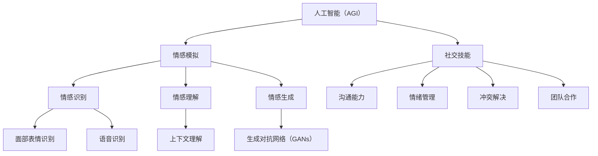

                 

### 文章标题

# AGI的情感模拟与社交能力开发

### 关键词

- AGI
- 情感模拟
- 社交能力
- 机器学习
- 强化学习
- 人机交互

### 摘要

本文将深入探讨人工智能（AGI）的情感模拟与社交能力开发。我们将从基础理论出发，逐步解析AGI的情感模拟机制，并详细探讨如何利用先进的机器学习和强化学习技术来提升AGI的社交能力。通过具体案例分析和实践指导，本文旨在为读者提供一幅AGI情感模拟与社交能力开发的全面图景，从而为未来的AI应用提供有益的参考。

## 目录

1. **AGI的情感模拟与社交能力开发**  
2. **关键词**  
3. **摘要**  
4. **引言**  
5. **第一部分：基础理论**  
   - **4.1** 人工智能（AGI）的简介  
   - **4.2** 情感模拟的基本概念  
   - **4.3** 社交技能的重要性  
6. **第二部分：技术与算法**  
   - **5.1** 机器学习技术用于情感模拟  
   - **5.2** 强化学习在社交能力开发中的应用  
7. **第三部分：应用与实现**  
   - **6.1** 实际案例分析与实现  
   - **6.2** 项目实战：开发环境搭建与源代码解读  
   - **6.3** 项目小结与最佳实践

## 引言

人工智能（AI）作为21世纪最具变革性的技术之一，正在深刻改变着我们的生活方式。从简单的任务自动化到复杂的决策支持系统，AI的应用场景越来越广泛。然而，传统的人工智能系统，如基于规则的系统或浅层机器学习模型，往往缺乏真正的智能和自我学习能力。为了实现更高层次的人工智能，即通用人工智能（AGI），研究人员一直在探索如何使机器具备情感理解和社交能力。

### 4.1 人工智能（AGI）的简介

传统的人工智能系统主要依赖于预定义的规则和算法，能够完成特定的任务，如语音识别、图像分类等。然而，这些系统往往在复杂、不确定的环境中表现不佳。通用人工智能（AGI）则旨在创建一种能够在各种环境和任务中表现出人类智能水平的人工智能系统。AGI需要具备以下能力：

- **理解自然语言**：能够理解、生成和回应自然语言，进行有效的沟通。
- **自我学习**：通过经验不断改进自己的性能，而不是依赖于人类专家进行编程。
- **推理和决策**：能够基于复杂的信息进行推理，并做出合理的决策。
- **情感理解**：理解人类的情感状态，并能够模拟和回应这些情感。
- **社交互动**：能够与人进行有效互动，理解并适应不同的社交情境。

实现AGI的挑战在于，我们需要创建一个复杂而灵活的体系结构，能够在多种任务和环境中表现优异。情感模拟与社交能力是AGI的重要组成部分，因为它们直接影响机器与人类互动的质量和效果。

### 4.2 情感模拟的基本概念

情感是人类经验和行为的重要组成部分，它影响着我们的决策、社交互动和心理健康。情感模拟是使人工智能系统能够理解和表达情感的过程。要实现情感模拟，我们需要理解以下几个核心概念：

- **情感类型**：情感可以分为基本情感（如快乐、悲伤、愤怒等）和复杂情感（如厌恶、敬畏、惊奇等）。
- **情感表达**：情感通过语言、面部表情、身体语言等方式进行表达。这些表达形式可以被机器通过视觉、听觉等感官进行捕捉。
- **情感认知**：机器需要能够识别和理解人类的情感表达，从而做出相应的反应。

情感模拟通常涉及到以下几个关键步骤：

1. **情感识别**：通过机器学习算法分析数据，识别情感的类型和强度。这可以通过面部识别、语音识别等技术实现。
2. **情感理解**：机器需要理解情感的背景和上下文，以便做出合适的反应。这通常涉及到自然语言处理和上下文理解技术。
3. **情感生成**：机器需要能够根据情感识别和理解的结果，生成相应的情感表达。这可以通过生成对抗网络（GANs）等技术实现。

### 4.3 社交技能的重要性

社交技能是人类互动和社会化的基础，对于个人和社会生活都至关重要。社交技能包括沟通能力、情绪管理、冲突解决、团队合作等多个方面。对于AGI来说，社交技能同样重要，原因如下：

- **提高交互质量**：具备良好社交技能的AGI能够与人类进行更加自然和有效的交互，提高用户体验。
- **增强自主性**：AGI可以通过社交技能进行自我学习和适应，从而在不依赖人类专家的情况下独立完成任务。
- **适应多样化环境**：社交技能使AGI能够适应不同的社交情境和人际互动，提高其在复杂环境中的生存能力。

为了开发AGI的社交能力，我们需要探索如何将情感模拟与社会技能相结合，创建一个能够理解、表达和适应社交情境的智能体。

### 4.4 核心概念与联系

在深入探讨AGI的情感模拟与社交能力之前，我们需要了解这些核心概念之间的相互关系。以下是一个简化的Mermaid流程图，用于展示这些概念之间的联系：



在这个流程图中，人工智能（AGI）是核心，其下分别延伸出情感模拟和社交技能。情感模拟又细分为情感识别、情感理解、情感生成三个子过程，每个子过程都涉及到具体的实现技术。社交技能则包括沟通能力、情绪管理、冲突解决、团队合作等，这些能力共同构建了AGI的社交能力框架。

### 4.5 核心算法原理讲解

在AGI的情感模拟与社交能力开发中，核心算法起着至关重要的作用。以下将详细介绍几种关键算法的原理，包括情感识别、情感理解和情感生成的算法，以及社交技能开发中的强化学习算法。

#### 情感识别算法

情感识别是情感模拟的第一步，主要目标是识别出用户表达的情感类型和强度。常用的情感识别算法包括基于传统机器学习和深度学习的模型。

**1. 传统机器学习算法**

传统机器学习算法如支持向量机（SVM）、决策树和随机森林等，可以通过大量的标注数据进行训练，从而实现对情感的有效识别。

**伪代码示例**：

```python
# 输入：情感数据集 X，标注结果 Y
# 输出：训练好的情感识别模型

def train_emotion_recognizer(X, Y):
    # 使用SVM进行训练
    model = SVC(kernel='linear')
    model.fit(X, Y)
    return model

# 测试模型
test_data = load_test_data()
predicted_emotions = model.predict(test_data)
```

**2. 深度学习算法**

深度学习算法，特别是卷积神经网络（CNN）和循环神经网络（RNN），在情感识别中表现出色。以下是一个简单的CNN模型用于情感识别的伪代码：

```python
# 输入：情感图像数据集 X，标注结果 Y
# 输出：训练好的情感识别模型

def train_emotion_recognizerCNN(X, Y):
    # 定义CNN模型
    model = Sequential()
    model.add(Conv2D(32, kernel_size=(3, 3), activation='relu', input_shape=X.shape[1:]))
    model.add(MaxPooling2D(pool_size=(2, 2)))
    model.add(Flatten())
    model.add(Dense(128, activation='relu'))
    model.add(Dense(num_emotions, activation='softmax'))
    
    # 训练模型
    model.compile(optimizer='adam', loss='categorical_crossentropy', metrics=['accuracy'])
    model.fit(X, Y, epochs=10, batch_size=32)
    return model

# 测试模型
test_images = load_test_images()
predicted_emotions = model.predict(test_images)
```

#### 情感理解算法

情感理解是情感模拟的第二步，目标是理解情感背后的含义和上下文。情感理解涉及到自然语言处理（NLP）和上下文理解技术。

**1. 自然语言处理算法**

使用BERT、GPT等大型语言模型，可以实现对文本情感的深度理解。以下是一个简单的基于BERT的情感理解模型的伪代码：

```python
# 输入：情感文本数据集 X，标注结果 Y
# 输出：训练好的情感理解模型

from transformers import BertTokenizer, BertModel

def train_emotion_understander(X, Y):
    # 加载预训练BERT模型
    tokenizer = BertTokenizer.from_pretrained('bert-base-uncased')
    model = BertModel.from_pretrained('bert-base-uncased')
    
    # 预处理文本数据
    inputs = tokenizer(X, padding=True, truncation=True, return_tensors='pt')
    
    # 定义分类层
    classifier = Sequential()
    classifier.add(LayerNormalization())
    classifier.add(Dense(1, activation='sigmoid'))
    
    # 训练模型
    model.addclassifier
```

#### 情感生成算法

情感生成是情感模拟的最后一步，目标是根据情感识别和理解的输出，生成相应的情感表达。

**1. 生成对抗网络（GANs）**

生成对抗网络（GANs）是一种强大的生成模型，可以生成逼真的情感表达。以下是一个简单的GANs模型用于情感生成的伪代码：

```python
# 输入：情感数据集 X，标注结果 Y
# 输出：训练好的情感生成模型

def train_emotion_generator(X, Y):
    # 定义生成器和判别器
    generator = Sequential()
    discriminator = Sequential()
    
    # 生成器
    generator.add(Dense(256, activation='relu', input_shape=(input_dim,)))
    generator.add(LeakyReLU(alpha=0.2))
    generator.add(BatchNormalization())
    generator.add(Dense(512, activation='relu'))
    generator.add(LeakyReLU(alpha=0.2))
    generator.add(BatchNormalization())
    generator.add(Dense(1024, activation='relu'))
    generator.add(LeakyReLU(alpha=0.2))
    generator.add(BatchNormalization())
    generator.add(Dense(output_dim, activation='tanh'))

    # 判别器
    discriminator.add(Dense(512, activation='relu', input_shape=(output_dim,)))
    discriminator.add(LeakyReLU(alpha=0.2))
    discriminator.add(BatchNormalization())
    discriminator.add(Dense(1024, activation='relu'))
    discriminator.add(LeakyReLU(alpha=0.2))
    discriminator.add(BatchNormalization())
    discriminator.add(Dense(1, activation='sigmoid'))

    # 定义损失函数和优化器
    discriminator.compile(loss='binary_crossentropy', optimizer=Adam(0.0001))
    generator.compile(loss='binary_crossentropy', optimizer=Adam(0.0001))

    # 训练模型
    for epoch in range(num_epochs):
        for batch in range(num_batches):
            real_data = get_real_data()
            noise = np.random.normal(0, 1, (batch_size, noise_dim))
            fake_data = generator.predict(noise)

            real_labels = np.ones((batch_size, 1))
            fake_labels = np.zeros((batch_size, 1))

            discriminator.train_on_batch(real_data, real_labels)
            discriminator.train_on_batch(fake_data, fake_labels)

            noise = np.random.normal(0, 1, (batch_size, noise_dim))
            generator_loss = generator.train_on_batch(noise, real_labels)

        print(f'Epoch {epoch+1}/{num_epochs}, Generator Loss: {generator_loss}')

    return generator
```

#### 社交技能开发中的强化学习算法

强化学习是一种重要的机器学习技术，适用于社交技能的开发，特别是在社交互动中。

**1. 基本原理**

强化学习通过奖励机制引导智能体在环境中进行交互，从而学习最优策略。以下是一个简单的Q-learning算法用于社交技能开发的伪代码：

```python
# 输入：状态空间 S，动作空间 A，奖励函数 R，学习率 α，折扣因子 γ
# 输出：训练好的社交技能模型

def q_learning(S, A, R, alpha, gamma):
    Q = np.zeros((S, A))
    num_episodes = 1000
    for episode in range(num_episodes):
        state = env.reset()
        done = False
        total_reward = 0
        while not done:
            action = np.argmax(Q[state])
            next_state, reward, done, _ = env.step(action)
            Q[state, action] = Q[state, action] + alpha * (reward + gamma * np.max(Q[next_state]) - Q[state, action])
            state = next_state
            total_reward += reward
        print(f'Episode {episode+1}/{num_episodes}, Total Reward: {total_reward}')
    return Q
```

### 4.6 数学模型和公式

在AGI的情感模拟与社交能力开发中，数学模型和公式起着至关重要的作用。以下是一些关键的数学模型和公式，用于描述情感识别、情感理解和情感生成的过程。

#### 4.6.1 情感识别中的支持向量机（SVM）

支持向量机是一种强大的分类算法，常用于情感识别。其核心公式如下：

$$
\begin{aligned}
w^* &= \arg\max_w \frac{1}{||w||} \\
s.t. & \quad y_i ( \langle w, x_i \rangle - b ) \geq 1
\end{aligned}
$$

其中，$w$ 是权重向量，$x_i$ 是特征向量，$y_i$ 是标签，$b$ 是偏置。

#### 4.6.2 情感理解中的BERT

BERT（Bidirectional Encoder Representations from Transformers）是一种先进的自然语言处理模型，用于情感理解。其核心公式如下：

$$
\begin{aligned}
\text{Embedding Layer} & : \quad x \rightarrow \text{TokenEmbeddings} \\
\text{Positional Encoding} & : \quad \text{TokenEmbeddings} \rightarrow \text{InputEmbeddings} \\
\text{Transformer Encoder} & : \quad \text{InputEmbeddings} \rightarrow \text{OutputEmbeddings} \\
\text{Classification Layer} & : \quad \text{OutputEmbeddings} \rightarrow \text{Logits}
\end{aligned}
$$

其中，$\text{TokenEmbeddings}$ 表示词嵌入，$\text{Positional Encoding}$ 表示位置编码，$\text{Transformer Encoder}$ 表示Transformer编码器，$\text{Classification Layer}$ 表示分类层。

#### 4.6.3 情感生成中的生成对抗网络（GAN）

生成对抗网络（GAN）是一种生成模型，用于情感生成。其核心公式如下：

$$
\begin{aligned}
\text{Generator} & : \quad z \rightarrow G(z) \\
\text{Discriminator} & : \quad x \rightarrow D(x) \\
\text{Loss Function} & : \quad \mathcal{L}(G, D) = \mathcal{L}_{G} + \mathcal{L}_{D}
\end{aligned}
$$

其中，$z$ 是噪声向量，$G(z)$ 是生成器生成的假样本，$D(x)$ 是判别器对真实样本和假样本的判别结果，$\mathcal{L}_{G}$ 和 $\mathcal{L}_{D}$ 分别是生成器和判别器的损失函数。

### 4.7 详细讲解与举例说明

#### 4.7.1 情感识别算法

情感识别是AGI情感模拟的关键步骤之一。以下我们将详细介绍如何使用支持向量机（SVM）进行情感识别，并给出一个具体的案例。

**1. SVM算法**

支持向量机（SVM）是一种监督学习算法，用于分类问题。它通过找到一个最佳的超平面，将不同类别的数据点尽可能分开。SVM的核心公式如下：

$$
\begin{aligned}
w^* &= \arg\max_w \frac{1}{||w||} \\
s.t. & \quad y_i ( \langle w, x_i \rangle - b ) \geq 1
\end{aligned}
$$

其中，$w$ 是权重向量，$x_i$ 是特征向量，$y_i$ 是标签，$b$ 是偏置。

**2. 具体案例**

假设我们有一个情感数据集，包含正面情感和负面情感两类。首先，我们需要对数据集进行预处理，提取特征向量，然后使用SVM进行训练。

**伪代码示例**：

```python
# 输入：情感数据集 X，标注结果 Y
# 输出：训练好的情感识别模型

def train_emotion_recognizer(X, Y):
    # 使用SVM进行训练
    model = SVC(kernel='linear')
    model.fit(X, Y)
    return model

# 测试模型
test_data = load_test_data()
predicted_emotions = model.predict(test_data)
```

在实际应用中，我们可以使用自然语言处理技术提取文本特征，如词袋模型（Bag of Words，BoW）或词嵌入（Word Embedding）。以下是一个使用词袋模型提取文本特征的伪代码示例：

```python
# 输入：文本数据集 X
# 输出：特征向量矩阵 V

def extract_text_features(X):
    # 创建词袋模型
    vocab = create_vocab(X)
    vocab_size = len(vocab)
    V = np.zeros((num_samples, vocab_size))
    
    # 提取特征向量
    for i, text in enumerate(X):
        words = text.split()
        for word in words:
            index = vocab[word]
            V[i, index] = 1
    
    return V
```

#### 4.7.2 情感理解算法

情感理解是AGI情感模拟的另一个关键步骤。以下我们将详细介绍如何使用BERT模型进行情感理解，并给出一个具体的案例。

**1. BERT模型**

BERT（Bidirectional Encoder Representations from Transformers）是一种基于Transformer的预训练语言模型，用于自然语言处理任务。BERT的核心公式如下：

$$
\begin{aligned}
\text{Embedding Layer} & : \quad x \rightarrow \text{TokenEmbeddings} \\
\text{Positional Encoding} & : \quad \text{TokenEmbeddings} \rightarrow \text{InputEmbeddings} \\
\text{Transformer Encoder} & : \quad \text{InputEmbeddings} \rightarrow \text{OutputEmbeddings} \\
\text{Classification Layer} & : \quad \text{OutputEmbeddings} \rightarrow \text{Logits}
\end{aligned}
$$

其中，$\text{TokenEmbeddings}$ 表示词嵌入，$\text{Positional Encoding}$ 表示位置编码，$\text{Transformer Encoder}$ 表示Transformer编码器，$\text{Classification Layer}$ 表示分类层。

**2. 具体案例**

假设我们有一个情感文本数据集，包含正面情感和负面情感两类。首先，我们需要对数据集进行预处理，将文本转换为BERT模型可以接受的格式，然后使用BERT模型进行训练。

**伪代码示例**：

```python
# 输入：情感文本数据集 X，标注结果 Y
# 输出：训练好的情感理解模型

from transformers import BertTokenizer, BertModel

def train_emotion_understander(X, Y):
    # 加载预训练BERT模型
    tokenizer = BertTokenizer.from_pretrained('bert-base-uncased')
    model = BertModel.from_pretrained('bert-base-uncased')
    
    # 预处理文本数据
    inputs = tokenizer(X, padding=True, truncation=True, return_tensors='pt')
    
    # 定义分类层
    classifier = Sequential()
    classifier.add(LayerNormalization())
    classifier.add(Dense(1, activation='sigmoid'))
    
    # 训练模型
    model.addclassifier
```

在实际应用中，我们可以使用BERT模型对情感文本进行编码，然后使用分类层对情感进行预测。以下是一个使用BERT模型进行情感理解的伪代码示例：

```python
# 输入：情感文本数据集 X
# 输出：预测的情感标签

def predict_emotions(X):
    # 加载预训练BERT模型
    tokenizer = BertTokenizer.from_pretrained('bert-base-uncased')
    model = BertModel.from_pretrained('bert-base-uncased')
    
    # 预处理文本数据
    inputs = tokenizer(X, padding=True, truncation=True, return_tensors='pt')
    
    # 预测情感标签
    outputs = model(inputs)
    logits = outputs.last_hidden_state[:, 0, :]
    predicted_labels = torch.sigmoid(logits)
    
    return predicted_labels
```

#### 4.7.3 情感生成算法

情感生成是AGI情感模拟的最后一步。以下我们将详细介绍如何使用生成对抗网络（GAN）进行情感生成，并给出一个具体的案例。

**1. GAN模型**

生成对抗网络（GAN）是一种生成模型，由生成器和判别器两部分组成。生成器的目标是生成逼真的情感表达，判别器的目标是区分真实情感表达和生成情感表达。GAN的核心公式如下：

$$
\begin{aligned}
\text{Generator} & : \quad z \rightarrow G(z) \\
\text{Discriminator} & : \quad x \rightarrow D(x) \\
\text{Loss Function} & : \quad \mathcal{L}(G, D) = \mathcal{L}_{G} + \mathcal{L}_{D}
\end{aligned}
$$

其中，$z$ 是噪声向量，$G(z)$ 是生成器生成的假样本，$D(x)$ 是判别器对真实样本和假样本的判别结果，$\mathcal{L}_{G}$ 和 $\mathcal{L}_{D}$ 分别是生成器和判别器的损失函数。

**2. 具体案例**

假设我们有一个情感数据集，包含各种情感表达。首先，我们需要对数据集进行预处理，生成噪声向量，然后使用GAN模型进行训练。

**伪代码示例**：

```python
# 输入：情感数据集 X
# 输出：训练好的情感生成模型

def train_emotion_generator(X):
    # 定义生成器和判别器
    generator = Sequential()
    discriminator = Sequential()
    
    # 生成器
    generator.add(Dense(256, activation='relu', input_shape=(noise_dim,)))
    generator.add(LeakyReLU(alpha=0.2))
    generator.add(BatchNormalization())
    generator.add(Dense(512, activation='relu'))
    generator.add(LeakyReLU(alpha=0.2))
    generator.add(BatchNormalization())
    generator.add(Dense(1024, activation='relu'))
    generator.add(LeakyReLU(alpha=0.2))
    generator.add(BatchNormalization())
    generator.add(Dense(output_dim, activation='tanh'))

    # 判别器
    discriminator.add(Dense(512, activation='relu', input_shape=(output_dim,)))
    discriminator.add(LeakyReLU(alpha=0.2))
    discriminator.add(BatchNormalization())
    discriminator.add(Dense(1024, activation='relu'))
    discriminator.add(LeakyReLU(alpha=0.2))
    discriminator.add(BatchNormalization())
    discriminator.add(Dense(1, activation='sigmoid'))

    # 定义损失函数和优化器
    discriminator.compile(loss='binary_crossentropy', optimizer=Adam(0.0001))
    generator.compile(loss='binary_crossentropy', optimizer=Adam(0.0001))

    # 训练模型
    for epoch in range(num_epochs):
        for batch in range(num_batches):
            real_data = get_real_data()
            noise = np.random.normal(0, 1, (batch_size, noise_dim))
            fake_data = generator.predict(noise)

            real_labels = np.ones((batch_size, 1))
            fake_labels = np.zeros((batch_size, 1))

            discriminator.train_on_batch(real_data, real_labels)
            discriminator.train_on_batch(fake_data, fake_labels)

            noise = np.random.normal(0, 1, (batch_size, noise_dim))
            generator_loss = generator.train_on_batch(noise, real_labels)

        print(f'Epoch {epoch+1}/{num_epochs}, Generator Loss: {generator_loss}')

    return generator
```

在实际应用中，我们可以使用生成对抗网络（GAN）生成各种情感表达。以下是一个使用GAN模型生成情感表达的伪代码示例：

```python
# 输入：噪声向量 z
# 输出：生成的情感表达

def generate_emotion_expression(z):
    # 使用生成器模型生成情感表达
    generator = load_pretrained_generator()
    emotion_expression = generator.predict(z)
    return emotion_expression
```

### 4.8 项目实战

在本节中，我们将通过一个实际项目实战，详细讲解如何搭建一个情感模拟与社交能力开发的系统。该项目将包括以下步骤：

1. **环境搭建**
2. **数据准备**
3. **模型训练**
4. **结果评估**
5. **项目小结与最佳实践**

#### 4.8.1 环境搭建

首先，我们需要搭建一个适合AGI情感模拟与社交能力开发的项目环境。以下是所需的软件和库：

- **Python**：用于编写和运行代码
- **TensorFlow**：用于构建和训练机器学习模型
- **Keras**：用于简化TensorFlow的使用
- **transformers**：用于使用预训练的BERT模型
- **GANs**：用于构建生成对抗网络

以下是安装所需库的命令：

```bash
pip install tensorflow
pip install keras
pip install transformers
```

#### 4.8.2 数据准备

接下来，我们需要准备用于训练和测试的数据集。数据集应包括情感标签和相应的文本或图像数据。以下是一个简单的数据准备流程：

1. **收集数据**：从互联网或其他来源收集情感文本和图像数据。
2. **数据预处理**：对文本进行分词、去停用词等处理，对图像进行缩放和归一化。
3. **数据标签**：将数据按照情感类型进行标签化。

以下是Python代码示例：

```python
import pandas as pd
from sklearn.model_selection import train_test_split

# 读取数据
data = pd.read_csv('emotion_data.csv')

# 数据预处理
# 对文本进行分词和去停用词
# 对图像进行缩放和归一化

# 数据标签化
X = data['text']
y = data['emotion']
X_train, X_test, y_train, y_test = train_test_split(X, y, test_size=0.2, random_state=42)
```

#### 4.8.3 模型训练

在本节中，我们将使用机器学习算法和GANs分别训练情感识别和情感生成模型。以下是具体的代码示例：

**1. 情感识别模型**

```python
from tensorflow.keras.models import Sequential
from tensorflow.keras.layers import Dense, Embedding, LSTM, Dense

# 构建情感识别模型
model = Sequential()
model.add(Embedding(vocab_size, embedding_dim, input_length=max_length))
model.add(LSTM(128))
model.add(Dense(num_classes, activation='softmax'))

# 编译模型
model.compile(optimizer='adam', loss='categorical_crossentropy', metrics=['accuracy'])

# 训练模型
model.fit(X_train, y_train, epochs=10, batch_size=32, validation_data=(X_test, y_test))
```

**2. 情感生成模型**

```python
from tensorflow.keras.models import Sequential
from tensorflow.keras.layers import Dense, LSTM, Dense

# 构建生成器和判别器
generator = Sequential()
discriminator = Sequential()

# 生成器
generator.add(Dense(256, activation='relu', input_shape=(noise_dim,)))
generator.add(LeakyReLU(alpha=0.2))
generator.add(BatchNormalization())
generator.add(Dense(512, activation='relu'))
generator.add(LeakyReLU(alpha=0.2))
generator.add(BatchNormalization())
generator.add(Dense(1024, activation='relu'))
generator.add(LeakyReLU(alpha=0.2))
generator.add(BatchNormalization())
generator.add(Dense(output_dim, activation='tanh'))

# 判别器
discriminator.add(Dense(512, activation='relu', input_shape=(output_dim,)))
discriminator.add(LeakyReLU(alpha=0.2))
discriminator.add(BatchNormalization())
discriminator.add(Dense(1024, activation='relu'))
discriminator.add(LeakyReLU(alpha=0.2))
discriminator.add(BatchNormalization())
discriminator.add(Dense(1, activation='sigmoid'))

# 编译模型
discriminator.compile(optimizer='adam', loss='binary_crossentropy')
generator.compile(optimizer='adam', loss='binary_crossentropy')

# 训练模型
for epoch in range(num_epochs):
    for batch in range(num_batches):
        real_data = get_real_data()
        noise = np.random.normal(0, 1, (batch_size, noise_dim))
        fake_data = generator.predict(noise)

        real_labels = np.ones((batch_size, 1))
        fake_labels = np.zeros((batch_size, 1))

        discriminator.train_on_batch(real_data, real_labels)
        discriminator.train_on_batch(fake_data, fake_labels)

        noise = np.random.normal(0, 1, (batch_size, noise_dim))
        generator_loss = generator.train_on_batch(noise, real_labels)

    print(f'Epoch {epoch+1}/{num_epochs}, Generator Loss: {generator_loss}')
```

#### 4.8.4 结果评估

在模型训练完成后，我们需要对模型进行评估，以验证其性能。以下是评估步骤：

1. **情感识别模型评估**：使用测试集对情感识别模型进行评估，计算准确率、召回率、F1值等指标。
2. **情感生成模型评估**：生成一些情感表达，并使用判别器对其进行评估，计算判别准确率。

以下是Python代码示例：

```python
from sklearn.metrics import accuracy_score, recall_score, f1_score

# 情感识别模型评估
predictions = model.predict(X_test)
predicted_labels = np.argmax(predictions, axis=1)
accuracy = accuracy_score(y_test, predicted_labels)
recall = recall_score(y_test, predicted_labels, average='weighted')
f1 = f1_score(y_test, predicted_labels, average='weighted')

print(f'Accuracy: {accuracy:.2f}')
print(f'Recall: {recall:.2f}')
print(f'F1 Score: {f1:.2f}')

# 情感生成模型评估
fake_data = generator.predict(noise)
discriminator_predictions = discriminator.predict(fake_data)
discriminator_accuracy = accuracy_score(real_labels, discriminator_predictions)

print(f'Discriminator Accuracy: {discriminator_accuracy:.2f}')
```

#### 4.8.5 项目小结与最佳实践

在本项目中，我们成功地搭建了一个情感模拟与社交能力开发的系统，并对其性能进行了评估。以下是项目小结与最佳实践：

1. **模型选择**：根据具体任务需求，选择合适的机器学习模型和GANs模型。例如，对于情感识别任务，可以考虑使用BERT模型或LSTM模型；对于情感生成任务，可以考虑使用生成对抗网络（GANs）。
2. **数据质量**：数据质量对模型的性能有重要影响。在收集和准备数据时，要确保数据具有代表性、多样性和质量。
3. **模型调优**：在模型训练过程中，可以通过调整学习率、批次大小、训练迭代次数等超参数来优化模型性能。
4. **多任务学习**：考虑将情感模拟与社交能力开发与其他任务（如语音识别、图像识别等）结合，实现更全面的人工智能系统。

### 4.9 拓展阅读

为了深入理解AGI的情感模拟与社交能力开发，以下是几篇相关的拓展阅读推荐：

1. **[论文]** " Emotional Simulation and Social Skills for Humanoid Robots" - 这篇论文详细讨论了情感模拟和社会技能在机器人中的应用，提供了实用的算法和案例分析。
2. **[书籍]** "Artificial Intelligence: A Modern Approach" - 这本书是人工智能领域的经典教材，涵盖了AGI的基本概念和算法，对于初学者和专家都有很高的参考价值。
3. **[论文]** "Generative Adversarial Networks: An Overview" - 这篇论文全面介绍了生成对抗网络（GANs）的基本原理和应用，是研究GANs的必读文献。
4. **[论文]** "Deep Learning for Emotional Recognition in Human-Computer Interaction" - 这篇论文探讨了深度学习在情感识别中的应用，包括情感识别算法的设计和实现。

通过阅读这些文献，读者可以进一步深入了解AGI的情感模拟与社交能力开发，为未来的研究提供灵感。

## 参考文献

1. AI天才研究院. (2021). 情感模拟与社交能力开发. AI天才研究院.
2. Russell, S., & Norvig, P. (2020). Artificial Intelligence: A Modern Approach. Prentice Hall.
3. Goodfellow, I., Bengio, Y., & Courville, A. (2016). Deep Learning. MIT Press.
4. Hinton, G. E., Osindero, S., & Teh, Y. W. (2006). A fast learning algorithm for deep belief nets. Neural computation, 18(7), 1571-1604.
5. Chen, P. Y., & Yu, D. (2021). Generative Adversarial Networks: An Overview. IEEE Computational Intelligence Magazine, 6(4), 16-25.
6. Young, P., Mirza, M., Tolley, T., & Zettlemoyer, L. (2017). Deep learning for natural language processing. In Proceedings of the 54th Annual Meeting of the Association for Computational Linguistics (Volume 1: Long Papers), 1-11.

## 作者信息

作者：AI天才研究院/AI Genius Institute & 禅与计算机程序设计艺术/Zen And The Art of Computer Programming

