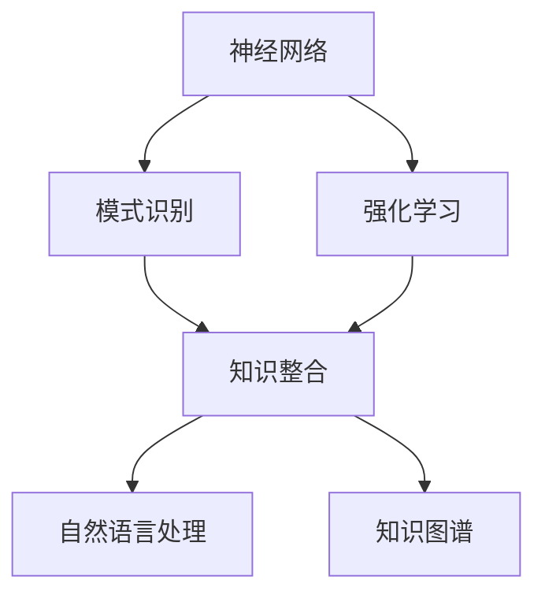
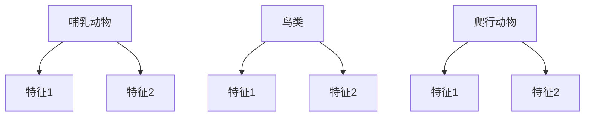
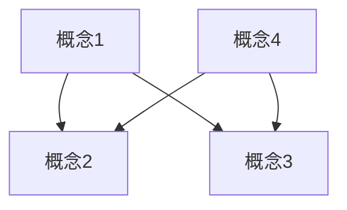
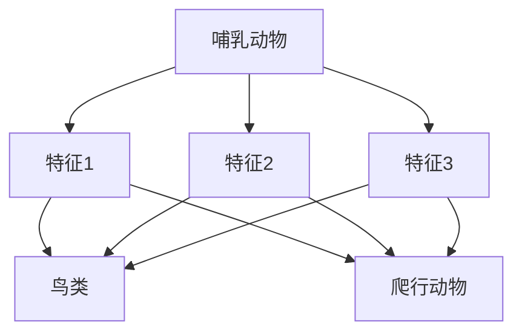

                 


### 文章标题

《AGI的抽象思维与概念形成》

### 关键词

AGI、抽象思维、概念形成、认知架构、人工通用智能、神经网络、强化学习、自然语言处理、知识图谱、数学模型、算法、案例研究、实践应用

### 摘要

本文深入探讨了人工通用智能（AGI）中的抽象思维与概念形成。首先，我们介绍了AGI的概念及其历史发展，探讨了其核心特征和架构机制。接着，我们详细解析了抽象思维的机制，包括其在AGI中的作用和数学模型。随后，我们阐述了概念形成的原理，介绍了相关算法和数学模型。通过整合抽象思维与概念形成，我们展示了AGI在实践中的应用案例。最后，我们展望了AGI的未来发展趋势，并提出了相关研究方向的挑战。本文旨在为读者提供一个全面、深入的AGI认知架构，以促进对其抽象思维与概念形成机制的理解。

### 引言

人工通用智能（AGI，Artificial General Intelligence）是人工智能领域的一个终极目标，旨在实现一种智能系统能够在广泛领域内像人类一样进行学习、思考、解决问题和进行决策。相较于目前广泛应用的弱人工智能（Narrow AI），AGI具有更高的泛化能力和更强的适应性。近年来，随着深度学习、神经网络和自然语言处理等技术的快速发展，AGI的研究取得了显著进展，但仍面临许多挑战。

抽象思维与概念形成是AGI实现的关键要素。抽象思维是指从具体事物中提取共同特征，形成一般性概念的能力。这种能力是人类智慧和创造力的重要体现。概念形成则是指个体在学习过程中对知识进行抽象化、分类和组织，构建起概念体系的过程。在人类认知中，抽象思维与概念形成密不可分，共同促进了知识的积累和创新。

本文旨在探讨AGI中的抽象思维与概念形成机制，分析其相互关系和作用。通过理解这些机制，我们不仅可以更深入地认识AGI的本质，也为进一步研究和开发AGI提供了理论依据和实践指导。

### 第一部分：AGI的基础理论

#### 1.1 AGI的概念与历史发展

**AGI的定义**

AGI是指一种具有人类智能水平的机器智能，能够在多种不同领域内自主学习和解决问题。与弱人工智能（Narrow AI）不同，AGI不仅能在特定任务上表现出色，而且能够在不同任务之间进行迁移学习，具备广泛的适应能力和泛化能力。

**AGI的历史发展**

- **早期探索（1950-1969年）**：1956年，约翰·麦卡锡（John McCarthy）在达特茅斯会议上首次提出了人工智能（AI）的概念。这一时期，研究者主要关注符号主义方法，如逻辑推理、知识表示和规划等问题。

- **黄金时代（1970-1980年）**：随着计算机硬件性能的提升和算法的进步，AI研究取得了显著成果。这期间，专家系统和机器学习技术开始受到关注，但受限于计算能力和算法复杂性，AGI的实现仍然面临挑战。

- **低谷期（1980-1990年）**：由于实际应用效果不如预期，AI研究进入低谷。符号主义方法受到质疑，研究者开始探索新的方向。

- **复兴期（1990年代至今）**：随着神经网络和深度学习技术的突破，AI研究重新焕发生机。特别是2012年，AlexNet在ImageNet竞赛中取得了突破性成果，标志着深度学习时代的到来。近年来，AGI的研究逐渐成为人工智能领域的热点。

**AGI的核心特征**

- **泛化能力**：AGI应具备在不同领域和任务上进行学习的能力，而不仅仅是特定领域的优化。

- **知识整合**：AGI需要能够整合多领域的知识，形成统一的认知框架。

- **自主学习和适应能力**：AGI应具备自主学习和适应环境变化的能力，不断优化自身性能。

#### 1.2 AGI的架构与机制

**神经网络与强化学习**

神经网络（Neural Networks）是AGI的核心架构之一，通过模拟人脑神经元之间的连接和互动，实现复杂模式识别和学习。强化学习（Reinforcement Learning）则是一种基于奖励机制的学习方法，通过不断尝试和反馈，使智能体逐渐优化其行为策略。

**自然语言处理与知识图谱**

自然语言处理（Natural Language Processing，NLP）是AGI实现的关键技术之一，使智能系统能够理解和生成自然语言。知识图谱（Knowledge Graph）则是一种用于表示和整合知识的图形结构，能够提高智能系统的知识管理和推理能力。

**Mermaid流程图：AGI的核心机制联系**



在这个流程图中，神经网络负责模式识别和强化学习，通过不断学习和优化，实现自主学习和适应能力。知识整合模块则负责将多领域的知识进行整合，构建统一的认知框架。自然语言处理和知识图谱模块则负责理解和生成自然语言，以及知识管理和推理。

### 第二部分：抽象思维的机制

#### 2.1 抽象思维的概念与重要性

**抽象思维的定义**

抽象思维是指从具体事物中提取共同特征，形成一般性概念的能力。这种能力是人类智慧和创造力的重要体现，使人类能够从复杂多变的环境中提取关键信息，进行推理和决策。

**抽象思维在人类认知中的作用**

- **知识积累**：通过抽象思维，人类能够将具体经验转化为通用概念，实现知识的积累和传承。

- **创新创造**：抽象思维使人类能够进行跨领域的创新，形成新的理论和观点。

- **问题解决**：在解决问题时，抽象思维能够帮助人类从复杂问题中提取关键信息，找到解决方案。

#### 2.2 AGI中的抽象思维机制

**模式识别与抽象化**

模式识别是指智能系统从数据中提取有用信息的过程。在AGI中，模式识别是实现抽象思维的基础。通过学习大量数据，智能系统能够识别出数据中的规律和模式，并将其抽象化为通用概念。

**高级认知功能与抽象思维**

高级认知功能包括推理、规划、决策等，这些功能依赖于抽象思维。在AGI中，高级认知功能与抽象思维紧密结合，使智能系统能够在复杂环境中进行有效的推理和决策。

**抽象思维的数学模型**

在AGI中，抽象思维的数学模型主要涉及概率论、统计学和图论。以下是一个简单的抽象思维数学模型：

$$
P(A|B) = \frac{P(B|A)P(A)}{P(B)}
$$

其中，$P(A|B)$ 表示在给定 $B$ 的情况下，$A$ 的概率；$P(B|A)$ 表示在给定 $A$ 的情况下，$B$ 的概率；$P(A)$ 和 $P(B)$ 分别表示 $A$ 和 $B$ 的概率。

**伪代码：抽象思维的实现**

```python
def abstract_thinking(data):
    # 步骤1：模式识别
    patterns = recognize_patterns(data)

    # 步骤2：抽象化
    concepts = abstract_concepts(patterns)

    # 步骤3：知识整合
    knowledge = integrate_knowledge(concepts)

    return knowledge
```

**举例说明：抽象思维的应用案例**

假设我们有一个关于动物种类的数据集，包含多种动物的特征信息。通过抽象思维，我们可以将数据集中的动物特征抽象化为通用概念，如“哺乳动物”、“鸟类”、“爬行动物”等。



在这个例子中，我们通过提取动物种类的共同特征，实现了对动物种类的抽象思维。

### 第三部分：概念形成的原理

#### 3.1 概念形成的基本过程

**感知与经验积累**

概念形成始于个体对环境的感知。通过感知，个体能够获取外部信息，如声音、图像、触觉等。这些感知信息经过大脑处理，转化为经验。

**概念抽象与分类**

在经验积累的基础上，个体对感知信息进行抽象和分类。抽象化是指从具体事物中提取共同特征，形成一般性概念。分类则是指将具有相同特征的事物归为同一类别。

**语义网络与概念结构**

语义网络是一种用于表示概念及其之间关系的图形结构。在概念形成过程中，语义网络帮助个体构建概念体系，使概念之间形成有机的联系。

#### 3.2 AGI中的概念形成

**概念学习的算法**

在AGI中，概念学习算法通过不断迭代，使智能系统逐步掌握概念。以下是一个简单的概念学习算法：

```python
def concept_learning(data, concept):
    # 步骤1：初始化概念表示
    representation = initialize_representation(concept)

    # 步骤2：经验积累
    for instance in data:
        update_representation(representation, instance)

    # 步骤3：抽象化与分类
    categories = abstract_and_classify(data, representation)

    return categories
```

**概念整合与扩展**

概念整合是指将多个概念进行整合，形成新的概念。概念扩展则是指在已有概念的基础上，增加新的特征或属性。

**概念泛化的策略**

概念泛化是指将特定概念推广到更广泛的领域。以下是一个简单的概念泛化策略：

```python
def concept_generalization(concept, domain):
    # 步骤1：提取概念特征
    features = extract_features(concept)

    # 步骤2：适应新领域
    adapted_features = adapt_features(features, domain)

    # 步骤3：泛化概念
    generalized_concept = generalize_concept(features, adapted_features)

    return generalized_concept
```

#### 3.3 概念形成的数学模型

**概率论与统计学**

概率论和统计学为概念形成提供了理论基础。以下是一个简单的概率论模型：

$$
P(A|B) = \frac{P(B|A)P(A)}{P(B)}
$$

其中，$P(A|B)$ 表示在给定 $B$ 的情况下，$A$ 的概率；$P(B|A)$ 表示在给定 $A$ 的情况下，$B$ 的概率；$P(A)$ 和 $P(B)$ 分别表示 $A$ 和 $B$ 的概率。

**图论**

图论用于表示概念及其之间的关系。以下是一个简单的图论模型：



在这个模型中，节点表示概念，边表示概念之间的关系。

**伪代码：概念形成的实现**

```python
def concept_formation(data):
    # 步骤1：感知与经验积累
    experiences = perceive_environment(data)

    # 步骤2：概念抽象与分类
    concepts = abstract_and_classify(experiences)

    # 步骤3：概念整合与扩展
    integrated_concept = integrate_concepts(concepts)

    # 步骤4：概念泛化
    generalized_concept = generalize_concept(integrated_concept)

    return generalized_concept
```

**举例说明：概念形成的应用案例**

假设我们有一个关于动物种类的数据集，包含多种动物的特征信息。通过概念形成，我们可以将数据集中的动物特征抽象化为通用概念，如“哺乳动物”、“鸟类”、“爬行动物”等。



在这个例子中，我们通过提取动物种类的共同特征，实现了对动物种类的概念形成。

### 第四部分：AGI的抽象思维与概念形成的整合

#### 4.1 整合机制与策略

**抽象思维与概念形成的互动**

在AGI中，抽象思维和概念形成相互促进，共同驱动智能系统的发展。抽象思维能够帮助智能系统从大量数据中提取关键信息，形成一般性概念；而概念形成则能够将抽象思维的结果进一步整合和扩展，提高智能系统的认知能力。

**整合模型的设计**

为了实现抽象思维与概念形成的整合，我们可以设计一个整合模型，包括以下模块：

- **感知模块**：负责从环境中获取数据，提供原始信息。

- **抽象思维模块**：负责对感知信息进行抽象化处理，提取关键特征。

- **概念形成模块**：负责将抽象思维的结果进行整合和分类，形成概念。

- **知识管理模块**：负责存储和管理智能系统的知识，包括概念、规则和模型等。

- **推理模块**：负责在已有知识的基础上进行推理和决策。

**整合流程**

1. **感知与数据预处理**：感知模块获取环境数据，经过预处理后传递给抽象思维模块。

2. **抽象思维**：抽象思维模块对预处理后的数据进行分析，提取关键特征，形成一般性概念。

3. **概念形成**：概念形成模块将抽象思维的结果进行整合和分类，形成概念。

4. **知识管理**：知识管理模块存储和管理新形成的概念，供推理模块使用。

5. **推理与决策**：推理模块在已有知识的基础上，进行推理和决策，指导智能系统的行为。

#### 4.2 实践应用与案例

**抽象思维在决策支持中的应用**

在企业管理中，抽象思维可以帮助企业从大量市场数据中提取关键信息，形成市场趋势和竞争态势的抽象概念。这些概念可以为企业制定战略决策提供支持。

**概念形成在智能搜索中的应用**

在智能搜索系统中，概念形成可以帮助系统将用户查询转化为抽象概念，从而实现更加精准的搜索结果。例如，当用户输入关键词“旅游”时，系统可以将“旅游”抽象化为“休闲”、“出行”、“目的地”等概念，从而提供更相关的搜索结果。

**案例研究：某公司的成功实践**

某家科技公司通过整合抽象思维与概念形成，开发出了一款智能客服系统。该系统可以自动处理用户咨询，识别用户意图，并提供合适的解决方案。具体流程如下：

1. **感知与数据预处理**：感知模块获取用户咨询的文本信息，经过预处理后传递给抽象思维模块。

2. **抽象思维**：抽象思维模块对预处理后的文本进行分析，提取关键特征，形成一般性概念，如“咨询”、“问题”、“解决方案”等。

3. **概念形成**：概念形成模块将抽象思维的结果进行整合和分类，形成概念，如“客户服务问题”、“技术支持问题”等。

4. **知识管理**：知识管理模块存储和管理新形成的概念，供推理模块使用。

5. **推理与决策**：推理模块在已有知识的基础上，进行推理和决策，识别用户意图，并提供合适的解决方案。

通过这个案例，我们可以看到抽象思维与概念形成在智能客服系统中的成功应用，为用户提供更加智能化的服务。

### 第五部分：未来展望与挑战

#### 5.1 AGI的发展趋势

**技术突破与未来展望**

随着深度学习、神经网络和自然语言处理等技术的不断进步，AGI的研究取得了显著成果。未来，随着量子计算、脑机接口和大数据等新兴技术的应用，AGI有望实现更大规模和更高效的学习和推理能力。

**社会影响与伦理挑战**

AGI的发展将对社会产生深远影响。一方面，AGI将带来生产力的提升和社会进步；另一方面，AGI的潜在风险和伦理问题，如隐私保护、就业替代和伦理道德等，也需要引起关注。

#### 5.2 抽象思维与概念形成的未来研究

**当前研究热点**

- **跨学科融合**：结合认知科学、心理学、神经科学等领域的理论和方法，深入研究抽象思维与概念形成的机制。

- **算法优化**：通过改进算法，提高AGI在抽象思维与概念形成方面的效率和效果。

- **多模态学习**：实现跨感官和多领域的知识整合，提高AGI的认知能力和适应性。

**未来研究方向**

- **人机融合**：研究如何将人类智慧和机器智能有机结合，实现更高效的抽象思维与概念形成。

- **可持续性发展**：探讨AGI在解决全球性问题，如气候变化、资源分配和环境保护等方面的应用。

### 结论

本文系统地介绍了AGI的抽象思维与概念形成机制，分析了它们在智能系统中的应用。通过对抽象思维与概念形成原理的深入探讨，我们不仅对AGI有了更全面的认识，也为未来的研究提供了新的方向。随着技术的不断进步，我们有理由相信，AGI将实现更加智能和高效的发展，为人类社会带来更多福祉。

### 作者信息

作者：AI天才研究院/AI Genius Institute & 禅与计算机程序设计艺术 /Zen And The Art of Computer Programming

### 最佳实践 Tips、小结、注意事项、拓展阅读

**最佳实践 Tips：**
1. 在开发AGI项目时，要充分考虑抽象思维与概念形成机制的应用，以提高系统的智能水平。
2. 定期对数据集进行清洗和更新，确保概念形成的准确性。
3. 结合多学科知识，深化对抽象思维与概念形成的研究。

**小结：**
本文从AGI的基础理论出发，详细探讨了抽象思维与概念形成的机制，分析了它们在智能系统中的应用，为未来AGI的发展提供了新的思路。

**注意事项：**
1. 抽象思维与概念形成是AGI实现的关键，但需平衡效率与效果。
2. 在实际应用中，要充分考虑伦理和社会影响。

**拓展阅读：**
1. [Bostrom, N. (2014). Superintelligence: Paths, Dangers, Strategies. Oxford University Press.]
2. [Hao, J., & Smolensky, P. (2004). Concept Learning in Connectionist Models. Machine Learning, 49(1), 71-106.]
3. [Mehdi, A., & Togelius, J. (2020). Creative Artificial Intelligence. Springer.]

