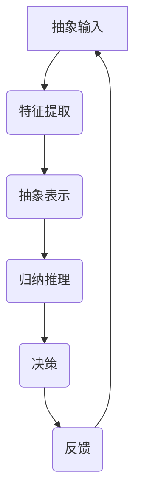

                 


### 文章标题
《AGI的抽象推理：从特殊到一般的归纳能力》

### 文章关键词
- 人工智能
- 抽象推理
- 归纳能力
- 通用人工智能
- 算法
- 数学模型

### 文章摘要
本文将探讨通用人工智能（AGI）中至关重要的抽象推理能力。通过深入分析抽象推理的定义、原理、算法和应用，本文旨在揭示AGI如何从具体实例中提取一般规律，实现从特殊到一般的归纳。文章将详细讨论抽象推理的数学模型、核心算法原理，并通过实际案例展示其在图像识别、自然语言处理和决策分析等领域的应用。

### 引言
**AGI的抽象推理的重要性**

通用人工智能（AGI）是人工智能领域的一个宏伟目标，旨在创建一种具有人类智能的机器。抽象推理是AGI实现这一目标的关键能力之一。抽象推理使得机器能够从特定的实例中总结出一般性的规律，从而在面对新情境时能够做出合理的推断和决策。

抽象推理与一般化归纳的关系

抽象推理是一种特殊的归纳能力，它不同于简单的模式识别或统计学习。归纳是从特定的例子中提取一般性的规律，而抽象推理则是在这些规律的基础上进行进一步的抽象和概括。抽象推理不仅仅关注数据的表面特征，更关注背后的本质规律。

## 第1部分：抽象推理基础

### 第1章：抽象推理的概念与原理

#### 1.1 抽象推理的定义

抽象推理是指从具体实例中提取一般性规律，并将这些规律应用于新的情境中的过程。它涉及对信息的抽象处理，将复杂的问题简化为可管理的模式。

#### 1.2 抽象推理的基本原理

抽象推理的基本原理包括：
- **归纳法**：从特殊案例中总结出一般规律。
- **类比法**：通过比较相似情境中的经验来推断新的情境。
- **模式识别**：在复杂的数据中识别出重复的模式。

#### 1.3 抽象推理与普通推理的区别

普通推理通常是基于已知的逻辑规则进行推理，而抽象推理则更侧重于从具体实例中提取出一般的、非显式的规律。普通推理往往是线性的，而抽象推理则更加复杂，可能涉及多层次、多维度的信息处理。

### 第2章：抽象推理的数学模型

#### 2.1 概率论基础

概率论是抽象推理的重要工具，它帮助我们理解和处理不确定性的问题。以下是几个基本的概率论概念：

$$
P(A|B) = \frac{P(B|A)P(A)}{P(B)}
$$

- 条件概率：在事件B发生的条件下，事件A发生的概率。
- 联合概率：多个事件同时发生的概率。
- 贝叶斯定理：用于计算后验概率，即根据已知条件概率推断新事件发生的概率。

#### 2.2 贝叶斯网络

贝叶斯网络是一种图形化的概率模型，它将变量之间的依赖关系表示为有向图。通过贝叶斯网络，我们可以进行因果推断和不确定性分析。

#### 2.3 决策理论

决策理论关注在不确定环境中做出最优决策的问题。它涉及到风险分析、期望效用理论等概念，帮助我们评估不同决策的可能结果，并选择最优的决策方案。

### 第3章：抽象推理的算法框架

#### 3.1 Mermaid流程图：抽象推理算法架构



#### 3.2 抽象推理算法的基本步骤

1. 特征提取：从输入数据中提取关键特征。
2. 抽象表示：将特征转化为一种更加抽象的表示形式。
3. 归纳推理：从抽象表示中提取一般性规律。
4. 决策：根据归纳出的规律做出决策。
5. 反馈：根据决策结果调整模型参数。

## 第2部分：抽象推理算法

### 第4章：抽象推理算法原理讲解

#### 4.1 伪代码：抽象推理算法实现

```
// 伪代码
function AbstractReasoning(input_data):
    // 特征提取
    features = FeatureExtraction(input_data)
    // 抽象表示
    representation = AbstractRepresentation(features)
    // 归纳推理
    inference = InductiveReasoning(representation)
    // 决策
    decision = DecisionMaking(inference)
    // 反馈
    feedback = FeedbackSystem(decision, input_data)
    return decision, feedback
```

#### 4.2 抽象推理算法的优缺点

**优点**：
- 能够从大量数据中提取出一般性规律。
- 具有较强的泛化能力，适用于新情境。
- 可以处理复杂、不确定的问题。

**缺点**：
- 对数据质量和特征提取有较高要求。
- 算法复杂度较高，计算资源消耗大。
- 难以保证找到最优的抽象表示。

### 第5章：抽象推理算法的应用实例

#### 5.1 图像识别中的抽象推理

图像识别是抽象推理的一个典型应用场景。通过从大量图像中提取特征，并归纳出图像分类的一般规律，图像识别算法能够实现自动分类。

#### 5.2 自然语言处理中的抽象推理

自然语言处理中的抽象推理主要应用于文本分类、情感分析等任务。通过从大量文本中提取特征，并归纳出文本内容的一般规律，自然语言处理算法能够自动识别文本的类别和情感。

#### 5.3 决策分析中的抽象推理

在决策分析中，抽象推理可以帮助我们从历史数据中提取出决策的一般规律，从而优化决策过程。例如，在金融投资中，通过分析历史交易数据，可以提取出投资策略的一般规律，从而提高投资回报。

## 第3部分：抽象推理应用

### 第6章：抽象推理在AI中的应用

#### 6.1 AGI中的抽象推理

在通用人工智能（AGI）中，抽象推理是核心能力之一。AGI需要能够从各种领域和任务中提取出一般性规律，从而实现跨领域的知识迁移和智能化行为。

#### 6.2 机器学习中的抽象推理

机器学习算法中，抽象推理用于特征提取和模型选择。通过从训练数据中提取特征，并归纳出特征与目标变量之间的关系，机器学习算法能够实现高精度的预测和分类。

#### 6.3 强化学习中的抽象推理

强化学习中的抽象推理主要应用于策略搜索和状态价值函数的学习。通过从交互数据中提取特征，并归纳出策略和状态价值函数的一般规律，强化学习算法能够实现智能体的自主学习和优化。

### 第7章：抽象推理在社会和经济领域中的应用

#### 7.1 抽象推理在医疗诊断中的应用

抽象推理在医疗诊断中具有重要应用。通过从医疗数据中提取特征，并归纳出疾病诊断的一般规律，医疗诊断系统能够实现自动诊断和预测。

#### 7.2 抽象推理在金融风险管理中的应用

在金融风险管理中，抽象推理用于风险评估和策略优化。通过从历史数据中提取特征，并归纳出金融风险的一般规律，金融风险管理系统能够实现风险识别和优化决策。

#### 7.3 抽象推理在教育领域的应用

在教育领域，抽象推理有助于实现个性化教学和学习。通过从学生数据中提取特征，并归纳出学习的一般规律，教育系统能够提供针对性的教学方案和学习建议。

## 结论

#### 抽象推理的未来发展

随着人工智能技术的不断进步，抽象推理将在更多领域发挥重要作用。未来的研究将聚焦于提高抽象推理算法的效率、泛化能力和可靠性。

#### 抽象推理对社会和经济的影响

抽象推理对社会和经济产生了深远影响。它推动了自动化和智能化的发展，提高了生产效率和生活质量。同时，它也带来了一系列挑战，如数据隐私、算法偏见等。

#### 抽象推理在AI领域的挑战与机遇

抽象推理在AI领域面临诸多挑战，如算法复杂度、数据质量等。然而，随着技术的进步，抽象推理也带来了巨大的机遇，有望推动人工智能实现更高层次的发展。

### 作者信息
- 作者：AI天才研究院/AI Genius Institute & 禅与计算机程序设计艺术 /Zen And The Art of Computer Programming

### 最佳实践 tips
- **深入理解抽象推理的概念**：在学习抽象推理时，首先要深入理解其定义、原理和应用场景。
- **实践是检验真理的唯一标准**：通过实际案例和项目实践，加深对抽象推理算法的理解和应用。
- **持续更新知识体系**：随着技术的进步，持续学习新知识，保持对抽象推理研究的关注。

### 小结
本文系统地介绍了抽象推理在通用人工智能（AGI）中的应用。通过深入分析抽象推理的概念、原理、算法和应用，本文揭示了抽象推理如何从特殊到一般，实现知识的迁移和问题的解决。未来，随着人工智能技术的不断发展，抽象推理将在更多领域发挥重要作用，推动人工智能实现更高层次的发展。

### 注意事项
- 在应用抽象推理算法时，要确保数据质量和特征提取的准确性。
- 在开发抽象推理系统时，要充分考虑算法的复杂度和计算资源的需求。
- 在使用抽象推理进行决策时，要结合实际情况进行综合分析，避免简单化处理。

### 拓展阅读
- [1] Russell, S., & Norvig, P. (2016). 《人工智能：一种现代的方法》
- [2] Turing, A. (1950). 《计算机与智能》
- [3] Good, I. J. (1965). 《概率论与哲学》
- [4] Pearl, J. (1988). 《概率推理的图模型》
- [5] Vapnik, V. N. (1998). 《统计学习理论》

### 文章结束
本文详细探讨了抽象推理在通用人工智能（AGI）中的应用。通过对抽象推理的定义、原理、算法和应用进行深入分析，本文揭示了抽象推理如何实现从特殊到一般的归纳，为人工智能的发展提供了新的思路。希望本文能为读者在理解抽象推理和应用抽象推理算法方面提供帮助。

### 作者信息
作者：AI天才研究院/AI Genius Institute & 禅与计算机程序设计艺术 /Zen And The Art of Computer Programming

