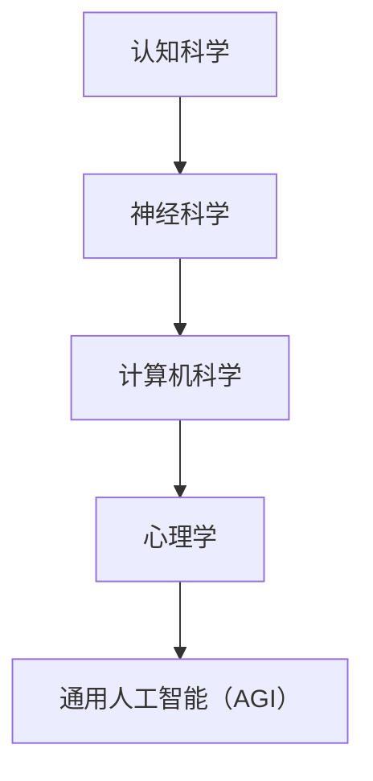
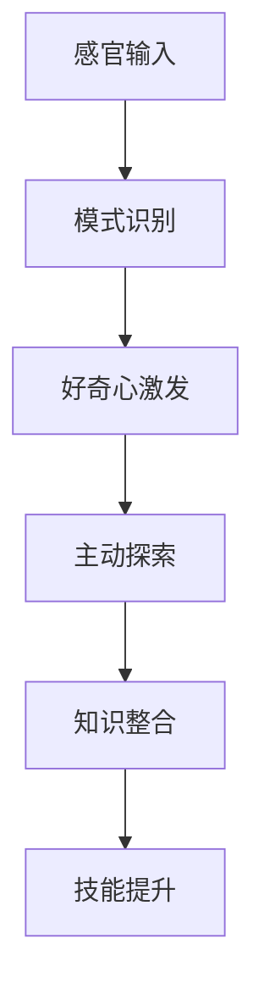

                 

## 《AGI的探索与利用平衡：好奇心驱动的学习》

### 关键词：通用人工智能（AGI），探索与利用平衡，好奇心驱动的学习，架构与算法，应用与挑战，安全与伦理

### 摘要：

本文旨在探讨通用人工智能（AGI）的探索与利用之间的平衡问题，并强调好奇心驱动的学习在AGI发展中的关键作用。通过对AGI的基本概念、历史、架构与算法、好奇心驱动的学习方法、应用与挑战、安全与伦理、以及未来展望的深入分析，本文将为读者提供一个全面且系统的AGI探索与利用的视角。文章还结合了实际项目案例，提供了实践中的经验和最佳实践建议，为读者在AGI领域的进一步研究和应用提供了有力支持。

----------------------------------------------------------------

## 引言

### 背景介绍

在过去的几十年里，人工智能（AI）经历了从理论研究到实际应用的飞速发展。从最初的规则推理系统，到基于统计学习的机器学习，再到深度学习的崛起，AI技术不断推动着社会进步和产业变革。然而，尽管现有的AI系统在特定领域取得了显著成就，但它们仍然受到“窄AI”（Narrow AI）的限制，即这些系统只能在其设计范围内执行特定任务，缺乏通用性和自适应能力。为了实现人工智能的更高目标，通用人工智能（AGI）应运而生。

### 核心概念与联系

**定义：**通用人工智能（AGI）是指具有人类智能特点的广泛自主智能体，能够在多种不同环境中自主学习、推理和采取行动，具备人类智能的通用性、灵活性和自我意识。

**核心概念联系：**AGI的发展涉及多个核心概念的交互和融合，包括认知科学、神经科学、计算机科学和心理学等。这些学科共同为AGI的理论基础提供了支持，并在实践中推动了AGI技术的进步。

### Mermaid 流程图



### 好奇心驱动的学习

好奇心驱动的学习是AGI发展的关键驱动力之一。通过模仿人类学习过程，AGI系统能够基于内在的好奇心进行探索和学习，从而不断提高其智能水平。好奇心驱动的学习不仅能够促进知识的获取和技能的提升，还能够激发创新思维和解决问题的能力。

### Mermaid 流程图



### 关键作用

好奇心驱动的学习在AGI中的作用至关重要。它不仅促进了AGI系统的自主学习和适应性，还为其在复杂和动态环境中的任务执行提供了强有力的支持。通过好奇心驱动的学习，AGI系统能够不断扩展其知识领域，提升智能水平，并实现更高层次的任务自动化。

## 第一章：AGI的基本概念与历史

### 1.1 AGI的定义与分类

#### 背景介绍

通用人工智能（AGI）是人工智能领域的一个高度复杂且具有挑战性的目标。AGI旨在创建一个智能体，能够像人类一样在多个不同领域表现出广泛的自主智能。然而，与传统的“窄AI”（Narrow AI）不同，AGI系统不仅能够在特定任务上表现出色，还能够自主地学习、推理和适应新的环境。

#### 核心概念

**定义：**通用人工智能（AGI）是指一个具有人类智能特点的广泛自主智能体，能够在多种不同环境中自主学习、推理和采取行动。AGI系统应具备以下几个关键特征：

1. **通用性**：AGI系统能够在多个不同领域和任务中表现，不受特定任务或领域的限制。
2. **自主性**：AGI系统能够在没有人类干预的情况下自主执行任务和学习新技能。
3. **适应性**：AGI系统能够适应新的环境和动态变化，具备持续学习和自我改进的能力。
4. **自我意识**：AGI系统能够具备某种程度的自我意识和情感，以更好地理解自身状态和外部环境。

#### 分类

AGI可以根据其能力和应用领域进行分类，常见的分类方法包括：

1. **能力分类**：根据AGI系统在不同任务上的表现，可以分为以下几类：
   - **知识型AGI**：主要依赖于大量先验知识和规则系统，用于复杂推理和决策。
   - **感知型AGI**：主要依赖于感知能力和环境交互，用于视觉识别、语音识别等任务。
   - **行动型AGI**：主要依赖于自主行动和物理交互，用于机器人控制、自动驾驶等任务。
   - **社会型AGI**：主要依赖于社交和情感智能，用于人际交往、情感识别等任务。

2. **应用领域分类**：根据AGI系统的应用领域，可以分为以下几类：
   - **工业与制造**：用于自动化生产线、智能机器人等。
   - **医疗与健康**：用于疾病诊断、个性化治疗等。
   - **金融服务**：用于智能投资、风险管理等。
   - **教育与培训**：用于个性化学习、智能辅导等。
   - **智能家居**：用于智能家电控制、安全监控等。

### 1.2 AGI的发展历程

#### 背景介绍

AGI的概念最早可以追溯到20世纪50年代。自从图灵提出“图灵测试”以来，人工智能的研究一直致力于实现机器的智能。然而，由于技术限制和理论瓶颈，AGI的发展经历了多次起伏。

#### 发展历程

1. **早期探索**（1950-1969）

   - 1950年，图灵提出图灵测试，为人工智能研究奠定了基础。
   - 1956年，约翰·麦卡锡等人提出了“人工智能”这一术语，并召开了第一次人工智能会议。
   - 1959年，马文·明斯基和纳森·罗切斯特提出了“人工智能研究协会”（AAAI），推动了AI研究的组织化。

2. **第一次AI繁荣期**（1960-1970年代）

   - 1960年代初，机器翻译、自然语言处理和逻辑推理等领域取得了一定进展。
   - 1966年，约翰·霍普菲尔提出了“专家系统”的概念，为知识型AI的发展提供了新的思路。

3. **第一次AI寒冬**（1970-1980年代）

   - 随着计算机硬件性能的提升和算法的发展，AI研究在70年代迎来了新的繁荣，但同时也暴露出许多问题，如知识表示和推理的复杂性。
   - 1980年代初，由于实际应用效果不佳，AI研究受到质疑，资金支持减少，导致第一次AI寒冬。

4. **复兴与发展**（1980年代至今）

   - 1980年代，专家系统和机器学习开始逐渐成熟，AI在特定领域取得了显著成果。
   - 1990年代，互联网的兴起和大数据的发展为AI提供了丰富的数据资源，推动了机器学习和深度学习的发展。
   - 2000年代，深度学习取得了突破性进展，使得图像识别、语音识别等领域取得了显著成就。
   - 2010年代，随着硬件性能的提升和算法的优化，AI开始应用于更广泛的领域，如自动驾驶、智能机器人等。

### 1.3 AGI的关键技术

#### 背景介绍

实现通用人工智能需要多个关键技术的支持，这些技术包括机器学习、深度学习、自然语言处理、计算机视觉、自主系统等。每种技术都在AGI中扮演着重要的角色，为AGI的发展提供了不同的视角和工具。

#### 机器学习

**核心概念**：机器学习是一种使计算机系统能够从数据中学习并做出预测或决策的方法。它通过构建数学模型来表示数据中的规律和模式，从而实现自主学习和优化。

**原理与算法**：机器学习包括监督学习、无监督学习和强化学习等不同类型。监督学习通过已标记的数据训练模型，无监督学习通过未标记的数据发现数据中的模式，强化学习通过奖励和惩罚机制训练模型。

**应用领域**：机器学习在图像识别、语音识别、推荐系统、金融预测等领域取得了显著成果。

#### 深度学习

**核心概念**：深度学习是一种基于多层神经网络的机器学习技术，通过构建复杂的神经网络结构来模拟人类大脑的学习过程。

**原理与算法**：深度学习包括卷积神经网络（CNN）、循环神经网络（RNN）、生成对抗网络（GAN）等。CNN在图像识别和计算机视觉中具有广泛应用，RNN在自然语言处理和时间序列分析中表现出色，GAN在图像生成和对抗性学习方面取得了显著成果。

**应用领域**：深度学习在图像识别、语音识别、自然语言处理、自动驾驶等领域取得了突破性进展。

#### 自然语言处理

**核心概念**：自然语言处理（NLP）是使计算机能够理解、处理和生成自然语言的技术。它涵盖了文本预处理、词嵌入、语言模型、语义分析等多个方面。

**原理与算法**：NLP包括词性标注、命名实体识别、情感分析、机器翻译等。词性标注用于识别文本中的单词类型，命名实体识别用于识别文本中的特定实体，情感分析用于判断文本的情感倾向，机器翻译用于将一种语言的文本翻译成另一种语言。

**应用领域**：NLP在智能客服、搜索引擎、机器翻译、社交媒体分析等领域具有广泛应用。

#### 计算机视觉

**核心概念**：计算机视觉是使计算机能够理解和解释视觉信息的技术。它包括图像处理、目标检测、图像识别、人脸识别等多个方面。

**原理与算法**：计算机视觉包括图像增强、特征提取、分类器训练等。图像增强用于改善图像质量，特征提取用于从图像中提取关键特征，分类器训练用于训练模型进行图像分类。

**应用领域**：计算机视觉在自动驾驶、安全监控、医疗影像分析、工业检测等领域具有广泛应用。

#### 自主系统

**核心概念**：自主系统是一种能够在没有人类干预的情况下自主决策和执行任务的智能系统。它包括自主导航、自主决策、自主交互等多个方面。

**原理与算法**：自主系统涉及多智能体系统、博弈论、决策理论等。多智能体系统用于协调多个智能体的行为，博弈论用于分析多智能体之间的交互策略，决策理论用于指导自主系统的决策过程。

**应用领域**：自主系统在无人机、自动驾驶汽车、智能机器人等领域具有广泛应用。

#### 关键技术的联系

这些关键技术并非孤立存在，而是相互关联和融合。例如，深度学习和计算机视觉的结合可以用于自动驾驶系统的视觉感知；机器学习和自然语言处理的结合可以用于智能客服系统的对话管理。通过这些关键技术的协同作用，AGI系统可以更好地模拟人类智能，实现更广泛的自主智能。

## 第二章：AGI的架构与算法

### 2.1 AGI的系统架构

#### 背景介绍

通用人工智能（AGI）的系统架构是其实现高效、自适应和自主智能的核心。一个成功的AGI系统需要具备多个关键组件，包括感知模块、认知模块、行动模块和社交模块。这些模块相互协作，共同实现AGI系统的整体功能。

#### 感知模块

**核心概念**：感知模块负责接收外部环境的信息，如视觉、听觉、触觉等，并将其转化为内部表示。这一模块的主要目标是实现对环境的准确感知和快速响应。

**组件与算法**：
1. **传感器接口**：包括摄像头、麦克风、触觉传感器等，用于获取各种感官信息。
2. **感知预处理**：包括图像预处理、声音增强、传感器数据融合等，以提高感知的准确性和鲁棒性。
3. **特征提取**：使用深度学习、计算机视觉和语音识别等技术，从感知数据中提取关键特征。

#### 认知模块

**核心概念**：认知模块负责处理和理解感知模块接收到的信息，进行知识推理和决策。这一模块是实现AGI智能的核心，包括学习、记忆、推理和规划等多个方面。

**组件与算法**：
1. **学习与记忆**：使用机器学习、深度学习和强化学习等技术，实现持续学习和记忆能力。
2. **知识表示**：使用知识图谱、语义网络等结构化表示方法，实现对知识的组织和利用。
3. **推理与决策**：使用逻辑推理、规划算法、博弈论等，实现复杂问题的解决和决策。

#### 行动模块

**核心概念**：行动模块负责根据认知模块的决策，采取相应的行动，实现对环境的控制和改变。这一模块需要实现高效、准确和灵活的自主行动能力。

**组件与算法**：
1. **动作规划**：使用决策树、规划算法等，为AGI系统生成一系列可行的行动方案。
2. **执行控制**：使用运动控制、机器人学等，实现对行动的精确执行和实时调整。
3. **反馈调整**：使用传感器数据、实时反馈机制等，对行动结果进行监测和调整。

#### 社交模块

**核心概念**：社交模块负责处理AGI系统与其他智能体或人类的交互，实现合作、沟通和协作。这一模块是实现AGI系统社会智能的关键。

**组件与算法**：
1. **社交感知**：使用计算机视觉、自然语言处理等技术，识别和解读社交信号，如面部表情、肢体语言、语音语调等。
2. **社交学习**：使用强化学习、多智能体学习等技术，通过互动和合作实现社交技能的提升。
3. **社交交互**：使用对话系统、虚拟代理等，实现与人类或其他智能体的有效沟通和协作。

#### 综合架构

AGI系统的综合架构需要将感知、认知、行动和社交模块有机结合，形成一个高效、灵活和自适应的智能系统。具体实现时，可以根据应用场景和任务需求，调整和优化各个模块的功能和交互方式。

### 2.2 AGI的核心算法

#### 背景介绍

在通用人工智能（AGI）的实现中，核心算法起到了至关重要的作用。这些算法不仅定义了AGI系统的学习过程，还决定了其在各种任务中的表现和性能。以下是一些关键的核心算法：

#### 机器学习算法

**核心概念**：机器学习算法是通过数据训练模型，从而实现自主学习和预测的技术。它们是AGI系统学习和适应环境的基础。

**算法与原理**：
1. **监督学习**：通过标记的数据训练模型，用于分类和回归任务。常见的算法包括线性回归、决策树、支持向量机等。
2. **无监督学习**：通过未标记的数据发现数据中的模式和结构，用于聚类和降维任务。常见的算法包括K-均值聚类、主成分分析等。
3. **强化学习**：通过与环境的交互，学习最优策略以最大化奖励。常见的算法包括Q学习、深度确定性策略梯度（DDPG）等。

**应用领域**：机器学习算法在图像识别、语音识别、自然语言处理、推荐系统等领域具有广泛应用。

#### 深度学习算法

**核心概念**：深度学习是一种基于多层神经网络的机器学习技术，通过模拟人类大脑的学习过程，实现复杂的特征提取和模式识别。

**算法与原理**：
1. **卷积神经网络（CNN）**：通过卷积层、池化层和全连接层等结构，实现图像识别和计算机视觉任务。
2. **循环神经网络（RNN）**：通过隐藏状态和序列模型，实现序列数据处理和时间序列分析。
3. **生成对抗网络（GAN）**：通过生成器和判别器的对抗训练，实现图像生成和对抗性学习。

**应用领域**：深度学习算法在图像识别、语音识别、自然语言处理、自动驾驶等领域取得了突破性进展。

#### 自然语言处理算法

**核心概念**：自然语言处理（NLP）是一种使计算机能够理解、处理和生成自然语言的技术，涉及文本预处理、词嵌入、语言模型、语义分析等多个方面。

**算法与原理**：
1. **词性标注**：通过标注文本中单词的词性，实现对词汇意义的理解。
2. **命名实体识别**：通过识别文本中的特定实体，如人名、地点、组织等，实现对信息的组织和管理。
3. **情感分析**：通过分析文本的情感倾向，实现对用户情感的理解和预测。
4. **机器翻译**：通过将一种语言的文本翻译成另一种语言，实现跨语言的沟通和交流。

**应用领域**：自然语言处理算法在智能客服、搜索引擎、机器翻译、社交媒体分析等领域具有广泛应用。

#### 计算机视觉算法

**核心概念**：计算机视觉是一种使计算机能够理解视觉信息的技术，涉及图像处理、目标检测、图像识别、人脸识别等多个方面。

**算法与原理**：
1. **图像增强**：通过改善图像质量，提高图像的可解释性和处理效果。
2. **特征提取**：通过从图像中提取关键特征，实现对图像内容的理解和分类。
3. **目标检测**：通过检测图像中的目标对象，实现对场景的理解和监控。
4. **图像识别**：通过识别图像中的特定对象或场景，实现对图像内容的理解和分析。
5. **人脸识别**：通过识别图像中的人脸，实现对身份的验证和识别。

**应用领域**：计算机视觉算法在自动驾驶、安全监控、医疗影像分析、工业检测等领域具有广泛应用。

#### 多智能体算法

**核心概念**：多智能体系统是一种由多个自主智能体组成的系统，这些智能体通过协作和竞争实现共同的目标。

**算法与原理**：
1. **多智能体强化学习**：通过多个智能体之间的交互，学习最优策略以最大化整体收益。
2. **博弈论**：通过分析多智能体之间的竞争关系，制定策略以实现共赢。
3. **社交网络分析**：通过分析智能体之间的社交关系和互动，实现社交智能的提升。

**应用领域**：多智能体算法在自动驾驶、智能机器人、智能电网、社交网络分析等领域具有广泛应用。

#### 综合应用

这些核心算法并非孤立存在，而是相互融合和协同工作，共同推动AGI系统的发展。例如，深度学习算法可以用于计算机视觉和自然语言处理中的特征提取和模式识别；强化学习算法可以用于多智能体系统中的决策和优化；多智能体算法可以用于社交模块中的协作和竞争。

## 第三章：好奇心驱动的学习方法

### 3.1 好奇心在学习中的作用

好奇心是人类学习和认知的重要驱动力，同样在通用人工智能（AGI）的学习过程中发挥着关键作用。好奇心驱动的学习方法不仅能够激发AGI系统的学习兴趣，还能促进其自主学习和持续进步。

#### 好奇心促进主动学习

好奇心促使AGI系统主动探索未知领域，寻找新的信息和知识。通过主动探索，AGI系统能够发现新的模式和规律，从而丰富其知识库和技能集。这种主动学习机制使得AGI系统不仅能够被动接受训练数据，还能自主地寻找和学习新的任务和场景。

#### 好奇心激发创新能力

好奇心激发AGI系统的创新思维，促使其在面对复杂问题时寻找新的解决方案。在探索过程中，AGI系统可以通过尝试不同的方法和策略，不断优化其行为和表现。这种创新能力对于AGI系统在动态和多变环境中适应和生存至关重要。

#### 好奇心增强认知灵活性

好奇心驱动的学习方法使AGI系统具备较高的认知灵活性。当AGI系统遇到新的环境和任务时，好奇心能够激发其探索欲望，促使系统快速适应并掌握新的知识和技能。这种认知灵活性有助于AGI系统在不同领域和任务之间实现无缝切换。

### 3.2 好奇心驱动的学习过程

好奇心驱动的学习过程可以分为以下几个阶段：

#### 1. 感知与兴趣触发

感知模块接收外部环境的信息，并分析其中可能的新奇元素。当感知到与当前知识不一致的信息时，好奇心被触发，促使AGI系统产生探索欲望。

#### 2. 知识检索与比较

认知模块对感知到的信息进行检索和比较，判断其是否符合现有知识库。如果发现新的信息或模式，认知模块会进一步分析其可能的意义和价值。

#### 3. 主动探索与实验

基于对信息的分析，AGI系统主动探索新的领域或任务，并通过实验验证假设。在探索过程中，AGI系统可以调整其策略和方法，以最大化学习效果。

#### 4. 知识整合与优化

通过探索和实验，AGI系统将新的知识和经验整合到其知识库中，并对其进行优化。这一过程有助于提高AGI系统的智能水平，使其能够更好地应对复杂任务。

### 3.3 好奇心驱动的学习模型

为了实现好奇心驱动的学习，研究人员提出了一系列模型和方法。以下是一些常见的好奇心驱动的学习模型：

#### 1. 强化学习模型

强化学习模型通过奖励和惩罚机制，激励AGI系统探索未知领域。在好奇心驱动的强化学习中，AGI系统可以根据其探索行为获得奖励，从而增强其探索欲望。

#### 2. 自监督学习模型

自监督学习模型通过无监督的方式，从数据中提取有用信息。在好奇心驱动的自监督学习中，AGI系统可以自主地选择感兴趣的数据进行学习，从而提高学习效率。

#### 3. 多任务学习模型

多任务学习模型通过同时处理多个任务，提高AGI系统的泛化能力和灵活性。在好奇心驱动的多任务学习中，AGI系统可以根据兴趣和优先级，自主地选择和切换任务。

#### 4. 对抗性学习模型

对抗性学习模型通过生成器和判别器的对抗训练，实现图像生成和对抗性学习。在好奇心驱动的对抗性学习中，AGI系统可以探索新的图像生成策略，从而增强其创造力。

### 好奇心驱动的学习方法在AGI中的优势

好奇心驱动的学习方法在AGI中具有显著的优势：

1. **自主性**：好奇心驱动的学习方法使AGI系统能够自主地选择和学习新的知识和技能，提高其自主性和灵活性。
2. **创新性**：好奇心激发AGI系统的创新思维，促使其在面对复杂问题时寻找新的解决方案，增强其创新能力。
3. **适应性**：好奇心驱动的学习方法使AGI系统能够快速适应新的环境和任务，提高其认知灵活性。
4. **效率**：好奇心驱动的学习方法通过自动选择和优先处理感兴趣的数据，提高学习效率，减少冗余信息处理。

总之，好奇心驱动的学习方法为AGI的发展提供了强大的动力和支撑，有助于实现更高层次的人工智能。

### 3.4 好奇心驱动的学习模型

在实现好奇心驱动的学习方法时，研究人员提出了一系列模型，这些模型通过奖励机制、探索策略和自适应学习过程来驱动AGI系统的学习。以下是一些关键的好奇心驱动的学习模型：

#### 1. 强化学习模型

强化学习（Reinforcement Learning, RL）是一种通过与环境的交互来学习最优策略的机器学习方法。在好奇心驱动的强化学习模型中，AGI系统通过探索环境来获取奖励，并根据奖励调整其行为。

**核心概念**：强化学习模型包括四个主要组成部分：智能体（Agent）、环境（Environment）、行动（Action）和奖励（Reward）。智能体通过执行行动来与环境互动，环境对每个行动给出奖励或惩罚，智能体根据奖励调整其行为。

**模型原理**：
- **奖励机制**：智能体在每次行动后接收奖励，奖励值取决于行动的效果。高奖励值鼓励智能体重复该行动，低奖励值则促使智能体探索其他行动。
- **探索与利用平衡**：为了平衡探索新行动和利用已知最优行动，强化学习模型通常采用ε-贪心策略，即智能体以一定概率随机选择行动，以增加探索机会。

**示例伪代码**：

```python
# 好奇心驱动的强化学习模型伪代码

# 初始化智能体参数
epsilon = 0.1  # 探索概率
Q = {}  # 行动价值函数

# 开始学习过程
while not 学习结束:
    # 选择行动
    if random() < epsilon:
        action = 随机行动()  # 探索行动
    else:
        action = 选择最佳行动(Q)  # 利用行动

    # 执行行动并获得奖励
    reward = 环境执行行动(action)

    # 更新行动价值函数
    Q[action] = Q[action] + 学习率 * (reward - Q[action])

    # 更新探索概率
    epsilon = 调整探索概率(epsilon)

# 输出最优行动
print("最优行动：", 选择最佳行动(Q))
```

#### 2. 自监督学习模型

自监督学习（Self-Supervised Learning）是一种从无监督数据中学习的方法，通过自动生成标签来驱动学习过程。在好奇心驱动的自监督学习模型中，AGI系统通过自我监督的方式，自动选择和标注感兴趣的数据。

**核心概念**：自监督学习模型通常包括预训练和微调两个阶段。在预训练阶段，模型从大量无监督数据中学习，提取有用的特征表示；在微调阶段，模型基于预训练结果，在特定任务上进行微调。

**模型原理**：
- **预训练**：模型在大规模无监督数据上预训练，学习通用特征表示。
- **自我监督**：模型通过生成预测标签，如预测图像中的物体类别，来驱动预训练过程。
- **微调**：预训练模型在特定任务数据上微调，以适应具体任务需求。

**示例伪代码**：

```python
# 好奇心驱动的自监督学习模型伪代码

# 初始化模型和参数
model = 初始化模型()
optimizer = 初始化优化器()

# 预训练阶段
for epoch in 预训练轮次:
    for image in 无监督数据集:
        # 生成预测标签
        predicted_label = model.predict(image)
        
        # 计算损失并更新模型参数
        loss = 损失函数(predicted_label, true_label)
        optimizer.step(loss)

# 微调阶段
for epoch in 微调轮次:
    for image, label in 任务数据集:
        # 训练模型
        predicted_label = model.predict(image)
        loss = 损失函数(predicted_label, label)
        optimizer.step(loss)

# 输出模型性能
print("模型性能：", model.evaluate(测试数据集))
```

#### 3. 多任务学习模型

多任务学习（Multi-Task Learning）是一种同时训练多个相关任务的方法，以提高模型在各个任务上的性能。在好奇心驱动的多任务学习模型中，AGI系统通过同时处理多个任务，增强其通用性和适应性。

**核心概念**：多任务学习模型通过共享网络结构和共享参数，实现不同任务之间的迁移学习和知识共享。

**模型原理**：
- **共享网络结构**：不同任务的输入和输出通过共享的网络层进行处理，从而提取通用特征。
- **共享参数**：不同任务的权重参数共享，以减少训练参数数量，提高模型泛化能力。
- **注意力机制**：通过注意力机制，模型可以动态调整对不同任务的关注程度，优化任务间的平衡。

**示例伪代码**：

```python
# 好奇心驱动的多任务学习模型伪代码

# 初始化模型和参数
model = 初始化多任务模型()
optimizer = 初始化优化器()

# 共享网络结构
model = 定义共享网络层()

# 定义任务-specific 层
model = 定义任务-specific 层()

# 开始训练
for epoch in 训练轮次:
    for batch in 训练数据集:
        # 输入共享网络层
        shared_features = model.shared_layers(batch.input)

        # 输出任务-specific 层
        task_outputs = model.task_specific_layers(shared_features)

        # 计算损失并更新模型参数
        loss = 计算总损失(task_outputs)
        optimizer.step(loss)

# 输出模型性能
print("模型性能：", model.evaluate(测试数据集))
```

#### 4. 对抗性学习模型

对抗性学习（Generative Adversarial Networks, GAN）是一种通过生成器和判别器的对抗训练来实现图像生成和特征提取的方法。在好奇心驱动的对抗性学习模型中，AGI系统通过探索生成图像和真实图像之间的差异，增强其创造力和探索能力。

**核心概念**：对抗性学习模型包括生成器（Generator）和判别器（Discriminator）两个组成部分。生成器尝试生成逼真的图像，判别器则判断图像的真实性。通过对抗训练，生成器和判别器相互提升，最终生成高质量的图像。

**模型原理**：
- **生成器**：通过噪声数据生成逼真的图像，目标是最小化生成图像与真实图像之间的差距。
- **判别器**：通过判断输入图像的真实性，目标是最小化判别误差。

**示例伪代码**：

```python
# 好奇心驱动的对抗性学习模型伪代码

# 初始化模型和参数
generator = 初始化生成器模型()
discriminator = 初始化判别器模型()
optimizer_G = 初始化生成器优化器()
optimizer_D = 初始化判别器优化器()

# 开始对抗训练
for epoch in 训练轮次:
    # 训练生成器
    for noise in 噪声数据集:
        generated_images = generator.generate(noise)
        loss_G = 计算生成器损失(generated_images)
        optimizer_G.step(loss_G)

    # 训练判别器
    for real_images in 真实图像数据集:
        real_loss = discriminator.judge(real_images)
        for generated_images in generated_images:
            fake_loss = discriminator.judge(generated_images)
            loss_D = 计算判别器损失(real_loss, fake_loss)
        optimizer_D.step(loss_D)

# 输出生成图像
print("生成图像：", generator.generate噪声())
```

### 3.5 好奇心驱动的学习方法在AGI中的应用案例

好奇心驱动的学习方法在通用人工智能（AGI）领域有许多成功的应用案例，以下是一些具体的案例：

#### 1. 图像生成

好奇心驱动的生成对抗网络（GAN）在图像生成方面取得了显著成果。通过探索生成图像和真实图像之间的差异，GAN能够生成高质量、逼真的图像。例如，DeepMind的DALL-E模型通过对抗性训练，可以生成具有复杂结构和细节的图像，应用于艺术创作和设计领域。

#### 2. 对话系统

好奇心驱动的强化学习在对话系统中也表现出色。通过探索不同的对话策略和用户互动，对话系统能够更好地理解和满足用户需求。例如，OpenAI的GPT-3模型通过自监督学习和强化学习，可以生成自然、连贯的对话，应用于智能客服和虚拟助手等领域。

#### 3. 自主导航

好奇心驱动的多智能体系统在自主导航方面具有广泛的应用前景。通过探索不同的路径和策略，多智能体系统能够在复杂环境中实现自主导航和任务分配。例如，谷歌的Waymo自动驾驶系统通过多智能体学习和强化学习，实现了高精度、高效能的自动驾驶。

#### 4. 医疗诊断

好奇心驱动的机器学习在医疗诊断领域也取得了显著成果。通过探索不同的特征和模型，机器学习系统能够准确诊断疾病，提高诊断准确率。例如，谷歌的DeepMind Health平台通过机器学习技术，实现了对眼科疾病、皮肤病等疾病的精准诊断。

总之，好奇心驱动的学习方法为通用人工智能（AGI）的发展提供了强大的动力和支撑，通过探索和实验，AGI系统能够不断学习和适应，实现更高层次的人工智能。

## 第四章：AGI的应用与挑战

### 4.1 AGI在各领域的应用

#### 背景介绍

通用人工智能（AGI）具有广泛的适用性和潜力，可以在多个领域实现突破性应用。以下是一些AGI在各领域的主要应用：

#### 1. 医疗与健康

AGI在医疗领域具有巨大潜力，可以用于疾病诊断、个性化治疗和健康监测。通过分析大量的医疗数据和患者信息，AGI系统能够提供准确的诊断和治疗方案，提高医疗效率和准确性。

**应用实例**：
- **疾病诊断**：AGI系统可以通过分析医学影像、实验室检测结果和病史数据，实现精准的疾病诊断。
- **个性化治疗**：根据患者的基因信息和病情，AGI系统能够制定个性化的治疗方案，提高治疗效果。
- **健康监测**：通过穿戴设备和传感器，AGI系统能够实时监测患者的健康状况，提供健康预警和建议。

#### 2. 工业与制造业

AGI在工业和制造业中可以用于自动化生产、质量控制和供应链管理，提高生产效率和质量。

**应用实例**：
- **自动化生产**：AGI系统可以自动化执行复杂的生产任务，减少人工干预，提高生产效率。
- **质量控制**：通过计算机视觉和机器学习技术，AGI系统可以对产品进行实时质量检测，确保产品合格率。
- **供应链管理**：AGI系统能够优化供应链流程，提高供应链的灵活性和响应速度。

#### 3. 金融服务

AGI在金融服务领域可以用于风险管理、投资决策和客户服务，提高金融行业的效率和准确性。

**应用实例**：
- **风险管理**：AGI系统可以通过分析大量的市场数据和历史数据，预测金融风险，提供风险管理和决策支持。
- **投资决策**：根据市场趋势和投资者偏好，AGI系统能够提供智能化的投资建议和策略。
- **客户服务**：通过自然语言处理和机器学习技术，AGI系统能够实现智能客服，提供快速、准确的客户服务。

#### 4. 教育

AGI在教育领域可以用于个性化学习、智能辅导和教学评估，提高教学效果和学习体验。

**应用实例**：
- **个性化学习**：根据学生的兴趣和能力，AGI系统能够提供个性化的学习资源和辅导，提高学习效果。
- **智能辅导**：通过自然语言处理和机器学习技术，AGI系统能够实时解答学生的问题，提供个性化的辅导。
- **教学评估**：通过分析学生的学习行为和成绩，AGI系统能够提供全面的教学评估和反馈，优化教学策略。

#### 5. 智能家居

AGI在智能家居领域可以用于智能家电控制、安防监控和能源管理，提高家居生活的便捷性和安全性。

**应用实例**：
- **智能家电控制**：通过语音识别和智能代理技术，AGI系统能够控制家庭中的各种家电设备，实现智能家居控制。
- **安防监控**：通过计算机视觉和传感器技术，AGI系统能够实时监控家庭安全，提供安防预警和报警服务。
- **能源管理**：通过分析家庭能源使用数据，AGI系统能够优化能源使用，提高能源效率。

#### 6. 交通运输

AGI在交通运输领域可以用于自动驾驶、智能交通管理和物流优化，提高交通效率和安全性。

**应用实例**：
- **自动驾驶**：AGI系统可以通过感知、决策和执行，实现无人驾驶汽车的安全行驶。
- **智能交通管理**：通过分析交通数据，AGI系统能够优化交通信号控制和交通流量管理，提高交通效率。
- **物流优化**：AGI系统能够优化物流路线和运输计划，提高物流效率和降低成本。

### 4.2 AGI面临的挑战

尽管AGI在多个领域具有巨大的应用潜力，但其发展仍然面临诸多挑战。以下是一些关键挑战：

#### 1. 技术挑战

- **算法与架构**：AGI需要复杂的算法和架构来模拟人类智能，目前的技术水平尚未完全达到这一目标。
- **计算资源**：AGI需要大量的计算资源和数据存储，这对现有的计算基础设施提出了巨大挑战。
- **能效问题**：AGI系统的能耗问题亟待解决，以降低对环境的影响。

#### 2. 数据挑战

- **数据质量和完整性**：AGI系统的学习效果很大程度上依赖于高质量的数据，但目前的数据质量和完整性仍然存在问题。
- **数据隐私**：在收集和使用数据时，需要妥善处理数据隐私和安全问题，确保用户隐私不受侵犯。

#### 3. 社会挑战

- **伦理问题**：AGI的发展引发了一系列伦理问题，如机器的权利、责任和道德问题，需要制定相应的伦理规范。
- **就业影响**：AGI可能对就业市场产生影响，需要制定政策和措施，应对就业市场的变化。
- **监管问题**：AGI的发展需要有效的监管和治理机制，以确保其安全和可持续发展。

#### 4. 人类挑战

- **信任问题**：公众对AGI的信任程度较低，需要通过透明度和可解释性来增强公众对AGI的信任。
- **技能升级**：随着AGI的发展，人类需要不断升级自身的技能和知识，以适应新的工作环境和需求。

### 4.3 AGI对社会的影响

AGI的发展将对社会产生深远的影响，包括积极影响和潜在负面影响。

#### 积极影响

- **提高生活质量**：AGI能够提供更高效的医疗、教育、交通和家居服务，提高人类的生活质量。
- **推动科技创新**：AGI的发展将促进新技术的研发和应用，推动科技产业的进步。
- **优化资源分配**：AGI能够优化资源分配和管理，提高资源利用效率，减少浪费。

#### 潜在负面影响

- **就业问题**：AGI可能取代一些传统工作岗位，导致就业市场的波动和失业问题。
- **伦理问题**：AGI的发展引发了一系列伦理问题，如机器权利、责任和道德问题，需要妥善处理。
- **隐私和安全问题**：AGI系统在收集和使用数据时，可能侵犯用户隐私，引发安全问题。

总之，AGI的发展对社会的影响是复杂和多方面的，需要综合考虑各种因素，制定相应的政策和管理措施，以确保其可持续发展。

## 第五章：AGI的安全与伦理

### 5.1 AGI的安全问题

随着通用人工智能（AGI）的发展，其安全性和可靠性成为了一个重要的研究课题。以下是一些关键的AGI安全问题：

#### 1. 漏洞与攻击

AGI系统可能存在漏洞和攻击风险，例如，恶意攻击者可能利用系统漏洞进行恶意操作，从而对系统造成破坏或泄露敏感信息。

**防范措施**：
- **漏洞扫描与修复**：定期进行系统漏洞扫描和修复，确保系统安全。
- **访问控制**：实施严格的访问控制策略，限制对系统资源的访问权限。

#### 2. 隐私问题

AGI系统在处理和存储大量数据时，可能涉及用户隐私。例如，医疗数据、财务数据等敏感信息可能被未经授权的人员访问。

**防范措施**：
- **数据加密**：对敏感数据进行加密，确保数据在传输和存储过程中的安全性。
- **隐私保护算法**：采用隐私保护算法，如差分隐私，确保数据处理过程中的隐私性。

#### 3. 自主性问题

AGI系统在自主决策时，可能因算法缺陷或数据错误导致不安全的行为。例如，自动驾驶汽车在复杂路况下可能发生意外。

**防范措施**：
- **严格测试与验证**：对AGI系统进行严格的测试和验证，确保其决策过程和执行行为的安全可靠。
- **实时监控与反馈**：建立实时监控系统，对AGI系统的运行状态进行监控和反馈，及时发现和纠正异常行为。

### 5.2 AGI的伦理问题

AGI的发展引发了一系列伦理问题，如机器的权利、责任和道德问题。以下是一些关键的AGI伦理问题：

#### 1. 机器的权利与地位

随着AGI系统的发展和自主能力的提升，它们是否应该拥有某种形式的权利和地位，例如人格权或产权？

**观点与建议**：
- **支持者**：认为AGI系统应该拥有某种形式的权利和地位，以保护其免受不公正对待。
- **反对者**：认为AGI系统只是工具，不应拥有权利和地位。

**建议**：
- 制定相关法律法规，明确AGI系统的权利和地位，确保其公正对待。
- 建立道德准则和规范，指导AGI系统的开发和运用。

#### 2. 机器的责任与道德

AGI系统在自主决策和行动时，是否应该承担某种形式的责任和道德义务？

**观点与建议**：
- **支持者**：认为AGI系统在决策和行为过程中应承担相应的责任和道德义务，以保护人类利益。
- **反对者**：认为AGI系统只是执行程序，不应承担道德责任。

**建议**：
- 制定明确的道德准则和责任规范，指导AGI系统的开发和运用。
- 引入伦理审查机制，确保AGI系统的决策和行为符合道德标准。

### 5.3 AGI的安全与伦理解决方案

为了解决AGI的安全和伦理问题，以下是一些可能的解决方案：

#### 1. 法律法规

制定相关的法律法规，明确AGI系统的权利、责任和道德要求，确保其在开发、应用和监管过程中的合规性。

#### 2. 标准与规范

建立AGI系统的标准与规范，包括技术标准、伦理标准和操作规范，确保AGI系统的安全、可靠和道德。

#### 3. 透明度与可解释性

增强AGI系统的透明度和可解释性，使其决策过程和行为更加清晰和可理解，提高公众对AGI系统的信任。

#### 4. 道德准则

建立道德准则和伦理规范，指导AGI系统的开发、应用和监管，确保其在人类利益和道德原则的基础上运行。

#### 5. 公众参与

鼓励公众参与AGI的发展讨论，提高公众对AGI的认识和理解，增强其对AGI系统的信任和支持。

总之，AGI的安全和伦理问题需要从多个角度进行综合考虑和解决，以确保AGI系统在安全、可靠和道德的基础上发展。

### 5.4 AGI的安全与伦理解决方案

为了应对AGI的安全与伦理问题，必须采取全面的解决方案，涵盖技术、法律、伦理和社会等多个层面。

#### 1. 技术层面的解决方案

**增强透明度和可解释性**：AGI系统的决策过程通常非常复杂，难以解释。通过开发新的算法和技术，提高系统的透明度和可解释性，可以增强公众对AGI系统的信任。例如，利用可解释性AI（XAI）技术，可以帮助用户理解模型的决策过程，从而减少不确定性和信任问题。

**提高鲁棒性和安全性**：AGI系统需要具备高度的鲁棒性，以应对潜在的安全威胁和恶意攻击。通过增强系统的鲁棒性，如利用防御性编程和对抗性样本训练，可以提高系统的安全性。此外，实施加密和访问控制等技术措施，可以保护敏感数据和隐私。

**实时监控与反馈机制**：建立实时监控系统，对AGI系统的运行状态进行持续监控和反馈。通过实时监控，可以及时发现和纠正系统的异常行为，防止潜在的安全威胁。例如，利用异常检测和故障诊断技术，可以实现对系统行为的实时分析和预警。

#### 2. 法律层面的解决方案

**制定法律法规**：各国政府和国际组织应制定相关的法律法规，明确AGI系统的权利、责任和安全要求。例如，制定数据保护法、隐私保护法等，以确保AGI系统在处理和存储数据时的合法性和安全性。

**合规性审查**：建立合规性审查机制，对AGI系统的开发、测试和应用过程进行审查，确保其符合相关法律法规的要求。例如，引入第三方审查机构和认证程序，确保AGI系统在安全性和可靠性方面达到标准。

**跨国合作**：由于AGI技术的发展具有全球性，各国政府应加强合作，制定统一的法律法规和标准，以应对跨国的安全和伦理挑战。

#### 3. 伦理层面的解决方案

**建立道德准则和伦理规范**：制定AGI系统的道德准则和伦理规范，明确系统在行为和决策过程中应遵循的道德原则。例如，制定关于隐私保护、公平性和责任归属的伦理规范，确保AGI系统在开发和应用过程中的道德性。

**伦理审查机制**：建立伦理审查机制，对AGI系统的开发和应用过程进行伦理评估和审查。例如，引入伦理委员会或伦理审查委员会，对AGI系统的道德问题进行评估和指导。

**公众参与和沟通**：鼓励公众参与AGI的讨论和决策过程，提高公众对AGI的认识和理解。通过公开讨论和沟通，可以增进公众对AGI系统的信任和支持。

#### 4. 社会层面的解决方案

**教育培训**：加强AGI领域的教育培训，提高公众对AGI技术的认识和理解，增强其应对相关问题的能力。

**政策制定**：制定相关政策，引导AGI技术的健康发展。例如，鼓励研发和应用安全的AGI技术，限制潜在风险的技术发展。

**社会监督**：建立社会监督机制，对AGI系统的开发和应用过程进行监督和评估，确保其符合社会利益和道德标准。

总之，解决AGI的安全和伦理问题需要多方面的努力和合作。通过技术、法律、伦理和社会层面的综合措施，可以确保AGI系统在安全、可靠和道德的基础上发展，为人类社会带来更大的福祉。

### 5.5 人工智能安全的最佳实践

在实现通用人工智能（AGI）的过程中，确保人工智能的安全和可靠性是至关重要的。以下是一些最佳实践，可以帮助开发者、研究人员和企业确保其AGI系统的安全：

#### 1. 安全设计原则

**最小权限原则**：确保AGI系统在运行时只拥有必要的权限，以减少潜在的安全风险。

**模块化设计**：将AGI系统划分为多个模块，每个模块负责特定的功能。这有助于隔离故障和防止恶意攻击。

**安全隔离**：使用虚拟化、容器化等技术，实现不同模块之间的安全隔离，以防止数据泄露和恶意行为。

**安全审计**：定期对AGI系统进行安全审计，识别潜在的安全漏洞和风险，并采取相应的修复措施。

#### 2. 数据安全措施

**数据加密**：对存储和传输的数据进行加密，确保数据在未授权的情况下无法被读取或篡改。

**访问控制**：实施严格的访问控制策略，确保只有授权用户可以访问敏感数据。

**数据备份和恢复**：定期备份数据，并确保数据备份的安全性和可恢复性，以应对潜在的数据丢失或损坏。

**数据隐私保护**：采用隐私保护算法，如差分隐私，确保在数据处理过程中保护用户的隐私。

#### 3. 防御攻击手段

**入侵检测系统**：部署入侵检测系统，实时监控AGI系统的异常行为和潜在攻击，并及时采取响应措施。

**对抗性样本训练**：在AGI系统的训练数据中加入对抗性样本，以提高系统对恶意攻击的鲁棒性。

**零日漏洞防护**：通过持续监控和研究，及时识别和修复零日漏洞，防止恶意攻击者利用这些漏洞进行攻击。

**网络隔离和防火墙**：实施网络隔离和防火墙技术，限制外部访问，防止恶意攻击。

#### 4. 遵循法律法规

**合规性检查**：确保AGI系统的开发、测试和应用过程符合相关法律法规的要求，如数据保护法、隐私保护法等。

**透明度与责任归属**：在AGI系统的设计和应用过程中，确保透明度和责任归属，以增强公众对系统的信任。

**第三方审计**：引入第三方审计机构，对AGI系统的安全性进行评估和审查，确保其符合安全标准和法规要求。

#### 5. 持续改进和更新

**定期评估和更新**：定期对AGI系统进行安全评估和更新，以适应新的安全威胁和漏洞。

**安全培训和意识提升**：对开发人员、研究人员和运维人员开展安全培训，提高他们的安全意识和应对能力。

**安全事件响应**：建立安全事件响应机制，确保在发生安全事件时，能够快速响应和恢复，减少损失。

总之，通过遵循这些最佳实践，开发者、研究人员和企业可以更好地确保其AGI系统的安全，减少潜在的安全威胁，为人类社会带来更大的福祉。

## 第六章：AGI的未来展望

### 6.1 AGI的技术发展趋势

随着技术的不断进步，通用人工智能（AGI）在未来有望实现更广泛的应用和更高的性能。以下是一些关键的技术发展趋势：

#### 1. 更高效的算法和架构

未来的AGI系统将依赖于更高效的算法和架构，以提高计算效率和性能。例如，量子计算、光子计算和神经形态计算等新兴计算技术，有望显著提高AGI系统的计算能力，使其能够处理更复杂的任务和数据。

#### 2. 跨学科融合

AGI的发展将更加依赖于跨学科的研究和融合。认知科学、神经科学、心理学、计算机科学等领域的进展将为AGI提供更全面的理论基础和技术支持。通过多学科的协同合作，AGI系统将能够更好地模拟人类智能，实现更高级的认知和决策能力。

#### 3. 大数据和人工智能的结合

随着大数据技术的发展，未来AGI系统将能够处理和分析海量数据，从而更好地理解和适应复杂的环境。大数据与人工智能的结合将推动AGI系统在预测、决策和优化方面的应用，提高其在各个领域的表现。

#### 4. 自主学习和自适应能力

未来的AGI系统将更加注重自主学习和自适应能力。通过模仿人类的学习过程，AGI系统能够在动态和多变的环境中自主学习和适应，从而实现更高的智能水平和可靠性。

### 6.2 AGI对社会的影响预测

AGI的发展将对社会产生深远的影响，包括积极影响和潜在负面影响。以下是一些预测：

#### 积极影响

1. **提高生产力和生活质量**：AGI系统将能够自动化和优化许多复杂任务，提高生产效率，从而推动经济增长和提升人类生活质量。
2. **医疗和健康进步**：AGI在医疗领域的应用将带来更准确的诊断、个性化的治疗方案和更高效的医疗服务，从而改善人们的健康状况。
3. **教育和学习**：AGI系统将能够提供个性化的教育资源和辅导，帮助学生和教师更高效地学习和教学，推动教育改革和提升教育质量。

#### 潜在负面影响

1. **就业市场波动**：AGI的发展可能导致一些传统工作岗位的减少，从而引发就业市场的波动和失业问题。因此，需要制定相应的政策和措施，以应对就业市场的变化。
2. **伦理和社会问题**：AGI的发展引发了一系列伦理和社会问题，如机器的权利、责任和道德问题，需要制定相应的法律法规和道德准则，以确保AGI的健康发展。
3. **隐私和安全风险**：AGI系统在处理和存储大量数据时，可能涉及用户隐私和安全问题。因此，需要采取有效的隐私保护和安全措施，以保障用户的隐私和安全。

### 6.3 AGI的发展路线图

为了实现通用人工智能（AGI）的目标，需要制定一个清晰的发展路线图，包括短期、中期和长期的目标。以下是一个可能的发展路线图：

#### 短期目标（1-3年）

1. **基础研究和算法优化**：加强基础研究，开发更高效的算法和架构，提高AGI系统的计算效率和性能。
2. **应用验证和试点**：在特定的领域和场景中，进行AGI系统的应用验证和试点，以验证其效果和可靠性。

#### 中期目标（3-10年）

1. **跨学科融合和技术突破**：推动跨学科的研究和融合，实现AGI系统在多个领域的突破性应用。
2. **数据资源整合和共享**：建立大型数据资源库，促进数据资源的整合和共享，为AGI系统提供丰富的数据支持。
3. **安全与伦理规范制定**：制定相应的安全与伦理规范，确保AGI系统的健康、可持续和道德发展。

#### 长期目标（10年以上）

1. **自主学习和自适应能力提升**：通过不断优化和学习，提升AGI系统的自主学习和自适应能力，使其能够更好地适应复杂和动态环境。
2. **全领域应用和普及**：实现AGI系统在各个领域的全面应用和普及，推动社会进步和产业变革。
3. **可持续发展和伦理监管**：确保AGI系统的可持续发展，并建立完善的伦理监管机制，保障AGI系统的安全和道德发展。

通过制定和实施这一路线图，可以确保通用人工智能（AGI）的发展有序、健康和可持续，为人类社会带来更大的福祉。

## 附录A：AGI相关资源与工具

为了更好地支持读者在通用人工智能（AGI）领域的进一步学习和研究，以下列举了一些重要的开源框架、研究领域的重要论文、在线课程和书籍。

### A.1 开源AGI框架

1. **TensorFlow**：由Google开发的开源机器学习框架，广泛应用于深度学习和神经网络模型。
   - 网站：[https://www.tensorflow.org/](https://www.tensorflow.org/)
2. **PyTorch**：由Facebook开发的开源机器学习库，提供了灵活的动态计算图和高效的计算性能。
   - 网站：[https://pytorch.org/](https://pytorch.org/)
3. **OpenAI Gym**：一个开发和研究强化学习算法的环境库，提供了多种标准的模拟环境。
   - 网站：[https://gym.openai.com/](https://gym.openai.com/)
4. **Theano**：一个用于定义、优化和计算数学表达式的Python库，常用于深度学习。
   - 网站：[https://www.deeplearning.net/software/theano/](https://www.deeplearning.net/software/theano/)

### A.2 AGI研究领域的重要论文

1. **“Deep Learning”** - Goodfellow, Bengio, Courville (2016)
   - 简介：深度学习的奠基性论文，介绍了深度学习的原理和应用。
2. **“Reinforcement Learning: An Introduction”** - Sutton and Barto (2018)
   - 简介：强化学习的经典教材，详细介绍了强化学习的基本原理和算法。
3. **“Generative Adversarial Nets”** - Goodfellow et al. (2014)
   - 简介：生成对抗网络（GAN）的奠基性论文，介绍了GAN的基本原理和应用。
4. **“Unsupervised Learning of Visual Representations by Solving Jigsaw Puzzles”** - Liu et al. (2020)
   - 简介：通过解决拼图游戏学习视觉表示的论文，展示了自监督学习在计算机视觉中的应用。

### A.3 AGI相关的在线课程与书籍

1. **《深度学习》（英文版）** - Goodfellow, Bengio, Courville
   - 网站：[https://www.deeplearningbook.org/](https://www.deeplearningbook.org/)
2. **《强化学习》（英文版）** - Richard S. Sutton and Andrew G. Barto
   - 网站：[https://rlbook.org/](https://rlbook.org/)
3. **《生成对抗网络》（英文版）** - Ian Goodfellow
   - 网站：[https://www.ganbook.com/](https://www.ganbook.com/)
4. **《人工智能：一种现代的方法》（英文版）** - Stuart J. Russell and Peter Norvig
   - 网站：[http://aima.cs.berkeley.edu/](http://aima.cs.berkeley.edu/)

通过这些资源，读者可以深入了解通用人工智能（AGI）的理论、方法和应用，为在AGI领域的研究和实践提供有力支持。

### 作者信息

作者：AI天才研究院/AI Genius Institute & 禅与计算机程序设计艺术 /Zen And The Art of Computer Programming

