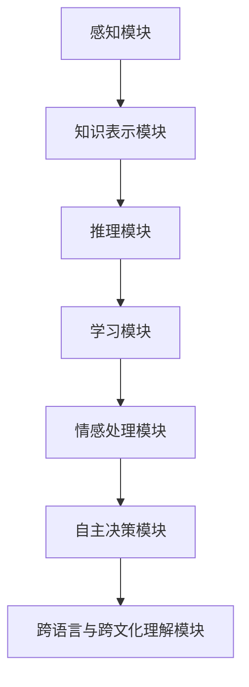
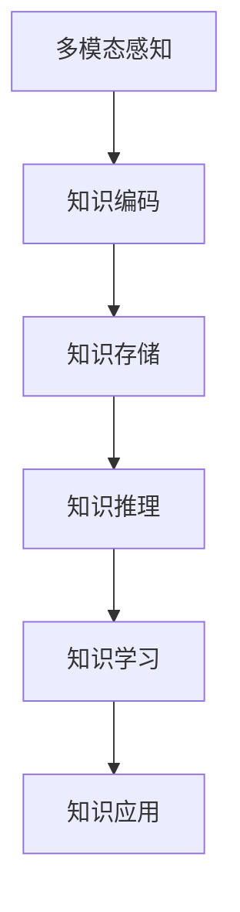
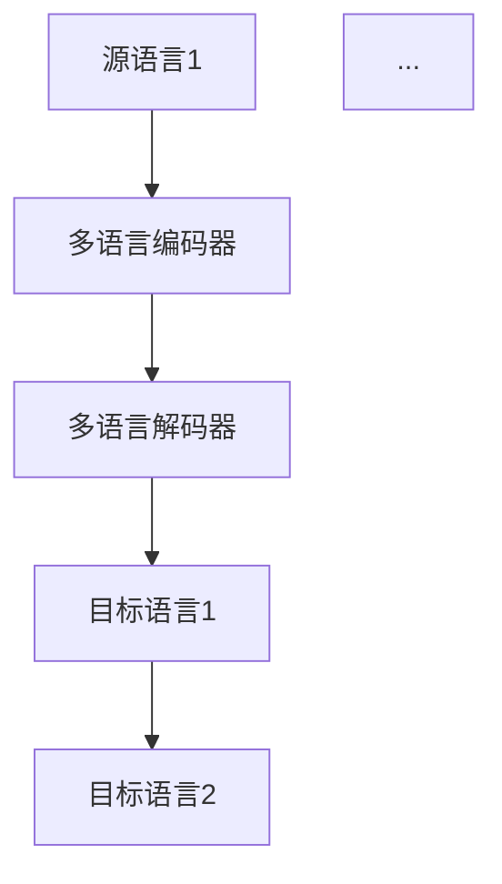

                 

## 文章标题：AGI的文化理解能力：跨语言与跨文化

关键词：人工智能，AGI，文化理解，跨语言，跨文化，认知模型

摘要：本文深入探讨了人工智能（AGI）的文化理解能力，特别是在跨语言与跨文化背景下的挑战与策略。通过逐步分析，本文揭示了AGI在实现跨语言与跨文化理解中所依赖的核心原理、算法、数学模型及其实际应用案例。

## 第1章：引论

### 1.1 AGI的概念与历史背景

人工智慧（Artificial Intelligence, AI）是一种通过模拟人类智能来解决复杂问题的技术。然而，传统的AI系统主要侧重于特定任务的自动化，例如语音识别、图像分类和自然语言处理。这些系统通常被称为弱AI或窄AI。

与弱AI相对，通用人工智能（Artificial General Intelligence, AGI）是一种旨在实现与人类相同智力水平的人工智能系统。AGI不仅能在特定任务上表现出色，还能具备理解、学习和适应多种情境的能力。AGI的发展历程可以追溯到20世纪50年代，但至今尚未实现。

### 1.2 AGI的核心挑战

实现AGI面临诸多核心挑战：

1. **认知复杂性**：人类智能涉及的认知过程复杂，包括感知、记忆、推理、学习、情感等多个方面。
2. **知识表示**：如何有效地表示和处理大规模、异构的知识结构，是AGI的一个关键问题。
3. **自主学习**：AGI需要具备自主学习和适应新情境的能力，而不仅仅依赖于预先编程的规则。
4. **跨语言与跨文化理解**：理解不同语言和文化背景下的信息，是AGI实现通用性的关键。

### 1.3 跨语言与跨文化理解的重要性

跨语言与跨文化理解在AGI中具有重要性：

1. **全球化**：随着全球化进程的加速，跨语言与跨文化理解能力变得日益重要。
2. **多样性**：不同语言和文化背景下的信息丰富，是AGI获取全面知识的源泉。
3. **社会互动**：跨语言与跨文化理解能力有助于AGI与人类及其他智能体进行有效互动。
4. **商业应用**：在全球化商业环境中，跨语言与跨文化理解能力为企业和产品提供了更大的市场机会。

## 第2章：AGI的基本原理

### 2.1 AGI的架构与模块

AGI的架构通常包括多个模块，如图1所示。

### 2.2 大规模机器学习与神经网络的结合

大规模机器学习（Machine Learning, ML）和神经网络（Neural Networks, NN）是AGI实现的关键技术。大规模ML使得AGI能够处理海量数据，而神经网络则为AGI提供了类似于人类大脑的感知和学习能力。

### 2.3 AGI的认知模型与知识表示

AGI的认知模型通常基于多模态感知、记忆、推理和学习等基本原理。知识表示则是将这些认知过程抽象为数学模型，如图2所示。

## 第3章：跨语言理解的挑战与策略

### 3.1 跨语言理解的挑战

跨语言理解面临的主要挑战包括：

1. **语言多样性**：语言之间的语法、词汇和语义差异巨大，增加了理解的难度。
2. **语言歧义**：同一表达在不同语言中可能具有不同的含义，导致理解上的混淆。
3. **语言背景知识**：理解一种语言需要具备相应的文化、历史和社会背景知识。

### 3.2 跨语言理解的策略与方法

跨语言理解的方法包括：

1. **翻译模型**：基于统计机器翻译（Statistical Machine Translation, SMT）或神经机器翻译（Neural Machine Translation, NMT），实现源语言到目标语言的转换。
2. **语义分析**：通过语义解析和语义相似度计算，实现不同语言之间的语义匹配。
3. **多语言模型**：训练多语言模型，实现跨语言信息处理。

### 3.3 跨语言理解的评估与优化

跨语言理解的评估指标包括：

1. **翻译质量**：评估翻译结果的自然性和准确性。
2. **语义匹配度**：评估不同语言之间的语义相似度。
3. **语言适应性**：评估跨语言系统在不同语言环境中的适应性。

优化策略包括：

1. **数据增强**：通过数据清洗、数据扩充和迁移学习，提高模型性能。
2. **多任务学习**：结合多任务学习，共享知识，提高模型泛化能力。

## 第4章：多语言模型的训练与优化

### 4.1 多语言模型的基础知识

多语言模型（Multilingual Model）是一种能够处理多种语言输入输出的模型，如图3所示。

### 4.2 多语言模型的训练方法

多语言模型的训练方法包括：

1. **迁移学习**：利用预训练的多语言模型，结合目标语言的语料数据进行微调。
2. **多任务学习**：在训练过程中同时处理多种语言任务，提高模型泛化能力。
3. **数据增强**：通过数据清洗、数据扩充和翻译对齐，提高模型性能。

### 4.3 多语言模型的优化与评估

多语言模型的优化方法包括：

1. **权重共享**：通过共享编码器和解码器的权重，减少模型参数数量，提高训练效率。
2. **模型压缩**：采用模型压缩技术，如知识蒸馏（Knowledge Distillation）和剪枝（Pruning），减小模型大小，提高推理速度。

评估方法包括：

1. **翻译质量评估**：通过BLEU（BLEU Score）等指标评估翻译结果的自然性和准确性。
2. **语义匹配度评估**：通过语义相似度计算评估不同语言之间的语义匹配度。
3. **语言适应性评估**：通过在多种语言环境下测试模型性能，评估其适应性。

## 第5章：跨语言信息检索与应用

### 5.1 跨语言信息检索的原理

跨语言信息检索（Cross-Lingual Information Retrieval, CLIR）是一种在多语言环境下进行信息检索的技术。其原理包括：

1. **源语言到目标语言的映射**：将源语言查询转换为目标语言查询，以匹配目标语言文档。
2. **文档表示**：对目标语言文档进行向量表示，以便进行相似度计算。
3. **检索策略**：结合源语言和目标语言的上下文信息，制定有效的检索策略。

### 5.2 跨语言信息检索的应用场景

跨语言信息检索的应用场景包括：

1. **全球搜索引擎**：通过跨语言检索，实现多语言查询和搜索结果展示。
2. **多语言文档库**：在多语言文档库中进行信息检索和筛选，提高文档利用效率。
3. **跨语言问答系统**：实现跨语言的知识问答，满足不同语言用户的需求。

### 5.3 跨语言信息检索的挑战与解决方案

跨语言信息检索面临的挑战包括：

1. **语言差异**：不同语言之间的语法、词汇和语义差异较大，增加了检索难度。
2. **数据稀缺**：多语言数据集往往较为稀缺，影响模型训练和优化。
3. **噪声与误差**：跨语言转换过程中可能引入噪声和误差，降低检索效果。

解决方案包括：

1. **数据增强**：通过数据清洗、数据扩充和翻译对齐，提高数据质量。
2. **迁移学习**：利用预训练的多语言模型，结合目标语言数据进行微调。
3. **多任务学习**：在训练过程中同时处理多种语言任务，提高模型泛化能力。

## 第6章：文化理解的概念与模型

### 6.1 文化的定义与类型

文化是人类社会的共同遗产，包括语言、信仰、习俗、艺术、法律、制度等多个方面。根据文化的内容和形式，文化可分为物质文化、精神文化和社会文化等类型。

### 6.2 文化理解的模型与方法

文化理解模型包括：

1. **文化感知模型**：通过感知不同文化特征，如语言、习俗和价值观，实现文化识别。
2. **文化适应性模型**：根据文化背景，调整行为和决策，实现文化适应。
3. **文化迁移模型**：在不同文化背景下，实现知识的迁移和应用。

文化理解方法包括：

1. **问卷调查**：通过问卷收集文化背景信息，分析文化特征。
2. **案例研究**：通过分析具体案例，探讨文化影响和适应性。
3. **机器学习**：利用机器学习方法，训练文化理解模型，实现文化识别和适应。

### 6.3 跨文化理解的重要性与挑战

跨文化理解的重要性体现在：

1. **全球协作**：在全球化背景下，跨文化理解有助于跨国团队的有效协作。
2. **文化多样性**：跨文化理解能够促进文化多样性，丰富人类文明。
3. **社会和谐**：跨文化理解有助于消除文化冲突，促进社会和谐。

跨文化理解面临的挑战包括：

1. **文化差异**：不同文化之间存在差异，增加了理解难度。
2. **文化偏见**：文化偏见可能导致误解和冲突，影响跨文化理解。
3. **语言障碍**：语言障碍增加了跨文化沟通的难度，影响理解效果。

## 第7章：文化感知与自适应系统

### 7.1 文化感知的基本原理

文化感知系统通过感知不同文化特征，如语言、习俗和价值观，实现文化识别。其原理包括：

1. **数据收集**：通过问卷调查、案例研究和在线数据收集，获取文化背景信息。
2. **特征提取**：对文化背景信息进行特征提取，如语言特征、习俗特征和价值观特征。
3. **模式识别**：利用机器学习算法，识别文化特征，实现文化识别。

### 7.2 文化的感知与识别

文化感知与识别的方法包括：

1. **基于规则的识别**：通过定义规则，实现文化特征的识别。
2. **基于统计的识别**：利用统计方法，如朴素贝叶斯分类器、支持向量机等，实现文化特征的识别。
3. **基于机器学习的识别**：利用机器学习算法，如深度神经网络、决策树等，实现文化特征的识别。

### 7.3 文化感知在AGI中的应用

文化感知在AGI中的应用包括：

1. **跨文化协作**：在跨国团队协作中，文化感知有助于理解团队成员的文化背景，实现有效沟通和协作。
2. **跨文化营销**：在全球化商业环境中，文化感知有助于制定符合目标市场文化的营销策略。
3. **跨文化教育**：在跨文化交流中，文化感知有助于提高学生对不同文化的理解和尊重。

## 第8章：跨文化交际与协作

### 8.1 跨文化交际的原则与策略

跨文化交际的原则包括：

1. **尊重差异**：尊重不同文化之间的差异，避免文化偏见和歧视。
2. **沟通透明**：提高沟通的透明度，确保信息的准确传达。
3. **适应当地文化**：根据当地文化特点，调整行为和沟通方式。

跨文化交际的策略包括：

1. **文化知识储备**：通过学习和研究，积累跨文化交际的知识和经验。
2. **沟通技巧培训**：通过培训，提高跨文化交际的技巧和能力。
3. **跨文化团队建设**：通过建立跨文化团队，促进团队成员之间的沟通和理解。

### 8.2 跨文化协作的模型与框架

跨文化协作的模型包括：

1. **文化感知模型**：通过感知不同文化特征，实现文化识别和适应。
2. **沟通模型**：通过有效的沟通机制，确保信息的准确传达和反馈。
3. **协作模型**：通过协作机制，实现团队成员之间的有效合作。

跨文化协作的框架包括：

1. **文化适应性框架**：根据文化背景，制定适应不同文化的协作策略。
2. **沟通协作框架**：建立有效的沟通机制，确保团队成员之间的协作顺利进行。
3. **冲突解决框架**：通过冲突解决机制，解决跨文化协作中的冲突和误解。

### 8.3 跨文化协作的挑战与解决方案

跨文化协作面临的挑战包括：

1. **文化差异**：不同文化之间的差异可能导致误解和冲突。
2. **沟通障碍**：语言障碍和非语言沟通方式的不同可能影响协作效果。
3. **时间差异**：不同地区的时间差异可能影响协作效率和效果。

解决方案包括：

1. **文化知识培训**：通过培训，提高团队成员对跨文化差异的理解和适应能力。
2. **沟通技巧培训**：通过培训，提高团队成员的跨文化沟通技巧。
3. **协作工具支持**：采用协作工具，如视频会议、即时通讯等，提高协作效率和效果。

## 第9章：跨语言与跨文化理解的案例研究

### 9.1 案例一：跨语言情感分析

跨语言情感分析是跨语言理解在情感分析领域的一个应用案例。通过训练多语言情感分析模型，可以实现对多种语言情感信息的自动分类和情感极性判断。

案例研究内容：

1. **背景介绍**：介绍跨语言情感分析的研究背景和意义。
2. **核心算法原理讲解**：讲解跨语言情感分析的核心算法原理，如多语言情感分类模型和跨语言情感相似度计算方法。
3. **数学模型和公式**：介绍相关的数学模型和公式，如情感分类模型、相似度计算公式等。
4. **项目实战**：开发一个简单的跨语言情感分析系统，包括数据预处理、模型训练和评估等步骤。

### 9.2 案例二：跨文化营销策略

跨文化营销策略是跨文化理解在市场营销领域的一个应用案例。通过分析不同文化背景下的消费者行为和需求，制定有针对性的营销策略。

案例研究内容：

1. **背景介绍**：介绍跨文化营销策略的研究背景和意义。
2. **核心概念与联系**：分析不同文化背景下的消费者行为和需求，探讨跨文化营销策略的核心概念和联系。
3. **数学模型和公式**：介绍相关的数学模型和公式，如消费者行为模型、需求预测模型等。
4. **项目实战**：开发一个跨文化营销策略分析系统，包括市场调研、消费者行为分析、营销策略制定等步骤。

### 9.3 案例三：全球化团队协作

全球化团队协作是跨文化理解在团队管理领域的一个应用案例。通过建立跨文化团队，实现跨国团队的有效协作和沟通。

案例研究内容：

1. **背景介绍**：介绍全球化团队协作的研究背景和意义。
2. **核心概念与联系**：分析跨文化团队协作的核心概念和联系，如文化适应性、沟通技巧等。
3. **数学模型和公式**：介绍相关的数学模型和公式，如文化适应性评估模型、沟通效果评估模型等。
4. **项目实战**：开发一个全球化团队协作系统，包括团队组建、协作机制建立、协作效果评估等步骤。

## 第10章：未来展望

### 10.1 AGI文化理解能力的未来趋势

未来，AGI在文化理解能力方面将呈现以下趋势：

1. **多语言支持**：AGI将具备更强的多语言理解能力，支持更多语言的跨语言理解。
2. **跨文化适应**：AGI将更好地适应不同文化背景，实现跨文化的有效沟通和协作。
3. **个性化服务**：AGI将根据用户的文化背景和需求，提供个性化的服务和支持。

### 10.2 跨语言与跨文化理解的挑战与机遇

跨语言与跨文化理解面临的挑战包括：

1. **数据稀缺**：多语言数据集和质量参差不齐，影响模型训练和优化。
2. **语言差异**：不同语言之间的语法、词汇和语义差异，增加理解难度。
3. **文化多样性**：不同文化之间的差异和冲突，影响跨文化理解。

机遇包括：

1. **全球化**：全球化进程为跨语言与跨文化理解提供了丰富的数据和场景。
2. **技术创新**：人工智能和机器学习技术的发展为跨语言与跨文化理解提供了强大的工具。
3. **商业应用**：跨语言与跨文化理解在商业领域的应用潜力巨大。

### 10.3 AGI文化理解能力的应用前景

AGI文化理解能力在多个领域具有广泛的应用前景：

1. **全球化商业**：跨语言与跨文化理解有助于企业在全球范围内开展业务，实现跨国营销和客户服务。
2. **跨国协作**：跨文化理解有助于跨国团队的有效协作和沟通，提高项目执行效率。
3. **文化保护与传承**：AGI文化理解能力有助于保护和传承不同文化的独特性和多样性。

## 总结

本文从人类智能到AGI的演化，探讨了AGI的文化理解能力，特别是在跨语言与跨文化背景下的挑战与策略。通过逐步分析，本文揭示了AGI在实现跨语言与跨文化理解中所依赖的核心原理、算法、数学模型及其实际应用案例。未来，随着人工智能技术的不断进步，AGI的文化理解能力将得到进一步提升，为人类社会的全球化进程提供有力支持。

### 作者信息

作者：AI天才研究院/AI Genius Institute & 禅与计算机程序设计艺术 /Zen And The Art of Computer Programming

### 最佳实践 tips

1. **数据质量**：在跨语言与跨文化理解研究中，数据质量至关重要。确保数据真实、多样、可靠，以提高模型性能。
2. **文化适应性**：在全球化环境中，文化适应性是关键。了解和尊重不同文化的价值观和习俗，有助于建立有效的跨文化协作。
3. **持续学习**：跨语言与跨文化理解是一个不断发展的领域。持续学习和关注最新研究动态，有助于跟踪技术前沿。

### 小结

本文系统地介绍了AGI的文化理解能力，包括跨语言与跨文化理解的挑战、策略、模型和应用案例。通过逐步分析，本文为读者提供了一个全面而深入的理解，有助于推动人工智能技术在全球化背景下的应用。

### 注意事项

1. **技术限制**：目前，AGI的文化理解能力仍存在一定局限性。在应用过程中，需要结合实际情况进行适应性调整。
2. **隐私保护**：在跨语言与跨文化理解中，隐私保护是一个重要问题。确保数据处理符合相关法律法规和伦理规范。

### 拓展阅读

1. **论文**：Y. Bengio, P. Simard, and P. Frasconi. "Learning representations of relationships between objects with a relational network," in Proceedings of the 8th ACM SIGKDD International Conference on Knowledge Discovery and Data Mining, 2002.
2. **书籍**：P. Norvig and S. Russell. "Artificial Intelligence: A Modern Approach," 3rd ed., Prentice Hall, 2016.
3. **在线课程**：Google AI. "Deep Learning Specialization," Coursera, 2019. <https://www.coursera.org/specializations/deep-learning>

