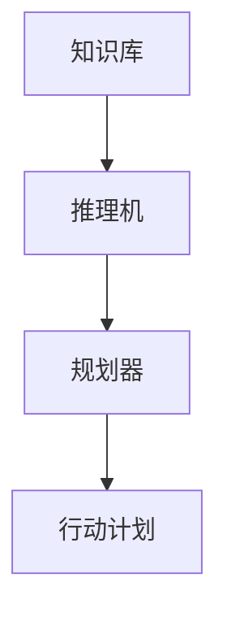
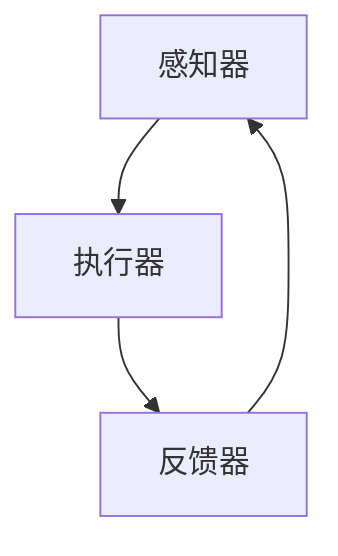
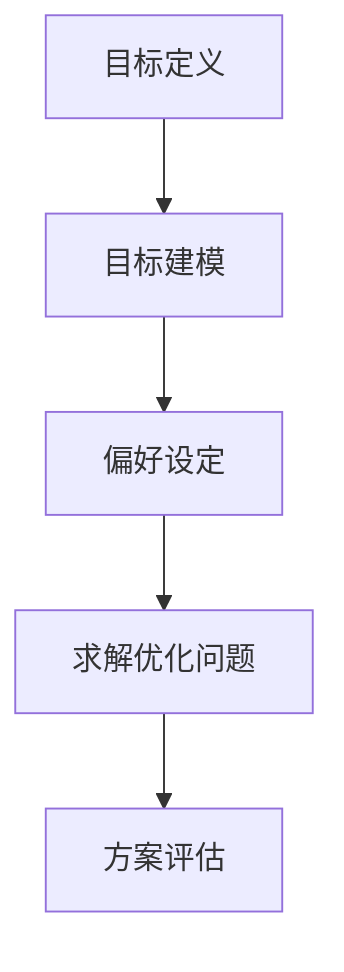
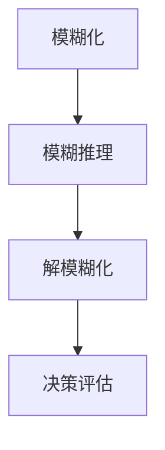

                 

## 第一部分: AGI概述

### 第1章: 什么是AGI

### 1.1 AGI的定义与核心特征

#### 1.1.1 AGI的定义

通用人工智能（Artificial General Intelligence，简称AGI）是指一种能够执行任何智力任务的人类智能水平的人工智能系统。与传统人工智能（Artificial Narrow Intelligence，简称ANI）不同，AGI不限于特定的任务或领域，而是能够灵活适应并处理各种复杂问题。

从定义上看，AGI需要具备以下几个核心特征：

1. **适应性**：AGI能够根据不同的环境和任务需求进行适应性调整。
2. **自主性**：AGI能够独立思考和决策，而不需要人类干预。
3. **普适性**：AGI能够在多个领域和任务中表现出与人类相似的智力水平。
4. **学习能力**：AGI能够通过不断的学习和经验积累，提高自身的智能水平。

#### 1.1.2 AGI的核心特征

1. **跨领域知识整合**：AGI需要具备跨学科的知识整合能力，能够理解并应用不同领域的知识。
2. **自主学习能力**：AGI需要能够自主学习新知识，通过自我调整和优化，提升自身能力。
3. **情感与认知理解**：AGI需要具备一定的情感和认知能力，能够理解和表达情感，进行复杂的社会互动。
4. **推理与决策能力**：AGI需要具备强大的推理和决策能力，能够在复杂环境中做出合理的决策。

### 1.2 AGI的历史与发展

#### 1.2.1 AGI的起源

AGI的概念起源于20世纪50年代，当时计算机科学家约翰·冯·诺伊曼（John von Neumann）提出了构建“通用电子计算机”的想法。这一想法为后来的AGI研究奠定了基础。

#### 1.2.2 AGI的重要里程碑

1. **1956年**：美国达特茅斯会议提出人工智能的概念，标志着人工智能研究正式开始。
2. **1960年代**：逻辑推理和知识表示成为AGI研究的主要方向，出现了诸如启发性搜索算法等关键算法。
3. **1980年代**：专家系统成为AGI研究的热点，但在实际应用中受到知识获取瓶颈的制约。
4. **1990年代至今**：机器学习和深度学习技术迅速发展，为AGI的实现提供了新的契机。

#### 1.3 AGI与现有AI的区别

1. **功能范围**：传统AI（ANI）专注于特定领域和任务，而AGI则能够跨越多个领域和任务。
2. **智能水平**：传统AI在特定任务上可能达到或超越人类水平，但AGI在多个任务上均能达到人类水平。
3. **自主性**：传统AI通常需要人类指定任务和规则，而AGI能够自主发现和解决问题。
4. **学习能力**：传统AI需要大量手动标注数据，而AGI能够通过自我学习和自适应提升能力。

### 1.3.2 AGI的发展前景

随着技术的不断进步，AGI有望在未来实现以下前景：

1. **智能服务**：AGI将能够提供更加个性化、智能化的服务，如医疗诊断、金融咨询等。
2. **自动化**：AGI将推动自动化技术的发展，提高生产效率，降低劳动力成本。
3. **创新驱动**：AGI将激发新的科学研究和技术创新，推动人类社会的进步。
4. **社会影响**：AGI的发展将带来深远的社会影响，包括就业、伦理和隐私等问题。

## 第二部分: 目标导向推理

### 第2章: 目标导向推理的基本概念

### 2.1 目标导向推理的定义

#### 2.1.1 推理与目标导向推理

推理（Reasoning）是人工智能中的一个核心概念，指的是基于已有知识和信息，通过逻辑分析和演绎得出新的结论或决策。推理可以分为两大类：归纳推理和演绎推理。

归纳推理是从个别事实出发，归纳出一般性结论的推理过程。演绎推理则是从一般性原则出发，推导出特定情况的结论。

目标导向推理（Goal-Oriented Reasoning）是一种特殊的推理方法，它以目标为导向，通过分析和规划，确定实现目标的最佳路径和策略。目标导向推理具有以下几个特点：

1. **目标驱动**：推理过程始终围绕目标的实现进行，目标指导推理的方向和策略。
2. **动态调整**：在推理过程中，根据环境和目标的变化，实时调整推理路径和策略。
3. **灵活适应性**：目标导向推理能够应对复杂、不确定的环境，找到最优或近似最优的解决方案。

#### 2.1.2 目标导向推理的重要性

目标导向推理在人工智能领域具有重要地位，主要表现在以下几个方面：

1. **任务规划**：目标导向推理能够帮助人工智能系统进行任务规划和路径规划，提高任务执行的效率。
2. **问题求解**：目标导向推理能够解决复杂的问题，特别是在多目标和不确定环境中。
3. **决策支持**：目标导向推理能够为人工智能系统提供决策支持，帮助其在复杂环境中做出合理的选择。

### 2.2 目标导向推理的过程

目标导向推理的过程可以分为以下几个步骤：

#### 2.2.1 目标确定

目标确定是目标导向推理的第一步，主要任务是明确系统需要实现的目标。目标可以是具体的，也可以是抽象的，但必须具有明确的定义和衡量标准。

#### 2.2.2 目标分解

在确定了总体目标后，需要对目标进行分解，将其拆分成若干个子目标和中间目标。目标分解的过程可以帮助系统更好地理解目标的实现路径，并为后续的推理提供基础。

#### 2.2.3 目标实现

目标实现是目标导向推理的核心步骤，主要任务是利用系统已有的知识和资源，通过推理和规划，逐步实现各个子目标和中间目标。在实现目标的过程中，系统需要不断评估当前状态和目标之间的差距，并调整推理策略。

### 2.3 目标导向推理的应用领域

目标导向推理在人工智能领域有广泛的应用，以下是一些典型的应用领域：

#### 2.3.1 智能机器人

智能机器人是目标导向推理的重要应用领域。通过目标导向推理，智能机器人可以规划自己的行动路径，识别和避开障碍物，完成复杂任务。

#### 2.3.2 智能交通系统

智能交通系统利用目标导向推理来优化交通流量，提高道路通行效率。通过分析交通数据，智能交通系统可以预测交通状况，并制定最优的交通疏导策略。

#### 2.3.3 智能家居

智能家居通过目标导向推理来实现自动化控制，提高居住舒适度和安全性。例如，智能空调可以根据用户习惯和天气状况自动调整温度，智能灯具可以根据光线条件和用户需求自动调节亮度。

## 第三部分: 决策制定

### 第3章: 决策制定的基本概念

### 3.1 决策制定的定义

决策制定（Decision Making）是指从多个可能的行动方案中选择一个最佳方案的过程。在人工智能领域，决策制定是一个重要的研究方向，旨在使智能系统能够在复杂、不确定的环境中做出合理的选择。

决策制定可以分为以下几个基本要素：

1. **决策者**：进行决策的个人或组织。
2. **目标**：决策者希望达成的目标或结果。
3. **可选方案**：决策者可以采取的各种行动方案。
4. **结果**：每个可选方案可能产生的结果及其概率。
5. **决策标准**：决策者用来评估和比较可选方案的标准。

决策制定的过程可以概括为以下步骤：

1. **问题识别**：识别需要解决的问题或面临的挑战。
2. **信息收集**：收集与问题相关的信息，包括可选方案和结果。
3. **方案评估**：根据决策标准，对可选方案进行评估和比较。
4. **选择方案**：从可选方案中选择一个最佳方案。
5. **实施方案**：实施选定的方案，并监控决策的效果。

### 3.1.2 决策制定的过程

决策制定是一个复杂的过程，通常涉及多个阶段。以下是决策制定的一般过程：

1. **问题定义**：明确问题的性质和目标，确保所有相关方对问题有共同的理解。
2. **信息收集**：收集与问题相关的数据和信息，包括历史数据、专家意见、市场趋势等。
3. **方案生成**：基于收集到的信息，生成多个可能的行动方案。
4. **方案评估**：对每个方案进行评估，通常涉及风险分析、成本效益分析等。
5. **选择方案**：基于评估结果，选择一个或多个最佳方案。
6. **实施方案**：实施选定的方案，并持续监控决策的效果。
7. **反馈与调整**：根据决策执行后的反馈，对决策进行调整和优化。

### 3.2 决策制定的方法

决策制定的方法可以根据不同的情境和需求进行选择。以下是几种常见的决策制定方法：

#### 3.2.1 经验决策方法

经验决策方法依赖于决策者的个人经验和直觉。决策者根据过去的经验和知识，对当前问题进行分析和判断，选择一个合适的方案。这种方法适用于决策者具有丰富经验和高度专业知识的领域。

#### 3.2.2 理性决策方法

理性决策方法基于逻辑和数学模型，通过系统分析和计算，选择最优的方案。理性决策方法通常包括以下步骤：

1. **建立模型**：根据问题的性质，建立数学模型来描述决策问题。
2. **求解模型**：使用优化算法求解模型，找到最优解。
3. **方案评估**：对求解结果进行评估，选择一个或多个最佳方案。
4. **实施方案**：实施选定的方案。

理性决策方法适用于数据充分、问题结构明确的情境。

#### 3.2.3 模糊决策方法

模糊决策方法处理的是不确定性和模糊性的问题。在现实世界中，很多决策问题都存在模糊性和不确定性，如天气预测、金融市场分析等。模糊决策方法通过引入模糊集合和模糊逻辑，对不确定性的问题进行建模和求解。

模糊决策方法的主要步骤包括：

1. **模糊化**：将模糊的概念转化为模糊集合。
2. **建立模糊模型**：根据模糊化后的概念，建立模糊逻辑模型。
3. **求解模型**：使用模糊逻辑算法求解模型，得到模糊解。
4. **模糊决策**：将模糊解转化为具体的决策。

### 3.3 决策制定的应用领域

决策制定在多个领域有广泛的应用，以下是几个典型的应用领域：

#### 3.3.1 金融投资

金融投资是决策制定的重要应用领域。投资者通过分析市场数据、经济指标和历史走势，选择最优的投资组合，以实现资产增值。

#### 3.3.2 供应链管理

供应链管理涉及多个环节，包括采购、生产、运输和销售等。通过决策制定，企业可以优化供应链流程，降低成本，提高效率。

#### 3.3.3 资源配置

资源配置是决策制定的核心问题。在资源有限的条件下，如何合理分配资源，以实现最大化效益，是决策制定需要解决的问题。

#### 3.3.4 智能交通系统

智能交通系统通过决策制定，优化交通流量，提高道路通行效率，减少交通事故。

## 第四部分: AGI目标导向推理与决策制定的实现

### 第4章: AGI目标导向推理与决策制定的技术框架

### 4.1 目标导向推理框架

#### 4.1.1 基于知识的框架

基于知识的框架是目标导向推理的一种重要实现方式，它依赖于符号表示和推理机制。在这种框架中，知识被表示为符号或规则，推理过程通过符号操作和逻辑推理来实现。

以下是基于知识的框架的基本组件：

1. **知识库**：存储与目标相关的知识和信息，包括事实、规则和假设。
2. **推理机**：用于进行推理的组件，它通过匹配和演绎，从知识库中提取新的信息。
3. **规划器**：用于生成和评估行动计划的组件，它根据目标和要求，生成一系列行动步骤。

基于知识的框架具有以下优点：

1. **灵活性**：可以通过修改知识库和推理规则，适应不同的目标和环境。
2. **可解释性**：推理过程基于显式的知识和规则，易于理解和解释。
3. **可扩展性**：可以方便地添加新的知识和规则，以扩展系统的能力。

以下是基于知识的框架的Mermaid流程图：



#### 4.1.2 基于行为的框架

基于行为的框架是另一种实现目标导向推理的方式，它侧重于行动和结果的反馈。在这种框架中，系统的行为是通过执行具体的操作和动作来实现的，并通过环境反馈来调整和优化行为。

以下是基于行为的框架的基本组件：

1. **感知器**：用于感知环境状态和目标的组件。
2. **执行器**：用于执行行动的组件，它根据感知到的状态和目标，选择并执行相应的动作。
3. **反馈器**：用于接收环境反馈的组件，它根据执行结果，调整和优化行动策略。

基于行为的框架具有以下优点：

1. **实时性**：可以通过实时感知和执行，快速适应环境变化。
2. **适应性**：通过反馈和调整，系统能够在不确定和动态环境中实现目标。
3. **灵活性**：可以方便地引入新的感知和执行组件，以适应不同的应用场景。

以下是基于行为的框架的Mermaid流程图：



### 4.2 决策制定框架

#### 4.2.1 多目标决策框架

多目标决策是决策制定中的一个重要问题，它涉及到同时考虑多个目标，并选择一个满足所有目标的方案。多目标决策框架通常包括以下几个组件：

1. **目标空间**：定义所有可能的目标值集合。
2. **偏好函数**：用于表示决策者对目标的偏好，通常是一个多属性权重分配。
3. **优化器**：用于求解多目标优化问题，找到满足所有目标约束的最优解。

多目标决策框架的基本流程如下：

1. **目标定义**：明确需要考虑的所有目标。
2. **目标建模**：将目标转化为数学模型，通常涉及目标函数和约束条件。
3. **偏好设定**：根据决策者的偏好，设定目标权重和偏好函数。
4. **求解优化问题**：使用优化算法求解多目标优化问题，找到最优解。
5. **方案评估**：对求解结果进行评估，选择一个或多个最佳方案。

以下是多目标决策框架的Mermaid流程图：



#### 4.2.2 模糊决策框架

模糊决策框架处理的是不确定性和模糊性的问题，它通过引入模糊集合和模糊逻辑，对不确定的问题进行建模和求解。模糊决策框架的基本组件包括：

1. **模糊化器**：用于将精确的数值转化为模糊集合。
2. **模糊逻辑**：用于处理模糊集合之间的运算和推理。
3. **模糊推理机**：用于进行模糊推理和决策。
4. **模糊解模糊化器**：用于将模糊解转化为具体的决策。

模糊决策框架的基本流程如下：

1. **模糊化**：将输入数据和目标转化为模糊集合。
2. **模糊推理**：使用模糊逻辑进行推理，生成模糊解。
3. **解模糊化**：将模糊解转化为具体的决策。
4. **决策评估**：对决策结果进行评估，选择一个或多个最佳方案。

以下是模糊决策框架的Mermaid流程图：



### 4.3 实现AGI的技术挑战

实现AGI面临许多技术挑战，以下是一些主要挑战：

#### 4.3.1 计算能力

AGI需要处理大量的数据和复杂的计算任务，这要求计算机具备极高的计算能力。当前的计算机硬件水平还无法完全满足AGI的需求，特别是在实时性和并发处理方面。

#### 4.3.2 数据质量

AGI依赖于高质量的数据进行训练和学习。数据的质量直接影响AGI的性能和效果。在现实世界中，数据通常存在噪声、缺失和错误，这给数据预处理和清洗带来了挑战。

#### 4.3.3 知识获取与表示

AGI需要获取和处理多种类型的知识，如结构化数据、文本、图像和语音等。如何有效地获取和表示这些知识，是AGI实现中的一个重要挑战。

#### 4.3.4 自主性和适应性

AGI需要具备自主性和适应性，能够独立思考和决策，并在复杂、不确定的环境中发挥作用。这要求AGI具备强大的推理、规划和学习能力，能够动态适应环境变化。

## 第5章: AGI目标导向推理与决策制定的实际应用案例

### 5.1 智能交通系统案例

#### 5.1.1 案例背景

智能交通系统（Intelligent Transportation System，简称ITS）是一种利用先进的信息通信技术、控制技术和系统集成技术，实现交通信息的自动化采集、处理和分发，从而提高交通效率、降低交通拥堵、减少交通事故的系统。随着城市化进程的加快和汽车保有量的不断增加，智能交通系统在城市交通管理中发挥着越来越重要的作用。

#### 5.1.2 案例分析

在智能交通系统中，AGI的目标导向推理和决策制定技术被广泛应用于以下几个方面：

1. **交通流量预测**：利用历史交通数据和实时交通数据，通过目标导向推理技术，预测未来的交通流量，为交通疏导提供依据。

   ```mermaid
   graph TD
       A[历史数据] --> B[实时数据]
       B --> C[交通流量预测模型]
       C --> D[预测结果]
   ```

2. **交通信号控制**：通过分析交通流量和路况信息，利用目标导向推理技术，制定最优的交通信号控制策略，以减少交通拥堵和提升道路通行效率。

   ```mermaid
   graph TD
       A[交通流量] --> B[路况信息]
       B --> C[信号控制模型]
       C --> D[信号控制策略]
   ```

3. **交通事故预警**：通过实时监测交通状况，利用目标导向推理技术，识别潜在的交通事故风险，并及时发出预警，以避免交通事故的发生。

   ```mermaid
   graph TD
       A[实时交通状况] --> B[交通事故预警模型]
       B --> C[预警结果]
   ```

#### 5.1.3 案例效果

通过应用AGI的目标导向推理和决策制定技术，智能交通系统在多个方面取得了显著效果：

1. **交通效率提升**：通过优化交通信号控制和交通流量预测，智能交通系统显著提高了道路通行效率，减少了交通拥堵。

2. **事故发生率降低**：通过实时监测和预警，智能交通系统有效降低了交通事故的发生率。

3. **用户体验改善**：智能交通系统为用户提供实时的交通信息和服务，改善了用户的出行体验。

### 5.2 智能机器人案例

#### 5.2.1 案例背景

智能机器人是人工智能领域的一个重要应用方向，它在医疗、教育、制造、服务等多个领域发挥着重要作用。随着人工智能技术的不断进步，智能机器人的自主性和适应性要求越来越高，这为AGI的目标导向推理和决策制定技术提供了广阔的应用场景。

#### 5.2.2 案例分析

在智能机器人系统中，AGI的目标导向推理和决策制定技术被应用于以下几个方面：

1. **任务规划**：智能机器人需要根据环境和任务需求，规划最优的行动路径和策略，以完成复杂任务。

   ```mermaid
   graph TD
       A[任务需求] --> B[环境感知]
       B --> C[任务规划模型]
       C --> D[行动路径]
   ```

2. **决策制定**：在执行任务过程中，智能机器人需要根据实时环境和任务进展，制定合理的决策，以应对突发情况和环境变化。

   ```mermaid
   graph TD
       A[实时环境] --> B[任务进展]
       B --> C[决策模型]
       C --> D[决策结果]
   ```

3. **学习与适应**：智能机器人需要通过不断学习和适应，提高自身的智能水平和任务执行能力。

   ```mermaid
   graph TD
       A[任务执行] --> B[学习模型]
       B --> C[自适应能力]
   ```

#### 5.2.3 案例效果

通过应用AGI的目标导向推理和决策制定技术，智能机器人系统在多个方面取得了显著效果：

1. **任务完成效率提升**：智能机器人能够高效地规划任务和制定决策，显著提高了任务完成效率。

2. **适应性和灵活性增强**：智能机器人具备较强的适应性和灵活性，能够应对复杂和动态的环境变化。

3. **用户体验改善**：智能机器人能够为用户提供更加个性化和优质的服务，提升了用户体验。

### 5.3 智能家居案例

#### 5.3.1 案例背景

智能家居（Smart Home）是指通过物联网（IoT）技术，将家庭中的各种设备和系统连接起来，实现自动化控制和智能化管理的系统。随着物联网和人工智能技术的快速发展，智能家居已经成为现代家庭生活的重要组成部分。

#### 5.3.2 案例分析

在智能家居系统中，AGI的目标导向推理和决策制定技术被广泛应用于以下几个方面：

1. **设备控制**：智能家居系统需要根据用户需求和实时环境，自动控制家庭设备，如空调、灯光、安防系统等。

   ```mermaid
   graph TD
       A[用户需求] --> B[实时环境]
       B --> C[设备控制模型]
       C --> D[设备控制结果]
   ```

2. **环境监测**：智能家居系统需要实时监测家庭环境，如空气质量、温度、湿度等，并根据监测结果，自动调整设备状态，以提供舒适的生活环境。

   ```mermaid
   graph TD
       A[环境监测] --> B[环境参数]
       B --> C[环境调整模型]
       C --> D[环境调整结果]
   ```

3. **行为分析**：智能家居系统可以通过分析用户行为和习惯，提供个性化的服务和建议，如家居清洁、健康管理等。

   ```mermaid
   graph TD
       A[用户行为] --> B[行为分析模型]
       B --> C[服务建议]
   ```

#### 5.3.3 案例效果

通过应用AGI的目标导向推理和决策制定技术，智能家居系统在多个方面取得了显著效果：

1. **生活便捷性提升**：智能家居系统能够自动控制和调整家庭设备，为用户提供便捷的生活体验。

2. **能源效率提高**：通过智能监控和设备控制，智能家居系统能够有效降低能耗，提高能源利用效率。

3. **安全性和舒适性增强**：智能家居系统能够实时监测家庭环境，提供安全保障和舒适体验。

## 第6章: 未来展望与趋势

### 6.1 AGI的发展趋势

#### 6.1.1 技术进步的推动

随着计算能力的不断提升、大数据技术的广泛应用以及人工智能算法的不断优化，AGI的技术基础得到了显著增强。未来的技术进步将继续推动AGI的发展，使其在跨领域知识整合、自主学习能力、情感与认知理解等方面取得更大的突破。

#### 6.1.2 应用领域的拓展

AGI的应用领域将不断拓展，从当前的智能交通系统、智能机器人、智能家居等，逐渐扩展到医疗、金融、教育、制造等更多领域。AGI的广泛应用将带来深刻的社会变革，提高生产效率，改善生活质量。

#### 6.1.3 社会影响的思考

AGI的发展将对社会产生深远的影响，包括就业、伦理和隐私等方面。如何确保AGI的安全和可控，避免潜在的负面影响，是未来需要重点关注的问题。

### 6.2 AGI面临的挑战与对策

#### 6.2.1 技术挑战

实现AGI面临许多技术挑战，包括计算能力、数据质量、知识获取与表示等。为了克服这些挑战，需要不断推动技术创新，提高硬件性能，优化算法和模型，加强数据预处理和清洗技术。

#### 6.2.2 道德与伦理挑战

AGI的发展引发了一系列道德与伦理问题，如隐私保护、责任归属、公平性等。为了应对这些挑战，需要制定相应的法律法规和伦理准则，确保AGI的发展符合人类的价值观和道德标准。

#### 6.2.3 法律与政策挑战

AGI的发展将对现有的法律和政策体系提出新的挑战。如何制定适应AGI时代的法律和政策，确保社会稳定和公平，是未来需要解决的问题。

### 6.3 AGI的未来前景

#### 6.3.1 经济影响

AGI的发展将带来巨大的经济效益，促进产业升级和经济增长。通过智能化的生产和服务，企业将提高效率，降低成本，创造更多价值。

#### 6.3.2 社会影响

AGI的发展将对社会产生深远影响，包括就业、教育、医疗、文化等方面。通过智能化的服务和管理，人们的生活质量将得到显著提升。

#### 6.3.3 科技发展的影响

AGI的发展将推动科技不断进步，催生新的科技革命和产业变革。未来的科技发展将更加智能化、个性化，为社会带来更多机遇和挑战。

## 参考文献

1. Russell, S., & Norvig, P. (2020). 《人工智能：一种现代的方法》（第4版）. 机械工业出版社.
2. Hayes, P. J. (1988). "Goals as an Organizing Principle in a General Problem Solver." IEEE Expert, 3(3), 23-29.
3. Kahneman, D., & Tversky, A. (1979). "Prospect Theory: An Analysis of Decision under Risk." Econometrica, 47(2), 263-292.
4. Koza, J. R. (1992). "Genetic Programming: On the Automation of Computer Programming by Means of Natural Selection." MIT Press.
5. Russell, S., & Norvig, P. (2010). "Artificial Intelligence: A Modern Approach." Prentice Hall.
6. Schapire, R. E., & Freund, Y. (2012). "A Short Introduction to Boosting." Journal of Machine Learning Research, 12, 1619-1651.
7. Russell, S., & Norvig, P. (2016). "Artificial Intelligence: A Modern Approach, 3rd ed." Prentice Hall.

