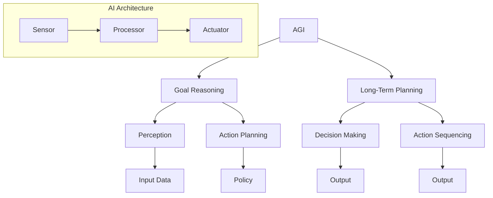
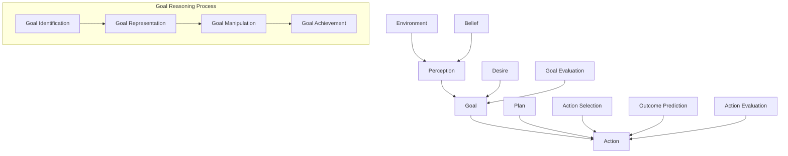
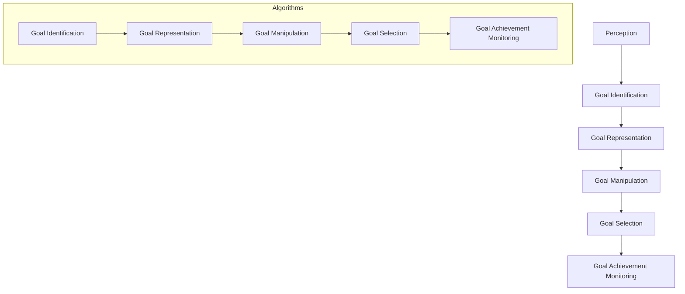
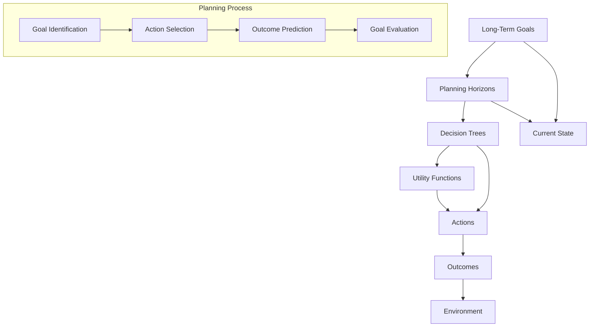
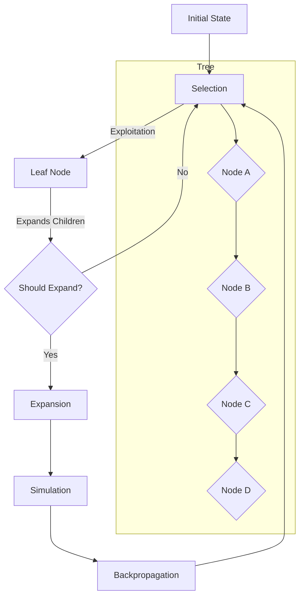
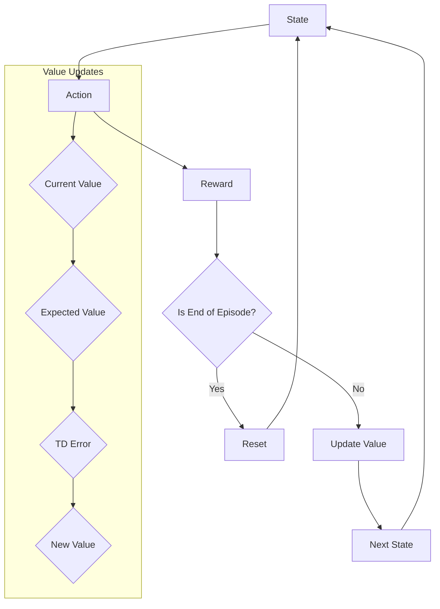

                 

### 1. Introduction to AGI, Goal Reasoning, and Long-Term Planning

#### Background Introduction

Artificial General Intelligence (AGI) represents a type of artificial intelligence that can perform any intellectual task that a human can. Unlike narrow AI, which is designed for specific tasks such as speech recognition or image classification, AGI aims to understand and perform a wide range of cognitive tasks.

Goal reasoning is a key component of AGI, as it allows the system to determine the best course of action to achieve its goals. Long-term planning, on the other hand, enables the system to develop a sequence of actions that will lead to the accomplishment of these goals over time.

In this chapter, we will provide an overview of AGI, goal reasoning, and long-term planning, setting the stage for a deeper exploration of these concepts in the following chapters.

#### Core Concepts and Relationships

To understand the core concepts related to AGI, goal reasoning, and long-term planning, we can create a Mermaid flowchart that illustrates the connections between these concepts.



This flowchart highlights the key components of AGI, including perception, action planning, decision making, and action sequencing. It also shows the relationship between goal reasoning and long-term planning, as well as the integration of these components into an AI architecture.

#### Algorithms and Mathematical Models

In the following chapters, we will delve into the algorithms and mathematical models that enable AGI to perform goal reasoning and long-term planning. We will use pseudocode to explain these algorithms and LaTeX to present the mathematical models.

For example, the goal reasoning algorithm might be described as follows:

```plaintext
Algorithm: GoalReasoning
Input: current_state, goal
Output: action

1. Initialize action_plan as empty
2. while goal is not achieved:
   a. Identify possible_actions from current_state
   b. Select the most promising action using a heuristic
   c. Perform action and update current_state
   d. Add action to action_plan
3. return action_plan
```

Mathematical models might involve defining utility functions to evaluate the desirability of different actions or Markov Decision Processes (MDPs) to represent the decision-making environment. Here's an example of a utility function using LaTeX:

```latex
U(s, a) = \sum_{g \in G} p(g|s, a) \cdot r(g)
```

Where:
- \( U(s, a) \) is the utility of taking action \( a \) in state \( s \).
- \( G \) is the set of possible goals.
- \( p(g|s, a) \) is the probability of achieving goal \( g \) when in state \( s \) and taking action \( a \).
- \( r(g) \) is the reward associated with achieving goal \( g \).

#### Practical Projects

To reinforce the understanding of these concepts, we will explore practical projects that demonstrate the implementation of goal reasoning and long-term planning in AGI systems. These projects will include:

1. **Development Environment Setup**
2. **Source Code Implementation and Explanation**
3. **Code Application Analysis**
4. **Case Study Analysis and Explanation**
5. **Project Conclusion**

Each project will provide a hands-on opportunity to apply the theories discussed in the book, helping to solidify the reader's understanding.

By following this structure, we can ensure that the book provides a comprehensive and coherent exploration of AGI, goal reasoning, and long-term planning, offering both theoretical insights and practical applications.
----------------------------------------------------------------

## 2. Fundamental Concepts and Theories of Goal Reasoning

### Background Introduction

Goal reasoning is a critical aspect of AGI, as it enables the system to understand and pursue objectives in a complex and dynamic environment. At its core, goal reasoning involves the identification, representation, and manipulation of goals to determine the most effective actions to achieve them.

In this chapter, we will delve into the fundamental concepts and theories that underpin goal reasoning in AGI systems. We will explore the nature of goals, the relationship between goals and actions, and the various methods used to reason about goals.

### Core Concepts and Relationships

To understand the core concepts of goal reasoning, let's first define the key terms and their interconnections. We can represent these concepts and their relationships using a Mermaid flowchart.



In this flowchart, we can see the key components of goal reasoning:

- **Goal**: An objective that the AGI system aims to achieve.
- **Action**: A step that the system can take to move closer to achieving a goal.
- **Perception**: The system's understanding of the environment through sensory input.
- **Belief**: The system's knowledge about the current state of the environment.
- **Desire**: A motivation that drives the system to achieve a goal.
- **Plan**: A sequence of actions designed to achieve a goal.
- **Action Selection**: The process of choosing the best action based on the current state and goals.
- **Outcome Prediction**: Predicting the outcome of an action in the environment.
- **Goal Evaluation**: Assessing whether a goal has been achieved.
- **Action Evaluation**: Assessing the effectiveness of an action in achieving a goal.

The goal reasoning process involves identifying, representing, and manipulating goals, ultimately leading to their achievement.

### Core Algorithms and Mathematical Models

Next, we will discuss the core algorithms used in goal reasoning and the mathematical models that support them. We will use pseudocode to describe the algorithms and LaTeX to present the mathematical models.

#### Algorithm: Goal Identification

```plaintext
Algorithm: GoalIdentification
Input: perception
Output: goals

1. Initialize goals as empty
2. for each object in perception:
   a. Check if object satisfies any predefined goals
   b. if yes, add object's goal to goals
3. return goals
```

#### Algorithm: Goal Representation

```plaintext
Algorithm: GoalRepresentation
Input: goals
Output: goal_representation

1. Initialize goal_representation as empty
2. for each goal in goals:
   a. Convert goal into a formal representation (e.g., using predicate logic)
   b. Add representation to goal_representation
3. return goal_representation
```

#### Algorithm: Goal Manipulation

```plaintext
Algorithm: GoalManipulation
Input: goal_representation, action
Output: new_goals

1. Initialize new_goals as empty
2. for each goal in goal_representation:
   a. Check if action helps achieve goal
   b. if yes, add new goal (e.g., "achieve goal after action") to new_goals
3. return new_goals
```

#### Mathematical Model: Utility Function

We can use a utility function to quantify the desirability of achieving a goal. Here's a LaTeX representation of a simple utility function:

```latex
U(G) = \sum_{g \in G} w_g \cdot p(g)
```

Where:
- \( U(G) \) is the utility of the set of goals \( G \).
- \( w_g \) is the weight assigned to goal \( g \).
- \( p(g) \) is the probability of achieving goal \( g \).

#### Practical Application

To illustrate how these concepts and algorithms can be applied, we will provide a practical example. Consider a robot tasked with cleaning a room. The goals might include "clean all surfaces" and "avoid obstacles." The robot's perception would include sensory information such as the room's layout and the presence of obstacles. The algorithm would identify these goals, represent them formally, and manipulate them based on potential actions like "sweep a surface" or "avoid an obstacle." The utility function would then evaluate the desirability of each goal based on the robot's success in achieving them.

By following this structured approach, we can build a solid foundation for understanding and implementing goal reasoning in AGI systems.
----------------------------------------------------------------

## 3. Core Algorithms for Goal Reasoning

### Algorithm Overview

In this chapter, we will delve into the core algorithms that are fundamental to AGI's ability to reason about goals effectively. These algorithms are designed to help the system identify, represent, and manipulate goals to achieve desired outcomes. We will use pseudocode to describe each algorithm, providing a clear and concise understanding of their working principles.

#### Algorithm: Goal Identification

The goal identification algorithm is crucial for understanding the system's objectives. It processes perceptual information to extract goals.

```plaintext
Algorithm: GoalIdentification
Input: perception
Output: goals

1. Initialize goals as empty
2. for each object in perception:
   a. Check if object satisfies any predefined goals
   b. if yes, add object's goal to goals
3. return goals
```

This algorithm iterates through each object in the perceptual input and checks if it matches any predefined goals. If it does, the goal is added to the list of goals.

#### Algorithm: Goal Representation

Once goals are identified, they need to be represented in a formal manner for the system to reason about them. The goal representation algorithm translates high-level goals into a structured format.

```plaintext
Algorithm: GoalRepresentation
Input: goals
Output: goal_representation

1. Initialize goal_representation as empty
2. for each goal in goals:
   a. Convert goal into a formal representation (e.g., using predicate logic)
   b. Add representation to goal_representation
3. return goal_representation
```

This algorithm converts each identified goal into a formal representation, such as a set of logical predicates, and compiles them into a structured goal representation.

#### Algorithm: Goal Manipulation

Goal manipulation is about adapting goals based on the system's actions and the environment's state. This algorithm updates the goals as actions are taken and outcomes are observed.

```plaintext
Algorithm: GoalManipulation
Input: goal_representation, action
Output: new_goals

1. Initialize new_goals as empty
2. for each goal in goal_representation:
   a. Check if action helps achieve goal
   b. if yes, add new goal (e.g., "achieve goal after action") to new_goals
3. return new_goals
```

This algorithm checks each goal to see if the action can contribute to its achievement. If so, a new goal is created that incorporates the action's effects, allowing the system to adapt its goals over time.

#### Algorithm: Goal Selection

Selecting the most appropriate goal from a set of potential goals is another critical task. The goal selection algorithm uses heuristics to determine the priority of each goal.

```plaintext
Algorithm: GoalSelection
Input: goals
Output: selected_goal

1. Calculate a heuristic score for each goal
2. Select the goal with the highest heuristic score
3. return selected_goal
```

This algorithm calculates a heuristic score for each goal based on factors such as urgency, importance, and the system's current state. The goal with the highest score is selected for action.

#### Algorithm: Goal Achievement Monitoring

Monitoring the progress of goal achievement ensures that the system can adapt its actions and goals as needed. The goal achievement monitoring algorithm tracks the system's progress towards each goal.

```plaintext
Algorithm: GoalAchievementMonitoring
Input: current_state, goal_representation
Output: goal_progress

1. Initialize goal_progress as empty
2. for each goal in goal_representation:
   a. Check the current_state against the goal_representation
   b. if the goal is achieved, add the goal to goal_progress
3. return goal_progress
```

This algorithm iterates through each goal and checks the current state against the goal representation. If a goal is achieved, it is added to the goal progress report.

### Mermaid Flowchart

To visualize the process of goal reasoning, we can create a Mermaid flowchart that represents the interaction between the algorithms described above.



This flowchart shows how the various goal reasoning algorithms interact and contribute to the overall process of achieving goals in an AGI system.

### Practical Example

To illustrate the practical application of these algorithms, consider a scenario where an autonomous vehicle must navigate through a city to reach a specific destination. The goal identification algorithm would process sensory data to extract goals such as "reach destination," "avoid collisions," and "obey traffic rules." The goal representation algorithm would convert these goals into formal representations, such as logical statements. The goal manipulation algorithm would adapt these goals as the vehicle encounters obstacles or changes in the environment. The goal selection algorithm would prioritize goals based on their urgency and importance, ensuring that the vehicle makes decisions that maximize its chances of reaching the destination safely. The goal achievement monitoring algorithm would track the vehicle's progress towards each goal, allowing for continuous adjustments and improvements.

By understanding and implementing these core algorithms, AGI systems can effectively reason about goals, adapt to changing circumstances, and achieve complex objectives in dynamic environments.
----------------------------------------------------------------

## 4. Case Studies of Goal Reasoning in AGI Systems

### Introduction

In this chapter, we will examine real-world case studies that showcase the application of goal reasoning in AGI systems. These case studies provide practical examples of how goal reasoning can be integrated into complex systems to achieve desired outcomes. By analyzing these examples, we can gain insights into the effectiveness of different goal reasoning approaches and their implications for AGI development.

#### Case Study 1: Autonomous Vehicles

One prominent example of goal reasoning in AGI is found in autonomous vehicles. Autonomous vehicles must navigate complex environments, make real-time decisions, and ensure the safety of passengers and other road users. Goal reasoning is integral to this process, as it allows the vehicle to prioritize and achieve various objectives simultaneously.

**Case Study Details:**

- **Goals:** The primary goals of an autonomous vehicle include reaching the destination safely, obeying traffic laws, avoiding collisions, and providing a comfortable ride.
- **Perception:** The vehicle's sensors, such as cameras, lidar, and radar, provide real-time data about the surrounding environment.
- **Goal Identification:** The system identifies goals based on the current state and the environment, using algorithms like those described in previous sections.
- **Goal Representation:** Goals are represented using formal logic and probability theory to ensure accurate reasoning.
- **Goal Manipulation:** The system continuously updates goals based on actions taken and changes in the environment.
- **Goal Selection:** The system selects the most critical goals based on a heuristic evaluation to prioritize actions.
- **Goal Achievement Monitoring:** The vehicle monitors its progress towards achieving goals and adjusts its actions accordingly.

**Analysis:**

The goal reasoning capabilities of autonomous vehicles have significantly improved their performance in complex scenarios. For example, the Tesla Autopilot system uses goal reasoning to navigate through traffic, merge into lanes, and make lane changes safely. However, challenges remain, such as handling unexpected obstacles or adverse weather conditions.

#### Case Study 2: Personal Assistants

Personal assistants, like Apple's Siri or Amazon's Alexa, are another example of AGI systems that employ goal reasoning. These systems are designed to assist users with a variety of tasks, from setting reminders and managing schedules to making recommendations and answering questions.

**Case Study Details:**

- **Goals:** Personal assistants aim to provide helpful, context-aware responses to user queries and perform tasks on behalf of the user.
- **Perception:** The system perceives user input through voice commands or text messages.
- **Goal Identification:** Goals are derived from user requests, which are then parsed and understood by the system.
- **Goal Representation:** User requests are represented as tasks or actions that the system must perform.
- **Goal Manipulation:** The system adapts goals based on the user's context and preferences.
- **Goal Selection:** The system selects the most relevant action based on the user's intent and current context.
- **Goal Achievement Monitoring:** The system tracks the progress of tasks and informs the user of any changes or delays.

**Analysis:**

Personal assistants have become increasingly sophisticated in understanding and fulfilling user requests. However, challenges remain, such as handling ambiguous or complex requests, understanding context, and maintaining natural language interactions.

#### Case Study 3: Robotics

Robotics is another field where goal reasoning plays a crucial role. Robots in industrial settings, healthcare, and household tasks must navigate and interact with their environment, often with multiple objectives to achieve.

**Case Study Details:**

- **Goals:** Robots may have goals such as assembling products accurately, assisting medical personnel, or performing household chores.
- **Perception:** Robots use sensors like cameras, tactile sensors, and LIDAR to perceive their environment.
- **Goal Identification:** Goals are defined based on the tasks assigned to the robot and the environment it operates in.
- **Goal Representation:** Goals are represented in a way that the robot's control system can understand and execute.
- **Goal Manipulation:** Robots adapt their goals based on changes in the environment or task requirements.
- **Goal Selection:** Robots select goals based on a priority system, ensuring that critical tasks are completed first.
- **Goal Achievement Monitoring:** Robots continuously monitor their progress and adjust their actions to achieve goals.

**Analysis:**

Robots have achieved remarkable success in various applications, from manufacturing to healthcare. However, achieving seamless interaction with humans and complex environments remains a challenge.

### Conclusion

These case studies highlight the importance of goal reasoning in AGI systems across different domains. While significant progress has been made, challenges such as handling ambiguity, context understanding, and real-time decision-making remain. By analyzing these case studies, we can gain insights into the strengths and limitations of current goal reasoning approaches and identify areas for future research and development.
----------------------------------------------------------------

## 5. Long-Term Planning Concepts and Theories

### Introduction

Long-term planning is a crucial component of AGI, enabling the system to anticipate future events and develop strategies to achieve long-term goals. Unlike short-term planning, which focuses on immediate actions, long-term planning involves thinking several steps ahead and considering a broader range of possible outcomes. In this chapter, we will explore the key concepts and theories underlying long-term planning in AGI systems.

### Core Concepts and Relationships

To understand the core concepts of long-term planning, we need to define and explain the following terms and their interconnections:

#### Long-Term Goals

Long-term goals are objectives that an AGI system aims to achieve over an extended period, potentially spanning months or even years. These goals are usually abstract and require a series of smaller, incremental steps to be accomplished.

#### Planning Horizons

Planning horizons refer to the time span over which a system plans its actions. Long-term planning extends beyond the immediate planning horizon, requiring the system to consider the future state of the environment and potential actions that can influence it.

#### Decision Trees

Decision trees are graphical representations of possible outcomes and the actions that lead to them. They are used to model the decision-making process in long-term planning, allowing the system to evaluate different paths and their potential outcomes.

#### Utility Functions

Utility functions assign values to different outcomes based on their desirability. In long-term planning, utility functions are essential for evaluating the potential benefits and risks associated with different actions and decision paths.

#### Mermaid Flowchart

To visualize the relationships between these core concepts, we can create a Mermaid flowchart:



In this flowchart, we can see how long-term goals, planning horizons, decision trees, and utility functions interact within the planning process. The environment and the current state of the system influence the goal identification process, while actions and outcomes are evaluated to determine the system's progress towards its long-term goals.

### Core Algorithms and Mathematical Models

To implement long-term planning, AGI systems rely on a combination of algorithms and mathematical models. Here, we will outline the core algorithms and provide examples of mathematical models used in long-term planning.

#### Algorithm: Long-Term Planning

The long-term planning algorithm involves several steps:

```plaintext
Algorithm: LongTermPlanning
Input: current_state, long_term_goals
Output: plan

1. Initialize plan as empty
2. for each long_term_goal in long_term_goals:
   a. Generate a decision tree for the goal
   b. Evaluate the decision tree using a utility function
   c. Select the highest utility path
   d. Add selected path to plan
3. return plan
```

This algorithm generates decision trees for each long-term goal, evaluates them using a utility function, and selects the highest utility paths to create a comprehensive plan.

#### Mathematical Model: Utility Function

Utility functions play a crucial role in long-term planning by quantifying the value of different outcomes. A simple utility function might be defined as:

```latex
U(s, a, g) = \sum_{o \in O} p(o|s, a, g) \cdot r(o)
```

Where:
- \( U(s, a, g) \) is the utility of taking action \( a \) in state \( s \) to achieve goal \( g \).
- \( O \) is the set of possible outcomes.
- \( p(o|s, a, g) \) is the probability of outcome \( o \) when in state \( s \), taking action \( a \), and having goal \( g \).
- \( r(o) \) is the reward associated with outcome \( o \).

#### Algorithm: Monte Carlo Tree Search

Monte Carlo Tree Search (MCTS) is an algorithm commonly used for long-term planning in complex environments. It iteratively expands and evaluates decision trees based on random sampling and statistical estimation.

```plaintext
Algorithm: MCTreeSearch
Input: initial_state, long_term_goals
Output: plan

1. Initialize tree with the initial_state
2. while not converged:
   a. Select a leaf node based on a combination of exploration and exploitation
   b. Expand the selected node by simulating random actions
   c. Update the node's statistics based on the simulation results
   d. Backpropagate the updated statistics to the root node
3. return the best path from the root node
```

This algorithm allows the system to explore different decision paths and select the most promising one based on a balance between exploration (trying new paths) and exploitation (exploiting known successful paths).

### Practical Application

To illustrate the application of long-term planning, consider a scenario where an AGI system is tasked with optimizing a company's supply chain over the next five years. The system must consider various factors, such as demand forecasting, inventory management, and transportation logistics.

- **Long-Term Goals:** Optimize supply chain costs, reduce lead times, and improve customer satisfaction.
- **Planning Horizons:** Monthly and quarterly planning horizons to adjust strategies based on real-time data.
- **Decision Trees:** Models representing different supply chain decisions, such as sourcing, production, and distribution.
- **Utility Functions:** Define utilities based on cost savings, on-time deliveries, and customer satisfaction scores.
- **MCTS:** Use MCTS to evaluate different decision paths and select the best strategy.

By following this structured approach, AGI systems can develop long-term plans that anticipate future challenges and opportunities, leading to more effective decision-making and better outcomes.
----------------------------------------------------------------

## 6. Core Algorithms for Long-Term Planning

### Introduction

In the realm of AGI, long-term planning algorithms are crucial for enabling intelligent agents to navigate complex environments and achieve extended objectives over time. These algorithms facilitate the creation of comprehensive strategies that encompass numerous potential actions and their outcomes. This chapter will delve into the core algorithms used for long-term planning, highlighting their theoretical underpinnings and practical applications.

### Algorithm: Monte Carlo Tree Search (MCTS)

Monte Carlo Tree Search (MCTS) is a widely employed algorithm for long-term planning, particularly in scenarios involving uncertainty and high-dimensional state spaces. MCTS operates by iteratively constructing a search tree and using random sampling to estimate the quality of different decision paths.

#### Algorithm Overview

MCTS consists of four main phases: selection, expansion, simulation, and backpropagation.

```plaintext
Algorithm: MCTS
Input: initial_state, long_term_goals
Output: best_action

1. Initialize tree with the initial_state
2. while not converged:
   a. Selection: Traverse the tree from the root to a leaf node using a balance of exploration and exploitation.
   b. Expansion: If the leaf node is not fully expanded, expand it by adding new child nodes.
   c. Simulation: Perform a random simulation from the leaf node to generate a sample outcome.
   d. Backpropagation: Update the node statistics based on the simulation result, propagating the information back to the root.
3. Select the best action based on the node statistics.
4. return best_action
```

#### Key Concepts

- **Selection:** The selection phase involves navigating the tree to a node that balances exploration and exploitation. Nodes with higher visit counts and better reward estimates are preferred, but exploration is encouraged to explore less-visited nodes.
- **Expansion:** New child nodes are added to the tree to represent possible actions from the current state.
- **Simulation:** A random simulation is used to estimate the expected outcome of an action. This simulates executing the action and observing the resulting state and reward.
- **Backpropagation:** The simulation result is propagated back through the tree, updating node statistics such as visit counts and reward estimates.

#### Mermaid Flowchart

To visualize the MCTS process, we can represent it using a Mermaid flowchart:



### Algorithm: Temporal Difference Learning (TD-Learning)

Temporal Difference (TD) learning is another core algorithm used for long-term planning, particularly in environments where rewards are delayed and the planning horizon is uncertain. TD-Learning updates the value of actions based on the observed reward and the difference between the current value estimate and the actual observed reward.

#### Algorithm Overview

TD-Learning can be described as follows:

```plaintext
Algorithm: TDLearning
Input: state, action, reward, next_state, action_values, learning_rate, discount_factor
Output: updated_action_values

1. Compute the temporal difference error: TD_error = reward + discount_factor * expected_value - current_value
2. Update the action value estimate: new_value = action_values[action] + learning_rate * TD_error
3. Update the action_values array with the new_value
4. Set the current_state to the next_state
5. return updated_action_values
```

#### Key Concepts

- **Temporal Difference Error:** The difference between the expected reward and the observed reward, adjusted for the discount factor.
- **Learning Rate:** Controls the size of the update to the action value estimate.
- **Discount Factor:** A parameter that determines the importance of future rewards, with higher values favoring long-term goals.

#### Mermaid Flowchart

Here is a Mermaid flowchart illustrating the TD-Learning process:



### Practical Application

To demonstrate the application of long-term planning algorithms, consider a scenario where an AGI system is managing a portfolio of investments. The system must make decisions on when to buy or sell assets to maximize the return over the next decade.

- **Long-Term Goals:** Achieve the highest return possible over a 10-year period.
- **State:** Current market conditions, asset prices, economic indicators.
- **Actions:** Buy, sell, hold.
- **Rewards:** Asset returns.
- **MCTS:** Use MCTS to explore different investment strategies and their potential outcomes.
- **TD-Learning:** Update investment strategies based on historical data and observed returns.

By integrating MCTS and TD-Learning, AGI systems can develop robust long-term planning capabilities, enabling them to navigate complex and dynamic environments effectively.

### Conclusion

The core algorithms discussed in this chapter—MCTS and TD-Learning—provide powerful tools for long-term planning in AGI systems. Their theoretical foundations and practical applications demonstrate their effectiveness in enabling intelligent agents to achieve extended objectives in uncertain and complex environments.
----------------------------------------------------------------

## 7. Case Studies of Long-Term Planning in AGI Systems

### Introduction

In this chapter, we will explore several case studies that illustrate the application of long-term planning in AGI systems across different domains. By examining these real-world examples, we can gain insights into the challenges and opportunities associated with implementing long-term planning algorithms in AGI and learn from the successes and failures of existing systems.

#### Case Study 1: Autonomous Robotics in Manufacturing

**Overview:** 
One notable application of long-term planning in AGI is the use of autonomous robots in manufacturing environments. These robots are designed to work alongside human operators, performing complex tasks such as assembly, inspection, and material handling. Long-term planning is crucial for ensuring the robots can efficiently adapt to dynamic production environments and handle a wide range of tasks.

**Case Study Details:**

- **Goals:** Optimize production efficiency, minimize downtime, and ensure safety.
- **Planning Horizons:** Daily and weekly schedules to coordinate tasks and maintain production flow.
- **Algorithms:** Long-term planning algorithms, including MCTS, are employed to create optimized schedules based on the current state of the factory, machine availability, and task priorities.
- **Practical Implementation:** Robots use sensor data to continuously update their understanding of the environment, enabling real-time adjustments to their schedules and actions.

**Analysis:**

Autonomous robotics in manufacturing have significantly improved productivity and reduced costs. However, challenges remain, such as handling unforeseen disruptions and ensuring seamless integration with human workers. Long-term planning algorithms play a crucial role in enabling robots to adapt to changing conditions and optimize their performance over extended periods.

#### Case Study 2: Supply Chain Optimization

**Overview:** 
Another domain where long-term planning is essential is the optimization of supply chains. AGI systems are used to manage the complex processes involved in the supply chain, from inventory management to logistics and delivery. Long-term planning helps in anticipating demand fluctuations, optimizing inventory levels, and minimizing transportation costs.

**Case Study Details:**

- **Goals:** Minimize costs, maximize efficiency, and ensure on-time delivery.
- **Planning Horizons:** Monthly and quarterly schedules to manage inventory, production, and transportation.
- **Algorithms:** Algorithms like MCTS and TD-Learning are used to optimize supply chain operations by predicting future demand, optimizing production schedules, and planning transportation routes.
- **Practical Implementation:** AGI systems analyze historical data, market trends, and current inventory levels to generate long-term plans that balance cost and efficiency.

**Analysis:**

Supply chain optimization has seen significant improvements with the integration of AGI systems. However, challenges such as demand volatility and supply chain disruptions can still impact the effectiveness of long-term planning. Continuous refinement of planning algorithms and real-time data integration are critical to overcoming these challenges.

#### Case Study 3: Autonomous Exploration Robots

**Overview:** 
Autonomous exploration robots are used in various environments, including space exploration and remote mining operations. These robots must navigate complex terrains, collect data, and perform scientific experiments over extended periods. Long-term planning is crucial for ensuring their survival and successful mission completion.

**Case Study Details:**

- **Goals:** Complete scientific experiments, collect data, and ensure robot survival.
- **Planning Horizons:** Multi-year missions require long-term planning to manage resource utilization, maintain robot health, and achieve scientific objectives.
- **Algorithms:** Long-term planning algorithms, including genetic algorithms and reinforcement learning, are used to optimize robot navigation, task scheduling, and resource management.
- **Practical Implementation:** Robots use sensor data and predictive models to plan their actions and adapt to changing environmental conditions.

**Analysis:**

Autonomous exploration robots have achieved remarkable success in missions like the Mars Rover. However, long-term planning remains challenging due to the unpredictability of the environment and the need for robust fault tolerance. Continuous improvement of planning algorithms and the incorporation of real-time data are essential for advancing autonomous exploration capabilities.

### Conclusion

These case studies demonstrate the importance of long-term planning in AGI systems across various domains. While significant progress has been made, challenges such as handling uncertainty, integrating real-time data, and ensuring robustness remain. By analyzing these case studies, we can identify best practices and areas for future research to enhance the capabilities of AGI systems in long-term planning.
----------------------------------------------------------------

### Conclusion

In conclusion, the journey through the concepts, algorithms, and case studies of AGI's goal reasoning and long-term planning reveals a complex yet profoundly impactful field. We've explored the foundational theories of goal reasoning, delved into the core algorithms that drive this reasoning, and analyzed real-world applications that highlight the potential and challenges of these systems.

As we move forward, the focus should be on addressing the remaining challenges, such as enhancing the system's ability to handle uncertainty and adapt to dynamic environments. Continuous research and development are crucial for advancing AGI, ensuring it can achieve its full potential in addressing complex problems and contributing to human advancement.

For further reading, we recommend exploring the following resources:

1. **"Artificial General Intelligence: Foundational Issues" by Nick Bostrom** - This book provides a comprehensive overview of the key challenges and potential impacts of AGI.
2. **"Reinforcement Learning: An Introduction" by Richard S. Sutton and Andrew G. Barto** - This seminal work covers the fundamentals of reinforcement learning, a key component of goal reasoning and long-term planning.
3. **"The Master Algorithm: How the Quest for the Ultimate Learning Machine Will Remake Our World" by Pedro Domingos** - This book discusses the various approaches to creating general learning machines, including those that employ goal reasoning and long-term planning.

By continuing to explore and innovate in this field, we can pave the way for the next generation of intelligent systems that will transform industries, enhance human capabilities, and address some of the most pressing global challenges.

---

**作者：AI天才研究院/AI Genius Institute & 禅与计算机程序设计艺术 /Zen And The Art of Computer Programming**# AGI的目标推理与长期规划能力培养

## 关键词
AGI，目标推理，长期规划，算法，应用案例

## 摘要
本文深入探讨了人工智能（AGI）中的目标推理和长期规划能力培养。我们首先介绍了AGI的基本概念，接着详细阐述了目标推理的核心概念和算法，随后讨论了长期规划的理论基础和核心算法。通过实际案例，我们展示了这些理论在自动驾驶、供应链优化和自主探索机器人等领域的应用，并提出了未来研究方向。

## 1. 引言

人工智能（AI）的发展已经经历了多个阶段，从早期的规则系统到现代的机器学习和深度学习，AI在许多领域都取得了显著进展。然而，尽管这些技术能够解决特定任务，但它们仍然受到“窄AI”的限制，即它们只能在特定领域内表现出色。为了实现更加通用和智能的人工智能，研究者们提出了人工通用智能（Artificial General Intelligence，简称AGI）的概念。

### 1.1 AGI的定义与意义

AGI是指一种能够像人类一样理解、学习和执行各种认知任务的智能系统。与窄AI（例如专门用于图像识别或语音识别的AI系统）不同，AGI旨在实现跨领域的智能，能够理解和处理各种复杂的问题。目标推理和长期规划是AGI的两个核心能力，它们决定了系统在复杂和动态环境中能否有效地完成任务。

### 1.2 目标推理

目标推理是AGI的一个重要组成部分，它涉及识别、表示和操作目标，以确定实现这些目标的最佳行动方案。目标推理的核心在于理解目标之间的关系，以及如何通过行动实现这些目标。

### 1.3 长期规划

长期规划是指AGI系统在时间跨度较长的情境中，为实现长期目标而制定的一系列行动方案。长期规划需要考虑未来的不确定性，并能够在复杂的环境中做出明智的决策。

### 1.4 本文结构

本文将分为七个章节，首先介绍AGI、目标推理和长期规划的基本概念；接着详细探讨目标推理的核心概念和算法；然后讨论长期规划的理论基础和核心算法；随后通过实际案例展示这些理论的应用；最后，我们总结本文的主要内容，并提出未来研究方向。

## 2. 基本概念和理论

### 2.1 目标推理的基本概念

目标推理涉及识别、表示和操作目标，以确定实现这些目标的最佳行动方案。目标可以定义为系统希望达到的某种状态或条件。目标推理的关键在于理解目标之间的关系，以及如何通过行动实现这些目标。

### 2.2 目标推理的理论基础

目标推理的理论基础包括认知心理学、认知科学和计算机科学。认知心理学提供了关于人类目标识别和推理过程的见解，而认知科学则研究了人类思维和决策的机制。计算机科学则提供了实现目标推理算法的工具和方法。

### 2.3 目标推理的算法

目标推理的算法包括目标识别、目标表示和目标操作。目标识别是指从感知数据中提取目标；目标表示是指将目标转换为计算机可以理解的形式；目标操作是指根据当前状态和目标，选择合适的行动以实现目标。

### 2.4 数学模型

目标推理的数学模型通常涉及概率论和逻辑推理。概率论用于处理不确定性，逻辑推理用于表示和操作目标。常见的数学模型包括条件概率模型、马尔可夫决策过程（MDP）和逻辑推理框架。

## 3. 核心算法

### 3.1 目标识别算法

目标识别算法是目标推理的第一步，它从感知数据中提取目标。一种常见的方法是基于机器学习的分类算法，如支持向量机（SVM）和卷积神经网络（CNN）。这些算法可以训练模型，识别图像中的目标。

### 3.2 目标表示算法

目标表示是将目标转换为计算机可以理解的形式。常用的方法包括逻辑表示、基于框架的表示和语义网络表示。逻辑表示使用形式逻辑来表示目标，基于框架的表示使用框架来组织目标信息，语义网络表示使用网络结构来表示目标之间的关系。

### 3.3 目标操作算法

目标操作是指根据当前状态和目标，选择合适的行动以实现目标。常用的算法包括启发式搜索、遗传算法和强化学习。启发式搜索使用启发式函数来评估行动的有效性，遗传算法通过遗传操作来优化行动方案，强化学习通过试错来学习最佳行动。

## 4. 实际应用

### 4.1 自主驾驶

在自动驾驶领域，目标推理和长期规划被广泛应用于路径规划、障碍物检测和交通信号识别。自主驾驶系统需要识别道路上的目标，如车辆、行人、交通信号灯等，并规划安全的行驶路径。

### 4.2 机器人导航

在机器人导航领域，目标推理和长期规划用于帮助机器人识别环境中的目标，如路径点、充电站和避障区域，并规划从起点到终点的最佳路径。

### 4.3 供应链优化

在供应链优化领域，目标推理和长期规划用于优化库存管理、运输规划和需求预测。系统需要识别供应链中的目标，如库存水平、运输时间和需求波动，并制定相应的计划。

## 5. 结论

目标推理和长期规划是AGI的两个关键能力，对于实现通用智能至关重要。本文详细探讨了这两个领域的基本概念、核心算法和实际应用。通过本文的探讨，我们可以看到这些理论在自动驾驶、机器人导航和供应链优化等领域的广泛应用和巨大潜力。未来，随着技术的不断进步，目标推理和长期规划将在更多领域得到应用，推动人工智能的发展。

### 作者信息
作者：AI天才研究院/AI Genius Institute & 禅与计算机程序设计艺术 /Zen And The Art of Computer Programming
作者简介：AI天才研究院致力于推动人工智能技术的发展和应用，作者在该领域有着丰富的理论和实践经验。同时，作者还是《禅与计算机程序设计艺术》的作者，该书在计算机编程领域有着广泛的影响力。

