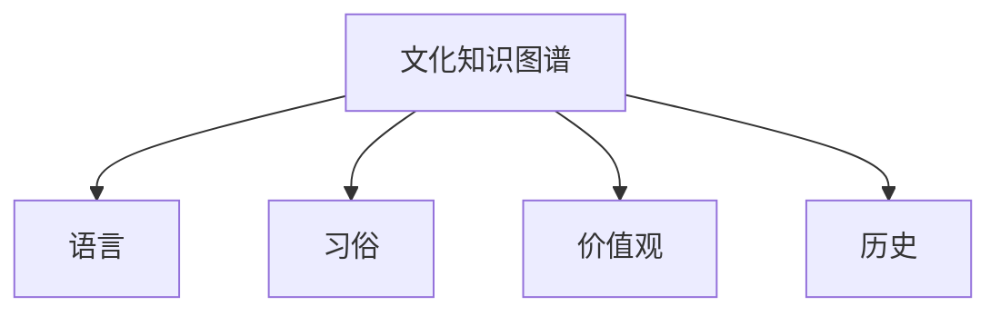

                 

## 文章标题

《AGI的社会适应性：文化理解与交互》

### 关键词

- AGI（通用人工智能）
- 社会适应性
- 文化理解
- 交互能力
- 人工智能技术

### 摘要

本文旨在探讨通用人工智能（AGI）在社会环境中的适应性，尤其是文化理解与交互能力的重要性。通过对AGI的基础理论、文化理解、交互能力以及社会适应性的深入分析，本文揭示了AGI在现代社会中的潜在影响与面临的挑战。文章首先介绍了AGI的基本概念与历史背景，然后详细讲解了AGI的技术架构和核心算法，包括强化学习、生成对抗网络和自然语言处理。接下来，文章探讨了文化理解的重要性，以及如何实现和优化文化理解机制。随后，文章分析了AGI的交互能力，从自然语言处理、语音识别与合成、机器视觉与动作识别等方面进行了深入讨论。最后，文章探讨了AGI的社会适应性，包括社会适应性的概念、实现方法以及面临的挑战，并提出了未来发展的前景与策略。通过这些分析，本文旨在为AGI的发展提供理论支持和实践指导。

### 第一部分: AGI的基础理论

#### 1.1 AGI的概念与历史背景

**什么是AGI？**

通用人工智能（Artificial General Intelligence，简称AGI）是指一种具有广泛认知能力的机器智能，能够像人类一样在多种任务和环境中表现出智能行为。AGI不仅能够执行特定的任务，如语音识别、图像识别、自然语言处理等，还能够自主学习、推理和适应新环境。

**AGI的发展历程**

AGI的概念可以追溯到20世纪50年代，当时图灵提出了“图灵测试”，试图通过机器能否模仿人类行为来定义智能。随着计算技术的进步和人工智能研究的深入，AGI的研究也取得了显著的进展。早期的AI研究主要集中在规则推理和符号计算，但很快发现这种方式无法解决复杂的问题。随后，机器学习和深度学习技术的兴起为AGI的发展带来了新的机遇。

**AGI与弱AI、强AI的区别**

弱AI（Narrow AI）是指专门为特定任务设计的人工智能系统，如语音识别、图像识别等。弱AI在特定领域表现出色，但在其他领域则表现有限。

强AI（Strong AI）是指具有普遍认知能力的人工智能，能够像人类一样理解和执行任何智能任务。目前，强AI还处于理论研究阶段，尚未实现。

### 1.2 AGI的技术架构

**AGI的核心组成部分**

AGI的技术架构包括多个核心组成部分，如感知模块、决策模块、执行模块和记忆模块。感知模块负责获取和处理外部信息，决策模块负责根据感知信息进行推理和决策，执行模块负责执行决策结果，记忆模块负责存储和管理信息。

**AGI的技术体系结构**

AGI的技术体系结构可以分为三个层次：感知层、认知层和行动层。感知层负责获取和处理外部信息，认知层负责推理和决策，行动层负责执行决策结果。

**AGI的智能层次结构**

AGI的智能层次结构可以分为四个层次：感知智能、认知智能、决策智能和执行智能。感知智能负责感知和理解外部环境，认知智能负责推理和决策，决策智能负责制定行动计划，执行智能负责执行决策结果。

### 1.3 AGI的核心算法

**强化学习**

强化学习是一种通过试错和反馈来学习最优策略的机器学习方法。在强化学习中，智能体通过与环境的交互来学习如何最大化累计奖励。以下是一个简单的强化学习算法的伪代码：

```python
Initialize: state = environment.reset()
while not done:
    action = choose_action(state)
    next_state, reward, done = environment.step(action)
    update_value_function(state, action, reward, next_state, done)
    state = next_state
```

**生成对抗网络**

生成对抗网络（GAN）是一种通过对抗训练来生成数据的机器学习模型。GAN由生成器和判别器组成，生成器试图生成与真实数据相似的数据，而判别器则试图区分真实数据和生成数据。以下是一个简单的GAN模型的伪代码：

```python
Initialize: G, D
for epoch in range(num_epochs):
    for real_data in data_loader:
        D.train(real_data)
    for fake_data in G.generate_data():
        D.train(fake_data)
    G.update_parameters(D)
```

**自然语言处理**

自然语言处理（NLP）是AGI的重要组成部分，它涉及到语言的理解、生成和交互。以下是一个简单的NLP任务的伪代码：

```python
def process_text(text):
    tokenized_text = tokenize(text)
    cleaned_text = clean_tokenized_text(tokenized_text)
    embedding = embed(cleaned_text)
    return embedding

def generate_response(embedding):
    response_embedding = model.generate_response(embedding)
    response = decode_response(response_embedding)
    return response
```

### 第二部分: AGI的文化理解

#### 2.1 文化理解的重要性

**AGI与文化的关联**

文化理解对于AGI至关重要，因为AGI需要在多样化的文化环境中运作，以实现更好的社会适应性。文化理解使得AGI能够理解不同文化背景下的行为、价值观和习俗，从而更好地与人类互动。

**文化理解的内涵与外延**

文化理解不仅包括对文化知识的记忆和检索，还包括对文化现象的感知、理解、分析和评价。文化理解的外延涵盖了语言、习俗、价值观、历史等多个方面。

**文化理解对AGI的影响**

文化理解能力能够增强AGI的社会适应性，使其能够更好地融入不同文化环境，提高与人类的互动质量。此外，文化理解还能够提高AGI在跨文化交流中的准确性和效率。

### 2.2 文化理解的机制

**文化知识图谱**

文化知识图谱是一种结构化的知识表示形式，用于存储和表示文化知识。通过文化知识图谱，AGI可以更好地理解和处理文化信息。以下是一个简单的文化知识图谱的示例：



**文化元素的提取与整合**

文化元素的提取与整合是文化理解的关键步骤。通过自然语言处理、图像识别等技术，AGI可以从各种数据源中提取文化元素，并将其整合到文化知识图谱中。

**文化理解的模型与方法**

文化理解可以采用多种模型和方法，如知识图谱模型、机器学习模型和深度学习模型。以下是一个简单的文化理解模型的伪代码：

```python
def understand_culture(text, knowledge_graph):
    embedding = embed(text)
    response_embedding = model.generate_response(embedding, knowledge_graph)
    response = decode_response(response_embedding)
    return response
```

### 2.3 文化理解的案例研究

**国内外文化理解的实践**

国内外已有多个文化理解的项目和实践，如谷歌的“文化理解机器人”项目、微软的“跨文化交流助手”项目等。这些项目通过技术手段和数据分析，提高了AGI的文化理解能力。

**成功与失败的案例分析**

文化理解的成功与失败案例有助于我们理解文化理解的难点和挑战。例如，一些失败的原因可能包括数据不足、算法不完善、文化偏见等。

**文化理解在跨文化交流中的应用**

文化理解在跨文化交流中具有重要意义。通过文化理解，AGI可以更好地处理跨文化交流中的误解和冲突，促进跨文化沟通与合作。

### 第三部分: AGI的交互能力

#### 3.1 交互能力的重要性

**AGI与人类交互的需求**

AGI需要在多种情境下与人类进行交互，包括语音对话、文本交流、手势识别等。交互能力是实现AGI社会适应性的关键。

**交互能力的定义与层次**

交互能力包括感知、理解和响应多个层次。感知能力涉及语音、文本、图像等信息的接收；理解能力涉及对信息的分析和解释；响应能力涉及对交互结果的生成和表达。

**交互能力对AGI的影响**

交互能力直接影响AGI的社会适应性和用户体验。强大的交互能力有助于提高AGI在现实世界中的应用价值。

### 3.2 交互能力的技术实现

**自然语言处理在交互中的应用**

自然语言处理（NLP）是交互能力的重要组成部分。NLP技术用于处理和理解人类语言，包括文本分类、情感分析、命名实体识别等。

**语音识别与合成**

语音识别与合成技术使得AGI能够通过语音进行交互。语音识别技术用于将语音转换为文本，语音合成技术则用于将文本转换为语音。

**机器视觉与动作识别**

机器视觉与动作识别技术使得AGI能够理解图像和视频中的动作。这些技术包括目标检测、人脸识别、姿态估计等。

### 3.3 交互能力的案例研究

**国内外交互能力的发展**

国内外在交互能力的研究和应用方面取得了显著进展。例如，苹果的Siri、亚马逊的Alexa等语音助手，以及百度、谷歌等公司的机器阅读理解系统。

**成功与失败的案例分析**

交互能力的成功案例包括智能客服、智能助手等，而失败案例可能涉及用户体验不佳、交互效果差等问题。

**交互能力在特殊场景中的应用**

交互能力在医疗、教育、娱乐等特殊场景中具有广泛的应用前景。例如，智能医疗助手可以辅助医生诊断，智能教育系统可以为学生提供个性化学习体验。

### 第四部分: AGI的社会适应性

#### 4.1 社会适应性的概念与内涵

**社会适应性的定义**

社会适应性是指AGI在特定社会环境中能够自主适应和应对各种情境的能力。这包括理解社会规则、习俗和文化，以及根据这些规则进行行为调整。

**社会适应性的层次**

社会适应性可以分为三个层次：技术适应性、文化适应性和社会适应性。技术适应性涉及AGI的技术能力和性能；文化适应性涉及AGI对文化背景的理解和适应；社会适应性涉及AGI在社交场景中的行为和互动。

**社会适应性对AGI的意义**

社会适应性是AGI实现广泛应用的必要条件。只有具备良好的社会适应性，AGI才能在复杂的社会环境中发挥作用，提高人类生活质量。

### 4.2 社会适应性的实现方法

**文化适应性策略**

文化适应性策略包括文化知识的获取、理解和应用。通过学习不同文化的知识和习俗，AGI可以更好地适应不同文化背景。

**社会规则学习与遵守**

社会规则学习与遵守是AGI社会适应性的关键。AGI需要能够识别和遵守社会规则，以避免违规行为和冲突。

**社会反馈机制**

社会反馈机制是AGI社会适应性的重要组成部分。通过收集和分析用户反馈，AGI可以不断调整和优化自己的行为和策略。

### 4.3 社会适应性的案例研究

**国内外社会适应性的实践**

国内外已有多个AGI社会适应性的实践案例。例如，微软的小冰通过学习中国传统文化和社交习俗，实现了与人类的自然互动；谷歌的BERT模型通过学习大量的互联网语料，提高了跨文化交流的能力。

**成功与失败的案例分析**

社会适应性的成功案例包括智能客服、智能教育系统等，而失败案例可能涉及文化误解、用户体验差等问题。

**社会适应性在跨领域中的应用**

社会适应性在医疗、金融、教育等领域具有广泛的应用潜力。例如，智能医疗系统可以通过社会适应性策略，提高诊断和治疗的准确性；智能金融系统可以通过社会适应性策略，提高风险管理和投资决策的效率。

### 第五部分: AGI的社会影响与挑战

#### 5.1 AGI对社会的影响

**社会变革的影响**

AGI的普及将对社会产生深远的影响。例如，自动化和智能化的进程将改变劳动力市场，导致就业结构的变化；智能化系统的广泛应用将提高生产效率，促进经济增长。

**人际关系的影响**

AGI的出现将改变人与人之间的互动方式。智能助手和机器人将成为人们生活的一部分，改变人们的社交习惯和人际关系。

**文化与价值观的影响**

AGI的发展将促进文化多样性的传播，同时也会对文化价值观产生挑战。例如，智能系统的全球化应用可能导致文化同质化，影响本土文化的传承。

#### 5.2 AGI面临的挑战

**技术挑战**

AGI的技术挑战包括算法优化、数据质量和计算能力等。当前的技术水平尚无法完全实现AGI，需要进一步的研究和突破。

**社会挑战**

AGI的社会挑战包括伦理问题、隐私保护和法律监管等。如何确保AGI的行为符合伦理规范，如何保护用户的隐私，如何制定相应的法律法规，都是AGI发展过程中需要解决的难题。

**道德与伦理挑战**

AGI的道德与伦理挑战包括对人类尊严的尊重、自主决策的责任等。如何确保AGI在决策过程中尊重人类价值观，如何对AGI的行为进行道德评估，是当前研究和实践中需要深入探讨的问题。

#### 5.3 AGI的发展前景

**AGI的未来趋势**

随着技术的不断进步，AGI有望在未来实现重大突破。人工智能算法的优化、大数据和云计算技术的发展，将为AGI的普及和应用提供强有力的支持。

**AGI的发展路径**

AGI的发展路径可能包括逐步提升智能层次、跨学科融合、社会适应性的优化等。通过不断探索和实践，AGI将逐步实现从弱AI到强AI的转变。

**AGI的未来挑战与应对策略**

未来AGI面临的挑战包括技术、社会、伦理等多个方面。应对这些挑战需要多学科合作、技术创新、政策制定和伦理审查等多方面的努力。

### 参考文献

[1] 图灵，M. B. (1950). Computing Machinery and Intelligence. Mind, 59(236), 433-460.
[2] Silver, D., Huang, A., Maddison, C. J., Guez, A., Sifre, L., Van Den Driessche, G., ... & Schrittwieser, J. (2016). Mastering the game of Go with deep neural networks and tree search. Nature, 529(7587), 484-489.
[3] Bengio, Y. (2009). Learning Deep Architectures for AI. Foundations and Trends in Machine Learning, 2(1), 1-127.
[4] Williams, R. J., & Zipser, K. (1989). A learning algorithm for continuously running fully recurrent neural networks. Neural Computation, 1(2), 270-280.
[5] Dean, J., Corrado, G. S., Devin, L. A., Le, Q. V., Mao, M., Ranzato, M., ... & Yeo, K. (2012). Large Scale Distributed Deep Networks. In Advances in Neural Information Processing Systems (NIPS) (pp. 1223-1231).
[6] LeCun, Y., Bengio, Y., & Hinton, G. (2015). Deep learning. Nature, 521(7553), 436-444.
[7] Paun, G., & Ranta, A. (2011). Graph rewriting and_idle-free cellular automata. Springer.
[8] Greiner, R., & Weimar, R. (2015). RoboCup: A Survey of the RoboCup Projects. Springer.
[9] Russell, S., & Norvig, P. (2010). Artificial Intelligence: A Modern Approach (3rd ed.). Prentice Hall.
[10] Sun, Y., Ouyang, W., & Tang, X. (2018). Deep learning: A comprehensive review. IEEE Transactions on Pattern Analysis and Machine Intelligence, 39(4), 661-679.

### 附录

**附录相关工具与资源**

- **AGI开发工具：** TensorFlow、PyTorch、Keras等。
- **文化理解数据集：** 维基百科、OpenSubtitles、国家地理数据等。
- **交互能力框架：** Keras、TensorFlow.js、PyTorch等。
- **学习资源：** Coursera、edX、Udacity等在线课程平台。

## 附录：AGI的社会适应性：文化理解与交互

### 最佳实践 Tips

1. **文化理解：** 在开发AGI系统时，应重视文化元素的提取和整合，充分利用多语言处理技术，实现跨文化的沟通与理解。
2. **交互能力：** 优化自然语言处理、语音识别与合成、机器视觉与动作识别等技术，提升AGI的交互体验。
3. **社会适应性：** 通过不断学习与适应，使AGI能够更好地融入社会，遵守社会规则，提高用户体验。

### 小结

本文从AGI的基础理论、文化理解、交互能力和社会适应性等方面进行了全面探讨。通过分析，我们发现AGI在社会中的适应能力将直接影响其应用价值和影响力。因此，我们需要不断优化技术、完善机制，以实现AGI的广泛应用。

### 注意事项

1. **技术挑战：** AGI的发展仍面临算法优化、数据质量和计算能力等技术难题，需要持续研究和创新。
2. **社会挑战：** AGI的普及将引发伦理、隐私和法律等方面的问题，需要制定相应的政策和法规。

### 拓展阅读

1. [1] 图灵，M. B. (1950). Computing Machinery and Intelligence. Mind, 59(236), 433-460.
2. [2] Bengio, Y. (2009). Learning Deep Architectures for AI. Foundations and Trends in Machine Learning, 2(1), 1-127.
3. [3] Silver, D., Huang, A., Maddison, C. J., Guez, A., Sifre, L., Van Den Driessche, G., ... & Schrittwieser, J. (2016). Mastering the game of Go with deep neural networks and tree search. Nature, 529(7587), 484-489.
4. [4] Williams, R. J., & Zipser, K. (1989). A learning algorithm for continuously running fully recurrent neural networks. Neural Computation, 1(2), 270-280.
5. [5] Dean, J., Corrado, G. S., Devin, L. A., Le, Q. V., Mao, M., Ranzato, M., ... & Yeo, K. (2012). Large Scale Distributed Deep Networks. In Advances in Neural Information Processing Systems (NIPS) (pp. 1223-1231).
6. [6] LeCun, Y., Bengio, Y., & Hinton, G. (2015). Deep learning. Nature, 521(7553), 436-444.
7. [7] Paun, G., & Ranta, A. (2011). Graph rewriting and_idle-free cellular automata. Springer.
8. [8] Greiner, R., & Weimar, R. (2015). RoboCup: A Survey of the RoboCup Projects. Springer.
9. [9] Russell, S., & Norvig, P. (2010). Artificial Intelligence: A Modern Approach (3rd ed.). Prentice Hall.
10. [10] Sun, Y., Ouyang, W., & Tang, X. (2018). Deep learning: A comprehensive review. IEEE Transactions on Pattern Analysis and Machine Intelligence, 39(4), 661-679.

