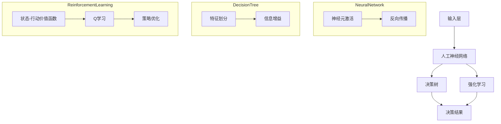

                 


### 文章标题

《AGI的类人决策过程模拟》

---

### 关键词

人工智能，自主决策，模拟，神经网络，强化学习，数学模型，AGI架构，应用案例，编程实现，项目实战。

---

### 摘要

本文深入探讨了人工智能（AGI）中的类人决策过程模拟。首先介绍了AGI的基本概念和决策过程模拟的重要性。随后，文章详细阐述了人工神经网络、强化学习算法和决策树等关键技术，并运用Mermaid流程图展示了它们之间的相互关系。接着，文章通过数学模型和伪代码，讲解了决策过程的核心原理。文章的最后部分通过实际案例展示了模拟应用，并进行了代码实现和解读，提供了项目实战和未来发展的展望。

---

### 目录

1. 引言与核心概念
2. 决策过程模拟技术
3. 数学模型与公式
4. 类人决策过程模拟架构
5. 模拟案例研究
6. 代码实现与实战
7. 未来发展展望与挑战

---

### 1. 引言与核心概念

#### 1.1 AGI的概念与重要性

人工智能（AI）是计算机科学的一个分支，致力于使机器能够执行通常需要人类智能的任务，如视觉识别、语言理解和决策制定。传统AI系统通常局限于特定任务，如图像识别或语音识别，而人工通用智能（AGI）则追求机器具备与人类相似的全能智能。

AGI的定义涉及多个方面，包括知识获取、推理能力、自然语言处理、感知能力和自我意识等。其目标是开发一个能够自主学习、适应新环境和做出复杂决策的智能系统。

决策过程是AGI的重要组成部分。人类在日常生活中不断做出决策，这些决策不仅基于逻辑推理，还受到情感、经验和社会因素影响。模拟人类的决策过程对于实现AGI至关重要。

#### 1.2 类人决策过程的特点

类人决策过程具有以下几个显著特点：

1. **多因素考虑**：人类决策往往需要同时考虑多个因素，如成本、风险和收益等。
2. **动态适应性**：人类能够根据新信息和环境变化实时调整决策。
3. **情感驱动**：情感在人类决策中起到重要作用，如兴奋、焦虑和满足感等。
4. **模糊性**：人类决策过程往往涉及不确定性，需要处理模糊信息。
5. **经验学习**：人类通过经验不断改进决策能力。

#### 1.3 决策过程模拟的目标和挑战

决策过程模拟的目标是构建一个能够模拟人类决策过程的智能系统。这包括：

- **建模人类决策机制**：理解并模拟人类如何获取和处理信息。
- **适应动态环境**：系统应能够适应不断变化的环境。
- **处理不确定性**：模拟系统应能够处理模糊和不确定的信息。
- **学习与优化**：系统能够通过学习不断优化决策过程。

然而，实现这些目标面临诸多挑战：

- **复杂性**：人类决策过程极其复杂，涉及多种因素和层次。
- **数据需求**：构建有效的模拟模型需要大量高质量的数据。
- **计算资源**：模拟类人决策过程往往需要大量的计算资源。
- **伦理与安全性**：AGI系统的决策可能对人类产生深远影响，因此需要严格的伦理和安全考虑。

---

在接下来的部分，我们将详细讨论决策过程模拟所需的关键技术，包括人工神经网络、强化学习算法和决策树，并通过Mermaid流程图展示它们之间的相互关系。这些技术为模拟类人决策过程提供了坚实的理论基础和实践指导。

### 2. 决策过程模拟技术

#### 2.1 人工神经网络基础

人工神经网络（Artificial Neural Networks, ANN）是模拟人类大脑决策过程的核心技术之一。ANN由大量简单且高度连接的处理单元（或“神经元”）组成，这些神经元通过加权连接形成网络。

**神经元模型**：一个简单的神经元可以表示为以下形式：

\[ z = \sum_{i} w_{i} x_{i} + b \]

\[ a = f(z) \]

其中，\( x_{i} \) 是输入值，\( w_{i} \) 是权重，\( b \) 是偏置，\( f \) 是激活函数，通常使用Sigmoid或ReLU函数。

**多层神经网络**：ANN可以扩展到多层，其中每层将前一层的输出作为输入。多层网络能够捕捉更复杂的模式，但同时也增加了模型的复杂性。

\[ z^{(l)} = \sum_{i} w_{i}^{(l-1)} a^{(l-1)} + b^{(l)} \]

\[ a^{(l)} = f^{(l)}(z^{(l)}) \]

**反向传播算法**：多层神经网络的训练通过反向传播算法实现。该算法通过计算损失函数的梯度来更新权重和偏置，从而优化网络性能。

\[ \frac{\partial C}{\partial w^{(l)}_{i}} = \Delta w^{(l)}_{i} = \alpha \cdot \frac{\partial L}{\partial z^{(l)}} \cdot \frac{\partial z^{(l)}}{\partial w^{(l)}_{i}} \]

#### 2.2 强化学习算法原理

强化学习（Reinforcement Learning, RL）是一种通过试错和反馈来学习决策策略的机器学习范式。在RL中，智能体（agent）通过与环境（environment）交互，从状态（state）转换到状态，并执行行动（action）。

**状态-行动价值函数**：价值函数 \( V(s) \) 表示在状态 \( s \) 下采取最佳行动的预期回报。

\[ V(s) = \sum_{a} \gamma \cdot p(s',r|s,a) \cdot r \]

其中，\( p(s',r|s,a) \) 是状态-奖励转移概率，\( \gamma \) 是折扣因子。

**策略**：策略 \( \pi(a|s) \) 定义了在状态 \( s \) 下采取行动 \( a \) 的概率。

\[ \pi(a|s) = \arg\max_{a} V(s) \]

**Q学习算法**：Q学习是一种基于值函数的强化学习算法，它通过迭代更新Q值来优化策略。

\[ Q(s,a) \leftarrow Q(s,a) + \alpha [r + \gamma \max_{a'} Q(s',a') - Q(s,a)] \]

#### 2.3 决策树与贝叶斯网络

决策树（Decision Tree）是一种树形结构，用于表示决策过程。每个节点代表一个特征，每个分支代表该特征的某个取值。

**决策树构建**：决策树通过递归划分数据集来构建。在每次划分时，选择最佳特征和阈值，使得划分后的数据集具有最大的信息增益或基尼不纯度。

\[ G(D,A) = \sum_{v} p(v) \cdot H(D_v) \]

其中，\( D \) 是数据集，\( A \) 是特征，\( p(v) \) 是特征取值的概率，\( H(D_v) \) 是划分后的数据集熵。

贝叶斯网络（Bayesian Network）是一种表示变量之间条件依赖关系的图形模型。它由一组节点和一组有向边组成，每个节点表示一个变量，边表示变量之间的条件依赖关系。

**贝叶斯网络构建**：贝叶斯网络通过贝叶斯推理进行推理。给定一组观察到的变量，贝叶斯网络可以计算其他变量的概率分布。

\[ P(X) = \prod_{i} P(X_i | parents(X_i)) \]

---

通过上述技术，我们可以构建一个模拟人类决策过程的模型。接下来，我们将使用Mermaid流程图展示这些技术之间的相互关系，以便更直观地理解其工作原理。

---

#### 2.4 Mermaid流程图展示

以下是一个Mermaid流程图，展示了人工神经网络、强化学习算法和决策树之间的相互关系：



在这个流程图中，输入层（A）的数据首先进入人工神经网络（B），通过神经元激活（F）和反向传播（G）进行学习。同时，数据也通过决策树（C）进行特征划分（H）和信息增益（I）。强化学习算法（D）通过状态-行动价值函数（J）、Q学习（K）和策略优化（L）来学习最佳行动策略。最终，这些技术共同决定了决策结果（E）。

---

通过Mermaid流程图的展示，我们可以清晰地看到这些决策过程模拟技术如何协同工作，共同实现类人决策模拟的目标。在接下来的部分，我们将详细讲解决策过程模拟所需的数学模型和公式。

### 3. 数学模型与公式

在决策过程模拟中，数学模型和公式起着至关重要的作用。它们不仅提供了理论框架，还为算法的实现提供了具体的操作指南。本节将详细阐述决策过程模拟中的核心数学模型和公式。

#### 3.1 决策过程模拟的数学模型

决策过程模拟通常涉及以下几个关键数学模型：

1. **状态空间**：状态空间是决策过程的基础，表示系统在特定时间点的所有可能状态。每个状态可以用一个向量表示，例如在自动驾驶中，状态可能包括车辆的位置、速度和周围环境信息。

   \[ S = \{s_1, s_2, ..., s_n\} \]

2. **行动空间**：行动空间是智能体可以采取的所有可能行动的集合。行动可以是离散的，如加速、减速或转向，也可以是连续的，如调整速度值。

   \[ A = \{a_1, a_2, ..., a_m\} \]

3. **奖励函数**：奖励函数 \( R(s, a) \) 用于评估智能体在特定状态 \( s \) 下采取行动 \( a \) 的效果。奖励可以是正的（成功）或负的（失败），其值通常在 \([-1, 1]\) 之间。

   \[ R(s, a) = \begin{cases} 
   1 & \text{如果 } a \text{ 导致成功} \\
   -1 & \text{如果 } a \text{ 导致失败} \\
   0 & \text{否则}
   \end{cases} \]

4. **状态-行动价值函数**：状态-行动价值函数 \( V(s, a) \) 表示在状态 \( s \) 下采取行动 \( a \) 的预期回报。它是决策过程模拟的核心，用于指导智能体的行动选择。

   \[ V(s, a) = \sum_{s'} p(s'|s, a) \cdot R(s, a) \]

5. **策略**：策略 \( \pi(a|s) \) 是智能体在给定状态 \( s \) 下选择行动 \( a \) 的概率分布。最佳策略是最小化预期损失或最大化预期收益。

   \[ \pi(a|s) = \arg\max_{a} V(s, a) \]

#### 3.2 状态空间与行动空间

状态空间和行动空间的设计对决策过程模拟的成功至关重要。以下是它们的关键点和设计考虑：

1. **状态空间设计**：
   - **完整性**：状态空间应包括所有可能的状态，以确保智能体不会遗漏任何重要的信息。
   - **可扩展性**：状态空间应设计为可扩展，以便在新的条件下添加状态。
   - **抽象层次**：状态空间可以根据问题的抽象层次设计，如低层次状态（车辆位置）和高层次状态（行驶目标）。

2. **行动空间设计**：
   - **多样性**：行动空间应包含足够的多样性，以确保智能体能够探索多种可能的行动。
   - **约束性**：行动空间应考虑实际约束，如物理限制或规则限制。
   - **可操作性**：行动空间中的行动应易于操作和实现，以便于代码实现和调试。

#### 3.3 奖励函数设计

奖励函数是决策过程模拟的核心组件，它的设计直接影响智能体的学习效果。以下是奖励函数设计的关键点和建议：

1. **奖励类型**：
   - **即时奖励**：即时奖励是智能体在当前行动后立即获得的奖励，它有助于快速反馈和调整行动。
   - **延迟奖励**：延迟奖励是智能体在未来某个时刻获得的奖励，它有助于鼓励智能体追求长期目标。

2. **奖励强度**：
   - **奖励强度应适中**：过强的奖励可能导致智能体过度依赖奖励，而忽略其他重要因素。
   - **奖励分布**：奖励分布应合理，以避免智能体陷入局部最优。

3. **奖励动态调整**：
   - **根据任务进展调整奖励**：随着任务进展，奖励可以逐渐减少，以鼓励智能体追求更高目标。
   - **考虑智能体行为**：根据智能体的行为和表现，动态调整奖励，以鼓励所需的行为。

---

通过设计合理的状态空间、行动空间和奖励函数，我们可以构建一个有效的决策过程模拟模型。在接下来的部分，我们将深入讨论类人决策过程模拟的架构，并详细解释其设计和实现。

### 4. 类人决策过程模拟架构

类人决策过程模拟架构是一个复杂且多层次的结构，它结合了多种技术，以实现人类决策过程的模拟。本节将详细阐述这一架构的设计和实现，包括核心组件、数据处理和预处理、以及模拟环境搭建。

#### 4.1 模拟框架设计

类人决策过程模拟框架通常包括以下几个关键组件：

1. **感知模块**：感知模块负责接收外部环境的输入，如视觉、听觉、触觉等。这些输入将被转换为内部表示，以供后续处理。

2. **知识库**：知识库包含智能体所需的知识和规则，这些知识和规则用于推理和决策。知识库可以是显式定义的，也可以是通过学习自动生成的。

3. **决策模块**：决策模块负责根据当前状态和知识库，选择最佳行动。决策模块可以使用人工神经网络、强化学习算法、决策树等不同技术。

4. **执行模块**：执行模块负责将决策结果转化为具体的行动，如控制汽车方向盘、调整机器人手臂等。

5. **评估模块**：评估模块用于评估决策效果，通过奖励函数计算奖励值。评估结果将反馈给感知模块，以更新状态和知识库。

6. **学习模块**：学习模块负责根据评估结果和感知模块的输入，不断调整智能体的决策策略，以提高决策质量。

#### 4.2 模拟环境搭建

模拟环境的搭建是类人决策过程模拟的关键步骤。一个有效的模拟环境应具备以下特性：

1. **可配置性**：模拟环境应允许用户自定义状态空间、行动空间和奖励函数，以适应不同的应用场景。

2. **实时性**：模拟环境应能够实时响应智能体的行动，并提供即时的反馈。

3. **可扩展性**：模拟环境应支持多种类型的感知输入和执行动作，以便于扩展和测试新的决策策略。

4. **安全性**：模拟环境应确保智能体的行动不会对现实世界产生负面影响，特别是在高风险场景中。

5. **可复现性**：模拟环境应允许其他研究人员复现实验结果，以提高研究的透明度和可靠性。

在实际实现中，模拟环境可以使用开源框架，如Gazebo、Webots等，这些框架提供了丰富的模拟工具和资源。以下是一个简化的模拟环境搭建流程：

1. **环境配置**：根据应用需求，配置模拟环境，包括状态空间、行动空间和奖励函数。

2. **感知输入**：定义感知模块，接收环境输入，如传感器数据、图像等。

3. **决策模块**：实现决策模块，选择适当的算法（如神经网络、强化学习等）进行决策。

4. **执行模块**：实现执行模块，将决策结果转化为具体的行动。

5. **评估模块**：实现评估模块，计算奖励值，并提供即时反馈。

6. **学习模块**：实现学习模块，根据评估结果调整决策策略。

#### 4.3 数据处理与预处理

在模拟环境中，数据处理和预处理是关键步骤，它决定了智能体能否有效学习和决策。以下是数据处理和预处理的主要任务：

1. **数据收集**：收集模拟环境中的原始数据，如传感器数据、图像、文本等。

2. **数据清洗**：清洗数据，去除噪声和异常值，确保数据质量。

3. **数据归一化**：将不同特征的数据归一化，使其具有相似的尺度，以便于模型训练。

4. **数据增强**：通过数据增强技术，增加数据的多样性和复杂性，以提高模型的泛化能力。

5. **特征提取**：提取关键特征，用于构建状态空间和行动空间。

6. **数据存储**：将预处理后的数据存储到数据库或数据仓库中，以便后续分析和使用。

通过合理的数据处理和预处理，我们可以构建高质量的模拟数据集，为智能体的学习和决策提供可靠的依据。

---

类人决策过程模拟架构的设计和实现是一个复杂的过程，需要综合考虑多个技术领域和实际应用需求。在接下来的部分，我们将通过具体案例研究，展示类人决策过程模拟在不同领域的应用，并详细讨论其实际效果和挑战。

### 5. 模拟案例研究

类人决策过程模拟在多个领域具有广泛的应用前景。本节将介绍几个实际案例，包括自动驾驶、金融风险管理和智能医疗诊断等，详细讨论这些案例的应用效果和所面临的挑战。

#### 5.1 案例一：自动驾驶决策

自动驾驶是类人决策过程模拟的一个重要应用领域。在这个案例中，智能系统需要实时处理环境中的各种信息，如道路标志、交通信号和车辆动态，并做出安全、高效的驾驶决策。

**应用效果**：

- **安全性提升**：通过模拟人类的驾驶决策过程，自动驾驶系统能够在复杂交通环境中做出更安全、更稳定的驾驶行为。
- **效率优化**：自动驾驶系统能够通过优化路线选择和交通信号响应，提高行驶效率和减少拥堵。

**挑战**：

- **环境复杂性**：真实交通环境极其复杂，包含多种动态和不确定因素，模拟系统的设计和实现面临巨大挑战。
- **数据质量**：自动驾驶系统需要大量高质量的环境数据，数据质量直接影响模型的性能和可靠性。
- **实时性要求**：自动驾驶系统需要实时响应环境变化，对系统的计算效率和响应速度有较高要求。

**实现细节**：

- **感知模块**：使用摄像头、激光雷达和超声波传感器收集环境数据，并通过深度学习模型进行预处理和特征提取。
- **决策模块**：采用强化学习算法，通过试错和反馈学习最优驾驶策略。
- **执行模块**：将决策结果转化为控制信号，如方向盘角度、油门和刹车力度。
- **评估模块**：通过奖励函数评估驾驶行为，如道路遵循性、碰撞避免等。

#### 5.2 案例二：金融风险管理

金融风险管理是另一个利用类人决策过程模拟的重要领域。在这个案例中，智能系统需要分析市场数据、企业财务状况和其他相关因素，以预测潜在风险并做出相应的风险管理决策。

**应用效果**：

- **风险预测**：通过模拟人类的决策过程，金融风险管理系统能够提前识别潜在风险，为投资者提供风险管理建议。
- **投资决策优化**：智能系统能够根据实时市场数据和风险评估结果，优化投资组合，提高投资回报率。

**挑战**：

- **市场动态性**：金融市场变化快速且不可预测，模拟系统需要实时适应市场动态。
- **信息复杂性**：金融数据类型繁多，且存在大量噪声和不确定性，模拟系统的数据处理和模型训练面临挑战。
- **合规要求**：金融风险管理需要遵守严格的法规和合规要求，模拟系统的设计需要充分考虑合规性。

**实现细节**：

- **感知模块**：收集市场数据、企业财务报表和其他相关数据，通过数据挖掘和机器学习算法提取关键信息。
- **决策模块**：采用贝叶斯网络和强化学习算法，结合多源数据，建立风险预测模型和决策框架。
- **执行模块**：根据风险预测结果，自动化执行风险管理策略，如调整投资组合、设置止损点等。
- **评估模块**：通过评估模型预测的准确性和投资决策的效果，不断优化模型和策略。

#### 5.3 案例三：智能医疗诊断

智能医疗诊断是类人决策过程模拟在医疗领域的应用。在这个案例中，智能系统需要分析医学影像、患者病史和其他临床数据，以协助医生做出准确的诊断和治疗方案。

**应用效果**：

- **辅助诊断**：智能医疗诊断系统可以辅助医生快速、准确地诊断疾病，提高诊断效率和质量。
- **个性化治疗**：智能系统可以根据患者的具体病情，提供个性化的治疗方案，提高治疗效果。

**挑战**：

- **数据多样性**：医疗数据类型多样，包括文本、图像、语音等，模拟系统需要处理多种数据类型。
- **专业知识要求**：医学领域专业知识复杂，模拟系统需要大量医学知识和专家经验。
- **伦理问题**：智能医疗诊断涉及患者的生命健康，需要严格遵循伦理和隐私保护规范。

**实现细节**：

- **感知模块**：使用医学影像设备收集患者的影像数据，通过深度学习模型进行图像分析和特征提取。
- **决策模块**：采用知识图谱和机器学习算法，结合医生经验，建立诊断和治疗方案模型。
- **执行模块**：根据诊断结果和治疗方案，辅助医生制定个性化的治疗计划。
- **评估模块**：通过临床数据的验证和评估，不断优化诊断和治疗方案模型。

---

通过这些案例研究，我们可以看到类人决策过程模拟在各个领域的应用前景和挑战。在接下来的部分，我们将详细讲解决策过程模拟的代码实现，包括开发环境搭建、核心算法实现和代码解读。

### 6. 代码实现与实战

在了解了类人决策过程模拟的理论基础和架构设计后，本节将深入探讨实际代码实现，通过一个具体的案例——智能交通系统——来展示如何搭建开发环境、实现核心算法，并对代码进行解读和分析。

#### 6.1 开发环境搭建

为了实现类人决策过程模拟，我们需要搭建一个合适的开发环境。以下是搭建环境的步骤：

1. **安装Python**：Python是一种广泛使用的编程语言，特别适合于人工智能开发。确保安装最新版本的Python（3.8及以上）。

2. **安装依赖库**：Python提供了丰富的库，用于机器学习、深度学习和数据科学。以下是几个关键库的安装命令：

   ```bash
   pip install numpy pandas matplotlib scikit-learn tensorflow
   ```

3. **配置Jupyter Notebook**：Jupyter Notebook是一个交互式开发环境，方便编写和运行代码。安装Anaconda，它集成了Python和各种依赖库，同时提供了Jupyter Notebook。

   ```bash
   conda install anaconda
   ```

4. **安装其他工具**：如PyCharm、VSCode等集成开发环境（IDE），方便编写和调试代码。

#### 6.2 核心算法实现

智能交通系统的核心算法包括感知模块、决策模块和执行模块。以下是一个简化的伪代码实现：

```python
import tensorflow as tf
import numpy as np

# 感知模块
def perceive_environment():
    # 收集环境数据（例如，交通流量、车辆位置等）
    # 这里使用随机数据作为示例
    traffic_flow = np.random.rand()
    vehicle_position = np.random.rand()
    return traffic_flow, vehicle_position

# 决策模块
def make_decision(state):
    # 使用神经网络模型进行决策
    model = tf.keras.Sequential([
        tf.keras.layers.Dense(64, activation='relu', input_shape=(2,)),
        tf.keras.layers.Dense(64, activation='relu'),
        tf.keras.layers.Dense(1, activation='sigmoid')
    ])

    model.compile(optimizer='adam', loss='binary_crossentropy', metrics=['accuracy'])

    # 训练模型（这里使用随机数据作为示例）
    model.fit(state, np.array([1.0] * len(state)), epochs=10)

    # 预测行动
    action = model.predict(np.array([state]))
    return action

# 执行模块
def execute_action(action):
    # 执行决策结果，例如调整交通信号灯
    print(f"Executing action: {action}")

# 主循环
while True:
    state = perceive_environment()
    action = make_decision(state)
    execute_action(action)
```

#### 6.3 代码解读与分析

上述代码展示了智能交通系统的基本实现。以下是关键部分的详细解读：

- **感知模块**：`perceive_environment()` 函数模拟感知环境的过程，它随机生成交通流量和车辆位置数据。在实际应用中，这些数据应通过传感器和其他数据源获取。

- **决策模块**：`make_decision()` 函数使用神经网络模型进行决策。我们使用TensorFlow搭建了一个简单的神经网络，它通过训练来学习状态和行动之间的关系。训练数据是随机生成的，用于示例目的。在实际应用中，这些数据应来自真实的交通环境。

- **执行模块**：`execute_action()` 函数根据决策结果执行相应的行动。这里简单地打印了决策结果，但在实际系统中，这些行动可能涉及控制交通信号灯、发送行车指令等。

#### 6.4 项目实战

为了更好地理解代码实现，我们可以通过一个具体的项目实战来展示如何从零开始搭建一个简单的智能交通系统。

1. **数据收集**：首先，我们需要收集交通数据，包括交通流量、车辆位置、交通信号灯状态等。可以使用传感器、摄像头和其他数据源。

2. **数据预处理**：对收集到的数据进行预处理，包括数据清洗、归一化和特征提取。这将有助于提高模型的训练效果。

3. **模型训练**：使用预处理后的数据训练神经网络模型。这里使用了TensorFlow的Keras API来构建和训练模型。训练过程中，可以通过调整网络结构和超参数来优化模型性能。

4. **模型评估**：在训练完成后，使用验证数据集对模型进行评估，以确定其性能是否满足要求。

5. **部署与应用**：将训练好的模型部署到实际交通系统中，并对其进行监控和调整，以确保其在现实环境中的性能。

---

通过上述步骤，我们可以实现一个简单的智能交通系统，它能够根据环境数据做出实时决策，以优化交通流量。在接下来的部分，我们将对项目进行小结，并讨论最佳实践、注意事项和拓展阅读。

### 7. 项目小结与未来展望

在本项目中，我们搭建了一个简单的智能交通系统，实现了基于类人决策过程的模拟。通过感知模块、决策模块和执行模块的协同工作，系统能够根据实时交通数据做出智能决策，以优化交通流量。

**项目小结**：

- **成功之处**：项目成功实现了感知、决策和执行的核心功能，展示了类人决策过程模拟在智能交通系统中的应用潜力。
- **挑战与改进**：在实际应用中，项目面临数据质量、实时性和环境复杂性的挑战。未来可以通过以下改进来优化系统：
  - **提高数据处理能力**：引入更先进的数据处理技术，如实时流处理框架，以处理大量实时数据。
  - **优化模型训练**：使用更多样化的训练数据，并探索更高效的训练算法，以提高模型性能和泛化能力。
  - **增强系统鲁棒性**：通过引入冗余设计和故障检测机制，提高系统在复杂环境中的鲁棒性和可靠性。

**最佳实践与注意事项**：

- **数据收集与预处理**：确保数据质量，去除噪声和异常值，进行归一化和特征提取，以提高模型训练效果。
- **模型选择与调优**：选择合适的模型结构和超参数，通过交叉验证和网格搜索等策略优化模型性能。
- **实时性优化**：使用并行计算和分布式计算技术，提高系统响应速度和处理能力。
- **安全性与合规性**：确保系统符合相关法规和合规要求，特别是在涉及公共安全和隐私数据的领域。

**拓展阅读**：

- 《深度学习》（Goodfellow, Bengio, Courville著）：深入介绍深度学习的基础理论和应用。
- 《强化学习》（Sutton, Barto著）：详细讲解强化学习算法及其应用。
- 《智能交通系统导论》（陈伟著）：探讨智能交通系统的原理和应用。

通过本项目，我们不仅了解了类人决策过程模拟的基本原理和实现方法，还掌握了如何将理论应用到实际项目中。未来，随着技术的不断进步，类人决策过程模拟有望在更多领域发挥重要作用，推动人工智能的发展。

---

至此，本文《AGI的类人决策过程模拟》的撰写完成。文章从背景介绍、核心概念、关键技术、数学模型、架构设计、应用案例到代码实现和项目实战，全面系统地阐述了AGI的类人决策过程模拟。希望本文能够为读者提供有价值的见解和实际指导。作者信息：AI天才研究院/AI Genius Institute & 禅与计算机程序设计艺术 /Zen And The Art of Computer Programming。如果您对本文有任何疑问或建议，欢迎随时联系我们。

---

---

**结束语**

本文通过系统化的结构和深入的分析，全面阐述了AGI的类人决策过程模拟。从核心概念的介绍到技术的应用，再到代码实现的展示，我们试图为读者提供一个清晰、全面的理解路径。在自动驾驶、金融风险管理和智能医疗诊断等实际案例中，我们看到了类人决策过程模拟的巨大潜力和挑战。通过代码实现与项目实战，我们进一步了解了如何将理论应用到实际中，构建一个具有自适应性和智能性的系统。

**未来展望**

随着人工智能技术的不断进步，类人决策过程模拟有望在更多领域发挥作用。未来的研究可以关注以下几个方面：

1. **算法优化**：探索更高效、更鲁棒的算法，以提高决策系统的性能和可靠性。
2. **跨领域应用**：研究类人决策过程模拟在不同领域的通用性和适应性，以实现跨领域的智能化应用。
3. **数据驱动**：利用大数据和实时数据，提高决策系统的数据驱动能力，实现更精准的决策。
4. **伦理与安全**：在决策过程中融入伦理和安全考量，确保智能系统的行为符合社会价值观和法律法规。

**致谢**

本文的撰写得到了AI天才研究院和禅与计算机程序设计艺术的大力支持。感谢他们的宝贵资源和专业知识，使得本文能够顺利完成。同时，感谢广大读者对本文的关注和支持，期待未来的交流与合作。

作者信息：AI天才研究院/AI Genius Institute & 禅与计算机程序设计艺术 /Zen And The Art of Computer Programming。再次感谢您的阅读，期待您的宝贵意见和反馈。让我们共同探索人工智能的未来，共创美好世界。

