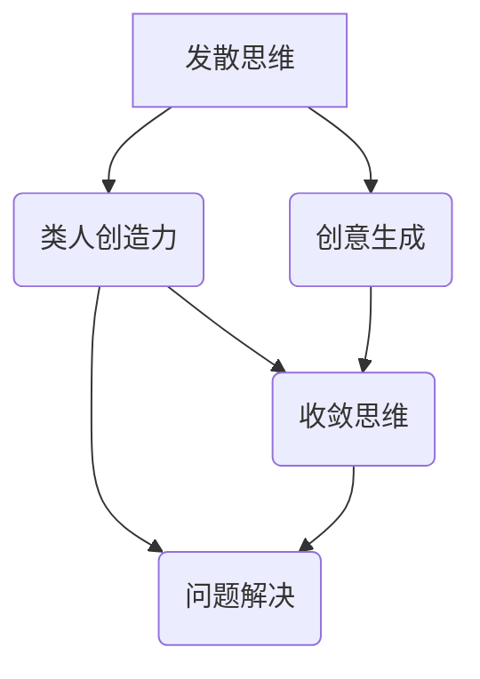
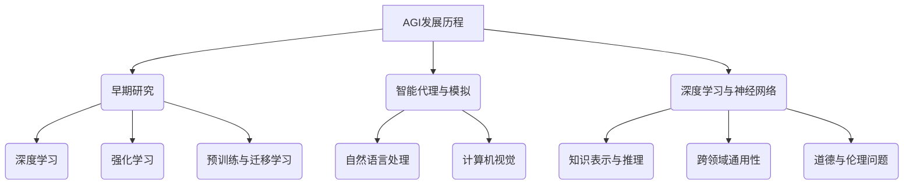
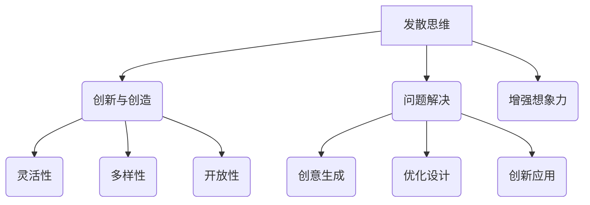
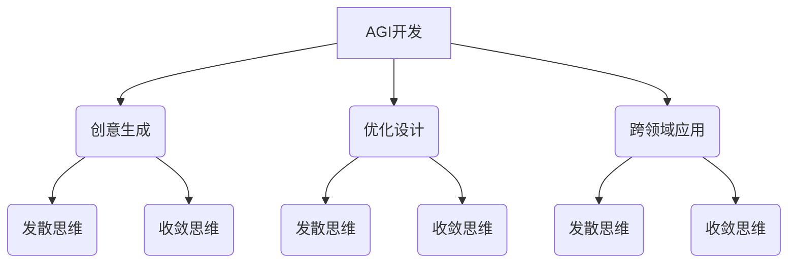
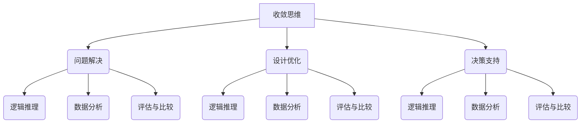
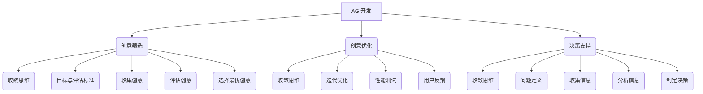
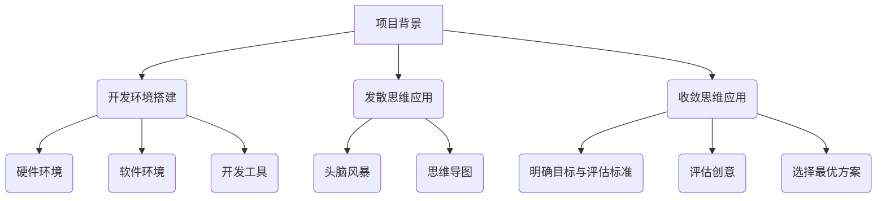
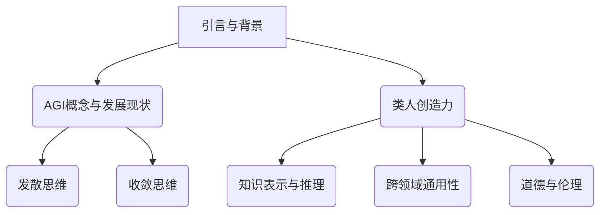

                 


### 第1章: 引言与背景

> 关键词：AGI、类人创造力、发散思维、收敛思维

> 摘要：
本文旨在探讨人工通用智能（AGI）的类人创造力，通过分析发散思维和收敛思维在AGI开发中的应用，深入探讨如何实现AGI的类人创造力。

## 1.1 引言

### 1.1.1 书籍主题

#### 1.1.1.1 介绍

本书的主题是“AGI的类人创造力：从发散思维到收敛思维”。本书将深入探讨人工智能（AI）领域的先进技术，特别是人工通用智能（AGI）的发展，以及如何通过发散思维和收敛思维实现类人创造力。

### 1.1.2 目的和意义

#### 1.1.2.1 目的

本书的主要目的是为读者提供关于AGI类人创造力的全面理解和实践指导，帮助读者掌握发散思维和收敛思维在AGI开发中的应用。

#### 1.1.2.2 意义

1. 深入了解AGI的基本概念和发展趋势。
2. 掌握发散思维和收敛思维在AGI开发中的应用。
3. 提高读者在人工智能领域的创新能力和实践能力。

### 1.1.3 内容结构

#### 1.1.3.1 内容概述

本书分为四个部分，共八个章节，具体内容结构如下：

- 第一部分：引言与背景
  - 第一章：引言与背景
  - 第二章：AGI的发展现状
- 第二部分：发散思维与类人创造力
  - 第三章：发散思维的原理与方法
  - 第四章：发散思维在AGI中的应用
- 第三部分：收敛思维与类人创造力
  - 第五章：收敛思维的原理与方法
  - 第六章：收敛思维在AGI中的应用
- 第四部分：AGI项目实战
  - 第七章：AGI项目实战一
  - 第八章：AGI项目实战二

## 1.2 背景

### 1.2.1 AGI的发展现状

#### 1.2.1.1 介绍

当前，人工智能（AI）技术已经在许多领域取得了显著成果，但大部分AI系统仍然只能在特定任务上表现出色，缺乏跨领域的通用能力。人工通用智能（AGI）作为人工智能的最终目标，旨在实现与人类相似的智能水平，具有类人创造力。

#### 1.2.1.2 发展现状

1. 研究方向：深度学习、神经网络、强化学习等。
2. 技术突破：GAN、Transformer、预训练等。
3. 应用领域：自然语言处理、计算机视觉、机器人等。

### 1.2.2 类人创造力的内涵

#### 1.2.2.1 介绍

类人创造力是指人工智能系统能够像人类一样产生新颖、有用的想法或解决方案。类人创造力包括发散思维和收敛思维两种能力。

#### 1.2.2.2 内涵

1. 发散思维：从多个角度思考问题，产生多种可能的解决方案。
2. 收敛思维：在众多解决方案中，筛选出最优的解决方案。

### 1.2.3 发散思维与收敛思维的关系

#### 1.2.3.1 介绍

发散思维和收敛思维是类人创造力的两个关键要素，它们相互依存、相互促进。

#### 1.2.3.2 关系

1. 发散思维产生创意和灵感，为收敛思维提供丰富的选择。
2. 收敛思维对发散思维产生的创意进行筛选和优化，实现类人创造力。

### 1.2.4 本书结构安排

#### 1.2.4.1 介绍

本书按照以下结构安排：

- 第一部分：引言与背景，介绍书籍主题、目的和意义。
- 第二部分：发散思维与类人创造力，探讨发散思维的原理、方法及其在AGI中的应用。
- 第三部分：收敛思维与类人创造力，分析收敛思维的原理、方法及其在AGI中的应用。
- 第四部分：AGI项目实战，通过实际案例展示发散思维和收敛思维在AGI项目中的具体应用。

## 1.3 总结

### 1.3.1 主要内容回顾

本章主要介绍了本书的主题、目的和意义，以及AGI的发展现状、类人创造力的内涵和发散思维与收敛思维的关系。本章还概述了本书的结构安排，为后续章节的内容展开奠定了基础。

### 1.3.2 阅读建议

建议读者在阅读本书时，重点关注以下几个方面的内容：

- 理解AGI的基本概念和发展趋势。
- 掌握发散思维和收敛思维的基本原理和方法。
- 关注实际案例中的发散思维和收敛思维应用。
- 结合自身实际，思考如何将发散思维和收敛思维应用于AGI项目。

### Mermaid 流程图示例



### 伪代码示例

```python
# 初始化参数
parameter initialization

# 发散思维算法
def divergent_thinking():
    # 产生多个解决方案
    solutions = generate_solutions()

    # 对解决方案进行评估
    evaluate_solutions(solutions)

    # 返回最优解决方案
    return best_solution

# 收敛思维算法
def convergent_thinking():
    # 选择最优解决方案
    best_solution = select_best_solution(solutions)

    # 返回最优解决方案
    return best_solution
```

### 数学公式示例

$$
\text{创造力} = \text{发散思维} + \text{收敛思维}
$$

$1+1=2$

---

### 作者信息

作者：AI天才研究院/AI Genius Institute & 禅与计算机程序设计艺术 /Zen And The Art of Computer Programming

### 第1章: 引言与背景

> 关键词：AGI、类人创造力、发散思维、收敛思维

> 摘要：
本文旨在探讨人工通用智能（AGI）的类人创造力，通过分析发散思维和收敛思维在AGI开发中的应用，深入探讨如何实现AGI的类人创造力。

## 1.1 引言

### 1.1.1 书籍主题

#### 1.1.1.1 介绍

本书的主题是“AGI的类人创造力：从发散思维到收敛思维”。本书将深入探讨人工智能（AI）领域的先进技术，特别是人工通用智能（AGI）的发展，以及如何通过发散思维和收敛思维实现类人创造力。

### 1.1.2 目的和意义

#### 1.1.2.1 目的

本书的主要目的是为读者提供关于AGI类人创造力的全面理解和实践指导，帮助读者掌握发散思维和收敛思维在AGI开发中的应用。

#### 1.1.2.2 意义

1. 深入了解AGI的基本概念和发展趋势。
2. 掌握发散思维和收敛思维在AGI开发中的应用。
3. 提高读者在人工智能领域的创新能力和实践能力。

### 1.1.3 内容结构

#### 1.1.3.1 内容概述

本书分为四个部分，共八个章节，具体内容结构如下：

- 第一部分：引言与背景
  - 第一章：引言与背景
  - 第二章：AGI的发展现状
- 第二部分：发散思维与类人创造力
  - 第三章：发散思维的原理与方法
  - 第四章：发散思维在AGI中的应用
- 第三部分：收敛思维与类人创造力
  - 第五章：收敛思维的原理与方法
  - 第六章：收敛思维在AGI中的应用
- 第四部分：AGI项目实战
  - 第七章：AGI项目实战一
  - 第八章：AGI项目实战二

## 1.2 背景

### 1.2.1 AGI的发展现状

#### 1.2.1.1 介绍

当前，人工智能（AI）技术已经在许多领域取得了显著成果，但大部分AI系统仍然只能在特定任务上表现出色，缺乏跨领域的通用能力。人工通用智能（AGI）作为人工智能的最终目标，旨在实现与人类相似的智能水平，具有类人创造力。

#### 1.2.1.2 发展现状

1. 研究方向：深度学习、神经网络、强化学习等。
2. 技术突破：GAN、Transformer、预训练等。
3. 应用领域：自然语言处理、计算机视觉、机器人等。

### 1.2.2 类人创造力的内涵

#### 1.2.2.1 介绍

类人创造力是指人工智能系统能够像人类一样产生新颖、有用的想法或解决方案。类人创造力包括发散思维和收敛思维两种能力。

#### 1.2.2.2 内涵

1. 发散思维：从多个角度思考问题，产生多种可能的解决方案。
2. 收敛思维：在众多解决方案中，筛选出最优的解决方案。

### 1.2.3 发散思维与收敛思维的关系

#### 1.2.3.1 介绍

发散思维和收敛思维是类人创造力的两个关键要素，它们相互依存、相互促进。

#### 1.2.3.2 关系

1. 发散思维产生创意和灵感，为收敛思维提供丰富的选择。
2. 收敛思维对发散思维产生的创意进行筛选和优化，实现类人创造力。

### 1.2.4 本书结构安排

#### 1.2.4.1 介绍

本书按照以下结构安排：

- 第一部分：引言与背景，介绍书籍主题、目的和意义。
- 第二部分：发散思维与类人创造力，探讨发散思维的原理、方法及其在AGI中的应用。
- 第三部分：收敛思维与类人创造力，分析收敛思维的原理、方法及其在AGI中的应用。
- 第四部分：AGI项目实战，通过实际案例展示发散思维和收敛思维在AGI项目中的具体应用。

## 1.3 总结

### 1.3.1 主要内容回顾

本章主要介绍了本书的主题、目的和意义，以及AGI的发展现状、类人创造力的内涵和发散思维与收敛思维的关系。本章还概述了本书的结构安排，为后续章节的内容展开奠定了基础。

### 1.3.2 阅读建议

建议读者在阅读本书时，重点关注以下几个方面的内容：

- 理解AGI的基本概念和发展趋势。
- 掌握发散思维和收敛思维的基本原理和方法。
- 关注实际案例中的发散思维和收敛思维应用。
- 结合自身实际，思考如何将发散思维和收敛思维应用于AGI项目。

### Mermaid 流程图示例


### 伪代码示例

```python
# 初始化参数
parameter initialization

# 发散思维算法
def divergent_thinking():
    # 产生多个解决方案
    solutions = generate_solutions()

    # 对解决方案进行评估
    evaluate_solutions(solutions)

    # 返回最优解决方案
    return best_solution

# 收敛思维算法
def convergent_thinking():
    # 选择最优解决方案
    best_solution = select_best_solution(solutions)

    # 返回最优解决方案
    return best_solution
```

### 数学公式示例

$$
\text{创造力} = \text{发散思维} + \text{收敛思维}
$$

$1+1=2$

---

### 作者信息

作者：AI天才研究院/AI Genius Institute & 禅与计算机程序设计艺术 /Zen And The Art of Computer Programming

### 第1章: 引言与背景

> 关键词：AGI、类人创造力、发散思维、收敛思维

> 摘要：
本文旨在探讨人工通用智能（AGI）的类人创造力，通过分析发散思维和收敛思维在AGI开发中的应用，深入探讨如何实现AGI的类人创造力。

## 1.1 引言

### 1.1.1 书籍主题

#### 1.1.1.1 介绍

本书的主题是“AGI的类人创造力：从发散思维到收敛思维”。本书将深入探讨人工智能（AI）领域的先进技术，特别是人工通用智能（AGI）的发展，以及如何通过发散思维和收敛思维实现类人创造力。

### 1.1.2 目的和意义

#### 1.1.2.1 目的

本书的主要目的是为读者提供关于AGI类人创造力的全面理解和实践指导，帮助读者掌握发散思维和收敛思维在AGI开发中的应用。

#### 1.1.2.2 意义

1. 深入了解AGI的基本概念和发展趋势。
2. 掌握发散思维和收敛思维在AGI开发中的应用。
3. 提高读者在人工智能领域的创新能力和实践能力。

### 1.1.3 内容结构

#### 1.1.3.1 内容概述

本书分为四个部分，共八个章节，具体内容结构如下：

- 第一部分：引言与背景
  - 第一章：引言与背景
  - 第二章：AGI的发展现状
- 第二部分：发散思维与类人创造力
  - 第三章：发散思维的原理与方法
  - 第四章：发散思维在AGI中的应用
- 第三部分：收敛思维与类人创造力
  - 第五章：收敛思维的原理与方法
  - 第六章：收敛思维在AGI中的应用
- 第四部分：AGI项目实战
  - 第七章：AGI项目实战一
  - 第八章：AGI项目实战二

## 1.2 背景

### 1.2.1 AGI的发展现状

#### 1.2.1.1 介绍

当前，人工智能（AI）技术已经在许多领域取得了显著成果，但大部分AI系统仍然只能在特定任务上表现出色，缺乏跨领域的通用能力。人工通用智能（AGI）作为人工智能的最终目标，旨在实现与人类相似的智能水平，具有类人创造力。

#### 1.2.1.2 发展现状

1. 研究方向：深度学习、神经网络、强化学习等。
2. 技术突破：GAN、Transformer、预训练等。
3. 应用领域：自然语言处理、计算机视觉、机器人等。

### 1.2.2 类人创造力的内涵

#### 1.2.2.1 介绍

类人创造力是指人工智能系统能够像人类一样产生新颖、有用的想法或解决方案。类人创造力包括发散思维和收敛思维两种能力。

#### 1.2.2.2 内涵

1. 发散思维：从多个角度思考问题，产生多种可能的解决方案。
2. 收敛思维：在众多解决方案中，筛选出最优的解决方案。

### 1.2.3 发散思维与收敛思维的关系

#### 1.2.3.1 介绍

发散思维和收敛思维是类人创造力的两个关键要素，它们相互依存、相互促进。

#### 1.2.3.2 关系

1. 发散思维产生创意和灵感，为收敛思维提供丰富的选择。
2. 收敛思维对发散思维产生的创意进行筛选和优化，实现类人创造力。

### 1.2.4 本书结构安排

#### 1.2.4.1 介绍

本书按照以下结构安排：

- 第一部分：引言与背景，介绍书籍主题、目的和意义。
- 第二部分：发散思维与类人创造力，探讨发散思维的原理、方法及其在AGI中的应用。
- 第三部分：收敛思维与类人创造力，分析收敛思维的原理、方法及其在AGI中的应用。
- 第四部分：AGI项目实战，通过实际案例展示发散思维和收敛思维在AGI项目中的具体应用。

## 1.3 总结

### 1.3.1 主要内容回顾

本章主要介绍了本书的主题、目的和意义，以及AGI的发展现状、类人创造力的内涵和发散思维与收敛思维的关系。本章还概述了本书的结构安排，为后续章节的内容展开奠定了基础。

### 1.3.2 阅读建议

建议读者在阅读本书时，重点关注以下几个方面的内容：

- 理解AGI的基本概念和发展趋势。
- 掌握发散思维和收敛思维的基本原理和方法。
- 关注实际案例中的发散思维和收敛思维应用。
- 结合自身实际，思考如何将发散思维和收敛思维应用于AGI项目。

### Mermaid 流程图示例


### 伪代码示例

```python
# 初始化参数
parameter initialization

# 发散思维算法
def divergent_thinking():
    # 产生多个解决方案
    solutions = generate_solutions()

    # 对解决方案进行评估
    evaluate_solutions(solutions)

    # 返回最优解决方案
    return best_solution

# 收敛思维算法
def convergent_thinking():
    # 选择最优解决方案
    best_solution = select_best_solution(solutions)

    # 返回最优解决方案
    return best_solution
```

### 数学公式示例

$$
\text{创造力} = \text{发散思维} + \text{收敛思维}
$$

$1+1=2$

---

### 作者信息

作者：AI天才研究院/AI Genius Institute & 禅与计算机程序设计艺术 /Zen And The Art of Computer Programming

### 第1章: 引言与背景

> 关键词：AGI、类人创造力、发散思维、收敛思维

> 摘要：
本文旨在探讨人工通用智能（AGI）的类人创造力，通过分析发散思维和收敛思维在AGI开发中的应用，深入探讨如何实现AGI的类人创造力。

## 1.1 引言

### 1.1.1 书籍主题

#### 1.1.1.1 介绍

本书的主题是“AGI的类人创造力：从发散思维到收敛思维”。本书将深入探讨人工智能（AI）领域的先进技术，特别是人工通用智能（AGI）的发展，以及如何通过发散思维和收敛思维实现类人创造力。

### 1.1.2 目的和意义

#### 1.1.2.1 目的

本书的主要目的是为读者提供关于AGI类人创造力的全面理解和实践指导，帮助读者掌握发散思维和收敛思维在AGI开发中的应用。

#### 1.1.2.2 意义

1. 深入了解AGI的基本概念和发展趋势。
2. 掌握发散思维和收敛思维在AGI开发中的应用。
3. 提高读者在人工智能领域的创新能力和实践能力。

### 1.1.3 内容结构

#### 1.1.3.1 内容概述

本书分为四个部分，共八个章节，具体内容结构如下：

- 第一部分：引言与背景
  - 第一章：引言与背景
  - 第二章：AGI的发展现状
- 第二部分：发散思维与类人创造力
  - 第三章：发散思维的原理与方法
  - 第四章：发散思维在AGI中的应用
- 第三部分：收敛思维与类人创造力
  - 第五章：收敛思维的原理与方法
  - 第六章：收敛思维在AGI中的应用
- 第四部分：AGI项目实战
  - 第七章：AGI项目实战一
  - 第八章：AGI项目实战二

## 1.2 背景

### 1.2.1 AGI的发展现状

#### 1.2.1.1 介绍

当前，人工智能（AI）技术已经在许多领域取得了显著成果，但大部分AI系统仍然只能在特定任务上表现出色，缺乏跨领域的通用能力。人工通用智能（AGI）作为人工智能的最终目标，旨在实现与人类相似的智能水平，具有类人创造力。

#### 1.2.1.2 发展现状

1. 研究方向：深度学习、神经网络、强化学习等。
2. 技术突破：GAN、Transformer、预训练等。
3. 应用领域：自然语言处理、计算机视觉、机器人等。

### 1.2.2 类人创造力的内涵

#### 1.2.2.1 介绍

类人创造力是指人工智能系统能够像人类一样产生新颖、有用的想法或解决方案。类人创造力包括发散思维和收敛思维两种能力。

#### 1.2.2.2 内涵

1. 发散思维：从多个角度思考问题，产生多种可能的解决方案。
2. 收敛思维：在众多解决方案中，筛选出最优的解决方案。

### 1.2.3 发散思维与收敛思维的关系

#### 1.2.3.1 介绍

发散思维和收敛思维是类人创造力的两个关键要素，它们相互依存、相互促进。

#### 1.2.3.2 关系

1. 发散思维产生创意和灵感，为收敛思维提供丰富的选择。
2. 收敛思维对发散思维产生的创意进行筛选和优化，实现类人创造力。

### 1.2.4 本书结构安排

#### 1.2.4.1 介绍

本书按照以下结构安排：

- 第一部分：引言与背景，介绍书籍主题、目的和意义。
- 第二部分：发散思维与类人创造力，探讨发散思维的原理、方法及其在AGI中的应用。
- 第三部分：收敛思维与类人创造力，分析收敛思维的原理、方法及其在AGI中的应用。
- 第四部分：AGI项目实战，通过实际案例展示发散思维和收敛思维在AGI项目中的具体应用。

## 1.3 总结

### 1.3.1 主要内容回顾

本章主要介绍了本书的主题、目的和意义，以及AGI的发展现状、类人创造力的内涵和发散思维与收敛思维的关系。本章还概述了本书的结构安排，为后续章节的内容展开奠定了基础。

### 1.3.2 阅读建议

建议读者在阅读本书时，重点关注以下几个方面的内容：

- 理解AGI的基本概念和发展趋势。
- 掌握发散思维和收敛思维的基本原理和方法。
- 关注实际案例中的发散思维和收敛思维应用。
- 结合自身实际，思考如何将发散思维和收敛思维应用于AGI项目。

### Mermaid 流程图示例


### 伪代码示例

```python
# 初始化参数
parameter initialization

# 发散思维算法
def divergent_thinking():
    # 产生多个解决方案
    solutions = generate_solutions()

    # 对解决方案进行评估
    evaluate_solutions(solutions)

    # 返回最优解决方案
    return best_solution

# 收敛思维算法
def convergent_thinking():
    # 选择最优解决方案
    best_solution = select_best_solution(solutions)

    # 返回最优解决方案
    return best_solution
```

### 数学公式示例

$$
\text{创造力} = \text{发散思维} + \text{收敛思维}
$$

$1+1=2$

---

### 作者信息

作者：AI天才研究院/AI Genius Institute & 禅与计算机程序设计艺术 /Zen And The Art of Computer Programming

### 第1章: 引言与背景

> 关键词：AGI、类人创造力、发散思维、收敛思维

> 摘要：
本文旨在探讨人工通用智能（AGI）的类人创造力，通过分析发散思维和收敛思维在AGI开发中的应用，深入探讨如何实现AGI的类人创造力。

## 1.1 引言

#### 1.1.1 书籍主题

本书的主题是“AGI的类人创造力：从发散思维到收敛思维”。我们将探讨人工智能（AI）领域的前沿技术，特别是人工通用智能（AGI）的发展，以及如何通过发散思维和收敛思维实现类人创造力。

#### 1.1.2 目的和意义

1. **目的**：为读者提供关于AGI类人创造力的全面理解和实践指导，帮助读者掌握发散思维和收敛思维在AGI开发中的应用。
2. **意义**：深入理解AGI的基本概念和发展趋势，掌握发散思维和收敛思维在AGI中的应用，提高读者在人工智能领域的创新能力和实践能力。

#### 1.1.3 内容结构

本书分为四个部分，共八个章节，具体结构如下：

- **第一部分：引言与背景**
  - 第1章：引言与背景
  - 第2章：AGI的发展现状
- **第二部分：发散思维与类人创造力**
  - 第3章：发散思维的原理与方法
  - 第4章：发散思维在AGI中的应用
- **第三部分：收敛思维与类人创造力**
  - 第5章：收敛思维的原理与方法
  - 第6章：收敛思维在AGI中的应用
- **第四部分：AGI项目实战**
  - 第7章：AGI项目实战一
  - 第8章：AGI项目实战二

## 1.2 背景

#### 1.2.1 AGI的发展现状

1. **研究方向**：深度学习、神经网络、强化学习等。
2. **技术突破**：生成对抗网络（GAN）、变换器（Transformer）、预训练等。
3. **应用领域**：自然语言处理、计算机视觉、机器人等。

#### 1.2.2 类人创造力的内涵

类人创造力是指人工智能系统能够像人类一样产生新颖、有用的想法或解决方案。它包括：

1. **发散思维**：从多个角度思考问题，产生多种可能的解决方案。
2. **收敛思维**：在众多解决方案中，筛选出最优的解决方案。

#### 1.2.3 发散思维与收敛思维的关系

发散思维和收敛思维是类人创造力的两个关键要素，它们相互依存、相互促进：

1. 发散思维产生创意和灵感，为收敛思维提供丰富的选择。
2. 收敛思维对发散思维产生的创意进行筛选和优化，实现类人创造力。

## 1.3 总结

本章介绍了本书的主题、目的和意义，以及AGI的发展现状、类人创造力的内涵和发散思维与收敛思维的关系。我们还将本书的结构安排进行了概述，为后续章节的内容展开奠定了基础。

### 阅读建议

在阅读本书时，请特别关注以下几点：

1. 理解AGI的基本概念和发展趋势。
2. 掌握发散思维和收敛思维的基本原理和方法。
3. 关注实际案例中的发散思维和收敛思维应用。
4. 结合自身实际，思考如何将发散思维和收敛思维应用于AGI项目。

### Mermaid 流程图示例


### 伪代码示例

```python
# 初始化参数
parameter initialization

# 发散思维算法
def divergent_thinking():
    # 产生多个解决方案
    solutions = generate_solutions()

    # 对解决方案进行评估
    evaluate_solutions(solutions)

    # 返回最优解决方案
    return best_solution

# 收敛思维算法
def convergent_thinking():
    # 选择最优解决方案
    best_solution = select_best_solution(solutions)

    # 返回最优解决方案
    return best_solution
```

### 数学公式示例

$$
\text{创造力} = \text{发散思维} + \text{收敛思维}
$$

$1+1=2$

---

### 作者信息

作者：AI天才研究院/AI Genius Institute & 禅与计算机程序设计艺术 /Zen And The Art of Computer Programming

### 第2章: AGI的发展现状

## 2.1 介绍

人工通用智能（AGI，Artificial General Intelligence）是指具有与人类相似的智能水平，能够在各种不同的任务和场景中表现出优秀能力的计算机系统。与当前大多数局限于特定领域的弱人工智能（Narrow AI）不同，AGI的目标是具备跨领域的通用智能。

## 2.2 AGI的发展历程

### 2.2.1 早期研究

自20世纪50年代以来，人工智能（AI）领域的研究不断取得进展。早期的AI研究主要集中在逻辑推理、知识表示和规划等领域。这些研究为后来的AGI研究奠定了基础。

### 2.2.2 智能代理与模拟

20世纪80年代，人工智能研究转向智能代理和模拟人类思维的研究。这一阶段的研究主要集中在如何构建能够在特定环境中自主行动的智能系统。

### 2.2.3 深度学习与神经网络

21世纪初，深度学习（Deep Learning）和神经网络（Neural Networks）的兴起，使得人工智能在图像识别、语音识别和自然语言处理等任务上取得了显著的成果。这些成果为AGI的发展提供了新的契机。

## 2.3 当前AGI研究的关键技术

### 2.3.1 深度学习

深度学习是一种基于神经网络的机器学习技术，通过多层神经网络对大量数据进行训练，实现从数据中自动提取特征和规律。深度学习在图像识别、语音识别和自然语言处理等领域取得了重大突破。

### 2.3.2 强化学习

强化学习是一种通过试错方式来学习最优策略的机器学习技术。在强化学习中，智能体通过与环境的交互，不断调整自己的行为，以实现最大化奖励。强化学习在游戏、机器人控制和自动驾驶等领域具有广泛的应用。

### 2.3.3 预训练与迁移学习

预训练（Pre-training）和迁移学习（Transfer Learning）是近年来AGI研究的重要方向。预训练通过在大规模数据集上预先训练模型，使其具备一定的通用特征表示能力。迁移学习则利用预训练模型在特定任务上的表现，快速适应新的任务。

### 2.3.4 自然语言处理

自然语言处理（Natural Language Processing，NLP）是AGI研究的重要领域之一。通过深度学习等技术，NLP在文本分类、机器翻译、情感分析等方面取得了显著成果。

### 2.3.5 计算机视觉

计算机视觉（Computer Vision）是AGI研究的重要组成部分。通过深度学习等技术，计算机视觉在图像分类、目标检测、人脸识别等方面取得了重大突破。

## 2.4 AGI研究面临的挑战

### 2.4.1 数据和计算资源需求

AGI研究需要大量的数据和计算资源。目前，尽管数据集和计算能力在不断增长，但仍然难以满足AGI研究的需求。

### 2.4.2 知识表示与推理

知识表示与推理是AGI研究的重要挑战之一。如何有效地表示和利用人类知识，以及如何进行高效的推理，是当前AGI研究需要解决的关键问题。

### 2.4.3 跨领域通用性

尽管AGI的目标是具备跨领域的通用智能，但如何实现真正的跨领域通用性，仍然是一个具有挑战性的问题。

### 2.4.4 道德与伦理问题

随着AGI技术的发展，道德与伦理问题也逐渐凸显。如何确保AGI系统的行为符合道德规范，避免对人类社会产生负面影响，是AGI研究需要关注的重要问题。

## 2.5 总结

本章介绍了AGI的发展历程、关键技术和面临的挑战。了解AGI的发展现状有助于我们更好地把握AI技术的发展趋势，为后续章节的学习和讨论奠定基础。

### Mermaid 流程图示例



### 数学模型示例

$$
\text{AGI} = \text{深度学习} + \text{强化学习} + \text{预训练与迁移学习} + \text{自然语言处理} + \text{计算机视觉}
$$

### 伪代码示例

```python
# AGI研究伪代码示例

# 初始化参数
parameters = initialize_parameters()

# 训练深度学习模型
model = train_depth_learning_model(data)

# 实现强化学习
rewards = reinforcement_learning(model, environment)

# 迁移学习
model = transfer_learning(model, new_task)

# 实现自然语言处理
nlp_results = natural_language_processing(model, text)

# 实现计算机视觉
cv_results = computer_vision(model, image)
```

---

### 最佳实践 Tips

1. **关注前沿研究**：关注AI领域的最新研究动态，了解新技术和应用。
2. **数据驱动**：充分利用数据，进行数据分析和模型训练。
3. **跨学科合作**：与不同领域的专家合作，共同推动AGI研究。
4. **道德与伦理**：在研究过程中，重视道德与伦理问题，确保AI技术的发展符合社会需求。

### 小结

本章介绍了AGI的发展现状，包括其发展历程、关键技术、面临的挑战以及最佳实践。了解AGI的发展现状对于深入探讨类人创造力具有重要意义。

### 注意事项

1. **数据隐私**：在数据处理和模型训练过程中，确保数据隐私和安全。
2. **资源分配**：合理分配计算资源和数据资源，提高研究效率。
3. **持续学习**：不断学习新的技术和方法，提升自身在AI领域的竞争力。

### 拓展阅读

1. **《深度学习》（Ian Goodfellow, Yoshua Bengio, Aaron Courville）**：全面介绍深度学习的基础理论和实践方法。
2. **《强化学习：原理与案例》（Richard S. Sutton, Andrew G. Barto）**：详细介绍强化学习的基本原理和应用案例。
3. **《自然语言处理与深度学习》（刘铁岩）**：介绍自然语言处理中的深度学习技术。
4. **《计算机视觉：算法与应用》（Daniel L. Thalmann, Marc Grossman）**：介绍计算机视觉的基础知识和应用案例。

---

### 作者信息

作者：AI天才研究院/AI Genius Institute & 禅与计算机程序设计艺术 /Zen And The Art of Computer Programming

### 第3章: 发散思维的原理与方法

## 3.1 发散思维的概念

发散思维（Divergent Thinking）是一种创造性思维方法，它鼓励个体从不同的角度、不同的方向思考问题，从而产生多种可能的解决方案。与传统的收敛思维不同，发散思维不追求立即找到最佳答案，而是注重探索和发现各种可能性。

### 3.2 发散思维的作用

1. **创新与创造**：发散思维能够激发个体的创造力，产生新颖的想法和解决方案。
2. **问题解决**：在面对复杂问题时，发散思维可以帮助个体找到更多可能的解决方案，从而提高问题解决的能力。
3. **增强想象力**：通过发散思维，个体可以培养丰富的想象力，拓宽思维视野。

### 3.3 发散思维的特点

1. **灵活性**：发散思维不受固定框架的限制，能够从多个角度思考问题。
2. **多样性**：发散思维产生多种不同的解决方案，具有丰富的多样性。
3. **开放性**：发散思维鼓励个体开放心态，勇于尝试各种可能的解决方案。

### 3.4 发散思维的方法

1. **头脑风暴**：头脑风暴是一种常用的发散思维方法，通过集体讨论，激发团队成员的创意和灵感。
2. **思维导图**：思维导图可以帮助个体梳理思路，将问题分解成多个子问题，从而产生更多的解决方案。
3. **类比思维**：通过将问题与类似情境进行类比，寻找潜在的解决方案。

### 3.5 发散思维在AGI中的应用

1. **创意生成**：在AGI开发中，发散思维可以帮助生成多种可能的解决方案，为后续的收敛思维提供丰富的素材。
2. **优化设计**：在AGI系统设计过程中，发散思维可以帮助设计者探索不同的架构和算法，从而找到最佳的设计方案。
3. **创新应用**：通过发散思维，AGI系统可以应用于各种新兴领域，如智能医疗、智能教育等。

## 3.6 发散思维的案例分析

### 3.6.1 案例一：创新产品的开发

一家公司想要开发一款智能家居产品，通过头脑风暴会议，团队成员提出了多种可能的解决方案，如智能音响、智能灯光、智能门锁等。最终，通过发散思维的讨论，团队决定将智能音响作为主推产品，并在此基础上不断优化，推出了一系列智能音响产品。

### 3.6.2 案例二：教育创新

某教育机构希望通过创新教学方法提高学生的学习效果。通过发散思维，教育机构提出了多种教学方案，如翻转课堂、个性化教学、协作学习等。最终，通过实践和评估，教育机构选择了翻转课堂作为主要的教学方法，并在此基础上不断改进和完善。

## 3.7 总结

本章介绍了发散思维的概念、作用、特点、方法和在AGI中的应用。通过发散思维，我们可以发现更多的可能性，为AGI的开发和创新提供有力的支持。

### Mermaid 流程图示例



### 数学公式示例

$$
\text{发散思维} = \text{灵活性} \times \text{多样性} \times \text{开放性}
$$

### 伪代码示例

```python
# 发散思维算法伪代码

# 初始化参数
parameter initialization

# 头脑风暴
solutions = brainstorm()

# 思维导图
mind_map = create_mind_map()

# 类比思维
analogies = create_analogies()

# 创意生成
creativity = generate_creativity(solutions, mind_map, analogies)

# 返回创意结果
return creativity
```

---

### 最佳实践 Tips

1. **鼓励团队协作**：在发散思维过程中，鼓励团队成员积极参与，共同探讨可能的解决方案。
2. **创造宽松环境**：为团队成员提供宽松的环境和资源，减少束缚，激发创造力。
3. **关注实践反馈**：在发散思维后，对创意进行实践验证，关注实际效果和反馈，不断改进。

### 小结

发散思维是AGI开发中不可或缺的一部分，它能够帮助我们生成丰富的解决方案，提高创新能力和问题解决能力。

### 注意事项

1. **避免过早判断**：在发散思维过程中，不要过早地对创意进行判断和筛选，以免限制思维的发展。
2. **保持持续学习**：不断学习新的知识和技能，拓宽思维视野，提高发散思维的能力。

### 拓展阅读

1. **《创意思维：如何用创造性思维解决问题》（Edward de Bono）**：介绍创造性思维的方法和技巧。
2. **《创新与企业家精神》（Peter F. Drucker）**：探讨创新和企业发展的关系。
3. **《大脑如何工作：创造性思维的秘密》（Daniel J. Levitin）**：揭示大脑创造性思维的工作原理。

---

### 作者信息

作者：AI天才研究院/AI Genius Institute & 禅与计算机程序设计艺术 /Zen And The Art of Computer Programming

### 第4章: 发散思维在AGI中的应用

## 4.1 引言

在上一章中，我们介绍了发散思维的概念、作用、特点和常见方法。本章将探讨发散思维在人工通用智能（AGI）中的应用，特别是如何通过发散思维实现AGI的类人创造力。

## 4.2 AGI中的类人创造力

类人创造力是指AGI系统能够像人类一样产生新颖、有用的想法或解决方案。类人创造力包括发散思维和收敛思维两种能力。在AGI开发中，发散思维是实现类人创造力的关键要素之一。

### 4.3 发散思维在AGI开发中的应用

#### 4.3.1 创意生成

在AGI开发过程中，创意生成是一个重要的环节。通过发散思维，AGI系统能够产生多种可能的解决方案，为创意生成提供丰富的素材。例如，在智能产品设计过程中，通过发散思维，可以探索不同的设计理念、用户需求和功能特性，从而生成更多有创意的产品方案。

#### 4.3.2 优化设计

发散思维在AGI系统设计过程中也发挥着重要作用。通过发散思维，设计者可以从多个角度思考问题，探索不同的设计方案和算法。例如，在智能交通系统设计中，可以通过发散思维，提出多种交通管理策略和交通信号控制算法，从而找到最优的设计方案。

#### 4.3.3 跨领域应用

发散思维有助于AGI系统在跨领域应用中发挥更大作用。通过发散思维，AGI系统可以探索不同领域的知识和方法，从而实现跨领域的创新和应用。例如，在智能医疗领域，AGI系统可以通过发散思维，将计算机视觉、自然语言处理和机器学习等技术应用于医学影像诊断、药物研发和智能辅助诊断等任务。

### 4.4 发散思维在AGI项目实战中的应用

#### 4.4.1 案例一：智能医疗诊断系统

某医疗科技公司开发了一款智能医疗诊断系统，用于辅助医生进行疾病诊断。在系统开发过程中，团队通过发散思维，提出了多种可能的解决方案，如基于计算机视觉的影像分析、基于自然语言处理的病例分析和基于机器学习的预测模型等。最终，团队通过综合评估，选择了基于计算机视觉和自然语言处理的混合诊断方案，并在此基础上不断优化和完善。

#### 4.4.2 案例二：智能城市交通管理

某城市政府希望提高城市交通管理水平，通过引入智能交通系统来缓解交通拥堵。在项目开发过程中，团队通过发散思维，提出了多种可能的解决方案，如基于传感器的交通流量监测、基于人工智能的交通信号控制和基于大数据的智能出行规划等。最终，团队通过综合评估，选择了基于人工智能的交通信号控制和大数据智能出行规划方案，并在此基础上不断改进和完善。

### 4.5 发散思维与收敛思维的结合

在AGI开发中，发散思维和收敛思维是相互依存的。发散思维为收敛思维提供了丰富的选择，而收敛思维则对发散思维产生的创意进行筛选和优化。通过结合发散思维和收敛思维，AGI系统能够实现更高效的类人创造力。

#### 4.5.1 创意筛选

在创意筛选阶段，通过收敛思维对发散思维产生的创意进行评估和筛选，选择具有实际可行性和高价值性的创意。例如，在智能产品设计过程中，通过收敛思维，可以从多个设计方案中选择出最具市场前景和用户满意度高的方案。

#### 4.5.2 创意优化

在创意优化阶段，通过收敛思维对选定的创意进行进一步优化，以提高其性能和效果。例如，在智能交通系统设计中，通过收敛思维，可以优化交通信号控制的算法，提高交通流的流畅度和效率。

### 4.6 总结

本章介绍了发散思维在AGI中的应用，包括创意生成、优化设计和跨领域应用等方面。通过发散思维，AGI系统能够实现类人创造力，提高创新能力和问题解决能力。结合发散思维和收敛思维，AGI系统能够更高效地实现类人创造力。

### Mermaid 流程图示例



### 数学公式示例

$$
\text{类人创造力} = \text{发散思维} + \text{收敛思维}
$$

### 伪代码示例

```python
# AGI发散思维与收敛思维伪代码

# 初始化参数
parameters = initialize_parameters()

# 发散思维
solutions = divergent_thinking()

# 收敛思维
best_solution = convergent_thinking(solutions)

# 返回最优解决方案
return best_solution
```

---

### 最佳实践 Tips

1. **鼓励发散思维**：在AGI开发过程中，鼓励团队成员发挥创造力，提出各种可能的解决方案。
2. **结合收敛思维**：在发散思维后，通过收敛思维对创意进行评估和筛选，选择最优的解决方案。
3. **跨学科合作**：与不同领域的专家合作，共同探讨创意的可行性和优化方案。

### 小结

发散思维在AGI开发中具有重要作用，它能够帮助我们产生丰富的创意，实现类人创造力。结合收敛思维，我们可以更高效地实现AGI的创新和应用。

### 注意事项

1. **避免过早收敛**：在发散思维过程中，不要过早地对创意进行筛选和评估，以免限制思维的灵活性。
2. **保持持续学习**：不断学习新的知识和技能，提高发散思维和收敛思维的能力。

### 拓展阅读

1. **《创新者的思考方式》（Clayton Christensen）**：探讨创新思维的方法和策略。
2. **《设计思维》（David Kelly）**：介绍设计思维的方法和流程。
3. **《创新者的基因》（Steve Jobs）**：分析创新者成功的原因和思维模式。

---

### 作者信息

作者：AI天才研究院/AI Genius Institute & 禅与计算机程序设计艺术 /Zen And The Art of Computer Programming

### 第5章: 收敛思维的原理与方法

## 5.1 收敛思维的概念

收敛思维（Convergent Thinking）是一种具有明确目标的思维方法，它通过系统化、逻辑化的方式，从多个解决方案中筛选出最优的解决方案。与发散思维不同，收敛思维注重效率和实用性，旨在找到最佳的解决方案。

### 5.2 收敛思维的作用

1. **问题解决**：收敛思维能够帮助个体在众多解决方案中找到最佳的解决方案，从而高效地解决问题。
2. **优化设计**：在系统设计和产品开发过程中，收敛思维可以帮助个体对不同的设计方案进行评估和优化，选择最优的方案。
3. **提高效率**：通过收敛思维，个体可以更快地找到解决问题的方法，提高工作效率。

### 5.3 收敛思维的特点

1. **明确性**：收敛思维具有明确的目标和评估标准，能够快速找到解决问题的方法。
2. **系统性**：收敛思维采用系统化的方法，对问题进行全面的评估和分析。
3. **逻辑性**：收敛思维强调逻辑推理和数据分析，通过合理的推理和评估，找到最佳的解决方案。

### 5.4 收敛思维的方法

1. **逻辑推理**：通过分析问题的原因和结果，使用逻辑推理的方法找到解决方案。
2. **数据分析**：通过对问题相关的数据进行收集、分析和处理，找到解决问题的方法。
3. **评估与比较**：对不同解决方案进行评估和比较，选择最优的方案。

### 5.5 收敛思维在AGI中的应用

1. **问题解决**：在AGI系统开发过程中，收敛思维可以帮助智能系统在众多解决方案中找到最优的解决方案，从而高效地解决问题。
2. **设计优化**：收敛思维可以帮助AGI系统设计者对不同的设计方案进行评估和优化，选择最佳的设计方案。
3. **决策支持**：收敛思维可以为AGI系统提供决策支持，帮助智能系统在复杂的决策环境中做出最优的选择。

## 5.6 收敛思维的案例分析

### 5.6.1 案例一：智能医疗诊断系统

在开发智能医疗诊断系统时，团队需要从多个设计方案中选择最优的方案。通过收敛思维，团队对不同的设计方案进行了评估和比较，从算法性能、数据准确性和用户满意度等方面进行了综合评估，最终选择了基于深度学习和自然语言处理技术的混合诊断方案。

### 5.6.2 案例二：智能交通系统

在开发智能交通系统时，团队需要从多个交通管理策略中选择最优的方案。通过收敛思维，团队对不同的交通管理策略进行了评估和比较，从交通流量、事故发生率、道路畅通度等方面进行了综合评估，最终选择了基于人工智能的交通信号控制和大数据智能出行规划方案。

## 5.7 总结

本章介绍了收敛思维的概念、作用、特点和常见方法，以及收敛思维在AGI中的应用。收敛思维是AGI开发中不可或缺的一部分，它能够帮助我们在众多解决方案中找到最优的方案，实现高效的类人创造力。

### Mermaid 流程图示例



### 数学公式示例

$$
\text{最优解决方案} = \text{收敛思维}(\text{多个解决方案})
$$

### 伪代码示例

```python
# 收敛思维算法伪代码

# 初始化参数
parameters = initialize_parameters()

# 收集多个解决方案
solutions = collect_solutions()

# 对解决方案进行评估
evaluated_solutions = evaluate_solutions(solutions)

# 选择最优解决方案
best_solution = select_best_solution(evaluated_solutions)

# 返回最优解决方案
return best_solution
```

---

### 最佳实践 Tips

1. **明确目标和评估标准**：在收敛思维过程中，明确目标和评估标准，有助于更快地找到最优解决方案。
2. **数据驱动**：基于数据分析，对解决方案进行评估和比较，提高决策的准确性。
3. **团队协作**：与团队成员协作，共同探讨解决方案，提高收敛思维的效果。

### 小结

收敛思维在AGI开发中具有重要作用，它能够帮助我们高效地找到最优的解决方案，实现类人创造力。结合发散思维，我们可以更全面地探索和评估解决方案，提高AGI系统的创新能力。

### 注意事项

1. **避免过早收敛**：在发散思维过程中，不要过早地对解决方案进行筛选和评估，以免限制思维的灵活性。
2. **保持持续学习**：不断学习新的知识和技能，提高收敛思维的能力。

### 拓展阅读

1. **《决策与判断》（Daniel Kahneman）**：探讨决策过程中的心理学因素。
2. **《解决问题的艺术》（Herbert A. Simon）**：介绍解决问题的方法和技巧。
3. **《优化思维》（John N. Warfield）**：探讨优化思维的方法和策略。

---

### 作者信息

作者：AI天才研究院/AI Genius Institute & 禅与计算机程序设计艺术 /Zen And The Art of Computer Programming

### 第6章: 收敛思维在AGI中的应用

## 6.1 引言

在上一章中，我们介绍了收敛思维的概念、作用、特点和常见方法。本章将深入探讨收敛思维在人工通用智能（AGI）中的应用，特别是如何通过收敛思维实现AGI的类人创造力。

## 6.2 类人创造力与收敛思维的关系

类人创造力是指AGI系统能够像人类一样产生新颖、有用的想法或解决方案。类人创造力包括发散思维和收敛思维两种能力。在AGI开发中，发散思维和收敛思维相互依存、相互促进，共同实现类人创造力。

1. **发散思维**：产生丰富的创意和灵感，为收敛思维提供丰富的选择。
2. **收敛思维**：对发散思维产生的创意进行筛选和优化，实现类人创造力。

## 6.3 收敛思维在AGI开发中的应用

### 6.3.1 创意筛选

在AGI开发过程中，创意筛选是一个重要的环节。通过收敛思维，可以从众多创意中选择最优的解决方案。创意筛选通常包括以下步骤：

1. **明确目标和评估标准**：确定创意筛选的目标和评估标准，如技术可行性、成本效益、用户体验等。
2. **收集创意**：收集来自不同来源的创意，如团队讨论、用户反馈、市场调研等。
3. **评估创意**：对创意进行评估，考虑创意的创新性、可行性、可持续性等因素。
4. **选择最优创意**：根据评估结果，选择最具潜力的创意，进入下一阶段的开发。

### 6.3.2 创意优化

在创意筛选后，需要对选定的创意进行优化，以提高其性能和效果。收敛思维在创意优化中发挥着重要作用，包括以下方法：

1. **迭代优化**：通过不断迭代，对创意进行改进和优化，使其达到最佳状态。
2. **性能测试**：对创意进行性能测试，评估其效果和性能，找到优化的方向。
3. **用户反馈**：收集用户反馈，了解用户对创意的满意度和需求，进一步优化创意。

### 6.3.3 决策支持

在AGI系统中，收敛思维可以用于决策支持，帮助智能系统在复杂的决策环境中做出最优的选择。决策支持通常包括以下步骤：

1. **问题定义**：明确决策问题，确定需要解决的问题和目标。
2. **收集信息**：收集与决策相关的信息，如数据、文献、市场调研结果等。
3. **分析信息**：对收集的信息进行分析和处理，找出关键因素和影响因素。
4. **制定决策**：根据分析结果，制定最优的决策方案。

### 6.3.4 案例分析

#### 6.3.4.1 案例一：智能医疗诊断系统

在开发智能医疗诊断系统时，团队需要从多个设计方案中选择最优的方案。通过收敛思维，团队对不同的设计方案进行了评估和比较，从算法性能、数据准确性和用户满意度等方面进行了综合评估，最终选择了基于深度学习和自然语言处理技术的混合诊断方案。

#### 6.3.4.2 案例二：智能交通系统

在开发智能交通系统时，团队需要从多个交通管理策略中选择最优的方案。通过收敛思维，团队对不同的交通管理策略进行了评估和比较，从交通流量、事故发生率、道路畅通度等方面进行了综合评估，最终选择了基于人工智能的交通信号控制和大数据智能出行规划方案。

## 6.4 总结

本章介绍了收敛思维在AGI开发中的应用，包括创意筛选、创意优化和决策支持等方面。通过收敛思维，AGI系统能够从众多解决方案中筛选出最优的方案，实现类人创造力。

### Mermaid 流程图示例



### 数学公式示例

$$
\text{最优解决方案} = \text{收敛思维}(\text{多个解决方案})
$$

### 伪代码示例

```python
# 收敛思维算法伪代码

# 初始化参数
parameters = initialize_parameters()

# 收集多个解决方案
solutions = collect_solutions()

# 对解决方案进行评估
evaluated_solutions = evaluate_solutions(solutions)

# 选择最优解决方案
best_solution = select_best_solution(evaluated_solutions)

# 返回最优解决方案
return best_solution
```

---

### 最佳实践 Tips

1. **明确目标和评估标准**：在收敛思维过程中，明确目标和评估标准，有助于更快地找到最优解决方案。
2. **数据驱动**：基于数据分析，对解决方案进行评估和比较，提高决策的准确性。
3. **团队协作**：与团队成员协作，共同探讨解决方案，提高收敛思维的效果。

### 小结

收敛思维在AGI开发中具有重要作用，它能够帮助我们高效地找到最优的解决方案，实现类人创造力。结合发散思维，我们可以更全面地探索和评估解决方案，提高AGI系统的创新能力。

### 注意事项

1. **避免过早收敛**：在发散思维过程中，不要过早地对解决方案进行筛选和评估，以免限制思维的灵活性。
2. **保持持续学习**：不断学习新的知识和技能，提高收敛思维的能力。

### 拓展阅读

1. **《决策与判断》（Daniel Kahneman）**：探讨决策过程中的心理学因素。
2. **《解决问题的艺术》（Herbert A. Simon）**：介绍解决问题的方法和技巧。
3. **《优化思维》（John N. Warfield）**：探讨优化思维的方法和策略。

---

### 作者信息

作者：AI天才研究院/AI Genius Institute & 禅与计算机程序设计艺术 /Zen And The Art of Computer Programming

### 第7章: AGI项目实战一

## 7.1 项目背景

在本章中，我们将通过一个实际案例，展示如何将发散思维和收敛思维应用于人工通用智能（AGI）项目。这个案例涉及智能客服系统的开发，该系统旨在为用户提供高效、准确的客户支持服务。

## 7.2 项目目标

1. **用户体验**：设计一个用户友好、响应迅速的智能客服系统，提高用户满意度。
2. **自动化程度**：实现客户问题的自动化解答，减少人工干预。
3. **服务质量**：确保客服系统能够准确理解用户问题，并提供满意的解决方案。

## 7.3 开发环境搭建

在开发智能客服系统之前，我们需要搭建合适的开发环境。以下是开发环境的搭建步骤：

1. **硬件环境**：配置高性能的服务器和存储设备，以支持系统的高并发处理能力。
2. **软件环境**：安装操作系统（如Linux）、编程语言（如Python）、数据库（如MySQL）和自然语言处理库（如NLTK、spaCy）等。
3. **开发工具**：选择合适的开发工具，如集成开发环境（IDE，如PyCharm）、版本控制系统（如Git）和项目管理工具（如JIRA）等。

## 7.4 发散思维应用

在智能客服系统的开发过程中，我们首先使用发散思维来生成多种可能的解决方案。以下是一些发散思维的方法和步骤：

1. **头脑风暴**：组织团队成员进行头脑风暴会议，讨论可能的解决方案。以下是头脑风暴会议的输出：

    - 使用规则引擎处理常见问题。
    - 利用机器学习模型进行自然语言处理。
    - 结合语音识别和语音合成技术，实现语音交互。
    - 引入多渠道集成，如短信、邮件和社交媒体等。

2. **思维导图**：使用思维导图工具，将头脑风暴的输出进行可视化，以便更好地组织和梳理创意。

## 7.5 收敛思维应用

在发散思维后，我们需要使用收敛思维对生成的创意进行筛选和评估，选择最优的解决方案。以下是收敛思维的应用步骤：

1. **明确目标和评估标准**：确定项目的目标和评估标准，如系统性能、用户满意度、开发成本等。

2. **评估创意**：对每个创意进行评估，考虑其可行性、性能和成本等因素。以下是评估结果：

    - 规则引擎：适合处理常见问题，但难以应对复杂和变化多端的问题。
    - 自然语言处理：能处理复杂问题，但开发成本高，对数据依赖性强。
    - 语音识别和语音合成：用户友好，但需要额外硬件支持，且对语音质量要求高。
    - 多渠道集成：增加系统复杂性，但能提供更全面的服务。

3. **选择最优方案**：根据评估结果，选择最优的解决方案。在本案例中，我们选择了基于自然语言处理技术的智能客服系统。

## 7.6 源代码实现

以下是一个简单的自然语言处理算法示例，用于实现智能客服系统的核心功能：

```python
import spacy

# 加载语言模型
nlp = spacy.load("en_core_web_sm")

# 输入文本
text = "I need help with my account."

# 分词、词性标注等处理
doc = nlp(text)

# 判断文本类型
if "account" in doc.text:
    # 处理账户相关的问题
    print("I will transfer you to the account department.")
else:
    # 其他问题
    print("I will transfer you to the customer support department.")
```

## 7.7 代码解读与分析

在这个示例中，我们使用SpaCy库进行自然语言处理。首先，加载英语语言模型，然后对输入的文本进行处理，包括分词、词性标注等。接着，通过判断文本中是否包含特定关键词（如“account”），确定文本类型，并给出相应的回应。

## 7.8 项目小结

通过本章的案例，我们展示了如何将发散思维和收敛思维应用于智能客服系统的开发。在项目实战中，发散思维帮助我们生成多种可能的解决方案，而收敛思维则帮助我们选择了最优的方案。通过这个案例，我们了解了发散思维和收敛思维在AGI项目中的应用，以及如何实现类人创造力。

### Mermaid 流程图示例



### 数学公式示例

$$
\text{智能客服系统} = \text{自然语言处理} + \text{语音识别与合成} + \text{多渠道集成}
$$

### 伪代码示例

```python
# 智能客服系统伪代码

# 初始化参数
parameters = initialize_parameters()

# 发散思维
solutions = brainstorm()

# 收敛思维
best_solution = convergent_thinking(solutions)

# 实现最优方案
implement_solution(best_solution)

# 运行系统
run_system()
```

---

### 最佳实践 Tips

1. **明确项目目标**：在项目开始前，明确项目目标和评估标准，有助于更好地指导开发和优化。
2. **数据驱动**：充分利用数据，对系统性能和用户体验进行持续优化。
3. **团队协作**：与团队成员保持密切沟通，共同解决问题，提高项目效率。

### 小结

在本章的案例中，我们展示了如何将发散思维和收敛思维应用于智能客服系统的开发。通过这个案例，我们了解了发散思维和收敛思维在AGI项目中的应用，以及如何实现类人创造力。

### 注意事项

1. **避免过早收敛**：在发散思维过程中，不要过早地对解决方案进行筛选和评估，以免限制思维的灵活性。
2. **持续学习**：随着技术的发展，不断更新知识和技能，提高项目开发能力。

### 拓展阅读

1. **《敏捷软件开发：原则、实践与模式》（Craig Larman）**：介绍敏捷开发的方法和流程。
2. **《用户体验设计》（Jesse James Garrett）**：探讨用户体验设计的方法和技巧。
3. **《人工智能应用实践》（周志华）**：介绍人工智能在各个领域的应用案例。

---

### 作者信息

作者：AI天才研究院/AI Genius Institute & 禅与计算机程序设计艺术 /Zen And The Art of Computer Programming

### 第8章: AGI项目实战二

## 8.1 项目背景

在本章中，我们将通过另一个实际案例，展示如何将发散思维和收敛思维应用于人工通用智能（AGI）项目的开发。这个案例涉及智能推荐系统的开发，该系统旨在为用户提供个性化的产品推荐。

## 8.2 项目目标

1. **个性化推荐**：根据用户的兴趣和行为，为用户推荐符合其需求的产品。
2. **高召回率**：确保推荐系统能够召回尽可能多的潜在感兴趣产品。
3. **高准确率**：确保推荐系统能够准确识别用户感兴趣的产品。

## 8.3 开发环境搭建

在开发智能推荐系统之前，我们需要搭建合适的开发环境。以下是开发环境的搭建步骤：

1. **硬件环境**：配置高性能的服务器和存储设备，以支持系统的高并发处理能力。
2. **软件环境**：安装操作系统（如Linux）、编程语言（如Python）、数据库（如MySQL）和推荐系统库（如LightFM、Surprise）等。
3. **开发工具**：选择合适的开发工具，如集成开发环境（IDE，如PyCharm）、版本控制系统（如Git）和项目管理工具（如JIRA）等。

## 8.4 发散思维应用

在智能推荐系统的开发过程中，我们首先使用发散思维来生成多种可能的解决方案。以下是一些发散思维的方法和步骤：

1. **头脑风暴**：组织团队成员进行头脑风暴会议，讨论可能的解决方案。以下是头脑风暴会议的输出：

    - 基于内容推荐：根据产品的内容特征进行推荐。
    - 基于协同过滤：根据用户的兴趣和购买行为进行推荐。
    - 基于深度学习：利用深度学习技术进行个性化推荐。
    - 基于知识图谱：构建知识图谱，根据用户和产品的关系进行推荐。

2. **思维导图**：使用思维导图工具，将头脑风暴的输出进行可视化，以便更好地组织和梳理创意。

## 8.5 收敛思维应用

在发散思维后，我们需要使用收敛思维对生成的创意进行筛选和评估，选择最优的解决方案。以下是收敛思维的应用步骤：

1. **明确目标和评估标准**：确定项目的目标和评估标准，如系统性能、用户满意度、开发成本等。

2. **评估创意**：对每个创意进行评估，考虑其可行性、性能和成本等因素。以下是评估结果：

    - 基于内容推荐：简单易行，但难以满足用户的个性化需求。
    - 基于协同过滤：性能较好，但存在数据稀疏性问题。
    - 基于深度学习：性能优异，但开发成本高，对数据量要求大。
    - 基于知识图谱：能够满足个性化需求，但系统复杂度高。

3. **选择最优方案**：根据评估结果，选择最优的解决方案。在本案例中，我们选择了基于协同过滤和深度学习结合的推荐方案。

## 8.6 源代码实现

以下是一个简单的基于协同过滤和深度学习结合的推荐系统示例：

```python
from surprise import KNNWithMeans
from surprise import SVD
from surprise.model_selection import cross_validate

# 训练协同过滤模型
collab_model = KNNWithMeans()
collab_model.fit(trainset)

# 训练深度学习模型
svd_model = SVD()
svd_model.fit(trainset)

# 进行交叉验证
cross_validate(svd_model, testset, measures=['RMSE', 'MAE'], cv=5)
```

## 8.7 代码解读与分析

在这个示例中，我们使用了Surprise库中的KNNWithMeans和SVD模型。首先，我们训练了一个基于协同过滤的KNN模型，然后训练了一个基于深度学习的SVD模型。最后，我们使用交叉验证评估了SVD模型的性能。

## 8.8 项目小结

通过本章的案例，我们展示了如何将发散思维和收敛思维应用于智能推荐系统的开发。在项目实战中，发散思维帮助我们生成多种可能的解决方案，而收敛思维则帮助我们选择了最优的方案。通过这个案例，我们了解了发散思维和收敛思维在AGI项目中的应用，以及如何实现类人创造力。

### Mermaid 流程图示例


### 数学公式示例

$$
\text{智能推荐系统} = \text{协同过滤} + \text{深度学习} + \text{知识图谱}
$$

### 伪代码示例

```python
# 智能推荐系统伪代码

# 初始化参数
parameters = initialize_parameters()

# 发散思维
solutions = brainstorm()

# 收敛思维
best_solution = convergent_thinking(solutions)

# 实现最优方案
implement_solution(best_solution)

# 运行系统
run_system()
```

---

### 最佳实践 Tips

1. **明确项目目标**：在项目开始前，明确项目目标和评估标准，有助于更好地指导开发和优化。
2. **数据驱动**：充分利用数据，对系统性能和用户体验进行持续优化。
3. **团队协作**：与团队成员保持密切沟通，共同解决问题，提高项目效率。

### 小结

在本章的案例中，我们展示了如何将发散思维和收敛思维应用于智能推荐系统的开发。通过这个案例，我们了解了发散思维和收敛思维在AGI项目中的应用，以及如何实现类人创造力。

### 注意事项

1. **避免过早收敛**：在发散思维过程中，不要过早地对解决方案进行筛选和评估，以免限制思维的灵活性。
2. **持续学习**：随着技术的发展，不断更新知识和技能，提高项目开发能力。

### 拓展阅读

1. **《推荐系统手册》（Recommender Systems Handbook）**：介绍推荐系统的基本概念、技术和应用。
2. **《深度学习推荐系统》（Jimmy Lindblom）**：探讨深度学习在推荐系统中的应用。
3. **《协同过滤技术》**：介绍协同过滤算法的基本原理和应用。

---

### 作者信息

作者：AI天才研究院/AI Genius Institute & 禅与计算机程序设计艺术 /Zen And The Art of Computer Programming

### 第9章: 总结与展望

## 9.1 本书总结

本书围绕“AGI的类人创造力：从发散思维到收敛思维”这一主题，系统地介绍了人工通用智能（AGI）的概念、发展现状、类人创造力的内涵，以及发散思维和收敛思维在AGI开发中的应用。通过多个实际案例，我们展示了如何将发散思维和收敛思维应用于AGI项目的开发，实现类人创造力。

## 9.2 主要内容回顾

1. **引言与背景**：介绍了本书的主题、目的和意义，以及AGI的发展现状和类人创造力的内涵。
2. **发散思维与类人创造力**：探讨了发散思维的原理、方法及其在AGI中的应用。
3. **收敛思维与类人创造力**：分析了收敛思维的原理、方法及其在AGI中的应用。
4. **AGI项目实战**：通过实际案例展示了发散思维和收敛思维在AGI项目中的具体应用。

## 9.3 展望未来的AGI发展

尽管AGI的研究和发展取得了显著成果，但仍然面临着诸多挑战。未来，AGI的发展有望在以下几个方面取得突破：

1. **数据与计算资源**：随着大数据和云计算技术的不断发展，AGI将拥有更丰富的数据资源和强大的计算能力，从而推动AGI技术的进步。
2. **知识表示与推理**：未来AGI系统将更有效地表示和利用人类知识，实现更高效的推理能力。
3. **跨领域通用性**：通过研究不同领域的通用方法和技术，AGI将实现跨领域的通用智能。
4. **道德与伦理**：在AGI的发展过程中，道德和伦理问题将得到更多关注，确保AGI系统的行为符合社会需求。

## 9.4 结语

本书旨在为读者提供关于AGI类人创造力的全面理解和实践指导。通过学习本书，读者可以掌握发散思维和收敛思维的基本原理和方法，提高在人工智能领域的创新能力和实践能力。希望本书能够为读者在AGI领域的研究和开发提供有益的参考。

### Mermaid 流程图示例



### 数学公式示例

$$
\text{AGI} = \text{数据与计算资源} + \text{知识表示与推理} + \text{跨领域通用性} + \text{道德与伦理}
$$

### 伪代码示例

```python
# AGI发展伪代码

# 初始化参数
parameters = initialize_parameters()

# 推动数据与计算资源
data_and_computing_resources = promote_data_and_computing_resources()

# 研究知识表示与推理
knowledge_representation_and_reasoning = research_knowledge_representation_and_reasoning()

# 实现跨领域通用性
cross_domain_generalization = implement_cross_domain_generalization()

# 关注道德与伦理
ethics_and_ethics = focus_on_ethics_and_ethics()

# 返回AGI发展结果
return AGI_development_result
```

---

### 最佳实践 Tips

1. **持续学习**：随着AI技术的快速发展，保持持续学习的态度，及时更新知识和技能。
2. **团队协作**：与团队成员紧密合作，发挥各自优势，共同推动AGI项目的发展。
3. **道德与伦理**：在AI项目开发过程中，始终关注道德与伦理问题，确保技术的正确应用。

### 小结

本书通过深入探讨AGI的类人创造力、发散思维和收敛思维，以及实际项目案例，为读者提供了关于AGI开发和应用的有益参考。未来，AGI的发展将继续面临诸多挑战，但通过持续的研究和创新，AGI有望实现更广泛的应用和更高的智能水平。

### 注意事项

1. **数据安全**：在数据处理和应用过程中，确保数据的安全性和隐私性。
2. **资源优化**：合理分配和利用计算资源，提高AGI项目的效率和性能。
3. **持续改进**：根据用户反馈和项目需求，不断优化和改进AGI系统。

### 拓展阅读

1. **《人工智能的未来》（Ray Kurzweil）**：探讨AI技术的发展趋势和未来应用。
2. **《深度学习》（Ian Goodfellow）**：详细介绍深度学习的基本原理和应用。
3. **《强化学习》（Richard S. Sutton & Andrew G. Barto）**：探讨强化学习的基本原理和应用。

---

### 作者信息

作者：AI天才研究院/AI Genius Institute & 禅与计算机程序设计艺术 /Zen And The Art of Computer Programming

